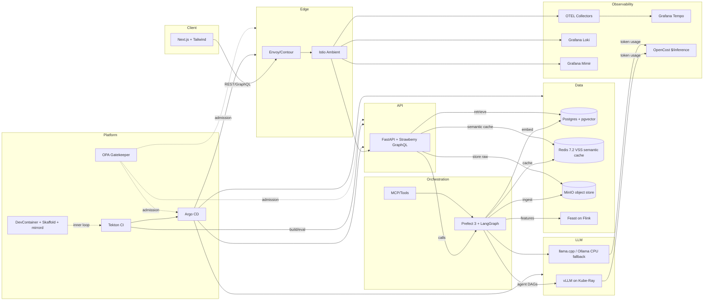

# Architecture Diagram & Integrations (Enterprise RAG Stack)

## Integration Notes (Bullet Guide)
- **Frontend → API**: Next.js UI talks to FastAPI/Strawberry over REST/GraphQL for chat, uploads, model selection.
- **Ingress/Mesh**: Envoy/Contour terminates TLS and routes into Istio Ambient, which enforces mTLS/policies/telemetry for all services.
- **API → Orchestration**: FastAPI invokes Prefect/LangGraph flows for agent actions, scraping, ingestion, and evaluations; MCP tools can be surfaced into flows.
- **API → Data**: Stores raw docs in MinIO; writes metadata/chunks/embeddings to Postgres/pgvector; checks Redis for semantic cache.
- **Retrieval → LLM**: API/RAG services fetch context from Postgres/pgvector (optionally Redis cache), then call LLM service choosing vLLM (Ray) or llama.cpp CPU fallback (or external APIs if configured).
- **Features**: Feast on Flink serves features to Prefect/LangGraph or API for routing/scoring/personalization.
- **Observability**: OTEL exporters emit traces/logs/metrics to Tempo/Loki/Mimir; token/cost metrics labeled for OpenCost to compute $/inference.
- **Platform/GitOps**: Tekton builds/tests/evals and feeds Argo CD; Argo applies manifests/Helm; OPA Gatekeeper enforces admission policies (non-root, TLS, signing). DevContainer/Skaffold/mirrord support local dev and live-sync.

Use this diagram + bullets as a map for how requests, data, and control signals move through the stack.
