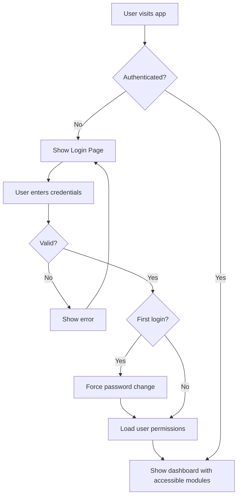

# Priority 0 Enhancement Request: UI/UX & RBAC System Overhaul

**Date Created**: 2025-11-27
**Priority**: P0 (HIGHEST - Foundation for Enterprise Use)
**Category**: User Experience, Security, Access Control, Audit & Compliance
**Estimated Effort**: 6-8 weeks (Full-time development)
**Status**: 📋 PLANNING

---

## Executive Summary

This document outlines a comprehensive enhancement plan to transform the current RAG chatbot into an enterprise-grade, multi-tenant, role-based application with robust access control, audit trails, and enhanced user experience inspired by ChatGPT/Claude AI best practices.

**Core Objectives:**
1. Implement enterprise-grade RBAC (Role-Based Access Control)
2. Enhance UI/UX with consistent theming and user-centric design
3. Establish comprehensive audit logging and traceability
4. Introduce project-based file organization and management
5. Add prompt library and output template management
6. Implement chat history and export capabilities

---

## Enhancement Breakdown

### 🎨 **Enhancement 0: UI Theme & Consistency**
**Priority**: P0
**Effort**: 1 week
**Dependencies**: None

#### Description
Implement a consistent, professional UI theme across the entire application using a centralized theme management system.

#### Requirements
- Create `frontend/src/theme/` directory structure
- Define color palette, typography, spacing, components
- Apply theme consistently across all pages
- Support light/dark mode toggle
- Ensure WCAG 2.1 AA accessibility compliance

#### Technical Approach
```typescript
// frontend/src/theme/index.ts
export const theme = {
  colors: {
    primary: { main: '#2563eb', light: '#60a5fa', dark: '#1e40af' },
    secondary: { main: '#7c3aed', light: '#a78bfa', dark: '#5b21b6' },
    success: '#10b981',
    warning: '#f59e0b',
    error: '#ef4444',
    background: { main: '#ffffff', secondary: '#f9fafb' },
    text: { primary: '#111827', secondary: '#6b7280' }
  },
  typography: {
    fontFamily: 'Inter, system-ui, sans-serif',
    fontSize: { xs: 12, sm: 14, base: 16, lg: 18, xl: 20 }
  },
  spacing: { xs: 4, sm: 8, md: 16, lg: 24, xl: 32 },
  borderRadius: { sm: 4, md: 8, lg: 12 }
}
```

#### Deliverables
- [ ] Theme configuration files
- [ ] Updated all components to use theme
- [ ] Light/dark mode toggle
- [ ] Theme documentation

---

### 🔐 **Enhancement 1-4: Robust RBAC Model**
**Priority**: P0
**Effort**: 2 weeks
**Dependencies**: Enhancement 0

#### Description
Implement a comprehensive Role-Based Access Control system with hierarchical organizational structure.

#### Organizational Structure

```
Enterprise
├── Admin (System-wide access)
├── CxO (Executive level)
├── Data Operations
│   ├── Data Team 1
│   ├── Data Team 2
│   ├── Data Team 3
│   ├── Data Team 4
│   ├── Data Team 5
│   ├── Data Team 6
│   ├── Data Team 7
│   ├── Data Team 8
│   ├── Data Team 9
│   ├── Data Team 10
│   ├── Data Team 11
│   ├── Data Team 12
│   ├── Data Team 13
│   ├── Data Team 14
│   ├── Data Team 15
│   └── Data Team 16
├── Technology
│   ├── Tech Team 1
│   ├── Tech Team 2
│   ├── Tech Team 3
│   ├── Tech Team 4
│   ├── Tech Team 5
│   ├── Tech Team 6
│   ├── Tech Team 7
│   ├── Tech Team 8
│   ├── Tech Team 9
│   ├── Tech Team 10
│   ├── Tech Team 11
│   └── Tech Team 12
└── Support Functions
    ├── Marketing
    ├── Sales
    └── HR
```

#### Database Schema

```sql
-- Roles table
CREATE TABLE roles (
    id UUID PRIMARY KEY DEFAULT uuid_generate_v4(),
    name VARCHAR(100) UNIQUE NOT NULL,
    parent_role_id UUID REFERENCES roles(id),
    description TEXT,
    created_at TIMESTAMP WITH TIME ZONE DEFAULT NOW(),
    updated_at TIMESTAMP WITH TIME ZONE DEFAULT NOW()
);

-- Departments table
CREATE TABLE departments (
    id UUID PRIMARY KEY DEFAULT uuid_generate_v4(),
    name VARCHAR(100) UNIQUE NOT NULL,
    parent_department_id UUID REFERENCES departments(id),
    description TEXT,
    created_at TIMESTAMP WITH TIME ZONE DEFAULT NOW()
);

-- Modules table
CREATE TABLE modules (
    id UUID PRIMARY KEY DEFAULT uuid_generate_v4(),
    name VARCHAR(100) UNIQUE NOT NULL,
    code VARCHAR(50) UNIQUE NOT NULL,
    description TEXT,
    icon VARCHAR(50),
    route VARCHAR(100),
    is_active BOOLEAN DEFAULT TRUE,
    created_at TIMESTAMP WITH TIME ZONE DEFAULT NOW()
);

-- Role-Module permissions
CREATE TABLE role_module_permissions (
    id UUID PRIMARY KEY DEFAULT uuid_generate_v4(),
    role_id UUID REFERENCES roles(id) ON DELETE CASCADE,
    module_id UUID REFERENCES modules(id) ON DELETE CASCADE,
    can_read BOOLEAN DEFAULT FALSE,
    can_write BOOLEAN DEFAULT FALSE,
    can_delete BOOLEAN DEFAULT FALSE,
    can_share BOOLEAN DEFAULT FALSE,
    created_at TIMESTAMP WITH TIME ZONE DEFAULT NOW(),
    UNIQUE(role_id, module_id)
);

-- User-Role assignments
CREATE TABLE user_roles (
    id UUID PRIMARY KEY DEFAULT uuid_generate_v4(),
    user_id UUID REFERENCES users(id) ON DELETE CASCADE,
    role_id UUID REFERENCES roles(id) ON DELETE CASCADE,
    department_id UUID REFERENCES departments(id),
    assigned_at TIMESTAMP WITH TIME ZONE DEFAULT NOW(),
    assigned_by UUID REFERENCES users(id),
    UNIQUE(user_id, role_id, department_id)
);
```

#### Modules to Implement

1. **RAG Chat** (`rag_chat`)
   - Description: AI-powered document Q&A
   - Icon: MessageSquare

2. **Web Scraping** (`web_scraping`)
   - Description: Extract data from websites
   - Icon: Globe

3. **Data Extraction** (`data_extraction`)
   - Description: Extract structured data
   - Icon: FileText

4. **Project Estimator** (`project_estimator`)
   - Description: AI project cost estimation
   - Icon: Calculator

5. **File Management** (`file_management`)
   - Description: Manage uploaded documents
   - Icon: FolderOpen

6. **Admin Panel** (`admin_panel`)
   - Description: System administration
   - Icon: Settings

7. **Audit Logs** (`audit_logs`)
   - Description: View system audit trail
   - Icon: Shield

#### Deliverables
- [ ] Database migrations for RBAC tables
- [ ] Role/Department seed data
- [ ] Module registration system
- [ ] Permission middleware
- [ ] RBAC API endpoints
- [ ] Admin UI for role/permission management

---

### 👤 **Enhancement 5: Display Logged-in User**
**Priority**: P0
**Effort**: 2 days
**Dependencies**: Enhancement 1-4

#### Description
Display current user information prominently in the UI header/navbar.

#### UI Components

```typescript
// UserProfile component in header
interface UserProfileProps {
  user: {
    id: string;
    username: string;
    email: string;
    role: string;
    department: string;
    avatar?: string;
  };
}

const UserProfile: React.FC<UserProfileProps> = ({ user }) => (
  <div className="flex items-center gap-3">
    <Avatar src={user.avatar} fallback={user.username[0]} />
    <div>
      <p className="font-medium">{user.username}</p>
      <p className="text-sm text-gray-500">{user.role} · {user.department}</p>
    </div>
    <DropdownMenu>
      <DropdownMenuItem>Profile</DropdownMenuItem>
      <DropdownMenuItem>Settings</DropdownMenuItem>
      <DropdownMenuItem>Logout</DropdownMenuItem>
    </DropdownMenu>
  </div>
);
```

#### Deliverables
- [ ] User profile component
- [ ] Header integration
- [ ] Profile dropdown menu
- [ ] User context provider

---

### 📋 **Enhancement 6: Comprehensive Audit Logging**
**Priority**: P0
**Effort**: 1 week
**Dependencies**: Enhancement 1-4

#### Description
Log all user activities and sessions with complete traceability.

#### Audit Events to Track

1. **Authentication Events**
   - User login/logout
   - Password changes
   - Failed login attempts

2. **Session Events**
   - Session creation
   - Session termination
   - Session timeout

3. **Module Access**
   - Module access/exit
   - Permission checks (granted/denied)

4. **Data Operations**
   - File uploads (what, when, where)
   - File downloads
   - File deletions
   - Query executions
   - Web scraping jobs
   - Project estimations

5. **Configuration Changes**
   - Role assignments
   - Permission updates
   - System settings changes

#### Enhanced Audit Schema

```sql
CREATE TABLE audit_logs_enhanced (
    id UUID PRIMARY KEY DEFAULT uuid_generate_v4(),
    user_id UUID REFERENCES users(id),
    username VARCHAR(255),
    role_name VARCHAR(100),
    department_name VARCHAR(100),
    session_id VARCHAR(255) NOT NULL,

    -- Event classification
    event_category VARCHAR(50) NOT NULL, -- auth, session, module, data, config
    event_action VARCHAR(100) NOT NULL,  -- login, upload, delete, etc.
    event_status VARCHAR(20) NOT NULL,   -- success, failure, denied

    -- Context
    module_name VARCHAR(100),
    project_id UUID REFERENCES projects(id),
    project_name VARCHAR(255),

    -- Details
    resource_type VARCHAR(100),  -- file, query, role, etc.
    resource_id VARCHAR(255),
    resource_name VARCHAR(255),
    details JSONB,

    -- Technical
    ip_address VARCHAR(50),
    user_agent TEXT,
    request_method VARCHAR(10),
    request_path VARCHAR(500),
    response_code INTEGER,
    latency_ms FLOAT,
    error_message TEXT,

    -- Timestamps
    created_at TIMESTAMP WITH TIME ZONE DEFAULT NOW(),

    -- Indexes
    INDEX idx_audit_user_id (user_id),
    INDEX idx_audit_session_id (session_id),
    INDEX idx_audit_event_category (event_category),
    INDEX idx_audit_project_id (project_id),
    INDEX idx_audit_created_at (created_at)
);
```

#### Audit Service Implementation

```python
# backend/app/services/audit_service_enhanced.py
class AuditServiceEnhanced:
    @staticmethod
    async def log_event(
        user: User,
        session_id: str,
        event_category: str,
        event_action: str,
        event_status: str,
        module_name: str = None,
        project_id: str = None,
        resource_type: str = None,
        resource_id: str = None,
        details: dict = None,
        request: Request = None
    ):
        """Log an audit event"""
        audit_log = AuditLogEnhanced(
            user_id=user.id,
            username=user.username,
            role_name=user.role.name if user.role else None,
            department_name=user.department.name if user.department else None,
            session_id=session_id,
            event_category=event_category,
            event_action=event_action,
            event_status=event_status,
            module_name=module_name,
            project_id=project_id,
            resource_type=resource_type,
            resource_id=resource_id,
            details=details,
            ip_address=request.client.host if request else None,
            user_agent=request.headers.get('user-agent') if request else None
        )
        # Save to database
```

#### Deliverables
- [ ] Enhanced audit schema migration
- [ ] Audit service implementation
- [ ] Audit middleware for automatic logging
- [ ] Audit log viewer UI
- [ ] Audit export functionality (CSV, Excel, PDF)

---

### 🔒 **Enhancement 7-9: Authentication & Authorization**
**Priority**: P0
**Effort**: 1.5 weeks
**Dependencies**: Enhancement 1-6

#### Description
Implement secure login system with default admin account and module-based access control.

#### Features

1. **Clean Login Page**
   - Modern, professional design
   - Username/password fields
   - "Remember me" option
   - Password visibility toggle
   - Loading states
   - Error handling

2. **Default Admin Account**
   - Username: `admin`
   - Password: `admin` (force change on first login)
   - Full access to all roles and modules

3. **Module-Based Dashboard**
   - Show only modules user has access to
   - Card-based layout
   - Module icons and descriptions
   - Quick access shortcuts

#### UI Design

```typescript
// Login Page
const LoginPage = () => (
  <div className="min-h-screen flex items-center justify-center bg-gradient-to-br from-blue-50 to-indigo-100">
    <Card className="w-full max-w-md p-8">
      <Logo className="mb-6" />
      <h1 className="text-2xl font-bold mb-2">Welcome Back</h1>
      <p className="text-gray-600 mb-6">Sign in to your account</p>

      <form onSubmit={handleLogin}>
        <Input label="Username" name="username" required />
        <Input label="Password" name="password" type="password" required />
        <Checkbox label="Remember me" />
        <Button type="submit" fullWidth>Sign In</Button>
      </form>

      <p className="text-sm text-center mt-4">
        Forgot password? <Link to="/reset">Reset here</Link>
      </p>
    </Card>
  </div>
);

// Dashboard with accessible modules
const Dashboard = ({ user }) => {
  const accessibleModules = user.permissions.modules;

  return (
    <div className="grid grid-cols-1 md:grid-cols-2 lg:grid-cols-3 gap-6">
      {accessibleModules.map(module => (
        <ModuleCard
          key={module.code}
          title={module.name}
          description={module.description}
          icon={module.icon}
          onClick={() => navigate(module.route)}
        />
      ))}
    </div>
  );
};
```

#### Authentication Flow



#### Deliverables
- [ ] Login page UI
- [ ] Authentication API endpoints
- [ ] JWT token management
- [ ] Protected route middleware
- [ ] Password reset functionality
- [ ] Force password change on first login
- [ ] Module-based dashboard

---

### 📁 **Enhancement 10: Project-Based File Organization**
**Priority**: P0
**Effort**: 2 weeks
**Dependencies**: Enhancement 1-9

#### Description
Implement project management with hierarchical file organization in both MinIO and PostgreSQL.

#### Projects Schema

```sql
CREATE TABLE projects (
    id UUID PRIMARY KEY DEFAULT uuid_generate_v4(),
    name VARCHAR(255) NOT NULL,
    code VARCHAR(50) UNIQUE NOT NULL,
    description TEXT,
    created_by UUID REFERENCES users(id),
    department_id UUID REFERENCES departments(id),
    status VARCHAR(20) DEFAULT 'active', -- active, archived, closed
    metadata JSONB,
    created_at TIMESTAMP WITH TIME ZONE DEFAULT NOW(),
    updated_at TIMESTAMP WITH TIME ZONE DEFAULT NOW()
);

-- Updated documents table with project tracking
ALTER TABLE documents ADD COLUMN project_id UUID REFERENCES projects(id);
ALTER TABLE documents ADD COLUMN uploaded_by UUID REFERENCES users(id);
ALTER TABLE documents ADD COLUMN department_id UUID REFERENCES departments(id);
```

#### MinIO Directory Structure

```
minio://ragchatbot/
├── {username}/
│   ├── {role}/
│   │   ├── {department}/
│   │   │   ├── {project_name}/
│   │   │   │   ├── documents/
│   │   │   │   │   └── {filename}
│   │   │   │   ├── extractions/
│   │   │   │   │   └── {filename}
│   │   │   │   └── exports/
│   │   │   │       └── {filename}
```

**Example**: `john.doe/Admin/Technology/Project-Alpha/documents/requirements.pdf`

#### PostgreSQL Vector Store Tracking

```sql
-- Enhanced document_chunks with full traceability
ALTER TABLE document_chunks
ADD COLUMN project_id UUID REFERENCES projects(id),
ADD COLUMN uploaded_by UUID REFERENCES users(id),
ADD COLUMN department_id UUID REFERENCES departments(id),
ADD COLUMN minio_path VARCHAR(1024);

CREATE INDEX idx_chunks_project ON document_chunks(project_id);
CREATE INDEX idx_chunks_user ON document_chunks(uploaded_by);
```

#### UI Components

```typescript
// Project selector in file upload
const FileUploadWithProject = () => {
  const [selectedProject, setSelectedProject] = useState(null);

  return (
    <div>
      <ProjectSelector
        value={selectedProject}
        onChange={setSelectedProject}
        onCreate={handleCreateProject}
      />
      <FileDropzone
        project={selectedProject}
        onUpload={handleUpload}
      />
    </div>
  );
};

// Project management UI
const ProjectManagement = () => (
  <div>
    <Button onClick={handleCreateProject}>New Project</Button>
    <ProjectList>
      {projects.map(project => (
        <ProjectCard
          key={project.id}
          project={project}
          onView={() => viewProjectFiles(project)}
          onEdit={() => editProject(project)}
          onArchive={() => archiveProject(project)}
        />
      ))}
    </ProjectList>
  </div>
);
```

#### Deliverables
- [ ] Projects database schema
- [ ] Project CRUD API
- [ ] Project selector component
- [ ] MinIO path builder service
- [ ] Document upload with project tracking
- [ ] Project file browser
- [ ] Project management UI

---

### 🗑️ **Enhancement 11: File Management & Cleanup**
**Priority**: P0
**Effort**: 1 week
**Dependencies**: Enhancement 10

#### Description
Provide UI to browse, select, and delete files from both MinIO and PostgreSQL vector store.

#### Features

1. **Dual-Store File Browser**
   - View files in MinIO
   - View vector embeddings in PostgreSQL
   - Show file metadata (size, upload date, uploader, project)
   - Search and filter capabilities

2. **Bulk Operations**
   - Select multiple files
   - Delete selected files
   - Move files between projects
   - Archive files

3. **Storage Analytics**
   - Show storage usage by user/project/department
   - Identify large files
   - Show duplicate files
   - Storage quota management

#### UI Components

```typescript
const FileManagement = () => {
  const [selectedFiles, setSelectedFiles] = useState<string[]>([]);
  const [storageType, setStorageType] = useState<'minio' | 'vector'>('minio');

  return (
    <div>
      <Tabs value={storageType} onChange={setStorageType}>
        <Tab value="minio">MinIO Storage</Tab>
        <Tab value="vector">Vector Database</Tab>
      </Tabs>

      <Toolbar>
        <SearchInput placeholder="Search files..." />
        <FilterButton />
        <Button
          onClick={handleDeleteSelected}
          disabled={selectedFiles.length === 0}
          variant="destructive"
        >
          Delete Selected ({selectedFiles.length})
        </Button>
      </Toolbar>

      <FileTable
        storageType={storageType}
        selectedFiles={selectedFiles}
        onSelectionChange={setSelectedFiles}
        columns={['name', 'size', 'project', 'uploader', 'date', 'actions']}
      />

      <StorageStats />
    </div>
  );
};
```

#### API Endpoints

```python
# DELETE /api/v1/files/bulk
@router.delete("/files/bulk")
async def delete_files_bulk(
    file_ids: List[str],
    storage_type: str,  # 'minio' or 'vector' or 'both'
    user: User = Depends(get_current_user),
    db: Session = Depends(get_db)
):
    """Delete multiple files from storage"""
    # Check permissions
    # Delete from MinIO
    # Delete from PostgreSQL
    # Log audit event
    # Return deletion summary

# GET /api/v1/storage/analytics
@router.get("/storage/analytics")
async def get_storage_analytics(
    user: User = Depends(get_current_user),
    db: Session = Depends(get_db)
):
    """Get storage usage analytics"""
    return {
        "total_size": "...",
        "by_project": [...],
        "by_user": [...],
        "largest_files": [...]
    }
```

#### Deliverables
- [ ] File browser UI
- [ ] Multi-select functionality
- [ ] Delete API endpoints
- [ ] Storage analytics service
- [ ] Storage quota management
- [ ] Soft delete with recovery period

---

### 📤 **Enhancement 12: Chat Export Capabilities**
**Priority**: P0
**Effort**: 1 week
**Dependencies**: Enhancement 5-6

#### Description
Add export functionality to export chat conversations to Excel, Word, and PDF formats.

#### Export Formats

1. **Excel Export**
   - Conversation transcript in tabular format
   - Metadata sheet (user, date, project, model used)
   - Source documents sheet
   - Charts/analytics (if applicable)

2. **Word Export**
   - Professional document format
   - Header with metadata
   - Formatted Q&A sections
   - Source citations
   - Table of contents

3. **PDF Export**
   - Print-ready format
   - Company branding
   - Page numbers
   - Export timestamp
   - Digital signature option

#### UI Components

```typescript
const ChatExportButton = ({ conversationId }) => {
  const [exportFormat, setExportFormat] = useState<'excel' | 'word' | 'pdf'>('pdf');

  return (
    <DropdownMenu>
      <DropdownMenuTrigger>
        <Button>
          <Download className="mr-2" />
          Export
        </Button>
      </DropdownMenuTrigger>
      <DropdownMenuContent>
        <DropdownMenuItem onClick={() => handleExport('excel')}>
          <FileSpreadsheet className="mr-2" />
          Export to Excel
        </DropdownMenuItem>
        <DropdownMenuItem onClick={() => handleExport('word')}>
          <FileText className="mr-2" />
          Export to Word
        </DropdownMenuItem>
        <DropdownMenuItem onClick={() => handleExport('pdf')}>
          <FileText className="mr-2" />
          Export to PDF
        </DropdownMenuItem>
      </DropdownMenuContent>
    </DropdownMenu>
  );
};
```

#### Export Service

```python
# backend/app/services/export_service.py
from docx import Document
from reportlab.pdfgen import canvas
import openpyxl

class ExportService:
    @staticmethod
    async def export_to_excel(conversation_id: str, user: User):
        """Export conversation to Excel"""
        # Fetch conversation
        # Create workbook with multiple sheets
        # Return file path

    @staticmethod
    async def export_to_word(conversation_id: str, user: User):
        """Export conversation to Word"""
        # Fetch conversation
        # Create Word document with formatting
        # Return file path

    @staticmethod
    async def export_to_pdf(conversation_id: str, user: User):
        """Export conversation to PDF"""
        # Fetch conversation
        # Generate PDF with formatting
        # Return file path
```

#### Deliverables
- [ ] Excel export service
- [ ] Word export service
- [ ] PDF export service
- [ ] Export button in chat UI
- [ ] Export history tracking
- [ ] Export templates

---

### 📜 **Enhancement 13: Chat History & Session Management**
**Priority**: P0
**Effort**: 1 week
**Dependencies**: Enhancement 5-6

#### Description
Implement comprehensive chat history to track all user conversations.

#### Features

1. **Conversation List**
   - Show all past conversations
   - Group by date (Today, Yesterday, Last 7 days, etc.)
   - Search conversations
   - Filter by project, date range
   - Pin important conversations

2. **Conversation Details**
   - Full message history
   - Metadata (model used, latency, tokens)
   - Source documents
   - Export option
   - Share conversation

3. **Session Persistence**
   - Auto-save conversations
   - Resume interrupted sessions
   - Sync across devices

#### UI Components

```typescript
const ChatHistory = () => {
  const conversations = useConversations();

  return (
    <div className="flex h-screen">
      <Sidebar className="w-80 border-r">
        <SearchInput placeholder="Search conversations..." />

        <ConversationList>
          {conversations.groupByDate().map(group => (
            <ConversationGroup key={group.label} label={group.label}>
              {group.conversations.map(conv => (
                <ConversationItem
                  key={conv.id}
                  conversation={conv}
                  onClick={() => loadConversation(conv.id)}
                />
              ))}
            </ConversationGroup>
          ))}
        </ConversationList>

        <Button onClick={handleNewConversation}>
          New Conversation
        </Button>
      </Sidebar>

      <ChatInterface conversationId={selectedConversation} />
    </div>
  );
};
```

#### Database Schema

```sql
CREATE TABLE conversations_enhanced (
    id UUID PRIMARY KEY DEFAULT uuid_generate_v4(),
    user_id UUID REFERENCES users(id) NOT NULL,
    project_id UUID REFERENCES projects(id),
    title VARCHAR(255),
    summary TEXT,
    is_pinned BOOLEAN DEFAULT FALSE,
    metadata JSONB,
    created_at TIMESTAMP WITH TIME ZONE DEFAULT NOW(),
    updated_at TIMESTAMP WITH TIME ZONE DEFAULT NOW(),
    last_message_at TIMESTAMP WITH TIME ZONE
);

CREATE INDEX idx_conversations_user ON conversations_enhanced(user_id);
CREATE INDEX idx_conversations_project ON conversations_enhanced(project_id);
CREATE INDEX idx_conversations_last_message ON conversations_enhanced(last_message_at DESC);
```

#### Deliverables
- [ ] Enhanced conversation schema
- [ ] Conversation list UI
- [ ] Search and filter functionality
- [ ] Pin/unpin conversations
- [ ] Auto-save mechanism
- [ ] Conversation sharing

---

### 📂 **Enhancement 14: Project Management**
**Priority**: P0
**Effort**: 3 days
**Dependencies**: Enhancement 10

#### Description
Allow users to create, manage, and select projects for all operations.

#### Features

1. **Project Creation**
   - Name, description, code
   - Department assignment
   - Team members
   - Start/end dates

2. **Project Dashboard**
   - Overview statistics
   - Recent files
   - Recent conversations
   - Team activity

3. **Project Context**
   - All uploads tagged to project
   - All conversations linked to project
   - All exports saved to project folder

#### UI Flow

```
User logs in
  → Sees project selector in header
  → Selects active project OR creates new project
  → All subsequent operations use selected project context
  → Files uploaded → stored in project folder
  → Conversations → linked to project
  → Exports → saved in project exports folder
```

#### Deliverables
- [ ] Project creation UI
- [ ] Project selector component
- [ ] Project context provider
- [ ] Project dashboard
- [ ] Project team management

---

### 📝 **Enhancement 15: Prompt Library & Output Templates**
**Priority**: P0
**Effort**: 2 weeks
**Dependencies**: Enhancement 1-14

#### Description
Implement prompt library for reusable prompts and output templates for consistent formatting.

#### Features

1. **Prompt Library**
   - Save frequently used prompts
   - Share prompts across users
   - Categorize prompts by use case
   - Rate prompts (community-driven)
   - Version prompts

2. **Output Templates**
   - Define Excel templates
   - Define Word templates
   - Define PowerPoint templates
   - Variable substitution
   - Template preview

3. **Template Application**
   - Select template before query
   - AI formats response according to template
   - Generate output in desired format

#### Database Schema

```sql
-- Prompt Library
CREATE TABLE prompt_library (
    id UUID PRIMARY KEY DEFAULT uuid_generate_v4(),
    title VARCHAR(255) NOT NULL,
    description TEXT,
    prompt_text TEXT NOT NULL,
    category VARCHAR(100),
    tags TEXT[],

    created_by UUID REFERENCES users(id),
    is_shared BOOLEAN DEFAULT FALSE,
    is_public BOOLEAN DEFAULT FALSE,

    usage_count INTEGER DEFAULT 0,
    average_rating DECIMAL(3,2),

    created_at TIMESTAMP WITH TIME ZONE DEFAULT NOW(),
    updated_at TIMESTAMP WITH TIME ZONE DEFAULT NOW()
);

-- Output Templates
CREATE TABLE output_templates (
    id UUID PRIMARY KEY DEFAULT uuid_generate_v4(),
    name VARCHAR(255) NOT NULL,
    description TEXT,
    template_type VARCHAR(50) NOT NULL, -- excel, word, ppt, json
    template_file_path VARCHAR(1024),
    template_config JSONB,

    created_by UUID REFERENCES users(id),
    is_shared BOOLEAN DEFAULT FALSE,

    created_at TIMESTAMP WITH TIME ZONE DEFAULT NOW(),
    updated_at TIMESTAMP WITH TIME ZONE DEFAULT NOW()
);

-- Prompt ratings
CREATE TABLE prompt_ratings (
    id UUID PRIMARY KEY DEFAULT uuid_generate_v4(),
    prompt_id UUID REFERENCES prompt_library(id) ON DELETE CASCADE,
    user_id UUID REFERENCES users(id),
    rating INTEGER CHECK (rating >= 1 AND rating <= 5),
    feedback TEXT,
    created_at TIMESTAMP WITH TIME ZONE DEFAULT NOW(),
    UNIQUE(prompt_id, user_id)
);
```

#### UI Components

```typescript
// Prompt Library Browser
const PromptLibrary = () => {
  const [prompts, setPrompts] = useState([]);
  const [selectedCategory, setSelectedCategory] = useState('all');

  return (
    <div>
      <Toolbar>
        <SearchInput placeholder="Search prompts..." />
        <CategoryFilter value={selectedCategory} onChange={setSelectedCategory} />
        <Button onClick={handleCreatePrompt}>New Prompt</Button>
      </Toolbar>

      <PromptGrid>
        {prompts.map(prompt => (
          <PromptCard
            key={prompt.id}
            prompt={prompt}
            onUse={() => usePrompt(prompt)}
            onRate={() => ratePrompt(prompt)}
            onShare={() => sharePrompt(prompt)}
          />
        ))}
      </PromptGrid>
    </div>
  );
};

// Chat with Prompt & Template Selection
const EnhancedChatInterface = () => {
  const [selectedPrompt, setSelectedPrompt] = useState(null);
  const [selectedTemplate, setSelectedTemplate] = useState(null);

  return (
    <div>
      <div className="flex gap-4 mb-4">
        <Select
          placeholder="Load predefined prompt..."
          options={prompts}
          value={selectedPrompt}
          onChange={setSelectedPrompt}
        />
        <Select
          placeholder="Select output template..."
          options={templates}
          value={selectedTemplate}
          onChange={setSelectedTemplate}
        />
      </div>

      <ChatInput
        initialValue={selectedPrompt?.prompt_text}
        outputTemplate={selectedTemplate}
      />
    </div>
  );
};
```

#### Template Variables

```javascript
// Example Excel template config
{
  "templateType": "excel",
  "sheets": [
    {
      "name": "Summary",
      "cells": {
        "A1": "{{title}}",
        "A3": "{{query}}",
        "A5": "{{answer}}",
        "A10": "Generated: {{timestamp}}"
      }
    },
    {
      "name": "Sources",
      "table": {
        "startCell": "A1",
        "headers": ["Document", "Relevance", "Content"],
        "data": "{{sources}}"
      }
    }
  ]
}
```

#### Deliverables
- [ ] Prompt library schema
- [ ] Output template schema
- [ ] Prompt CRUD API
- [ ] Template CRUD API
- [ ] Prompt library UI
- [ ] Template editor UI
- [ ] Prompt selector in chat
- [ ] Template application service
- [ ] Prompt rating system
- [ ] Template preview functionality

---

## Implementation Roadmap

### Phase 1: Foundation (Weeks 1-3)
**Priority: HIGHEST**

#### Week 1: UI Theme & RBAC Schema
- [ ] Create theme system
- [ ] Apply theme across app
- [ ] Create RBAC database schema
- [ ] Seed roles and departments
- [ ] Create module registry

#### Week 2: Authentication & Authorization
- [ ] Build login page
- [ ] Implement JWT authentication
- [ ] Create permission middleware
- [ ] Build role/permission management UI
- [ ] Implement module-based dashboard

#### Week 3: Audit Logging
- [ ] Enhance audit schema
- [ ] Build audit service
- [ ] Create audit middleware
- [ ] Build audit log viewer UI
- [ ] Implement audit exports

### Phase 2: Project & File Management (Weeks 4-5)

#### Week 4: Project Management
- [ ] Create projects schema
- [ ] Build project CRUD API
- [ ] Create project selector UI
- [ ] Implement project context
- [ ] Build project dashboard

#### Week 5: File Management
- [ ] Update documents schema with project tracking
- [ ] Implement MinIO path builder
- [ ] Build file browser UI
- [ ] Create storage analytics
- [ ] Implement bulk delete functionality

### Phase 3: User Experience Enhancements (Weeks 6-7)

#### Week 6: Chat History & Export
- [ ] Enhance conversation schema
- [ ] Build conversation list UI
- [ ] Implement search/filter
- [ ] Create Excel export service
- [ ] Create Word export service
- [ ] Create PDF export service

#### Week 7: Prompt Library & Templates
- [ ] Create prompt library schema
- [ ] Create output templates schema
- [ ] Build prompt library UI
- [ ] Build template editor UI
- [ ] Implement template application service

### Phase 4: Integration & Testing (Week 8)

#### Week 8: Testing & Documentation
- [ ] Integration testing
- [ ] User acceptance testing
- [ ] Performance testing
- [ ] Security audit
- [ ] Documentation
- [ ] Training materials
- [ ] Deployment

---

## Success Metrics

1. **Security & Compliance**
   - ✅ 100% of actions logged in audit trail
   - ✅ Zero unauthorized access attempts succeed
   - ✅ All users assigned appropriate roles

2. **User Experience**
   - ✅ Login to first action < 10 seconds
   - ✅ 90% user satisfaction score
   - ✅ <5% support tickets related to navigation

3. **Data Management**
   - ✅ 100% files traceable to user/project
   - ✅ Storage reduction of 20% through cleanup tools
   - ✅ Zero data loss incidents

4. **Productivity**
   - ✅ 40% time saved using prompt library
   - ✅ 50% faster report generation with templates
   - ✅ 80% of users actively using chat history

---

## Risk Assessment

| Risk | Impact | Probability | Mitigation |
|------|--------|-------------|------------|
| RBAC complexity causes delays | High | Medium | Start with simplified role model, iterate |
| Data migration issues | High | Low | Thorough backup before migration, rollback plan |
| User adoption resistance | Medium | Medium | Comprehensive training, phased rollout |
| Performance degradation | Medium | Low | Load testing, query optimization |
| Security vulnerabilities | High | Low | Security audit, penetration testing |

---

## Dependencies

### External Libraries Needed

**Backend:**
- `python-docx` - Word document generation
- `openpyxl` - Excel generation
- `reportlab` - PDF generation
- `PyJWT` - JWT tokens
- `bcrypt` - Password hashing

**Frontend:**
- `@radix-ui/react-*` - UI components
- `lucide-react` - Icons
- `react-query` - Data fetching
- `zustand` - State management
- `react-hook-form` - Form handling

---

## Testing Strategy

1. **Unit Tests**
   - RBAC permission checks
   - Audit logging
   - Export services
   - Template rendering

2. **Integration Tests**
   - Login flow
   - File upload with project tracking
   - Conversation export
   - Prompt library usage

3. **E2E Tests**
   - Complete user journey
   - Multi-role scenarios
   - File management workflows

4. **Security Tests**
   - Penetration testing
   - SQL injection attempts
   - XSS attempts
   - Authorization bypass attempts

---

## Documentation Requirements

1. **User Documentation**
   - User guide for each role
   - Quick start guide
   - Video tutorials
   - FAQs

2. **Admin Documentation**
   - Role management guide
   - Audit log interpretation
   - System configuration
   - Backup/restore procedures

3. **Developer Documentation**
   - API documentation
   - Database schema documentation
   - Deployment guide
   - Troubleshooting guide

---

## Deployment Plan

### Pre-Deployment
- [ ] Backup current database
- [ ] Backup MinIO storage
- [ ] Test rollback procedure
- [ ] Notify users of downtime

### Deployment
- [ ] Deploy database migrations
- [ ] Deploy backend changes
- [ ] Deploy frontend changes
- [ ] Seed initial data (roles, admin user)
- [ ] Verify system health

### Post-Deployment
- [ ] Monitor error logs
- [ ] Check audit logs
- [ ] User feedback collection
- [ ] Performance monitoring
- [ ] Hotfix readiness

---

## Budget & Resources

### Development Team
- 1x Full-stack Developer (6-8 weeks)
- 1x UI/UX Designer (2 weeks)
- 1x QA Engineer (2 weeks)
- 1x DevOps Engineer (1 week)

### Infrastructure
- Staging environment setup
- Additional MinIO storage
- Enhanced monitoring tools

### Estimated Cost
- Development: 6-8 weeks @ full-time rate
- Infrastructure: ~$500/month additional
- Testing tools: ~$200/month

---

## Approval & Sign-off

| Stakeholder | Role | Approval | Date |
|-------------|------|----------|------|
| Product Owner | Requirements | ☐ | |
| Tech Lead | Architecture | ☐ | |
| Security Lead | Security Review | ☐ | |
| Business Owner | Budget | ☐ | |

---

## Appendix

### A. Mockups & Wireframes
_(To be added during design phase)_

### B. API Specifications
_(To be added during development)_

### C. Database Migration Scripts
_(To be added during development)_

### D. Test Cases
_(To be added during testing phase)_

---

**Document Version**: 1.0
**Last Updated**: 2025-11-27
**Next Review Date**: 2025-12-04

---

**END OF ENHANCEMENT REQUEST**
