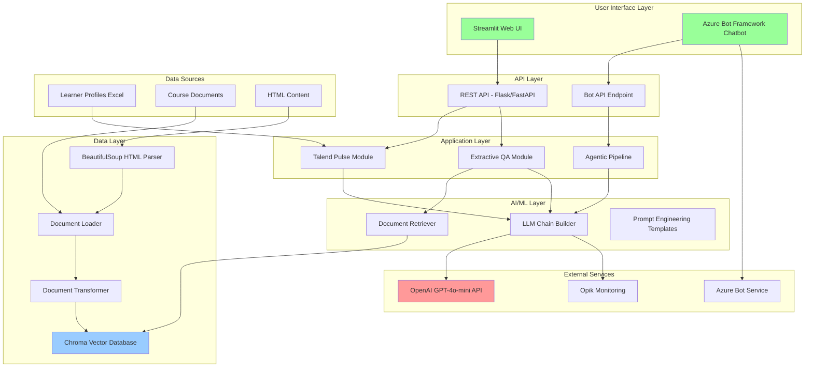
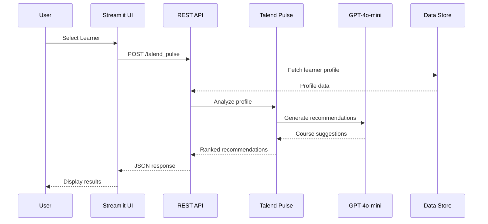
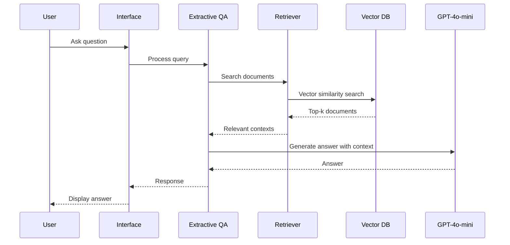

# British Council POC - Technical Architecture

## Architecture Overview

The British Council Profile Matcher is built on a modern, scalable AI architecture leveraging Retrieval-Augmented Generation (RAG), Large Language Models (LLMs), and vector databases to provide intelligent course recommendations.

## System Architecture Diagram



## Component Architecture

### 1. User Interface Layer

#### Streamlit Web Application (`app.py`)
- **Technology**: Streamlit
- **Purpose**: Interactive web-based UI for profile matching
- **Features**:
  - Learner selection from dropdown
  - Profile visualization
  - Course recommendation display
  - Real-time processing feedback

#### Azure Bot Framework Chatbot (`chat_bot/`)
- **Technology**: Microsoft Bot Framework SDK, Bot Framework Emulator
- **Purpose**: Conversational interface for course queries
- **Features**:
  - Natural language interaction
  - Context-aware responses
  - Integration with RAG pipeline
  - Multi-turn conversations

**Key Files**:
- `chat_bot/app.py`: Bot application server
- `chat_bot/bot.py`: Bot logic and conversation flow
- `chat_bot/config.py`: Bot configuration

### 2. API Layer

#### REST API (`api.py`)
- **Endpoints**:
  - `/talend_pulse`: Profile matching endpoint
  - `/extractive_qa`: Question-answering endpoint
- **Authentication**: HTTP Basic Auth
- **Response Format**: JSON

### 3. Application Layer

#### Talend Pulse Module (`modules/talend_pulse/`)
- **Purpose**: Core profile matching and course recommendation logic
- **Functionality**:
  - Learner profile analysis
  - Skill and interest extraction
  - Course matching algorithm
  - Recommendation ranking

**Key File**: `talend_pulse.py`

#### Extractive QA Module (`modules/extractive_qa/`)
- **Purpose**: Document-based question answering using RAG
- **Components**:
  - Document loader and parser
  - Text chunking and transformation
  - Vector database management
  - Retrieval and generation pipeline

**Key Files**:
- `extractor.py`: Main QA extraction logic
- `agentic_pipeline.py`: Agent-based processing pipeline

### 4. AI/ML Layer

#### Document Retriever (`doc_retriever/`)
- **Purpose**: Semantic search over course documents
- **Technology**: Vector similarity search
- **Process**:
  1. Convert queries to embeddings
  2. Search vector database
  3. Retrieve top-k relevant documents
  4. Re-rank results

**Key File**: `document_retriever.py`

#### LLM Chain Builder (`llm/`)
- **Purpose**: Construct and execute LLM prompts
- **Technology**: LangChain
- **Features**:
  - Prompt template management
  - Chain composition
  - Context injection
  - Response parsing

**Key File**: `llm_chain_builder.py`

#### Prompt Engineering (`prompt_engineering/`)
- **Purpose**: Structured prompt templates for different use cases
- **Templates**:
  - Profile analysis prompts
  - Course recommendation prompts
  - Question-answering prompts
  - Skill extraction prompts

**Key File**: `template/pulse_templates.py`

### 5. Data Processing Layer

#### Document Loader (`loader/`)
- **Purpose**: Load and parse various document formats
- **Supported Formats**:
  - HTML (via BeautifulSoup)
  - PDF
  - Text files
  - Structured data (Excel, CSV)

**Key Files**:
- `document_loader.py`: Main loading logic
- `bs_html_parser.py`: HTML parsing with BeautifulSoup
- `document_transformer.py`: Text chunking and transformation

#### Vector Database (`vector_db/`)
- **Technology**: ChromaDB
- **Purpose**: Efficient semantic search and retrieval
- **Features**:
  - Document embedding storage
  - Similarity search
  - Metadata filtering
  - Persistence

**Key File**: `chroma_vector.py`

### 6. Infrastructure Components

#### Configuration Management (`utils/`)
- **Technology**: YAML configuration files
- **Files**:
  - `config/common_config.yaml`: LLM settings, API credentials, logging
  - `config/rag_config.yaml`: RAG pipeline parameters
  - `config/talend_pulse_config.yaml`: Profile matching configuration

**Key File**: `utils/config_reader.py`

#### Logging and Monitoring (`utils/`)
- **Logging**: Structured logging with contextual information
- **Monitoring**: Opik integration for LLM observability

**Key File**: `utils/log_writer.py`

## Technical Stack

### Core Technologies

| Component | Technology | Version |
|-----------|-----------|---------|
| Programming Language | Python | 3.8+ |
| Web Framework | Streamlit | Latest |
| Bot Framework | Microsoft Bot Framework | 4.x |
| LLM Orchestration | LangChain | Latest |
| Vector Database | ChromaDB | Latest |
| HTML Parsing | BeautifulSoup4 | Latest |
| HTTP Client | Requests | Latest |

### AI/ML Technologies

| Component | Technology | Purpose |
|-----------|-----------|---------|
| LLM | OpenAI GPT-4o-mini | Natural language generation |
| Embeddings | OpenAI Embeddings | Text vectorization |
| Vector Search | ChromaDB | Semantic similarity search |
| Observability | Opik | LLM monitoring and tracking |

### Infrastructure

| Component | Technology |
|-----------|-----------|
| Web Server | Streamlit built-in server |
| Bot Server | AIOHTTP (async) |
| Authentication | HTTP Basic Auth |
| Configuration | YAML |
| Logging | Python logging |

## Data Flow

### Profile Matching Flow



### RAG Query Flow



## Deployment Architecture

### Local Development
- Streamlit app: `streamlit run app.py`
- Bot server: `python chat_bot/app.py`
- Port 3978 for bot endpoint

### Production Deployment (Azure)
- Azure App Service for web application
- Azure Bot Service for chatbot
- Azure Storage for vector database persistence
- Environment variables for credentials
- HTTPS endpoints

## Security Architecture

### Authentication & Authorization
- HTTP Basic Auth for API endpoints
- Environment variables for credentials (`usr`, `pwd`)
- Azure AD integration (for Bot Framework)

### Data Security
- Secure credential storage (environment variables)
- No hardcoded secrets
- Encrypted communication (HTTPS)
- Data anonymization where applicable

### API Security
- Rate limiting (configurable)
- Input validation
- Error handling without information leakage

## Scalability Considerations

### Horizontal Scaling
- Stateless API design
- Load balancer support
- Shared vector database

### Performance Optimization
- Vector database indexing
- Document caching
- Batch processing for multiple queries
- Async operations (bot framework)

### Resource Management
- Configurable LLM parameters (temperature, max tokens)
- Document chunking strategies
- Connection pooling

## Configuration Management

### Common Configuration (`common_config.yaml`)
```yaml
llm_config:
  model_name: gpt-4o-mini
  temperature: 0.3
  max_tokens: 1000

api_params:
  host: localhost
  port: 8000

opik:
  project_name: british_council
```

### RAG Configuration (`rag_config.yaml`)
```yaml
retriever:
  top_k: 5
  similarity_threshold: 0.7

chunking:
  chunk_size: 1000
  chunk_overlap: 200
```

### Talend Pulse Configuration (`talend_pulse_config.yaml`)
```yaml
learner_files: data/learners.xlsx
data_folder: data/profiles/
max_recommendations: 5
```

## Monitoring and Observability

### Logging
- Structured JSON logging
- Log levels: DEBUG, INFO, WARNING, ERROR
- Context-rich error messages
- Request/response logging

### LLM Monitoring (Opik)
- Token usage tracking
- Latency monitoring
- Cost tracking
- Prompt/response logging
- Quality metrics

### Application Monitoring
- API endpoint metrics
- Response times
- Error rates
- User activity tracking

## Integration Points

### External APIs
1. **OpenAI API**: LLM and embedding services
2. **Azure Bot Service**: Bot management and channels
3. **Opik API**: Observability and monitoring

### Data Sources
1. **Learner Profiles**: Excel files with student data
2. **Course Documents**: HTML, PDF, text files
3. **Configuration Files**: YAML configurations

## Error Handling and Resilience

### Error Handling Strategy
- Try-catch blocks with detailed logging
- User-friendly error messages in UI
- Graceful degradation
- Retry logic for API calls

### Resilience Patterns
- Timeout configuration
- Circuit breaker for external APIs
- Fallback responses
- Health check endpoints

## Future Architecture Enhancements

1. **Microservices Architecture**: Separate services for different modules
2. **Message Queue**: Asynchronous processing with RabbitMQ/Kafka
3. **Caching Layer**: Redis for response caching
4. **Multi-LLM Support**: Provider abstraction for multiple LLM backends
5. **GraphQL API**: More flexible API querying
6. **Containerization**: Docker/Kubernetes deployment
7. **CDN Integration**: Static asset delivery optimization
8. **Advanced Monitoring**: Prometheus + Grafana dashboards
