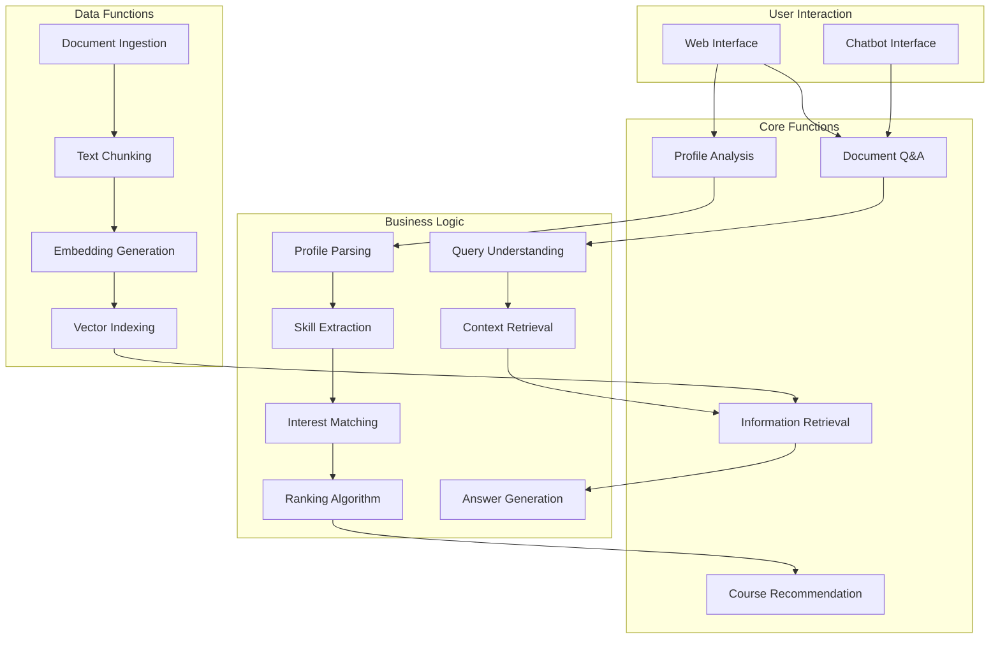
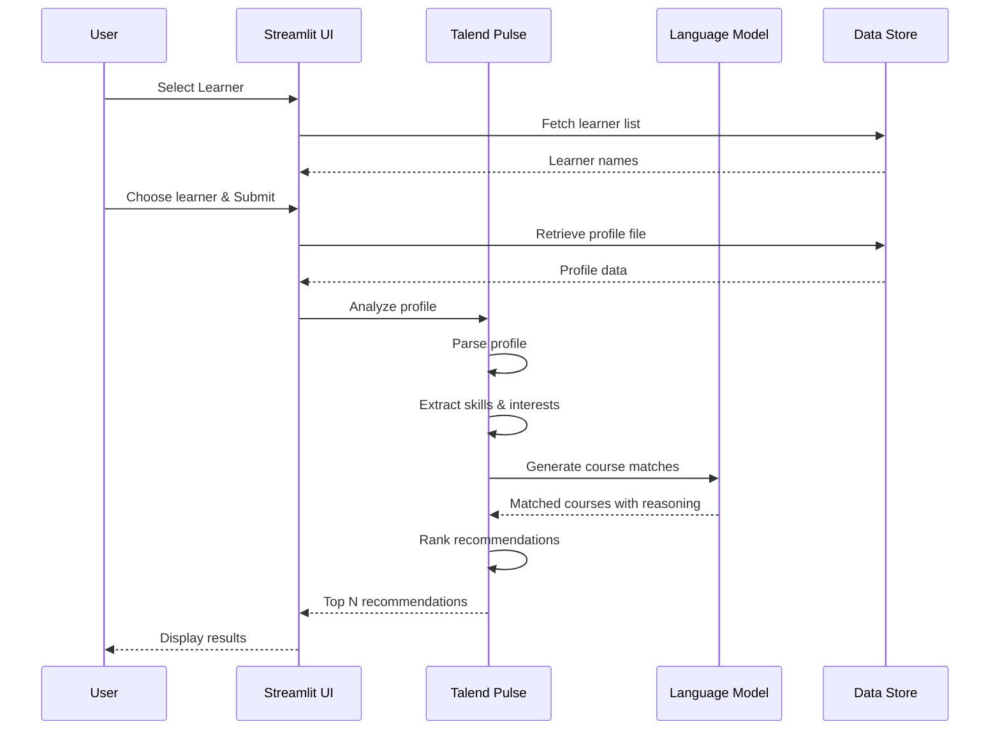
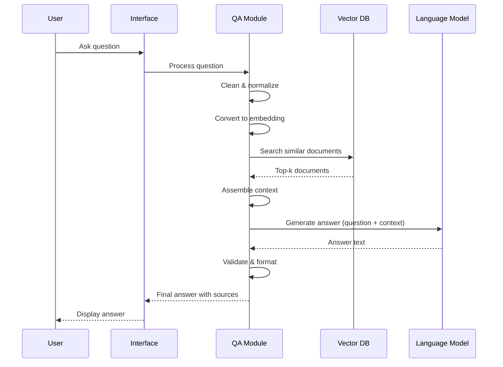
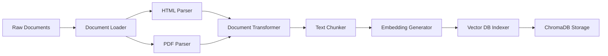

# British Council POC - Functional Architecture

## Functional Overview

The British Council Profile Matcher system consists of two primary functional modules: **Profile Matching (Talend Pulse)** and **Extractive Question Answering (RAG)**. This document describes the functional architecture, workflows, and business logic of each module.

## Functional Architecture Diagram

## Module 1: Profile Matching (Talend Pulse)

### Functional Description

The Talend Pulse module analyzes learner profiles and recommends the most suitable courses based on multiple matching criteria including skills, interests, educational background, career goals, and preferences.

### Key Functions

#### 1. Learner Profile Selection
- **Input**: User selects a learner from dropdown
- **Process**:
  - Load learner database from Excel
  - Display available learners
  - Retrieve selected learner's profile file
- **Output**: Learner profile data loaded into session

#### 2. Profile Analysis
- **Input**: Learner profile (text/structured data)
- **Process**:
  - Parse profile information
  - Extract key attributes:
    - Educational background
    - Current skills and competencies
    - Areas of interest
    - Career aspirations
    - Learning preferences
    - Previous courses (if any)
    - Language proficiency
  - Structure data for matching
- **Output**: Structured learner profile object

#### 3. Skill Extraction and Categorization
- **Input**: Profile text and structured data
- **Process**:
  - Use NLP to extract mentioned skills
  - Categorize skills (technical, soft skills, languages, etc.)
  - Assess skill levels (beginner, intermediate, advanced)
  - Identify skill gaps for career goals
- **Output**: Categorized skill inventory

#### 4. Interest and Goal Alignment
- **Input**: Career goals, interests, profile data
- **Process**:
  - Identify stated career objectives
  - Extract learning interests and preferences
  - Map interests to subject domains
  - Align career goals with course outcomes
- **Output**: Interest and goal vectors

#### 5. Course Matching Algorithm
- **Input**: Structured learner profile, course database
- **Process**:
  - Compare learner profile against course requirements
  - Calculate match scores based on:
    - Prerequisite alignment (30%)
    - Interest relevance (25%)
    - Career goal alignment (25%)
    - Skill development potential (20%)
  - Apply weighting factors
  - Filter unsuitable courses
- **Output**: Ranked list of matching courses

#### 6. Recommendation Generation
- **Input**: Matched courses with scores
- **Process**:
  - Select top N courses (configurable, default 5)
  - Generate explanations for each recommendation
  - Include course details: name, description, duration, level
  - Provide reasoning: "This course is recommended because..."
- **Output**: Formatted recommendations with justifications

#### 7. Results Presentation
- **Input**: Recommendations and learner information
- **Process**:
  - Format student information summary
  - Create recommendation table
  - Add visual elements (scores, badges)
  - Generate actionable next steps
- **Output**: User-friendly recommendation display

### Functional Workflow

### Business Rules

1. **Minimum Match Threshold**: Course must have ≥60% match score
2. **Maximum Recommendations**: Top 5 courses shown by default
3. **Prerequisite Validation**: Ensure learner meets minimum requirements
4. **Diversity**: Include courses from different categories when applicable
5. **Level Appropriateness**: Match course level to learner's current level

## Module 2: Extractive Question Answering (RAG)

### Functional Description

The Extractive QA module enables users to ask natural language questions about courses, policies, and educational programs, receiving accurate answers grounded in official documents.

### Key Functions

#### 1. Question Processing
- **Input**: Natural language question from user
- **Process**:
  - Clean and normalize question text
  - Identify question type (factual, comparative, procedural)
  - Extract key entities and intents
  - Expand abbreviations if needed
- **Output**: Processed query object

#### 2. Document Retrieval
- **Input**: Processed query
- **Process**:
  - Convert query to vector embedding
  - Perform semantic search in vector database
  - Retrieve top-k most relevant document chunks (k=5)
  - Apply metadata filters if specified
  - Re-rank results by relevance
- **Output**: Relevant document contexts

#### 3. Context Assembly
- **Input**: Retrieved documents
- **Process**:
  - Combine document chunks
  - Remove duplicates
  - Trim to maximum context length
  - Preserve document structure
  - Add source citations
- **Output**: Assembled context for LLM

#### 4. Answer Generation
- **Input**: Question + assembled context
- **Process**:
  - Construct prompt with system instructions
  - Include question and context
  - Call LLM (GPT-4o-mini)
  - Extract answer from response
  - Add source references
- **Output**: Natural language answer

#### 5. Answer Validation
- **Input**: Generated answer
- **Process**:
  - Check answer is grounded in context
  - Verify factual consistency
  - Flag potential hallucinations
  - Add confidence score if applicable
- **Output**: Validated answer

#### 6. Response Formatting
- **Input**: Answer and metadata
- **Process**:
  - Format answer text
  - Add source citations
  - Include related questions (optional)
  - Add disclaimers if uncertain
- **Output**: User-ready response

### Functional Workflow

### Business Rules

1. **Source Grounding**: All answers must be traceable to source documents
2. **Confidence Threshold**: Flag answers with low confidence (<0.7)
3. **Context Limit**: Maximum 4000 tokens of context
4. **Response Time**: Target <5 seconds end-to-end
5. **Fallback**: If no relevant documents found, state "I don't have information about that"

## Module 3: Document Management

### Key Functions

#### 1. Document Ingestion
- **Input**: Course documents (HTML, PDF, text)
- **Process**:
  - Parse document structure
  - Extract text content
  - Clean formatting artifacts
  - Extract metadata (title, date, category)
- **Output**: Structured document objects

#### 2. Text Chunking
- **Input**: Parsed documents
- **Process**:
  - Split into semantic chunks (1000 chars default)
  - Maintain overlap for context (200 chars)
  - Preserve sentence boundaries
  - Keep section headers with content
- **Output**: Document chunks with metadata

#### 3. Embedding and Indexing
- **Input**: Document chunks
- **Process**:
  - Generate vector embeddings (OpenAI)
  - Create vector index in ChromaDB
  - Store metadata alongside vectors
  - Build searchable index
- **Output**: Indexed vector database

#### 4. Document Updates
- **Input**: New or modified documents
- **Process**:
  - Detect changes
  - Re-chunk and re-embed updated content
  - Update vector database
  - Maintain version history
- **Output**: Updated knowledge base

### Workflow

## Module 4: Chatbot Interface (Azure Bot Framework)

### Key Functions

#### 1. Message Handling
- **Input**: User message from Bot Framework
- **Process**:
  - Receive activity from bot connector
  - Extract message text
  - Maintain conversation context
  - Route to appropriate handler
- **Output**: Processed message

#### 2. Conversation Management
- **Input**: Message sequence
- **Process**:
  - Track conversation state
  - Maintain user context
  - Handle multi-turn dialogues
  - Manage session data
- **Output**: Contextual conversation state

#### 3. Intent Recognition
- **Input**: User message
- **Process**:
  - Classify user intent (question, request, greeting)
  - Extract entities (course names, topics)
  - Determine required action
- **Output**: Intent and entities

#### 4. Response Generation
- **Input**: Intent, context, query
- **Process**:
  - Route to RAG pipeline for questions
  - Generate conversational responses
  - Maintain natural dialogue flow
  - Add rich media if applicable
- **Output**: Bot response

#### 5. Channel Integration
- **Input**: Bot configuration
- **Process**:
  - Connect to Azure Bot Service
  - Support multiple channels (Web Chat, Teams, etc.)
  - Handle channel-specific formatting
- **Output**: Multi-channel availability

## Integration Functions

### Configuration Management
- Load and parse YAML configuration files
- Provide configuration access to modules
- Handle environment-specific settings
- Validate configuration completeness

### Logging and Monitoring
- Structured logging for all operations
- Track key metrics (response times, accuracy)
- Error tracking and reporting
- Integration with Opik for LLM monitoring

### Authentication and Security
- API authentication via HTTP Basic Auth
- Credential management via environment variables
- Secure communication (HTTPS)
- Input sanitization and validation

## Error Handling Functions

### User-Facing Errors
- Graceful error messages
- Suggestions for correction
- Fallback responses
- Retry mechanisms

### System Errors
- Detailed error logging
- Alert notifications for critical errors
- Automatic recovery where possible
- Health check monitoring

## Data Flow Summary

### Profile Matching Flow
1. User selects learner
2. System loads profile data
3. Profile is analyzed and structured
4. Skills and interests extracted
5. Courses matched and ranked
6. Top recommendations presented

### Question Answering Flow
1. User asks question
2. Question processed and embedded
3. Relevant documents retrieved
4. Context assembled from documents
5. LLM generates answer
6. Answer validated and formatted
7. Response displayed with sources

### Document Processing Flow
1. Documents loaded from sources
2. Content parsed and extracted
3. Text split into chunks
4. Chunks converted to embeddings
5. Vectors indexed in database
6. Knowledge base ready for querying

## Performance Considerations

### Optimization Strategies
- **Caching**: Cache frequent queries and responses
- **Batch Processing**: Process multiple profiles efficiently
- **Async Operations**: Non-blocking I/O operations
- **Index Optimization**: Efficient vector search algorithms

### Scalability Functions
- **Load Balancing**: Distribute requests across instances
- **Stateless Design**: Enable horizontal scaling
- **Resource Pooling**: Reuse connections and resources
- **Rate Limiting**: Prevent system overload

## Future Functional Enhancements

1. **Personalized Learning Paths**: Multi-course curriculum recommendations
2. **Skill Gap Analysis**: Detailed analysis with remediation plans
3. **Interactive Refinement**: Allow users to adjust preferences and see updated recommendations
4. **Comparative Analysis**: Compare multiple learners or courses side-by-side
5. **Feedback Loop**: Incorporate user feedback to improve recommendations
6. **Progress Tracking**: Monitor learner progress through recommended courses
7. **Advanced Analytics**: Reporting and insights on recommendation effectiveness
