# Technical Architecture

## Executive Summary

The Construction Monitor POC implements a two-stage Natural Language Processing (NLP) pipeline using SpaCy, a leading open-source library for advanced NLP. The architecture consists of a Named Entity Recognition (NER) model for extracting construction-related entities, followed by a Relation Extraction (REL) model for identifying relationships between entities. Both models are trained using supervised learning on custom-annotated construction document datasets.

---

## 1. Architecture Overview

### 1.1 High-Level Architecture

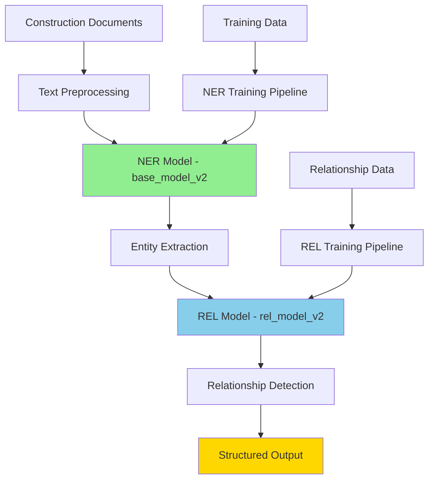

### 1.2 Component Architecture

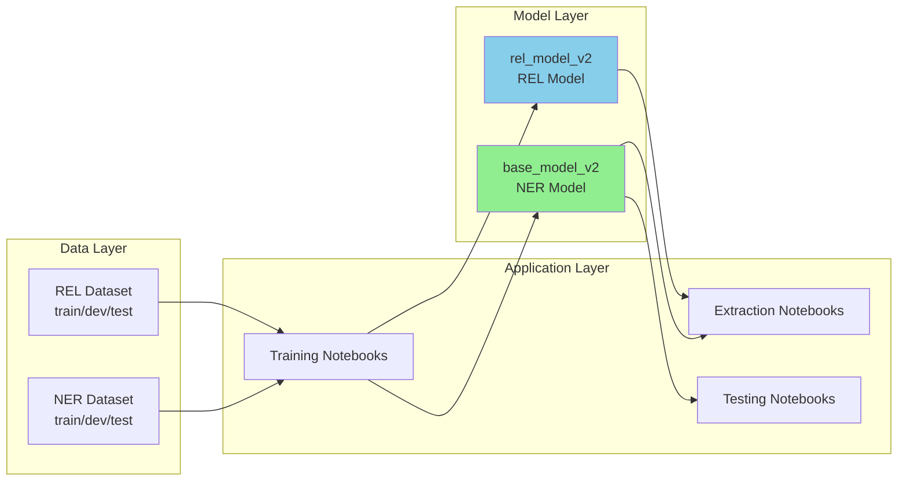

---

## 2. Technology Stack

### 2.1 Core Technologies

| Component | Technology | Version | Purpose |
|-----------|------------|---------|---------|
| **NLP Framework** | SpaCy | 3.5-3.6 | Core NLP processing and model training |
| **Language Model** | en_core_web_trf | 3.6.1 | Transformer-based language model |
| **Programming Language** | Python | 3.8-3.10 | Development and scripting |
| **Notebook Environment** | Jupyter | Latest | Interactive development and training |
| **Deep Learning** | PyTorch | 2.0+ | Neural network backend (via SpaCy) |
| **Transformers** | Hugging Face | 4.30+ | BERT-based models for REL |

### 2.2 Key Python Libraries

```python
# Core NLP
spacy>=3.5.0,<3.7.0
spacy-transformers>=1.2.2
en-core-web-trf==3.6.1

# Data Processing
pandas
numpy
json
ast

# Training & Evaluation
spacy-training
spacy-scorer

# Utilities
pathlib
tqdm
wasabi
```

### 2.3 System Requirements

**Minimum Requirements:**
- CPU: 4+ cores
- RAM: 16GB
- Storage: 10GB for models and datasets
- Python: 3.8 or higher

**Recommended for Training:**
- CPU: 8+ cores or GPU (CUDA-compatible)
- RAM: 32GB
- Storage: 20GB SSD
- GPU: 8GB+ VRAM (optional but significantly faster)

---

## 3. Model Architecture

### 3.1 Named Entity Recognition (NER) Model

#### 3.1.1 Model: base_model_v2

**Pipeline Components:**
```
tok2vec → ner
```

**Architecture Details:**

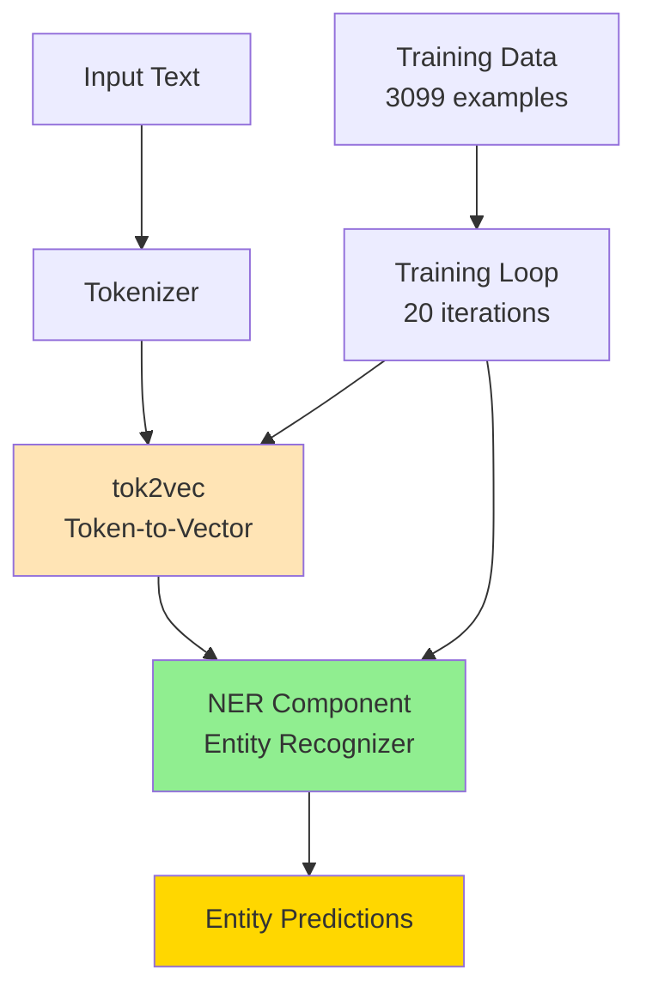

**Entity Labels:**
- `CONTACT` - Individual persons (contractors, applicants, officials)
- `ADDRESS` - Physical locations and addresses
- `ORG` - Organizations and companies
- `SITE` - Zoning and parcel information
- `DESC` - Project descriptions and findings

**Model Configuration:**
```python
# From meta.json
{
  "lang": "en",
  "name": "pipeline",
  "pipeline": ["tok2vec", "ner"],
  "labels": {
    "ner": ["ADDRESS", "CONTACT", "DESC", "ORG", "SITE"]
  }
}
```

**Training Parameters:**
- **Iterations**: 20 epochs
- **Dropout**: 0.20
- **Batch Size**: Compounding (4 → 32)
- **Optimizer**: Adam (default SpaCy)
- **Base Model**: Blank English model (`en_blank`)

**Performance Metrics (base_model_v2):**

| Metric | Score |
|--------|-------|
| Overall F1 | 77.09% |
| Overall Precision | 79.82% |
| Overall Recall | 74.55% |

**Per-Entity Performance:**

| Entity | Precision | Recall | F1 Score |
|--------|-----------|--------|----------|
| CONTACT | 89.04% | 90.60% | 89.81% |
| DESC | 88.43% | 91.39% | 89.88% |
| ORG | 71.62% | 71.62% | 71.62% |
| ADDRESS | 69.23% | 60.00% | 64.29% |
| SITE | 42.94% | 24.52% | 31.21% |

#### 3.1.2 Model Files Structure

```
model/base_model_v2/
├── model-best/              # Best performing model
│   ├── config.cfg          # SpaCy configuration
│   ├── meta.json           # Model metadata
│   ├── ner/                # NER component
│   │   ├── cfg             # Component config
│   │   ├── model           # Trained weights
│   │   └── moves           # Transition system
│   ├── tok2vec/            # Token vectorization
│   │   ├── cfg
│   │   └── model
│   ├── vocab/              # Vocabulary
│   │   ├── strings.json    # String hashes
│   │   ├── key2row         # Lexeme lookup
│   │   ├── vectors         # Word vectors
│   │   ├── vectors.cfg
│   │   └── lookups.bin     # Lemmatization data
│   └── tokenizer           # Tokenization rules
└── model-last/             # Final checkpoint
    └── [same structure]
```

### 3.2 Relation Extraction (REL) Model

#### 3.2.1 Model: rel_model_v2

**Pipeline Components:**
```
tok2vec → relation_extractor
```

**Architecture Details:**

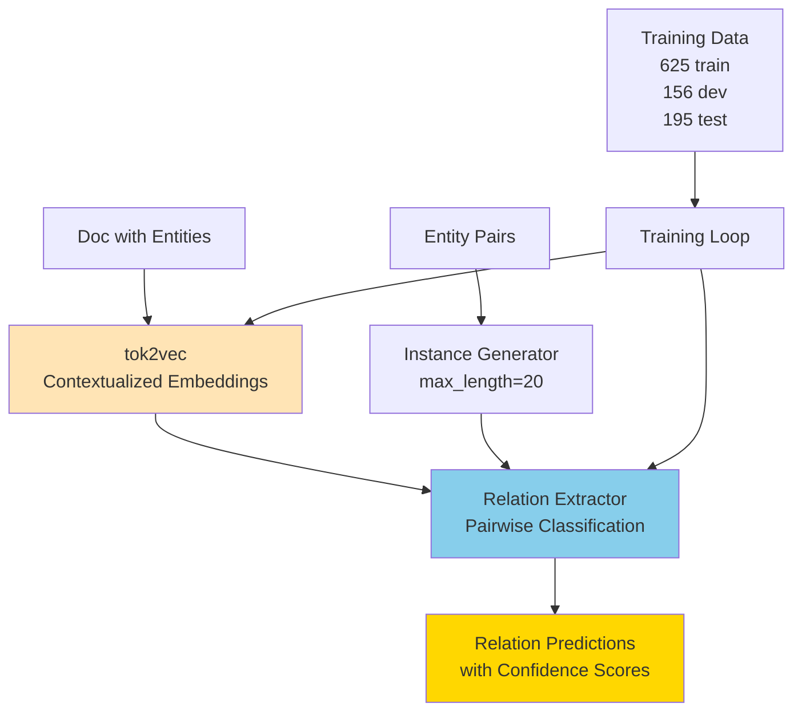

**Relation Labels:**
- `CONTACTORG` - Links between contacts and organizations

**Model Configuration:**
```python
# From meta.json
{
  "lang": "en",
  "pipeline": ["tok2vec", "relation_extractor"],
  "labels": {
    "relation_extractor": ["CONTACTORG"]
  }
}
```

**Training Approach:**
1. Uses transformer-based model (en_core_web_trf) for better context
2. Generates entity pair instances with configurable max_length
3. Binary classification for each potential relationship
4. Outputs confidence scores (0.0 to 1.0) for each relation type

**Performance Metrics (rel_model_v2):**

| Metric | Score | Threshold |
|--------|-------|-----------|
| Best F1 Score | 97.44% | 0.60-0.70 |
| Precision @ 0.60 | 96.84% | 0.60 |
| Recall @ 0.60 | 95.34% | 0.60 |
| Precision @ 0.70 | 97.31% | 0.70 |
| Recall @ 0.70 | 93.78% | 0.70 |

**Threshold Analysis:**
The model provides predictions at various confidence thresholds:

| Threshold | Precision | Recall | F1 Score |
|-----------|-----------|--------|----------|
| 0.05 | 90.52% | 98.96% | 94.55% |
| 0.20 | 94.06% | 98.45% | 96.20% |
| 0.40 | 95.90% | 96.89% | 96.39% |
| 0.60 | 96.84% | 95.34% | 96.08% |
| 0.80 | 97.27% | 92.23% | 94.68% |
| 0.90 | 98.85% | 89.12% | 93.73% |
| 1.00 | 100.00% | 63.21% | 77.46% |

#### 3.2.2 Custom REL Components

**Custom Python Modules:**
- `rel_model.py` - Relation model architecture
- `rel_pipe.py` - Relation extraction pipeline component
- `custom_functions.py` - Utility functions for training

**Key Features:**
- Instance generation for entity pairs within sentence boundaries
- Configurable context window (max_length parameter)
- Pairwise classification with confidence scoring
- Integration with SpaCy's training framework

#### 3.2.3 Model Files Structure

```
model/rel_model_v2/
├── config.cfg              # SpaCy pipeline config
├── meta.json              # Model metadata
├── relation_extractor/    # Custom REL component
│   ├── cfg               # Component configuration
│   └── model             # Trained weights
├── tok2vec/              # Token vectorization
│   ├── cfg
│   └── model
├── vocab/                # Vocabulary
│   ├── strings.json
│   ├── key2row
│   ├── vectors
│   ├── vectors.cfg
│   └── lookups.bin
└── tokenizer            # Tokenization rules
```

---

## 4. Data Architecture

### 4.1 Dataset Organization

```
dataset/
├── NER_dataset/
│   ├── train.spacy        # Training data (80% of total)
│   ├── dev.spacy          # Development/validation (10%)
│   └── test.spacy         # Test data (10%)
└── REL_dataset/
    ├── train.spacy        # 625 relationship examples
    ├── dev.spacy          # 156 validation examples
    └── test.spacy         # 195 test examples
```

### 4.2 Data Format

#### 4.2.1 NER Training Data Format

Original JSONL format before conversion to `.spacy`:

```json
{
  "text": "PETER J. FITZGERALD JR. from Roberts Road Investment LC...",
  "spans": [
    {
      "start": 0,
      "end": 23,
      "label": "CONTACT"
    },
    {
      "start": 30,
      "end": 56,
      "label": "ORG"
    }
  ]
}
```

**Dataset Statistics:**
- Total NER examples: 3,099
- Entity types: 5 (CONTACT, ADDRESS, ORG, SITE, DESC)
- Average entities per document: 3-5

#### 4.2.2 REL Training Data Format

```json
{
  "document": "PETER J. FITZGERALD JR. from Roberts Road Investment LC",
  "tokens": [
    {
      "text": "PETER J. FITZGERALD JR.",
      "start": 0,
      "end": 23,
      "token_start": 0,
      "token_end": 4,
      "entityLabel": "CONTACT"
    },
    {
      "text": "Roberts Road Investment LC",
      "start": 30,
      "end": 56,
      "token_start": 6,
      "token_end": 9,
      "entityLabel": "ORG"
    }
  ],
  "relations": [
    {
      "head": 0,
      "child": 6,
      "relationLabel": "CONTACTORG"
    }
  ]
}
```

**Dataset Statistics:**
- Total relationship examples: 976
- Training split: 625 (64%)
- Development split: 156 (16%)
- Test split: 195 (20%)
- Relationship type: 1 (CONTACTORG)

### 4.3 Data Pipeline

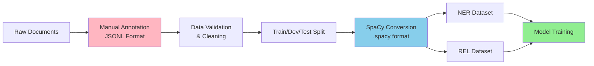

---

## 5. Training Architecture

### 5.1 NER Training Pipeline

**Notebook**: `notebook/NER/training.ipynb`

**Training Process:**

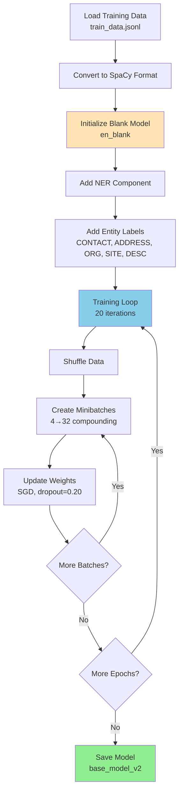

**Training Code Structure:**

```python
# Simplified training logic
def train_ner(model=None, n_iter=20):
    # Initialize model
    nlp = spacy.blank('en')
    ner = nlp.add_pipe('ner')

    # Add labels
    for label in ["CONTACT", "ADDRESS", "ORG", "SITE", "DESC"]:
        ner.add_label(label)

    # Create optimizer
    optimizer = nlp.begin_training()

    # Training loop
    for iteration in range(n_iter):
        random.shuffle(TRAIN_DATA)
        losses = {}

        # Batch processing
        batches = minibatch(TRAIN_DATA, size=compounding(4., 32., 1.001))
        for batch in batches:
            for text, annotation in batch:
                doc = nlp.make_doc(text)
                example = Example.from_dict(doc, annotation)
                nlp.update([example], sgd=optimizer, drop=0.20, losses=losses)

        print(f"Epoch {iteration}: Loss = {losses['ner']}")

    # Save model
    nlp.to_disk("model/base_model_v2")
```

**Loss Progression (Actual Training Run):**

| Epoch | NER Loss |
|-------|----------|
| 0 | 17,821.55 |
| 5 | 9,700.86 |
| 10 | 8,470.93 |
| 15 | 7,898.10 |
| 19 | 7,896.27 |

**Training Time**: ~55 minutes (CPU)

### 5.2 REL Training Pipeline

**Notebook**: `notebook/REL/build_custom_rel_model_CM.ipynb`

**Training Process:**

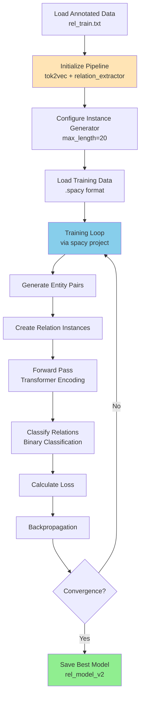

**Configuration** (`configs/rel_tok2vec.cfg`):

```ini
[components.relation_extractor]
factory = "relation_extractor"

[components.relation_extractor.model]
@architectures = "rel_model.v1"

[components.relation_extractor.model.create_instance_tensor]
@misc = "rel_instance_generator.v1"
max_length = 20  # Maximum tokens between entities
```

**Training Metrics Evolution:**

| Epoch | Steps | Loss (TOK2VEC) | Loss (REL) | F1 Score |
|-------|-------|----------------|------------|----------|
| 0 | 0 | 0.01 | 0.39 | 61.58% |
| 0 | 50 | 0.06 | 4.09 | 87.33% |
| 0 | 200 | 0.01 | 1.19 | 94.60% |
| 1 | 500 | 0.00 | 0.47 | 95.27% |
| 2 | 1000 | 0.00 | 0.00 | 96.79% |
| 3 | 1400 | 0.00 | 0.01 | 96.75% |

**Training Time**: ~4 minutes (CPU)

### 5.3 Model Evaluation

**Notebook**: `notebook/NER/Testing.ipynb`

**Evaluation Process:**

```python
from spacy.scorer import Scorer
from spacy.training.example import Example

def evaluate(ner_model, test_examples):
    scorer = Scorer()
    examples = []

    for input_text, annotations in test_examples:
        # Get model predictions
        pred_doc = ner_model(input_text)

        # Create evaluation example
        example = Example.from_dict(pred_doc, annotations)
        examples.append(example)

    # Calculate scores
    scores = scorer.score(examples)
    return scores
```

**Metrics Calculated:**
- Precision, Recall, F1 (overall and per-entity)
- Micro-averaged scores
- Confusion analysis

---

## 6. Inference Architecture

### 6.1 Joint NER + REL Pipeline

**Extraction Notebooks**: `notebook/Extraction/`
- `Miami_Extraction.ipynb`
- `Tuscaloosa_extraction.ipynb`
- `fairfax extraction.ipynb`
- `wells_extraction.ipynb`
- `calhoun.ipynb`

**Inference Flow:**

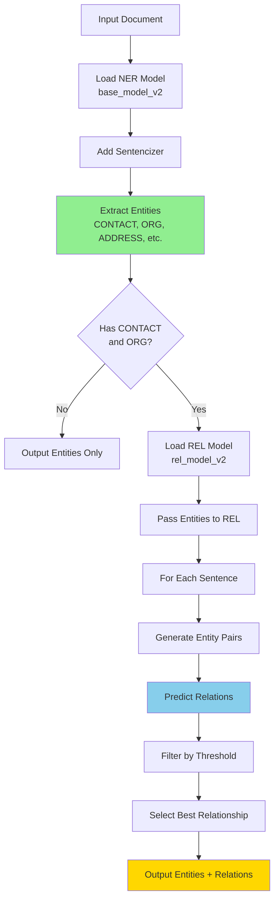

**Inference Code:**

```python
import spacy

# Load models
nlp_ner = spacy.load("model/base_model_v2/model-best")
nlp_ner.add_pipe('sentencizer')

nlp_rel = spacy.load("model/rel_model_v2")

# Process document
text = "PETER J. FITZGERALD JR. from Roberts Road Investment LC..."

# Step 1: Extract entities
doc = nlp_ner(text)
entities = [(e.start, e.text, e.label_) for e in doc.ents]

# Step 2: Extract relationships
ner_labels = [e.label_ for e in doc.ents]

if "ORG" in ner_labels and "CONTACT" in ner_labels:
    # Process with REL model
    for name, proc in nlp_rel.pipeline:
        doc = proc(doc)

    # Analyze predictions
    best_score = 0
    best_relation = None

    for (idx1, idx2), rel_dict in doc._.rel.items():
        confidence = rel_dict["CONTACTORG"]

        if confidence > best_score:
            best_score = confidence
            best_relation = {
                "entity1": doc.ents[idx1].text,
                "entity2": doc.ents[idx2].text,
                "relation": "CONTACTORG",
                "confidence": confidence
            }

    print(f"Best relationship: {best_relation}")
```

### 6.2 Batch Processing Architecture

For processing multiple documents (e.g., Miami agendas):

```python
import pandas as pd
import os

# Load documents
files = []
for root, dirs, file_list in os.walk(path):
    files.extend([os.path.join(root, f) for f in file_list])

# Process in batches
results = []
for file_path in files:
    df = pd.read_excel(file_path)

    for idx, row in df.iterrows():
        doc_text = row['text']

        # Extract entities and relations
        entities, relations = extract_info(doc_text)

        results.append({
            'filename': os.path.basename(file_path),
            'text': doc_text,
            'entities': entities,
            'relations': relations
        })

# Save results
output_df = pd.DataFrame(results)
output_df.to_excel("miami_output.xlsx", index=False)
```

---

## 7. System Integration Points

### 7.1 Input Integration

**Supported Input Formats:**
- Plain text (.txt)
- Excel files (.xlsx) with text columns
- JSONL annotation format
- Direct string input

**Preprocessing Requirements:**
- UTF-8 encoding
- Minimal text cleaning (handled by SpaCy tokenizer)
- No special formatting needed

### 7.2 Output Integration

**Output Formats:**

1. **Structured JSON:**
```json
{
  "text": "document text...",
  "entities": [
    {
      "text": "PETER J. FITZGERALD JR.",
      "label": "CONTACT",
      "start": 0,
      "end": 23
    }
  ],
  "relations": [
    {
      "entity1": "PETER J. FITZGERALD JR.",
      "entity2": "Roberts Road Investment LC",
      "relation": "CONTACTORG",
      "confidence": 0.98
    }
  ]
}
```

2. **Excel/CSV:**
- One row per document
- Columns for entities and relations
- Compatible with existing data workflows

3. **Database-Ready:**
- Normalized entity tables
- Relationship tables with foreign keys
- Ready for SQL import

### 7.3 Model Management

**Model Versioning:**
- Models stored with version identifiers (v1, v2, etc.)
- Metadata tracks training date, performance metrics
- Easy rollback to previous versions

**Model Updates:**
- Retrain with new data as it becomes available
- Incremental learning possible with SpaCy
- A/B testing of model versions

---

## 8. Performance Optimization

### 8.1 Processing Speed

**Current Performance:**
- NER: ~1-2 seconds per document
- REL: ~0.5-1 seconds per document (if entities found)
- Total: <5 seconds per document on CPU

**Optimization Strategies:**

1. **Batch Processing:**
```python
# Process multiple documents at once
docs = nlp_ner.pipe(texts, disable=["tagger"])  # 2-3x faster
```

2. **GPU Acceleration:**
- Use CUDA-enabled PyTorch
- 5-10x speedup on compatible hardware
- Especially beneficial for transformer models

3. **Component Disabling:**
```python
# Disable unnecessary components
nlp_ner.pipe(texts, disable=["tagger", "parser"])  # 30-40% faster
```

### 8.2 Memory Optimization

**Current Memory Usage:**
- NER Model: ~200MB loaded
- REL Model: ~500MB loaded (with transformers)
- Peak processing: ~1-2GB RAM

**Optimization Strategies:**
- Load models on demand
- Process documents in smaller batches
- Use smaller transformer models if needed

### 8.3 Scalability Considerations

**Horizontal Scaling:**
- Models can run independently on multiple servers
- Parallel processing of document batches
- Load balancing for high-volume scenarios

**Vertical Scaling:**
- Multi-core CPU utilization with multiprocessing
- GPU acceleration for large batches
- Increased batch sizes with more RAM

---

## 9. Security and Privacy

### 9.1 Data Security

**Training Data:**
- Stored locally, not transmitted externally
- Access controls on dataset directories
- No personally identifiable information (PII) beyond public records

**Model Security:**
- Models do not store training data
- Can be deployed in air-gapped environments
- No external API dependencies for inference

### 9.2 Privacy Considerations

**Data Handling:**
- All processing is local
- No data sent to external services
- Complies with data residency requirements

**Entity Redaction:**
- Can be configured to mask sensitive entities
- Flexible output filtering

---

## 10. Deployment Architecture

### 10.1 POC Deployment

**Current Setup:**
```
Local Development Environment
├── Jupyter Notebooks (training & inference)
├── Model Storage (local filesystem)
├── Dataset Storage (local filesystem)
└── Output Storage (Excel files)
```

### 10.2 Production Deployment Options

**Option 1: On-Premise Server**

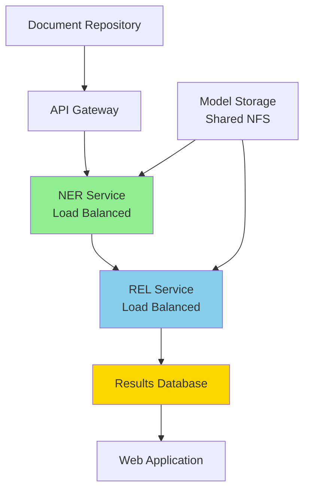

**Option 2: Cloud Deployment**

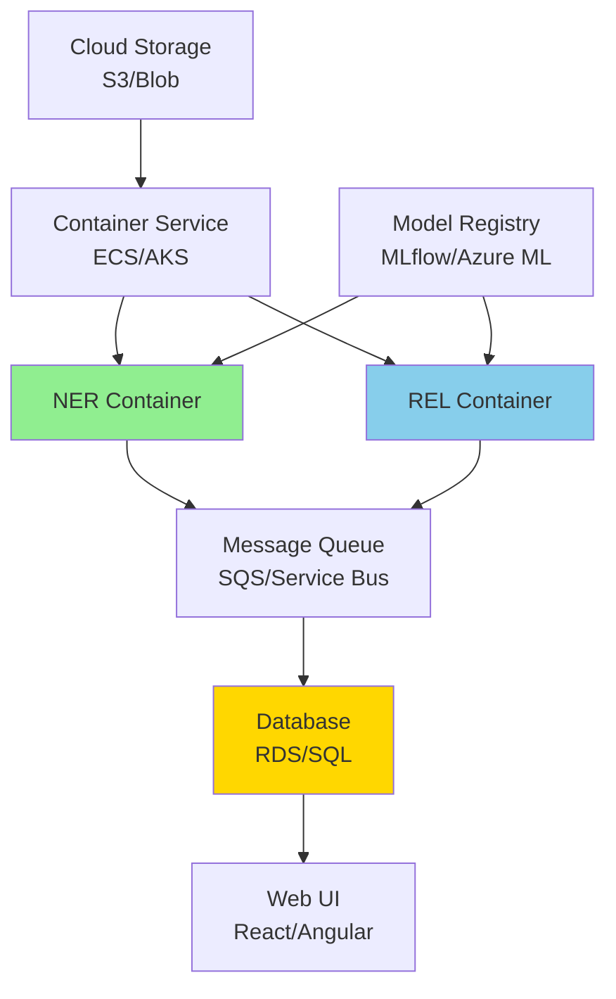

**Option 3: Microservices**

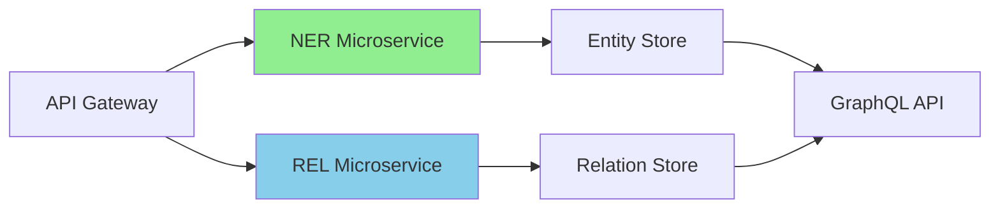

---

## 11. Monitoring and Observability

### 11.1 Model Performance Monitoring

**Metrics to Track:**
- Prediction confidence distributions
- Entity extraction rates
- Relationship detection rates
- Processing times
- Error rates

**Implementation:**
```python
import logging

class ModelMonitor:
    def __init__(self):
        self.metrics = {
            'predictions': 0,
            'avg_confidence': [],
            'processing_time': []
        }

    def log_prediction(self, confidence, time_taken):
        self.metrics['predictions'] += 1
        self.metrics['avg_confidence'].append(confidence)
        self.metrics['processing_time'].append(time_taken)
```

### 11.2 System Health Monitoring

**Key Indicators:**
- Model load time
- Memory usage
- CPU/GPU utilization
- Queue depths (if using async processing)
- Error/exception rates

---

## 12. Development Workflow

### 12.1 Model Development Cycle

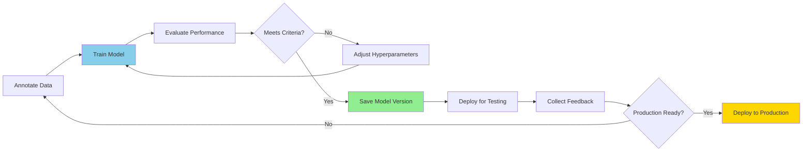

### 12.2 Version Control

**Git Structure:**
```
construction_monitor_poc/
├── .gitignore              # Exclude large model files
├── dataset/                # Training data (versioned)
├── notebook/               # Jupyter notebooks (versioned)
├── model/                  # Models (excluded from git, use DVC/Git LFS)
└── documentation/          # Documentation (versioned)
```

**Model Versioning:**
- Use DVC (Data Version Control) or Git LFS for models
- Track model metadata in Git
- Maintain model registry with performance metrics

---

## 13. Technical Dependencies

### 13.1 Dependency Management

**Requirements File Structure:**

```
requirements.txt            # Core dependencies
requirements-dev.txt        # Development tools
requirements-prod.txt       # Production deployment
```

**Core Dependencies:**
```
# requirements.txt
spacy>=3.5.0,<3.7.0
spacy-transformers>=1.2.0,<1.3.0
pandas>=1.3.0
numpy>=1.21.0
openpyxl>=3.0.0  # For Excel support
jupyter>=1.0.0
```

### 13.2 Environment Setup

**Conda Environment:**
```bash
conda create -n construction_monitor python=3.10
conda activate construction_monitor
pip install -r requirements.txt
python -m spacy download en_core_web_trf
```

**Docker Container:**
```dockerfile
FROM python:3.10-slim

WORKDIR /app

COPY requirements.txt .
RUN pip install --no-cache-dir -r requirements.txt
RUN python -m spacy download en_core_web_trf

COPY model/ model/
COPY notebook/ notebook/

CMD ["jupyter", "notebook", "--ip=0.0.0.0", "--allow-root"]
```

---

## 14. Future Technical Enhancements

### 14.1 Model Improvements

1. **Multi-task Learning:**
   - Train NER and REL jointly
   - Share representations for better performance
   - Reduce total model size

2. **Active Learning:**
   - Identify low-confidence predictions
   - Request human annotation for uncertain cases
   - Continuously improve model with new examples

3. **Transfer Learning:**
   - Fine-tune domain-specific transformers
   - Use pre-trained construction/legal language models
   - Leverage external knowledge bases

### 14.2 Architecture Enhancements

1. **Real-time Processing:**
   - Streaming document ingestion
   - WebSocket API for live updates
   - Event-driven architecture

2. **Multi-modal Support:**
   - OCR integration for scanned documents
   - Table extraction from PDFs
   - Image and diagram analysis

3. **Knowledge Graph Integration:**
   - Build entity relationship graphs
   - Enable complex queries
   - Support graph-based reasoning

---

## 15. Technical Limitations

### 15.1 Current Limitations

**Model Constraints:**
- Single language (English only)
- Limited to 5 entity types and 1 relation type
- Performance varies by entity type (SITE has lower accuracy)
- Requires well-formed text input

**Processing Constraints:**
- CPU-based training is slow
- Large transformer models require significant memory
- No real-time processing capability in current POC

**Scalability Constraints:**
- Not optimized for high-volume processing
- Single-threaded processing in notebooks
- No load balancing or fault tolerance

### 15.2 Known Issues

1. **Entity Boundary Detection:**
   - Some entities with unusual formatting may be missed
   - Multi-line addresses can cause alignment issues

2. **Relationship Context:**
   - Limited to sentence-level context
   - Cross-sentence relationships not captured
   - Coreference resolution not implemented

3. **Domain Coverage:**
   - Trained primarily on planning/zoning documents
   - May not generalize to other construction document types
   - Limited exposure to certain geographic naming conventions

---

## Document Information

**Document Version**: 1.0
**Last Updated**: December 2025
**POC Status**: Proof of Concept
**Target Audience**: Technical teams, data scientists, ML engineers, solution architects
