# Functional Architecture

## Executive Summary

This document describes the functional architecture of the Construction Monitor POC, detailing how the system processes construction documents through Named Entity Recognition (NER) and Relation Extraction (REL) workflows. It covers the end-to-end functional flow, decision logic, data transformations, and regional processing capabilities that enable automated extraction of construction project information.

---

## 1. Functional Architecture Overview

### 1.1 High-Level Functional Flow

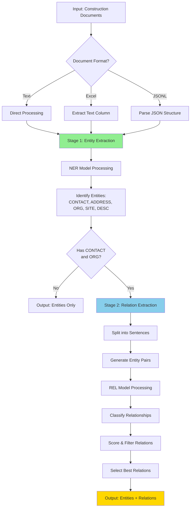

### 1.2 System Components and Functions

| Component | Function | Input | Output |
|-----------|----------|-------|--------|
| **Document Loader** | Read and parse documents | Files (txt, xlsx, jsonl) | Text strings |
| **Text Preprocessor** | Clean and normalize text | Raw text | Preprocessed text |
| **NER Engine** | Extract named entities | Preprocessed text | Entity list with labels |
| **Entity Filter** | Validate entity types | Entity list | Filtered entities |
| **Sentence Splitter** | Segment text | Document text | Sentence list |
| **Pair Generator** | Create entity combinations | Entities + Sentences | Entity pairs |
| **REL Engine** | Classify relationships | Entity pairs | Relations with scores |
| **Confidence Filter** | Filter by threshold | Relations + scores | High-confidence relations |
| **Result Aggregator** | Combine results | Entities + Relations | Structured output |
| **Output Formatter** | Format for export | Structured data | Excel/JSON/CSV |

---

## 2. Named Entity Recognition (NER) Workflow

### 2.1 NER Functional Flow

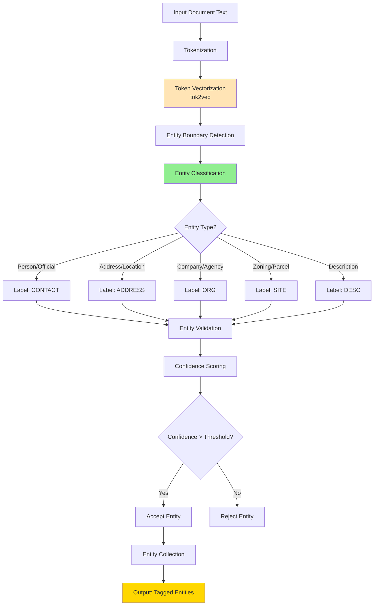

### 2.2 Entity Recognition Logic

#### 2.2.1 CONTACT Entity Recognition

**Functional Rules:**
- Identifies personal names in various formats
- Recognizes titles and honorifics (Mr., Ms., Dr., Commissioner, etc.)
- Handles multi-part names (first, middle, last, suffix)
- Detects officials and representatives

**Example Patterns:**
```
"Peter J. Fitzgerald Jr."      → CONTACT
"Commissioner Wilson"          → CONTACT
"Bob Katai"                    → CONTACT
"K. Abrahamson"                → CONTACT
"Mr. James Escue"              → CONTACT
"Reggie Stewart"               → CONTACT
```

**Validation Logic:**
1. Check for name-like patterns (capitalization, word count)
2. Verify context (not part of organization name)
3. Confirm boundary alignment
4. Score confidence based on training patterns

#### 2.2.2 ADDRESS Entity Recognition

**Functional Rules:**
- Identifies street addresses with house numbers
- Recognizes city, state, ZIP patterns
- Handles multi-line addresses
- Detects location descriptors

**Example Patterns:**
```
"7327 Georgetown Pike, McLean, 22102"         → ADDRESS
"305 West 49th Street, Anniston"              → ADDRESS
"12451 Fair Lakes Circle, Fairfax, VA"        → ADDRESS
"North side of Braddock Road and east side"   → ADDRESS (partial)
```

**Validation Logic:**
1. Look for numeric street numbers
2. Identify street type keywords (Road, Street, Avenue, etc.)
3. Detect city/state/ZIP patterns
4. Handle multi-token addresses
5. Validate geographic coherence

#### 2.2.3 ORG Entity Recognition

**Functional Rules:**
- Identifies company names and legal entities
- Recognizes government agencies and departments
- Detects organizational suffixes (LLC, Inc., Corp., etc.)
- Handles multi-word organization names

**Example Patterns:**
```
"Roberts Road Investment LC"         → ORG
"Calhoun County EMA"                 → ORG
"Anniston Lions Club"                → ORG
"Miami Planning Board"               → ORG
```

**Validation Logic:**
1. Check for organizational keywords and suffixes
2. Identify government agency patterns
3. Verify capitalization patterns
4. Confirm multi-word coherence
5. Distinguish from person names

#### 2.2.4 SITE Entity Recognition

**Functional Rules:**
- Identifies zoning codes and classifications
- Recognizes parcel and tax map identifiers
- Detects land use descriptions
- Captures acreage and lot information

**Example Patterns:**
```
"Tax Map 021-3 ((1)) 23 and 23A"              → SITE
"R-1"                                          → SITE (zoning)
"PDH-5"                                        → SITE (planned development)
"5.39 ac. of land zoned R-1"                  → SITE
```

**Validation Logic:**
1. Detect zoning code patterns (R-1, C-2, PDH-5, etc.)
2. Identify tax map/parcel patterns
3. Recognize land measurement units (acres, sq ft)
4. Validate alphanumeric identifiers
5. Check for context keywords (zoned, parcel, map)

#### 2.2.5 DESC Entity Recognition

**Functional Rules:**
- Identifies project descriptions
- Captures purpose statements
- Extracts findings and conditions
- Recognizes scope of work

**Example Patterns:**
```
"cluster subdivision and a waiver of minimum district size"  → DESC
"permit a cluster subdivision"                               → DESC
"sanitizing large areas during the COVID crisis"             → DESC
```

**Validation Logic:**
1. Look for verb phrases describing actions
2. Identify permit/approval language
3. Detect project scope keywords
4. Validate sentence structure
5. Check for descriptive content

### 2.3 Entity Boundary Detection

**Challenge**: Determining exact start and end positions of entities in text.

**Approach**:
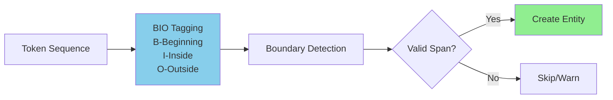

**BIO Tagging Example:**
```
Text:   "Peter J. Fitzgerald Jr. from Roberts Road Investment LC"
Tokens: ["Peter", "J.", "Fitzgerald", "Jr.", "from", "Roberts", "Road", "Investment", "LC"]
Tags:   [B-CONTACT, I-CONTACT, I-CONTACT, I-CONTACT, O, B-ORG, I-ORG, I-ORG, I-ORG]
```

**Boundary Validation:**
- Ensure entity spans are continuous
- Check for token alignment
- Validate against whitespace and punctuation
- Handle misaligned entities gracefully

### 2.4 NER Error Handling

**Common Issues and Resolutions:**

| Issue | Example | Resolution |
|-------|---------|------------|
| **Misaligned Entities** | Multi-line addresses | Log warning, skip entity |
| **Overlapping Entities** | "LLC" tagged as both ORG and CONTACT | Prefer higher-confidence tag |
| **Partial Matches** | Incomplete address extraction | Accept partial if confidence high |
| **Ambiguous Entities** | "Wilson" (person or place?) | Use context and confidence scores |

**Error Logging:**
```python
# From training output
warnings.warn(
    "[W030] Some entities could not be aligned in the text"
    "Use offsets_to_biluo_tags() to check alignment."
)
```

---

## 3. Relation Extraction (REL) Workflow

### 3.1 REL Functional Flow

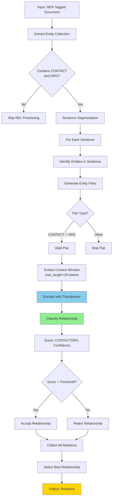

### 3.2 Sentence Segmentation

**Purpose**: Limit relationship detection to sentence-level context for accuracy.

**Implementation**:
```python
nlp.add_pipe('sentencizer')

for sentence in doc.sents:
    # Process entities within this sentence only
    entities_in_sentence = [e for e in sentence.ents]
```

**Functional Logic:**
- Split document into sentences using rule-based sentencizer
- Process each sentence independently
- Prevent cross-sentence relationship extraction
- Improve precision by limiting context

**Example:**
```
Sentence 1: "Mr. James Escue, on behalf of Anniston Lions Club, presented a disinfectant sprayer."
Entities: ["Mr. James Escue" (CONTACT), "Anniston Lions Club" (ORG)]
Relationship: CONTACT → ORG (within same sentence)

Sentence 2: "Commissioner Wilson so moved."
Entities: ["Commissioner Wilson" (CONTACT)]
Relationship: None (no ORG in sentence)
```

### 3.3 Entity Pair Generation

**Functional Logic:**

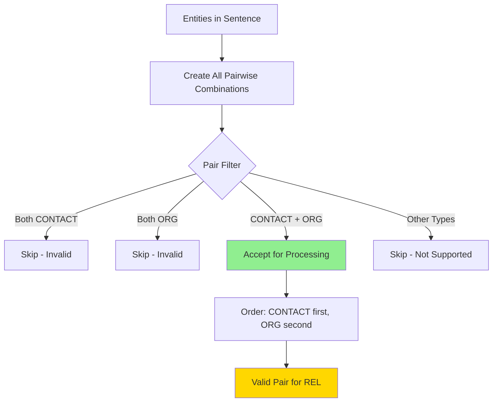

**Code Implementation:**
```python
# Generate all entity pairs in sentence
for entity1 in sentence.ents:
    for entity2 in sentence.ents:
        if entity1 == entity2:
            continue

        # Check if valid pair type
        if entity1.label_ == "CONTACT" and entity2.label_ == "ORG":
            pair = (entity1, entity2)
            process_pair(pair)
```

**Pair Validation:**
- Must be from same sentence
- Must be different entities
- Must be supported type combination (CONTACT-ORG)
- Must not exceed max_length token distance

### 3.4 Relationship Classification

**Functional Process:**

1. **Context Extraction:**
   - Extract tokens between and around entity pair
   - Limit to max_length=20 tokens
   - Include positional information

2. **Encoding:**
   - Use transformer model (tok2vec) to encode context
   - Generate contextualized embeddings for entities
   - Capture semantic relationships

3. **Classification:**
   - Binary classifier for CONTACTORG relationship
   - Output confidence score (0.0 to 1.0)
   - Higher score = higher confidence in relationship

4. **Scoring:**
   ```python
   for (idx1, idx2), rel_dict in doc._.rel.items():
       contact_org_score = rel_dict["CONTACTORG"]

       if contact_org_score > threshold:
           # Accept relationship
           relationship = {
               "contact": entities[idx1],
               "org": entities[idx2],
               "confidence": contact_org_score
           }
   ```

### 3.5 Confidence Threshold Selection

**Threshold Analysis:**

| Threshold | Precision | Recall | F1 | Use Case |
|-----------|-----------|--------|-----|----------|
| 0.05 | 90.52% | 98.96% | 94.55% | High recall needed |
| 0.40 | 95.90% | 96.89% | 96.39% | Balanced performance |
| 0.60 | 96.84% | 95.34% | 96.08% | **Recommended default** |
| 0.80 | 97.27% | 92.23% | 94.68% | High precision needed |
| 0.90 | 98.85% | 89.12% | 93.73% | Very high confidence only |

**Functional Decision Logic:**

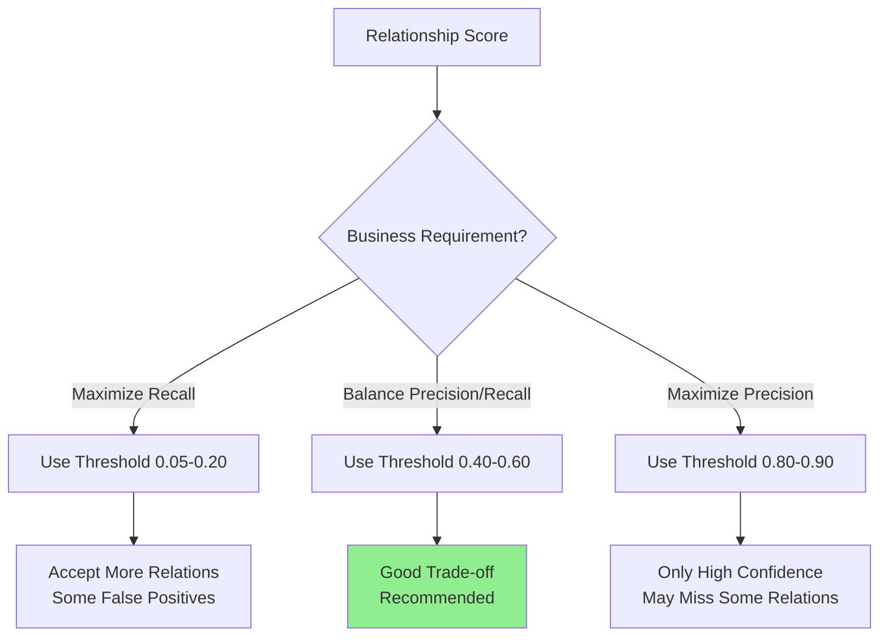

**Implementation:**
```python
# Configurable threshold
CONFIDENCE_THRESHOLD = 0.60  # Default

def filter_relations(relations, threshold=CONFIDENCE_THRESHOLD):
    filtered = []
    for rel in relations:
        if rel['confidence'] >= threshold:
            filtered.append(rel)
    return filtered
```

### 3.6 Best Relationship Selection

**Challenge**: Multiple CONTACT-ORG pairs may exist in a sentence.

**Functional Approach**:

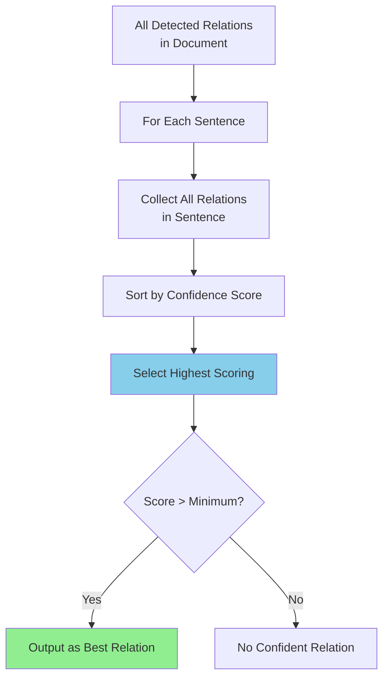

**Code Implementation:**
```python
best_fit_score = 0
best_fit = None

for value, rel_dict in doc._.rel.items():
    confidence = rel_dict["CONTACTORG"]

    if confidence > best_fit_score:
        best_fit_score = confidence
        best_fit = {
            "entity1": entities[value[0]],
            "entity2": entities[value[1]],
            "confidence": confidence
        }

print(f"Best relationship: {best_fit}")
```

**Business Logic:**
- Prioritize highest confidence relationship
- Useful when multiple contacts represent same organization
- Focuses on most likely primary relationship
- Can optionally return top-N relationships

---

## 4. Regional Processing Workflows

### 4.1 Multi-Region Processing Architecture

The POC processes construction documents from five different geographic regions, each with unique document formats and conventions.

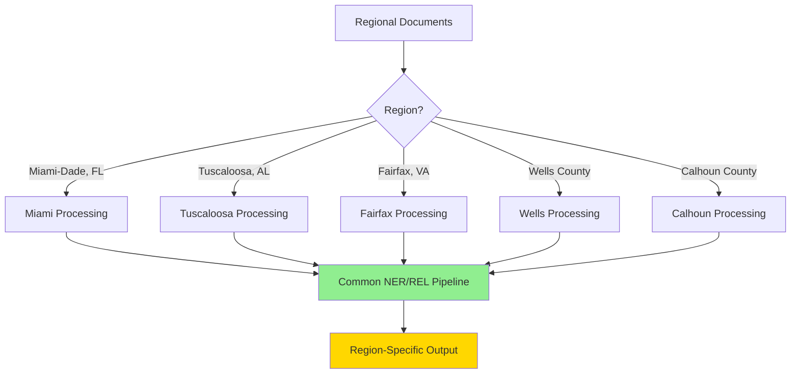

### 4.2 Miami-Dade County, Florida

**Source Documents**: Planning and Zoning Board agendas

**Notebook**: `notebook/Extraction/Miami_Extraction.ipynb`

**Document Characteristics:**
- Format: Excel files with agenda text
- Naming: `FL_Miami-Dade_Miami_YYYY-MM-DD_Agenda.xlsx`
- Content: Zoning variances, appeals, development applications

**Processing Workflow:**

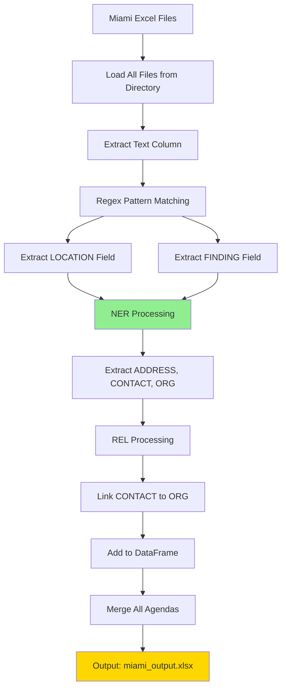

**Extraction Logic:**
```python
# Regex patterns for Miami documents
addr_pattern = r"(?<=LOCATION:).*?(?:(?=APPELLANT\(S\))|(?=Applicant))"
desc_pattern = r"(?<=FINDING\(S\)).*?(?:(?=Purpose)|(?=Attachments)|(?=\n\s\n))"

for idx, row in df.iterrows():
    text = row['text']

    # Extract structured fields
    addresses = re.findall(addr_pattern, text, flags=re.IGNORECASE|re.DOTALL)
    descriptions = re.findall(desc_pattern, text, flags=re.IGNORECASE|re.DOTALL)

    # Run NER/REL on extracted text
    entities, relations = process_text(text)
```

**Output Structure:**
- Filename
- Original text
- Extracted entities (CONTACT, ORG, ADDRESS, SITE, DESC)
- Detected relationships (CONTACT-ORG)
- Confidence scores

**Volume**: ~45 agenda files processed (2018-2021)

### 4.3 Tuscaloosa, Alabama

**Notebook**: `notebook/Extraction/Tuscaloosa_extraction.ipynb`

**Document Characteristics:**
- Municipal planning documents
- City council and planning commission records
- Similar structure to Miami but different formatting

**Processing Approach:**
- Load Tuscaloosa-specific documents
- Apply same NER/REL pipeline
- Handle region-specific entity variations (street names, organization names)
- Output to Tuscaloosa-specific Excel file

### 4.4 Fairfax County, Virginia

**Notebook**: `notebook/Extraction/fairfax extraction (1).ipynb`, `fairfax working (1).ipynb`

**Document Characteristics:**
- Zoning and land use applications
- Board of Zoning Appeals records
- Rich in parcel and site information

**Specific Entities:**
```
Example: "RZ/FDP 2017-BR-030"
         "Roberts Road Investment LC"
         "K. Abrahamson"
         "(North side of Braddock Road and east side of Roberts Road)"
         "Tax Map 021-3 ((1)) 23 and 23A"
```

**Processing Considerations:**
- High volume of SITE entities (parcel IDs, tax maps)
- Complex multi-part addresses
- Multiple contacts per application

### 4.5 Wells County

**Notebook**: `notebook/Extraction/wells_extraction.ipynb`

**Document Characteristics:**
- County-level construction permits
- Building department records

**Processing Approach:**
- Standard NER/REL pipeline
- Focus on contractor and permit information
- Output structured permit data

### 4.6 Calhoun County

**Notebook**: `notebook/Extraction/calhoun.ipynb`

**Document Characteristics:**
- County commission minutes
- Public nuisance declarations
- EMA (Emergency Management Agency) records

**Specific Processing:**
```
Example: "Mr. James Escue, on behalf of Anniston Lions Club, presented
          a disinfectant sprayer to Calhoun County to assist the
          Calhoun County EMA with sanitizing large areas during the
          COVID crisis."

Entities:
- CONTACT: "Mr. James Escue"
- ORG: "Anniston Lions Club", "Calhoun County", "Calhoun County EMA"
- DESC: "sanitizing large areas during the COVID crisis"

Relationships:
- "Mr. James Escue" → represents → "Anniston Lions Club"
```

**Processing Focus:**
- Multiple organizations in single document
- Representative relationships (on behalf of)
- Government entity identification

---

## 5. Training and Testing Workflows

### 5.1 NER Training Workflow

**Notebook**: `notebook/NER/training.ipynb`

**Functional Process:**

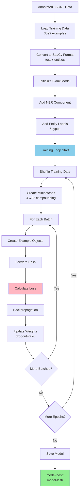

**Key Parameters:**
- Epochs: 20
- Batch size: Compounding (4 → 32)
- Dropout: 0.20 (regularization)
- Optimizer: SGD (Stochastic Gradient Descent)

**Loss Monitoring:**
```
Epoch  0: Loss = 17,821.55
Epoch  5: Loss =  9,700.86  (45% reduction)
Epoch 10: Loss =  8,470.93  (52% reduction)
Epoch 15: Loss =  7,898.10  (56% reduction)
Epoch 19: Loss =  7,896.27  (56% reduction)
```

**Output:**
- `model-best/`: Best performing checkpoint based on validation
- `model-last/`: Final model after all epochs

### 5.2 REL Training Workflow

**Notebook**: `notebook/REL/build_custom_rel_model_CM.ipynb`

**Functional Process:**

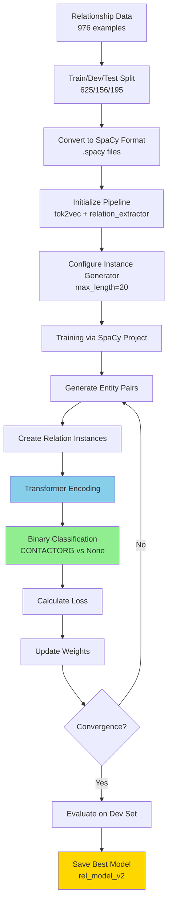

**Training Progression:**

| Epoch | Steps | Tok2Vec Loss | REL Loss | F1 Score |
|-------|-------|--------------|----------|----------|
| 0 | 0 | 0.01 | 0.39 | 61.58% |
| 0 | 200 | 0.01 | 1.19 | 94.60% |
| 1 | 500 | 0.00 | 0.47 | 95.27% |
| 2 | 1000 | 0.00 | 0.00 | 96.79% |

**Convergence**: Model reaches >96% F1 score within 1000 steps (~4 minutes)

### 5.3 Testing and Evaluation Workflow

**Notebook**: `notebook/NER/Testing.ipynb`

**Functional Process:**

```mermaid
graph TB
    A[Load Test Dataset<br/>unseen examples] --> B[Load Trained Model<br/>base_model_v2]
    B --> C[For Each Test Example]
    C --> D[Get Model Prediction]
    D --> E[Compare with Gold Standard]

    E --> F[Calculate Metrics]
    F --> G[Precision: TP / (TP + FP)]
    F --> H[Recall: TP / (TP + FN)]
    F --> I[F1: 2 * (P * R) / (P + R)]

    G --> J[Overall Scores]
    H --> J
    I --> J

    J --> K[Per-Entity Scores]
    K --> L[Generate Report]

    L --> M[Excel Output<br/>test_pred.xlsx]

    style F fill:#87CEEB
    style M fill:#FFD700
```

**Evaluation Code:**
```python
from spacy.scorer import Scorer
from spacy.training.example import Example

def evaluate(model, test_data):
    scorer = Scorer()
    examples = []

    for text, annotations in test_data:
        # Predict
        pred_doc = model(text)

        # Create example for scoring
        example = Example.from_dict(pred_doc, annotations)
        examples.append(example)

    # Calculate scores
    scores = scorer.score(examples)

    return scores
```

**Output Metrics:**
- Overall precision, recall, F1
- Per-entity precision, recall, F1
- Detailed predictions in Excel format

**Example Output:**
```
Overall Scores:
  Precision: 79.82%
  Recall:    74.55%
  F1:        77.09%

Per-Entity Scores:
  CONTACT - P: 89.04%, R: 90.60%, F1: 89.81%
  DESC    - P: 88.43%, R: 91.39%, F1: 89.88%
  ORG     - P: 71.62%, R: 71.62%, F1: 71.62%
  ADDRESS - P: 69.23%, R: 60.00%, F1: 64.29%
  SITE    - P: 42.94%, R: 24.52%, F1: 31.21%
```

### 5.4 Accuracy Assessment Workflow

**Notebook**: `notebook/NER/ACC.ipynb`

**Purpose**: Additional accuracy analysis and debugging

**Functional Activities:**
- Analyze misclassifications
- Identify common error patterns
- Generate confusion matrices
- Assess entity boundary errors
- Evaluate model on specific subsets

---

## 6. Data Transformation Workflows

### 6.1 Raw Text to Entities

**Input Format:**
```
"PETER J. FITZGERALD JR. from Roberts Road Investment LC, located at
7327 Georgetown Pike, McLean, 22102 on approx. 5.39 ac. of land zoned R-1."
```

**Processing Steps:**

1. **Tokenization:**
```
["PETER", "J.", "FITZGERALD", "JR.", "from", "Roberts", "Road",
 "Investment", "LC", ",", "located", "at", "7327", "Georgetown", ...]
```

2. **Entity Recognition:**
```
PETER J. FITZGERALD JR.              [0-23]     CONTACT
Roberts Road Investment LC           [30-56]    ORG
7327 Georgetown Pike, McLean, 22102  [70-105]   ADDRESS
5.39 ac. of land zoned R-1           [115-141]  SITE
```

3. **Structured Output:**
```json
{
  "text": "PETER J. FITZGERALD JR. from...",
  "entities": [
    {
      "text": "PETER J. FITZGERALD JR.",
      "start": 0,
      "end": 23,
      "label": "CONTACT"
    },
    {
      "text": "Roberts Road Investment LC",
      "start": 30,
      "end": 56,
      "label": "ORG"
    },
    ...
  ]
}
```

### 6.2 Entities to Relationships

**Input:** Entity list from NER

**Processing Steps:**

1. **Sentence Splitting:**
```
Sentence: "PETER J. FITZGERALD JR. from Roberts Road Investment LC"
Entities in sentence: [CONTACT, ORG]
```

2. **Pair Generation:**
```
Pair 1: (CONTACT: "PETER J. FITZGERALD JR.", ORG: "Roberts Road Investment LC")
```

3. **Relationship Classification:**
```
Context: "from" (connecting word between entities)
Encoding: Transformer-based contextualized representation
Classification: CONTACTORG probability = 0.98
```

4. **Structured Output:**
```json
{
  "relations": [
    {
      "entity1": "PETER J. FITZGERALD JR.",
      "entity1_type": "CONTACT",
      "entity2": "Roberts Road Investment LC",
      "entity2_type": "ORG",
      "relation_type": "CONTACTORG",
      "confidence": 0.98
    }
  ]
}
```

### 6.3 Regional Batch Processing

**Input:** Directory of regional documents

**Output:** Consolidated Excel file

**Workflow:**

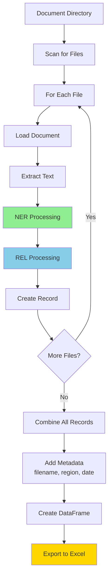

**Code Pattern:**
```python
import os
import pandas as pd

results = []

for root, dirs, files in os.walk(document_directory):
    for filename in files:
        filepath = os.path.join(root, filename)

        # Process document
        text = load_document(filepath)
        entities = extract_entities(text)
        relations = extract_relations(text, entities)

        # Create record
        results.append({
            'filename': filename,
            'region': extract_region(filename),
            'text': text,
            'entities': entities,
            'relations': relations
        })

# Export
df = pd.DataFrame(results)
df.to_excel(f"{region}_output.xlsx", index=False)
```

---

## 7. Decision Logic and Business Rules

### 7.1 Entity Acceptance Rules

**Rule 1: Confidence Threshold**
```
IF entity.confidence >= 0.5 THEN
    ACCEPT entity
ELSE
    REJECT entity
END IF
```

**Rule 2: Entity Type Validation**
```
IF entity.label IN [CONTACT, ADDRESS, ORG, SITE, DESC] THEN
    ACCEPT entity
ELSE
    LOG warning "Unknown entity type"
    REJECT entity
END IF
```

**Rule 3: Boundary Validation**
```
IF entity.start < entity.end AND entity.text is not empty THEN
    ACCEPT entity
ELSE
    LOG warning "Invalid entity boundaries"
    REJECT entity
END IF
```

### 7.2 Relationship Acceptance Rules

**Rule 1: Entity Type Requirement**
```
IF document contains at least one CONTACT AND at least one ORG THEN
    PROCEED to relationship extraction
ELSE
    SKIP relationship extraction
    OUTPUT entities only
END IF
```

**Rule 2: Sentence Boundary Constraint**
```
FOR each sentence IN document:
    IF sentence contains both CONTACT and ORG THEN
        GENERATE entity pairs within sentence only
        CLASSIFY relationships
    END IF
END FOR
```

**Rule 3: Confidence Filtering**
```
FOR each predicted relationship:
    IF relationship.confidence >= THRESHOLD THEN
        ACCEPT relationship
    ELSE
        REJECT relationship
    END IF
END FOR
```

**Rule 4: Best Relationship Selection**
```
all_relations = []

FOR each sentence:
    relations_in_sentence = extract_relations(sentence)
    all_relations.extend(relations_in_sentence)
END FOR

best_relation = MAX(all_relations, key=lambda r: r.confidence)
RETURN best_relation
```

### 7.3 Regional Processing Rules

**Rule 1: File Naming Convention**
```
IF filename matches "FL_Miami-Dade_Miami_YYYY-MM-DD_Agenda.xlsx" THEN
    region = "Miami"
    date = extract_date_from_filename()
END IF
```

**Rule 2: Format-Specific Extraction**
```
IF region == "Miami" THEN
    APPLY regex patterns for Miami agenda structure
    EXTRACT LOCATION and FINDING fields
ELSE IF region == "Fairfax" THEN
    APPLY Fairfax-specific patterns
    FOCUS on parcel and zoning information
END IF
```

### 7.4 Output Formatting Rules

**Rule 1: Excel Output Structure**
```
Columns:
  - filename
  - region
  - text
  - entities (JSON or delimited string)
  - relations (JSON or delimited string)
  - best_fit_score
  - best_fit_relation
```

**Rule 2: JSON Output Structure**
```json
{
  "document_id": "unique_id",
  "region": "Miami",
  "date": "2020-01-15",
  "text": "full document text",
  "entities": [...],
  "relations": [...],
  "metadata": {
    "processing_date": "2025-12-20",
    "ner_model": "base_model_v2",
    "rel_model": "rel_model_v2"
  }
}
```

---

## 8. Error Handling and Edge Cases

### 8.1 NER Error Scenarios

**Scenario 1: Misaligned Entities**
```
Error: Entity boundaries don't align with tokens
Action: Log warning, skip entity, continue processing
Example: Multi-line addresses with special formatting
```

**Scenario 2: Overlapping Entities**
```
Error: Two entities claim same text span
Action: Select entity with higher confidence
Example: "LLC" detected as both ORG and part of CONTACT
```

**Scenario 3: Empty Entities**
```
Error: Entity detected but text is empty/whitespace
Action: Reject entity, log issue
```

### 8.2 REL Error Scenarios

**Scenario 1: No Instances in Document**
```
Warning: "Could not determine any instances in doc"
Action: Return document with entities only, skip REL
Cause: No valid CONTACT-ORG pairs found
```

**Scenario 2: All Relations Below Threshold**
```
Condition: All relationships score < threshold
Action: Return empty relations list
Output: Entities without relationship information
```

**Scenario 3: Multiple Equally Confident Relations**
```
Condition: Two relations have same confidence score
Action: Select first encountered or both if within tolerance
```

### 8.3 Data Processing Edge Cases

**Case 1: Empty Document**
```
Input: Empty string or whitespace only
Action: Return empty entities and relations
Log: "No content to process"
```

**Case 2: Very Long Document**
```
Input: Document exceeds token limit
Action: Process in chunks or truncate
Log: "Document truncated to X tokens"
```

**Case 3: Unsupported Characters**
```
Input: Special Unicode characters
Action: Best-effort tokenization
Log: "Special characters detected"
```

**Case 4: Corrupt File**
```
Input: Cannot read file or parse format
Action: Skip file, log error
Continue: Process remaining files in batch
```

---

## 9. Quality Assurance Workflow

### 9.1 Validation Checks

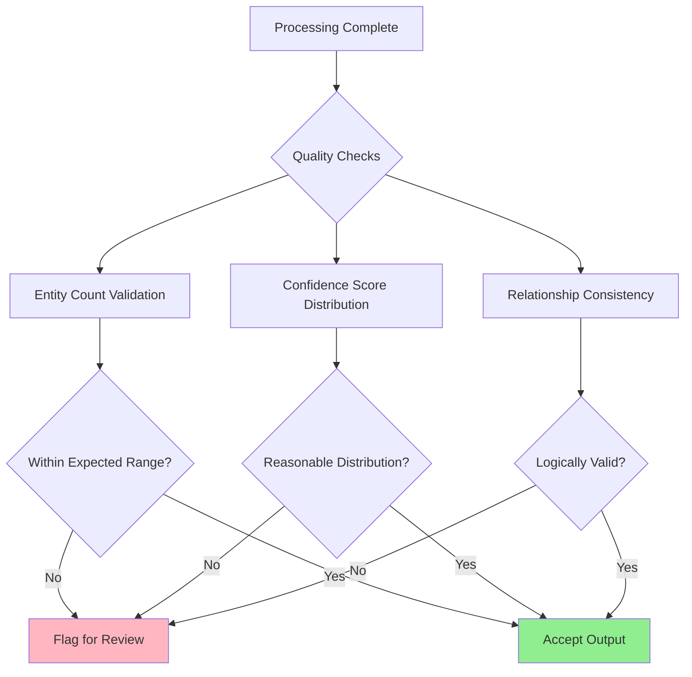

**Validation Rules:**

1. **Entity Count Check:**
```python
if len(entities) == 0:
    log_warning("No entities found - possible extraction failure")

if len(entities) > 50:
    log_warning("Unusually high entity count - verify quality")
```

2. **Confidence Distribution:**
```python
avg_confidence = sum(e['confidence'] for e in entities) / len(entities)

if avg_confidence < 0.5:
    log_warning("Low average confidence - review model performance")
```

3. **Relationship Validation:**
```python
for relation in relations:
    # Check both entities exist
    if relation['entity1'] not in entity_texts:
        log_error("Relationship references non-existent entity")

    # Check logical consistency
    if relation['entity1_type'] not in ['CONTACT']:
        log_error("Invalid entity type in relationship")
```

### 9.2 Output Quality Metrics

**Metrics Tracked:**
- Entities per document (average, min, max)
- Confidence score distribution
- Relationship detection rate
- Processing time per document
- Error/warning frequency

**Quality Thresholds:**
```python
QUALITY_THRESHOLDS = {
    'min_entities_per_doc': 1,
    'max_entities_per_doc': 100,
    'min_avg_confidence': 0.6,
    'max_processing_time': 10.0,  # seconds
    'max_error_rate': 0.05  # 5%
}
```

---

## 10. Performance Monitoring

### 10.1 Processing Metrics

**Tracked Metrics:**

| Metric | Description | Target |
|--------|-------------|--------|
| **Throughput** | Documents per minute | >10 docs/min |
| **Latency** | Seconds per document | <5 sec |
| **NER Coverage** | % docs with entities | >95% |
| **REL Coverage** | % docs with relations | >60% |
| **Error Rate** | % failed documents | <1% |

### 10.2 Model Performance Monitoring

```python
class PerformanceMonitor:
    def __init__(self):
        self.metrics = {
            'documents_processed': 0,
            'total_entities': 0,
            'total_relations': 0,
            'processing_times': [],
            'errors': 0
        }

    def log_document(self, entities, relations, processing_time):
        self.metrics['documents_processed'] += 1
        self.metrics['total_entities'] += len(entities)
        self.metrics['total_relations'] += len(relations)
        self.metrics['processing_times'].append(processing_time)

    def report(self):
        avg_time = sum(self.metrics['processing_times']) / len(self.metrics['processing_times'])
        avg_entities = self.metrics['total_entities'] / self.metrics['documents_processed']
        avg_relations = self.metrics['total_relations'] / self.metrics['documents_processed']

        print(f"Processed: {self.metrics['documents_processed']} documents")
        print(f"Avg processing time: {avg_time:.2f} sec")
        print(f"Avg entities/doc: {avg_entities:.1f}")
        print(f"Avg relations/doc: {avg_relations:.1f}")
```

---

## 11. Future Functional Enhancements

### 11.1 Enhanced Entity Extraction

**Proposed Features:**
- Additional entity types (PERSON, LOCATION, MONEY, DATE)
- Entity normalization (resolve variations)
- Entity disambiguation (distinguish same-name entities)
- Coreference resolution (track entity mentions)

### 11.2 Advanced Relationship Extraction

**Proposed Features:**
- Additional relationship types:
  - CONTACT-ADDRESS (where person is located)
  - ORG-SITE (organization's project sites)
  - CONTACT-SITE (responsible party for site)
- Multi-hop relationships (transitive connections)
- Relationship attributes (role, time period, status)

### 11.3 Workflow Automation

**Proposed Features:**
- Automated document ingestion from email/FTP
- Scheduled batch processing
- Real-time processing with webhooks
- Automated quality checks and alerts
- Integration with document management systems

---

## Document Information

**Document Version**: 1.0
**Last Updated**: December 2025
**POC Status**: Proof of Concept
**Target Audience**: Business analysts, data engineers, QA teams, implementation teams
