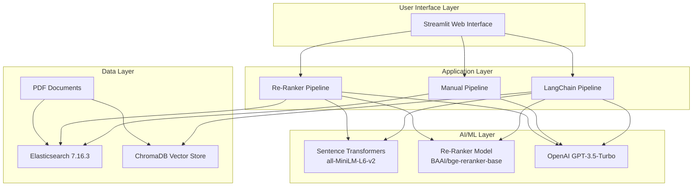
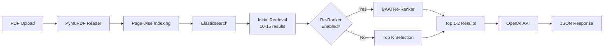
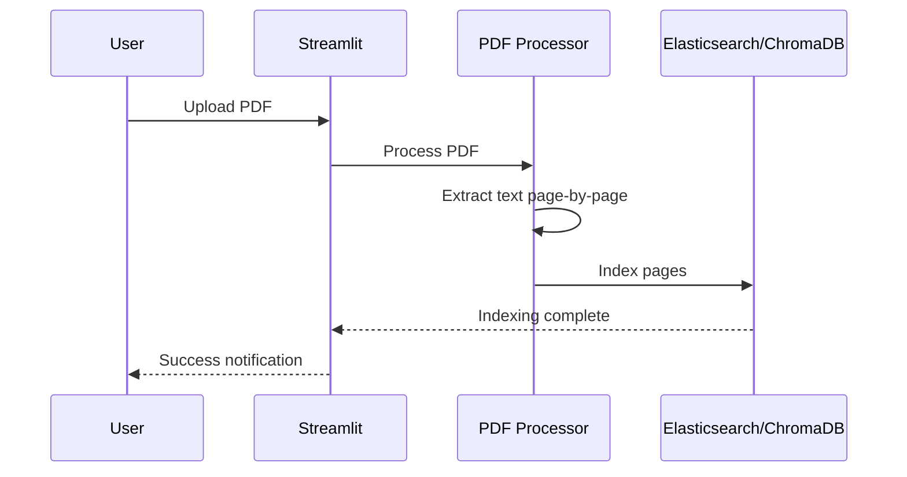
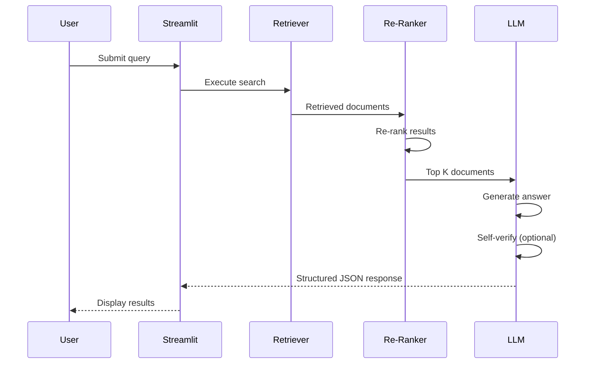
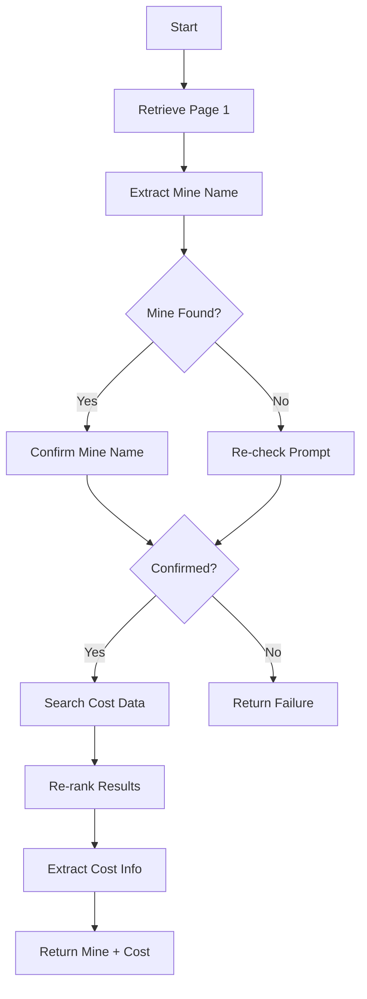
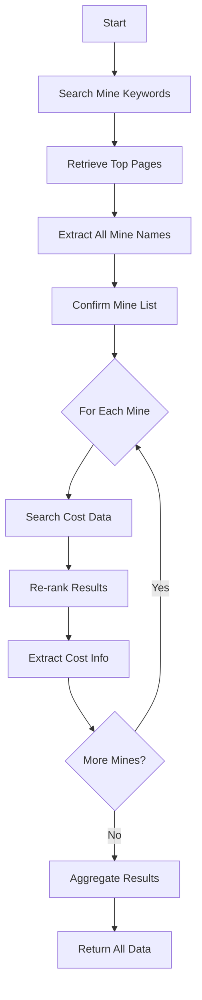

# Technical Architecture

## Overview

The CRU POC implements a Retrieval-Augmented Generation (RAG) architecture that combines semantic search, document retrieval, and large language model (LLM) generation to extract structured information from mining industry documents. The system consists of three distinct pipeline implementations, each offering different trade-offs between complexity, performance, and accuracy.

## High-Level Architecture



## System Components

### 1. Frontend Layer

#### Streamlit Web Interface

**Technology**: Streamlit 1.26.0

**Features**:
- File upload interface for PDF documents
- Pipeline selection (LangChain, Manual, Re-Ranker)
- Real-time processing status indicators
- Results visualization in tabular format
- Session state management for multi-step workflows

**Key Files**:
- `langchain_pipeline/home.py`
- `manual_pipeline/home_ui.py`
- `re_ranker_pipeline/home.py`

### 2. Pipeline Architectures

The system implements three distinct pipeline architectures, each optimized for different use cases:

#### Pipeline 1: LangChain Pipeline

**Purpose**: Leverages LangChain framework for vector-based retrieval with ChromaDB

**Architecture**:


**Key Components**:
- **Document Loader**: PyMuPDF for PDF text extraction
- **Text Splitter**: RecursiveCharacterTextSplitter (1200 char chunks, 20 char overlap)
- **Vector Store**: ChromaDB with persistent storage
- **Embedding Model**: all-MiniLM-L6-v2 (Sentence Transformers)
- **Retrieval Strategy**: Maximum Marginal Relevance (MMR)
- **Re-Ranker**: BAAI/bge-reranker-base for result refinement
- **LLM Chain**: LangChain QA chain with custom prompts

**Configuration** (`langchain_pipeline/config.ini`):
```ini
[models]
embedding_model = all-MiniLM-L6-v2
ranker_model = BAAI/bge-reranker-base
retriever_size = 15
mine_ranker_size = 5
cost_ranker_size = 2

[chunk]
chunk_size = 1200
overlap_size = 20
separators = ["\n\n","."]
```

**Advantages**:
- Semantic understanding of queries
- Efficient vector-based retrieval
- Strong performance on complex queries
- Persistent vector database

**Use Case**: Best for complex semantic queries requiring deep understanding

#### Pipeline 2: Manual Pipeline

**Purpose**: Direct Elasticsearch queries without vector embeddings

**Architecture**:


**Key Components**:
- **Document Processing**: PyMuPDF page-by-page extraction
- **Search Backend**: Elasticsearch 7.16.3
- **Query Type**: Boolean queries with query_string for cost data
- **Content Filtering**: Regex-based index page detection
- **LLM**: Direct OpenAI ChatCompletion API calls

**Query Strategies**:
```python
# Single Mine Query (Page 1 only)
{"bool": {
    "must": [
        {"term": {"page": "1"}},
        {"match": {"file": fname}}
    ]
}}

# Cost Query (Query String)
{"bool": {
    "must": [
        {"match": {"file": fname}},
        {"query_string": {
            "default_field": "content",
            "query": "(capital costs) OR (Total cash cost) OR ..."
        }}
    ]
}}
```

**Advantages**:
- Simple, transparent keyword-based search
- Fast processing for straightforward queries
- No vector computation overhead
- Direct control over search logic

**Use Case**: Best for keyword-based searches and rapid prototyping

#### Pipeline 3: Re-Ranker Pipeline

**Purpose**: Hybrid approach combining Elasticsearch retrieval with neural re-ranking

**Architecture**:



**Key Components**:
- **Initial Retrieval**: Elasticsearch with configurable result size
- **Re-Ranking Model**: BAAI/bge-reranker-base (transformer-based)
- **Scoring**: Cross-encoder architecture for query-document pairs
- **Flexibility**: Optional re-ranker via UI toggle

**Re-Ranking Process**:
```python
# Create query-document pairs
pairs = [[query, doc_content] for doc_content in retrieved_docs]

# Score pairs using transformer
with torch.no_grad():
    inputs = tokenizer(pairs, padding=True, truncation=True,
                      return_tensors='pt', max_length=512)
    scores = model(**inputs, return_dict=True).logits

# Select top K by score
top_k_indices = sorted(range(len(scores)),
                      key=lambda i: scores[i],
                      reverse=True)[:k]
```

**Configuration** (`re_ranker_pipeline/config.ini`):
```ini
[query_params]
# Retrieval sizes
single_retriever_size = 10
cost_retriever_size = 10
mine_retriever_size = 3

# Re-ranker output sizes
single_reranker_size = 2
cost_reranker_size = 1
mine_reranker_size = 2

# Elasticsearch output sizes (when re-ranker disabled)
single_elastic_size = 2
cost_elastic_size = 1
mine_elastic_size = 2
```

**Advantages**:
- Best of both worlds: fast retrieval + accurate ranking
- Improved precision over keyword search
- Configurable trade-off between speed and accuracy
- Handles complex query-document relevance

**Use Case**: Production use cases requiring balance of speed and accuracy

### 3. AI/ML Layer

#### Embedding Models

**Sentence Transformers (all-MiniLM-L6-v2)**
- **Purpose**: Convert text to dense vector representations
- **Dimensions**: 384
- **Speed**: Fast inference (~50ms per encoding)
- **Use**: Document and query embedding for semantic search

#### Re-Ranking Models

**BAAI/bge-reranker-base**
- **Architecture**: Cross-encoder transformer
- **Purpose**: Re-rank retrieved documents by relevance
- **Input**: Query-document pairs
- **Output**: Relevance scores
- **Use**: Improve precision of top results

#### Language Models

**OpenAI GPT-3.5-Turbo**
- **API Version**: openai==0.28.0
- **Temperature**: 0 (deterministic outputs)
- **Max Tokens**: 512
- **Response Format**: Structured JSON
- **Use Cases**:
  - Mine name extraction
  - Cost information extraction
  - Self-verification and confirmation

### 4. Data Layer

#### Elasticsearch

**Version**: 7.16.3

**Index Structure**:
```json
{
  "content": "text content of page",
  "content_type": "text",
  "embedding": null,
  "file": "filename_without_extension",
  "page": 1
}
```

**Features**:
- Page-level document granularity
- Full-text search capabilities
- Boolean and query_string queries
- File-level filtering

**Operations**:
- Index: Per-page document insertion
- Search: Boolean queries with relevance scoring
- Delete: Bulk deletion for re-indexing

#### ChromaDB (LangChain Pipeline Only)

**Purpose**: Persistent vector storage for embeddings

**Collections**:
1. **mine_collection**: Chunked documents for mine name retrieval
2. **cost_collection**: Full-page documents for cost retrieval

**Features**:
- Persistent local storage
- Maximum Marginal Relevance (MMR) search
- Metadata filtering (file_path, page numbers)
- Automatic similarity search

## Technology Stack

### Core Dependencies

```
# Search and Retrieval
elasticsearch==7.16.3        # Primary search backend
chromadb                      # Vector database (LangChain)
langchain                     # RAG orchestration framework

# AI/ML
openai==0.28.0               # LLM API
transformers==4.34.0         # Re-ranking models
sentence-transformers        # Embedding models
torch==2.1.0                 # Deep learning framework

# Document Processing
PyMuPDF==1.19.6             # PDF text extraction

# Web Interface
streamlit==1.26.0            # UI framework

# Data Handling
pandas==2.1.0               # Data manipulation
```

### Infrastructure Requirements

**Elasticsearch**:
- Host: 172.27.139.105
- Port: 9200
- Authentication: Basic auth (username/password)
- Index: cru-poc-demo

**ChromaDB**:
- Storage: Local persistent directory
- Path: /home/merit/Madhan/Research/Langchain/DB/test

**Compute**:
- GPU: Optional (for faster re-ranking)
- CPU: Multi-core recommended for parallel processing
- RAM: 8GB+ recommended for model loading

## Data Flow

### Document Ingestion Flow



### Query Processing Flow



### Single Mine Workflow



### Multi-Mine Workflow



## Configuration Management

All pipelines use INI-based configuration files for flexibility:

### Configuration Categories

1. **Credentials**: API keys, database connections
2. **Models**: Embedding and re-ranking model names
3. **Queries**: Customizable query templates and prompts
4. **Parameters**: Retrieval sizes, chunk sizes, thresholds
5. **Paths**: Database and file storage locations

### Configuration File Structure

```ini
[credentials]
elastic_host = 172.27.139.105
api_key = sk-xxxxx
gpt_model = gpt-3.5-turbo

[prompts]
single_mine_header = Use the below article...
mine_key = mine
cost_key = costs

[query_params]
single_retriever_size = 10
single_reranker_size = 2
```

## Security Considerations

1. **API Key Management**: Keys stored in config files (should be moved to environment variables for production)
2. **Data Privacy**: Documents processed locally, only queries sent to OpenAI
3. **Authentication**: Elasticsearch requires username/password authentication
4. **Access Control**: No built-in user authentication (single-user POC)

## Scalability and Performance

### Current Limitations

- Single-document processing (no batch mode)
- In-memory model loading (RAM intensive)
- Synchronous processing (no async/parallel queries)
- Local file storage

### Performance Characteristics

- **Document Indexing**: ~1-2 seconds per page
- **Query Latency**: 5-15 seconds end-to-end
- **Re-ranking Overhead**: +2-3 seconds for transformer inference
- **LLM Latency**: 3-10 seconds per OpenAI API call

### Optimization Opportunities

1. **Caching**: Cache embeddings and re-ranking scores
2. **Batching**: Process multiple documents in parallel
3. **Model Optimization**: Quantization, ONNX conversion for faster inference
4. **Async Processing**: Non-blocking I/O for API calls
5. **Distributed Search**: Elasticsearch cluster for scale

## Error Handling and Resilience

### Error Handling Patterns

1. **Config Validation**: Check config file on startup
2. **Graceful Degradation**: Fall back to elastic-only if re-ranker fails
3. **Retry Logic**: Implicit in OpenAI SDK
4. **User Feedback**: Streamlit error messages and spinners

### Monitoring Points

- Indexing success/failure rates
- Query processing times
- LLM API response quality
- Re-ranker score distributions

## Deployment Architecture

### Current Setup (Development)

```
Server: 172.27.137.173
Environment: conda (cru_env)
Working Directory: /home/merit/Madhan/CRU/Code
Command: streamlit run home.py
Port: Default Streamlit port (8501)
```

### Production Considerations

1. **Containerization**: Docker for consistent deployments
2. **Load Balancing**: Multiple Streamlit instances
3. **Database**: Managed Elasticsearch cluster
4. **Secrets Management**: Vault or AWS Secrets Manager
5. **Monitoring**: Application and infrastructure metrics
6. **Logging**: Centralized log aggregation

## Conclusion

The CRU POC technical architecture demonstrates a modular, flexible approach to RAG-based document intelligence. The three pipeline options provide users with choices based on their specific accuracy, speed, and complexity requirements. The system leverages best-in-class open-source technologies (Elasticsearch, Transformers) combined with state-of-the-art LLMs (OpenAI) to deliver reliable information extraction from complex mining documents.
