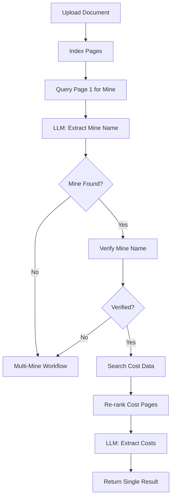
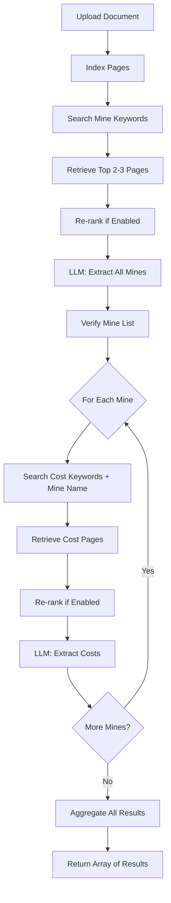

# Functional Architecture

## Overview

The CRU POC functional architecture describes how the system processes mining documents to extract structured information about mines and their associated costs. This document details the functional components, workflows, and business logic that transform raw PDF documents into actionable business intelligence.

## Functional Components

### 1. Document Processing Module

#### PDF Upload and Validation

**Purpose**: Accept and validate user-uploaded PDF documents

**Functionality**:
- Accept PDF files through Streamlit file uploader
- Validate file format (PDF only)
- Extract filename for tracking
- Store file temporarily for processing

**Business Rules**:
- Only PDF format accepted
- File must be readable by PyMuPDF
- Filename used as unique identifier
- Existing data for same file is cleared before re-indexing

#### Text Extraction

**Purpose**: Extract textual content from PDF pages

**Functionality**:
- Parse PDF structure using PyMuPDF (fitz library)
- Extract text content page by page
- Preserve page numbers for reference
- Handle multi-column layouts and tables

**Output Structure**:
```python
{
    'content': 'Extracted text from page',
    'content_type': 'text',
    'embedding': None,  # Populated later if using vector search
    'file': 'document_name',
    'page': 1  # 1-indexed page number
}
```

**Edge Cases**:
- Scanned PDFs without OCR: Will extract empty content
- Image-heavy pages: Only text layers extracted
- Tables: Extracted as linear text (may lose structure)

#### Document Chunking (LangChain Pipeline Only)

**Purpose**: Split long documents into semantically coherent chunks

**Functionality**:
- Split text using RecursiveCharacterTextSplitter
- Respect natural boundaries (paragraphs, sentences)
- Create overlapping chunks for context preservation
- Maintain metadata (source page, file path)

**Configuration**:
- **Chunk Size**: 1200 characters
- **Overlap**: 20 characters
- **Separators**: ["\n\n", "."] (prioritize paragraphs, then sentences)

**Rationale**:
- 1200 chars balances context vs. granularity
- Overlap ensures concepts spanning boundaries aren't lost
- Paragraph-first splitting maintains semantic coherence

### 2. Indexing and Storage Module

#### Elasticsearch Indexing (Manual & Re-Ranker Pipelines)

**Purpose**: Create searchable index of document pages

**Functionality**:
- Index each page as separate document
- Support full-text search and query_string queries
- Enable file-level filtering
- Allow rapid re-indexing by clearing previous data

**Index Strategy**:
```json
{
    "mappings": {
        "properties": {
            "content": {"type": "text"},
            "file": {"type": "keyword"},
            "page": {"type": "integer"}
        }
    }
}
```

**Operations**:
- **Insert**: Page-by-page bulk indexing
- **Delete**: Clear all docs before re-indexing same file
- **Search**: Boolean queries with file and content filters

#### ChromaDB Vector Storage (LangChain Pipeline)

**Purpose**: Store vector embeddings for semantic search

**Functionality**:
- Convert text chunks to dense vectors using SentenceTransformers
- Store vectors with metadata in persistent collections
- Support Maximum Marginal Relevance (MMR) retrieval
- Enable metadata filtering (file path, page numbers)

**Collections**:

1. **mine_collection**
   - Content: Chunked document segments
   - Purpose: Mine name identification
   - Retrieval: MMR with k=15, rerank to top 5

2. **cost_collection**
   - Content: Full page documents
   - Purpose: Cost information extraction
   - Retrieval: MMR with k=15, rerank to top 2

**Why Two Collections?**
- Mine names often mentioned briefly: benefit from fine-grained chunks
- Cost data in tables/sections: benefit from full-page context

### 3. Query Processing Module

#### Query Types

The system handles two primary query types, each with single and multi-mine variants:

**1. Mine Identification Query**
- **Goal**: Extract names of active mines or properties
- **Approach**: Search page 1 (single) or top pages (multi)
- **Output**: JSON with mine names

**2. Cost Extraction Query**
- **Goal**: Extract capital costs and breakdowns
- **Approach**: Search using cost-related keywords
- **Output**: JSON with costs, currency, denomination

#### Query Templates

**Single Mine Query**:
```
Question: Is there any specific mine plant or property
mentioned in the report? If so, what is its name?

Context: First page of document
```

**Multi-Mine Query**:
```
Question: List all the active mine names mentioned in the article?

Context: Top 2-3 pages mentioning "mines", "property", "operates"
```

**Cost Query**:
```
Question: What are the capital cost or capital expenditure
and its breakdown in the given article? Include currency
and denomination.

Context: Pages containing cost keywords
Search Terms: (capital costs) OR (Total cash cost) OR
(LOM Capital Expenditure) OR (Capital expenditure) OR
(sustaining capital) OR (operating cash flow)
```

### 4. Retrieval Module

#### Retrieval Strategies by Pipeline

**LangChain Pipeline: Maximum Marginal Relevance (MMR)**

**How It Works**:
1. Embed user query using SentenceTransformers
2. Compute similarity with all document embeddings
3. Select top K most similar chunks
4. Apply MMR algorithm to balance relevance and diversity
5. Return ranked list of document chunks

**Parameters**:
- **k**: Number of results to retrieve (15 for mine, 15 for cost)
- **Diversity Factor**: Implicit in MMR algorithm
- **Filter**: File path to scope search to current document

**Advantages**:
- Captures semantic similarity beyond keywords
- Diversity prevents redundant results
- Handles paraphrases and synonyms well

**Manual Pipeline: Elasticsearch Boolean Queries**

**Single Mine Search**:
```python
{
    "bool": {
        "must": [
            {"term": {"page": "1"}},  # First page only
            {"match": {"file": filename}}
        ]
    }
}
```

**Cost Search**:
```python
{
    "bool": {
        "must": [
            {"match": {"file": filename}},
            {"query_string": {
                "query": "(capital costs) OR (Total cash cost) OR ..."
            }}
        ]
    }
}
```

**Advantages**:
- Fast, deterministic results
- Transparent query logic
- No vector computation overhead

**Re-Ranker Pipeline: Hybrid Retrieval**

**Two-Stage Process**:

1. **Stage 1: Initial Retrieval (Elasticsearch)**
   - Broad search with configurable size (e.g., 10 results)
   - Uses same query strategies as Manual pipeline
   - Fast initial filtering

2. **Stage 2: Neural Re-Ranking**
   - Score each query-document pair using transformer
   - Compute cross-attention between query and content
   - Select top K by relevance score
   - Configurable re-ranker size (1-2 results)

**Re-Ranking Algorithm**:
```python
def rerank(query, documents, top_k):
    # Create pairs
    pairs = [[query, doc] for doc in documents]

    # Tokenize and encode
    inputs = tokenizer(pairs, padding=True, truncation=True,
                      max_length=512)

    # Score with cross-encoder
    scores = model(**inputs).logits.flatten()

    # Select top K
    top_indices = argsort(scores)[-top_k:]
    return [documents[i] for i in top_indices]
```

**Advantages**:
- Best precision on top results
- Handles semantic nuances better than keyword search
- Configurable trade-off between recall and precision

### 5. Re-Ranking Mechanism

#### When Re-Ranking is Applied

**LangChain Pipeline**: Always enabled
- MMR retrieval: 15 results
- Re-rank using BAAI model: Select top 5 (mine) or 2 (cost)

**Manual Pipeline**: Not used
- Direct Elasticsearch results
- No re-ranking layer

**Re-Ranker Pipeline**: Optional (user toggle)
- Elasticsearch retrieval: 10-15 results
- Re-rank if enabled: Select top 1-2 results
- Direct selection if disabled: Use top 1-2 from Elasticsearch

#### Re-Ranking Model Details

**Model**: BAAI/bge-reranker-base

**Architecture**:
- Type: Cross-encoder (not bi-encoder)
- Input: [CLS] query [SEP] document [SEP]
- Output: Single relevance score per pair
- Parameters: ~278M

**Inference**:
- Batch processing of query-document pairs
- PyTorch no_grad mode for speed
- Max sequence length: 512 tokens
- GPU acceleration supported

**Score Interpretation**:
- Higher scores = more relevant
- Scores are relative (not probabilities)
- Used for ranking, not absolute relevance threshold

### 6. Answer Generation Module

#### Prompt Engineering

**Prompt Structure**:
```
[HEADER: Instructions and output format]

Article:
"""
[Retrieved document content]
"""

Question: [Specific question]
```

**Header Instructions**:
- Define task and constraints
- Specify output format (JSON)
- Define keys for response (flag, mine/mines, costs)
- Instruct to return flag='False' if answer not found

**Example Mine Prompt**:
```
Use the below article to answer the subsequent question.
If the answer cannot be found, return 'flag' = 'False' in
json format, if answer found return it as
'flag':'True','mine': name of the mine in json format.

Article:
"""
[Page 1 content]
"""

Question: Is there any specific mine plant or property
mentioned in the report? If so, what is its name?
```

**Example Cost Prompt**:
```
Use the below article to answer the subsequent question.
If the answer cannot be found, return 'flag' = 'False' in
json format, if answer found return it as
'flag':'True','costs': total cost and breakdown costs in
json format.

Article:
"""
[Cost-related pages]
"""

Question: What are the capital cost or capital expenditure
and its breakdown? Include currency and denomination.
```

#### OpenAI API Integration

**API Configuration**:
- **Model**: gpt-3.5-turbo (ChatCompletion API)
- **Temperature**: 0 (deterministic, factual responses)
- **Max Tokens**: 512 (sufficient for structured responses)
- **Top P**: 1 (no nucleus sampling)
- **Frequency Penalty**: 0
- **Presence Penalty**: 0

**Message Format**:
```python
messages = [
    {'role': 'user', 'content': prompt},
    # Additional messages for self-verification
]
```

**Response Parsing**:
- Extract content from response['choices'][0]['message']
- Parse JSON from content string
- Handle malformed JSON with try-except
- Fall back to raw text if parsing fails

#### Self-Verification Mechanism

**Purpose**: Improve accuracy through LLM self-checking

**Process**:

1. **Initial Answer**: LLM generates first response
2. **Verification Prompt**: System asks LLM to double-check
3. **Final Answer**: LLM confirms or corrects initial response

**Verification Prompts**:

**Positive Verification** (mine found):
```
Can you please double check and re-confirm the mine or
property name {mine_name} is correct. If it is wrong,
please change the flag in json and return it.
```

**Negative Verification** (mine not found):
```
Please confirm that the given article does not contain
the mine or the property name. If it is present, please
change the flag and add the mine name in json and return it.
```

**Why This Works**:
- Leverages LLM's ability to self-critique
- Reduces false positives and false negatives
- Minimal additional latency (one extra API call)
- Conversation context helps LLM reconsider

### 7. Query Modes

#### Single Mine Mode

**Trigger Condition**: Mine name found on page 1

**Workflow**:



**Output Structure**:
```json
{
    "Identified mine name": "Mine ABC",
    "Retrieved pages": "45, 67",
    "QA response": {
        "Total Capital": "$500M USD",
        "Development": "$300M",
        "Sustaining": "$200M",
        "Denomination": "Million"
    }
}
```

**Advantages**:
- Fast processing (only 2-3 pages analyzed)
- High precision (page 1 typically has clear mine name)
- Simple result structure

#### Multi-Mine Mode

**Trigger Condition**:
- No mine found on page 1, OR
- User explicitly expects multiple mines

**Workflow**:



**Search Strategy**:
- **Mine Search**: Keywords like "mines", "property", "owns and operates"
- **Cost Search**: Combine cost keywords with specific mine name
  ```
  "capital expenditure" AND "Mine XYZ"
  ```

**Output Structure**:
```json
[
    {
        "Identified mine name": "Mine ABC",
        "Retrieved pages": [12, 34],
        "QA response": {
            "Capital Expenditure": "$500M USD"
        }
    },
    {
        "Identified mine name": "Mine XYZ",
        "Retrieved pages": [45, 67],
        "QA response": {
            "Capital Expenditure": "$300M USD"
        }
    }
]
```

**Advantages**:
- Comprehensive coverage of portfolio companies
- Parallel structure for easy comparison
- Detailed per-mine breakdowns

**Challenges**:
- Higher latency (N+1 LLM calls for N mines)
- Potential for cross-mine confusion
- More complex result parsing

### 8. Context Management

#### Context Window Optimization

**Challenge**: LLM context limits (GPT-3.5-turbo: 4096 tokens)

**Strategies**:

1. **Selective Retrieval**
   - Retrieve 10-15 pages initially
   - Re-rank to top 1-2 for final prompt
   - Typical prompt: 1500-2500 tokens

2. **Content Filtering**
   - Filter out index pages (detected by `\.{10,}` regex)
   - Remove excessively long tables
   - Prioritize text-heavy content

3. **Chunk Management** (LangChain)
   - 1200-char chunks fit comfortably in context
   - 5 chunks = ~6000 chars = ~1500 tokens
   - Leaves room for instructions and response

#### Context Preservation Strategies

**Overlap**: 20-char overlap between chunks
- Ensures sentence boundaries don't split concepts
- Minimal redundancy

**Metadata Tracking**:
- Every chunk/page has source reference
- Enables traceability to original document
- Supports multi-turn conversations (future)

### 9. Response Formatting Module

#### JSON Structure Enforcement

**Required Keys**:
- `flag`: "True" or "False" (string, not boolean)
- `mine` or `mines`: Single string or array of strings
- `costs`: Object with cost breakdowns

**Validation**:
- Try to parse response as JSON
- Check for required keys
- Handle malformed JSON gracefully
- Fall back to raw text if parsing fails

**Flattening for Display**:
```python
def flatten_dict(dct):
    items = {}
    for key, val in dct.items():
        new_key = key.upper()
        if isinstance(val, dict):
            items.update(flatten_dict(val))  # Recursive
        else:
            items[new_key] = val
    return items
```

**Result**: Nested cost breakdowns become flat table rows

#### Result Aggregation

**Single Mine**: Single dictionary object

**Multi-Mine**: Array of dictionaries
```python
[
    {"mine": "ABC", "pages": [1,2], "cost": {...}},
    {"mine": "XYZ", "pages": [3,4], "cost": {...}}
]
```

**Display Transformation**:
- Convert to Pandas DataFrame
- Transpose for vertical display
- Fill NaN with "-" for clarity
- Render in Streamlit table widget

### 10. Error Handling and Edge Cases

#### Document Processing Errors

**Empty PDFs**:
- Symptom: No text extracted
- Handling: Indexing completes but queries return no results
- User Feedback: "No mine name found"

**Scanned PDFs**:
- Symptom: Image-only pages
- Handling: OCR not implemented in POC
- Recommendation: Pre-process with OCR tool

**Corrupted PDFs**:
- Symptom: PyMuPDF read error
- Handling: Exception caught, error message displayed
- User Feedback: "Indexing failed"

#### Query Processing Errors

**No Relevant Pages**:
- Symptom: Elasticsearch returns 0 results
- Handling: LLM receives minimal context
- LLM Response: `{"flag": "False"}`
- User Feedback: "Unable to find cost data"

**LLM Malformed Response**:
- Symptom: Response is not valid JSON
- Handling: Try-except around json.loads()
- Fallback: Wrap raw text in cost field
- User sees: Raw LLM text instead of structured data

**API Failures**:
- Symptom: OpenAI API timeout or error
- Handling: Exception caught
- User Feedback: "QA failed, try again"

#### Content Filtering Edge Cases

**Index Pages**:
- Detection: Regex `\.{10,}` matches table of contents dots
- Action: Skip pages with 2+ matches
- Rationale: Index pages have low information density

**Multi-Column Tables**:
- Issue: PyMuPDF may not preserve column order
- Impact: Cost breakdowns may be garbled
- Mitigation: LLM's language understanding compensates partially

**Currency and Denomination**:
- Challenge: Variations like "M", "million", "$M", "USD millions"
- Handling: Explicitly prompt LLM to extract denomination
- LLM typically succeeds due to training data exposure

## Functional Quality Attributes

### Accuracy

**Target**: 90%+ precision on mine name extraction

**Mechanisms**:
- Page 1 heuristic (mines usually named early)
- Self-verification prompts
- Re-ranking for relevance
- Structured JSON output enforcement

### Completeness

**Goal**: Extract all mines in multi-mine documents

**Mechanisms**:
- Broad keyword search for initial retrieval
- Multiple page analysis (top 2-3)
- Explicit prompt to "list ALL active mines"
- Verification step to ensure completeness

### Consistency

**Goal**: Same document + query = same results

**Mechanisms**:
- Temperature=0 for deterministic LLM
- Fixed retrieval parameters
- Deterministic re-ranking (no randomness)

**Exception**: Elasticsearch relevance scores may vary slightly

### Traceability

**Goal**: All answers linked to source pages

**Mechanisms**:
- Page numbers returned with every answer
- Original page content preserved in index
- User can verify against source PDF
- Supports audit and compliance requirements

### Performance

**Target**: <10 seconds end-to-end for single mine

**Actual**:
- Indexing: 1-2 sec/page
- Retrieval: 1-2 seconds
- Re-ranking: 2-3 seconds
- LLM: 3-10 seconds per call
- **Total**: 5-15 seconds single mine, 15-60 seconds multi-mine

## Conclusion

The functional architecture of the CRU POC is designed around the core workflows of mining document analysis: identifying properties and extracting financial data. Through intelligent document processing, semantic retrieval, neural re-ranking, and LLM-based extraction with self-verification, the system delivers accurate, traceable, and structured information from complex PDF documents. The dual-mode operation (single vs. multi-mine) provides flexibility for different document types, while the modular pipeline design allows users to choose the optimal balance of speed, accuracy, and complexity for their use case.
