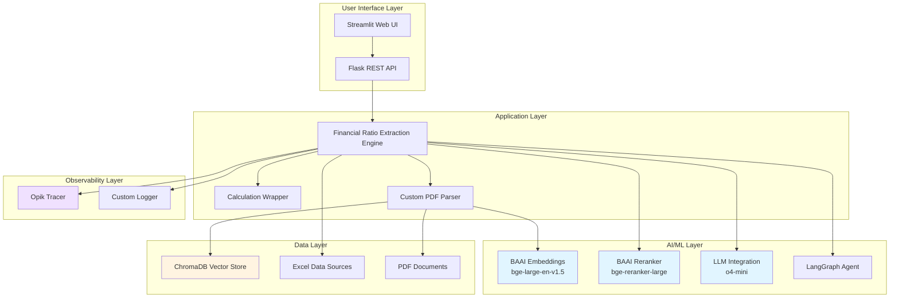
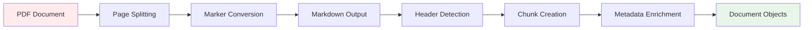
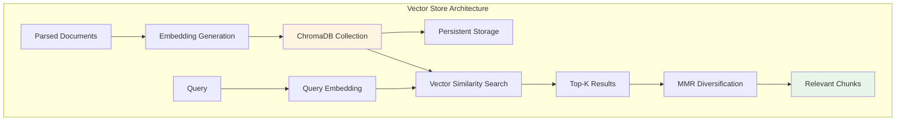
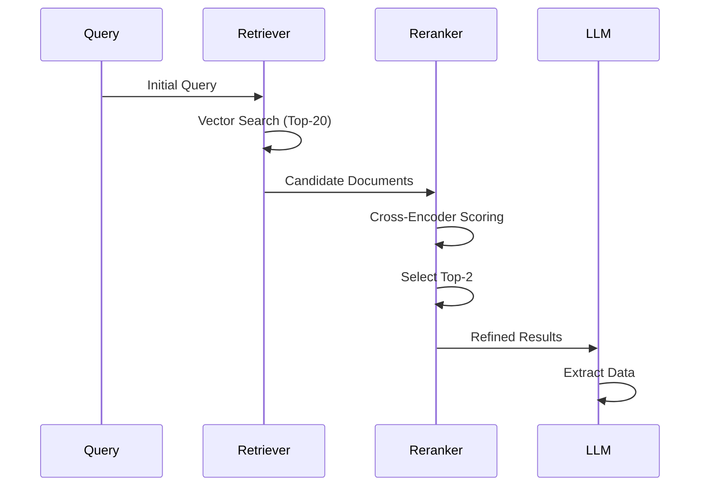
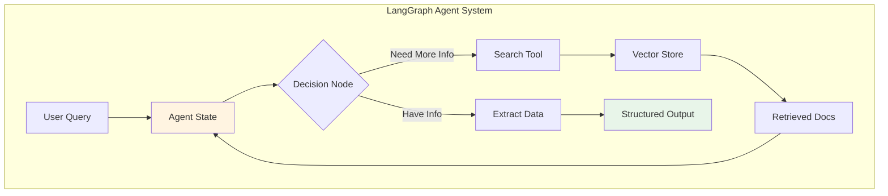
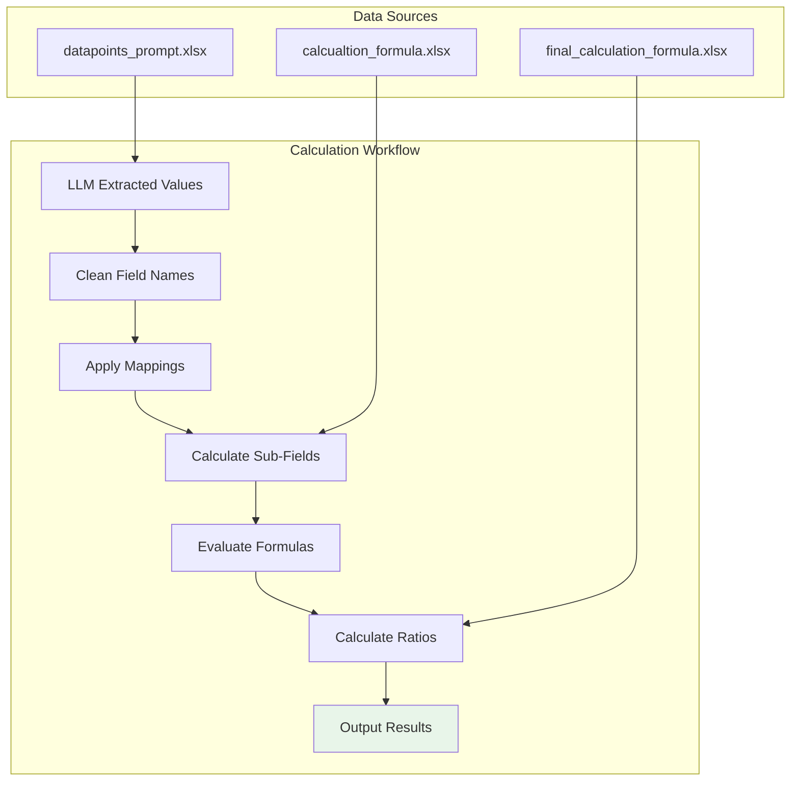
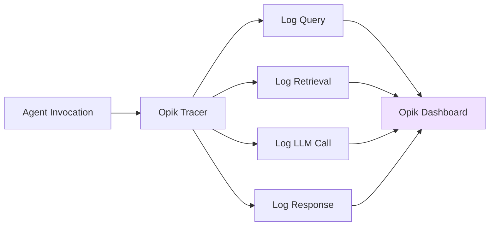
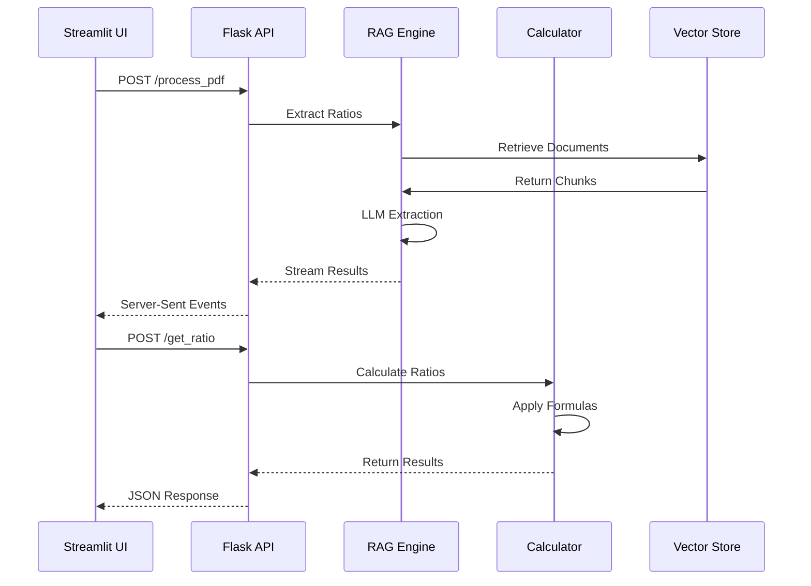
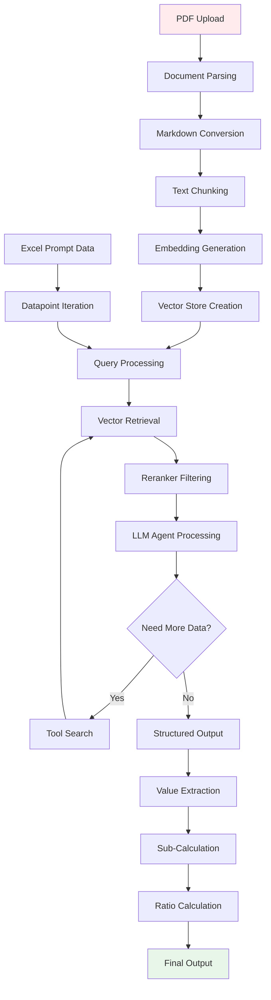

# Technical Architecture

## System Overview

The Grant Thornton POC is built on a modern AI-driven architecture that combines advanced natural language processing, retrieval-augmented generation (RAG), and vector search technologies to extract and analyze financial data from annual reports. The system leverages state-of-the-art embeddings, cross-encoder reranking, and large language models to achieve high accuracy in financial metric extraction.



## Core Components

### 1. Document Processing Pipeline

#### PDF Parser (parser.py)

The custom PDF parser is responsible for converting PDF annual reports into structured, searchable content.

**Key Technologies**:
- **Marker PDF Converter**: Converts PDF pages to high-quality markdown format
- **PyMuPDF (fitz)**: Handles PDF page splitting and manipulation
- **LangChain Text Splitters**: Markdown header-based text chunking

**Architecture Flow**:



**Key Features**:

1. **Page-by-Page Processing**
   ```python
   # Split PDF into individual pages
   split_pdf(path: str) -> List[Dict[str, str]]
   ```
   - Creates separate PDF files for each page
   - Generates page-level metadata
   - Tracks end-of-file markers

2. **Markdown Conversion**
   ```python
   # Convert PDF page to markdown with structure
   pdf2markdown(payload: Dict[str, str]) -> List[Document]
   ```
   - Preserves document hierarchy (headers, sections)
   - Extracts tables and financial data
   - Maintains formatting for accurate extraction

3. **Header-Based Chunking**
   - Splits content based on markdown headers (#, ##, ###)
   - Maintains context within chunks
   - Preserves hierarchical relationships

4. **Metadata Management**
   - Source file path tracking
   - Page number references
   - Chunk numbering
   - Header hierarchy preservation

**Configuration** (config.yaml):
```yaml
head_tags:
  "#": "#"
  "##": "##"
  "###": "###"
```

### 2. Embedding and Vector Storage

#### BAAI Embeddings Model

**Model**: `BAAI/bge-large-en-v1.5`

This is a state-of-the-art embedding model specifically designed for retrieval tasks, providing superior performance on financial and technical documents.

**Specifications**:
- **Model Type**: Dense retriever
- **Embedding Dimension**: 1024
- **Context Length**: 512 tokens
- **Language**: English
- **Performance**: Top-tier on MTEB benchmark

**Configuration**:
```yaml
embed_model_name: BAAI/bge-large-en-v1.5
embed_model_kwargs:
  device: "cuda"  # GPU acceleration
```

**Implementation**:
```python
from langchain_huggingface.embeddings import HuggingFaceEmbeddings

embed_model = HuggingFaceEmbeddings(
    model_name="BAAI/bge-large-en-v1.5",
    model_kwargs={"device": "cuda"}
)
```

**Key Advantages**:
- Excellent semantic understanding of financial terminology
- Strong performance on domain-specific content
- Fast inference with GPU acceleration
- Optimized for retrieval accuracy

#### ChromaDB Vector Store

**Architecture**:



**Features**:

1. **Persistent Storage**
   ```yaml
   persist_directory: vector_store
   ```
   - Stores embeddings on disk
   - Enables reuse across sessions
   - Reduces processing time for repeat queries

2. **Collection Management**
   - MD5 hash-based collection naming
   - Prevents duplicate processing
   - Enables multi-document management

3. **Retrieval Configuration**
   ```python
   retriever = vector_store.as_retriever(
       search_kwargs={"k": 20},
       search_type="mmr"  # Maximum Marginal Relevance
   )
   ```

4. **MMR (Maximum Marginal Relevance)**
   - Balances relevance and diversity
   - Reduces redundancy in results
   - Improves coverage of financial statements

### 3. Re-ranking System

#### BAAI BGE Reranker

**Model**: `BAAI/bge-reranker-large`

A cross-encoder model that provides superior accuracy in ranking document relevance compared to bi-encoder retrieval alone.

**Architecture Pattern**:



**Configuration**:
```yaml
reranker_model_name: BAAI/bge-reranker-large
reranker_model_kwargs:
  device: "cuda"
top_n: 2  # Return top 2 most relevant
```

**Implementation**:
```python
from langchain.retrievers import ContextualCompressionRetriever
from langchain.retrievers.document_compressors import CrossEncoderReranker

base_compressor = CrossEncoderReranker(
    model=reranker_model,
    top_n=2
)

reranker_retriever = ContextualCompressionRetriever(
    base_retriever=retriever,
    base_compressor=base_compressor
)
```

**Two-Stage Retrieval Process**:

1. **Stage 1: Vector Search**
   - Fast, approximate search
   - Retrieves top-20 candidates
   - Uses bi-encoder embeddings

2. **Stage 2: Cross-Encoder Reranking**
   - Precise relevance scoring
   - Evaluates query-document pairs
   - Returns top-2 most relevant

**Benefits**:
- Higher precision in document selection
- Better context for LLM extraction
- Reduced false positives
- Improved extraction accuracy

### 4. LLM Integration

#### Language Model Configuration

**Model**: `o4-mini` (OpenAI)

```yaml
llm_model_name: o4-mini
```

**LangGraph Agent Architecture**:



**Agent Implementation**:
```python
from langgraph.prebuilt import create_react_agent
from langchain_openai import ChatOpenAI

agent = create_react_agent(
    model=ChatOpenAI(model="o4-mini"),
    tools=[search_financial_details]
)
```

**Tool Integration**:

```python
@tool
def search_financial_details(query: str) -> str:
    """
    This is a tool to search for financial details in the annual report.

    Returns the top 2 most relevant documents containing financial details.
    """
    retrieved_doc = reranker_retriever.invoke(query)
    return retrieved_doc
```

**Agent Capabilities**:
- Autonomous decision-making on when to search
- Multiple retrieval attempts if needed
- Structured output generation
- Error handling and retry logic

#### Structured Output Schema

```python
from pydantic import BaseModel, Field

class ValueSchema(BaseModel):
    """Schema to represent the values of the field"""

    value: float = Field(
        description="Extracted value of the datapoint",
        default=0
    )
    page_no: float = Field(
        description="Page number from where the value is being extracted",
        default=0
    )
    reference_notes: str = Field(
        description="Reference note to help understand the extraction",
        default="Not Applicable"
    )
```

### 5. Calculation Engine

#### Formula Processing System

**Architecture**:



**Key Features**:

1. **Formula Normalization**
   ```python
   def convert_formula(self, formula_str: str):
       # Convert mathematical operators
       formula_str = formula_str.replace("÷", "/")
       formula_str = formula_str.replace("×", "*")

       # Normalize spaces and naming
       formula_str = re.sub(
           r"[A-Za-z]+(?:\s+[A-Za-z]+)+",
           self.to_python_var,
           formula_str
       )
       return formula_str
   ```

2. **Sub-Calculation Processing**
   - Handles intermediate calculations
   - Supports complex ratio formulas
   - Manages dependencies

3. **Field Mapping**
   ```yaml
   mapping_fields:
     "capital_work-in-progress": "capital_wip"
     "total_assets - intangible_assets - capital_work-in-progress":
       "total_assets - intangible_assets - capital_wip"
   ```

4. **Error Handling**
   - Zero division protection
   - Missing value handling
   - Default value assignment

**Sub-Calculations Supported**:
```yaml
sub_calculation_list:
  - avegrage_total_equity
  - tangible_net_worth
  - cash_profit
  - adjusted_total_assets
  - debt_service
  - average_trade_receivables
  - average_trade_payables
  - average_inventory
  - total_bank_borrowings
  - dso  # Days Sales Outstanding
  - dio  # Days Inventory Outstanding
  - dpo  # Days Payable Outstanding
```

### 6. Configuration Management

#### Config-Driven Architecture

**Configuration Files**:

1. **config.yaml**: System configuration
   - Model settings
   - Persistence paths
   - Processing parameters
   - Opik integration

2. **prompts.yaml**: Prompt templates
   - Retriever prompts
   - User prompts
   - Format instructions

**ConfigLoader Implementation**:

```python
from omegaconf import OmegaConf

class ConfigLoader:
    def __init__(self):
        self.config = self.load_yaml_data("config/config.yaml")
        self.prompt = self.load_yaml_data("config/prompts.yaml")

    def load_yaml_data(self, yaml_path: str) -> dict:
        return OmegaConf.load(yaml_path)
```

**Benefits**:
- Centralized configuration
- Easy parameter tuning
- Environment-specific settings
- Version-controlled prompts

### 7. Observability and Monitoring

#### Opik Integration

**Configuration**:
```yaml
opik:
  url: http://172.27.141.49:5173
  project_name: grand_thornton_excel_prompt_app
```

**Implementation**:
```python
import opik
from opik.integrations.langchain import OpikTracer

opik.configure(use_local=True, url=config.opik.url)
opik_tracer = OpikTracer(project_name=config.opik.project_name)
```

**Traced Operations**:



**Monitoring Capabilities**:
- Query and response logging
- Token usage tracking
- Latency measurements
- Error rate monitoring
- Model performance metrics

#### Custom Logging

**LogWriter Implementation**:
```python
from utils.log_writer import CustomLogger

class CustomLogger:
    def __init__(self):
        self.logger = self.setup_logger()

    def handle_critical_error(self, error):
        self.logger.critical(f"Critical error: {error}")
```

**Logging Levels**:
- INFO: Normal operations
- WARNING: Potential issues
- ERROR: Extraction failures
- CRITICAL: System failures

### 8. API Architecture

#### Flask REST API

**Endpoints**:

```python
@app.route("/process_pdf", methods=["POST"])
def process_pdf_doc():
    """Stream extraction results as they are generated"""
    payload = request.get_json()
    return Response(
        stream_with_context(
            extract_financial_ratios_from_excel(payload["path"])
        ),
        mimetype="text/event-stream"
    )

@app.route("/get_ratio", methods=["POST"])
def calc_ratio():
    """Calculate financial ratios from extracted data"""
    payload = request.get_json()
    return jsonify(get_calculated_output(payload["path"]))
```

**API Architecture**:



**Streaming Response**:
- Server-Sent Events (SSE)
- Real-time progress updates
- Incremental result display
- Better user experience

### 9. Data Flow Architecture

#### End-to-End Processing Flow



## Technology Stack

### Core Technologies

| Component | Technology | Version/Model | Purpose |
|-----------|-----------|---------------|---------|
| **Programming Language** | Python | 3.10+ | Primary development language |
| **PDF Processing** | Marker, PyMuPDF | Latest | PDF to Markdown conversion |
| **Embeddings** | BAAI/bge-large-en-v1.5 | Latest | Document embedding generation |
| **Reranker** | BAAI/bge-reranker-large | Latest | Cross-encoder reranking |
| **LLM** | OpenAI o4-mini | Latest | Financial data extraction |
| **Vector Store** | ChromaDB | Latest | Vector similarity search |
| **Framework** | LangChain | Latest | AI orchestration |
| **Agent** | LangGraph | Latest | Agentic workflow |
| **Web UI** | Streamlit | Latest | User interface |
| **API** | Flask | Latest | REST API endpoints |
| **Observability** | Opik | Latest | Monitoring and tracing |
| **Config Management** | OmegaConf | Latest | YAML configuration |

### Dependencies

**Key Python Packages**:
```
langchain
langchain-community
langchain-huggingface
langchain-openai
langchain-chroma
langgraph
chromadb
streamlit
flask
pandas
opik
marker-pdf
PyMuPDF
pydantic
omegaconf
```

## Deployment Architecture

### Infrastructure Requirements

**Hardware**:
- GPU: NVIDIA GPU with CUDA support (for embeddings and reranker)
- RAM: Minimum 16GB, recommended 32GB
- Storage: SSD with 50GB+ free space
- CPU: Multi-core processor (8+ cores recommended)

**Software**:
- Operating System: Linux (Ubuntu 20.04+)
- Python: 3.10+
- CUDA: 11.7+ (for GPU acceleration)
- Docker: Optional for containerized deployment

### Network Configuration

**API Server**:
- Host: 0.0.0.0
- Port: 5050
- Protocol: HTTP

**Opik Server**:
- URL: http://172.27.141.49:5173
- Protocol: HTTP
- Purpose: Observability and monitoring

## Security Considerations

1. **Data Privacy**
   - Local processing of sensitive financial documents
   - No external data transmission (except LLM API)
   - Secure storage of vector embeddings

2. **API Security**
   - Input validation on all endpoints
   - File type restrictions
   - Path traversal protection

3. **Model Security**
   - Controlled prompt injection
   - Output validation
   - Error message sanitization

## Performance Optimization

### GPU Acceleration

```python
embed_model_kwargs: {"device": "cuda"}
reranker_model_kwargs: {"device": "cuda"}
```

### Caching Strategy

1. **Vector Store Persistence**
   - Reuse embeddings for repeat documents
   - MD5-based collection naming
   - Disk-based storage

2. **Output Caching**
   - Excel output caching
   - Prevents redundant processing
   - Fast retrieval of previous results

### Retry Logic

```yaml
retry_count: 2
```

Handles transient failures in LLM extraction with automatic retry.

## Scalability Considerations

1. **Horizontal Scaling**
   - Stateless API design
   - Load balancer ready
   - Multi-instance deployment

2. **Vertical Scaling**
   - GPU memory optimization
   - Batch processing support
   - Resource pooling

3. **Data Scaling**
   - Efficient vector storage
   - Incremental collection updates
   - Pagination support for large results

## Future Enhancements

1. **Model Upgrades**
   - Support for newer embedding models
   - Fine-tuned financial domain models
   - Multi-modal document processing

2. **Architecture Improvements**
   - Microservices architecture
   - Message queue integration
   - Distributed processing

3. **Advanced Features**
   - Multi-year comparison
   - Anomaly detection
   - Automated report generation
   - Interactive visualization

## Conclusion

The Grant Thornton POC leverages a sophisticated technical architecture that combines cutting-edge AI technologies with robust engineering practices. The modular design, config-driven approach, and comprehensive observability ensure the system is both powerful and maintainable, capable of scaling to meet the demands of enterprise financial analysis while maintaining high accuracy and reliability.
