# Functional Architecture

## Overview

This document describes the functional architecture of the Grant Thornton POC, detailing the workflows, processes, and functional components that enable automated financial ratio extraction from annual reports. The system orchestrates multiple functional modules to transform unstructured PDF documents into structured financial metrics.

## High-Level Functional Flow

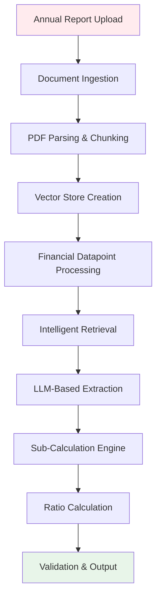

## Functional Modules

### 1. Document Ingestion Module

**Purpose**: Accept and validate financial documents for processing.

**Functional Requirements**:

1. **File Upload Acceptance**
   - Accept PDF files via web interface
   - Validate file format and size
   - Store uploaded files securely

2. **File Validation**
   - Check PDF integrity
   - Verify readability
   - Detect corrupted files

3. **Metadata Extraction**
   - Extract document filename
   - Generate unique document identifier (MD5 hash)
   - Track upload timestamp

**Process Flow**:

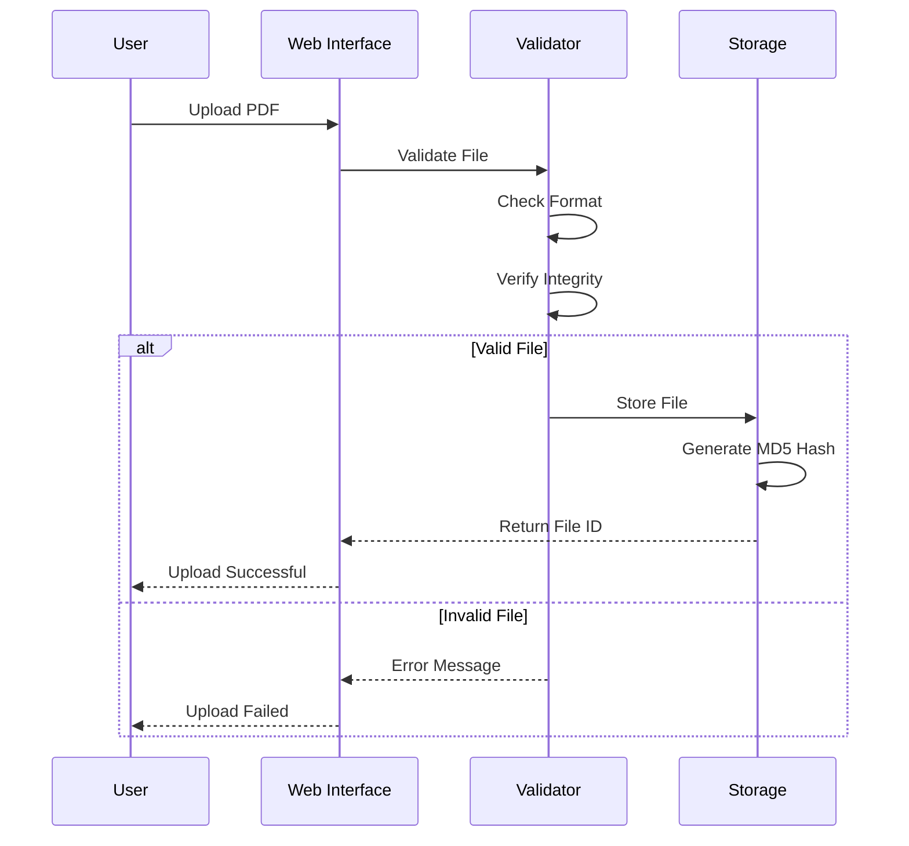

**Output**:
- Stored PDF file in `/data` directory
- Unique file identifier (MD5 hash)
- Ready for processing

### 2. Document Parsing Module

**Purpose**: Convert PDF documents into structured, searchable text format.

#### 2.1 PDF Splitting Function

**Functional Behavior**:

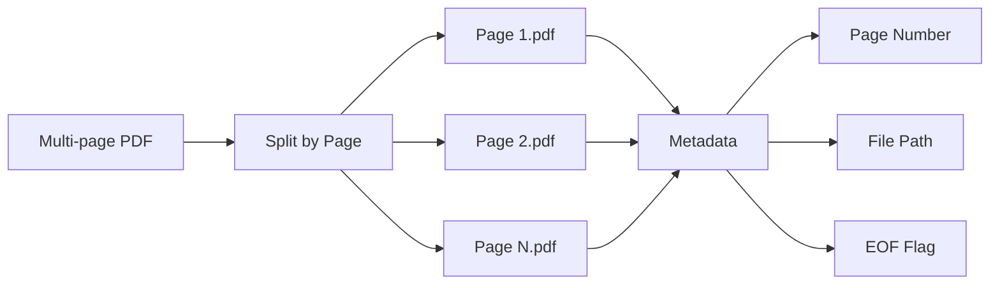

**Key Functions**:

1. **Page Separation**
   - Split PDF into individual page files
   - Maintain page order
   - Create page-specific subdirectory

2. **Metadata Generation**
   ```json
   {
     "path": "original_file.pdf",
     "page": 1,
     "split_root": "original_file/",
     "EOF": "False"
   }
   ```

3. **End-of-File Tracking**
   - Mark last page with EOF flag
   - Support downstream processing logic

#### 2.2 PDF to Markdown Conversion

**Functional Process**:

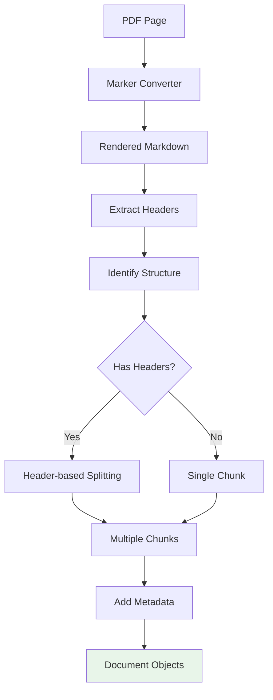

**Structural Preservation**:

1. **Header Extraction**
   - Identify markdown headers (#, ##, ###)
   - Preserve hierarchical structure
   - Maintain table formatting

2. **Content Types Handled**:
   - **Balance Sheets**: Tabular data extraction
   - **Income Statements**: Line item preservation
   - **Cash Flow Statements**: Flow structure maintenance
   - **Notes to Accounts**: Detailed text extraction

3. **Quality Assurance**
   - Verify conversion completeness
   - Handle conversion failures gracefully
   - Return empty documents on error

#### 2.3 Markdown Chunking

**Chunking Strategy**:

```mermaid
graph TB
    subgraph "Chunking Process"
        A[Markdown Document] --> B[Header Detection]
        B --> C{Header Level}

        C -->|# Level 1| D[Major Section Chunk]
        C -->|## Level 2| E[Subsection Chunk]
        C -->|### Level 3| F[Detail Chunk]

        D --> G[Chunk Metadata]
        E --> G
        F --> G

        G --> H[header: {#: Title, ##: Subtitle}]
        G --> I[page: 5]
        G --> J[chunk: 3]
    end

    style H fill:#fff4e1
```

**Metadata Enrichment**:

Each chunk contains:
```python
{
    "path": "source_file.pdf",
    "page": 5,
    "chunk": 3,
    "EOF": "False",
    "header": {
        "#": "Financial Statements",
        "##": "Balance Sheet",
        "###": "Current Assets"
    }
}
```

**Benefits**:
- Maintains context within chunks
- Enables precise retrieval
- Supports hierarchical navigation
- Facilitates traceability

### 3. Embedding and Indexing Module

**Purpose**: Convert text chunks into vector representations for semantic search.

#### 3.1 Embedding Generation

**Functional Flow**:


**Processing Steps**:

1. **Batch Processing**
   - Process chunks in batches
   - Optimize GPU utilization
   - Handle memory constraints

2. **Vector Generation**
   - Input: Text chunk (max 512 tokens)
   - Output: 1024-dimensional dense vector
   - Normalization: L2 normalization

3. **Quality Control**
   - Verify embedding dimensions
   - Check for NaN values
   - Validate vector magnitudes

#### 3.2 Vector Store Population

**Collection Management**:

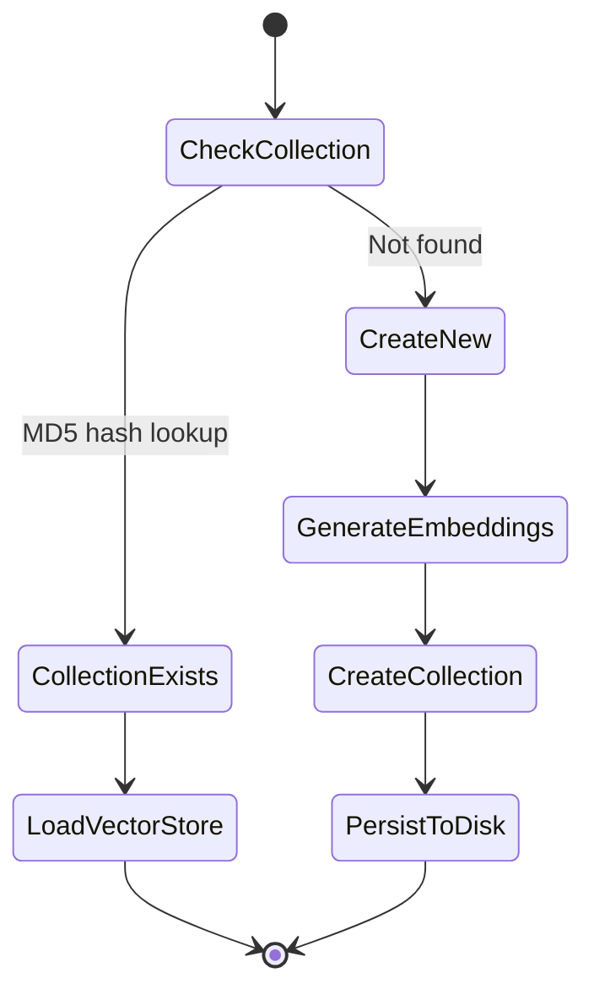

**Key Functions**:

1. **Duplicate Detection**
   - Use MD5 hash of filename as collection name
   - Check if collection exists
   - Reuse existing vectors if available

2. **Collection Creation**
   - Store document chunks with embeddings
   - Index for fast retrieval
   - Persist to disk for reuse

3. **Metadata Storage**
   - Store chunk metadata alongside vectors
   - Enable filtered search
   - Support provenance tracking

### 4. Financial Datapoint Processing Module

**Purpose**: Orchestrate extraction of specific financial metrics from documents.

#### 4.1 Datapoint Configuration

**Excel-Driven Configuration**:

File: `artifacts/datapoints_prompt.xlsx`

| Column | Description | Example |
|--------|-------------|---------|
| Fields to be extracted | Financial metric name | "Total Assets" |
| Definition | Metric definition | "Sum of all assets owned" |
| Typical location | Where to find in report | "Balance Sheet" |
| cleaned_field_name | Normalized identifier | "total_assets" |

**Functional Processing**:

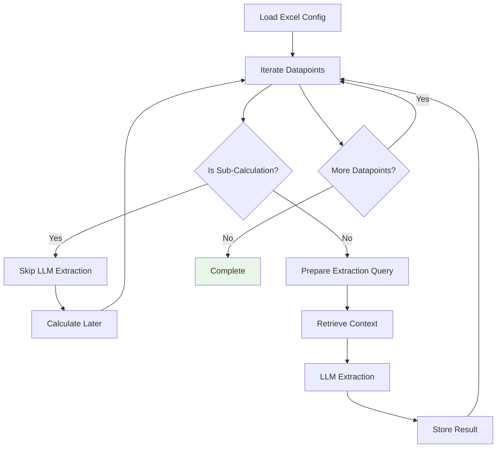

#### 4.2 Sub-Calculation Filtering

**Purpose**: Identify fields that are calculated rather than extracted.

**Configuration**:
```yaml
sub_calculation_list:
  - avegrage_total_equity
  - tangible_net_worth
  - cash_profit
  - adjusted_total_assets
  - debt_service
  - average_trade_receivables
  - average_trade_payables
  - average_inventory
```

**Logic**:
```python
if row["cleaned_field_name"] not in config.sub_calculation_list:
    # Extract from document
    perform_llm_extraction()
else:
    # Will be calculated later
    skip_to_next()
```

### 5. Intelligent Retrieval Module

**Purpose**: Retrieve most relevant document sections for each financial datapoint.

#### 5.1 Two-Stage Retrieval Process

**Stage 1: Initial Context Retrieval**

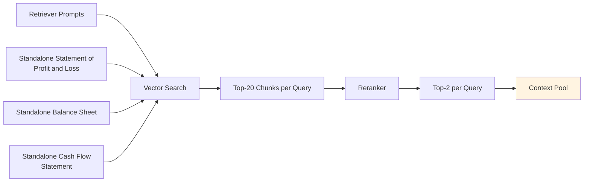

**Initial Prompts** (from `prompts.yaml`):
```yaml
retriever_prompt:
  - "Standalone Statement of Profit and Loss"
  - "standalone Balance sheet"
  - "standalone Cash flow statement"
```

**Function**:
- Build general context about financial statements
- Locate key financial statement sections
- Provide broad coverage of financial data

**Stage 2: Datapoint-Specific Retrieval**

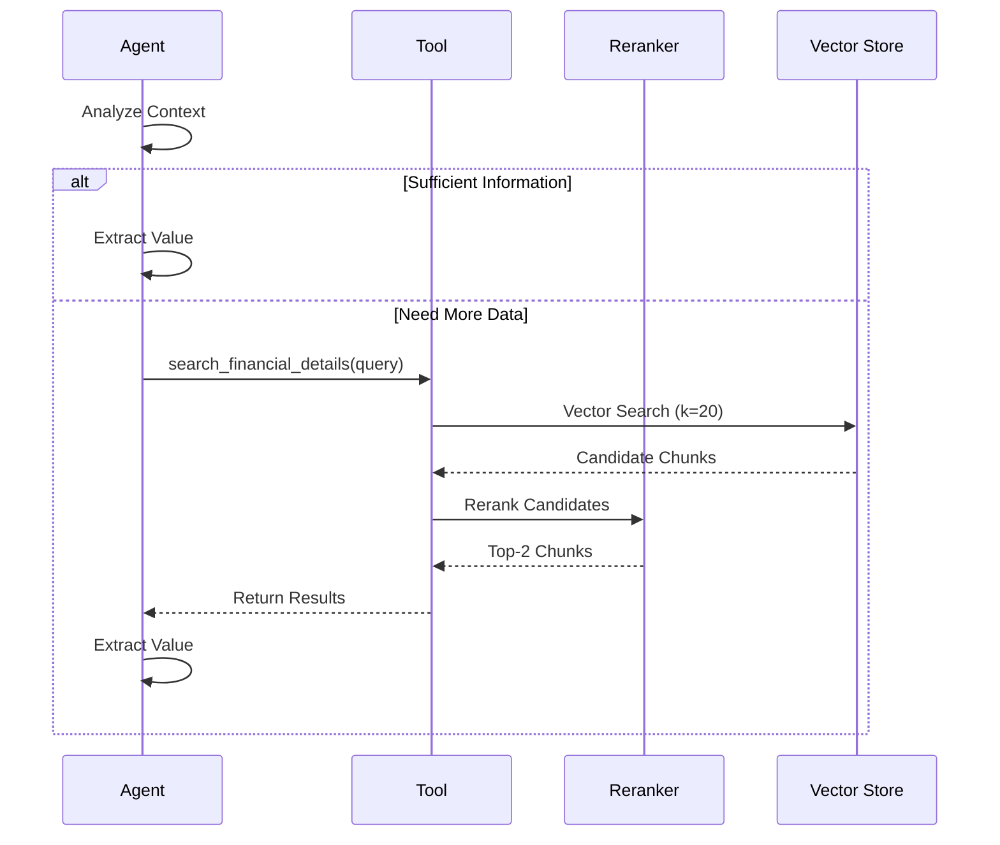

**Tool Function**:
```python
@tool
def search_financial_details(query: str) -> str:
    """
    Search for financial details in the annual report.
    Returns the top 2 most relevant documents.
    """
    retrieved_doc = reranker_retriever.invoke(query)
    return retrieved_doc
```

**Adaptive Behavior**:
- Agent decides when additional search is needed
- Can perform multiple searches for complex datapoints
- Iterative refinement of search queries

#### 5.2 Maximum Marginal Relevance (MMR)

**Purpose**: Balance relevance and diversity in retrieved chunks.

**Algorithm**:

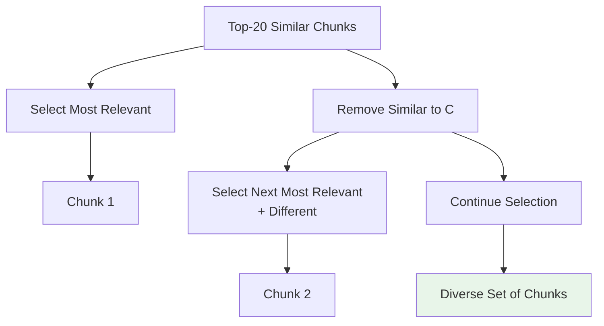

**Parameters**:
```python
search_kwargs={
    "k": 20,  # Number of candidates
}
search_type="mmr"  # Maximum Marginal Relevance
```

**Benefits**:
- Avoid redundant information
- Cover different aspects of financial statements
- Improve extraction completeness

### 6. LLM Extraction Module

**Purpose**: Extract structured financial data using language models.

#### 6.1 Prompt Construction

**Prompt Template**:

```yaml
user_prompt: |
  You are a financial-ratio engine.

  INPUT extracted from annual report:
  **Input** = {retriever_docs}

  **TASK** - extract or calculate the below given **financial datapoint**
  Use the **description** and **typical location** to guide extraction.

  If unable to identify from the input use the tool **search_financial_details**
  to search in the annual report.

  financial datapoint = {financial_datapoint}
  description = {description}
  typical_location = {typical_location}

  format_instructions: {format_instructions}
```

**Dynamic Variables**:
- `retriever_docs`: Context from retrieval
- `financial_datapoint`: Metric to extract
- `description`: Definition of the metric
- `typical_location`: Hint for location
- `format_instructions`: Pydantic schema instructions

**Example Populated Prompt**:

```
You are a financial-ratio engine.

INPUT extracted from annual report:
**Input** = [Balance Sheet showing Total Assets: 1,234,567 thousand...]

**TASK** - extract or calculate the below given **financial datapoint**

financial datapoint = Total Assets
description = Sum of all current and non-current assets
typical_location = Balance Sheet - Asset Section

format_instructions: {
  "value": <float>,
  "page_no": <int>,
  "reference_notes": <string>
}
```

#### 6.2 Agent-Based Extraction

**Agent Decision Flow**:

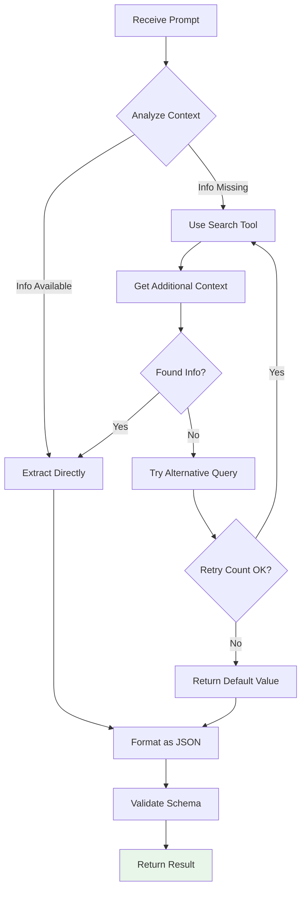

**Agent Capabilities**:

1. **Autonomous Decision Making**
   - Decides when to use search tool
   - Determines information sufficiency
   - Plans extraction strategy

2. **Multi-Step Reasoning**
   - Can perform multiple searches
   - Combines information from sources
   - Resolves ambiguities

3. **Tool Usage**
   - Invokes `search_financial_details` as needed
   - Formulates effective search queries
   - Interprets search results

#### 6.3 Structured Output Generation

**Output Schema**:

```python
class ValueSchema(BaseModel):
    value: float = Field(
        description="Extracted value of the datapoint",
        default=0
    )
    page_no: float = Field(
        description="Page number from where value is extracted",
        default=0
    )
    reference_notes: str = Field(
        description="Reference note to understand extraction",
        default="Not Applicable"
    )
```

**Example Output**:
```json
{
  "value": 1234567.0,
  "page_no": 45,
  "reference_notes": "Extracted from Balance Sheet - Total Assets line item"
}
```

**Enrichment**:
```python
json_response["Fields"] = row["Fields to be extracted"]
json_response["Definition"] = row["Definition"]
```

**Final Output Record**:
```json
{
  "Fields": "Total Assets",
  "Definition": "Sum of all current and non-current assets",
  "value": 1234567.0,
  "reference_notes": "Extracted from Balance Sheet"
}
```

#### 6.4 Error Handling and Retry Logic

**Retry Mechanism**:

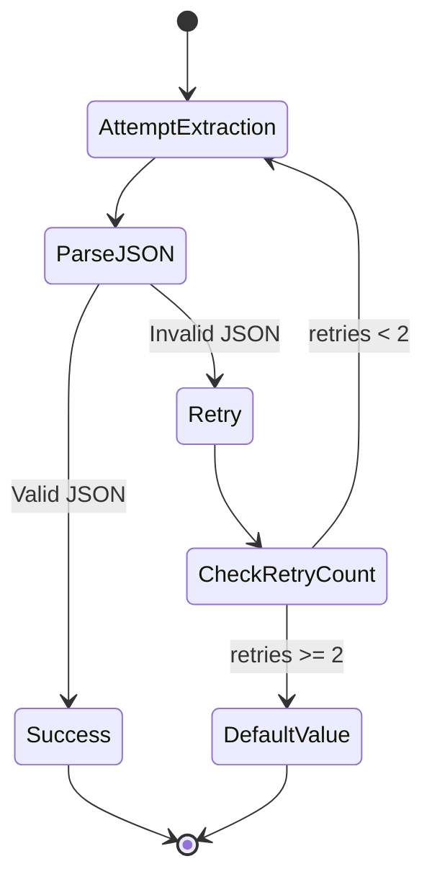

**Configuration**:
```yaml
retry_count: 2
```

**Implementation**:
```python
retry_count = 0
while retry_count < config.retry_count:
    try:
        response = agent.invoke(...)
        json_response = JsonOutputParser().invoke(response)
        retry_count = config.retry_count  # Exit loop
    except Exception:
        if retry_count + 1 == config.retry_count:
            json_response = ValueSchema().model_dump()  # Default
            break
        else:
            retry_count += 1
```

**Default Values on Failure**:
```python
{
    "value": 0,
    "page_no": 0,
    "reference_notes": "Not Applicable"
}
```

### 7. Sub-Calculation Engine

**Purpose**: Calculate intermediate financial metrics from extracted base values.

#### 7.1 Formula Processing

**Data Source**: `artifacts/calcualtion_formula.xlsx` (Sheet: "Additional Formulas")

**Processing Flow**:

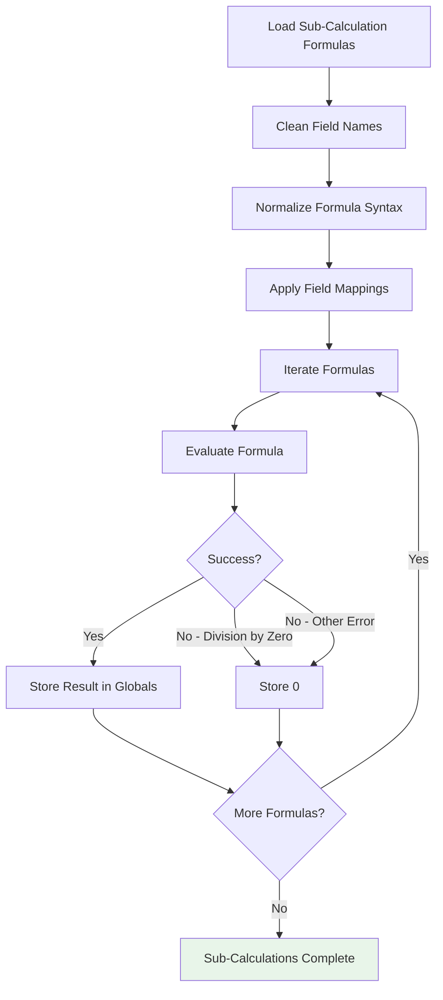

#### 7.2 Formula Normalization

**Input Formula Examples**:
```
Average Total Equity = (opening equity + closing equity) ÷ 2
Tangible Net Worth = Total Assets − Intangible Assets − Capital WIP
DSO = (Average Trade Receivables / Revenue) × 365
```

**Normalization Process**:

```python
def convert_formula(formula_str: str):
    # 1. Remove special characters
    formula_str = formula_str.replace("\xa0", " ")
    formula_str = formula_str.replace("\u200b", "")

    # 2. Convert operators
    formula_str = formula_str.replace("÷", "/")
    formula_str = formula_str.replace("×", "*")
    formula_str = formula_str.replace("−", "-")

    # 3. Normalize naming
    formula_str = formula_str.lower()
    formula_str = formula_str.replace(", ", "_")

    # 4. Convert multi-word to variables
    formula_str = re.sub(
        r"[A-Za-z]+(?:\s+[A-Za-z]+)+",
        to_python_var,  # Replace spaces with underscores
        formula_str
    )

    return formula_str
```

**Output**:
```python
"(opening_equity + closing_equity) / 2"
"total_assets - intangible_assets - capital_wip"
"(average_trade_receivables / revenue) * 365"
```

#### 7.3 Field Mapping

**Purpose**: Handle naming inconsistencies and special characters.

**Configuration**:
```yaml
mapping_fields:
  "capital_work-in-progress": "capital_wip"
  "total_assets - intangible_assets - capital_work-in-progress":
    "total_assets - intangible_assets - capital_wip"
  "inventory+fixed_assets+financial_assets":
    "inventory_fixed_assets_financial_assets"
```

**Application**:
```python
if formula in mapping_fields.keys():
    formula = mapping_fields[formula]

if field_name in mapping_fields.keys():
    field_name = mapping_fields[field_name]
```

#### 7.4 Dynamic Evaluation

**Global Variable Management**:

```python
# Add LLM extracted values to global namespace
for idx, row in llm_extract_df.iterrows():
    key = row["clean_field"]
    globals()[key] = row["value"]

# Calculate sub-fields
for idx, row in sub_field_cal_df.iterrows():
    formula = row["clean_formula"]
    field_name = row["clean_sub_field"]

    try:
        globals()[field_name] = eval(formula)
    except ZeroDivisionError:
        globals()[field_name] = 0
    except Exception:
        globals()[field_name] = 0
```

**Example Execution**:

Assume extracted values:
```python
total_assets = 1000000
intangible_assets = 50000
capital_wip = 30000
```

Formula: `total_assets - intangible_assets - capital_wip`

Evaluation:
```python
tangible_net_worth = eval("total_assets - intangible_assets - capital_wip")
# tangible_net_worth = 920000
```

Result stored in global namespace for ratio calculations.

#### 7.5 Sub-Calculation Examples

**Common Sub-Calculations**:

1. **Average Total Equity**
   ```
   (opening_total_equity + closing_total_equity) / 2
   ```

2. **Tangible Net Worth**
   ```
   total_assets - intangible_assets - capital_wip
   ```

3. **Cash Profit**
   ```
   net_profit + depreciation + amortization
   ```

4. **Debt Service**
   ```
   interest_expense + principal_repayment
   ```

5. **Days Sales Outstanding (DSO)**
   ```
   (average_trade_receivables / revenue) * 365
   ```

6. **Days Inventory Outstanding (DIO)**
   ```
   (average_inventory / cost_of_goods_sold) * 365
   ```

7. **Days Payable Outstanding (DPO)**
   ```
   (average_trade_payables / cost_of_goods_sold) * 365
   ```

### 8. Ratio Calculation Module

**Purpose**: Calculate final financial ratios using extracted and computed values.

#### 8.1 Ratio Formula Processing

**Data Source**: `artifacts/final_calculation_formula.xlsx`

**Structure**:
| Ratio | Calculation | Category |
|-------|-------------|----------|
| Current Ratio | current_assets / current_liabilities | Liquidity |
| Debt to Equity | total_debt / total_equity | Leverage |
| Return on Assets | net_income / total_assets | Profitability |

**Processing Flow**:

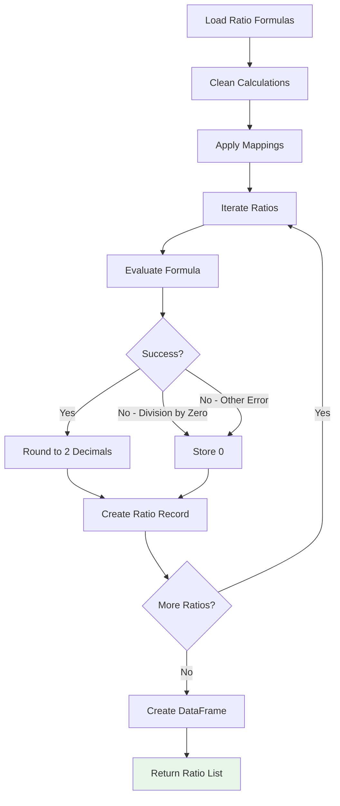

#### 8.2 Ratio Calculation Logic

**Implementation**:
```python
ratios_list = []

for idx, row in ratio_formula_df.iterrows():
    formula = row["clean_calculation"]

    if formula in mapping_fields.keys():
        formula = mapping_fields[formula]

    try:
        ratio_value = round(eval(formula), 2)
        ratios_list.append((
            row["Ratio"],
            ratio_value,
            row["Calculation"]
        ))
    except ZeroDivisionError:
        ratios_list.append((row["Ratio"], 0, row["Calculation"]))
    except Exception as e:
        ratios_list.append((row["Ratio"], 0, row["Calculation"]))
        print(row["Ratio"], e, sep=": ")
```

#### 8.3 Ratio Categories

**Liquidity Ratios**:
- Current Ratio
- Quick Ratio
- Cash Ratio
- Working Capital Ratio

**Leverage Ratios**:
- Debt to Equity Ratio
- Debt to Assets Ratio
- Interest Coverage Ratio
- Debt Service Coverage Ratio

**Profitability Ratios**:
- Return on Assets (ROA)
- Return on Equity (ROE)
- Net Profit Margin
- Gross Profit Margin
- Operating Profit Margin

**Efficiency Ratios**:
- Asset Turnover Ratio
- Inventory Turnover Ratio
- Receivables Turnover Ratio
- Days Sales Outstanding (DSO)
- Days Inventory Outstanding (DIO)
- Days Payable Outstanding (DPO)
- Cash Conversion Cycle

**Growth Ratios**:
- Revenue Growth Rate
- Earnings Growth Rate
- Asset Growth Rate

#### 8.4 Output Format

**Ratio Record Structure**:
```python
{
    "Ratio": "Current Ratio",
    "Value": 2.15,
    "Formula": "current_assets / current_liabilities"
}
```

**Complete Output**:
```python
[
    {
        "Ratio": "Current Ratio",
        "Value": 2.15,
        "Formula": "current_assets / current_liabilities"
    },
    {
        "Ratio": "Debt to Equity",
        "Value": 0.67,
        "Formula": "total_debt / total_equity"
    },
    {
        "Ratio": "Return on Assets",
        "Value": 8.5,
        "Formula": "net_income / total_assets * 100"
    }
]
```

### 9. Validation and Quality Assurance

#### 9.1 Data Validation

**Validation Checks**:

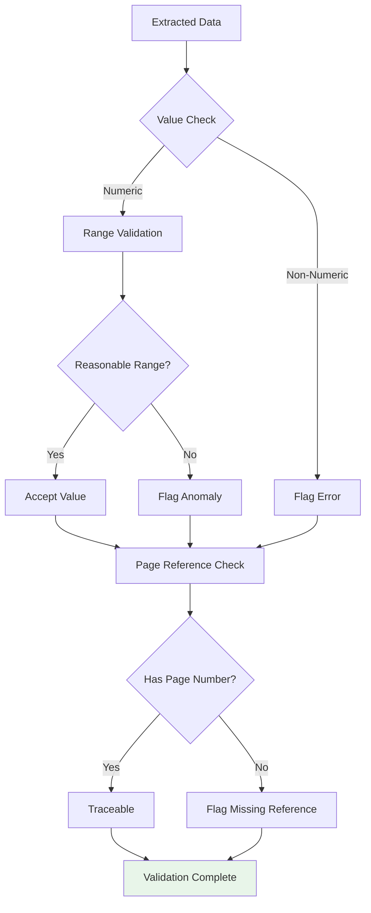

**Validation Criteria**:

1. **Data Type Validation**
   - Ensure numeric values for financial metrics
   - Check for proper data types
   - Identify parsing errors

2. **Range Validation**
   - Check for unreasonable values (e.g., negative assets)
   - Identify potential outliers
   - Flag extreme values for review

3. **Reference Validation**
   - Verify page numbers exist
   - Ensure traceability
   - Check reference note completeness

4. **Completeness Validation**
   - Identify missing values
   - Track extraction coverage
   - Report extraction gaps

#### 9.2 Calculation Validation

**Validation Steps**:

1. **Formula Syntax Check**
   - Verify valid Python expressions
   - Check for undefined variables
   - Validate operator usage

2. **Dependency Check**
   - Ensure all required fields are extracted
   - Verify sub-calculations completed
   - Check calculation order

3. **Result Validation**
   - Check for NaN or Infinity
   - Validate division operations
   - Ensure reasonable ratio values

4. **Cross-Validation**
   - Compare related ratios for consistency
   - Verify mathematical relationships
   - Identify conflicting values

#### 9.3 Accuracy Metrics

**Tracking Mechanisms**:

1. **Extraction Accuracy**
   - Compare to manual extraction samples
   - Calculate error rates
   - Track field-level accuracy

2. **Calculation Accuracy**
   - Verify formula correctness
   - Check rounding precision
   - Validate complex calculations

3. **Completeness Metrics**
   - Percentage of fields extracted
   - Missing value rate
   - Coverage statistics

### 10. Output Management

#### 10.1 Caching Strategy

**Purpose**: Avoid redundant processing and improve performance.

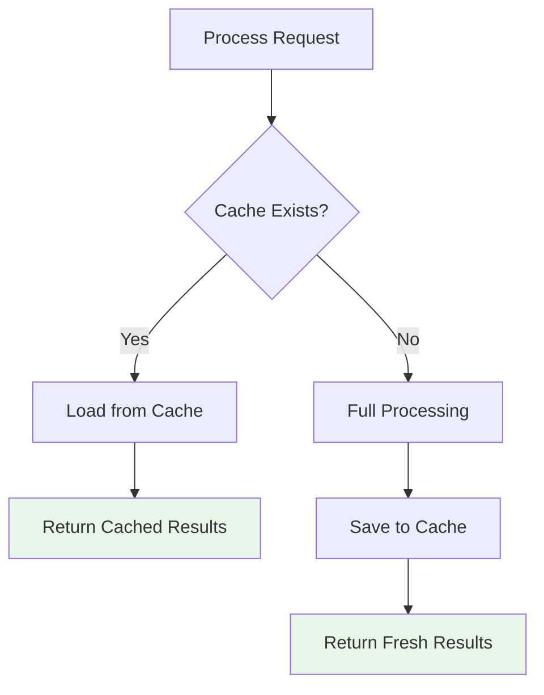

**Cache Implementation**:

```python
collection_name = hashlib.md5(
    os.path.basename(file_path).encode()
).hexdigest()

cache_data_path = f"output/{collection_name}.xlsx"

if os.path.exists(cache_data_path):
    df = pd.read_excel(cache_data_path)
    # Return cached results
else:
    # Perform full extraction
    # Save results to cache
```

#### 10.2 Output Formats

**Excel Output** (`output/{file_id}.xlsx`):

| Fields | Definition | value | reference_notes |
|--------|-----------|-------|-----------------|
| Total Assets | Sum of all assets | 1234567.0 | From Balance Sheet, page 45 |
| Total Liabilities | Sum of all liabilities | 678901.0 | From Balance Sheet, page 45 |
| Net Income | Profit after tax | 123456.0 | From P&L Statement, page 42 |

**JSON Stream** (API Response):
```json
{
  "Fields": "Total Assets",
  "Definition": "Sum of all current and non-current assets",
  "value": 1234567.0,
  "reference_notes": "Extracted from Balance Sheet, page 45"
}
```

**Ratio Output**:
```json
[
  {
    "Ratio": "Current Ratio",
    "Value": 2.15,
    "Formula": "current_assets / current_liabilities"
  }
]
```

#### 10.3 Streaming Output

**Purpose**: Provide real-time feedback during processing.

**Implementation**:
```python
def extract_financial_ratios_from_excel(file_path: str):
    for idx, row in input_df.iterrows():
        # Process datapoint
        json_response = extract_datapoint(row)

        # Stream result
        yield json.dumps(json_response) + "\n\n"
```

**Benefits**:
- Real-time progress updates
- Better user experience
- Early error detection
- Incremental result availability

### 11. End-to-End Workflow

**Complete Processing Pipeline**:

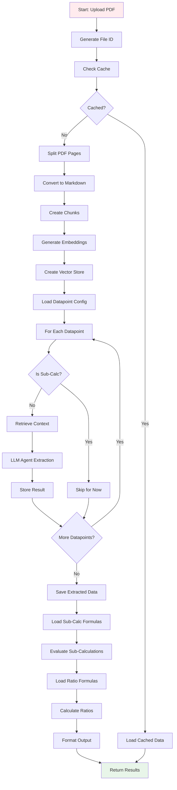

## Performance Characteristics

### Processing Time

**Typical Processing Times**:

| Stage | Time | Notes |
|-------|------|-------|
| PDF Parsing | 30-60 sec | Depends on page count |
| Embedding Generation | 45-90 sec | GPU-accelerated |
| Data Extraction | 10-15 min | 50-100 datapoints |
| Ratio Calculation | 5-10 sec | Near-instantaneous |
| **Total** | **15-20 min** | For full annual report |

**Cached Processing**:
- Extraction: < 1 second
- Ratio Calculation: 5-10 seconds
- **Total**: < 30 seconds

### Throughput

**Capacity Metrics**:
- **Concurrent Processing**: 2-4 documents (GPU-limited)
- **Daily Throughput**: 20-30 documents (single instance)
- **Scalability**: Horizontal scaling possible

## Error Handling Strategy

### Error Categories

1. **Document Errors**
   - Corrupted PDFs
   - Unsupported formats
   - Unreadable content

2. **Extraction Errors**
   - Missing datapoints
   - Ambiguous values
   - Parsing failures

3. **Calculation Errors**
   - Division by zero
   - Missing variables
   - Formula errors

### Recovery Mechanisms

1. **Retry Logic**: 2 attempts per extraction
2. **Default Values**: 0 for missing/failed extractions
3. **Error Logging**: Comprehensive logging for debugging
4. **Graceful Degradation**: Continue processing on partial failures

## Quality Assurance

### Testing Approach

1. **Unit Testing**
   - Formula normalization
   - Field mapping
   - Calculation logic

2. **Integration Testing**
   - End-to-end workflow
   - API endpoints
   - Cache mechanisms

3. **Validation Testing**
   - Sample manual comparisons
   - Accuracy benchmarking
   - Edge case handling

### Monitoring

1. **Opik Tracing**
   - Query tracking
   - Response logging
   - Performance metrics

2. **Custom Logging**
   - Error tracking
   - Processing stages
   - Calculation results

## Conclusion

The functional architecture of the Grant Thornton POC demonstrates a well-orchestrated system that combines multiple AI technologies with robust engineering practices. The modular design enables each component to function independently while contributing to the overall goal of accurate, efficient financial ratio extraction from annual reports.

Key functional strengths include:
- Intelligent document parsing with structure preservation
- Advanced retrieval with two-stage refinement
- Agentic LLM extraction with tool usage
- Comprehensive calculation engine
- Robust error handling and validation
- Efficient caching and output management

This architecture provides a solid foundation for automated financial analysis that can scale to meet enterprise demands while maintaining high accuracy and traceability.
