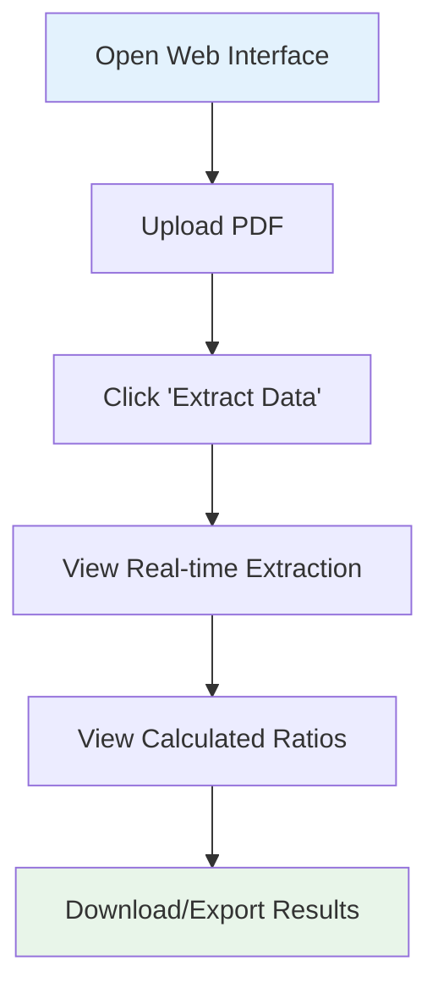

# User Guide

## Overview

This guide provides comprehensive instructions for using the Grant Thornton Financial Ratio Extraction POC. The system automates the extraction of financial metrics from annual reports and calculates key financial ratios, significantly reducing the time and effort required for financial analysis.

## Table of Contents

1. [Getting Started](#getting-started)
2. [System Requirements](#system-requirements)
3. [Installation and Setup](#installation-and-setup)
4. [Using the Web Interface](#using-the-web-interface)
5. [Understanding the Output](#understanding-the-output)
6. [Configuration Options](#configuration-options)
7. [Best Practices](#best-practices)
8. [Troubleshooting](#troubleshooting)
9. [API Usage](#api-usage)
10. [Advanced Features](#advanced-features)

## Getting Started

### What the System Does

The Grant Thornton POC performs two main functions:

1. **Financial Data Extraction**: Automatically extracts specific financial metrics from annual reports (PDF format)
2. **Ratio Calculation**: Computes financial ratios based on extracted data

### Key Features

- Processes PDF annual reports
- Extracts 50+ financial datapoints
- Calculates 30+ financial ratios
- Provides page references for traceability
- Caches results for faster reprocessing
- Streams results in real-time
- Generates Excel outputs for further analysis

## System Requirements

### Hardware Requirements

**Minimum**:
- CPU: 4 cores
- RAM: 16 GB
- GPU: NVIDIA GPU with 8GB VRAM (CUDA-enabled)
- Storage: 20 GB available space

**Recommended**:
- CPU: 8+ cores
- RAM: 32 GB
- GPU: NVIDIA GPU with 16GB VRAM
- Storage: 50 GB SSD

### Software Requirements

- Operating System: Linux (Ubuntu 20.04+ recommended), Windows with WSL2
- Python: 3.10 or higher
- CUDA: 11.7 or higher (for GPU acceleration)
- Docker: Optional, for containerized deployment

### Network Requirements

- Internet connection (for LLM API calls)
- Access to Opik server (if using observability features)
- Ports: 5050 (API), 8501 (Streamlit UI)

## Installation and Setup

### Step 1: Environment Setup

1. **Clone or access the project directory**:
   ```bash
   cd /path/to/grand_thornton_poc
   ```

2. **Create virtual environment**:
   ```bash
   python -m venv venv
   source venv/bin/activate  # On Windows: venv\Scripts\activate
   ```

3. **Install dependencies**:
   ```bash
   pip install -r requirements.txt
   ```

### Step 2: Environment Configuration

1. **Create .env file**:
   Create a file at `/home/merit/Madhan/Demo_App/unilever/.env` (or update path in `config_reader.py`)

2. **Add required environment variables**:
   ```bash
   OPENAI_API_KEY=your_openai_api_key_here
   ```

### Step 3: Configure System Settings

Edit `config/config.yaml` to customize settings:

```yaml
# Vector store location
persist_directory: vector_store

# Input Excel configuration
input_excel_path: artifacts/datapoints_prompt.xlsx
sheet_name: "Prompt"

# Model settings
embed_model_name: BAAI/bge-large-en-v1.5
embed_model_kwargs: { "device": "cuda" }

reranker_model_name: BAAI/bge-reranker-large
reranker_model_kwargs: { "device": "cuda" }

llm_model_name: o4-mini

# Retry configuration
retry_count: 2
```

### Step 4: Verify Installation

1. **Check GPU availability**:
   ```bash
   python -c "import torch; print(torch.cuda.is_available())"
   ```
   Should output: `True`

2. **Verify models download** (first run will download models):
   ```bash
   python -c "from langchain_huggingface.embeddings import HuggingFaceEmbeddings; HuggingFaceEmbeddings(model_name='BAAI/bge-large-en-v1.5')"
   ```

## Using the Web Interface

### Starting the Application

#### Method 1: Using Streamlit UI (Recommended for Desktop Use)

1. **Start the Streamlit app**:
   ```bash
   streamlit run app.py
   ```

2. **Access the web interface**:
   - Open browser to: `http://localhost:8501`
   - If running remotely, access via: `http://<server-ip>:8501`

#### Method 2: Using Flask API + Streamlit UI

1. **Start the Flask API backend**:
   ```bash
   python api.py
   ```
   - API will run on: `http://0.0.0.0:5050`

2. **In a separate terminal, start Streamlit**:
   ```bash
   streamlit run app.py
   ```
   - Update API URLs in `app.py` to point to your API server

### User Interface Walkthrough



#### Step-by-Step Process

**Step 1: Access the Application**

Open your web browser and navigate to the Streamlit URL.

**Step 2: Upload Annual Report**

1. Click on the **"Browse files"** button in the file uploader
2. Select your PDF annual report
3. Supported format: PDF only
4. Maximum file size: As per system configuration (typically 50-100 MB)

**Step 3: Process the Document**

1. Click the **"Extract Data"** button
2. The system will:
   - Parse the PDF document
   - Create embeddings and vector store
   - Extract financial datapoints one by one
   - Display results in real-time

**Step 4: View Extracted Data**

As extraction progresses, you'll see a table with:

| Fields | Definition | value | reference_notes |
|--------|-----------|-------|-----------------|
| Total Assets | Sum of all current and non-current assets | 1234567.0 | Extracted from Balance Sheet, page 45 |
| Total Liabilities | Sum of all current and non-current liabilities | 678901.0 | From Balance Sheet, page 45 |
| Revenue | Total income from operations | 2345678.0 | From P&L Statement, page 42 |

**Features**:
- **Real-time updates**: See each datapoint as it's extracted
- **Progress tracking**: Monitor extraction progress
- **Reference notes**: View where each value was found
- **Definitions**: Understand what each metric means

**Step 5: View Calculated Ratios**

After extraction completes, the system automatically calculates ratios:

| Ratio | Value | Formula |
|-------|-------|---------|
| Current Ratio | 2.15 | current_assets / current_liabilities |
| Debt to Equity | 0.67 | total_debt / total_equity |
| Return on Assets | 8.50 | net_income / total_assets * 100 |
| Profit Margin | 12.35 | net_income / revenue * 100 |

### Interface Elements

#### File Uploader

```
┌─────────────────────────────────────┐
│  Please upload the annual report    │
│  ┌───────────────────────────────┐  │
│  │   Drag and drop file here     │  │
│  │   or click to browse          │  │
│  └───────────────────────────────┘  │
│            Browse files              │
└─────────────────────────────────────┘
```

- **Accepted formats**: PDF
- **Upload method**: Drag-and-drop or browse
- **Validation**: Automatic format checking

#### Progress Indicators

During processing, you'll see:

```
Processing PDF...
[Progress Spinner]

Extracted Data
[Expanding Table with Real-time Updates]

Calculating Ratio...
[Progress Spinner]

Calculated Ratios
[Final Results Table]
```

## Understanding the Output

### Extracted Data Output

#### Field Descriptions

**Fields**: The name of the financial metric being extracted

Examples:
- Total Assets
- Total Liabilities
- Revenue
- Net Income
- Cash and Cash Equivalents

**Definition**: Explanation of what the metric represents

Example: "Sum of all current and non-current assets owned by the company"

**value**: The numerical value extracted from the document

- Type: Float
- Unit: Typically in thousands or millions (check the report)
- Default: 0 (if extraction failed)

**reference_notes**: Additional context about the extraction

Examples:
- "Extracted from Balance Sheet, page 45"
- "Calculated from line items on page 42"
- "Not Applicable" (if extraction failed)

#### Reading the Extraction Results

**Example Record**:
```
Fields: Total Assets
Definition: Sum of all current and non-current assets
value: 15234567.0
reference_notes: Extracted from Standalone Balance Sheet, page 67
```

**Interpretation**:
- The company has total assets of 15,234,567 (check report for unit)
- Found on page 67 of the PDF
- Located in the Standalone Balance Sheet section
- Can be verified by checking the source document

### Ratio Output

#### Ratio Categories

**Liquidity Ratios** (Ability to pay short-term obligations):
- Current Ratio: Current Assets / Current Liabilities
- Quick Ratio: (Current Assets - Inventory) / Current Liabilities
- Cash Ratio: Cash / Current Liabilities

**Leverage Ratios** (Debt levels):
- Debt to Equity: Total Debt / Total Equity
- Debt to Assets: Total Debt / Total Assets
- Interest Coverage: EBIT / Interest Expense

**Profitability Ratios** (Earning power):
- Return on Assets (ROA): Net Income / Total Assets
- Return on Equity (ROE): Net Income / Total Equity
- Profit Margin: Net Income / Revenue

**Efficiency Ratios** (Asset utilization):
- Asset Turnover: Revenue / Total Assets
- Inventory Turnover: Cost of Goods Sold / Inventory
- Days Sales Outstanding (DSO): (Accounts Receivable / Revenue) × 365

#### Interpreting Ratio Values

**Current Ratio Example**:
```
Ratio: Current Ratio
Value: 2.15
Formula: current_assets / current_liabilities
```

**Interpretation**:
- Value of 2.15 means the company has $2.15 in current assets for every $1 of current liabilities
- Generally, a ratio above 1.5 is considered healthy
- Industry benchmarks may vary

**Zero Values**:
- Value of 0 typically indicates:
  - Division by zero (denominator is 0)
  - Missing input data
  - Calculation error

**Verification**:
- Check if the required fields were extracted
- Review the formula for correctness
- Verify input values are reasonable

### Output Files

#### Excel Output Files

**Location**: `output/{file_id}.xlsx`

Where `{file_id}` is the MD5 hash of the PDF filename.

**Example**: `output/5fc214fabb7070b38d17f0ecca7a997e.xlsx`

**Content**:
- All extracted financial datapoints
- Values and reference notes
- Definitions for each field

**Usage**:
- Open in Excel or Google Sheets
- Perform additional analysis
- Create custom calculations
- Share with team members

#### Vector Store

**Location**: `vector_store/{collection_id}/`

**Purpose**:
- Stores document embeddings for fast retrieval
- Enables reprocessing without re-parsing PDF
- Persistent storage for future queries

**Note**: Automatically managed, no user action required

## Configuration Options

### Customizing Datapoints to Extract

**File**: `artifacts/datapoints_prompt.xlsx`

**Sheet**: "Prompt"

**Columns**:
- **Fields to be extracted**: Name of the metric
- **Definition**: Description of the metric
- **Typical location**: Where to find in the report
- **cleaned_field_name**: Normalized field identifier

**To Add New Datapoints**:

1. Open `artifacts/datapoints_prompt.xlsx`
2. Add a new row with:
   - Field name (e.g., "Intangible Assets")
   - Definition (e.g., "Non-physical assets like goodwill")
   - Typical location (e.g., "Balance Sheet - Non-current Assets")
   - cleaned_field_name (e.g., "intangible_assets")
3. Save the file
4. Rerun the extraction

### Customizing Sub-Calculations

**File**: `artifacts/calcualtion_formula.xlsx`

**Sheet**: "Additional Formulas"

**Columns**:
- **sub field**: Name of the calculated field
- **formula**: Calculation formula

**Example**:
| sub field | formula |
|-----------|---------|
| Average Total Equity | (opening_total_equity + closing_total_equity) / 2 |
| Tangible Net Worth | Total Assets - Intangible Assets - Capital WIP |

**To Add New Sub-Calculations**:

1. Open `artifacts/calcualtion_formula.xlsx`
2. Navigate to "Additional Formulas" sheet
3. Add a new row with:
   - Sub field name
   - Formula using extracted field names
4. Update `config.yaml` to include in `sub_calculation_list`
5. Save and rerun

### Customizing Ratio Calculations

**File**: `artifacts/final_calculation_formula.xlsx`

**Columns**:
- **Ratio**: Name of the ratio
- **Calculation**: Formula to calculate the ratio

**Example**:
| Ratio | Calculation |
|-------|-------------|
| Current Ratio | current_assets / current_liabilities |
| Quick Ratio | (current_assets - inventory) / current_liabilities |

**To Add New Ratios**:

1. Open `artifacts/final_calculation_formula.xlsx`
2. Add a new row with:
   - Ratio name
   - Calculation formula
3. Ensure all required fields are extracted or calculated
4. Save and rerun

### Modifying System Configuration

**File**: `config/config.yaml`

#### Key Configuration Options

**Vector Store Configuration**:
```yaml
persist_directory: vector_store  # Change to custom directory
```

**Input Data Configuration**:
```yaml
input_excel_path: artifacts/datapoints_prompt.xlsx
sheet_name: "Prompt"  # Change sheet name if needed
```

**Model Configuration**:
```yaml
# Change embedding model
embed_model_name: BAAI/bge-large-en-v1.5
embed_model_kwargs: { "device": "cuda" }  # Use "cpu" if no GPU

# Change reranker model
reranker_model_name: BAAI/bge-reranker-large
reranker_model_kwargs: { "device": "cuda" }

# Change LLM model
llm_model_name: o4-mini  # Or gpt-4, gpt-3.5-turbo, etc.
```

**Processing Configuration**:
```yaml
retry_count: 2  # Number of retry attempts on extraction failure
```

**Field Mapping**:
```yaml
mapping_fields:
  "capital_work-in-progress": "capital_wip"
  # Add custom mappings here
```

**Observability Configuration**:
```yaml
opik:
  url: http://172.27.141.49:5173
  project_name: grand_thornton_excel_prompt_app
```

### Customizing Prompts

**File**: `config/prompts.yaml`

#### Retriever Prompts

Define which sections to initially retrieve:

```yaml
retriever_prompt:
  - "Standalone Statement of Profit and Loss"
  - "standalone Balance sheet"
  - "standalone Cash flow statement"
```

**Customization**:
- Add industry-specific statement names
- Include additional sections (e.g., "Notes to Accounts")
- Adjust for different report formats

#### User Prompt Template

The main extraction prompt:

```yaml
user_prompt: |
  You are a financial-ratio engine.

  INPUT extracted from annual report:
  **Input** = {retriever_docs}

  **TASK** - extract or calculate the below given **financial datapoint**
  use the **description** and the **typical location** to guide your extraction.

  If unable to identify from the input use the tool **search_financial_details**
  to search in the annual report.

  financial datapoint = {financial_datapoint}
  description = {description}
  typical_location = {typical_location}

  format_instructions: {format_instructions}
```

**Customization Tips**:
- Adjust tone and style
- Add domain-specific instructions
- Include examples for complex extractions
- Modify tool usage guidelines

## Best Practices

### Document Preparation

1. **Use High-Quality PDFs**:
   - Text-based PDFs (not scanned images)
   - Clear, readable formatting
   - Standard financial statement layouts

2. **Verify PDF Integrity**:
   - Ensure PDF is not corrupted
   - Check that all pages are present
   - Verify financial statements are complete

3. **Consistent Formatting**:
   - Use annual reports with standard sections
   - Prefer audited financial statements
   - Standalone statements work better than consolidated (adjust as needed)

### Extraction Best Practices

1. **First-Time Processing**:
   - Allow 15-20 minutes for initial processing
   - Monitor real-time extraction for anomalies
   - Review reference notes for accuracy

2. **Verify Critical Metrics**:
   - Double-check key values (Total Assets, Revenue, Net Income)
   - Cross-reference with source document using page numbers
   - Validate against previous years if available

3. **Handle Missing Data**:
   - If a value shows 0, check if it's truly zero or extraction failed
   - Review reference notes for "Not Applicable"
   - Manually verify missing critical datapoints

### Calculation Best Practices

1. **Review Zero Ratios**:
   - Investigate ratios showing 0 value
   - Check if denominator is zero
   - Verify all required fields were extracted

2. **Validate Results**:
   - Compare ratios to industry benchmarks
   - Check for unrealistic values
   - Cross-verify with manual calculations for samples

3. **Understand Limitations**:
   - System extracts current year data (not historical trends)
   - Complex adjustments may require manual intervention
   - Industry-specific metrics may need custom configuration

### Performance Optimization

1. **Use Caching**:
   - Reprocessing a document uses cached results (instant)
   - Delete cache files to force re-extraction
   - Cache location: `output/{file_id}.xlsx`

2. **GPU Utilization**:
   - Ensure CUDA is properly configured
   - Monitor GPU memory usage
   - Process one document at a time for best performance

3. **Batch Processing**:
   - Process multiple documents sequentially
   - Use API for automated batch processing
   - Monitor system resources

## Troubleshooting

### Common Issues and Solutions

#### Issue 1: "File not found: .env"

**Error Message**:
```
Critical error: .env File missing
FileNotFoundError: .env File missing
```

**Solution**:
1. Create `.env` file at configured path (default: `/home/merit/Madhan/Demo_App/unilever/.env`)
2. Add required environment variables:
   ```bash
   OPENAI_API_KEY=your_api_key_here
   ```
3. Ensure file path in `config_reader.py` matches your `.env` location

#### Issue 2: CUDA Not Available

**Error Message**:
```
RuntimeError: CUDA out of memory
```
or
```
torch.cuda.is_available() returns False
```

**Solution**:
1. Verify CUDA installation: `nvidia-smi`
2. Check PyTorch CUDA support: `python -c "import torch; print(torch.cuda.is_available())"`
3. If no GPU available, switch to CPU mode in `config.yaml`:
   ```yaml
   embed_model_kwargs: { "device": "cpu" }
   reranker_model_kwargs: { "device": "cpu" }
   ```
   Note: CPU mode will be significantly slower

#### Issue 3: All Values Are 0

**Symptoms**:
- Most extracted values show 0
- Many "Not Applicable" reference notes

**Possible Causes**:
- PDF is scanned image (not text-based)
- Financial statements have non-standard format
- LLM API key is invalid or expired
- Network connectivity issues

**Solutions**:
1. Verify PDF is text-based (can copy-paste text)
2. Check OPENAI_API_KEY is valid
3. Review Opik logs for errors
4. Test with a standard annual report first
5. Adjust retriever prompts for non-standard reports

#### Issue 4: Slow Processing

**Symptoms**:
- Extraction takes >30 minutes
- System becomes unresponsive

**Solutions**:
1. Ensure GPU is being used (check `nvidia-smi`)
2. Close other GPU-intensive applications
3. Reduce number of datapoints to extract (test with subset)
4. Check network connectivity to LLM API
5. Monitor system resources (RAM, CPU, GPU)

#### Issue 5: Calculation Errors

**Symptoms**:
- Ratios show 0 when they shouldn't
- Division by zero errors in logs

**Solutions**:
1. Check if required fields were extracted (non-zero values)
2. Review formula syntax in Excel configuration files
3. Verify field name mapping in `config.yaml`
4. Check for missing sub-calculations

#### Issue 6: API Connection Error

**Error Message**:
```
Connection refused to http://172.27.140.191:5050
```

**Solution**:
1. Ensure Flask API is running: `python api.py`
2. Check firewall settings
3. Update API URL in `app.py` to match your server
4. Verify port 5050 is not in use by another application

#### Issue 7: Streamlit Not Loading

**Symptoms**:
- Browser shows connection error
- Streamlit won't start

**Solutions**:
1. Check if another Streamlit app is running on port 8501
2. Specify different port: `streamlit run app.py --server.port 8502`
3. Check firewall settings for port access
4. Verify Python environment is activated

### Debugging Tips

1. **Check Logs**:
   - Review console output for error messages
   - Look for exceptions in Opik dashboard
   - Check custom logs (if implemented)

2. **Test Components Individually**:
   ```python
   # Test PDF parsing
   from custom_parser.parser import PDFParser
   parser = PDFParser()
   docs = parser.get_parsed_data("path/to/test.pdf")

   # Test embedding generation
   from langchain_huggingface.embeddings import HuggingFaceEmbeddings
   embedder = HuggingFaceEmbeddings(model_name="BAAI/bge-large-en-v1.5")
   ```

3. **Verify Configuration**:
   ```python
   from utils.config_reader import ConfigLoader
   config = ConfigLoader()
   print(config.config)
   print(config.prompt)
   ```

4. **Test with Sample Document**:
   - Start with a simple, standard annual report
   - Verify basic functionality before processing complex documents

### Getting Help

If issues persist:

1. **Review Documentation**: Check all configuration files and settings
2. **Check Dependencies**: Ensure all Python packages are installed correctly
3. **Test Environment**: Verify system meets minimum requirements
4. **Consult Logs**: Review detailed error messages for specific issues
5. **Contact Support**: Reach out to the development team with:
   - Error messages
   - System configuration
   - Steps to reproduce the issue
   - Sample document (if possible)

## API Usage

### API Endpoints

The system provides REST API endpoints for programmatic access.

#### Endpoint 1: Process PDF

**URL**: `POST /process_pdf`

**Request**:
```json
{
  "path": "/path/to/annual_report.pdf"
}
```

**Response**: Server-Sent Events stream

```
{"Fields": "Total Assets", "Definition": "Sum of all assets", "value": 1234567.0, "reference_notes": "From Balance Sheet, page 45"}

{"Fields": "Total Liabilities", "Definition": "Sum of all liabilities", "value": 678901.0, "reference_notes": "From Balance Sheet, page 45"}

...
```

**Example Usage** (Python):
```python
import requests

url = "http://localhost:5050/process_pdf"
payload = {"path": "data/annual_report.pdf"}

with requests.post(url, json=payload, stream=True) as response:
    for line in response.iter_lines():
        if line:
            data = line.decode("utf-8")
            print(data)
```

#### Endpoint 2: Get Ratios

**URL**: `POST /get_ratio`

**Request**:
```json
{
  "path": "/path/to/annual_report.pdf"
}
```

**Response**: JSON array

```json
[
  {
    "Ratio": "Current Ratio",
    "Value": 2.15,
    "Formula": "current_assets / current_liabilities"
  },
  {
    "Ratio": "Debt to Equity",
    "Value": 0.67,
    "Formula": "total_debt / total_equity"
  }
]
```

**Example Usage** (Python):
```python
import requests

url = "http://localhost:5050/get_ratio"
payload = {"path": "data/annual_report.pdf"}

response = requests.post(url, json=payload)
ratios = response.json()

for ratio in ratios:
    print(f"{ratio['Ratio']}: {ratio['Value']}")
```

### Batch Processing Example

```python
import requests
import os

# List of PDF files to process
pdf_files = [
    "data/company_a_2023.pdf",
    "data/company_b_2023.pdf",
    "data/company_c_2023.pdf"
]

results = []

for pdf_file in pdf_files:
    print(f"Processing {pdf_file}...")

    # Extract data
    extract_url = "http://localhost:5050/process_pdf"
    with requests.post(extract_url, json={"path": pdf_file}, stream=True) as response:
        for line in response.iter_lines():
            if line:
                print(line.decode("utf-8"))

    # Get ratios
    ratio_url = "http://localhost:5050/get_ratio"
    response = requests.post(ratio_url, json={"path": pdf_file})
    ratios = response.json()

    results.append({
        "company": os.path.basename(pdf_file),
        "ratios": ratios
    })

# Save results
import json
with open("batch_results.json", "w") as f:
    json.dump(results, f, indent=2)
```

## Advanced Features

### Opik Observability

Access the Opik dashboard to monitor system performance:

**URL**: http://172.27.141.49:5173 (or configured URL)

**Features**:
- View all queries and responses
- Track token usage and costs
- Monitor latency and performance
- Debug failed extractions
- Analyze retrieval quality

**Usage**:
1. Open Opik dashboard in browser
2. Navigate to project: "grand_thornton_excel_prompt_app"
3. View traces for each extraction
4. Analyze performance metrics

### Manual Verification Workflow

For critical analysis, implement a verification workflow:

1. **Extract Data**: Run automated extraction
2. **Export Results**: Save to Excel
3. **Sample Verification**: Manually verify 10-20% of values
4. **Document Issues**: Note any discrepancies
5. **Adjust Configuration**: Update prompts/formulas as needed
6. **Re-extract**: Process again with improved configuration
7. **Final Review**: Verify corrections

### Multi-Year Analysis

To analyze multiple years:

1. Process each year's annual report separately
2. Export results to Excel for each year
3. Consolidate in a master spreadsheet
4. Add year column to track temporal data
5. Calculate year-over-year changes
6. Visualize trends using charts

**Example Consolidation**:

| Company | Year | Total Assets | Revenue | Current Ratio |
|---------|------|--------------|---------|---------------|
| ABC Ltd | 2023 | 1,234,567 | 2,345,678 | 2.15 |
| ABC Ltd | 2022 | 1,150,000 | 2,100,000 | 2.05 |
| ABC Ltd | 2021 | 1,050,000 | 1,950,000 | 1.95 |

### Custom Ratio Benchmarking

Create industry benchmarks:

1. Process annual reports from multiple companies in same industry
2. Extract ratios for all companies
3. Calculate industry averages
4. Compare individual company ratios to benchmarks
5. Identify outliers and exceptional performers

## Appendix

### Supported Financial Statements

- Standalone Balance Sheet
- Standalone Statement of Profit and Loss
- Standalone Cash Flow Statement
- Consolidated Financial Statements (may require prompt adjustments)
- Notes to Accounts (partial support)

### Typical Datapoints Extracted

**Balance Sheet Items**:
- Total Assets
- Current Assets
- Non-Current Assets
- Cash and Cash Equivalents
- Inventory
- Trade Receivables
- Fixed Assets
- Intangible Assets
- Total Liabilities
- Current Liabilities
- Non-Current Liabilities
- Trade Payables
- Total Equity
- Share Capital
- Retained Earnings

**Profit & Loss Items**:
- Revenue / Sales
- Cost of Goods Sold (COGS)
- Gross Profit
- Operating Expenses
- EBITDA
- Depreciation and Amortization
- EBIT
- Interest Expense
- Tax Expense
- Net Income / Profit After Tax

**Cash Flow Items**:
- Operating Cash Flow
- Investing Cash Flow
- Financing Cash Flow
- Net Cash Flow

### Sample Output

**Extracted Data Sample**:
```
Fields: Total Assets
Definition: Sum of all current and non-current assets
value: 15234567.0
reference_notes: Extracted from Standalone Balance Sheet, page 67

Fields: Total Liabilities
Definition: Sum of all current and non-current liabilities
value: 8456789.0
reference_notes: Extracted from Standalone Balance Sheet, page 67

Fields: Revenue
Definition: Total income from operations
value: 23456789.0
reference_notes: Extracted from Statement of Profit and Loss, page 65
```

**Ratio Output Sample**:
```
Ratio: Current Ratio
Value: 2.15
Formula: current_assets / current_liabilities

Ratio: Debt to Equity
Value: 1.24
Formula: total_debt / total_equity

Ratio: Return on Assets
Value: 8.5
Formula: net_income / total_assets * 100

Ratio: Profit Margin
Value: 12.3
Formula: net_income / revenue * 100
```

## Conclusion

This user guide provides comprehensive instructions for using the Grant Thornton Financial Ratio Extraction POC. By following these guidelines, users can efficiently extract financial data from annual reports, calculate key ratios, and gain valuable insights for financial analysis.

For additional support or feature requests, please contact the development team or refer to the technical documentation.
