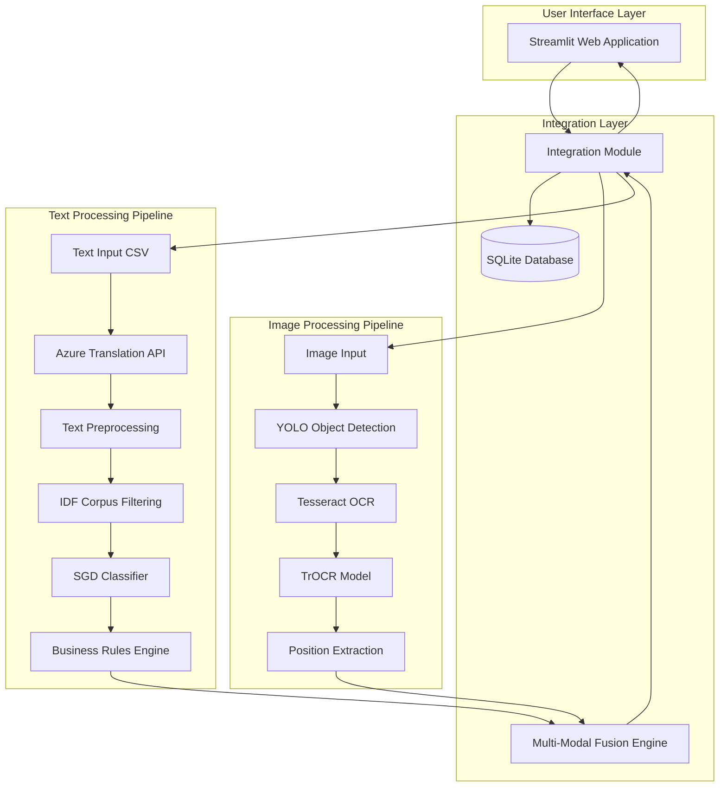
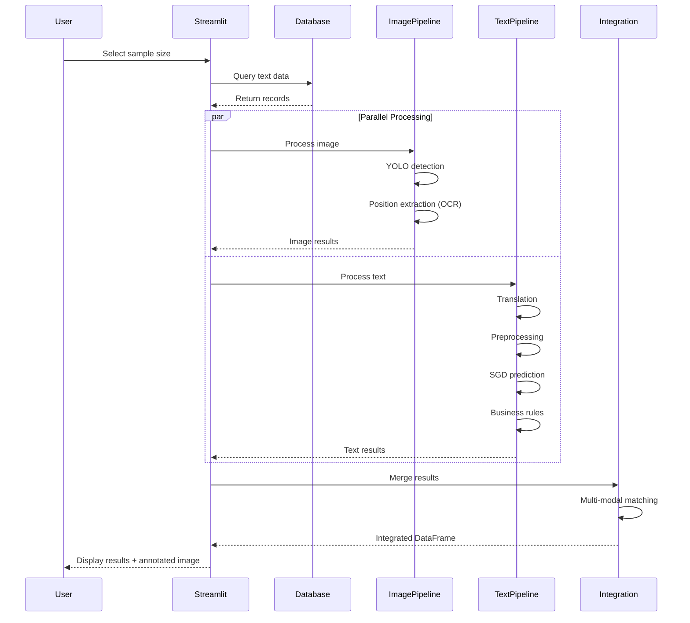

# GT Motive POC: Technical Architecture

## Architecture Overview

The GT Motive POC implements a sophisticated multi-modal AI architecture that combines computer vision, natural language processing, and rule-based systems. The architecture is modular, allowing independent development and scaling of image and text processing pipelines, unified through an integration layer.



## Module Architecture

### 1. Image Module (`image/`)

The image module handles all computer vision tasks including object detection, position recognition, and spatial analysis.

#### 1.1 Data Preparation Component (`image/data_preparation/`)

**Purpose**: Prepare and organize training data for YOLO model

**Key Files**:
- `data_preparation.py`: Dataset splitting and organization
- `config.ini`: Configuration for data paths
- `custom.yaml`: YOLO dataset configuration with 19 CUPI classes

**Classes Detected** (19 CUPI codes):
```yaml
'3504', '4050', '4060', '3401', '22010', '3010', '3503', '3501',
'3090', '6280', '6200', '3403', '3450', '11330', '08A00', '8010',
'3402', '3502', '4550'
```

**Directory Structure**:
```
dataset/
├── original_data/
│   ├── Images/       # Raw images
│   └── Labels/       # YOLO format annotations
└── train_test/
    ├── images/
    │   ├── train/    # Training images
    │   ├── val/      # Validation images
    │   └── test/     # Test images
    └── labels/
        ├── train/    # Training labels
        ├── val/      # Validation labels
        └── test/     # Test labels
```

#### 1.2 Training Component (`image/train/`)

**Purpose**: Train YOLO models for part detection

**Architecture**:
```python
class YOLOTrainer:
    - Model: YOLOv8m (medium variant)
    - Training Config:
        - Epochs: 2 (configurable)
        - Degrees: 0.45 (rotation augmentation)
        - Perspective: 0.0001 (perspective transform)
    - Output: Trained weights in runs/detect/train/weights/
```

**Training Pipeline**:
1. Load pre-trained YOLOv8m model
2. Configure data augmentation parameters
3. Train on custom dataset with 19 CUPI classes
4. Save best and last weights
5. Generate training metrics and visualizations

**Configuration** (`config.ini`):
```ini
[TrainingConfig]
epochs = 2
degrees = 0.45
perspective = 0.0001

[Paths]
model_path = yolov8m.pt
custom_yaml = custom.yaml
dataset_path = dataset/train_test/Images
```

#### 1.3 Testing Component (`image/test/`)

**Purpose**: Validate trained models and generate predictions

**Architecture**:
```python
class ImageProcessor:
    def __init__(self, config_file):
        self.model = YOLO(model_path)
        self.cupi_dict = {class_id: cupi_code}

    def process_images(self):
        # Run inference
        # Extract bounding boxes
        # Map class IDs to CUPI codes
        # Annotate images
        # Save results to Excel
```

**Processing Flow**:
1. Load trained YOLO model
2. Process test images
3. Extract predictions (bbox, class, confidence)
4. Map class IDs to CUPI codes
5. Annotate images with predictions
6. Save annotated images and results DataFrame

### 2. Text Module (`text/`)

The text module handles natural language processing for Spanish technical descriptions.

#### 2.1 Training Component (`text/training/`)

**Main Pipeline** (`home.py`):


**Key Classes**:

**1. Preprocessing Class** (`class_preprocessing.py`):
```python
class Preprocessing:
    - read_basic_preprocessing_data(): Load CSV with encoding='latin1'
    - infoaux_filtering(): Filter JSON/array patterns
    - infoaux_regex_cleaning(): Remove junk patterns
    - actual_translation(): Azure Translation API integration
    - exclusion_corpus_for_grupo(): IDF-based corpus creation
    - new_column_for_grupo(): Feature engineering
    - concat_column_creation(): Combine text features
    - clean_string(): Final text cleaning
```

**2. Model Training Class** (`class_model_functions.py`):
```python
class Model_training_saving:
    - model_training():
        - Vectorizer: CountVectorizer
        - Classifier: SGDClassifier
        - Target: DIREF_PIE_COD_CD (CUPI codes)
    - metrics(): Calculate accuracy, precision, recall, F1
    - creating_files(): Confusion matrix, classification report
    - metrics_files_saving(): Export metrics to Excel
    - output_files_saving(): Save predictions
```

**3. Business Rules Class** (`class_postprocessing.py`):
```python
class QuantityRules:
    - left_right_rules(): Apply L/R transformations
    - rows_12400_12500(): Handle specific CUPI ranges
    - front_rear_rules(): Apply front/rear logic
    - quantity_rules(): Adjust quantities based on DIREF_CANT_FAB
    - to_get_actuals(): Extract actual values for evaluation
    - metrics_after_after_rules(): Calculate post-rule metrics
```

#### 2.2 Testing Component (`text/testing/`)

**Main Pipeline** (`home.py`):
- Simplified version of training pipeline
- Loads pre-trained model and vectorizer
- Applies same preprocessing steps
- Generates predictions with business rules
- No model training, only inference

**Key Difference**:
```python
class Model_Loading_Prediction:
    def model_loading_and_prediction(self, test_data, model_path):
        model = pickle.load(open(model_path, 'rb'))
        vectorizer = pickle.load(open(vec_path, 'rb'))
        X_test_cv = vectorizer.transform(input_strings)
        predictions = model.predict(X_test_cv)
```

### 3. Integration Module (`integration/`)

The integration module unifies image and text predictions through multi-modal fusion.

#### 3.1 Core Components

**1. Streamlit Application** (`app.py`):
```python
class RenderUI(DBConnection, ImageProcess, TextProcess, Integration):
    # Multiple inheritance combining all capabilities

    def render_ui():
        # Three tabs: Process, Upload, View DB
        # Parallel processing with multiprocessing
        # Real-time visualization
```

**Application Tabs**:
1. **Process Tab**:
   - Select sample size (1-20)
   - Parallel image and text processing
   - Display integrated results with annotated images

2. **Upload Tab**:
   - Upload CSV with text data
   - Automatic image path generation
   - Database insertion/replacement

3. **View DB Tab**:
   - Display current database contents
   - Query historical claims

**2. Database Connection** (`database/db_connection.py`):
```python
class DBConnection(Utils):
    def __init__(self):
        self.sqlite_db = 'database/gt_motive.sqlite'
        self.sqlite_table = 'text_data'

    def get_db_date(): # Retrieve all records
    def insert_db_data(df): # Insert/replace data
    def delete_records(): # Clear table
```

**Database Schema**:
- Table: `text_data`
- Columns: All input CSV columns + `final_image_path`
- Technology: SQLite (lightweight, file-based)

**3. Image Processing Integration** (`image_processing/image_process.py`):

```python
class ImageProcess(Utils):
    # YOLO-based detection
    def process_images_with_yolo(img_path):
        # Returns: annotated_image, result_df

    # Position extraction pipeline
    def get_contour_bbox(path): # Contour detection
    def get_pos_num(path, contour_bbox): # Tesseract OCR
    def get_pos_meta(path, new_boxes): # TrOCR refinement

    # Spatial analysis
    def calculate_center(coordinates): # Centroid calculation
    def euclidean_distance(coord1, coord2): # Distance metric
    def find_closest_coordinate(center, coords_list): # Nearest neighbors

    # Main position extraction
    def process_images_and_get_positions(result_df):
        # Combines all position extraction methods
```

**Position Extraction Algorithm**:
1. **Contour Detection**: Find potential position number regions using HSV color space filtering
2. **Tesseract OCR**: Extract text from contour regions
3. **TrOCR Refinement**: Use Microsoft's TrOCR for improved accuracy on cropped regions
4. **Spatial Matching**: Find closest position numbers to each detected part using Euclidean distance

**4. Text Processing Integration** (`text_processing/text_process.py`):

```python
class TextProcess(Helper):
    # Full preprocessing pipeline
    def read_basic_preprocessing_data(data)
    def infoaux_filtering(data)
    def infoaux_regex_cleaning(data)
    def actual_translation(input_data): # Azure API
    def exclusion_corpus_for_grupo(): # IDF filtering
    def new_column_for_grupo(data, corpus_*)
    def concat_column_creation(data)
    def clean_string(input_text)

    # Model inference
    def model_loading_and_prediction(data):
        model = pickle.load('sgd_model_integration.pkl')
        vectorizer = pickle.load('count_vec_integration.pkl')
```

**Translation Integration** (Azure Cognitive Services):
```python
# Headers configuration
self.headers = {
    'Ocp-Apim-Subscription-Key': subscription_key,
    'Ocp-Apim-Subscription-Region': region,
    'Content-type': 'application/json',
    'X-ClientTraceId': uuid
}

# Language detection
/detect endpoint → Detect source language

# Translation
/translate endpoint → Spanish translation
```

**5. Multi-Modal Fusion** (`integration.py`):

```python
class Integration(Utils):
    def get_integrated_df(text_df, image_df):
        # Step 1: Filter by CUPI validity (74 valid codes)
        # Step 2: Match on position + CUPI (Complete Match)
        # Step 3: Match on position only (Position Matched-CUPI Changed)
        # Step 4: Match on CUPI only (CUPI Match)
        # Step 5: Remaining → Manual QC
```

**Matching Algorithm Logic**:
```python
# Status Categories:
1. "Complete Match":
   - Text CUPI == Image CUPI
   - Text position == Image position (primary or secondary)

2. "Position Matched-CUPI Changed":
   - Text position matches Image position
   - CUPIs differ → Use image prediction

3. "CUPI Match":
   - CUPI matches anywhere in image
   - Position differs

4. "Manual QC":
   - No matches found
   - Requires human review

5. "Other CUPI":
   - Predicted CUPI not in valid 74-code list
```

**6. Utilities** (`utils.py`):

```python
class CustomLogger:
    # Logging system with datetime-based file structure
    # Error tracking and debugging

class Utils(CustomLogger):
    def __init__(self):
        self.read_config()  # Parse config.ini
        self.validate_requirements()  # Pre-flight checks

    # Configuration management
    # Path validation
    # API connectivity testing
```

#### 3.2 Parallel Processing Architecture

**Multiprocessing Implementation**:
```python
import multiprocessing

# Create manager for shared data
manager = multiprocessing.Manager()
img_df = manager.list()
txt_df = manager.list()

# Parallel processes
p1 = multiprocessing.Process(target=get_img_out, args=(img_df, ...))
p2 = multiprocessing.Process(target=get_txt_out, args=(txt_df, ...))

p1.start()
p2.start()
p1.join()
p2.join()

# Results available in img_df[0] and txt_df[0]
```

**Benefits**:
- Image and text processing run concurrently
- ~50% reduction in total processing time
- Independent scaling of pipelines

## Technology Stack

### Deep Learning Frameworks

**1. PyTorch Ecosystem**:
```
pytorch==2.2.0+cu121
torchvision==0.17.0+cu121
torchaudio==2.2.0+cu121
```
- CUDA 12.1 support for GPU acceleration
- Used by YOLO and transformer models

**2. Ultralytics YOLO**:
```
ultralytics==8.1.3
```
- YOLOv8 architecture
- Pre-trained weights (yolov8m.pt)
- Custom training on 19 CUPI classes

**3. Transformers**:
```
transformers==4.36.2
```
- TrOCR: microsoft/trocr-small-printed
- Vision encoder-decoder architecture
- Fine-tuned for printed text recognition

### Computer Vision Libraries

**1. OpenCV**:
```
opencv-python==4.9.0.80
opencv-contrib-python==4.9.0.80
```
- Image preprocessing and augmentation
- Contour detection for position extraction
- Bounding box visualization

**2. Tesseract OCR**:
```
pytesseract==0.3.10
```
- Initial position number extraction
- Config: --psm 6 --oem 1 (uniform block, LSTM)

**3. Pillow**:
```
Pillow==10.2.0
```
- Image format handling
- Transformations and conversions

### Natural Language Processing

**1. Scikit-Learn**:
```
scikit-learn==1.4.0
```
- CountVectorizer: Text vectorization
- SGDClassifier: Linear classifier with SGD optimization
- Metrics: accuracy, precision, recall, F1

**2. Azure Cognitive Services**:
- Language Detection API
- Translation API (Spanish ↔ English)
- REST API integration

**3. Text Processing**:
```
regex==2023.12.25
```
- Advanced pattern matching
- Spanish character support (áéíóúüñ)

### Web Application Framework

**Streamlit**:
```
streamlit==1.30.0
```
- Multi-tab interface
- Real-time processing feedback
- Interactive data tables and visualizations
- Session state management

### Data Management

**1. Pandas**:
```
pandas==2.1.4
openpyxl==3.1.2
```
- DataFrame operations
- CSV/Excel I/O
- Data merging and filtering

**2. NumPy**:
```
numpy==1.26.3
```
- Array operations
- Mathematical computations

**3. SQLite**:
```
sqlite3 (built-in)
```
- Lightweight relational database
- No separate server required
- File-based storage

### Utilities

**1. Configuration**:
```
configparser (built-in)
```
- INI file parsing
- Environment-specific settings

**2. HTTP**:
```
requests==2.31.0
```
- Azure API communication
- RESTful interactions

**3. Logging**:
```
logging (built-in)
```
- Datetime-based log files
- Error tracking and debugging

## Configuration Management

### Central Configuration (`integration/config.ini`)

**Structure**:
```ini
[path]
# File paths for resources
rules_path = ./resources/quantity_rules_demo_febraury.xlsx
grupo_path = ./resources/idf_grupo.xlsx
subgrupo_path = ./resources/idf_subgrupo.xlsx
subsubgrupo_path = ./resources/idf_subsubgrupo.xlsx
img_upload_path = /home/merit/Madhan/GT Motive/Position/images/
output_path = ./output/
db_path = ./database/
tesseract_path = D:\Application\Tesseract\tesseract.exe
sqlite_db = ./database/gt_motive.sqlite
sqlite_table = text_data
request_limit = 20
record_size = 500
idf_value = 8

[models]
text_model_path = ./models/sgd_model_integration.pkl
vectorizer_path = ./models/count_vec_integration.pkl
img_model_path = ./models/best.pt
ocr_model = microsoft/trocr-small-printed

[headers]
cols = DIREF_DESC,LAMINA,INFOAUXFABRIC,NOTAS,GRUPO,SUBGRUPO,SUBSUBGRUPO,DIREF_CANT_FAB
final_cols = REF_ID,DIREF_DESC,LAMINA,GRUPO,SUBGRUPO,SUBSUBGRUPO,INFOAUXFABRIC,NOTAS,DIREF_CANT_FAB,Pred_CUPI

[translation]
key = <azure_subscription_key>
endpoint = https://api.cognitive.microsofttranslator.com
location = uksouth

[keyword]
right_words = derecho,derecha,der.,dcha.,dcho.,dcho,der,dcha,...
left_words = izquierdo,izquierda,izq.,izda.,izqu.,izda,izdo,...
front = DEL DER,DEL. DER,DEL DCH,DELANTERO,delantero,...
rear = trasero,TRASERAS,DETRAS,trasera,TRAS DERE,...
words_12400 = previo,intermedio,centro,previos,interm,...
words_12500 = trasero,final,posterior
corpus_keyword = [comprehensive list of essential keywords]

cupi_list = 3300,15134,3010,3524,2761R,112A0,... (74 codes)
```

## Model Artifacts

### Image Models
1. **Pre-trained Model**: `yolov8m.pt` (Ultralytics)
2. **Fine-tuned Model**: `models/best.pt` (custom 19-class)
3. **Training Output**: `runs/detect/train/weights/`

### Text Models
1. **Classifier**: `models/sgd_model_integration.pkl` (SGDClassifier)
2. **Vectorizer**: `models/count_vec_integration.pkl` (CountVectorizer)

### OCR Models
1. **TrOCR**: `microsoft/trocr-small-printed` (HuggingFace)

### Supporting Data
1. **IDF Corpus**: `resources/idf_grupo.xlsx`, `idf_subgrupo.xlsx`, `idf_subsubgrupo.xlsx`
2. **Quantity Rules**: `resources/quantity_rules_demo_febraury.xlsx`

## System Requirements

### Hardware Requirements
- **GPU**: NVIDIA GPU with CUDA 12.1 support (recommended for training/inference)
- **RAM**: Minimum 16GB, recommended 32GB
- **Storage**: ~500MB for models + variable for datasets
- **CPU**: Multi-core processor for parallel processing

### Software Requirements
- **OS**: Windows 10/11, Linux (Ubuntu 20.04+)
- **Python**: 3.10+
- **CUDA**: 12.1 (for GPU acceleration)
- **Tesseract**: Installed and configured

### Network Requirements
- Internet connectivity for Azure Translation API
- API rate limits: Configurable in config.ini

## Data Flow Architecture



## Scalability Considerations

### Horizontal Scaling
- **Multi-processing**: Already implemented for image/text parallelization
- **Batch Processing**: Supports up to 20 samples per batch
- **Queue Systems**: Can integrate with Celery/RabbitMQ for production

### Vertical Scaling
- **GPU Utilization**: CUDA-enabled for faster inference
- **Model Optimization**: Potential for ONNX conversion, quantization
- **Caching**: Translation results can be cached to reduce API calls

### Cloud Deployment Options
- **Azure**: Natural fit with existing Translation API
- **AWS**: SageMaker for model hosting
- **Docker**: Containerization for portability

## Security Considerations

### Current Implementation
- **Configuration Files**: Sensitive keys in config.ini (not in version control)
- **Database**: Local SQLite (no network exposure)
- **API Keys**: Azure subscription key required

### Production Enhancements
- **Environment Variables**: Use .env files or Azure Key Vault
- **Authentication**: Add user authentication for Streamlit
- **Encryption**: Encrypt database and API communications
- **Audit Logging**: Track all predictions and user actions

## Performance Benchmarks

### Processing Times (Estimated)
- **Image Processing**: 30-60 seconds per image (YOLO + OCR)
- **Text Processing**: 20-40 seconds per record (with translation)
- **Integration**: 5-10 seconds per pair
- **Total (Parallel)**: ~60-90 seconds per claim

### Model Performance
- **YOLO Detection**: mAP@0.5 varies by class
- **Text Classification**: Accuracy >85% (with business rules)
- **Position Extraction**: ~70-80% accuracy (OCR limitations)

## Conclusion

The GT Motive POC technical architecture demonstrates a sophisticated multi-modal AI system that effectively combines state-of-the-art computer vision (YOLO), NLP (transformers, SGD), and OCR technologies. The modular design allows independent development and scaling of components while the integration layer provides seamless multi-modal fusion. The use of modern frameworks (PyTorch, Streamlit) and cloud services (Azure Translation) positions the system for easy transition from POC to production deployment.
