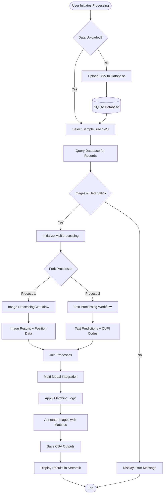
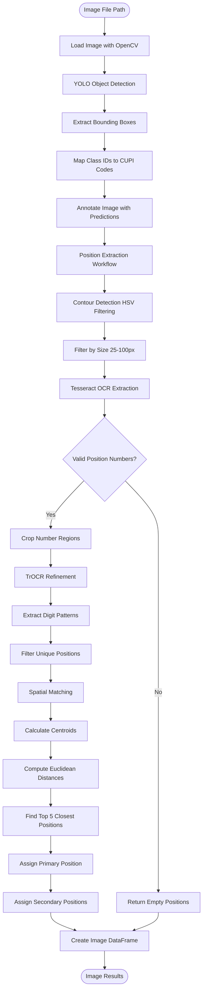
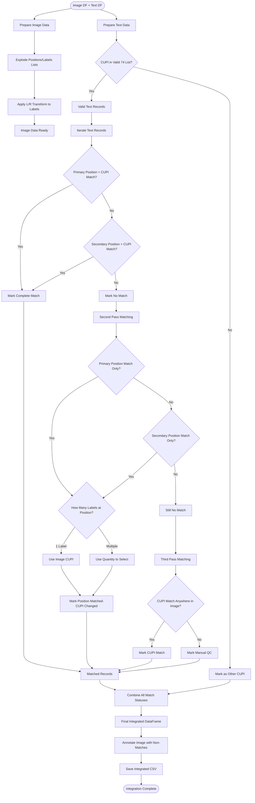
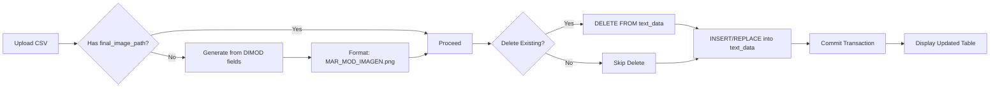

# GT Motive POC: Functional Architecture

## Overview

The GT Motive POC implements a complex multi-modal workflow that processes insurance claims through parallel image and text analysis pipelines, then fuses the results using sophisticated business logic. This document details the functional workflows, decision logic, and data transformations that occur throughout the system.

## End-to-End Workflow



## Functional Workflows

### 1. Image Processing Workflow

The image workflow detects automotive parts in technical diagrams and extracts their positions.



#### 1.1 YOLO Detection Details

**Input**:
- Image path (PNG format)
- Typical resolution: 600x600 or variable

**Processing**:
```python
# Load YOLO model
model = YOLO(config_data['img_model_path'])  # best.pt

# Run inference
results = model(image_path)

# Extract predictions
boxes = results[0].boxes.xywh.tolist()  # [x_center, y_center, width, height]
confidences = results[0].boxes.conf.tolist()
class_ids = results[0].boxes.cls.tolist()

# Map to CUPI codes
cupi_codes = [cupi_dict[str(int(cls_id))] for cls_id in class_ids]
```

**Output DataFrame Structure**:
```
| image_name | label | acc  | bbox           |
|------------|-------|------|----------------|
| image.png  | 3504  | 0.92 | [100,150,50,70]|
| image.png  | 4050  | 0.87 | [200,300,60,80]|
```

#### 1.2 Position Extraction Algorithm

**Step 1: Contour Detection**
```python
# Convert to HSV color space
hsv = cv2.cvtColor(resized_img, (3840, 2160))

# Gaussian blur
blurred = cv2.GaussianBlur(hsv, (5, 5), 8)

# Color range masking (white regions)
mask = cv2.inRange(blurred, [0, 0, 150], [255, 255, 255])

# Morphological operations
kernel = cv2.getStructuringElement(cv2.MORPH_RECT, (5, 3))
dilated = cv2.dilate(mask, kernel, iterations=1)

# Find contours
contours, _ = cv2.findContours(threshold, cv2.RETR_EXTERNAL, cv2.CHAIN_APPROX_SIMPLE)

# Extract bounding boxes
bboxes = [cv2.boundingRect(contour) for contour in contours]

# Filter by size (25-100 pixels in both dimensions)
filtered_bboxes = [bbox for bbox in bboxes if 25 < bbox[2] < 100 and 25 < bbox[3] < 100]
```

**Step 2: Tesseract OCR**
```python
# Extract text from filtered regions
pytesseract.image_to_data(
    resized_img,
    output_type=Output.DICT,
    config="--psm 6 --oem 1"  # Uniform block, LSTM engine
)

# Filter by confidence and regex pattern
pattern = r'[a-zA-Z\d]+'
valid_numbers = [match for match in results if confidence > 0 and regex.match(pattern)]
```

**Step 3: TrOCR Refinement**
```python
# Crop regions around detected positions
cropped = resized_img[y:y+h, x:x+w]
resized_crop = cv2.resize(cropped, (200, 200))

# Process with TrOCR
processor = TrOCRProcessor.from_pretrained('microsoft/trocr-small-printed')
model = VisionEncoderDecoderModel.from_pretrained('microsoft/trocr-small-printed')

pixel_values = processor(images=resized_crop, return_tensors="pt").pixel_values
generated_ids = model.generate(pixel_values)
text = processor.batch_decode(generated_ids, skip_special_tokens=True)[0]

# Extract digits
digits = re.search(r'\d+', text).group(0)
```

**Step 4: Spatial Matching**
```python
# Calculate centroid of detected part
def calculate_center(bbox):
    x, y, w, h = bbox
    return (x + w/2, y + h/2)

# Compute distances to all position numbers
distances = [
    euclidean_distance(part_center, pos_center)
    for pos_center in position_centers
]

# Find top 5 closest
top5_indices = sorted(range(len(distances)), key=lambda i: distances[i])[:5]
closest_positions = [positions[i] for i in top5_indices]

# Assign primary and secondary
primary_position = closest_positions[0]
secondary_positions = closest_positions
```

**Final Image DataFrame**:
```
| image_name | label | acc  | bbox | pri_pos | pri_cord | Sec_pos    | Sec_cord  |
|------------|-------|------|------|---------|----------|------------|-----------|
| image.png  | 3504  | 0.92 | [...] | 12     | [x,y,w,h]| [12,14,15] | [[...],...]|
```

### 2. Text Processing Workflow

The text workflow classifies Spanish technical descriptions into CUPI codes using NLP and business rules.

```mermaid
flowchart TD
    TXT_START([CSV Input]) --> LOAD_CSV[Load CSV with Latin-1 Encoding]
    LOAD_CSV --> FILL_NA[Fill NaN Values]
    FILL_NA --> FILTER_JSON[Filter JSON/Array Patterns in INFOAUXFABRIC]

    FILTER_JSON --> REGEX_CLEAN[Regex Junk Removal]
    REGEX_CLEAN --> TRANSLATION[Translation Workflow]

    TRANSLATION --> DETECT_LANG[Azure Language Detection]
    DETECT_LANG --> LANG_CHECK{Language = Spanish?}
    LANG_CHECK -->|No| TRANSLATE[Azure Translation to Spanish]
    LANG_CHECK -->|Yes| SKIP_TRANS[Skip Translation]

    TRANSLATE --> MERGE_TRANS[Merge Translations]
    SKIP_TRANS --> MERGE_TRANS

    MERGE_TRANS --> IDF_FILTER[IDF Corpus Filtering]
    IDF_FILTER --> LOAD_IDF[Load IDF Excel Files]
    LOAD_IDF --> FILTER_GRUPO[Filter GRUPO by IDF<8]
    FILTER_GRUPO --> FILTER_SUB[Filter SUBGRUPO by IDF<8]
    FILTER_SUB --> FILTER_SUBSUB[Filter SUBSUBGRUPO by IDF<8]

    FILTER_SUBSUB --> EXCLUDE_KEYWORDS[Exclude Essential Keywords]
    EXCLUDE_KEYWORDS --> CONCAT_FEATURES[Concatenate Text Features]

    CONCAT_FEATURES --> BUILD_STRING[Build concat_string]
    BUILD_STRING --> CLEAN_TEXT[Clean Special Characters]
    CLEAN_TEXT --> FINAL_STRING[concat_string_final]

    FINAL_STRING --> VECTORIZE[CountVectorizer Transform]
    VECTORIZE --> SGD_PREDICT[SGD Classifier Prediction]
    SGD_PREDICT --> INITIAL_CUPI[Initial CUPI Predictions]

    INITIAL_CUPI --> LR_RULES[Left/Right Business Rules]
    LR_RULES --> POS_RULES[Position Rules 12400/12500]
    POS_RULES --> FR_RULES[Front/Rear Business Rules]
    FR_RULES --> QTY_RULES[Quantity Rules]

    QTY_RULES --> FINAL_CUPI[Final CUPI Predictions]
    FINAL_CUPI --> TXT_DF[Create Text DataFrame]
    TXT_DF --> TXT_END([Text Results])
```



#### 2.1 Translation Workflow Details

**Batch Processing Strategy**:
```python
# Process in batches of 800 to avoid API rate limits
unique_values = df[column].unique()
batch_size = 800
batches = [unique_values[i:i+batch_size] for i in range(0, len(unique_values), batch_size)]

for batch in batches:
    # Language Detection
    detect_response = requests.post(
        endpoint + '/detect',
        params={'api-version': '3.0'},
        headers=headers,
        json=[{'text': value} for value in batch]
    )

    # Translation (if needed)
    for value, detected_lang in zip(batch, detect_response.json()):
        if detected_lang['language'] != 'es':
            translate_response = requests.post(
                endpoint + '/translate',
                params={'api-version': '3.0', 'from': detected_lang, 'to': ['es']},
                headers=headers,
                json=[{'text': value}]
            )
            translated_value = translate_response.json()[0]['translations'][0]['text']
```

**Translation Columns**:
- DIREF_DESC (Part description)
- LAMINA (Sheet/diagram reference)
- INFOAUXFABRIC (Auxiliary manufacturing info)
- NOTAS (Notes)
- GRUPO (Group)
- SUBGRUPO (Subgroup)
- SUBSUBGRUPO (Sub-subgroup)

**Error Handling**:
- Detection errors: Assume Spanish, log error
- Translation errors: Retain original value, log error
- Track errors per column in DataFrame

#### 2.2 IDF Corpus Filtering

**Purpose**: Remove common words that don't contribute to CUPI classification

**Process**:
```python
# Load IDF files
idf_grupo = pd.read_excel('idf_grupo.xlsx')
idf_subgrupo = pd.read_excel('idf_subgrupo.xlsx')
idf_subsubgrupo = pd.read_excel('idf_subsubgrupo.xlsx')

# Filter by IDF threshold (default: 8)
low_idf_grupo = idf_grupo[idf_grupo['IDF'] < 8]['GRUPO'].tolist()
low_idf_subgrupo = idf_subgrupo[idf_subgrupo['IDF'] < 8]['SUBGRUPO'].tolist()
low_idf_subsubgrupo = idf_subsubgrupo[idf_subsubgrupo['IDF'] < 8]['SUBSUBGRUPO'].tolist()

# Remove numeric tokens
filtered_grupo = [word.lower() for word in low_idf_grupo if not any(char.isdigit() for char in word)]

# Preserve essential keywords (left/right, front/rear, etc.)
essential_keywords = config['corpus_keyword'].split(',')
final_exclusion_list = [word for word in filtered_grupo if word not in essential_keywords]

# Apply to data
for index, row in data.iterrows():
    grupo_words = row['GRUPO'].lower().split()
    filtered_words = [word for word in grupo_words if word not in final_exclusion_list]
    data.loc[index, 'filtered_GRUPO'] = ' '.join(filtered_words)
```

**Rationale**: IDF (Inverse Document Frequency) identifies common words that appear in many documents. Words with low IDF are less discriminative for classification.

#### 2.3 Feature Engineering

**Concatenation Strategy**:
```python
concat_string = (
    df['DIREF_DESC'] + ',' +
    df['filtered_GRUPO'] + ',' +
    df['filtered_SUBGRUPO'] + ',' +
    df['filtered_SUBSUBGRUPO'] + ',' +
    df['LAMINA'] + ',' +
    df['INFOAUXFABRIC'] + ',' +
    df['NOTAS']
)

# Clean concatenated string
def clean_string(text):
    # Remove multiple commas and spaces
    text = re.sub(r',\s+', ' ', text)

    # Keep Spanish characters + alphanumeric
    text = re.sub(r'[^a-zA-ZáéíóðúüñÁÉÍÓÐÚÜÑ., ]', ' ', text)

    # Normalize spaces
    text = re.sub(r'\s+', ' ', text)

    # Clean punctuation patterns
    text = re.sub(r'[.,],|[.,]\s?', ',', text)
    text = re.sub(r'\b\w,\s?', '', text)  # Remove single-char before comma
    text = re.sub(r',{2,}', ',', text)  # Collapse multiple commas

    return text.strip()

df['concat_string_final'] = df['concat_string'].apply(clean_string)
```

#### 2.4 SGD Classification

**Model Training**:
```python
# Vectorization
vectorizer = CountVectorizer()
X_train = vectorizer.fit_transform(train_data['concat_string_final'])

# Target variable
y_train = train_data['DIREF_PIE_COD_CD']  # CUPI codes

# Training
model = SGDClassifier()
model.fit(X_train, y_train)

# Save artifacts
pickle.dump(model, open('sgd_model_integration.pkl', 'wb'))
pickle.dump(vectorizer, open('count_vec_integration.pkl', 'wb'))
```

**Model Inference**:
```python
# Load model
model = pickle.load(open('sgd_model_integration.pkl', 'rb'))
vectorizer = pickle.load(open('count_vec_integration.pkl', 'rb'))

# Transform input
X_test = vectorizer.transform(test_data['concat_string_final'])

# Predict
predictions = model.predict(X_test)

df['predictions_by_model'] = predictions
```

#### 2.5 Business Rules Engine

**Rule 1: Left/Right Transformation**

```python
def left_right_rules(df):
    """Apply left/right transformations based on Spanish keywords"""

    for idx, row in df.iterrows():
        prediction = row['predictions_by_model']
        concat_text = row['concat_string_final']

        # Check for right-side indicators
        if right_pattern.search(concat_text):
            if 'R' in str(prediction):
                df.loc[idx, 'after_left_right_rules'] = prediction
            else:
                df.loc[idx, 'after_left_right_rules'] = str(prediction) + 'R'

        # Check for left-side indicators
        elif left_pattern.search(concat_text):
            if 'L' in str(prediction):
                df.loc[idx, 'after_left_right_rules'] = prediction
            else:
                df.loc[idx, 'after_left_right_rules'] = str(prediction) + 'L'

        # No laterality detected
        else:
            df.loc[idx, 'after_left_right_rules'] = prediction

    return df
```

**Keywords**:
- Right: derecho, derecha, der., dcha., dcho., tras dere, tras dch, trasero der.
- Left: izquierdo, izquierda, izq., izda., tras izda, trasero izq.

**Rule 2: Position-Specific Rules (12400/12500)**

```python
def rows_12400_12500(df):
    """Apply specific rules for CUPI ranges 12400-12499 and 12500-12599"""

    for idx, row in df.iterrows():
        cupi = row['after_left_right_rules']
        concat_text = row['concat_string_final']

        # Check CUPI range
        cupi_num = int(cupi) if cupi.isdigit() else 0

        if 12400 <= cupi_num <= 12499:
            # Should contain words like: previo, intermedio, centro
            if any(word in concat_text for word in words_12400):
                df.loc[idx, 'after_12400_12500_rules'] = cupi
            else:
                # Might be mis-classified, flag for review
                df.loc[idx, 'after_12400_12500_rules'] = cupi + '_FLAG'

        elif 12500 <= cupi_num <= 12599:
            # Should contain words like: trasero, final, posterior
            if any(word in concat_text for word in words_12500):
                df.loc[idx, 'after_12400_12500_rules'] = cupi
            else:
                df.loc[idx, 'after_12400_12500_rules'] = cupi + '_FLAG'

        else:
            df.loc[idx, 'after_12400_12500_rules'] = cupi

    return df
```

**Rule 3: Front/Rear Classification**

```python
def front_rear_rules(df):
    """Adjust predictions based on front/rear indicators"""

    for idx, row in df.iterrows():
        concat_text = row['concat_string_final']
        current_cupi = row['after_12400_12500_rules']

        # Check for front indicators
        if any(word.lower() in concat_text.lower() for word in front_words):
            # If CUPI suggests rear part, might need adjustment
            if any(rear_word in concat_text.lower() for rear_word in rear_words):
                # Conflicting indicators - flag for review
                df.loc[idx, 'after_front_rear_rules'] = current_cupi + '_CONFLICT'
            else:
                df.loc[idx, 'after_front_rear_rules'] = current_cupi

        # Check for rear indicators
        elif any(word.lower() in concat_text.lower() for word in rear_words):
            df.loc[idx, 'after_front_rear_rules'] = current_cupi

        else:
            df.loc[idx, 'after_front_rear_rules'] = current_cupi

    return df
```

**Rule 4: Quantity Adjustment**

```python
def quantity_rules(df):
    """Adjust CUPI predictions based on DIREF_CANT_FAB (quantity) field"""

    # Load quantity rules from Excel
    rules_df = pd.read_excel(config['rules_path'])

    for idx, row in df.iterrows():
        cupi = row['after_front_rear_rules']
        quantity = int(row['DIREF_CANT_FAB'])

        # If quantity > 1, may need to return list of CUPIs
        if quantity > 1:
            # Check if CUPI has left/right variants
            if 'R' in cupi or 'L' in cupi:
                base_cupi = cupi.rstrip('RL')
                cupi_list = [base_cupi + 'R', base_cupi + 'L'][:quantity]
                df.loc[idx, 'after_quantity_rules'] = cupi_list
            else:
                # Return same CUPI multiple times
                df.loc[idx, 'after_quantity_rules'] = [cupi] * quantity
        else:
            df.loc[idx, 'after_quantity_rules'] = [cupi]

    return df
```

**Text DataFrame Output**:
```
| final_image_path | concat_string_final | DIREF_NUM_GRAFICO | DIREF_CANT_FAB | predictions_by_model | after_quantity_rules |
|------------------|---------------------|-------------------|----------------|----------------------|----------------------|
| image.png        | parachoques del...  | 12                | 1              | 3504                 | [3504]               |
| image.png        | faro izq delant...  | 14                | 2              | 4050                 | [4050L, 4050R]       |
```

### 3. Multi-Modal Integration Workflow

The integration workflow fuses image and text predictions using sophisticated matching logic.



#### 3.1 Image Data Preparation

```python
def prepare_image_data(image_df):
    """Prepare image data for matching"""

    # Ensure Sec_pos is a list
    image_df['Sec_pos'].fillna('[""]', inplace=True)
    image_df['Sec_pos'] = image_df['Sec_pos'].apply(
        lambda x: [str(x)] if type(x) != list else x
    )

    # Store original positions
    image_df['Sec_pos_org'] = image_df['Sec_pos']

    # Explode to one row per position
    image_df = image_df.explode('Sec_pos').reset_index(drop=True)

    # Apply left/right transformation to labels
    def apply_left_right(label):
        if 'R' in str(label):
            return [str(label), str(label[:-1]) + 'L']  # Add L variant
        else:
            return str(label)

    image_df['label'] = image_df['label'].apply(apply_left_right)

    # Explode labels
    image_df = image_df.explode('label').reset_index(drop=True)

    # Convert position to int
    image_df['pri_pos'] = image_df['pri_pos'].astype(int)
    image_df['label'] = image_df['label'].astype(str)

    return image_df
```

#### 3.2 Text Data Preparation

```python
def prepare_text_data(text_df, cupi_list):
    """Filter and prepare text data"""

    # Ensure predictions are lists
    text_df['after_quantity_rules'] = text_df['after_quantity_rules'].apply(
        lambda x: [str(x)] if type(x) != list else x
    )

    # Check if CUPI in valid list (74 codes)
    try:
        text_df['status_74'] = text_df['after_quantity_rules'].apply(
            lambda x: True if str(int(x[0])) in cupi_list else False
        )
    except:
        text_df['status_74'] = text_df['after_quantity_rules'].apply(
            lambda x: True if str(x[0]) in cupi_list else False
        )

    # Split into valid and invalid
    valid_text = text_df[text_df['status_74'] == True]
    invalid_text = text_df[text_df['status_74'] == False]

    # Mark invalid as "Other CUPI"
    invalid_text['match_status'] = 'Other CUPI'
    invalid_text['Final_CUPI'] = invalid_text['after_quantity_rules']

    return valid_text, invalid_text
```

#### 3.3 Matching Algorithm Implementation

**Pass 1: Complete Match (Position + CUPI)**

```python
for idx, text_row in valid_text.iterrows():
    image_subset = image_df[image_df['image_name'] == text_row['final_image_path']]

    for cupi in text_row['after_quantity_rules']:
        # Check primary position
        match = image_subset[
            (image_subset['label'] == str(cupi)) &
            (image_subset['pri_pos'] == int(text_row['DIREF_NUM_GRAFICO']))
        ]

        if len(match) > 0:
            valid_text.loc[idx, 'Image_Pred'] = str(text_row['after_quantity_rules'])
            valid_text.loc[idx, 'match_status'] = 'Complete Match'
            valid_text.loc[idx, 'Final_CUPI'] = text_row['after_quantity_rules']
            break

        # Check secondary positions
        match = image_subset[
            (image_subset['label'] == str(cupi)) &
            (image_subset['Sec_pos'] == str(text_row['DIREF_NUM_GRAFICO']))
        ]

        if len(match) > 0:
            valid_text.loc[idx, 'Image_Pred'] = str(text_row['after_quantity_rules'])
            valid_text.loc[idx, 'match_status'] = 'Complete Match'
            valid_text.loc[idx, 'Final_CUPI'] = text_row['after_quantity_rules']
            break
```

**Pass 2: Position Match (CUPI Changed)**

```python
no_match_text = valid_text[valid_text['match_status'] == 'No Match']

for idx, text_row in no_match_text.iterrows():
    image_subset = image_df[image_df['image_name'] == text_row['final_image_path']]

    # Match on primary position only
    position_match = image_subset[
        image_subset['pri_pos'] == str(text_row['DIREF_NUM_GRAFICO'])
    ]

    labels = position_match['label'].unique().tolist()

    if len(labels) == 1:
        # Single label at position - use it
        no_match_text.loc[idx, 'Final_CUPI'] = [labels[0]]
        no_match_text.loc[idx, 'Image_Pred'] = [labels[0]]
        no_match_text.loc[idx, 'match_status'] = 'Position matched-cupi changed'

    elif len(labels) > 1:
        # Multiple labels - use quantity to select
        quantity = int(text_row['DIREF_CANT_FAB'])
        sorted_labels = sorted(labels)
        selected = sorted_labels[:quantity]

        no_match_text.loc[idx, 'Final_CUPI'] = str(selected)
        no_match_text.loc[idx, 'Image_Pred'] = str(selected)
        no_match_text.loc[idx, 'match_status'] = 'Position matched-cupi changed'

    else:
        # Check secondary positions
        sec_position_match = image_subset[
            image_subset['Sec_pos'] == str(text_row['DIREF_NUM_GRAFICO'])
        ]

        sec_labels = sec_position_match['label'].unique().tolist()

        if len(sec_labels) > 0:
            # Apply same logic as above
            # ...
```

**Pass 3: CUPI Match (Position Differs)**

```python
still_no_match = valid_text[valid_text['match_status'] == 'No Match']

for idx, text_row in still_no_match.iterrows():
    image_subset = image_df[image_df['image_name'] == text_row['final_image_path']]

    for cupi in text_row['after_quantity_rules']:
        # Match CUPI anywhere in image
        cupi_match = image_subset[image_subset['label'] == str(cupi)]

        if len(cupi_match) > 0:
            still_no_match.loc[idx, 'Image_Pred'] = str(text_row['after_quantity_rules'])
            still_no_match.loc[idx, 'match_status'] = 'CUPI Match'
            still_no_match.loc[idx, 'Final_CUPI'] = text_row['after_quantity_rules']
            break
        else:
            # No match found - Manual QC
            all_image_labels = image_subset['label'].unique().tolist()
            still_no_match.loc[idx, 'Image_Pred'] = str(all_image_labels)
            still_no_match.loc[idx, 'match_status'] = 'Manual QC'
            still_no_match.loc[idx, 'Final_CUPI'] = text_row['after_quantity_rules']
```

#### 3.4 Match Status Categories

| Status | Meaning | Action | Confidence |
|--------|---------|--------|------------|
| Complete Match | Text CUPI = Image CUPI AND Text Position = Image Position | Accept prediction | High (95%+) |
| Position Matched-CUPI Changed | Text Position = Image Position BUT CUPIs differ | Use Image CUPI | Medium (70-90%) |
| CUPI Match | Text CUPI found in image BUT position differs | Flag for review | Low-Medium (60-80%) |
| Manual QC | No matches found | Require human validation | Low (<60%) |
| Other CUPI | Predicted CUPI not in valid 74-code list | Reject prediction | N/A |

#### 3.5 Final Output Structure

**Integrated DataFrame Columns**:
```
- final_image_path: Image filename
- concat_string_final: Cleaned text features
- DIREF_NUM_GRAFICO: Position number from text
- DIREF_CANT_FAB: Quantity
- Text_Pred: Original text prediction (after quantity rules)
- Image_Pred: Image model predictions at this position
- Final_CUPI: Final decision (list of CUPI codes)
- match_status: Category from above table
```

**Example Records**:
```csv
final_image_path,concat_string_final,DIREF_NUM_GRAFICO,DIREF_CANT_FAB,Text_Pred,Image_Pred,Final_CUPI,match_status
car123.png,"parachoques delantero derecho",12,1,[3504],[3504],[3504],Complete Match
car123.png,"faro delantero izquierdo",14,1,[4050L],[4050L],[4050L],Complete Match
car123.png,"moldura lateral",18,2,[6280L 6280R],[3090],[3090],Position matched-cupi changed
car123.png,"retrovisor",22,1,[8010],[8010 8240],8010,CUPI Match
car123.png,"emblema",30,1,[9999],['3504' '4050'],9999,Manual QC
```

### 4. Database Operations Workflow



**Image Path Generation**:
```python
if 'final_image_path' not in df.columns:
    df['ID_IMAGEN'] = df['ID_IMAGEN'].astype(str)
    df['final_image_path'] = (
        df['DIMOD_MAR_COD_CD'] + '_' +
        df['DIMOD_MOD_COD_CD'] + '_' +
        df['ID_IMAGEN'] + '.png'
    )
```

### 5. Training Workflows

#### 5.1 Image Model Training


#### 5.2 Text Model Training


## Decision Logic Summary

### Image Processing Decisions
1. **Confidence Threshold**: Detections below 0.5 confidence annotated differently
2. **Position Filtering**: Only positions 25-100px in size considered
3. **Position Limit**: Maximum 5 closest positions per part
4. **Primary vs Secondary**: Closest position = primary, rest = secondary

### Text Processing Decisions
1. **Translation**: Only translate if detected language != Spanish
2. **IDF Threshold**: Filter words with IDF < 8
3. **Left/Right**: Apply R/L suffix based on keyword presence
4. **Quantity**: Return list of CUPIs if quantity > 1

### Integration Decisions
1. **Valid CUPI**: Must be in 74-code whitelist
2. **Match Priority**: Complete Match > Position Match > CUPI Match > Manual QC
3. **Position Hierarchy**: Primary position preferred over secondary
4. **CUPI Conflict**: Image prediction takes precedence over text

## Performance Optimization

### Parallel Processing
- Image and text pipelines run concurrently using multiprocessing
- ~50% reduction in total processing time
- Shared memory using multiprocessing.Manager()

### Batch Operations
- Translation API: 800 records per batch
- Database operations: Bulk insert/replace
- Pandas operations: Vectorized where possible

### Caching Opportunities (Future)
- Translation cache for repeated phrases
- Model predictions cache for duplicate inputs
- Image embeddings for similarity search

## Error Handling

### Image Pipeline Errors
- Missing image file → Display placeholder, continue processing
- YOLO inference error → Return empty DataFrame
- OCR failure → Return empty positions

### Text Pipeline Errors
- Translation API timeout → Retry once, then use original text
- Model loading failure → Exit with error message
- Invalid CUPI format → Mark as "Other CUPI"

### Integration Errors
- Missing columns → Display error, require correct format
- Position mismatch → Continue with available data
- Database errors → Rollback transaction, display error

## Conclusion

The GT Motive POC functional architecture demonstrates a sophisticated multi-modal AI system with complex decision logic spanning computer vision, NLP, and business rules. The workflows are designed to handle real-world automotive insurance scenarios with robust error handling, parallel processing for performance, and transparent decision-making for user trust. The integration layer successfully fuses image and text modalities using a hierarchical matching algorithm that balances automation with human oversight requirements.
