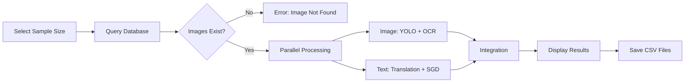

# GT Motive POC: User Guide

## Table of Contents
1. [Getting Started](#getting-started)
2. [Application Overview](#application-overview)
3. [Using the Process Tab](#using-the-process-tab)
4. [Using the Upload Tab](#using-the-upload-tab)
5. [Using the View DB Tab](#using-the-view-db-tab)
6. [Training Custom Models](#training-custom-models)
7. [Interpreting Results](#interpreting-results)
8. [Troubleshooting](#troubleshooting)
9. [Best Practices](#best-practices)

## Getting Started

### Prerequisites

Before using the GT Motive POC application, ensure you have:

1. **Python Environment**: Python 3.10 or higher installed
2. **Dependencies Installed**: All required packages from requirements.txt
3. **GPU (Optional)**: NVIDIA GPU with CUDA 12.1 for faster processing
4. **Tesseract OCR**: Installed and configured (path set in config.ini)
5. **Azure Subscription**: Valid Azure Cognitive Services key for translation

### Installation Steps

1. **Navigate to Integration Directory**:
```bash
cd gt_motive_poc/integration/
```

2. **Install Dependencies**:
```bash
pip install -r requirements.txt
```

3. **Configure Settings**:
Edit `config.ini` to set your paths and API keys:
```ini
[path]
img_upload_path = /path/to/your/images/
output_path = ./output/
db_path = ./database/

[models]
text_model_path = ./models/sgd_model_integration.pkl
vectorizer_path = ./models/count_vec_integration.pkl
img_model_path = ./models/best.pt

[translation]
key = YOUR_AZURE_KEY
endpoint = https://api.cognitive.microsofttranslator.com
location = YOUR_REGION
```

4. **Launch Application**:
```bash
streamlit run app.py
```

5. **Access in Browser**:
Open your web browser to `http://localhost:8501`

## Application Overview

### Main Interface

The GT Motive POC application has a three-tab interface:

```
┌─────────────────────────────────────────────────┐
│                  GT-Motive                      │
├─────────────┬─────────────┬─────────────────────┤
│   Process   │   Upload    │     View DB         │
├─────────────┴─────────────┴─────────────────────┤
│                                                 │
│            [Tab Content Area]                   │
│                                                 │
└─────────────────────────────────────────────────┘
```

**Tab Functions**:
- **Process**: Run multi-modal analysis on claims
- **Upload**: Load new claim data into the database
- **View DB**: Review existing claim records

### Session State Management

The application maintains session state to prevent concurrent processing:
- **Disabled**: Ready for new processing
- **Active**: Currently processing (prevents re-submission)

**Important**: If processing gets stuck, refresh the browser to reset state.

## Using the Process Tab

The Process tab is the main interface for analyzing insurance claims with multi-modal AI.

### Step-by-Step Guide

#### Step 1: Select Sample Size

```
┌─────────────────────────────────────┐
│ Enter the sample size               │
│ ┌─────────────────┐                 │
│ │       5         │  [1-20 range]   │
│ └─────────────────┘                 │
│        [Submit]                      │
└─────────────────────────────────────┘
```

1. Enter a number between **1 and 20**
2. This determines how many claims to process in the batch
3. Click **Submit** to start processing

**Recommendations**:
- **Testing**: Start with 1-2 claims to verify setup
- **Demo**: Use 5-10 claims for demonstrations
- **Batch Processing**: Use 15-20 for production-like scenarios

#### Step 2: Processing Execution

Once submitted, the application will:

1. **Query Database**: Retrieve text data for selected sample size
2. **Validate Images**: Check that corresponding images exist
3. **Parallel Processing**: Launch concurrent image and text pipelines

**Progress Indicators**:
```
Please wait...
🔄 Processing claim 1 of 5
```

**Processing Time**:
- **Per Claim**: 60-90 seconds (parallelized)
- **5 Claims**: ~5-7 minutes
- **10 Claims**: ~10-15 minutes

#### Step 3: Review Results

Results appear as expandable sections for each processed claim:

```
▼ car_model_12345.png
  ┌────────────────────────────────────────────────┐
  │  [Annotated Image]     │  [Results Table]      │
  │                        │                        │
  │  Bounding boxes show:  │  Columns:             │
  │  - Detected parts      │  - Text predictions   │
  │  - Position numbers    │  - Image predictions  │
  │  - Non-matching items  │  - Match status       │
  │    (green boxes)       │  - Final CUPI         │
  └────────────────────────────────────────────────┘
```

**Image Annotations**:
- **Red Boxes**: All detected parts (from YOLO)
- **Green Boxes**: Parts that don't match text predictions (require review)
- **Labels**: CUPI codes and position numbers

**Results Table Columns**:
- `final_image_path`: Image filename
- `concat_string_final`: Combined text features
- `DIREF_NUM_GRAFICO`: Position number from claim
- `DIREF_CANT_FAB`: Quantity of parts
- `Text_Pred`: Prediction from text model (after business rules)
- `Image_Pred`: Prediction from image model
- `Final_CUPI`: Final decision (CUPI code(s))
- `match_status`: Classification of match quality

#### Step 4: Export Results

Processed results are automatically saved to timestamped folders:

```
output/
└── 2024-01-15_14-30-25/
    ├── car_model_12345_img.csv      # Image predictions
    ├── car_model_12345_txt.csv      # Text predictions
    └── car_model_12345_integrated.csv # Final integrated results
```

**File Contents**:

**Image CSV** (`*_img.csv`):
```csv
image_name,label,acc,bbox,pri_pos,Sec_pos
car_model_12345.png,3504,0.92,[100 150 50 70],12,"[12, 14, 15]"
```

**Text CSV** (`*_txt.csv`):
```csv
final_image_path,predictions_by_model,after_quantity_rules,DIREF_NUM_GRAFICO
car_model_12345.png,3504,[3504],12
```

**Integrated CSV** (`*_integrated.csv`):
```csv
final_image_path,Text_Pred,Image_Pred,Final_CUPI,match_status
car_model_12345.png,[3504],[3504],[3504],Complete Match
```

### Understanding Processing Workflow



## Using the Upload Tab

The Upload tab allows you to load new claim data into the system's database.

### Step-by-Step Guide

#### Step 1: Prepare CSV File

Your CSV must contain the following columns:

**Required Columns**:
- `DIREF_DESC`: Part description (Spanish)
- `LAMINA`: Sheet/diagram reference
- `INFOAUXFABRIC`: Auxiliary manufacturing information
- `NOTAS`: Notes
- `GRUPO`: Group classification
- `SUBGRUPO`: Subgroup classification
- `SUBSUBGRUPO`: Sub-subgroup classification
- `DIREF_CANT_FAB`: Quantity
- `DIREF_NUM_GRAFICO`: Position number in diagram
- `DIREF_PIE_COD_CD`: CUPI code (ground truth for training)

**Optional Column**:
- `final_image_path`: Image filename (if not provided, will be auto-generated)

**Auto-Generation Columns** (for image path):
- `DIMOD_MAR_COD_CD`: Brand code
- `DIMOD_MOD_COD_CD`: Model code
- `ID_IMAGEN`: Image ID

**Example CSV Structure**:
```csv
DIMOD_MAR_COD_CD,DIMOD_MOD_COD_CD,ID_IMAGEN,DIREF_DESC,GRUPO,SUBGRUPO,DIREF_NUM_GRAFICO,DIREF_CANT_FAB,DIREF_PIE_COD_CD
SEAT,IBIZA,12345,Parachoques delantero,CARROCERIA,PARAGOLPES,12,1,3504
SEAT,IBIZA,12345,Faro delantero izquierdo,ELECTRICO,ILUMINACION,14,1,4050L
```

#### Step 2: Upload File

```
┌─────────────────────────────────────────┐
│ ☑ Delete existing records               │
│                                          │
│ Choose a Text input file                │
│ ┌────────────────────────────┐          │
│ │  Browse...  [No file chosen]│          │
│ └────────────────────────────┘          │
│                                          │
│           [Submit]                       │
└─────────────────────────────────────────┘
```

1. **Check "Delete existing records"** (optional):
   - ✅ Checked: Clears database before inserting new data
   - ⬜ Unchecked: Appends to existing data

2. **Click "Browse..."** and select your CSV file

3. **Click "Submit"**

#### Step 3: Verification

After upload, the application will:

1. **Validate Structure**: Check for required columns
2. **Generate Image Paths**: If `final_image_path` missing
   ```
   Format: {DIMOD_MAR_COD_CD}_{DIMOD_MOD_COD_CD}_{ID_IMAGEN}.png
   Example: SEAT_IBIZA_12345.png
   ```
3. **Database Operations**:
   - Delete existing records (if selected)
   - Insert/replace new records
4. **Display Confirmation**:
   ```
   ✅ Existing records deleted...
   ✅ New data inserted successfully...
   ```
5. **Show Updated Table**: Preview of database contents

### Upload Best Practices

**File Preparation**:
- Use UTF-8 or Latin-1 encoding
- Ensure no missing values in required columns
- Verify image files exist in `img_upload_path`

**Image Naming**:
- Consistent naming: `{brand}_{model}_{id}.png`
- Place images in path configured in `config.ini`

**Data Quality**:
- Remove duplicate records before upload
- Validate CUPI codes against valid list
- Check position numbers are numeric

## Using the View DB Tab

The View DB tab provides a read-only view of all records in the database.

### Features

1. **Full Table Display**: Shows all columns from `text_data` table
2. **Interactive DataTable**: Sortable, searchable, paginated
3. **Real-time Updates**: Refreshes when tab is accessed

### Common Uses

**Data Verification**:
- Confirm uploads were successful
- Review existing claim data
- Check image path generation

**Sample Selection**:
- Identify interesting cases for processing
- Review distribution of CUPIs
- Check data quality

**Troubleshooting**:
- Verify database connection
- Check for missing/malformed data

## Training Custom Models

### Training Image Model (YOLO)

#### Prerequisites
- Annotated images in YOLO format
- Custom dataset organized in train/val/test splits

#### Steps

1. **Prepare Data** (`image/data_preparation/`):
```bash
cd gt_motive_poc/image/data_preparation/
python data_preparation.py
```

This organizes your dataset into:
```
dataset/train_test/
├── images/
│   ├── train/
│   ├── val/
│   └── test/
└── labels/
    ├── train/
    ├── val/
    └── test/
```

2. **Configure Training** (`image/train/config.ini`):
```ini
[TrainingConfig]
epochs = 50          # Increase for production
degrees = 0.45       # Rotation augmentation
perspective = 0.0001 # Perspective transform

[Paths]
model_path = yolov8m.pt
custom_yaml = C:/path/to/custom.yaml
dataset_path = C:/path/to/dataset/train_test/Images
```

3. **Update Dataset YAML** (`custom.yaml`):
```yaml
names:
  0: '3504'
  1: '4050'
  # ... add your CUPI classes

path: C:/path/to/dataset/train_test/Images
train: C:/path/to/dataset/train_test/Images/train
val: C:/path/to/dataset/train_test/Images/val
```

4. **Run Training**:
```bash
cd gt_motive_poc/image/train/
python train.py
```

5. **Monitor Training**:
- Progress displayed in console
- Metrics saved to `runs/detect/train/`
- Best weights: `runs/detect/train/weights/best.pt`

6. **Deploy Model**:
```bash
cp runs/detect/train/weights/best.pt ../../integration/models/best.pt
```

#### Training Metrics

After training, review:
- **Precision**: How many detections were correct
- **Recall**: How many actual parts were detected
- **mAP@0.5**: Mean Average Precision at 50% IoU threshold
- **Loss Curves**: Training and validation loss

### Training Text Model (SGD Classifier)

#### Prerequisites
- Training CSV with ground truth CUPI codes
- Test CSV for validation

#### Steps

1. **Prepare Training Data**:
   - Ensure CSV has all required columns
   - Include `DIREF_PIE_COD_CD` (target CUPI)
   - Separate train and test files

2. **Configure Paths** (`text/training/config.ini`):
```ini
[input_file_path]
train_data_path = "/path/to/train.csv"
test_data_path = "/path/to/test.csv"
quantity_rules_file = "/path/to/quantity_rules.xlsx"

[model_folder]
output_folder = "/path/to/output/"
```

3. **Run Training**:
```bash
cd gt_motive_poc/text/training/
python home.py
```

4. **Training Pipeline**:
   - Loads and preprocesses data
   - Translates to Spanish
   - Applies IDF filtering
   - Trains SGD classifier
   - Applies business rules
   - Generates metrics

5. **Review Outputs**:
   - **Metrics**: `metrics/classification_report.xlsx`, `confusion_matrix.xlsx`
   - **Model**: `output/sgd_model_*.pkl`
   - **Vectorizer**: `output/count_vec_*.pkl`
   - **Logs**: `logs/log_file.txt`

6. **Deploy Model**:
```bash
cp output/sgd_model_*.pkl ../../integration/models/sgd_model_integration.pkl
cp output/count_vec_*.pkl ../../integration/models/count_vec_integration.pkl
```

#### Training Best Practices

**Data Requirements**:
- Minimum 1000 training samples
- Balanced class distribution
- Representative of production data

**Hyperparameter Tuning**:
- Modify `SGDClassifier` parameters in `class_model_functions.py`
- Experiment with `CountVectorizer` settings (ngram_range, max_features)

**Business Rules**:
- Update keyword lists in `config.ini`
- Customize rules in `class_postprocessing.py`

## Interpreting Results

### Match Status Categories

Understanding the `match_status` column is crucial for decision-making:

#### 1. Complete Match ✅
```
Status: Complete Match
Confidence: High (95%+)
Action: Accept prediction
```

**Meaning**: Both image and text models agree on CUPI AND position

**Example**:
```
Text Pred: [3504]
Image Pred: [3504]
Position: 12 (matches)
Final CUPI: [3504]
```

**User Action**: No review needed, proceed with claim

#### 2. Position Matched-CUPI Changed ⚠️
```
Status: Position matched-cupi changed
Confidence: Medium (70-90%)
Action: Verify image prediction
```

**Meaning**: Position is correct, but text model predicted wrong CUPI. Image prediction used instead.

**Example**:
```
Text Pred: [3090]
Image Pred: [3504]
Position: 12 (matches)
Final CUPI: [3504] (from image)
```

**User Action**:
- Review annotated image
- Verify image prediction makes sense
- Check if text description was ambiguous

#### 3. CUPI Match 🔍
```
Status: CUPI Match
Confidence: Low-Medium (60-80%)
Action: Flag for review
```

**Meaning**: Text CUPI found in image, but at different position

**Example**:
```
Text Pred: [3504]
Image Pred: [3504 at position 15, not 12]
Position: 12 (text) vs 15 (image)
Final CUPI: [3504]
```

**User Action**:
- Check if position number in text data is incorrect
- Verify part location in image
- May require position correction

#### 4. Manual QC ❌
```
Status: Manual QC
Confidence: Low (<60%)
Action: Require human review
```

**Meaning**: No matches found between text and image predictions

**Example**:
```
Text Pred: [3504]
Image Pred: [4050, 6280, 8010] (none match)
Position: No match
Final CUPI: [3504] (text retained)
```

**User Action**:
- Manual review required
- Check if image is correct
- Verify text description accuracy
- May indicate data quality issue

#### 5. Other CUPI 🚫
```
Status: Other CUPI
Confidence: N/A
Action: Reject prediction
```

**Meaning**: Predicted CUPI not in valid 74-code whitelist

**Example**:
```
Text Pred: [9999]
Valid List: [3300, 15134, 3010, ..., 3027L]
Final CUPI: [9999]
```

**User Action**:
- Review source data
- Check if new CUPI should be added to whitelist
- May indicate model needs retraining

### Reading Annotated Images

**Color Coding**:
- 🔴 **Red Boxes**: All detected parts (YOLO predictions)
- 🟢 **Green Boxes**: Parts that don't match text (Manual QC needed)

**Labels**:
- **CUPI Code**: 4-5 character code (e.g., "3504")
- **Position Number**: 1-2 digit number near part

**Interpretation**:
```
┌─────────────────────────────────┐
│  [12]  ← Position number        │
│   3504 ← CUPI code              │
│   ┌──────┐                      │
│   │  🔴  │  ← Red box (detected)│
│   └──────┘                      │
│                                 │
│         [15]                    │
│          4050                   │
│         ┌──────┐                │
│         │  🟢  │  ← Green box   │
│         └──────┘    (no match)  │
└─────────────────────────────────┘
```

### Results Table Analysis

**Key Columns to Review**:

1. **concat_string_final**: Check if text description is clear
2. **Text_Pred vs Image_Pred**: Compare predictions
3. **match_status**: Prioritize review based on status
4. **Final_CUPI**: This is what will be used for claim

**Quality Indicators**:
- **High Quality Claim**: >80% "Complete Match" status
- **Medium Quality**: 60-80% matches, some position changes
- **Low Quality**: >30% "Manual QC", requires extensive review

## Troubleshooting

### Common Issues and Solutions

#### Issue 1: "Image path not found"
```
⚠️ Input image not found - car_model_12345.png
```

**Causes**:
- Image file doesn't exist
- Incorrect path in config.ini
- Filename mismatch with database

**Solutions**:
1. Verify image exists: `ls /path/to/images/car_model_12345.png`
2. Check `img_upload_path` in `config.ini`
3. Verify `final_image_path` in database matches actual filename

#### Issue 2: "Language detection API not reached"
```
❌ Language detection API not reached
```

**Causes**:
- Invalid Azure subscription key
- Network connectivity issues
- Incorrect endpoint URL

**Solutions**:
1. Verify Azure key in `config.ini`:
   ```ini
   [translation]
   key = YOUR_VALID_KEY
   ```
2. Test network: `ping api.cognitive.microsofttranslator.com`
3. Check Azure portal for service status

#### Issue 3: "Text data columns doesn't matched"
```
❌ Text data columns doesn't matched...
Required columns are - [DIREF_DESC, LAMINA, ...]
```

**Causes**:
- Uploaded CSV missing required columns
- Column names don't match exactly

**Solutions**:
1. Check CSV headers match required columns
2. Ensure no extra spaces in column names
3. Verify encoding (use UTF-8 or Latin-1)

#### Issue 4: Model loading errors
```
FileNotFoundError: [Errno 2] No such file or directory: './models/best.pt'
```

**Causes**:
- Model files not in expected location
- Incorrect path in config.ini

**Solutions**:
1. Verify model files exist:
   ```bash
   ls -l integration/models/
   # Should show: best.pt, sgd_model_integration.pkl, count_vec_integration.pkl
   ```
2. Update paths in `config.ini` if needed

#### Issue 5: Processing stuck in "Active" state
```
⚠️ Please refresh and run
```

**Causes**:
- Previous processing interrupted
- Session state not reset

**Solutions**:
1. Refresh browser (F5)
2. Restart Streamlit:
   ```bash
   Ctrl+C  # Stop server
   streamlit run app.py  # Restart
   ```

#### Issue 6: Low accuracy results
```
Match Status Distribution:
- Manual QC: 60%
- Complete Match: 20%
```

**Causes**:
- Model trained on different data distribution
- Poor quality images
- Translation errors

**Solutions**:
1. **Retrain models** with representative data
2. **Improve image quality**: Ensure clear, high-resolution diagrams
3. **Review translation**: Check if Spanish translations are accurate
4. **Update business rules**: Customize keywords for your use case

### Debug Mode

Enable detailed logging:

1. Edit `utils.py`:
```python
logging.basicConfig(
    filename=f'{log_path}/{dt.strftime("%H")}.log',
    level=logging.DEBUG,  # Change from INFO to DEBUG
    format='%(asctime)s - %(levelname)s - %(message)s'
)
```

2. Review logs:
```bash
tail -f logs/DD-MM-YY/HH.log
```

## Best Practices

### Data Management

1. **Regular Backups**:
   ```bash
   cp database/gt_motive.sqlite database/backups/gt_motive_$(date +%Y%m%d).sqlite
   ```

2. **Clean Old Outputs**:
   ```bash
   # Remove outputs older than 30 days
   find output/ -type d -mtime +30 -exec rm -rf {} \;
   ```

3. **Monitor Database Size**:
   ```bash
   du -h database/gt_motive.sqlite
   # If > 1GB, consider archiving old records
   ```

### Performance Optimization

1. **Use GPU**: Ensure CUDA is properly configured
   ```python
   import torch
   print(torch.cuda.is_available())  # Should return True
   ```

2. **Batch Size**: Process 5-10 claims at a time for optimal throughput

3. **Image Resolution**: Resize very large images to 3840x2160 max

### Workflow Recommendations

1. **Start Small**: Process 1-2 claims to validate setup
2. **Review Samples**: Manually verify a few results before scaling
3. **Iterative Improvement**: Use Manual QC cases to retrain models
4. **Document Decisions**: Keep notes on edge cases and resolutions

### Quality Assurance

1. **Random Sampling**: Periodically manually verify "Complete Match" cases
2. **Threshold Monitoring**: Track match status distribution over time
3. **User Feedback**: Collect adjuster feedback on prediction quality
4. **Model Versioning**: Keep track of which model version was used

### Security

1. **Protect API Keys**: Never commit `config.ini` to version control
2. **Access Control**: Limit who can upload data or retrain models
3. **Audit Logs**: Review logs for unusual activity
4. **Data Privacy**: Ensure claim data is handled per regulations

## Advanced Features

### Custom Business Rules

Modify rules in `text_processing/quantity_rules_helper.py`:

```python
class Helper:
    def custom_rule(self, df):
        """Add your custom business logic"""
        for idx, row in df.iterrows():
            # Your logic here
            if some_condition:
                df.loc[idx, 'Final_CUPI'] = modified_value
        return df
```

### API Integration (Future)

The architecture supports REST API wrapper:

```python
from flask import Flask, request
app = Flask(__name__)

@app.route('/predict', methods=['POST'])
def predict():
    image_path = request.json['image_path']
    text_data = request.json['text_data']
    # Process and return results
```

### Batch Processing Script

For automated processing:

```python
# batch_process.py
import pandas as pd
from app import RenderUI

obj = RenderUI()
sample_sizes = [10, 10, 10]  # Process in batches of 10

for batch_num, size in enumerate(sample_sizes):
    print(f"Processing batch {batch_num + 1}")
    # Call processing methods directly
    # Save results to separate folders
```

## Conclusion

This user guide provides comprehensive instructions for using the GT Motive POC application. By following the workflows and best practices outlined here, users can effectively leverage the multi-modal AI system for automated insurance claim processing. Remember to start with small batches, carefully interpret match statuses, and use Manual QC cases as opportunities for continuous improvement.

For technical issues not covered in this guide, consult the Technical Architecture documentation or contact the development team.
