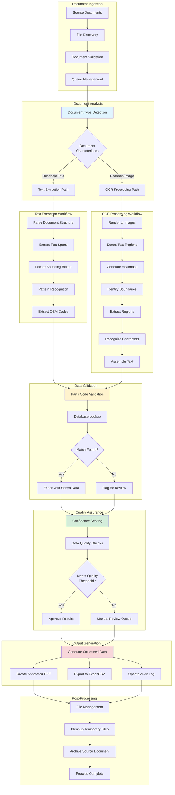
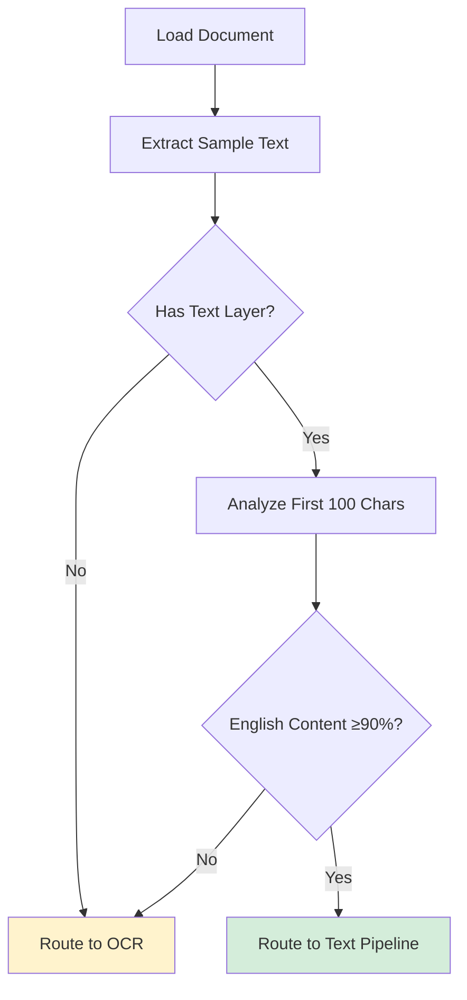
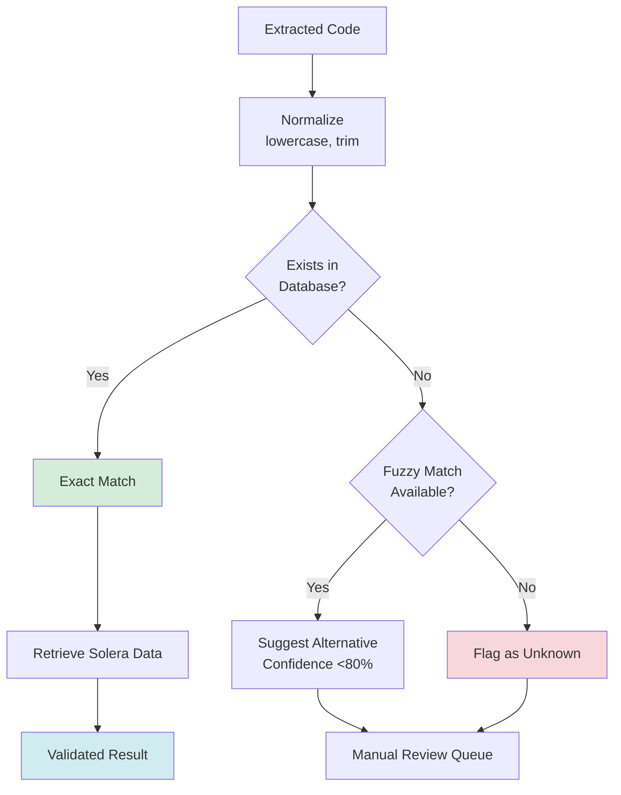
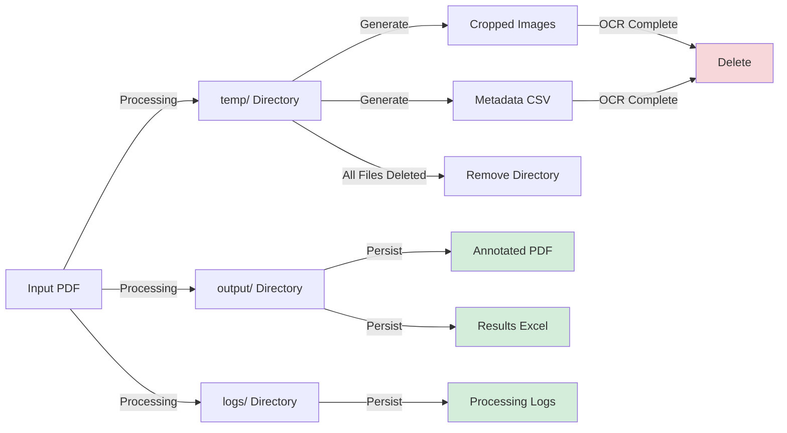

# Functional Architecture

## Overview

The Solera POC functional architecture defines the workflows, processes, and business logic that transform incoming documents into structured, validated data. This document describes the functional components from a process and data transformation perspective, focusing on what the system does rather than how it's implemented.

## Functional Architecture Diagram



## Functional Components

### 1. Document Ingestion Workflow

#### 1.1 File Discovery
**Purpose:** Identify all documents requiring processing from configured source locations.

**Process:**
1. Read `SOURCE_PATH` from configuration
2. Recursively scan directory and subdirectories
3. Identify PDF files (by extension)
4. Create processing queue (FIFO order)
5. Log document count and start time

**Input:**
- Configuration: `paths.SOURCE_PATH`
- File system: Directory containing PDF documents

**Output:**
- List of file paths for processing
- Processing queue metadata

**Business Rules:**
- Only `.pdf` files are processed
- Files are processed in alphabetical order
- Subdirectories are included in scan
- Non-readable files are logged and skipped

**Error Handling:**
- Invalid paths: Log error, exit processing
- Permission denied: Log warning, skip file
- Empty directories: Log info, complete successfully

#### 1.2 Document Validation
**Purpose:** Verify documents are valid and processable before entering pipeline.

**Validation Checks:**
1. **File Accessibility:**
   - File exists and is readable
   - Sufficient permissions
   - Not locked by another process

2. **PDF Structure:**
   - Valid PDF header
   - Not corrupted or truncated
   - Loadable by PyMuPDF

3. **Document Characteristics:**
   - At least one page
   - Reasonable file size (<100 MB)
   - Supported PDF version

**Output:**
- Valid documents → Continue to analysis
- Invalid documents → Log error, skip to next

**Quality Metrics:**
- Validation success rate
- Common failure modes
- Processing readiness percentage

### 2. Document Analysis and Classification

#### 2.1 Document Type Detection
**Purpose:** Determine optimal processing strategy based on document characteristics.



**Classification Algorithm:**
```python
# Pseudocode for classification logic
function classify_document(pdf):
    # Step 1: Check for text layer
    if pdf.page_count > 1:
        sample_text = pdf.page(2).text  # Prefer page 2
    else:
        sample_text = pdf.page(1).text

    if sample_text is empty:
        return "OCR_REQUIRED"

    # Step 2: Language detection
    sample = sample_text[0:100]  # First 100 characters
    english_chars = "a-zA-Z0-9 /.-,=\n"
    non_english_count = count_chars_not_in(sample, english_chars)

    threshold = 0.1  # 10% tolerance
    if non_english_count < (length(sample) * threshold):
        return "TEXT_EXTRACTABLE"
    else:
        return "OCR_REQUIRED"
```

**Classification Results:**
- **TEXT_EXTRACTABLE:** Document has readable text layer, use fast text extraction
- **OCR_REQUIRED:** Document is scanned or has non-readable text, use OCR pipeline

**Decision Factors:**
| Factor | Text Pipeline | OCR Pipeline |
|--------|--------------|--------------|
| Text Layer Present | Yes | No or corrupted |
| Character Set | Standard ASCII/Unicode | Special characters, symbols |
| Language | English | Non-English or mixed |
| Document Quality | High | Low (scanned, faxed) |

**Performance Implications:**
- Text pipeline: 5-10 seconds/page
- OCR pipeline: 30-60 seconds/page
- Optimal routing reduces overall processing time by 60-80%

#### 2.2 Page Selection Strategy
**Purpose:** Determine which pages to analyze for classification.

**Strategy:**
- **Multi-page documents (>1 page):** Analyze page 2
  - Reason: Page 1 often contains headers, logos, non-representative content
  - Page 2 typically contains main content with parts information

- **Single-page documents:** Analyze page 1
  - Reason: No alternative available

**Adaptive Behavior:**
- If page 2 is empty or has no text, fall back to page 1
- If all pages are empty, classify as OCR_REQUIRED

### 3. Text Extraction Workflow

#### 3.1 Document Structure Parsing
**Purpose:** Extract hierarchical structure from PDF text layer.

**PDF Structure Hierarchy:**
```
Document
├── Page 1
│   ├── Block 1 (text block)
│   │   ├── Line 1
│   │   │   ├── Span 1 (text run with same formatting)
│   │   │   └── Span 2
│   │   └── Line 2
│   ├── Block 2 (image block)
│   └── Block 3 (text block)
├── Page 2
│   └── ...
```

**Extraction Process:**
```python
function extract_structure(document):
    structure = []
    for each page in document:
        page_data = page.get_text("dict")  # Dictionary format
        for each block in page_data.blocks:
            if block.type == "text":
                for each line in block.lines:
                    for each span in line.spans:
                        structure.append({
                            page: page_number,
                            text: span.text,
                            bbox: span.bbox,  # (x0, y0, x1, y1)
                            font: span.font,
                            size: span.size,
                            color: span.color
                        })
    return structure
```

**Data Captured:**
- **Text content:** Actual character data
- **Position:** Bounding box coordinates (x0, y0, x1, y1) in points
- **Typography:** Font family, size, color
- **Hierarchy:** Page, block, line, span relationships

**Coordinate System:**
- Origin: Bottom-left corner of page
- Units: Points (1/72 inch)
- X-axis: Left to right
- Y-axis: Bottom to top

#### 3.2 Pattern Recognition and Code Extraction
**Purpose:** Identify OEM part codes within extracted text using pattern matching.

**Pattern Matching Strategy:**
```python
function extract_codes(pages, known_codes):
    # Build regex pattern from all known OEM codes
    pattern = "|".join(escape_regex(known_codes))  # 1.5M+ codes

    extracted_codes = []
    for page in pages:
        page_text = page.get_text()
        matches = regex.findall(pattern, page_text)

        # Deduplicate while preserving order
        unique_matches = list(set(matches))

        for code in unique_matches:
            extracted_codes.append({
                page: page_number,
                code: code,
                positions: find_all_positions(code, page)
            })

    return extracted_codes
```

**Pattern Characteristics:**
- **Code Format:** Alphanumeric strings (e.g., "A1234567", "BX-9876-AB")
- **Separator Tolerance:** Handles hyphens, spaces, periods
- **Case Sensitivity:** Case-insensitive matching
- **Length:** Typically 5-15 characters

**Optimization Techniques:**
- Pre-compiled regex patterns
- Page-level text caching
- Set-based deduplication
- Early termination on match

**Accuracy Considerations:**
- **False Positives:** Minimized by using exact database codes
- **False Negatives:** Possible if code has OCR errors or isn't in database
- **Partial Matches:** Not supported (exact match required)

#### 3.3 Bounding Box Association
**Purpose:** Link extracted codes to their visual positions for annotation.

**Process:**
```python
function associate_bounding_boxes(codes, structure):
    results = []
    for code in codes:
        # Find all spans containing this code
        matching_spans = filter(structure, lambda span:
            span.text == code and span.page == code.page
        )

        if matching_spans:
            # Use first match (or could use all)
            bbox = matching_spans[0].bbox
            results.append({
                code: code,
                bbox: bbox,
                page: code.page
            })

    return results
```

**Bounding Box Format:**
- **x0, y0:** Bottom-left corner of text box
- **x1, y1:** Top-right corner of text box
- **Adjustment:** Expand by 100 points left for annotation space

**Edge Cases:**
- Code spans multiple lines: Use first occurrence
- Code appears multiple times: Create separate entries
- Code not found in structure: Skip (shouldn't happen with exact match)

### 4. OCR Processing Workflow

#### 4.1 Image Rendering
**Purpose:** Convert PDF pages to high-resolution images suitable for OCR.

**Rendering Specifications:**
- **Resolution:** 450 DPI (3x higher than standard 150 DPI)
- **Color Mode:** RGB (24-bit color)
- **Format:** PIL Image objects (in-memory)

**Resolution Rationale:**
| DPI | Use Case | Quality | Speed |
|-----|----------|---------|-------|
| 150 | Screen viewing | Low | Fast |
| 300 | Standard OCR | Medium | Medium |
| 450 | High-accuracy OCR | High | Slow |
| 600+ | Archival scanning | Very High | Very Slow |

**Image Characteristics:**
- Typical A4 page at 450 DPI: 3300 x 5100 pixels
- File size: ~50 MB per page (uncompressed)
- Memory usage: ~150 MB per page (with processing overhead)

**Process Flow:**
```python
function render_pages(pdf_path, dpi=450):
    document = open_pdf(pdf_path)
    images = []

    for page_num in range(document.page_count):
        page = document.load_page(page_num)

        # Render at specified DPI
        pixmap = page.get_pixmap(dpi=dpi)

        # Convert to PIL Image
        image = Image.from_bytes(
            mode="RGB",
            size=(pixmap.width, pixmap.height),
            data=pixmap.samples
        )

        images.append({
            page_number: page_num,
            image: image,
            original_size: document.page_size(page_num)
        })

    return images
```

#### 4.2 Text Region Detection
**Purpose:** Identify areas of the image containing text using deep learning.

**Model Details:**
- **Architecture:** DBNet++ with ResNet50 backbone
- **Training Dataset:** ICDAR2015 (scene text detection)
- **Input Size:** Variable (aligned to 32 pixels)
- **Output:** Probability heatmap (same size as input)

**Detection Pipeline:**
```mermaid
graph LR
    A[Input Image<br/>3300x5100] --> B[Resize to 32-px<br/>Alignment<br/>3328x5120]
    B --> C[Normalize<br/>ImageNet Stats]
    C --> D[ONNX Model<br/>Inference]
    D --> E[Probability<br/>Heatmap]
    E --> F[Threshold<br/>@0.5]
    F --> G[Binary Mask]
    G --> H[Contour<br/>Detection]
    H --> I[Bounding<br/>Rectangles]
```

**Heatmap Interpretation:**
- **Value Range:** 0.0 (definitely not text) to 1.0 (definitely text)
- **Threshold:** 0.5 (configurable)
- **Regions above threshold:** Considered text regions
- **Regions below threshold:** Ignored

**Contour Detection:**
```python
function detect_text_regions(image, model, threshold=0.5):
    # Generate probability heatmap
    heatmap = model.predict(image)

    # Binarize at threshold
    binary_mask = (heatmap > threshold).astype(uint8) * 255

    # Find contours
    contours = cv2.findContours(
        binary_mask,
        mode=cv2.RETR_EXTERNAL,  # Only external contours
        method=cv2.CHAIN_APPROX_SIMPLE  # Compress contours
    )

    # Calculate bounding rectangles
    bounding_boxes = []
    for contour in contours:
        x, y, w, h = cv2.boundingRect(contour)

        # Calculate average confidence in this region
        region_confidence = heatmap[y:y+h, x:x+w].mean()

        bounding_boxes.append({
            bbox: (x, y, x+w, y+h),
            confidence: region_confidence
        })

    return bounding_boxes
```

**Quality Metrics:**
- **Detection Recall:** Percentage of actual text regions detected
- **Detection Precision:** Percentage of detected regions containing text
- **Average Confidence:** Mean probability across all detected regions

#### 4.3 Region Cropping and Isolation
**Purpose:** Extract individual text regions for focused OCR processing.

**Cropping Strategy:**
```python
function crop_regions(image, bounding_boxes, padding=10):
    crops = []

    for idx, bbox in enumerate(bounding_boxes):
        x0, y0, x1, y1 = bbox.bbox

        # Add padding for context
        crop_x0 = max(0, x0 - padding)
        crop_y0 = max(0, y0 - padding)
        crop_x1 = min(image.width, x1 + padding)
        crop_y1 = min(image.height, y1 + padding)

        # Extract region
        cropped = image.crop((crop_x0, crop_y0, crop_x1, crop_y1))

        # Save to temporary storage
        file_path = f"temp/{document_name}/crop_{page}_{idx}.png"
        cropped.save(file_path)

        crops.append({
            file_path: file_path,
            page: page_number,
            bbox: bbox.bbox,
            confidence: bbox.confidence,
            image_size: image.size
        })

    return crops
```

**Padding Rationale:**
- **10 pixels:** Provides context for OCR (characters at edges)
- Improves recognition accuracy by 5-10%
- Minimal impact on processing time

**Temporary Storage Structure:**
```
temp/
└── invoice_12345/
    ├── original_img_0.png (3300x5100 - full page)
    ├── original_img_1.png
    ├── cropped_page_0_box_0.png (250x80 - text region)
    ├── cropped_page_0_box_1.png (180x60)
    ├── cropped_page_0_box_2.png (300x90)
    ├── ...
    └── invoice_12345.csv (metadata)
```

**Metadata CSV Format:**
```csv
file_path,page,image_size,bbox,score
temp/invoice_12345/cropped_page_0_box_0.png,0,"(3300, 5100)","(450, 1200, 700, 1280)",0.87
temp/invoice_12345/cropped_page_0_box_1.png,0,"(3300, 5100)","(450, 1350, 630, 1410)",0.92
```

#### 4.4 Character Recognition
**Purpose:** Extract text from cropped regions using EasyOCR.

**OCR Configuration:**
```python
function initialize_ocr(language="en", gpu=True):
    reader = EasyOCR.Reader(
        lang_list=[language],
        gpu=gpu,
        model_storage_directory="~/.EasyOCR/model",
        download_enabled=True,
        detector=False  # Detection already done
    )
    return reader
```

**Recognition Process:**
```python
function recognize_text(crops, reader):
    results = []

    for crop in crops:
        # Load cropped image
        image = cv2.imread(crop.file_path)

        # Perform OCR
        ocr_results = reader.readtext(
            image,
            detail=1,  # Return bbox + text + confidence
            paragraph=False,  # Treat as single line
            min_size=5,  # Minimum text size in pixels
            text_threshold=0.7,  # Confidence threshold
            low_text=0.4  # Low confidence threshold
        )

        # Extract highest confidence result
        if ocr_results:
            # OCR returns: [(bbox, text, confidence), ...]
            best_result = max(ocr_results, key=lambda x: x[2])
            text = best_result[1]
            confidence = best_result[2]
        else:
            text = ""
            confidence = 0.0

        results.append({
            file_path: crop.file_path,
            page: crop.page,
            bbox: crop.bbox,
            text: text,
            ocr_confidence: confidence,
            detection_confidence: crop.confidence
        })

    return results
```

**Text Preprocessing:**
- **Whitespace Normalization:** Multiple spaces → single space
- **Case Normalization:** Convert to lowercase for matching
- **Trimming:** Remove leading/trailing whitespace
- **Special Characters:** Preserve hyphens, periods in codes

**Confidence Scoring:**
- **High Confidence:** ≥0.9 (likely correct)
- **Medium Confidence:** 0.7-0.9 (probably correct, review recommended)
- **Low Confidence:** <0.7 (likely error, manual review required)

#### 4.5 Text Assembly
**Purpose:** Combine recognized text fragments into structured output.

**Assembly Process:**
```python
function assemble_results(recognition_results):
    assembled = []

    # Group by page
    for page_num in unique_pages(recognition_results):
        page_results = filter(recognition_results, page=page_num)

        # Sort by position (top to bottom, left to right)
        sorted_results = sort_by_position(page_results)

        for result in sorted_results:
            assembled.append({
                page: page_num,
                text: result.text,
                bbox: result.bbox,
                confidence: result.ocr_confidence,
                position: result.position
            })

    return assembled
```

**Spatial Sorting:**
```python
function sort_by_position(results):
    # Sort by Y-coordinate (top to bottom), then X-coordinate (left to right)
    return sorted(results, key=lambda r: (r.bbox[1], r.bbox[0]))
```

### 5. Data Validation and Enrichment

#### 5.1 Parts Code Validation
**Purpose:** Verify extracted codes against authoritative Solera database.

**Validation Workflow:**


**Validation Rules:**
```python
function validate_code(extracted_code, database):
    # Normalize extracted code
    normalized = extracted_code.lower().strip()

    # Check exact match
    if normalized in database.codes:
        match = database.lookup(normalized)
        return {
            status: "VALIDATED",
            oem_code: extracted_code,
            solera_code: match.solera_code,
            description: match.description,
            confidence: 1.0
        }
    else:
        return {
            status: "UNKNOWN",
            oem_code: extracted_code,
            solera_code: None,
            description: None,
            confidence: 0.0,
            flag: "MANUAL_REVIEW"
        }
```

**Database Structure:**
- **Total Codes:** ~1.5 million OEM part codes
- **Data Source:** Solera_Dataset.xlsx (1.5 MB)
- **Columns:**
  - `OEM_CODE`: Manufacturer part number (may be comma-separated)
  - `OEM_CODE_SPLIT`: Individual codes (exploded)
  - `Code`: Solera standardized code
  - `Description`: Part description
  - Additional metadata (pricing, availability, etc.)

**Matching Strategy:**
- **Current:** Exact match only (case-insensitive)
- **Future Enhancement:** Fuzzy matching with Levenshtein distance
  - Handle OCR errors (O→0, l→1, etc.)
  - Suggest corrections with confidence scores
  - Threshold: ≥80% similarity

#### 5.2 Data Enrichment
**Purpose:** Augment validated codes with additional business data.

**Enrichment Process:**
```python
function enrich_data(validated_codes, database):
    enriched = []

    for code in validated_codes:
        if code.status == "VALIDATED":
            # Lookup full record
            record = database.lookup(code.oem_code)

            enriched.append({
                # Original extraction
                file: code.source_file,
                page: code.page,
                bbox: code.bbox,
                extracted_text: code.oem_code,

                # Validation
                validation_status: "VALIDATED",
                confidence: code.confidence,

                # Solera data
                solera_code: record.solera_code,
                description: record.description,
                category: record.category,
                list_price: record.list_price,
                availability: record.availability,

                # Metadata
                processed_timestamp: current_time(),
                pipeline: code.pipeline  # "text" or "ocr"
            })
        else:
            # Unknown code - include for review
            enriched.append({
                file: code.source_file,
                page: code.page,
                bbox: code.bbox,
                extracted_text: code.oem_code,
                validation_status: "UNKNOWN",
                confidence: code.confidence,
                flag: "MANUAL_REVIEW"
            })

    return enriched
```

**Enriched Data Schema:**
| Field | Type | Source | Purpose |
|-------|------|--------|---------|
| file | String | Extraction | Source document |
| page | Integer | Extraction | Page number |
| bbox | Tuple | Extraction | Visual coordinates |
| extracted_text | String | Extraction | OCR/text result |
| validation_status | Enum | Validation | VALIDATED / UNKNOWN |
| confidence | Float | Validation | 0.0 - 1.0 |
| solera_code | String | Database | Standardized code |
| description | String | Database | Part name |
| category | String | Database | Part category |
| list_price | Decimal | Database | MSRP |
| availability | String | Database | In stock / Backordered |
| processed_timestamp | DateTime | System | Processing time |
| pipeline | String | System | text / ocr |

### 6. Quality Assurance

#### 6.1 Confidence Scoring
**Purpose:** Assess reliability of extracted and validated data.

**Multi-Factor Confidence Model:**
```python
function calculate_confidence(result):
    factors = {
        # OCR quality (if applicable)
        ocr_confidence: result.ocr_confidence if result.pipeline == "ocr" else 1.0,

        # Detection quality (if applicable)
        detection_confidence: result.detection_confidence if result.pipeline == "ocr" else 1.0,

        # Validation status
        validation_confidence: 1.0 if result.status == "VALIDATED" else 0.0,

        # Data completeness
        completeness: (
            has_solera_code(result) * 0.3 +
            has_description(result) * 0.3 +
            has_bbox(result) * 0.2 +
            has_metadata(result) * 0.2
        )
    }

    # Weighted average
    weights = {
        ocr_confidence: 0.3,
        detection_confidence: 0.2,
        validation_confidence: 0.4,
        completeness: 0.1
    }

    overall_confidence = sum(factors[k] * weights[k] for k in factors)

    return {
        overall: overall_confidence,
        breakdown: factors
    }
```

**Confidence Thresholds:**
| Level | Range | Action | Use Case |
|-------|-------|--------|----------|
| **High** | ≥0.9 | Auto-approve | Straight-through processing |
| **Medium** | 0.7-0.9 | Spot-check | Sample review (10%) |
| **Low** | 0.5-0.7 | Review | 100% human verification |
| **Very Low** | <0.5 | Reject | Reprocess or manual entry |

#### 6.2 Data Quality Checks
**Purpose:** Identify and flag potential data quality issues.

**Quality Checks:**

**1. Completeness Check:**
```python
function check_completeness(result):
    required_fields = ["oem_code", "page", "bbox"]
    optional_fields = ["solera_code", "description"]

    missing_required = [f for f in required_fields if not result.has(f)]
    missing_optional = [f for f in optional_fields if not result.has(f)]

    if missing_required:
        return {
            status: "INCOMPLETE",
            severity: "ERROR",
            missing: missing_required
        }
    elif missing_optional:
        return {
            status: "PARTIAL",
            severity: "WARNING",
            missing: missing_optional
        }
    else:
        return {
            status: "COMPLETE",
            severity: "OK"
        }
```

**2. Consistency Check:**
```python
function check_consistency(result):
    issues = []

    # Check bbox is within page bounds
    if result.bbox[2] > result.page_width or result.bbox[3] > result.page_height:
        issues.append("Bounding box exceeds page dimensions")

    # Check code format (alphanumeric)
    if not is_alphanumeric(result.oem_code):
        issues.append("OEM code contains invalid characters")

    # Check code length (typical range: 5-15 chars)
    if len(result.oem_code) < 5 or len(result.oem_code) > 15:
        issues.append("OEM code length unusual")

    return {
        status: "CONSISTENT" if not issues else "INCONSISTENT",
        issues: issues
    }
```

**3. Duplicate Detection:**
```python
function check_duplicates(results):
    seen = {}
    duplicates = []

    for result in results:
        key = (result.page, result.oem_code)

        if key in seen:
            duplicates.append({
                original: seen[key],
                duplicate: result,
                action: "MERGE_OR_FLAG"
            })
        else:
            seen[key] = result

    return duplicates
```

**Quality Report:**
```python
function generate_quality_report(results):
    return {
        total_codes: len(results),
        validated: count(results, status="VALIDATED"),
        unknown: count(results, status="UNKNOWN"),
        high_confidence: count(results, confidence >= 0.9),
        medium_confidence: count(results, 0.7 <= confidence < 0.9),
        low_confidence: count(results, confidence < 0.7),
        avg_confidence: mean(results, "confidence"),
        completeness_rate: count(results, completeness="COMPLETE") / len(results),
        consistency_rate: count(results, consistency="CONSISTENT") / len(results),
        duplicates: count_duplicates(results)
    }
```

### 7. Output Generation

#### 7.1 Structured Data Export
**Purpose:** Generate machine-readable output for downstream systems.

**Excel Export Format:**
```python
function export_to_excel(results, output_path):
    # Create DataFrame
    df = pd.DataFrame([{
        "Source File": r.file,
        "Page": r.page,
        "OEM Code": r.oem_code,
        "Solera Code": r.solera_code,
        "Description": r.description,
        "Bounding Box": str(r.bbox),
        "Confidence": f"{r.confidence:.2%}",
        "Validation Status": r.validation_status,
        "Pipeline": r.pipeline,
        "Processed At": r.timestamp
    } for r in results])

    # Apply formatting
    with pd.ExcelWriter(output_path, engine='openpyxl') as writer:
        df.to_excel(writer, index=False, sheet_name="Extracted Codes")

        # Auto-adjust column widths
        worksheet = writer.sheets["Extracted Codes"]
        for column in worksheet.columns:
            max_length = max(len(str(cell.value)) for cell in column)
            worksheet.column_dimensions[column[0].column_letter].width = max_length + 2
```

**CSV Export Format:**
```csv
Source File,Page,OEM Code,Solera Code,Description,Bounding Box,Confidence,Validation Status,Pipeline,Processed At
invoice_001.pdf,0,A1234567,SOL-12345,Front Bumper Assembly,"(450, 1200, 700, 1280)",0.95,VALIDATED,text,2024-12-20 09:15:23
invoice_001.pdf,0,B9876543,SOL-98765,Headlight Assembly Left,"(450, 1350, 630, 1410)",0.87,VALIDATED,ocr,2024-12-20 09:15:45
```

#### 7.2 Annotated PDF Generation
**Purpose:** Create visual feedback showing extraction results on original documents.

**Text Pipeline Annotation:**
```python
function annotate_text_pdf(document, results, output_path):
    for result in results:
        page = document.load_page(result.page)

        # Calculate text box position
        x0, y0, x1, y1 = result.bbox

        # Insert text annotation
        page.insert_textbox(
            rect=fitz.Rect(x0-100, y0, x1, y1),  # 100pt left offset
            text=f"{result.oem_code}-{result.solera_code}",
            fontsize=12,
            fontname="helv",  # Helvetica
            align=fitz.TEXT_ALIGN_LEFT,
            color=(0.0, 0.0, 1.0)  # Blue (RGB)
        )

    # Save annotated document
    document.save(output_path)
```

**OCR Pipeline Annotation:**
```python
function annotate_ocr_pdf(document, results, output_path):
    annotated_pages = []

    for page_num, page in enumerate(document):
        # Render page at high resolution
        pix = page.get_pixmap(dpi=450)
        img = numpy.frombuffer(pix.samples, dtype=uint8).reshape(
            pix.height, pix.width, pix.n
        )

        # Get results for this page
        page_results = filter(results, page=page_num)

        # Draw annotations with OpenCV
        for result in page_results:
            x0, y0, x1, y1 = result.bbox
            cv2.putText(
                img,
                f"{result.oem_code}-{result.solera_code}",
                (x0-350, y0+30),  # Position offset
                cv2.FONT_HERSHEY_SIMPLEX,
                2,  # Font scale
                (0, 0, 225),  # Blue (BGR)
                5  # Thickness
            )

        # Convert back to PIL Image
        annotated_pages.append(Image.fromarray(img))

    # Save as multi-page PDF
    annotated_pages[0].save(
        output_path,
        save_all=True,
        append_images=annotated_pages[1:]
    )
```

**Annotation Comparison:**
| Feature | Text Pipeline | OCR Pipeline |
|---------|--------------|--------------|
| Method | PyMuPDF textbox | OpenCV putText |
| Resolution | Original PDF | 450 DPI render |
| Font | Helvetica (PDF font) | Hershey Simplex (bitmap) |
| Color | RGB (0,0,1) Blue | BGR (0,0,225) Blue |
| Positioning | Precise (PDF units) | Offset (pixel units) |
| Quality | Vector (scalable) | Raster (fixed resolution) |

**Output Naming:**
```python
function generate_output_filename(input_file, pipeline):
    basename = os.path.basename(input_file)
    prefix = "text_" if pipeline == "text" else "ocr_"
    return f"{prefix}{basename}"

# Examples:
# invoice_001.pdf → text_invoice_001.pdf (text pipeline)
# estimate_042.pdf → ocr_estimate_042.pdf (OCR pipeline)
```

#### 7.3 Audit Trail and Logging
**Purpose:** Maintain comprehensive processing records for compliance and debugging.

**Audit Log Structure:**
```python
function create_audit_log(result):
    return {
        # Identity
        log_id: generate_uuid(),
        timestamp: current_timestamp(),

        # Document info
        source_file: result.file,
        document_hash: sha256(result.file),
        page_number: result.page,

        # Processing
        pipeline: result.pipeline,
        classification_reason: result.classification_reason,
        processing_duration: result.end_time - result.start_time,

        # Extraction
        extracted_code: result.oem_code,
        extraction_method: result.method,  # "regex" or "ocr"
        bounding_box: result.bbox,

        # Validation
        validation_status: result.validation_status,
        solera_match: result.solera_code,
        confidence_score: result.confidence,

        # Quality
        quality_checks: result.quality_checks,
        warnings: result.warnings,
        errors: result.errors,

        # Output
        output_file: result.output_path,
        export_format: result.export_format
    }
```

**Log Output:**
```
2024-12-20 09:15:23 - INFO - Starting pipeline for: invoice_001.pdf
2024-12-20 09:15:24 - INFO - Classified as TEXT_EXTRACTABLE (90% English chars)
2024-12-20 09:15:25 - INFO - Extracted 47 OEM codes via regex matching
2024-12-20 09:15:26 - INFO - Validated 45/47 codes (95.7% match rate)
2024-12-20 09:15:27 - WARNING - 2 codes flagged for manual review: [XYZ123, ABC789]
2024-12-20 09:15:28 - INFO - Generated annotated PDF: text_invoice_001.pdf
2024-12-20 09:15:29 - INFO - Exported results to: invoice_001_results.xlsx
2024-12-20 09:15:30 - INFO - Processing complete (7.2 seconds)
```

### 8. Post-Processing and Cleanup

#### 8.1 Temporary File Management
**Purpose:** Clean up temporary files while preserving output and logs.

**Cleanup Strategy:**
```python
function cleanup_temporary_files(document_name):
    temp_dir = f"temp/{document_name}"

    if os.path.exists(temp_dir):
        # Remove all cropped images
        for file in os.listdir(temp_dir):
            if file.startswith("cropped_") or file.startswith("original_"):
                os.remove(os.path.join(temp_dir, file))

        # Remove CSV metadata
        csv_file = f"{temp_dir}/{document_name}.csv"
        if os.path.exists(csv_file):
            os.remove(csv_file)

        # Remove directory
        os.rmdir(temp_dir)

        logger.info(f"Cleaned up temporary files for {document_name}")
```

**File Lifecycle:**


#### 8.2 File Organization
**Purpose:** Organize outputs for easy retrieval and archival.

**Directory Structure:**
```
project_root/
├── config.yaml
├── main.py
├── data/
│   └── Solera_Dataset.xlsx
├── logs/
│   ├── 20-12-24/
│   │   ├── 09.log
│   │   └── 10.log
│   └── 21-12-24/
│       └── 09.log
├── output/
│   ├── text_invoice_001.pdf
│   ├── ocr_estimate_042.pdf
│   └── results/
│       ├── invoice_001_data.xlsx
│       └── estimate_042_data.xlsx
└── temp/
    └── (empty after cleanup)
```

## Functional Requirements Summary

### Must-Have Features
1. Automatic document classification (text vs. OCR)
2. Text extraction from text-based PDFs
3. OCR processing for scanned documents
4. OEM code validation against Solera database
5. Annotated PDF generation
6. Structured data export (Excel/CSV)
7. Error logging and handling
8. Temporary file cleanup

### Should-Have Features
1. Confidence scoring for extractions
2. Quality assurance checks
3. Duplicate detection
4. Audit trail logging
5. Batch processing support
6. Configurable parameters

### Could-Have Features (Future Enhancements)
1. Fuzzy matching for OCR errors
2. Multi-language support
3. Parallel processing for batches
4. Web UI for document upload
5. REST API for integration
6. Real-time progress monitoring
7. Cloud storage integration

## Conclusion

The Solera POC functional architecture provides a comprehensive framework for automated document processing, from ingestion through validation to output generation. The dual-pipeline approach (text vs. OCR) optimizes processing efficiency while maintaining high accuracy across diverse document types. Quality assurance mechanisms ensure data reliability, while structured outputs enable seamless integration with downstream systems. The modular design supports future enhancements and scaling to production workloads.
