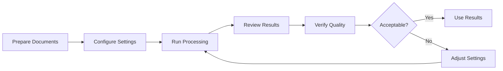

# User Guide

## Introduction

Welcome to the Solera POC Document Processing System User Guide. This guide will help you set up, configure, and operate the document processing pipeline to extract OEM parts codes from automotive repair estimates, invoices, and insurance claim documents.

### Who Should Use This Guide

- **Claims Processors:** Processing insurance claims and repair estimates
- **Data Entry Operators:** Validating and entering parts information
- **QA Analysts:** Reviewing extraction quality and accuracy
- **IT Administrators:** Setting up and maintaining the system
- **Business Analysts:** Understanding processing capabilities and results

### What You Will Learn

1. How to install and configure the system
2. How to process documents through the pipeline
3. How to interpret and use the results
4. How to troubleshoot common issues
5. Best practices for optimal performance

## Getting Started

### System Requirements

#### Minimum Requirements
- **Operating System:** Windows 10/11, macOS 10.14+, Ubuntu 18.04+
- **CPU:** 4 cores, 2.5 GHz or faster
- **RAM:** 8 GB
- **Storage:** 10 GB free space (for software, models, and temporary files)
- **Python:** Version 3.8 or higher
- **Internet:** Required for initial model download

#### Recommended Requirements
- **Operating System:** Ubuntu 20.04+ or Windows 11
- **CPU:** 8+ cores, 3.0+ GHz
- **RAM:** 16 GB or more
- **Storage:** 50 GB SSD
- **GPU:** NVIDIA GPU with 6+ GB VRAM (GTX 1660 or better)
- **Python:** Version 3.10 or higher

### Installation

#### Step 1: Install Python

**Windows:**
1. Download Python from [python.org](https://www.python.org/downloads/)
2. Run installer, ensure "Add Python to PATH" is checked
3. Verify installation:
   ```cmd
   python --version
   ```

**macOS:**
```bash
# Using Homebrew
brew install python@3.10

# Verify installation
python3 --version
```

**Linux (Ubuntu):**
```bash
# Update package list
sudo apt update

# Install Python
sudo apt install python3.10 python3-pip

# Verify installation
python3 --version
```

#### Step 2: Install System Dependencies

**Ubuntu/Debian:**
```bash
# Install system libraries for OpenCV and PDF processing
sudo apt install -y \
    libgl1-mesa-glx \
    libglib2.0-0 \
    libsm6 \
    libxext6 \
    libxrender-dev \
    libgomp1

# Install Tesseract OCR (optional, for reference)
sudo apt install -y tesseract-ocr
```

**macOS:**
```bash
# Install system libraries
brew install opencv
```

**Windows:**
- No additional system dependencies required (included in Python packages)

#### Step 3: Install Python Dependencies

Navigate to the project directory:
```bash
cd /path/to/solera_poc
```

Install required packages:
```bash
pip install -r requirements.txt
```

**Expected Installation Time:** 5-10 minutes (depending on internet speed)

**Installation Output:**
```
Installing collected packages:
  - pyyaml (6.0.2)
  - pymupdf (1.24.14)
  - pandas (2.2.3)
  - pillow (11.0.0)
  - opencv-python (4.10.0.84)
  - huggingface-hub (0.26.2)
  - imgutils (0.1.2)
  - dghs-imgutils (0.7.0)
  - onnxruntime (1.20.1)
Successfully installed 9 packages
```

#### Step 4: Download OCR Models

On first run, EasyOCR will automatically download required models (~100 MB):

```bash
# Test installation and trigger model download
python -c "import easyocr; reader = easyocr.Reader(['en'])"
```

**Model Download Location:**
- Linux/macOS: `~/.EasyOCR/model/`
- Windows: `C:\Users\<username>\.EasyOCR\model\`

#### Step 5: Verify Installation

Create a test script to verify all components:

```python
# test_installation.py
import yaml
import fitz  # PyMuPDF
import pandas as pd
from PIL import Image
import cv2
from huggingface_hub import hf_hub_download
import onnxruntime

print("All packages imported successfully!")
print(f"PyMuPDF version: {fitz.version}")
print(f"OpenCV version: {cv2.__version__}")
print(f"ONNX Runtime version: {onnxruntime.__version__}")
```

Run the test:
```bash
python test_installation.py
```

**Expected Output:**
```
All packages imported successfully!
PyMuPDF version: ('1.24.14', '1.24.14', '20240820000000')
OpenCV version: 4.10.0
ONNX Runtime version: 1.20.1
```

### Project Structure Overview

```
solera_poc/
├── config.yaml              # Configuration file (YOU WILL EDIT THIS)
├── main.py                  # Main entry point (RUN THIS)
├── requirements.txt         # Python dependencies
│
├── pipelines/               # Processing pipelines (DO NOT EDIT)
│   ├── pipeline.py         # Main orchestration
│   ├── text_pipe.py        # Text extraction
│   └── ocr_pipe.py         # OCR processing
│
├── utils/                   # Utility modules (DO NOT EDIT)
│   ├── config_reader.py    # Configuration loader
│   ├── helper.py           # Helper functions
│   └── log_writer.py       # Logging system
│
├── data/                    # Reference data (READ-ONLY)
│   └── Solera_Dataset.xlsx # OEM parts database (1.5M+ codes)
│
├── documentation/           # This documentation
│
├── logs/                    # Processing logs (AUTO-GENERATED)
│   └── DD-MM-YY/
│       └── HH.log
│
├── output/                  # Processed results (AUTO-GENERATED)
│   ├── text_*.pdf
│   ├── ocr_*.pdf
│   └── results/
│
└── temp/                    # Temporary files (AUTO-CLEANED)
```

## Configuration

### Understanding config.yaml

The `config.yaml` file controls all processing parameters. Here's a detailed breakdown:

```yaml
paths:
  # Directory containing input PDF files to process
  SOURCE_PATH: "/path/to/your/documents"

  # Directory where processed files will be saved
  OUTPUT_PATH: "output"

dataset:
  # Path to Solera OEM parts database (Excel file)
  LEGEND_DATA: "data/Solera_Dataset.xlsx"

pipeline:
  # Document Classification
  # Threshold for detecting English text (0.0-1.0)
  # 0.1 = allow 10% non-English characters
  english_treshold: 0.1

  # Text Pipeline Settings (for text-based PDFs)
  text_prefix: "text_"                 # Prefix for output filenames
  font_name: "helv"                    # Font for annotations (Helvetica)
  color: [0.0, 0.0, 1.0]              # Annotation color (RGB: Blue)

  # OCR Pipeline Settings (for scanned documents)
  model_name: "dbnetpp_resnet50_fpnc_1200e_icdar2015"  # Text detection model
  model_threshold: 0.5                 # Detection confidence (0.0-1.0)
  image_dpi: 450                       # PDF rendering resolution
  temp_folder_name: "temp"             # Temporary storage directory

  # EasyOCR Settings
  language: "en"                       # OCR language code
  gpu_status: True                     # Use GPU if available (True/False)

  # OCR Output Settings
  ocr_prefix: "ocr_"                   # Prefix for output filenames
  ocr_color: [0, 0, 225]              # Annotation color (BGR: Blue)
```

### Configuration Examples

#### Example 1: Basic Setup for Single Directory

```yaml
paths:
  SOURCE_PATH: "/home/user/documents/repair_estimates"
  OUTPUT_PATH: "output"

dataset:
  LEGEND_DATA: "data/Solera_Dataset.xlsx"

pipeline:
  english_treshold: 0.1
  text_prefix: "text_"
  font_name: "helv"
  color: [0.0, 0.0, 1.0]
  model_name: "dbnetpp_resnet50_fpnc_1200e_icdar2015"
  model_threshold: 0.5
  image_dpi: 450
  temp_folder_name: "temp"
  language: "en"
  gpu_status: False  # No GPU available
  ocr_prefix: "ocr_"
  ocr_color: [0, 0, 225]
```

#### Example 2: High-Quality OCR (Slower, More Accurate)

```yaml
pipeline:
  model_threshold: 0.3        # Lower threshold = detect more text regions
  image_dpi: 600              # Higher resolution = better accuracy
  gpu_status: True            # Enable GPU for faster processing
```

#### Example 3: Fast Processing (Lower Quality)

```yaml
pipeline:
  model_threshold: 0.7        # Higher threshold = fewer regions, faster
  image_dpi: 300              # Standard resolution
  gpu_status: True            # GPU helps speed even at lower DPI
```

#### Example 4: Network Drive Setup (Windows)

```yaml
paths:
  SOURCE_PATH: "\\\\server\\shared\\claims\\incoming"
  OUTPUT_PATH: "\\\\server\\shared\\claims\\processed"
```

#### Example 5: Different Annotation Colors

```yaml
pipeline:
  # Red annotations for text pipeline
  color: [1.0, 0.0, 0.0]      # RGB: Red

  # Green annotations for OCR pipeline
  ocr_color: [0, 255, 0]      # BGR: Green
```

### Tuning Parameters for Different Use Cases

#### For High-Quality Scanned Documents
```yaml
pipeline:
  model_threshold: 0.5
  image_dpi: 450
```

#### For Poor-Quality Faxes or Photocopies
```yaml
pipeline:
  model_threshold: 0.3        # Detect fainter text
  image_dpi: 600              # Higher resolution helps
```

#### For Batch Processing (Speed Priority)
```yaml
pipeline:
  model_threshold: 0.6        # Fewer regions to process
  image_dpi: 300              # Faster rendering
  gpu_status: True            # Essential for speed
```

#### For Mixed Language Documents (Future Enhancement)
```yaml
pipeline:
  language: "en"              # Currently only English supported
  # Future: language: ["en", "es", "fr"]
```

## Processing Documents

### Basic Workflow



### Step-by-Step Processing Guide

#### Step 1: Prepare Your Documents

**Organize Input Files:**
```
/path/to/documents/
├── estimate_001.pdf
├── estimate_002.pdf
├── invoice_2024_001.pdf
├── claim_form_042.pdf
└── subdirectory/
    └── estimate_003.pdf
```

**Document Preparation Checklist:**
- [ ] All files are in PDF format
- [ ] Files are not password-protected
- [ ] Files are not corrupted (can be opened)
- [ ] File sizes are reasonable (<100 MB each)
- [ ] File names are meaningful (helps identify results)

**Best Practices:**
- Remove password protection before processing
- Ensure documents are right-side up (not rotated)
- Separate color and black-and-white documents if needed
- Backup originals before processing

#### Step 2: Configure the Pipeline

Edit `config.yaml`:

```bash
# Linux/macOS
nano config.yaml

# Windows
notepad config.yaml

# Or use any text editor
code config.yaml  # VS Code
```

Update the `SOURCE_PATH`:
```yaml
paths:
  SOURCE_PATH: "/home/user/documents/repair_estimates"
```

**Important:**
- Use **absolute paths** (full path from root)
- Windows: Use forward slashes `/` or double backslashes `\\\\`
  - Good: `C:/Documents/estimates`
  - Good: `C:\\\\Documents\\\\estimates`
  - Bad: `C:\Documents\estimates` (single backslash)

#### Step 3: Run the Processing Pipeline

**Navigate to project directory:**
```bash
cd /path/to/solera_poc
```

**Run the main script:**
```bash
python main.py
```

**Expected Console Output:**
```
2024-12-20 09:15:23 - INFO - Starting document processing pipeline
2024-12-20 09:15:23 - INFO - Found 5 PDF files to process
2024-12-20 09:15:23 - INFO - Loading Solera dataset: 1,547,923 OEM codes
2024-12-20 09:15:24 - INFO - Processing estimate_001.pdf
2024-12-20 09:15:24 - INFO - Text is in English. Proceeding with text-based processing.
2024-12-20 09:15:27 - INFO - Extracted 47 OEM codes
2024-12-20 09:15:28 - INFO - Matched 45 codes to Solera database (95.7%)
2024-12-20 09:15:29 - INFO - Generated annotated PDF: text_estimate_001.pdf
2024-12-20 09:15:29 - INFO - Done
2024-12-20 09:15:30 - INFO - Processing invoice_2024_001.pdf
2024-12-20 09:15:31 - INFO - Text is not in English or empty. Switching to OCR pipeline.
2024-12-20 09:15:32 - INFO - Rendering pages at 450 DPI...
2024-12-20 09:15:45 - INFO - Detected 128 text regions
2024-12-20 09:15:46 - INFO - Running OCR on cropped regions...
2024-12-20 09:16:30 - INFO - Recognized 124 text instances
2024-12-20 09:16:31 - INFO - Matched 52 OEM codes (41.9%)
2024-12-20 09:16:32 - INFO - Generated annotated PDF: ocr_invoice_2024_001.pdf
2024-12-20 09:16:32 - INFO - Cleaning up temporary files
2024-12-20 09:16:32 - INFO - Processing complete
```

**Processing Time Estimates:**

| Document Type | Pages | Pipeline | Time per Page | Total Time |
|--------------|-------|----------|---------------|-----------|
| Text-based PDF | 1 | Text | 5-10 sec | 5-10 sec |
| Text-based PDF | 5 | Text | 5-10 sec | 25-50 sec |
| Scanned PDF | 1 | OCR | 30-60 sec | 30-60 sec |
| Scanned PDF | 5 | OCR | 30-60 sec | 2.5-5 min |

**Progress Monitoring:**

While processing, you can monitor progress:

```bash
# In a separate terminal, watch the log file
tail -f logs/$(date +%d-%m-%y)/$(date +%H).log
```

#### Step 4: Monitor Processing

**Real-time Log Monitoring:**

```bash
# Linux/macOS
tail -f logs/20-12-24/09.log

# Windows (PowerShell)
Get-Content logs\20-12-24\09.log -Wait
```

**Log File Location:**
```
logs/
├── 20-12-24/          # Date: DD-MM-YY
│   ├── 09.log        # Hour: 09:00-09:59
│   ├── 10.log        # Hour: 10:00-10:59
│   └── 11.log        # Hour: 11:00-11:59
└── 21-12-24/
    └── 09.log
```

**Understanding Log Messages:**

| Level | Example | Meaning |
|-------|---------|---------|
| **INFO** | `Processing estimate_001.pdf` | Normal operation |
| **WARNING** | `2 codes flagged for manual review` | Attention needed |
| **ERROR** | `Unable to open PDF: file is corrupted` | Processing failed |

**Common Log Patterns:**

**Successful Text Processing:**
```
INFO - Text is in English. Proceeding with text-based processing.
INFO - Extracted 47 OEM codes
INFO - Done
```

**Successful OCR Processing:**
```
INFO - Text is not in English or empty. Switching to OCR pipeline.
INFO - Detected 128 text regions
INFO - Recognized 124 text instances
INFO - Cleaning up temporary files
```

**Errors:**
```
ERROR - Unable to open PDF | <class 'fitz.FileDataError'> | pipeline.py | 38
```

### Interpreting Results

#### Output Files

After processing, you'll find results in the `output/` directory:

```
output/
├── text_estimate_001.pdf          # Annotated PDF (text pipeline)
├── ocr_invoice_2024_001.pdf      # Annotated PDF (OCR pipeline)
└── results/                       # (if configured)
    ├── estimate_001_results.xlsx
    └── invoice_2024_001_results.xlsx
```

#### Annotated PDF Files

**File Naming Convention:**
- **text_\*.pdf:** Processed via text extraction pipeline
- **ocr_\*.pdf:** Processed via OCR pipeline
- Original filename is preserved after the prefix

**Visual Annotations:**

**Text Pipeline (text_\*.pdf):**
- Blue text boxes added to PDF
- Format: `OEM_CODE-SOLERA_CODE`
- Positioned to the left of original text
- Example: `A1234567-SOL-12345`


**OCR Pipeline (ocr_\*.pdf):**
- Blue text overlaid on rendered image
- Format: `OEM_CODE-SOLERA_CODE`
- Larger, bolder font for visibility
- Positioned above detected region

**Reading Annotations:**
```
Format: OEM_CODE-SOLERA_CODE

Example: A1234567-SOL-12345
         ^^^^^^^^     ^^^^^^^
         |            |
         Original     Solera Standard
         OEM Code     Code
```

**What to Look For:**
- All part codes should have annotations
- Annotations should be near original text
- Format should be consistent
- Blue color indicates processing success

**Quality Indicators:**

**High Quality Results:**
- All expected codes are annotated
- Annotations align with original text
- Consistent formatting throughout
- No obvious OCR errors in codes

**Potential Issues:**
- Missing annotations (codes not in database)
- Misaligned annotations (coordinate errors)
- Garbled text in annotations (OCR errors)
- Duplicate annotations (same code detected twice)

#### Excel/CSV Export (Optional)

If configured, structured data exports contain:

**Columns:**
- **Source File:** Original PDF filename
- **Page:** Page number (0-indexed)
- **OEM Code:** Extracted manufacturer code
- **Solera Code:** Matched Solera standard code
- **Description:** Part description from database
- **Bounding Box:** Coordinates `(x0, y0, x1, y1)`
- **Confidence:** Extraction confidence (0-100%)
- **Validation Status:** VALIDATED or UNKNOWN
- **Pipeline:** text or ocr
- **Processed At:** Timestamp

**Sample Data:**
```csv
Source File,Page,OEM Code,Solera Code,Description,Bounding Box,Confidence,Validation Status,Pipeline,Processed At
estimate_001.pdf,0,A1234567,SOL-12345,Front Bumper Assembly,"(450, 1200, 700, 1280)",95%,VALIDATED,text,2024-12-20 09:15:23
estimate_001.pdf,0,B9876543,SOL-98765,Headlight Assy Left,"(450, 1350, 630, 1410)",87%,VALIDATED,text,2024-12-20 09:15:23
estimate_001.pdf,1,XYZ123,,,"(250, 800, 400, 850)",65%,UNKNOWN,text,2024-12-20 09:15:24
```

**Using the Data:**
1. **Sort by Confidence:** Identify low-confidence extractions for review
2. **Filter by Status:** Focus on UNKNOWN codes needing validation
3. **Group by Document:** Analyze per-document statistics
4. **Export to Database:** Import into claims management system

## Troubleshooting

### Common Issues and Solutions

#### Issue 1: "Config file not found"

**Error Message:**
```
Exception: Config file not found...
```

**Cause:** Running the script from the wrong directory

**Solution:**
```bash
# Navigate to the project directory
cd /path/to/solera_poc

# Verify config.yaml exists
ls config.yaml

# Run from the correct directory
python main.py
```

---

#### Issue 2: "No such file or directory: SOURCE_PATH"

**Error Message:**
```
FileNotFoundError: [Errno 2] No such file or directory: '/path/to/documents'
```

**Cause:** Incorrect SOURCE_PATH in config.yaml

**Solution:**
1. Verify the path exists:
   ```bash
   ls /path/to/documents
   ```

2. Update config.yaml with correct path:
   ```yaml
   paths:
     SOURCE_PATH: "/correct/path/to/documents"
   ```

3. Use absolute paths, not relative paths

---

#### Issue 3: No Documents Processed

**Symptoms:** Pipeline runs but no output files created

**Possible Causes:**

**A. No PDF files in SOURCE_PATH**
```bash
# Check for PDF files
find /path/to/documents -name "*.pdf"
```

**Solution:** Ensure SOURCE_PATH contains PDF files

**B. All PDFs are corrupted or password-protected**
```bash
# Test opening a PDF manually
python -c "import fitz; fitz.open('document.pdf')"
```

**Solution:** Remove password protection, fix corrupted files

---

#### Issue 4: OCR Not Working / Slow Performance

**Symptoms:**
- OCR pipeline takes very long (>5 min per page)
- Low accuracy on scanned documents
- GPU not being utilized

**Solutions:**

**A. Enable GPU Acceleration:**
```yaml
pipeline:
  gpu_status: True
```

**Verify GPU is detected:**
```python
python -c "import torch; print(torch.cuda.is_available())"
# Should print: True
```

**B. Install GPU-enabled ONNX Runtime:**
```bash
pip uninstall onnxruntime
pip install onnxruntime-gpu
```

**C. Reduce DPI for Faster Processing:**
```yaml
pipeline:
  image_dpi: 300  # Instead of 450
```

**D. Increase Threshold to Reduce Regions:**
```yaml
pipeline:
  model_threshold: 0.7  # Instead of 0.5
```

---

#### Issue 5: Low Match Rate (Many UNKNOWN Codes)

**Symptoms:** Many extracted codes not found in Solera database

**Possible Causes:**

**A. OCR Recognition Errors**
- O vs 0 (letter O vs zero)
- l vs 1 (lowercase L vs one)
- S vs 5, B vs 8, etc.

**Solution:** Manual review and correction (future: fuzzy matching)

**B. Codes Not in Database**
- New parts not yet cataloged
- Manufacturer-specific codes

**Solution:** Update Solera_Dataset.xlsx with new codes

**C. Format Issues**
- Extra spaces, hyphens
- Case sensitivity

**Solution:** Preprocessing (already handled, but verify)

**Verification Steps:**
```python
# Check if code exists in database manually
import pandas as pd
df = pd.read_excel("data/Solera_Dataset.xlsx")
code = "A1234567"
matches = df[df["OEM_CODE"].str.contains(code, case=False, na=False)]
print(matches)
```

---

#### Issue 6: Out of Memory Errors

**Error Message:**
```
MemoryError: Unable to allocate array
```

**Cause:** Processing large PDFs at high DPI

**Solutions:**

**A. Reduce DPI:**
```yaml
pipeline:
  image_dpi: 300  # Lower than 450
```

**B. Process Fewer Documents at Once:**
- Move some PDFs out of SOURCE_PATH temporarily
- Process in smaller batches

**C. Increase System RAM:**
- Close other applications
- Use system with more RAM (16+ GB)

**D. Enable Temporary File Cleanup:**
- Already automatic, but verify temp/ is empty between runs

---

#### Issue 7: Annotation Colors Not Visible

**Symptoms:** Annotations blend with document background

**Solution:** Change annotation color in config.yaml

**Dark backgrounds:**
```yaml
pipeline:
  color: [1.0, 1.0, 1.0]      # White (RGB)
  ocr_color: [255, 255, 255]  # White (BGR)
```

**Light backgrounds:**
```yaml
pipeline:
  color: [1.0, 0.0, 0.0]      # Red (RGB)
  ocr_color: [0, 0, 255]      # Red (BGR)
```

**High contrast:**
```yaml
pipeline:
  color: [1.0, 1.0, 0.0]      # Yellow (RGB)
  ocr_color: [0, 255, 255]    # Yellow (BGR)
```

---

#### Issue 8: Permission Denied Errors

**Error Message:**
```
PermissionError: [Errno 13] Permission denied: '/path/to/output'
```

**Causes & Solutions:**

**A. Output directory is read-only**
```bash
# Linux/macOS: Grant write permissions
chmod +w output/

# Windows: Right-click → Properties → Uncheck "Read-only"
```

**B. File is open in another program**
- Close PDF viewer
- Close Excel if data file is open
- Try again

**C. Network drive permissions**
- Ensure write access to network location
- Use local OUTPUT_PATH for testing

---

#### Issue 9: Model Download Fails

**Error Message:**
```
HfHubHTTPError: 503 Service Unavailable
```

**Cause:** Hugging Face Hub unavailable or network issues

**Solutions:**

**A. Retry Later:**
- Hugging Face may be temporarily down
- Wait and try again

**B. Manual Download:**
```bash
# Download model manually
wget https://huggingface.co/deepghs/text_detection/resolve/main/dbnetpp_resnet50_fpnc_1200e_icdar2015/end2end.onnx

# Place in cache directory
mkdir -p ~/.cache/huggingface/hub/models--deepghs--text_detection/
mv end2end.onnx ~/.cache/huggingface/hub/models--deepghs--text_detection/
```

**C. Check Network:**
```bash
# Test connection to Hugging Face
ping huggingface.co
```

---

#### Issue 10: Wrong Document Classification

**Symptoms:**
- Text-based PDF processed via OCR (slow, unnecessary)
- Scanned PDF processed via text extraction (no results)

**Diagnosis:**
Check log for classification decision:
```
INFO - Text is in English. Proceeding with text-based processing.
# or
INFO - Text is not in English or empty. Switching to OCR pipeline.
```

**Solution A: Adjust English Threshold**

If too many text PDFs go to OCR:
```yaml
pipeline:
  english_treshold: 0.15  # Allow 15% non-English (more lenient)
```

If scanned PDFs go to text pipeline:
```yaml
pipeline:
  english_treshold: 0.05  # Only 5% non-English allowed (stricter)
```

**Solution B: Manual Classification Override (Future Enhancement)**
- Currently automatic only
- Future: Allow manual pipeline selection

---

### Getting Help

#### Check Logs

Always check the log file first:
```bash
# Find today's log
ls logs/$(date +%d-%m-%y)/

# View full log
cat logs/20-12-24/09.log

# Search for errors
grep ERROR logs/20-12-24/09.log
```

#### Enable Debug Mode

For more detailed logging (future enhancement):
```python
# In utils/log_writer.py, change:
level=logging.DEBUG  # Instead of logging.INFO
```

#### Collect Diagnostic Information

Before seeking help, collect:
1. Error message from log
2. Input document characteristics (size, type, quality)
3. config.yaml settings
4. System specifications (RAM, CPU, GPU)
5. Python and package versions

```bash
# Collect version info
python --version
pip list | grep -E "(pymupdf|opencv|pandas|onnxruntime|easyocr)"
```

## Best Practices

### Document Quality Guidelines

#### Optimal Document Characteristics

**For Fast Text Processing:**
- PDF with embedded text layer
- Standard fonts (Arial, Helvetica, Times)
- High-contrast black text on white background
- OCR-free (created from Word/Excel, not scanned)

**For Accurate OCR:**
- Minimum 300 DPI scan resolution (450 DPI recommended)
- Clean, uncrumpled source documents
- Good lighting (no shadows or glare)
- Straight scan (not rotated or skewed)

**Page Layout:**
- Clear margins (at least 0.5 inch)
- No handwritten annotations overlapping printed text
- Consistent font sizes (12pt or larger)
- Simple layouts (avoid complex tables/graphics)

#### Pre-Processing Recommendations

**Before Scanning:**
- Remove staples, paperclips
- Flatten creased documents
- Clean scanner glass
- Align documents straight on scanner bed

**Document Cleanup:**
- Remove blank pages
- Ensure proper page order
- Crop borders if excessive
- De-skew rotated scans

**Batch Organization:**
- Group by document type (estimates, invoices, claims)
- Group by quality level (high-quality text PDFs separate from scans)
- Use meaningful filenames (include date, claim number)

### Performance Optimization

#### Batch Processing Strategy

**Small Batches (1-10 documents):**
- Process directly in SOURCE_PATH
- Review each result individually
- Good for testing and quality assurance

**Medium Batches (10-100 documents):**
- Group by type (text vs. scanned)
- Process text documents first (faster)
- Monitor logs for errors
- Spot-check results (sample 10%)

**Large Batches (100+ documents):**
- Process in sub-batches of 50-100
- Run overnight or during off-hours
- Use GPU acceleration (essential)
- Implement quality monitoring scripts

**Parallel Processing (Future Enhancement):**
- Currently single-threaded
- Future: Process multiple documents simultaneously

#### Hardware Recommendations

**CPU Processing (No GPU):**
- Suitable for: Text-based PDFs, small batches
- Expected speed: 5-10 sec/page (text), 2-3 min/page (OCR)
- Recommended for: <50 pages/day

**GPU Processing:**
- Suitable for: Scanned PDFs, large batches
- Expected speed: 5-10 sec/page (text), 30-60 sec/page (OCR)
- Recommended for: 100+ pages/day

**Cloud/Server Deployment:**
- Use NVIDIA Tesla T4 or better
- Enable batch processing mode
- Implement queue management
- Monitor resource usage

### Quality Assurance Workflow

#### Three-Tier Review Process

**Tier 1: Automatic Validation**
- All codes validated against database
- High confidence (≥90%) → Auto-approve
- Medium confidence (70-90%) → Spot-check
- Low confidence (<70%) → Full review

**Tier 2: Spot-Check Review**
- Sample 10% of medium confidence results
- Verify annotations match original documents
- Check for OCR errors (O→0, l→1, etc.)
- Validate Solera code mappings

**Tier 3: Full Manual Review**
- All low confidence results
- All UNKNOWN codes
- Documents with unusual layouts
- High-value or complex claims

#### Quality Metrics to Monitor

**Extraction Metrics:**
- Codes extracted per document (avg)
- Match rate (validated / total extracted)
- Confidence distribution
- Processing time per document

**Error Metrics:**
- OCR recognition errors (false positives/negatives)
- Database match failures
- Classification errors (text vs. OCR)
- System errors (crashes, timeouts)

**Sample Quality Report:**
```
Date: 2024-12-20
Documents Processed: 47
Total Pages: 183

Pipeline Distribution:
- Text Pipeline: 32 documents (68%)
- OCR Pipeline: 15 documents (32%)

Extraction Results:
- Total Codes Extracted: 2,341
- Validated Codes: 2,187 (93.4%)
- Unknown Codes: 154 (6.6%)

Confidence Distribution:
- High (≥90%): 1,876 (80.1%)
- Medium (70-90%): 312 (13.3%)
- Low (<70%): 153 (6.5%)

Processing Time:
- Average: 42 seconds/document
- Text Pipeline Avg: 12 seconds/document
- OCR Pipeline Avg: 127 seconds/document

Quality Flags:
- 3 documents failed to process (corrupted)
- 12 documents flagged for manual review
- 154 unknown codes identified
```

### Security and Compliance

#### Data Handling

**Input Documents:**
- Store originals in secure location
- Maintain access logs
- Encrypt sensitive documents
- Implement retention policies

**Output Documents:**
- Restrict access to authorized users
- Do not store in public cloud without encryption
- Archive processed documents separately
- Maintain audit trail

**Logs:**
- Logs contain document filenames (no sensitive content)
- Retain logs per compliance requirements (typically 90 days)
- Secure log storage location
- Implement log rotation

#### Privacy Considerations

**Personal Information:**
- System does not extract personal information (names, addresses, etc.)
- Only extracts OEM part codes
- Annotated PDFs preserve original document content
- Implement data minimization (delete originals after processing if permitted)

**Compliance:**
- GDPR: Ensure proper consent for document processing
- HIPAA: N/A (automotive documents)
- SOC 2: Implement access controls and audit logging

### Maintenance

#### Regular Maintenance Tasks

**Daily:**
- Monitor log files for errors
- Check output directory for processing completion
- Verify disk space availability

**Weekly:**
- Review quality metrics
- Update Solera database (if new codes available)
- Clean up old log files (>90 days)
- Backup configuration and databases

**Monthly:**
- Update Python packages (test in dev first)
- Review and optimize configuration
- Analyze processing trends
- Capacity planning review

**Quarterly:**
- Full system backup
- Disaster recovery testing
- Security audit
- Performance benchmark

#### Database Updates

**Updating Solera Dataset:**

1. Receive updated Excel file from Solera
2. Backup existing database:
   ```bash
   cp data/Solera_Dataset.xlsx data/Solera_Dataset_backup_$(date +%Y%m%d).xlsx
   ```
3. Replace with new file:
   ```bash
   cp /path/to/new/Solera_Dataset.xlsx data/Solera_Dataset.xlsx
   ```
4. Test processing:
   ```bash
   python main.py
   ```
5. Verify new codes are matched

**Database Schema Validation:**
Ensure new database has required columns:
- OEM_CODE
- Code (Solera standard code)
- Description

```python
# Verify schema
import pandas as pd
df = pd.read_excel("data/Solera_Dataset.xlsx")
print(df.columns)
# Should include: ['OEM_CODE', 'Code', 'Description', ...]
```

## Advanced Usage

### Customizing Output Formats

#### Change Annotation Appearance

**Font Size (Text Pipeline):**
```python
# Edit text_pipe.py, line ~122
page.insert_textbox(
    ...,
    fontsize=16,  # Increase from 12
    ...
)
```

**Font Size (OCR Pipeline):**
```python
# Edit ocr_pipe.py, line ~269
cv2.putText(
    ...,
    3,  # Increase from 2 (font scale)
    ...
)
```

#### Export to Custom Formats

**JSON Export:**
```python
# After processing, in pipeline.py
import json

json_output = final_df.to_json(orient="records", indent=2)
with open("output/results.json", "w") as f:
    f.write(json_output)
```

**Database Export:**
```python
# Export to SQLite
import sqlite3

conn = sqlite3.connect("output/results.db")
final_df.to_sql("extracted_codes", conn, if_exists="replace", index=False)
conn.close()
```

### Integration Examples

#### REST API Integration (Future)

Conceptual API design:

```python
# api.py (future enhancement)
from flask import Flask, request, jsonify
from pipelines.pipeline import MainPipeline

app = Flask(__name__)

@app.route("/process", methods=["POST"])
def process_document():
    file = request.files["document"]
    file.save("/tmp/temp_document.pdf")

    # Process
    pipeline = MainPipeline()
    results = pipeline.process_single_file("/tmp/temp_document.pdf")

    return jsonify(results)
```

#### Scheduled Batch Processing

**Using Cron (Linux/macOS):**
```bash
# Edit crontab
crontab -e

# Add entry to run daily at 2 AM
0 2 * * * cd /path/to/solera_poc && python main.py >> logs/cron.log 2>&1
```

**Using Windows Task Scheduler:**
1. Open Task Scheduler
2. Create Basic Task
3. Trigger: Daily at 2:00 AM
4. Action: Start a program
   - Program: `C:\Python310\python.exe`
   - Arguments: `main.py`
   - Start in: `C:\path\to\solera_poc`

#### Webhook Notifications

Add notification on completion:

```python
# At end of pipeline.py
import requests

def send_notification(status, document_count, errors):
    webhook_url = "https://your-webhook-url.com/notify"
    payload = {
        "status": status,
        "documents_processed": document_count,
        "errors": errors,
        "timestamp": datetime.now().isoformat()
    }
    requests.post(webhook_url, json=payload)

# Call after processing
send_notification("completed", len(pdf_files), error_count)
```

## Frequently Asked Questions

### General Questions

**Q: What types of documents can be processed?**
A: PDF documents containing OEM automotive parts codes. Both text-based PDFs (created digitally) and scanned/image PDFs are supported.

**Q: How accurate is the extraction?**
A: Text-based PDFs: 99%+ accuracy. Scanned PDFs: 95-98% accuracy (depends on scan quality).

**Q: How long does processing take?**
A: Text-based PDFs: 5-10 seconds per page. Scanned PDFs: 30-60 seconds per page (with GPU).

**Q: Can I process password-protected PDFs?**
A: No, remove password protection before processing.

**Q: What languages are supported?**
A: Currently English only. Multi-language support is planned for future releases.

**Q: How many documents can be processed at once?**
A: No hard limit, but recommended batch size is 50-100 documents for manageability.

### Technical Questions

**Q: Do I need a GPU?**
A: Not required, but highly recommended for OCR processing (10x faster).

**Q: What GPU is recommended?**
A: NVIDIA GPU with 6+ GB VRAM (GTX 1660 or better). AMD GPUs not currently supported.

**Q: Can I run this on a server without a GUI?**
A: Yes, the system is command-line based and works on headless servers.

**Q: How much disk space is needed?**
A: Minimum 10 GB (software + models + temporary files). Plan for 50-100 GB for large batches.

**Q: Can I process documents in parallel?**
A: Not currently supported. Future enhancement planned.

### Troubleshooting Questions

**Q: Why are some codes not matched?**
A: Codes may not exist in the Solera database, or OCR may have recognition errors (O→0, l→1, etc.).

**Q: Why is OCR slow?**
A: Enable GPU acceleration (`gpu_status: True`) or reduce DPI (`image_dpi: 300`).

**Q: Why are annotations not visible?**
A: Change annotation color in config.yaml to contrast with document background.

**Q: What do I do with UNKNOWN codes?**
A: Review manually, check for OCR errors, and add valid codes to the Solera database.

**Q: Can I reprocess documents?**
A: Yes, reprocessing is safe. Output files will be overwritten.

## Conclusion

This user guide has covered installation, configuration, document processing, troubleshooting, and best practices for the Solera POC document processing system. For additional assistance, consult the other documentation files:

- **01_Business_Use_Case_and_Objectives.md:** Business context and goals
- **02_Technical_Architecture.md:** System design and components
- **03_Functional_Architecture.md:** Processing workflows and logic
- **05_Business_Value.md:** ROI and benefits analysis

For technical support or feature requests, contact your system administrator or development team.

---

**Document Version:** 1.0
**Last Updated:** December 20, 2024
**Solera POC Version:** 1.0
