# Technical Architecture
## Crop Insight Tagger - Agricultural Field Inspection Taxonomy System

---

## Table of Contents

1. [System Overview](#system-overview)
2. [Architecture Patterns](#architecture-patterns)
3. [Component Architecture](#component-architecture)
4. [Data Architecture](#data-architecture)
5. [Technology Stack](#technology-stack)
6. [Integration Architecture](#integration-architecture)
7. [Security Architecture](#security-architecture)
8. [Deployment Architecture](#deployment-architecture)
9. [Performance and Scalability](#performance-and-scalability)
10. [Monitoring and Observability](#monitoring-and-observability)

---

## System Overview

The Crop Insight Tagger is a web-based application built using Streamlit that leverages Large Language Models (LLMs) to extract structured agricultural taxonomies from unstructured field inspection reports. The system processes natural language descriptions of field conditions and outputs standardized JSON data across 15 agricultural categories.

### High-Level Architecture

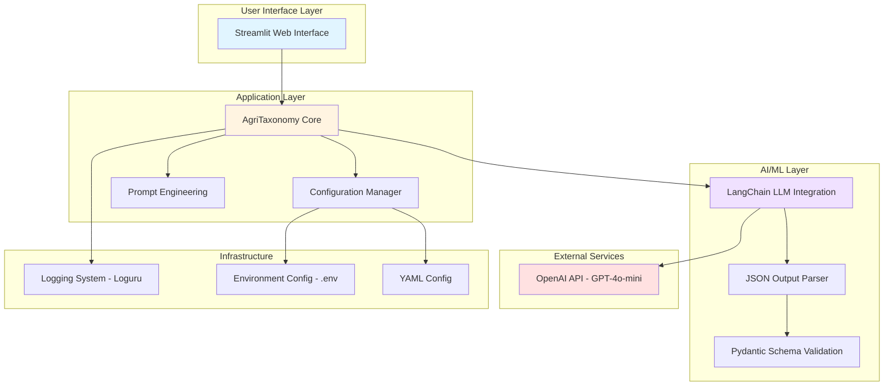

### System Characteristics

- **Type**: Web-based AI application
- **Deployment Model**: Single-instance Streamlit application
- **Processing Mode**: Synchronous, on-demand
- **Data Flow**: Stateless request-response pattern
- **Architecture Style**: Layered architecture with separation of concerns

---

## Architecture Patterns

### 1. Layered Architecture

The system follows a traditional layered architecture pattern:

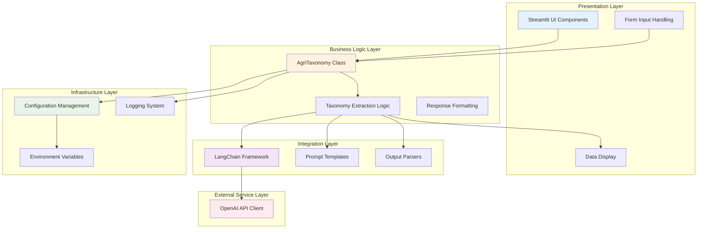

**Benefits**:
- Clear separation of concerns
- Easy to test individual layers
- Flexibility to replace components
- Maintainable codebase

### 2. Chain-of-Responsibility Pattern

The LangChain framework implements a pipeline pattern for LLM processing:

```
Prompt Template → LLM Model → JSON Parser → Pydantic Validator → Structured Output
```

### 3. Dependency Injection

Configuration and logging capabilities are injected through inheritance:

```python
AgriTaxonomy → ConfigLoader → CustomLogger
```

---

## Component Architecture

### Core Components

#### 1. User Interface Component (Streamlit)

**File**: `app.py` (lines 115-128)

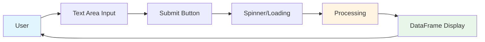

**Responsibilities**:
- Render web interface
- Capture user input (field inspection text)
- Display processing status
- Present structured results in tabular format

**Key Features**:
- Wide layout for better data visualization
- Form-based input with validation
- Loading spinner for user feedback
- DataFrame display for structured output

**Code Structure**:
```python
def render_ui(self):
    st.title("Crop Insight Tagger (Agri)")
    with st.form("form"):
        txt = st.text_area("Please input the field/crop details")
        btn = st.form_submit_button("Submit")

    if btn and txt:
        with st.spinner("Please Wait..."):
            st.dataframe(self.get_agri_taxonomy(txt), use_container_width=True)
```

#### 2. Core Application Component (AgriTaxonomy)

**File**: `app.py` (lines 76-113)

**Responsibilities**:
- Initialize LLM connections
- Orchestrate taxonomy extraction process
- Format and present results
- Handle errors gracefully

**Initialization Flow**:

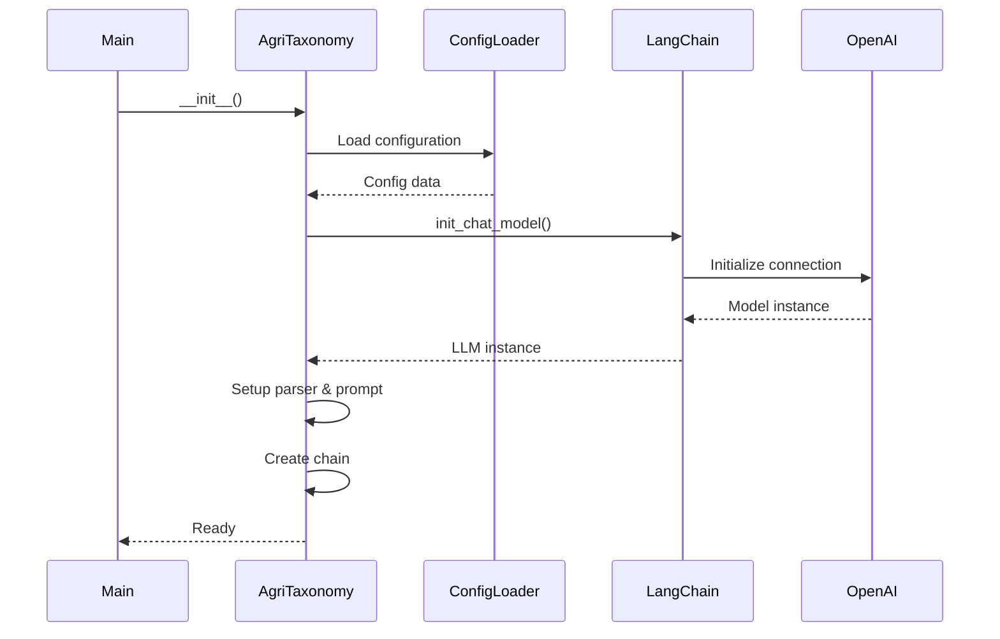

**Processing Flow**:

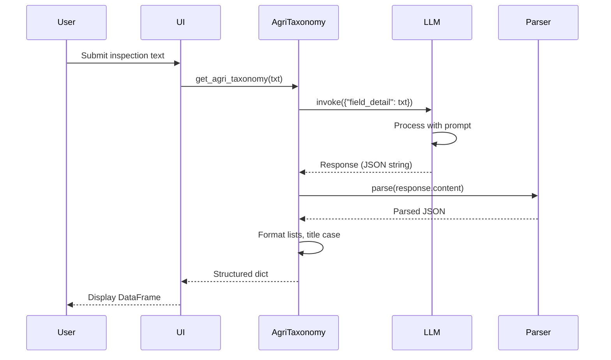

#### 3. Configuration Management Component

**File**: `config_reader.py`

**Responsibilities**:
- Load YAML configuration files
- Validate configuration exists
- Provide configuration data to application
- Handle configuration errors

**Configuration Flow**:

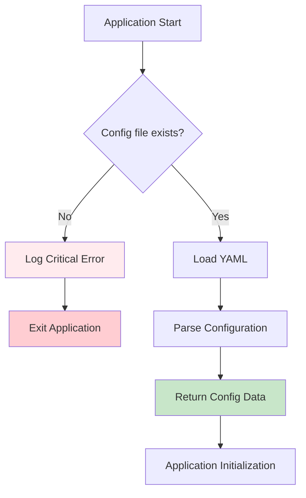

**Configuration Structure**:
```yaml
data_path: data
llm:
  model: gpt-4o-mini
  model_provider: openai
  temperature: 0
```

#### 4. Logging Component

**File**: `log_writer.py`

**Responsibilities**:
- Configure structured logging
- Separate INFO and ERROR logs
- Implement log rotation and retention
- Provide traceback analysis

**Logging Architecture**:

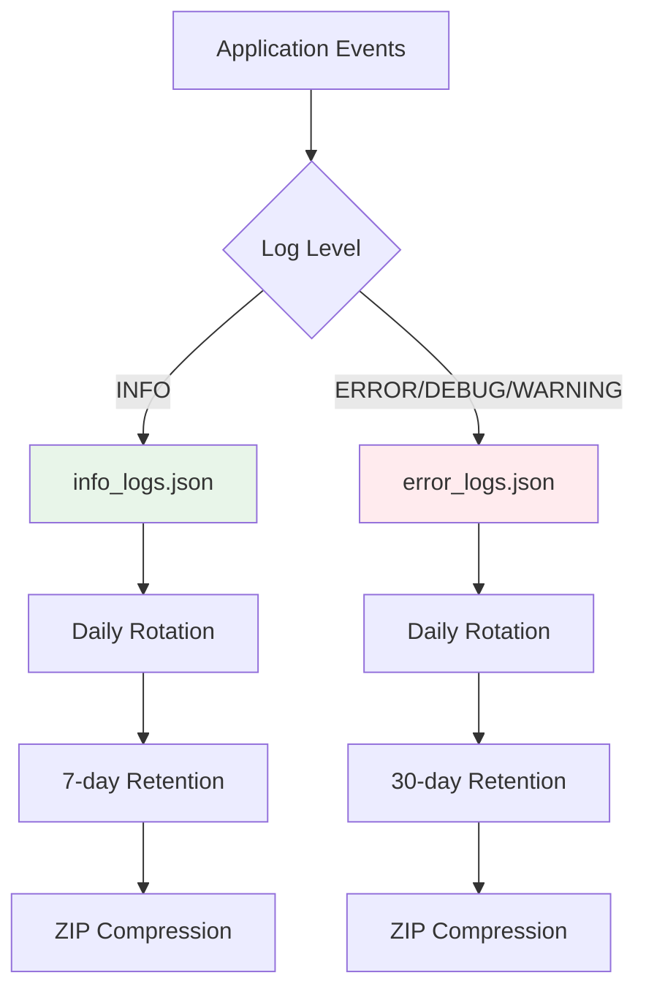

**Log Format**:
```json
{
  "time": "YYYY-MM-DD HH:mm:ss",
  "level": "INFO/ERROR/DEBUG",
  "message": "Log message",
  "name": "Logger name",
  "file": "Source file",
  "line": "Line number",
  "function": "Function name"
}
```

#### 5. Prompt Engineering Component

**File**: `prompt.py`

**Responsibilities**:
- Define LLM instruction templates
- Specify output format requirements
- Guide extraction behavior

**Prompt Structure**:

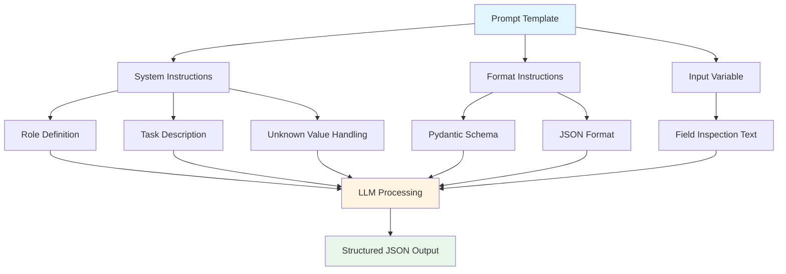

---

## Data Architecture

### Input Data Model

**Format**: Unstructured text (field inspection reports)

**Example**:
```
The maize field is at V6 growth stage with good plant height.
Soil appears slightly alkaline with good tilth. Some potassium
deficiency noted. Few armyworm larvae observed. Grey leaf spot
detected on lower leaves. Moderate broadleaf weed pressure.
MOP fertilizer was applied last week. Weather has been warm
and humid. Recommend potassium foliar spray and targeted
insecticide application.
```

### Output Data Model

**Format**: Structured JSON validated by Pydantic schema

**Schema Definition**:

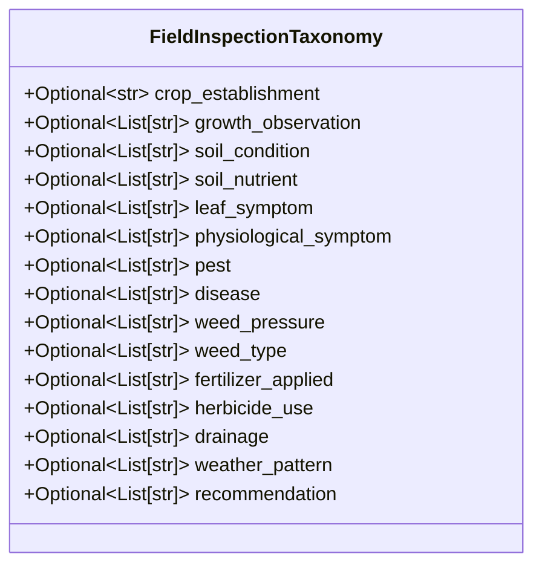

**Field Definitions**:

| Field | Type | Description | Example Values |
|-------|------|-------------|----------------|
| crop_establishment | String | Crop growth stage | "V6 Growth Stage", "R3 Reproductive" |
| growth_observation | List[String] | Growth indicators | ["Plant Height", "Leaf Development"] |
| soil_condition | List[String] | Soil physical properties | ["Alkaline", "Good Tilth"] |
| soil_nutrient | List[String] | Nutrient status | ["Borderline Potassium", "Nitrogen Deficiency"] |
| leaf_symptom | List[String] | Leaf abnormalities | ["Scorching", "Chewing Damage", "Yellowing"] |
| physiological_symptom | List[String] | Plant stress indicators | ["Wilting", "Stunted Growth"] |
| pest | List[String] | Pest identifications | ["Armyworm", "Aphid Infestation"] |
| disease | List[String] | Disease observations | ["Grey Leaf Spot", "Rust"] |
| weed_pressure | List[String] | Weed severity levels | ["Moderate", "High", "Low"] |
| weed_type | List[String] | Weed categories | ["Broadleaf", "Grass Weeds"] |
| fertilizer_applied | List[String] | Fertilizer products | ["MOP", "Urea", "NPK 15-15-15"] |
| herbicide_use | List[String] | Herbicide applications | ["Pre-emergent", "Post-emergent"] |
| drainage | List[String] | Drainage conditions | ["Effective", "Poor", "Waterlogged"] |
| weather_pattern | List[String] | Weather observations | ["Warm & Humid", "Dry Spell"] |
| recommendation | List[String] | Advisory actions | ["Potassium Foliar Spray", "Targeted Insecticide"] |

### Data Transformation Pipeline

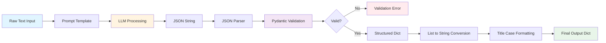

**Transformation Rules**:

1. **List Joining**: List fields converted to comma-separated strings
   ```python
   ["Armyworm", "Aphid"] → "Armyworm, Aphid"
   ```

2. **Key Formatting**: Snake_case keys converted to Title Case
   ```python
   "crop_establishment" → "Crop Establishment"
   ```

3. **Unknown Handling**: Missing/unclear values marked as "Unknown"

### Data Validation

**Validation Layers**:

1. **Pydantic Schema Validation**
   - Type checking (string vs. list)
   - Optional field handling
   - Default value assignment

2. **LLM Output Validation**
   - JSON format verification
   - Field presence checking
   - Value reasonableness (implicit in LLM training)

3. **Application-level Validation**
   - Empty string handling
   - None value management
   - Error state handling

---

## Technology Stack

### Programming Languages

| Language | Version | Usage |
|----------|---------|-------|
| Python | 3.8+ | Primary application language |

### Core Frameworks

| Framework | Version | Purpose |
|-----------|---------|---------|
| Streamlit | Latest | Web UI framework |
| LangChain | Latest | LLM integration and orchestration |
| Pydantic | 2.x | Data validation and schema definition |

### AI/ML Services

| Service | Model | Purpose |
|---------|-------|---------|
| OpenAI API | GPT-4o-mini | Natural language understanding and extraction |

**Model Selection Rationale**:
- **GPT-4o-mini**: Cost-effective, fast, sufficient accuracy for taxonomy extraction
- **Temperature = 0**: Deterministic outputs for consistency
- **Alternative Options**: Claude, Azure OpenAI, local models (Llama, Mistral)

### Supporting Libraries

| Library | Purpose |
|---------|---------|
| python-dotenv | Environment variable management |
| PyYAML | Configuration file parsing |
| loguru | Advanced logging capabilities |
| typing | Type hints and annotations |

### Infrastructure Dependencies

| Component | Technology | Purpose |
|-----------|-----------|---------|
| Runtime | Python 3.8+ | Application execution |
| Environment | Virtual environment (venv/conda) | Dependency isolation |
| Configuration | YAML + .env files | Settings management |
| Logging | File system | Log persistence |

---

## Integration Architecture

### API Integration

#### OpenAI API Integration

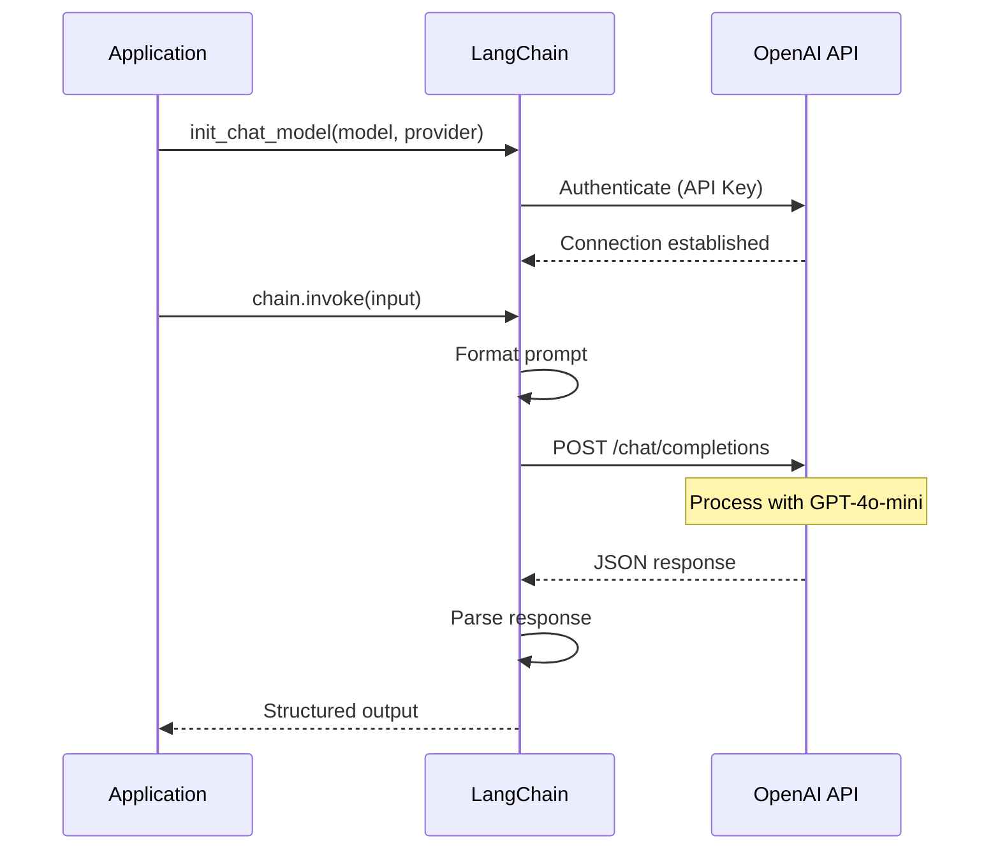

**Authentication**:
- API key stored in `.env` file
- Loaded via `python-dotenv`
- Passed securely to LangChain

**Error Handling**:
- API timeout handling
- Rate limit management (implicit in LangChain)
- Fallback error responses

### Future Integration Points

#### 1. REST API Wrapper

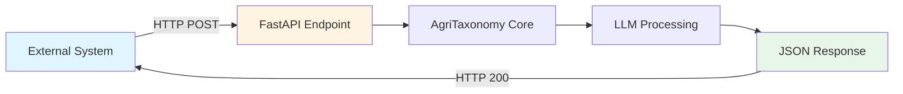

**Proposed API Design**:
```
POST /api/v1/extract-taxonomy
Content-Type: application/json

{
  "inspection_text": "Field inspection report content..."
}

Response:
{
  "status": "success",
  "data": {
    "crop_establishment": "V6 Growth Stage",
    "pest": "Armyworm, Aphid",
    ...
  },
  "processing_time_ms": 3450
}
```

#### 2. Database Integration

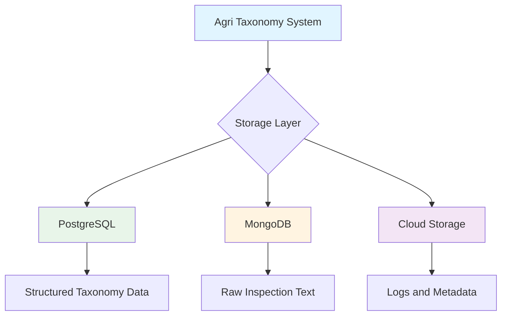

**Proposed Schema** (PostgreSQL):
```sql
CREATE TABLE field_inspections (
    id SERIAL PRIMARY KEY,
    inspection_date TIMESTAMP,
    inspector_id VARCHAR(50),
    field_id VARCHAR(50),
    raw_text TEXT,
    processed_timestamp TIMESTAMP,
    crop_establishment VARCHAR(100),
    growth_observation TEXT[],
    soil_condition TEXT[],
    -- ... other taxonomy fields
    created_at TIMESTAMP DEFAULT NOW()
);
```

#### 3. Farm Management System Integration

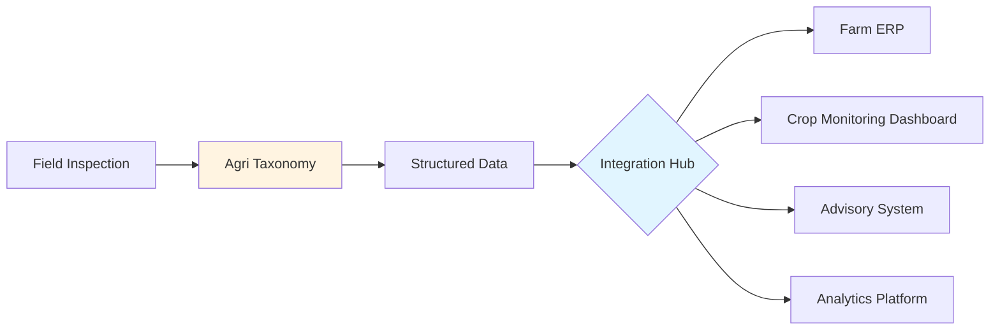

---

## Security Architecture

### Current Security Measures

#### 1. API Key Protection

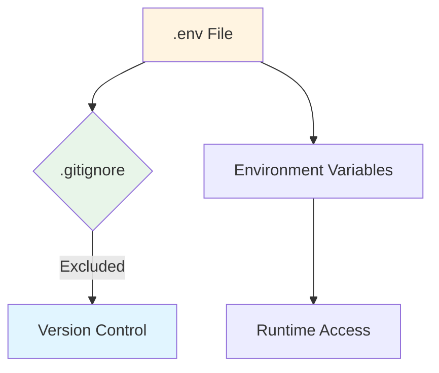

**Implementation**:
- API keys stored in `.env` file
- `.env` excluded from version control
- Keys loaded at runtime only
- No hardcoded credentials

#### 2. Data Privacy

**Current State**:
- Stateless processing (no data persistence)
- No PII collection in prototype
- Logs contain only application events, not user data

**Recommendations**:
- Implement data encryption in transit (HTTPS)
- Add data encryption at rest if persistence is added
- Implement data anonymization for logs
- Add audit trails for compliance

#### 3. Input Validation

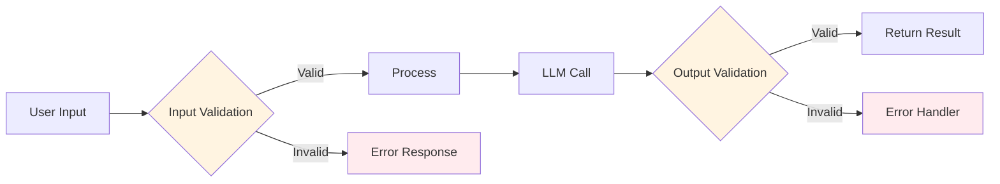

**Validation Points**:
- Empty input rejection
- Text length limits (implicit in LLM)
- JSON schema validation (Pydantic)
- Error boundary handling

### Production Security Recommendations

#### 1. Authentication and Authorization

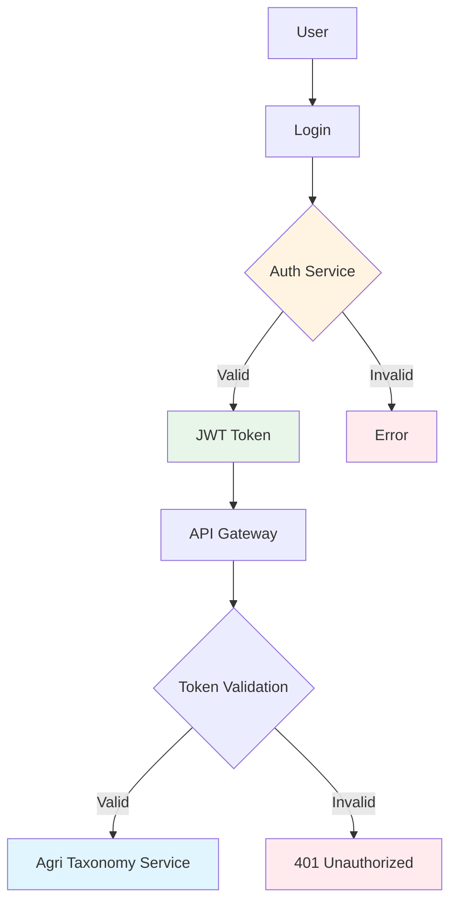

**Recommendations**:
- Implement OAuth 2.0 or JWT-based authentication
- Add role-based access control (RBAC)
- Implement API key management for programmatic access
- Add session management and timeout

#### 2. Network Security

- Deploy behind HTTPS/TLS
- Implement rate limiting
- Add Web Application Firewall (WAF)
- Use VPC/private networking for backend services

#### 3. Data Security

- Encrypt data in transit (TLS 1.3)
- Encrypt sensitive data at rest
- Implement data masking for PII
- Add data retention and deletion policies

#### 4. Monitoring and Incident Response

- Real-time security monitoring
- Anomaly detection
- Incident response procedures
- Regular security audits

---

## Deployment Architecture

### Current Deployment (Prototype)

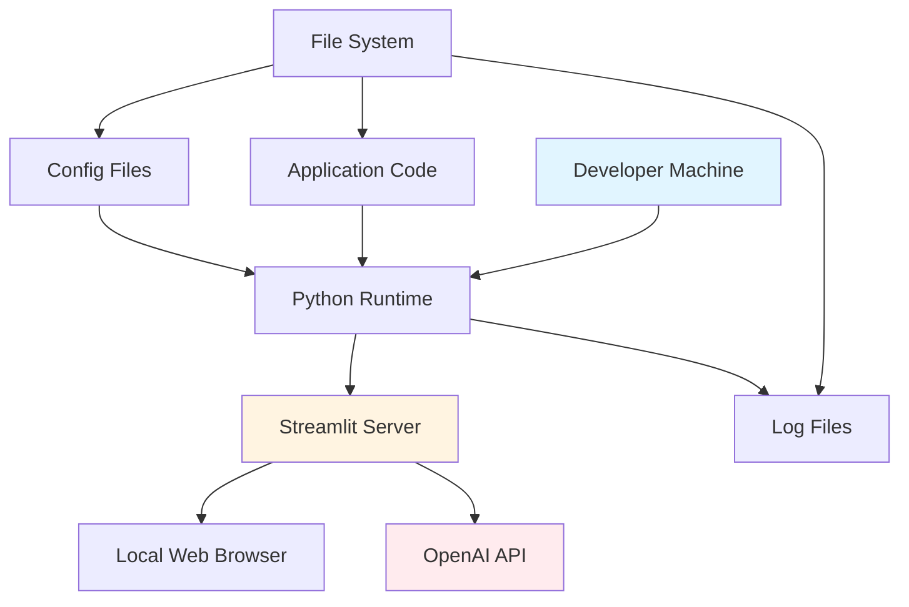

**Deployment Steps**:
1. Clone repository
2. Install dependencies: `pip install -r requirements.txt`
3. Configure `.env` with API keys
4. Configure `config.yaml` with settings
5. Run: `streamlit run app.py`
6. Access: `http://localhost:8501`

### Production Deployment Options

#### Option 1: Cloud-Native Deployment (Recommended)

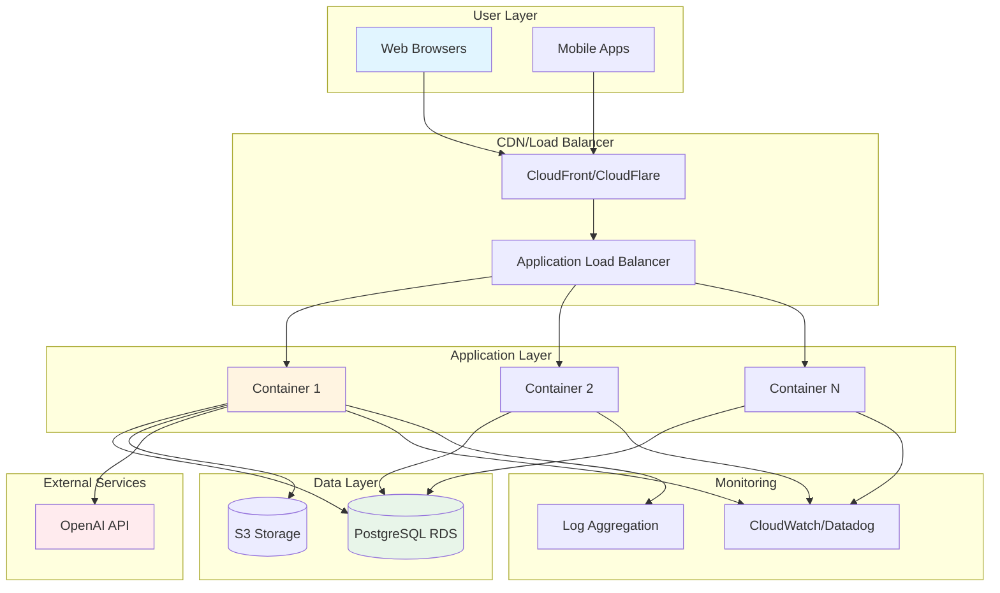

**Infrastructure as Code (Terraform Example)**:
```hcl
resource "aws_ecs_service" "agri_taxonomy" {
  name            = "agri-taxonomy-service"
  cluster         = aws_ecs_cluster.main.id
  task_definition = aws_ecs_task_definition.agri_taxonomy.arn
  desired_count   = 3

  load_balancer {
    target_group_arn = aws_lb_target_group.agri_taxonomy.arn
    container_name   = "agri-taxonomy"
    container_port   = 8501
  }
}
```

#### Option 2: Containerized Deployment

**Dockerfile**:
```dockerfile
FROM python:3.11-slim

WORKDIR /app

COPY requirements.txt .
RUN pip install --no-cache-dir -r requirements.txt

COPY . .

EXPOSE 8501

HEALTHCHECK CMD curl --fail http://localhost:8501/_stcore/health

ENTRYPOINT ["streamlit", "run", "app.py", "--server.port=8501", "--server.address=0.0.0.0"]
```

**Docker Compose**:
```yaml
version: '3.8'

services:
  agri-taxonomy:
    build: .
    ports:
      - "8501:8501"
    environment:
      - OPENAI_API_KEY=${OPENAI_API_KEY}
    volumes:
      - ./logs:/app/logs
      - ./config.yaml:/app/config.yaml
    restart: unless-stopped
```

#### Option 3: Kubernetes Deployment

```yaml
apiVersion: apps/v1
kind: Deployment
metadata:
  name: agri-taxonomy
spec:
  replicas: 3
  selector:
    matchLabels:
      app: agri-taxonomy
  template:
    metadata:
      labels:
        app: agri-taxonomy
    spec:
      containers:
      - name: agri-taxonomy
        image: agri-taxonomy:latest
        ports:
        - containerPort: 8501
        env:
        - name: OPENAI_API_KEY
          valueFrom:
            secretKeyRef:
              name: openai-secret
              key: api-key
        resources:
          requests:
            memory: "512Mi"
            cpu: "500m"
          limits:
            memory: "1Gi"
            cpu: "1000m"
```

---

## Performance and Scalability

### Performance Characteristics

#### Current Performance Metrics

| Metric | Value | Notes |
|--------|-------|-------|
| Average Response Time | 2-5 seconds | Depends on LLM API latency |
| Peak Response Time | 10 seconds | Under high LLM load |
| Throughput | Sequential (1 request at a time) | Streamlit limitation |
| Memory Usage | ~200MB | Base application |
| CPU Usage | Low (<10%) | I/O bound, not CPU bound |

#### Performance Bottlenecks

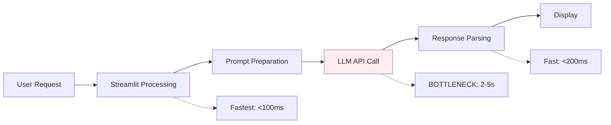

**Primary Bottleneck**: LLM API latency (70-90% of total time)

### Scalability Strategies

#### Horizontal Scaling

```mermaid
graph TB
    A[Load Balancer] --> B[Instance 1]
    A --> C[Instance 2]
    A --> D[Instance 3]
    A --> E[Instance N]

    B --> F[OpenAI API]
    C --> F
    D --> F
    E --> F

    G[Auto Scaling Group] --> A

    style G fill:#e8f5e9
```

**Scaling Triggers**:
- CPU utilization > 70%
- Request queue depth > 10
- Response time > 8 seconds

#### Caching Strategy

```mermaid
graph TB
    A[Request] --> B{Cache Check}
    B -->|Hit| C[Return Cached]
    B -->|Miss| D[Process with LLM]
    D --> E[Update Cache]
    E --> F[Return Result]

    style C fill:#e8f5e9
    style D fill:#fff4e1
```

**Caching Opportunities**:
- Identical inspection texts (exact match)
- Similar inspection patterns (semantic similarity)
- Common taxonomies for specific crop types

**Implementation** (Redis):
```python
import hashlib
import redis

cache = redis.Redis(host='localhost', port=6379, db=0)

def get_agri_taxonomy_cached(txt_content):
    cache_key = hashlib.md5(txt_content.encode()).hexdigest()

    # Check cache
    cached = cache.get(cache_key)
    if cached:
        return json.loads(cached)

    # Process with LLM
    result = get_agri_taxonomy(txt_content)

    # Cache for 1 hour
    cache.setex(cache_key, 3600, json.dumps(result))

    return result
```

#### Batch Processing

For high-volume scenarios:

```mermaid
graph LR
    A[Multiple Inspections] --> B[Batch Queue]
    B --> C[Batch Processor]
    C --> D[LLM Batch API]
    D --> E[Results Processing]
    E --> F[Individual Results]

    style B fill:#fff4e1
    style C fill:#e1f5ff
```

**Benefits**:
- Reduced per-request overhead
- Better resource utilization
- Lower costs (batch pricing)

### Performance Optimization Recommendations

1. **Prompt Optimization**
   - Minimize prompt length
   - Remove unnecessary instructions
   - Use efficient token patterns

2. **Model Selection**
   - Consider faster models for less complex extractions
   - Use model cascading (fast model first, fallback to accurate model)

3. **Response Streaming**
   - Implement streaming for real-time feedback
   - Display partial results as they arrive

4. **Async Processing**
   - Convert to async/await patterns
   - Process multiple requests concurrently
   - Use async LLM clients

---

## Monitoring and Observability

### Logging Strategy

#### Current Implementation

```mermaid
graph TB
    A[Application Events] --> B{Log Level Router}
    B -->|INFO| C[info_logs.json]
    B -->|ERROR/DEBUG| D[error_logs.json]

    C --> E[Daily Rotation]
    D --> F[Daily Rotation]

    E --> G[7-day Retention]
    F --> H[30-day Retention]

    G --> I[Compressed Archives]
    H --> I

    style C fill:#e8f5e9
    style D fill:#ffebee
```

**Log Categories**:
- INFO: Normal operations, successful processing
- ERROR: Application errors, API failures
- DEBUG: Detailed diagnostics
- CRITICAL: System failures requiring immediate attention

#### Production Logging Architecture

```mermaid
graph TB
    A[Application Logs] --> B[Log Aggregator]
    C[Access Logs] --> B
    D[Error Logs] --> B

    B --> E[Elasticsearch]
    E --> F[Kibana Dashboard]

    B --> G[CloudWatch/Datadog]
    G --> H[Alerts]

    style B fill:#fff4e1
    style F fill:#e1f5ff
    style H fill:#ffebee
```

### Metrics and KPIs

#### Application Metrics

| Metric | Description | Target | Alert Threshold |
|--------|-------------|--------|-----------------|
| Request Rate | Requests per minute | N/A | N/A |
| Success Rate | % successful extractions | >95% | <90% |
| Average Response Time | Mean processing time | <5s | >8s |
| P95 Response Time | 95th percentile time | <8s | >12s |
| Error Rate | % failed requests | <5% | >10% |
| LLM API Latency | Time waiting for LLM | <3s | >6s |

#### Business Metrics

| Metric | Description | Measurement |
|--------|-------------|-------------|
| Extraction Accuracy | % correctly extracted fields | Manual validation |
| Field Coverage | % of fields populated | Automated analysis |
| Unknown Rate | % fields marked "Unknown" | Automated tracking |
| User Satisfaction | User rating | Surveys/feedback |

### Monitoring Dashboard

**Proposed Dashboard Layout**:

```mermaid
graph TB
    subgraph "Dashboard - Crop Insight Tagger"
        A[Real-time Metrics]
        B[Performance Graphs]
        C[Error Trends]
        D[Usage Analytics]

        A --> A1[Current RPS]
        A --> A2[Active Users]
        A --> A3[Success Rate]

        B --> B1[Response Time Chart]
        B --> B2[Throughput Graph]

        C --> C1[Error Rate]
        C --> C2[Error Types]

        D --> D1[Daily Usage]
        D --> D2[Popular Fields]
    end

    style A fill:#e8f5e9
    style C fill:#fff4e1
```

### Health Checks

**Endpoint Design**:
```python
@app.route('/health')
def health_check():
    checks = {
        "status": "healthy",
        "timestamp": datetime.now().isoformat(),
        "checks": {
            "config": check_config_loaded(),
            "llm_connection": check_llm_available(),
            "disk_space": check_disk_space(),
            "memory": check_memory_usage()
        }
    }

    if all(checks["checks"].values()):
        return jsonify(checks), 200
    else:
        return jsonify(checks), 503
```

### Alerting Strategy

**Alert Rules**:

1. **Critical Alerts** (Immediate Response)
   - Error rate > 25%
   - All requests failing
   - Application crash/restart
   - LLM API authentication failure

2. **Warning Alerts** (Monitor)
   - Error rate > 10%
   - Response time > 10 seconds (sustained)
   - Disk space < 20%
   - Memory usage > 80%

3. **Info Alerts** (Track)
   - Unusual usage patterns
   - New error types
   - Performance degradation trends

---

## Disaster Recovery and Backup

### Backup Strategy

**Stateless Application**: Minimal backup requirements

**Critical Components**:
1. **Configuration Files**
   - `config.yaml`
   - `.env` template
   - Version controlled in Git

2. **Logs** (if needed for compliance)
   - Automated backup to S3/cloud storage
   - Retention: 90 days
   - Encrypted at rest

3. **Application Code**
   - Git version control
   - Tagged releases
   - Automated CI/CD pipeline

### Disaster Recovery Plan

**Recovery Time Objective (RTO)**: 1 hour
**Recovery Point Objective (RPO)**: 0 (stateless)

**Recovery Steps**:
1. Pull latest code from repository
2. Deploy to new infrastructure
3. Configure environment variables
4. Validate health checks
5. Route traffic to new deployment

---

## Technology Roadmap

### Short-term Enhancements (0-3 months)

1. **API Wrapper**
   - RESTful API using FastAPI
   - OpenAPI documentation
   - Rate limiting

2. **Performance Optimization**
   - Response caching
   - Async processing
   - Connection pooling

3. **Enhanced Monitoring**
   - Structured logging
   - Performance metrics
   - Error tracking

### Medium-term Enhancements (3-12 months)

1. **Database Integration**
   - PostgreSQL for structured data
   - Historical analysis capabilities
   - Reporting and analytics

2. **Multi-model Support**
   - Support for multiple LLM providers
   - Model fallback mechanisms
   - Cost optimization

3. **Batch Processing**
   - Bulk upload capabilities
   - Scheduled processing
   - Export functionality

### Long-term Vision (12+ months)

1. **Advanced AI Features**
   - Fine-tuned models on agricultural data
   - Active learning for continuous improvement
   - Multilingual support

2. **Platform Integration**
   - Farm management system connectors
   - IoT sensor data integration
   - Mobile application support

3. **Advanced Analytics**
   - Predictive models
   - Trend analysis
   - Recommendation engines

---

## Appendix

### Dependency Requirements

**requirements.txt**:
```
streamlit>=1.28.0
langchain>=0.1.0
langchain-openai>=0.0.2
python-dotenv>=1.0.0
pydantic>=2.0.0
PyYAML>=6.0
loguru>=0.7.0
```

### Environment Variables

**Required**:
```
OPENAI_API_KEY=sk-...
```

**Optional**:
```
LOG_LEVEL=INFO
LOG_PATH=./logs
MODEL_TEMPERATURE=0
```

### Configuration Reference

**config.yaml**:
```yaml
# Data configuration
data_path: data

# LLM configuration
llm:
  model: gpt-4o-mini           # Model name
  model_provider: openai        # Provider (openai, azure, anthropic)
  temperature: 0                # Temperature (0-1, 0 = deterministic)
  max_tokens: 2000              # Maximum response tokens (optional)
  timeout: 30                   # API timeout in seconds (optional)

# Application configuration
app:
  title: "Crop Insight Tagger"
  layout: wide

# Logging configuration
logging:
  level: INFO
  rotation: "00:00"
  retention_info: "7 days"
  retention_error: "30 days"
```

---

*Document Version: 1.0*
*Last Updated: December 2025*
*Classification: Internal Use*
