# Functional Architecture
## Crop Insight Tagger - Agricultural Field Inspection Taxonomy System

---

## Table of Contents

1. [Functional Overview](#functional-overview)
2. [Core Capabilities](#core-capabilities)
3. [Feature Specifications](#feature-specifications)
4. [Process Flows](#process-flows)
5. [Taxonomy Framework](#taxonomy-framework)
6. [Data Processing Logic](#data-processing-logic)
7. [Quality Assurance](#quality-assurance)
8. [Error Handling](#error-handling)
9. [User Workflows](#user-workflows)
10. [Extension Points](#extension-points)

---

## Functional Overview

The Crop Insight Tagger is an intelligent agricultural data extraction system that transforms unstructured field inspection narratives into structured, standardized taxonomies. The system serves as a bridge between human observation and data-driven agricultural decision-making.

### Functional Purpose

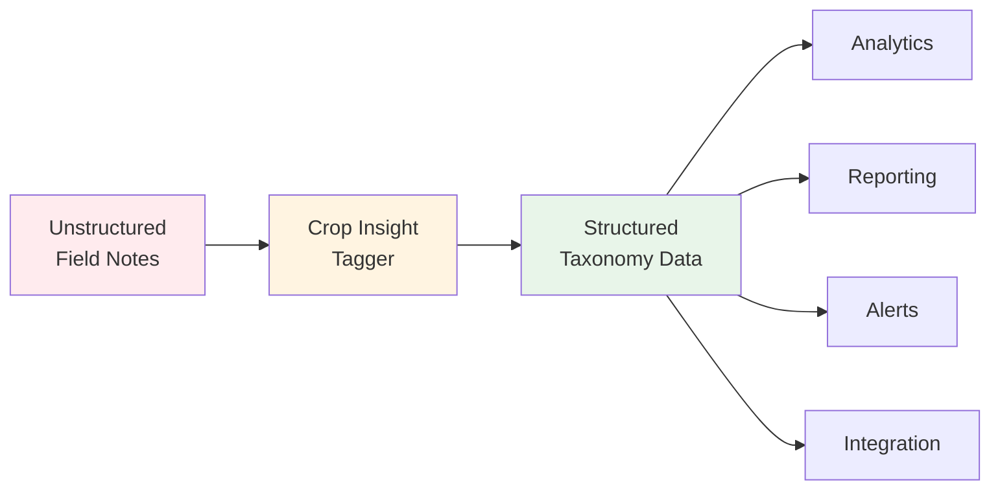

**Primary Function**: Extract 15 categories of agricultural information from free-text field inspection reports

**Value Proposition**: Convert hours of manual data entry and categorization into seconds of automated, accurate extraction

---

## Core Capabilities

### 1. Natural Language Understanding

**Capability**: Interpret agricultural terminology, colloquialisms, and technical language

**Examples**:

| Input Phrase | Extracted Information |
|--------------|----------------------|
| "The corn is at tasseling stage" | crop_establishment: "R1 Tasseling Stage" |
| "Plants showing K deficiency symptoms" | soil_nutrient: "Potassium Deficiency" |
| "Fall armyworm pressure in whorl" | pest: "Fall Armyworm" |
| "GLS on lower canopy" | disease: "Grey Leaf Spot" |

**Technical Implementation**:
- Large Language Model (GPT-4o-mini) trained on agricultural contexts
- Zero-shot learning (no fine-tuning required)
- Context-aware extraction

### 2. Multi-Category Extraction

**Capability**: Simultaneously extract information across 15 distinct agricultural categories from a single inspection report

**Category Coverage**:

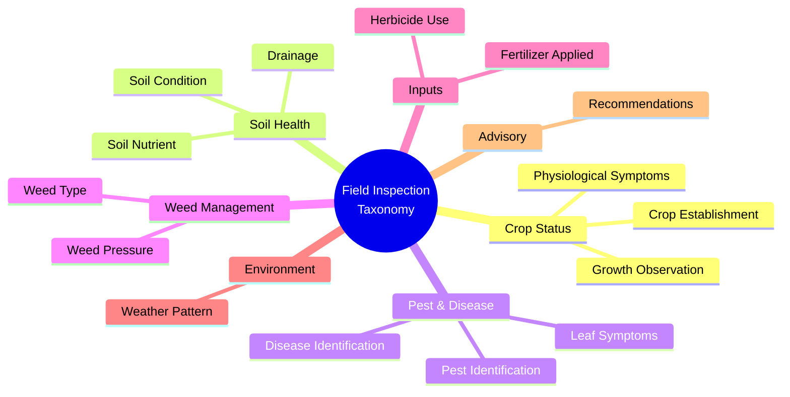

### 3. Flexible Input Processing

**Capability**: Process varied input formats and writing styles

**Supported Input Types**:
- Narrative field notes
- Bullet-point observations
- Technical reports
- Conversational descriptions
- Mixed format reports

**Example Inputs**:

**Narrative Style**:
```
Visited the Johnson farm maize field today. The crop is looking good
overall, at about V8 stage. Noticed some yellowing on the lower leaves
which could indicate nitrogen stress. Soil seems a bit compacted in the
headlands. Found a few armyworm larvae during scouting. Weather has been
dry for the past two weeks. Recommended side-dress nitrogen and monitor
pest pressure.
```

**Bullet Point Style**:
```
- Growth stage: V8
- Lower leaf yellowing observed
- Soil compaction in headlands
- Armyworm larvae present (low pressure)
- Dry weather (2 weeks)
- Action: Side-dress N, monitor pests
```

**Technical Style**:
```
Field ID: J-042
Crop establishment: V8 (8-leaf vegetative)
Symptoms: Interveinal chlorosis, lower canopy
Soil: Compacted, BD >1.6 g/cm³
Pest: Spodoptera frugiperda, larval stage
Recommendation: 30 kg N/ha topdress, weekly pest monitoring
```

**All produce equivalent structured outputs**

### 4. Unknown Value Handling

**Capability**: Intelligently distinguish between explicitly mentioned information and absent information

**Logic**:
- If information is clearly stated → Extract and categorize
- If information is ambiguous → Mark as "Unknown"
- If information is not mentioned → Leave empty or mark "Unknown"

**Example**:

Input: "The wheat field shows good growth. Some rust observed on flag leaves."

Output:
```json
{
  "crop_establishment": "Unknown",           // Not mentioned
  "growth_observation": "Good Growth",       // Mentioned
  "disease": "Rust",                         // Mentioned
  "pest": "Unknown",                         // Not mentioned
  "fertilizer_applied": "Unknown"            // Not mentioned
}
```

### 5. Data Standardization

**Capability**: Convert varied terminology into consistent taxonomies

**Standardization Examples**:

| Varied Input | Standardized Output |
|--------------|---------------------|
| "Corn", "Maize", "Zea mays" | Crop Type: "Maize" |
| "V6", "6-leaf", "Six leaf stage" | Crop Establishment: "V6 Growth Stage" |
| "Potash", "KCl", "MOP" | Fertilizer: "Muriate of Potash (MOP)" |
| "Fall armyworm", "FAW", "Spodoptera frugiperda" | Pest: "Fall Armyworm" |

### 6. Contextual Inference

**Capability**: Infer implicit information from context

**Example**:

Input: "Applied 50 kg urea per hectare after observing pale green color in leaves"

Extracted Information:
- fertilizer_applied: "Urea"
- soil_nutrient: "Nitrogen Deficiency" (inferred from "pale green" symptom)
- recommendation: "Nitrogen Application" (inferred from action taken)
- leaf_symptom: "Chlorosis" (inferred from "pale green")

---

## Feature Specifications

### Feature 1: Text Input Interface

**Description**: Web-based text area for entering field inspection reports

**Specifications**:
- **Input Type**: Multi-line text area
- **Character Limit**: None (reasonable: <10,000 characters)
- **Format Support**: Plain text, no formatting preservation
- **Validation**: Non-empty text required
- **Accessibility**: Standard web form controls

**User Interface**:

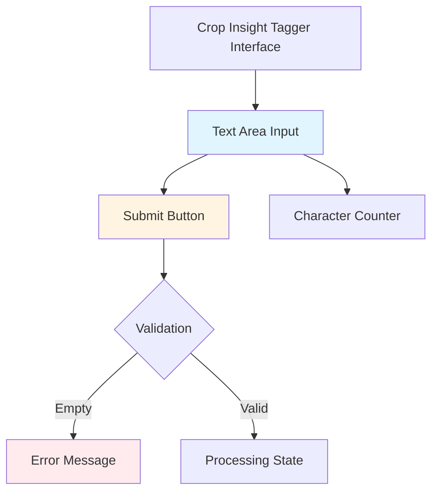

**Behavior**:
- Clear placeholder text guides user
- Form submission triggers processing
- Input retained on error
- Visual feedback during processing

### Feature 2: Real-time Processing

**Description**: Immediate processing of submitted inspection text

**Specifications**:
- **Trigger**: Form submission
- **Processing Time**: 2-5 seconds (typical)
- **User Feedback**: Loading spinner with "Please Wait..." message
- **Timeout**: 30 seconds (LLM API default)
- **Error Recovery**: User-friendly error messages

**Processing States**:

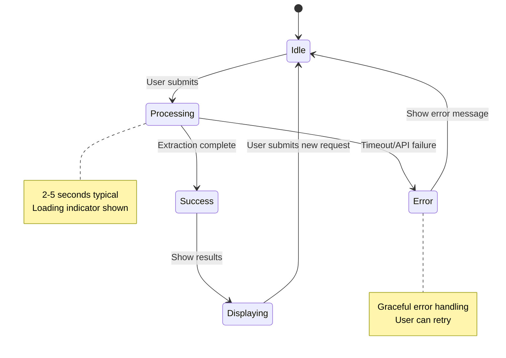

### Feature 3: Structured Data Display

**Description**: Tabular presentation of extracted taxonomy data

**Specifications**:
- **Format**: Pandas DataFrame (Streamlit dataframe component)
- **Layout**: Two-column table (Category | Value)
- **Sorting**: Maintains definition order
- **Scrolling**: Vertical scroll for long results
- **Width**: Full container width
- **Copy**: Users can select and copy data

**Display Format**:

| Field | Value |
|-------|-------|
| Crop Establishment | V6 Growth Stage |
| Growth Observation | Plant Height, Leaf Development |
| Soil Condition | Alkaline, Good Tilth |
| Soil Nutrient | Borderline Potassium |
| Leaf Symptom | Scorching |
| Pest | Armyworm |
| Disease | Grey Leaf Spot |
| Weed Pressure | Moderate |
| Weed Type | Broadleaf |
| Fertilizer Applied | MOP |
| Weather Pattern | Warm & Humid |
| Recommendation | Potassium Foliar Spray, Targeted Insecticide |

### Feature 4: Multi-value Field Handling

**Description**: Properly handle and display fields with multiple values

**Specifications**:
- **Internal Format**: Python lists
- **Display Format**: Comma-separated strings
- **Joining Logic**: `", ".join(values)`
- **Empty Handling**: Empty string or null

**Transformation Example**:

```python
# Internal representation
{
  "pest": ["Armyworm", "Aphid", "Corn Borer"]
}

# Display representation
{
  "Pest": "Armyworm, Aphid, Corn Borer"
}
```

### Feature 5: Field Name Formatting

**Description**: User-friendly field name presentation

**Specifications**:
- **Input Format**: snake_case (e.g., `crop_establishment`)
- **Output Format**: Title Case (e.g., `Crop Establishment`)
- **Transformation**: Python `.title()` method
- **Consistency**: Applied to all field names

**Formatting Rules**:

| Technical Name | Display Name |
|----------------|--------------|
| crop_establishment | Crop Establishment |
| growth_observation | Growth Observation |
| soil_nutrient | Soil Nutrient |
| fertilizer_applied | Fertilizer Applied |

---

## Process Flows

### Primary User Flow

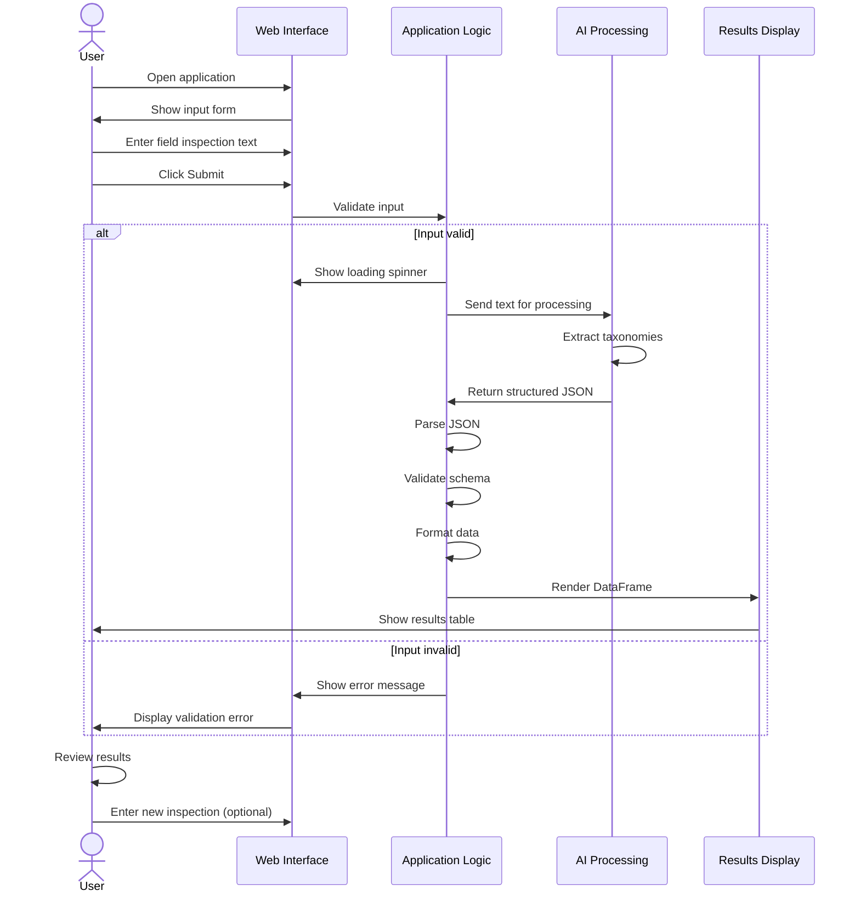

### Data Processing Flow

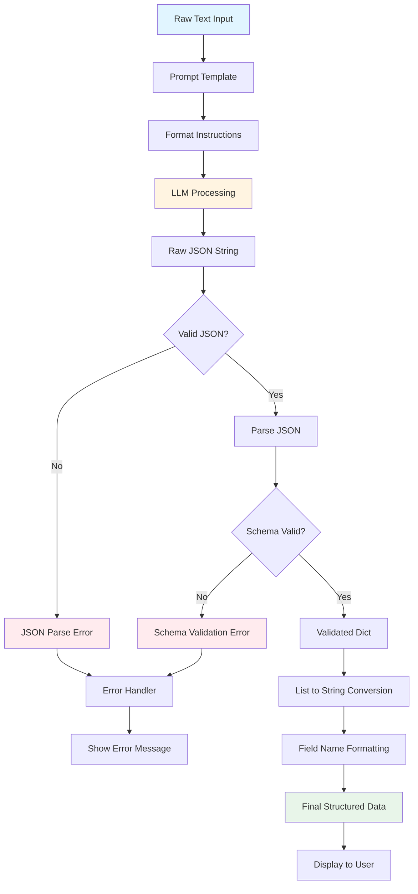

### Error Handling Flow

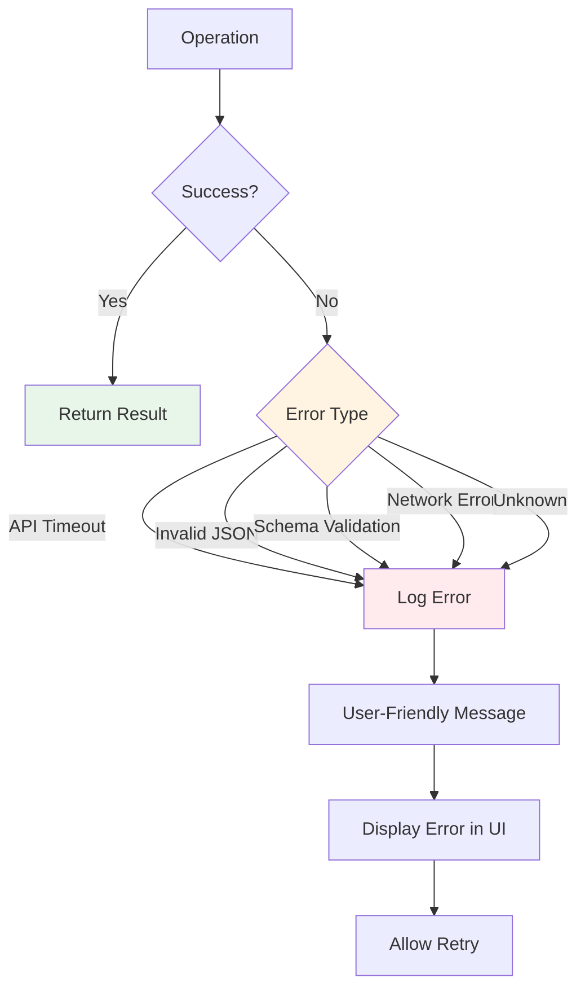

---

## Taxonomy Framework

### Taxonomy Category Definitions

#### 1. Crop Establishment

**Purpose**: Identify crop growth stage and development phase

**Data Type**: Single string value

**Valid Values**:
- Vegetative stages (V1-VN, V6, V12, etc.)
- Reproductive stages (R1-R6, Flowering, Grain Fill)
- Descriptive stages (Germination, Emergence, Maturity)

**Example Values**:
- "V6 Growth Stage"
- "R3 Reproductive Stage"
- "Tasseling"
- "Grain Filling"

**Business Use**:
- Timing of interventions
- Growth stage-specific recommendations
- Comparison with expected development timeline

#### 2. Growth Observation

**Purpose**: Capture qualitative and quantitative growth indicators

**Data Type**: List of strings

**Valid Value Types**:
- Plant height indicators (Tall, Short, Stunted, Good Height)
- Leaf development (Healthy Leaves, Leaf Count)
- Plant vigor (Vigorous, Weak, Moderate)
- Stand density (Uniform Stand, Gaps, Thick Stand)

**Example Values**:
- ["Plant Height", "Leaf Development", "Vigorous Growth"]
- ["Uniform Stand", "Good Canopy Closure"]

**Business Use**:
- Assess crop health
- Identify growth abnormalities
- Benchmark against standards

#### 3. Soil Condition

**Purpose**: Document physical and chemical soil properties

**Data Type**: List of strings

**Valid Value Types**:
- pH indicators (Alkaline, Acidic, Neutral)
- Texture descriptors (Sandy, Clay, Loamy)
- Structure indicators (Good Tilth, Compacted, Crusted)
- Moisture status (Dry, Moist, Waterlogged)

**Example Values**:
- ["Alkaline", "Good Tilth"]
- ["Compacted", "Dry"]
- ["Clay Loam", "Well-structured"]

**Business Use**:
- Soil health assessment
- Amendment recommendations
- Long-term soil management

#### 4. Soil Nutrient

**Purpose**: Identify nutrient deficiencies, toxicities, or imbalances

**Data Type**: List of strings

**Valid Value Types**:
- Specific nutrients (Nitrogen, Phosphorus, Potassium, Sulfur, etc.)
- Severity descriptors (Deficient, Borderline, Sufficient, Excessive)
- Combined descriptors (Borderline Potassium, Nitrogen Deficiency)

**Example Values**:
- ["Borderline Potassium"]
- ["Nitrogen Deficiency", "Sufficient Phosphorus"]

**Business Use**:
- Fertilizer recommendations
- Nutrient management planning
- Yield impact assessment

#### 5. Leaf Symptom

**Purpose**: Document visible leaf abnormalities

**Data Type**: List of strings

**Valid Value Types**:
- Color changes (Yellowing, Chlorosis, Purpling, Browning)
- Physical damage (Scorching, Chewing Damage, Holes)
- Patterns (Interveinal, Marginal, Tip Burn)
- Texture changes (Curling, Cupping, Wilting)

**Example Values**:
- ["Scorching", "Chewing Damage"]
- ["Interveinal Chlorosis", "Marginal Necrosis"]

**Business Use**:
- Diagnose nutrient deficiencies
- Identify pest damage patterns
- Assess disease symptoms

#### 6. Physiological Symptom

**Purpose**: Capture plant stress indicators beyond leaf symptoms

**Data Type**: List of strings

**Valid Value Types**:
- Water stress (Wilting, Leaf Rolling, Drooping)
- Heat stress (Leaf Firing, Tassel Blast)
- Structural issues (Lodging, Stalk Breakage)
- Developmental abnormalities (Barren Plants, Poor Pollination)

**Example Values**:
- ["Wilting"]
- ["Lodging", "Stalk Breakage"]

**Business Use**:
- Stress assessment
- Irrigation management
- Genetic performance evaluation

#### 7. Pest

**Purpose**: Identify insect pests and pest pressure

**Data Type**: List of strings

**Valid Value Types**:
- Specific pest names (Armyworm, Aphid, Corn Borer)
- Scientific names (Spodoptera frugiperda)
- Pest categories (Lepidoptera larvae, Sucking insects)
- Pressure indicators (Low, Moderate, High, with pest name)

**Example Values**:
- ["Armyworm", "Aphid"]
- ["Fall Armyworm (Moderate Pressure)"]

**Business Use**:
- Pest surveillance and mapping
- Insecticide selection
- Threshold-based interventions

#### 8. Disease

**Purpose**: Document plant diseases and pathogen presence

**Data Type**: List of strings

**Valid Value Types**:
- Disease names (Grey Leaf Spot, Rust, Blight)
- Pathogen types (Fungal, Bacterial, Viral)
- Disease severity (Early stage, Severe infection)

**Example Values**:
- ["Grey Leaf Spot", "Common Rust"]
- ["Northern Corn Leaf Blight (Severe)"]

**Business Use**:
- Disease surveillance
- Fungicide recommendations
- Variety resistance evaluation

#### 9. Weed Pressure

**Purpose**: Assess weed infestation levels

**Data Type**: List of strings

**Valid Value Types**:
- Pressure levels (Low, Moderate, High, Severe)
- Coverage descriptors (Sparse, Scattered, Dense)
- Timing descriptors (Early weed pressure, Late season weeds)

**Example Values**:
- ["Moderate"]
- ["High Pressure", "Scattered Infestation"]

**Business Use**:
- Herbicide timing and selection
- Weed control effectiveness
- Yield impact assessment

#### 10. Weed Type

**Purpose**: Categorize dominant weed species or types

**Data Type**: List of strings

**Valid Value Types**:
- Weed categories (Broadleaf, Grassy, Sedges)
- Specific species (Pigweed, Crabgrass, Nutsedge)
- Growth habits (Annual, Perennial)

**Example Values**:
- ["Broadleaf", "Grassy"]
- ["Pigweed", "Morning Glory"]

**Business Use**:
- Targeted herbicide selection
- Weed species mapping
- Resistance management

#### 11. Fertilizer Applied

**Purpose**: Track fertilizer applications and products used

**Data Type**: List of strings

**Valid Value Types**:
- Product names (Urea, DAP, MOP, NPK)
- Nutrient forms (Nitrogen, Phosphate, Potash)
- Application rates (with units if mentioned)

**Example Values**:
- ["MOP", "Urea"]
- ["NPK 15-15-15", "30 kg/ha Nitrogen"]

**Business Use**:
- Input tracking
- Cost analysis
- Effectiveness correlation

#### 12. Herbicide Use

**Purpose**: Document herbicide applications

**Data Type**: List of strings

**Valid Value Types**:
- Timing (Pre-emergent, Post-emergent)
- Product names (Atrazine, Glyphosate)
- Application details (Broadcast, Spot treatment)

**Example Values**:
- ["Pre-emergent"]
- ["Glyphosate", "Post-emergent Application"]

**Business Use**:
- Herbicide effectiveness tracking
- Resistance management
- Regulatory compliance

#### 13. Drainage

**Purpose**: Assess field drainage conditions

**Data Type**: List of strings

**Valid Value Types**:
- Drainage status (Effective, Poor, Inadequate)
- Water accumulation (Ponding, Waterlogging)
- Drainage patterns (Uneven, Good)

**Example Values**:
- ["Effective"]
- ["Poor Drainage", "Standing Water"]

**Business Use**:
- Infrastructure planning
- Crop selection
- Yield variability analysis

#### 14. Weather Pattern

**Purpose**: Document recent weather conditions affecting the crop

**Data Type**: List of strings

**Valid Value Types**:
- Temperature (Hot, Cool, Warm)
- Moisture (Humid, Dry, Wet)
- Precipitation (Rainfall, Drought)
- Combined descriptors (Warm & Humid, Hot & Dry)

**Example Values**:
- ["Warm & Humid"]
- ["Dry Spell", "Recent Heavy Rainfall"]

**Business Use**:
- Disease risk assessment
- Stress correlation
- Irrigation planning

#### 15. Recommendation

**Purpose**: Extract advisory recommendations from inspection reports

**Data Type**: List of strings

**Valid Value Types**:
- Input applications (Potassium Foliar Spray, Nitrogen Topdress)
- Pest/disease management (Targeted Insecticide, Fungicide Application)
- Cultural practices (Irrigation, Scouting)
- Timing (Immediate, Within 7 days)

**Example Values**:
- ["Potassium Foliar Spray", "Targeted Insecticide"]
- ["Side-dress Nitrogen", "Monitor Pest Pressure"]

**Business Use**:
- Recommendation tracking
- Effectiveness analysis
- Advisory quality assessment

---

## Data Processing Logic

### Prompt Engineering

**Prompt Structure**:

```
[System Role Definition]
You are an intelligent field inspection summarization and
information extraction system.

[Task Definition]
Extract structured field inspection details in JSON format
from the following field inspection report.

[Handling Instructions]
If any value is not clearly mentioned mark it as "Unknown".

[Format Instructions]
{Pydantic schema as JSON schema}

[Output Format]
Do not return any preamble or explanation, return only a
pure JSON string surrounded by triple backticks (```).

[Input]
Field inspection report:
{field_detail}
```

**Design Principles**:

1. **Clarity**: Explicitly define the task and expectations
2. **Structure**: Provide clear schema for expected output
3. **Handling Ambiguity**: Instruct on unknown value management
4. **Format Precision**: Specify exact output format requirements

### JSON Schema Generation

**Process**:

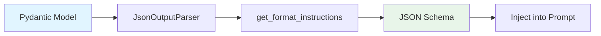

**Generated Schema Example** (abbreviated):

```json
{
  "properties": {
    "crop_establishment": {
      "default": null,
      "description": "Observed crop establishment stages",
      "title": "Crop Establishment",
      "type": "string"
    },
    "pest": {
      "default": null,
      "description": "List of pests identified",
      "items": {"type": "string"},
      "title": "Pest",
      "type": "array"
    }
  },
  "title": "FieldInspectionTaxonomy"
}
```

### Validation Logic

**Multi-layer Validation**:

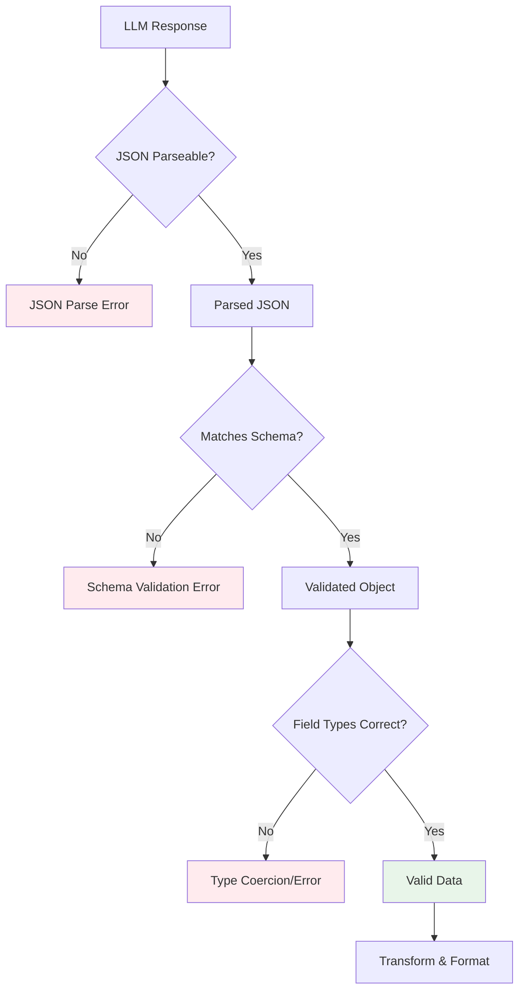

**Validation Checks**:

1. **JSON Syntax**: Valid JSON structure
2. **Schema Compliance**: All required fields present
3. **Type Validation**: Correct data types (string vs. array)
4. **Optional Field Handling**: Null/missing field management

### Post-processing Logic

**Transformation Steps**:

```python
# 1. Parse JSON response
parsed_res = self.agri_parser.parse(res.content)

# 2. Convert lists to comma-separated strings
for k, v in parsed_res.items():
    if type(v) is list:
        parsed_res[k] = ", ".join(v)

# 3. Convert field names to Title Case
parsed_res = {k.title(): v for k, v in parsed_res.items()}

# 4. Return formatted dictionary
return parsed_res
```

**Example Transformation**:

```python
# Input (from LLM)
{
  "crop_establishment": "V6 Growth Stage",
  "pest": ["Armyworm", "Aphid"],
  "disease": ["Grey Leaf Spot"]
}

# After list joining
{
  "crop_establishment": "V6 Growth Stage",
  "pest": "Armyworm, Aphid",
  "disease": "Grey Leaf Spot"
}

# After title case
{
  "Crop Establishment": "V6 Growth Stage",
  "Pest": "Armyworm, Aphid",
  "Disease": "Grey Leaf Spot"
}
```

---

## Quality Assurance

### Accuracy Metrics

**Evaluation Framework**:

| Metric | Definition | Target |
|--------|------------|--------|
| Field-level Accuracy | % of correctly extracted individual fields | >85% |
| Complete Extraction | % of reports with all fields correctly identified | >75% |
| False Positive Rate | % of incorrectly populated fields | <10% |
| Unknown Rate | % of fields marked as "Unknown" | <15% |

### Validation Approach

**Gold Standard Validation**:

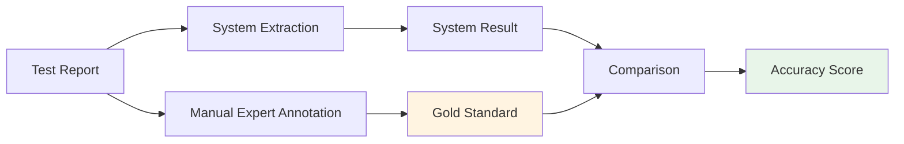

**Validation Process**:
1. Create test set of diverse field inspection reports
2. Manually annotate with agricultural experts
3. Run system extraction
4. Compare field-by-field
5. Calculate accuracy metrics
6. Analyze error patterns

### Quality Control Measures

**Pre-processing Quality**:
- Input validation (non-empty, reasonable length)
- Character encoding normalization
- Special character handling

**Processing Quality**:
- LLM temperature = 0 (deterministic outputs)
- Schema-guided extraction (reduces hallucination)
- Structured output format (prevents free-form errors)

**Post-processing Quality**:
- JSON validation
- Schema compliance checking
- Data type verification

---

## Error Handling

### Error Categories

#### 1. User Input Errors

**Scenario**: Empty or invalid input

**Handling**:
- Form validation prevents submission
- Clear error messages guide user
- Input retained for correction

**User Experience**:
```
❌ Error: Please enter field inspection details
```

#### 2. LLM API Errors

**Scenarios**:
- Network timeout
- API rate limiting
- Authentication failure
- Service unavailable

**Handling**:
```python
try:
    res = self.agri_chain.invoke({"field_detail": txt_content})
except Exception as e:
    self.logger.error(e)
    st.error("Processing failed. Please try again.")
    return {}
```

**User Experience**:
```
❌ Processing failed. Please try again.
```

#### 3. JSON Parsing Errors

**Scenario**: LLM returns malformed JSON

**Handling**:
- JsonOutputParser handles parsing
- Pydantic validation catches schema mismatches
- Empty dict returned on failure

**Logging**:
```json
{
  "level": "ERROR",
  "message": "JSON parsing failed",
  "input": "truncated_input",
  "llm_response": "truncated_response"
}
```

#### 4. Schema Validation Errors

**Scenario**: LLM output doesn't match expected schema

**Handling**:
- Pydantic raises ValidationError
- Error caught and logged
- User sees generic error message

**Developer View** (logs):
```json
{
  "level": "ERROR",
  "message": "Schema validation error",
  "expected_type": "array",
  "received_type": "string",
  "field": "pest"
}
```

### Error Recovery Strategies

**Retry Logic**:

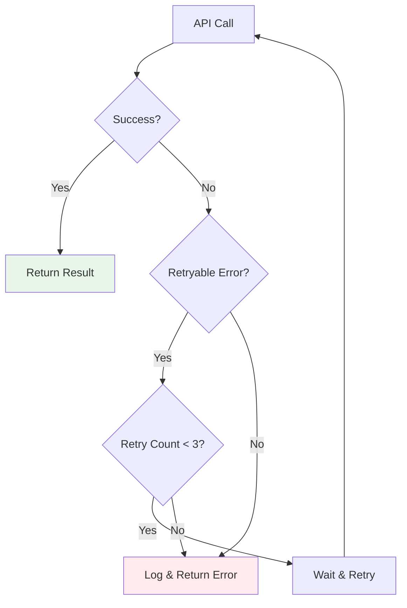

**Graceful Degradation**:
- Partial results returned when possible
- Unknown values for unclear fields
- User informed of processing limitations

---

## User Workflows

### Workflow 1: Single Inspection Processing

**User Story**: As a field agronomist, I want to quickly extract structured data from a single inspection report.

**Steps**:
1. Open Crop Insight Tagger application
2. Paste or type field inspection text
3. Click Submit
4. Wait 3-5 seconds (loading indicator shown)
5. Review extracted taxonomy data
6. Copy data for use in other systems (optional)

**Time Saving**: 10-15 minutes of manual categorization → 5 seconds

### Workflow 2: Batch Processing (Future)

**User Story**: As a data analyst, I want to process multiple inspection reports at once.

**Proposed Steps**:
1. Upload CSV or text file with multiple reports
2. Map columns to expected fields
3. Submit batch
4. Monitor progress
5. Download structured results
6. Import to analytics platform

**Time Saving**: Hours of manual work → Minutes of automated processing

### Workflow 3: Integration Workflow (Future)

**User Story**: As a farm manager, I want inspection data automatically fed into my farm management system.

**Proposed Steps**:
1. Field inspector submits report via mobile app
2. Text automatically sent to Crop Insight Tagger API
3. Structured data returned
4. Farm management system receives data
5. Dashboards automatically updated
6. Alerts triggered if critical issues detected

**Value**: Real-time data flow, automated decision support

---

## Extension Points

### 1. Custom Taxonomy Categories

**Current**: 15 predefined categories

**Extension**: Allow users to define additional categories

**Implementation**:
```python
class CustomFieldInspection(BaseModel):
    # Standard fields
    crop_establishment: Optional[str]
    # ... existing fields

    # Custom fields (dynamic)
    custom_fields: Optional[Dict[str, Any]]
```

### 2. Multilingual Support

**Current**: English language only

**Extension**: Support for multiple languages

**Implementation Approach**:
- Language detection
- Multilingual LLMs (GPT-4, Claude)
- Localized taxonomy values
- Translation layer for outputs

### 3. Image Analysis Integration

**Current**: Text-only input

**Extension**: Process field inspection images

**Use Cases**:
- Disease identification from leaf photos
- Pest identification from trap images
- Growth stage estimation from field photos

**Technology**:
- Multimodal LLMs (GPT-4V, Claude 3)
- Computer vision models
- Combined image + text analysis

### 4. Confidence Scoring

**Current**: Binary extraction (present or unknown)

**Extension**: Provide confidence scores for extractions

**Output Example**:
```json
{
  "pest": {
    "value": "Armyworm",
    "confidence": 0.92
  },
  "disease": {
    "value": "Grey Leaf Spot",
    "confidence": 0.78
  }
}
```

### 5. Recommendation Generation

**Current**: Extract recommendations from text

**Extension**: AI-generated recommendations based on observations

**Logic**:
```
If pest = "Armyworm" AND pressure = "High"
  → Recommend: "Apply threshold-based insecticide (Spinetoram or Chlorantraniliprole)"

If soil_nutrient = "Nitrogen Deficiency" AND crop_stage = "V6"
  → Recommend: "Side-dress 30-40 kg N/ha within 3-5 days"
```

### 6. Historical Comparison

**Current**: Single inspection processing

**Extension**: Compare current inspection with historical data

**Features**:
- Trend analysis (pest pressure over time)
- Anomaly detection (unusual observations)
- Seasonal patterns
- Field-specific baselines

---

## Appendix: Example Use Cases

### Example 1: Complete Inspection

**Input**:
```
Field inspection report - Johnson Farm, Field A2, Date: May 15, 2025

The maize crop is currently at V8 growth stage with good plant height
and healthy green color. Stand is uniform with approximately 65,000
plants per hectare. Soil is slightly alkaline (pH ~7.8) with good
structure and tilth. Some signs of potassium deficiency observed with
marginal leaf scorching on older leaves.

Pest scouting revealed low to moderate fall armyworm pressure with
larvae found in 15% of plants, mostly in the whorl. No significant
disease pressure at this time, though a few plants show early signs
of common rust on lower leaves.

Weed pressure is low following the pre-emergent herbicide application
(atrazine + metolachlor) three weeks ago. Some scattered broadleaf
weeds (mostly pigweed) emerging in wet spots.

Farmer applied 100 kg/ha NPK 12-24-12 at planting plus 50 kg/ha urea
as topdress at V6 stage.

Weather has been warm (28-32°C) and humid with scattered afternoon
thunderstorms over the past week.

Recommendations:
1. Apply potassium foliar spray (K2O 15%) to address deficiency
2. Monitor armyworm pressure; consider threshold-based insecticide
   if pressure increases
3. Scout for rust development; likely no action needed at this stage
4. Spot-treat emerged weeds with post-emergent herbicide
```

**Expected Output**:
```
Crop Establishment: V8 Growth Stage
Growth Observation: Good Plant Height, Healthy Green Color, Uniform Stand
Soil Condition: Alkaline, Good Tilth
Soil Nutrient: Potassium Deficiency
Leaf Symptom: Marginal Scorching
Physiological Symptom: Unknown
Pest: Fall Armyworm (Low to Moderate Pressure)
Disease: Common Rust (Early Stage)
Weed Pressure: Low
Weed Type: Broadleaf, Pigweed
Fertilizer Applied: NPK 12-24-12, Urea
Herbicide Use: Pre-emergent (Atrazine, Metolachlor)
Drainage: Unknown
Weather Pattern: Warm & Humid, Scattered Thunderstorms
Recommendation: Potassium Foliar Spray, Monitor Armyworm Pressure, Scout for Rust, Post-emergent Herbicide
```

### Example 2: Brief Observation

**Input**:
```
Quick check on the wheat field. Looking good overall. Some aphids
on flag leaves but below threshold. Recommend monitoring.
```

**Expected Output**:
```
Crop Establishment: Unknown
Growth Observation: Good Overall Condition
Soil Condition: Unknown
Soil Nutrient: Unknown
Leaf Symptom: Unknown
Physiological Symptom: Unknown
Pest: Aphid (Below Threshold)
Disease: Unknown
Weed Pressure: Unknown
Weed Type: Unknown
Fertilizer Applied: Unknown
Herbicide Use: Unknown
Drainage: Unknown
Weather Pattern: Unknown
Recommendation: Monitor Aphid Pressure
```

---

*Document Version: 1.0*
*Last Updated: December 2025*
*Classification: Internal Use*
