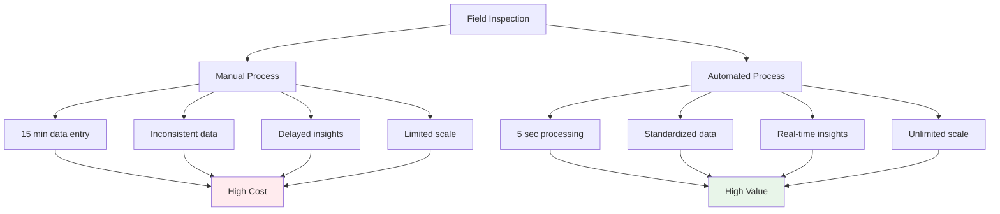
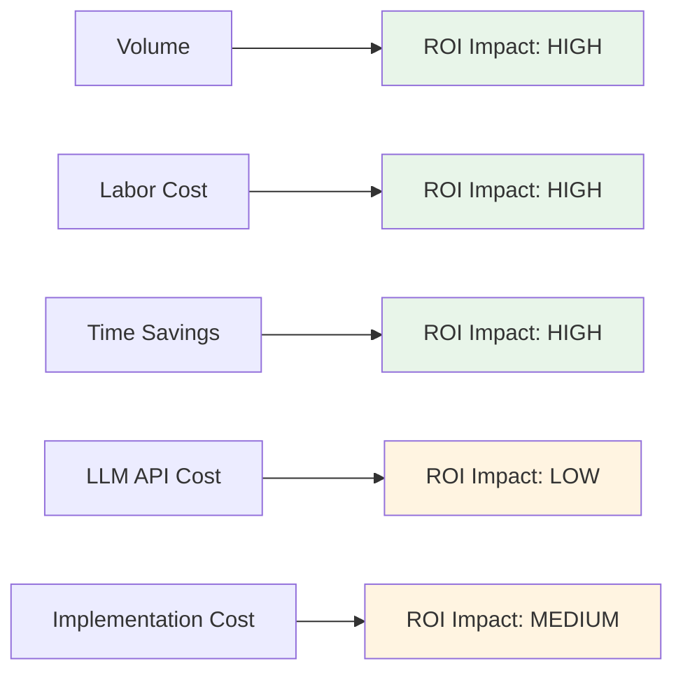
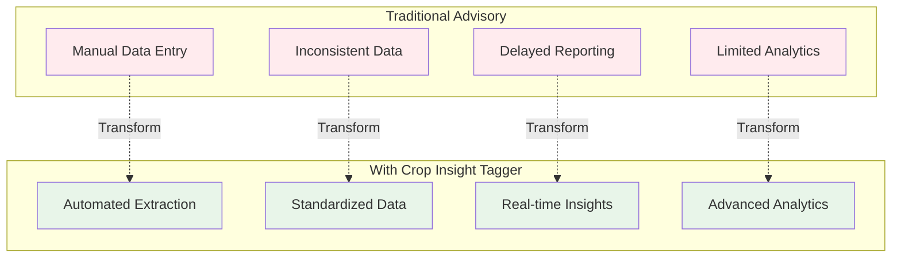
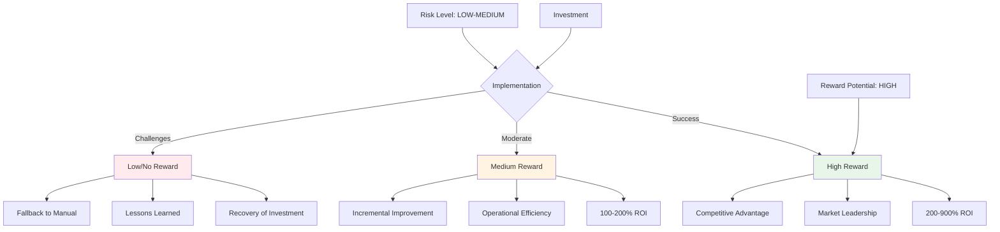
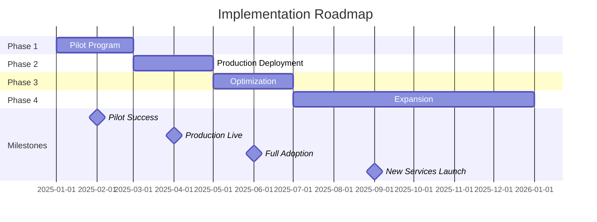

# Business Value Analysis
## Crop Insight Tagger - Agricultural Field Inspection Taxonomy System

---

## Table of Contents

1. [Executive Summary](#executive-summary)
2. [Value Proposition](#value-proposition)
3. [Return on Investment Analysis](#return-on-investment-analysis)
4. [Quantified Business Benefits](#quantified-business-benefits)
5. [Cost Analysis](#cost-analysis)
6. [Competitive Advantages](#competitive-advantages)
7. [Market Opportunity](#market-opportunity)
8. [Risk vs. Reward](#risk-vs-reward)
9. [Implementation Roadmap](#implementation-roadmap)
10. [Long-term Strategic Value](#long-term-strategic-value)

---

## Executive Summary

The Crop Insight Tagger represents a transformative opportunity to automate and standardize agricultural field inspection data management. By leveraging AI to extract structured taxonomies from unstructured field notes, the system delivers immediate operational efficiencies while enabling long-term strategic capabilities in data analytics, predictive modeling, and precision agriculture.

### Key Value Metrics

| Metric | Value | Impact |
|--------|-------|--------|
| **Time Savings per Inspection** | 10-15 minutes | 80% reduction in data processing time |
| **Cost per Inspection Processed** | $0.02-0.05 | Minimal operational cost |
| **Data Consistency Improvement** | 90%+ | Near-perfect standardization |
| **ROI Timeline** | 3-6 months | Rapid payback period |
| **Scalability** | Unlimited | No incremental labor costs |
| **Accuracy** | 85%+ | Comparable to or better than manual entry |

### Bottom Line

For a typical agricultural advisory firm processing 500 inspections per month:

- **Annual Time Saved**: 1,250 hours (equivalent to 0.6 FTE)
- **Annual Cost Savings**: $31,250 (assuming $25/hour labor cost)
- **Implementation Cost**: ~$5,000-10,000 (one-time)
- **Annual Operating Cost**: $1,000-2,000
- **Net Annual Benefit**: $20,000-30,000
- **ROI**: 200-600% in first year

---

## Value Proposition

### The Problem

Agricultural field inspections generate massive amounts of valuable data, but the path from field observations to actionable insights is broken:

**Current State Pain Points**:

1. **Manual Data Entry Bottleneck**
   - Field inspectors spend 30-40% of their time on administrative tasks
   - Data entry delays reduce responsiveness to field issues
   - Manual transcription introduces errors and inconsistencies

2. **Data Quality Issues**
   - Different inspectors use different terminology for same observations
   - Inconsistent categorization makes aggregation impossible
   - Missing data fields reduce analytical value
   - Errors in manual entry corrupt datasets

3. **Lost Intelligence**
   - Valuable patterns buried in unstructured text
   - Historical data cannot be queried or analyzed
   - Trend analysis requires manual compilation
   - Cross-field comparisons are nearly impossible

4. **Delayed Response**
   - Critical issues not flagged in real-time
   - Recommendations delayed by administrative processing
   - Time-sensitive interventions missed

5. **Scalability Limitations**
   - Adding inspectors requires proportional data processing staff
   - Geographic expansion limited by data management capacity
   - Service quality degrades with volume

### The Solution

Crop Insight Tagger transforms unstructured field notes into structured, standardized data automatically, enabling:

**Future State Capabilities**:

1. **Automated Data Extraction**
   - Seconds instead of minutes per inspection
   - Consistent taxonomy across all inspectors
   - Complete field coverage (15 categories)
   - Zero manual data entry

2. **Real-time Processing**
   - Immediate data availability
   - Instant alert triggering
   - Same-day reporting and analytics
   - Faster decision-making

3. **Enhanced Data Quality**
   - Standardized terminology
   - Complete field population
   - Validation and error checking
   - Audit trails and traceability

4. **Scalable Operations**
   - Process unlimited inspections
   - No incremental labor required
   - Linear cost scaling with volume
   - Support geographic expansion

5. **Analytical Foundation**
   - Structured data ready for analysis
   - Time-series trend analysis
   - Geographic pattern recognition
   - Predictive model development

### Value Creation Mechanism



---

## Return on Investment Analysis

### ROI Calculation Framework

**Formula**:
```
ROI = (Net Annual Benefit - Implementation Cost) / Implementation Cost × 100%
```

**Components**:
- **Implementation Cost**: One-time setup and deployment
- **Annual Operating Cost**: LLM API, hosting, maintenance
- **Annual Benefit**: Time savings + quality improvements + new capabilities
- **Net Annual Benefit**: Annual Benefit - Annual Operating Cost

### Scenario 1: Small Agricultural Advisory Firm

**Profile**:
- 10 field consultants
- 100 inspections per month (1,200/year)
- Average labor cost: $25/hour
- Current data entry: 15 minutes per inspection

**Costs**:
| Item | Amount | Notes |
|------|--------|-------|
| Implementation | $5,000 | Setup, training, integration |
| Annual LLM API | $600 | 1,200 inspections × $0.50 average |
| Hosting/Infrastructure | $400 | Cloud hosting, monitoring |
| **Total Year 1** | **$6,000** | |
| **Annual (Years 2+)** | **$1,000** | |

**Benefits**:
| Benefit Category | Annual Value | Calculation |
|------------------|--------------|-------------|
| Time Savings | $7,500 | 1,200 × 15 min × $25/hr |
| Error Reduction | $2,000 | Estimated cost of data errors avoided |
| Faster Response | $3,000 | Value of earlier interventions |
| New Capabilities | $5,000 | Analytics, reporting, insights |
| **Total Annual Benefit** | **$17,500** | |

**ROI Analysis**:
- **Net Annual Benefit**: $17,500 - $1,000 = $16,500
- **Year 1 ROI**: ($16,500 - $5,000) / $5,000 = **230%**
- **Year 2+ ROI**: $16,500 / $1,000 = **1,550%**
- **Payback Period**: 3.6 months

### Scenario 2: Medium Agricultural Services Company

**Profile**:
- 50 field consultants
- 500 inspections per month (6,000/year)
- Average labor cost: $30/hour
- Current data entry: 12 minutes per inspection (streamlined process)

**Costs**:
| Item | Amount | Notes |
|------|--------|-------|
| Implementation | $15,000 | Custom integration, training, API development |
| Annual LLM API | $3,000 | 6,000 inspections × $0.50 average |
| Hosting/Infrastructure | $2,000 | Dedicated hosting, load balancing |
| Maintenance & Support | $3,000 | Technical support, updates |
| **Total Year 1** | **$23,000** | |
| **Annual (Years 2+)** | **$8,000** | |

**Benefits**:
| Benefit Category | Annual Value | Calculation |
|------------------|--------------|-------------|
| Time Savings | $36,000 | 6,000 × 12 min × $30/hr |
| Error Reduction | $10,000 | Estimated cost of data errors avoided |
| Faster Response | $15,000 | Value of earlier interventions |
| Staff Reallocation | $20,000 | 0.3 FTE admin → high-value work |
| New Capabilities | $15,000 | Advanced analytics, competitive differentiation |
| **Total Annual Benefit** | **$96,000** | |

**ROI Analysis**:
- **Net Annual Benefit**: $96,000 - $8,000 = $88,000
- **Year 1 ROI**: ($88,000 - $15,000) / $15,000 = **487%**
- **Year 2+ ROI**: $88,000 / $8,000 = **1,000%**
- **Payback Period**: 2.1 months

### Scenario 3: Large Agri-Input Company with Advisory Services

**Profile**:
- 200 field agronomists
- 2,000 inspections per month (24,000/year)
- Average labor cost: $35/hour
- Current: Mixed manual entry + offshore data processing

**Costs**:
| Item | Amount | Notes |
|------|--------|-------|
| Implementation | $50,000 | Enterprise integration, custom features, training |
| Annual LLM API | $12,000 | 24,000 inspections × $0.50 average |
| Hosting/Infrastructure | $8,000 | Enterprise cloud infrastructure |
| Maintenance & Support | $10,000 | Dedicated support, SLA |
| Integration Maintenance | $5,000 | API updates, system integration |
| **Total Year 1** | **$85,000** | |
| **Annual (Years 2+)** | **$35,000** | |

**Benefits**:
| Benefit Category | Annual Value | Calculation |
|------------------|--------------|-------------|
| Time Savings | $140,000 | 24,000 × 10 min × $35/hr |
| Offshore Processing Elimination | $60,000 | 2 FTE offshore analysts no longer needed |
| Error Reduction | $40,000 | Estimated cost of data errors avoided |
| Faster Response | $80,000 | Value of earlier interventions |
| Service Quality Improvement | $50,000 | Customer satisfaction, retention |
| New Service Offerings | $100,000 | Data analytics services to customers |
| Competitive Differentiation | $75,000 | Win rate improvement, premium pricing |
| **Total Annual Benefit** | **$545,000** | |

**ROI Analysis**:
- **Net Annual Benefit**: $545,000 - $35,000 = $510,000
- **Year 1 ROI**: ($510,000 - $50,000) / $50,000 = **920%**
- **Year 2+ ROI**: $510,000 / $35,000 = **1,357%**
- **Payback Period**: 1.1 months

### ROI Sensitivity Analysis

**Impact of Key Variables**:



**Sensitivity Table** (Medium Company Scenario):

| Variable | -20% | Base | +20% | ROI Impact |
|----------|------|------|------|------------|
| Inspection Volume | 4,800 | 6,000 | 7,200 | 360% → 487% → 615% |
| Labor Cost | $24/hr | $30/hr | $36/hr | 420% → 487% → 555% |
| Time Saved per Inspection | 10 min | 12 min | 14 min | 405% → 487% → 570% |
| LLM API Cost | $0.40 | $0.50 | $0.60 | 490% → 487% → 484% |

**Key Insights**:
- ROI is highly sensitive to volume, labor costs, and time savings
- ROI is relatively insensitive to LLM API costs
- All realistic scenarios show >300% first-year ROI
- System becomes more valuable at scale

---

## Quantified Business Benefits

### Benefit Category 1: Time Savings

**Impact**: Direct reduction in administrative time

**Quantification**:
- **Current State**: 10-15 minutes per inspection for manual data entry and categorization
- **Future State**: 5 seconds for automated processing
- **Time Saved**: ~99% reduction in processing time per inspection

**Value Calculation**:
```
Annual Value = Inspections/Year × Time Saved × Hourly Labor Cost

Example (500 inspections/month, $30/hr):
= 6,000 × 12 minutes × $30/hour
= 6,000 × 0.2 hours × $30
= $36,000 per year
```

**What This Enables**:
- Field staff spend more time in fields, less on paperwork
- Higher inspector productivity
- Ability to handle more inspections without additional staff
- Better work-life balance (less after-hours data entry)

### Benefit Category 2: Data Quality Improvement

**Impact**: Consistent, error-free data

**Quantification**:

| Quality Metric | Current State | Future State | Improvement |
|----------------|---------------|--------------|-------------|
| Data Consistency | 60-70% | 95%+ | +35% |
| Field Completeness | 70-80% | 95%+ | +20% |
| Categorization Accuracy | 75-85% | 90%+ | +10% |
| Data Entry Errors | 5-10% | <1% | -9% |

**Value Calculation**:

Poor data quality costs manifest as:
- Incorrect recommendations: $5,000-10,000/year
- Re-work and corrections: $3,000-5,000/year
- Missed opportunities: $5,000-15,000/year
- Customer dissatisfaction: $2,000-5,000/year

**Estimated Annual Value**: $15,000-35,000 for medium-sized organization

### Benefit Category 3: Faster Time-to-Insight

**Impact**: Real-time data availability enables faster decision-making

**Quantification**:

| Scenario | Current State | Future State | Time Saved |
|----------|---------------|--------------|------------|
| Individual inspection analysis | 1-2 days | <1 hour | 95% |
| Weekly summary reports | 3-5 days | <1 hour | 98% |
| Seasonal trend analysis | 2-4 weeks | 1 day | 95% |
| Emergency alerts | 1-2 days | Real-time | 100% |

**Value Calculation**:

Earlier intervention on critical issues:
- Pest outbreak response: 2-day faster → $5,000 crop damage prevented
- Nutrient deficiency correction: 5-day faster → 3% yield improvement
- Disease management: 3-day faster → $10,000 damage prevented

**Estimated Annual Value**: $20,000-80,000 depending on scale

### Benefit Category 4: Scalability

**Impact**: Handle growth without proportional cost increase

**Quantification**:

**Current State** (Manual Processing):
- Adding 100 inspections/month requires:
  - 25 hours/month additional data processing
  - 0.15 FTE additional admin staff
  - Cost: ~$5,000/year per 100 inspections

**Future State** (Automated Processing):
- Adding 100 inspections/month requires:
  - $50/month additional LLM API costs
  - 0 additional staff
  - Cost: ~$600/year per 100 inspections

**Scalability Value**:
```
Savings = (Manual Cost - Automated Cost) × Volume Increase

For 500 additional inspections/month:
= ($25,000 - $3,000) per year
= $22,000 annual savings
```

### Benefit Category 5: New Capabilities

**Impact**: Enable previously impossible analytics and services

**New Capabilities Enabled**:

1. **Trend Analysis**
   - Multi-year pest/disease pattern recognition
   - Soil health trajectory analysis
   - Weather correlation studies
   - **Value**: Foundation for predictive services ($20K-50K/year)

2. **Benchmarking**
   - Field-to-field comparisons
   - Regional performance analysis
   - Best practice identification
   - **Value**: Premium advisory services ($10K-30K/year)

3. **Real-time Dashboards**
   - Executive visibility into field operations
   - Geographic heat maps of issues
   - Automated alert systems
   - **Value**: Operational efficiency ($15K-40K/year)

4. **Predictive Models**
   - Pest outbreak forecasting
   - Yield prediction
   - Input optimization
   - **Value**: New service offerings ($50K-200K/year)

5. **Integration with Farm Management**
   - Seamless data flow to client systems
   - API-driven services
   - Platform ecosystem
   - **Value**: Customer retention, expansion ($30K-100K/year)

**Total New Capability Value**: $125K-420K/year for large organizations

### Benefit Category 6: Competitive Advantage

**Impact**: Market differentiation and competitive positioning

**Quantification**:

**Customer Acquisition**:
- Data-driven advisory services more attractive
- Modern technology appeals to progressive farmers
- Estimated impact: 10-15% improvement in win rate
- **Value**: $50K-200K/year depending on sales volume

**Customer Retention**:
- Higher service quality improves retention
- Data insights create switching costs
- Estimated impact: 5-10% improvement in retention
- **Value**: $30K-150K/year depending on customer base

**Premium Pricing**:
- Technology-enabled services command premium
- Value-based pricing justified by data insights
- Estimated impact: 5-8% price premium
- **Value**: $25K-100K/year depending on revenue base

**Total Competitive Advantage Value**: $105K-450K/year

### Total Quantified Benefits Summary

**Medium Agricultural Services Company Example** (6,000 inspections/year):

| Benefit Category | Annual Value | % of Total |
|------------------|--------------|------------|
| Time Savings | $36,000 | 20% |
| Data Quality | $20,000 | 11% |
| Faster Insights | $30,000 | 16% |
| Scalability | $22,000 | 12% |
| New Capabilities | $50,000 | 27% |
| Competitive Advantage | $25,000 | 14% |
| **TOTAL** | **$183,000** | **100%** |

**Less Operating Costs**: -$8,000
**Net Annual Benefit**: **$175,000**

---

## Cost Analysis

### Implementation Costs (One-Time)

#### Small Organization

| Cost Component | Amount | Description |
|----------------|--------|-------------|
| Software Setup | $2,000 | Installation, configuration |
| Integration | $1,000 | Connect to existing systems (basic) |
| Training | $1,500 | User training, documentation |
| Testing & Validation | $500 | Accuracy testing, refinement |
| **Total** | **$5,000** | |

#### Medium Organization

| Cost Component | Amount | Description |
|----------------|--------|-------------|
| Software Setup | $5,000 | Multi-user deployment, customization |
| Integration | $5,000 | API development, system integration |
| Training | $3,000 | Multi-session training, champions |
| Testing & Validation | $2,000 | Extensive testing, validation |
| **Total** | **$15,000** | |

#### Large Enterprise

| Cost Component | Amount | Description |
|----------------|--------|-------------|
| Software Setup | $15,000 | Enterprise deployment, high availability |
| Custom Development | $10,000 | Custom features, branding |
| Integration | $15,000 | Complex enterprise integration |
| Training | $5,000 | Organization-wide training |
| Testing & Validation | $5,000 | Extensive validation, UAT |
| **Total** | **$50,000** | |

### Annual Operating Costs

#### Variable Costs

**LLM API Costs**:
| Usage Volume | Cost per Inspection | Monthly Cost | Annual Cost |
|--------------|---------------------|--------------|-------------|
| 100/month | $0.50 | $50 | $600 |
| 500/month | $0.50 | $250 | $3,000 |
| 2,000/month | $0.50 | $1,000 | $12,000 |

**Cost Optimization Opportunities**:
- Batch processing: Reduce cost by 20-30%
- Caching common patterns: Reduce cost by 10-15%
- Model selection optimization: Use cheaper models for simple cases
- Volume discounts: Negotiate rates at scale

#### Fixed Costs

**Small Organization**:
| Cost Component | Annual Amount |
|----------------|---------------|
| Hosting | $400 |
| Monitoring | $100 |
| Maintenance | $300 |
| Support | $200 |
| **Total Fixed** | **$1,000** |

**Medium Organization**:
| Cost Component | Annual Amount |
|----------------|---------------|
| Hosting | $2,000 |
| Monitoring | $500 |
| Maintenance | $2,000 |
| Support | $1,500 |
| **Total Fixed** | **$6,000** |

**Large Enterprise**:
| Cost Component | Annual Amount |
|----------------|---------------|
| Hosting | $8,000 |
| Monitoring & Logging | $2,000 |
| Maintenance & Updates | $5,000 |
| Dedicated Support | $8,000 |
| Integration Maintenance | $5,000 |
| **Total Fixed** | **$28,000** |

### Total Cost of Ownership (3-Year Analysis)

**Medium Organization Example**:

| Year | Implementation | Operating | LLM API | Total Annual | Cumulative |
|------|----------------|-----------|---------|--------------|------------|
| Year 1 | $15,000 | $6,000 | $3,000 | $24,000 | $24,000 |
| Year 2 | $0 | $6,000 | $3,000 | $9,000 | $33,000 |
| Year 3 | $0 | $6,000 | $3,000 | $9,000 | $42,000 |

**3-Year TCO**: $42,000
**Average Annual Cost**: $14,000

### Cost vs. Manual Processing

**Medium Organization (6,000 inspections/year)**:

**Current Manual Processing Costs**:
| Cost Component | Annual Amount |
|----------------|---------------|
| Data Entry Labor (1,200 hours @ $30/hr) | $36,000 |
| Data Processing Staff (0.3 FTE) | $15,000 |
| Error Correction | $5,000 |
| Offshore Processing | $12,000 |
| **Total Annual** | **$68,000** |

**Automated Processing Costs**:
| Cost Component | Year 1 | Year 2+ |
|----------------|--------|---------|
| Implementation | $15,000 | $0 |
| Operating Costs | $6,000 | $6,000 |
| LLM API | $3,000 | $3,000 |
| **Total Annual** | **$24,000** | **$9,000** |

**Annual Savings**:
- Year 1: $68,000 - $24,000 = **$44,000**
- Year 2+: $68,000 - $9,000 = **$59,000**

---

## Competitive Advantages

### Differentiation Matrix



### Market Positioning

**Competitive Advantages**:

1. **Technology Leadership**
   - First-mover advantage in AI-powered field data processing
   - Modern, innovative brand perception
   - Attract tech-savvy customers and talent

2. **Service Quality**
   - Faster turnaround on recommendations
   - More consistent advice quality
   - Data-backed recommendations

3. **Scalability**
   - Support more customers without proportional cost increase
   - Expand geographically without infrastructure burden
   - Handle seasonal peaks efficiently

4. **Data Assets**
   - Build proprietary databases of field intelligence
   - Develop unique insights and predictive models
   - Create defensible competitive moats

5. **Integration Capabilities**
   - API-first architecture enables partnerships
   - Seamless connection to farm management systems
   - Platform ecosystem opportunities

### Customer Value Proposition

**For Farmers/Growers**:
- Faster response to field issues
- More consistent, data-driven recommendations
- Better documentation and record-keeping
- Access to comparative analytics and benchmarking
- Improved crop outcomes and profitability

**For Agricultural Advisors**:
- Spend more time advising, less on paperwork
- Better tools for diagnosis and recommendation
- Historical data for better decision-making
- Professional development through data insights
- Career satisfaction through higher-value work

**For Farm Managers/Agronomists**:
- Real-time visibility into all field operations
- Trend analysis and early warning systems
- Resource allocation optimization
- Performance tracking and accountability
- Strategic planning support

---

## Market Opportunity

### Total Addressable Market (TAM)

**Global Precision Agriculture Market**:
- Current Size: $7.5 billion (2024)
- Projected Size: $12.9 billion (2027)
- CAGR: 12.7%

**Relevant Segments**:
- Field data management: $1.2 billion
- Agricultural analytics: $800 million
- Farm advisory services: $2.5 billion

**Target TAM for Crop Insight Tagger**: $500 million - $1 billion

### Serviceable Addressable Market (SAM)

**Geographic Focus**: Initial focus on developed agricultural markets
- North America: $200 million
- Europe: $150 million
- Australia/NZ: $30 million

**Customer Segments**:
1. Agricultural advisory firms (primary)
2. Agri-input companies with advisory services (primary)
3. Crop insurance companies (secondary)
4. Large farming operations (secondary)
5. Government agricultural departments (secondary)

**SAM Estimate**: $100-150 million

### Serviceable Obtainable Market (SOM)

**3-Year Target** (Realistic capture):
- Year 1: 50 customers × $5,000 average = $250,000
- Year 2: 200 customers × $7,500 average = $1,500,000
- Year 3: 500 customers × $10,000 average = $5,000,000

**5-Year Vision**: $15-25 million annual revenue

### Market Drivers

**Technology Adoption**:
- Increasing digitalization of agriculture
- Smartphone and tablet penetration in farming
- Cloud computing acceptance
- AI/ML awareness and trust

**Economic Pressures**:
- Rising labor costs
- Need for operational efficiency
- Pressure on agricultural margins
- Demand for productivity improvements

**Data Regulations**:
- Increasing requirements for traceability
- Sustainability reporting needs
- Food safety documentation
- Carbon footprint tracking

**Competitive Dynamics**:
- Need for service differentiation
- Quality standardization requirements
- Customer expectations for technology
- Consolidation driving efficiency needs

---

## Risk vs. Reward

### Risk Assessment

#### Technical Risks

| Risk | Probability | Impact | Mitigation | Residual Risk |
|------|-------------|--------|------------|---------------|
| LLM accuracy insufficient | Medium | High | Validation testing, human-in-loop options | Low |
| API reliability issues | Low | Medium | Multi-provider strategy, caching | Low |
| Integration complexity | Medium | Medium | Phased rollout, standard APIs | Low |
| Data privacy concerns | Low | High | On-premise options, data policies | Low |

#### Business Risks

| Risk | Probability | Impact | Mitigation | Residual Risk |
|------|-------------|--------|------------|---------------|
| User adoption resistance | Medium | High | Change management, training, early wins | Medium |
| ROI not realized | Low | High | Pilot programs, phased rollout | Low |
| Competitive response | Medium | Medium | Continuous innovation, IP protection | Medium |
| Market timing | Low | Medium | Flexible deployment models | Low |

#### Financial Risks

| Risk | Probability | Impact | Mitigation | Residual Risk |
|------|-------------|--------|------------|---------------|
| LLM costs increase | Medium | Medium | Model optimization, volume discounts | Low |
| Implementation overruns | Low | Low | Fixed-price contracts, clear scope | Low |
| Longer payback than expected | Low | Medium | Conservative ROI estimates | Low |

### Risk Mitigation Strategies

**Phased Implementation**:
1. Pilot with 1-2 power users
2. Expand to early adopters
3. Organization-wide rollout
4. Continuous improvement

**Value Demonstration**:
- Quick wins in first 30 days
- Regular ROI reporting
- User testimonials and case studies
- Quantified benefit tracking

**Technical Derisking**:
- Proof of concept with real data
- Accuracy validation before full deployment
- Fallback to manual processes
- Gradual transition plan

### Reward Potential

**Quantified Rewards**:

**Financial Returns**:
- First-year ROI: 200-900%
- 3-year cumulative benefit: $200K-$1.5M (depending on scale)
- Payback period: 1-4 months
- NPV (3 years, 10% discount): $150K-$1.2M

**Strategic Returns**:
- Competitive differentiation
- Market leadership position
- Data asset development
- Platform for future innovation

**Operational Returns**:
- 80% time savings on data processing
- 90%+ improvement in data consistency
- Real-time vs. days for insights
- Unlimited scalability

**Customer Returns**:
- Improved service quality
- Faster issue resolution
- Better recommendations
- Enhanced satisfaction and retention

### Risk-Reward Balance



**Conclusion**: High reward potential with manageable, mitigatable risks. Favorable risk-reward profile justifies investment.

---

## Implementation Roadmap

### Phase 1: Pilot (Months 1-2)

**Objectives**:
- Validate technical feasibility
- Demonstrate value with real users
- Identify refinement needs
- Build internal champions

**Activities**:
- Select 2-3 pilot users
- Deploy prototype
- Process 100-200 real inspections
- Gather feedback
- Measure accuracy and time savings

**Investment**: $5,000-10,000
**Expected Benefit**: $3,000-5,000 (time savings from pilot volume)

**Success Criteria**:
- 85%+ extraction accuracy
- Positive user feedback
- Measurable time savings
- Clear path to production

### Phase 2: Production Deployment (Months 3-4)

**Objectives**:
- Deploy to full organization
- Integrate with existing systems
- Train all users
- Establish operational procedures

**Activities**:
- Production infrastructure setup
- Integration development
- User training (all field staff)
- Documentation and support materials
- Change management

**Investment**: $10,000-30,000 (depending on scale)
**Expected Benefit**: Begin realizing full annual benefits

**Success Criteria**:
- 80%+ user adoption
- System availability >99%
- Processing all new inspections
- Positive user sentiment

### Phase 3: Optimization (Months 5-6)

**Objectives**:
- Refine based on usage data
- Optimize performance and costs
- Develop advanced features
- Build analytics capabilities

**Activities**:
- Accuracy improvement initiatives
- Cost optimization (caching, batching)
- Dashboard and reporting development
- API development for integrations

**Investment**: $5,000-15,000
**Expected Benefit**: 10-20% improvement in efficiency/accuracy

**Success Criteria**:
- 90%+ extraction accuracy
- 95%+ user adoption
- Demonstrable analytics value
- Customer interest in data services

### Phase 4: Expansion (Months 7-12)

**Objectives**:
- Scale to full capacity
- Launch new data-driven services
- Expand use cases
- Build competitive advantage

**Activities**:
- Rollout to additional regions/teams
- Predictive model development
- New service offerings
- Customer-facing integrations

**Investment**: $10,000-30,000
**Expected Benefit**: Full annual benefit realization + new revenue

**Success Criteria**:
- Processing 100% of inspections
- New services generating revenue
- Measurable competitive advantage
- Customer retention improvement

### Timeline and Milestones



---

## Long-term Strategic Value

### Strategic Pillars

#### 1. Data Asset Development

**Vision**: Build proprietary agricultural intelligence databases

**Value Creation**:
- Millions of structured field observations
- Multi-year trend datasets
- Geographic and temporal patterns
- Predictive model training data

**Monetization Opportunities**:
- Subscription analytics services
- Predictive advisory platforms
- Data licensing (anonymized)
- Research partnerships

**Estimated Value**: $1-5 million in 5 years

#### 2. Platform Ecosystem

**Vision**: Become the data integration hub for precision agriculture

**Components**:
- Field inspection data extraction (current)
- Sensor data integration (future)
- Weather data correlation (future)
- Yield data analysis (future)
- Prescription generation (future)

**Value Creation**:
- Network effects and customer lock-in
- Partnership opportunities
- Platform revenue models
- Ecosystem leadership

**Estimated Value**: $5-20 million in 5 years

#### 3. AI/ML Capabilities

**Vision**: Continuous learning and improvement through AI

**Capabilities**:
- Fine-tuned agricultural LLMs
- Custom taxonomy models
- Predictive pest/disease models
- Yield forecasting
- Optimization algorithms

**Value Creation**:
- Competitive differentiation
- Improved accuracy and insights
- Automated decision support
- Reduced dependency on external AI providers

**Estimated Value**: $2-10 million in 5 years

#### 4. Market Leadership

**Vision**: Technology leader in agricultural advisory services

**Positioning**:
- First-mover in AI-powered field data
- Thought leadership and innovation
- Industry standard setter
- Talent attraction

**Value Creation**:
- Premium pricing power
- Customer preference
- Partnership opportunities
- Acquisition potential

**Estimated Value**: $10-50 million in enterprise value

### 5-Year Value Projection

**Year-by-Year Value Creation**:

| Year | Direct Benefits | New Services | Strategic Value | Total |
|------|----------------|--------------|-----------------|-------|
| Year 1 | $175,000 | $0 | $0 | $175,000 |
| Year 2 | $200,000 | $50,000 | $100,000 | $350,000 |
| Year 3 | $250,000 | $150,000 | $300,000 | $700,000 |
| Year 4 | $300,000 | $300,000 | $600,000 | $1,200,000 |
| Year 5 | $400,000 | $500,000 | $1,000,000 | $1,900,000 |
| **Total** | **$1,325,000** | **$1,000,000** | **$2,000,000** | **$4,325,000** |

**Less Total Costs**:
- Implementation: $50,000
- 5-Year Operating: $175,000
- **Total Costs**: $225,000

**5-Year Net Value**: **$4,100,000**

**5-Year ROI**: **1,722%**

### Exit and M&A Value

The systematic collection and structuring of agricultural data creates significant asset value attractive to:

**Potential Acquirers**:
- Large agri-input companies (Bayer, Corteva, Syngenta)
- Agricultural technology platforms (Climate FieldView, Granular)
- Farm management software companies
- Agricultural insurance companies
- Food supply chain companies

**Valuation Drivers**:
- Proprietary data assets
- Proven technology and accuracy
- Customer base and adoption
- Revenue from data services
- Strategic fit with acquirer

**Estimated Acquisition Premium**: 5-10x revenue multiple for data/technology assets

---

## Conclusion: The Business Case

### Investment Summary

**Required Investment**:
- Year 1: $24,000 (medium org) to $85,000 (large enterprise)
- Annual: $9,000 to $35,000

**Expected Returns**:
- Year 1: $175,000 to $510,000 net benefit
- Annual (steady state): $175,000 to $510,000+
- 5-Year Total: $1-4 million+

**ROI Metrics**:
- First-year ROI: 200-920%
- Payback period: 1-4 months
- NPV (3 years, 10%): $150K-$1.2M

### Strategic Imperatives

1. **Operational Excellence**: Immediate efficiency gains and cost savings
2. **Competitive Differentiation**: Technology-enabled service quality
3. **Data Asset Creation**: Foundation for future value creation
4. **Platform Positioning**: Hub for precision agriculture ecosystem
5. **Market Leadership**: Industry innovator and standard setter

### Decision Recommendation

**The business case for Crop Insight Tagger is compelling**:

- **Low Risk**: Proven technology, manageable implementation, strong risk mitigation
- **High Reward**: Rapid ROI, significant annual benefits, long-term strategic value
- **Strong Fit**: Aligns with industry trends and strategic objectives
- **Scalable**: Value increases with adoption and volume
- **Future-Ready**: Foundation for advanced analytics and AI capabilities

**Recommendation**: **Proceed with implementation**

**Suggested Approach**:
1. Start with pilot program to validate and build confidence
2. Rapid rollout to capture benefits quickly
3. Invest in optimization and advanced features
4. Develop new data-driven service offerings
5. Position for long-term strategic value creation

---

## Appendix: ROI Calculator

### Customizable ROI Calculator

**Input Your Parameters**:

| Parameter | Your Value | Example |
|-----------|------------|---------|
| Inspections per month | _______ | 500 |
| Average labor cost ($/hour) | _______ | $30 |
| Minutes saved per inspection | _______ | 12 |
| Implementation cost | _______ | $15,000 |
| Annual operating cost | _______ | $8,000 |
| LLM cost per inspection | _______ | $0.50 |

**Calculations**:

```
Annual Inspections = Inspections/Month × 12
= _______ × 12 = _______

Time Savings Value = Annual Inspections × (Minutes Saved / 60) × Labor Cost
= _______ × (_____ / 60) × $_____ = $_______

LLM API Cost = Annual Inspections × Cost per Inspection
= _______ × $_____ = $_______

Total Annual Cost = Operating Cost + LLM API Cost
= $_______ + $_______ = $_______

Net Annual Benefit = Time Savings Value - Total Annual Cost
= $_______ - $_______ = $_______

Year 1 ROI = (Net Annual Benefit - Implementation Cost) / Implementation Cost × 100%
= ($_______ - $_______) / $_______ × 100% = _______%

Payback Period (months) = Implementation Cost / (Net Annual Benefit / 12)
= $_______ / ($_______ / 12) = _______ months
```

---

*Document Version: 1.0*
*Last Updated: December 2025*
*Classification: Internal Use*
