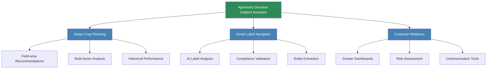
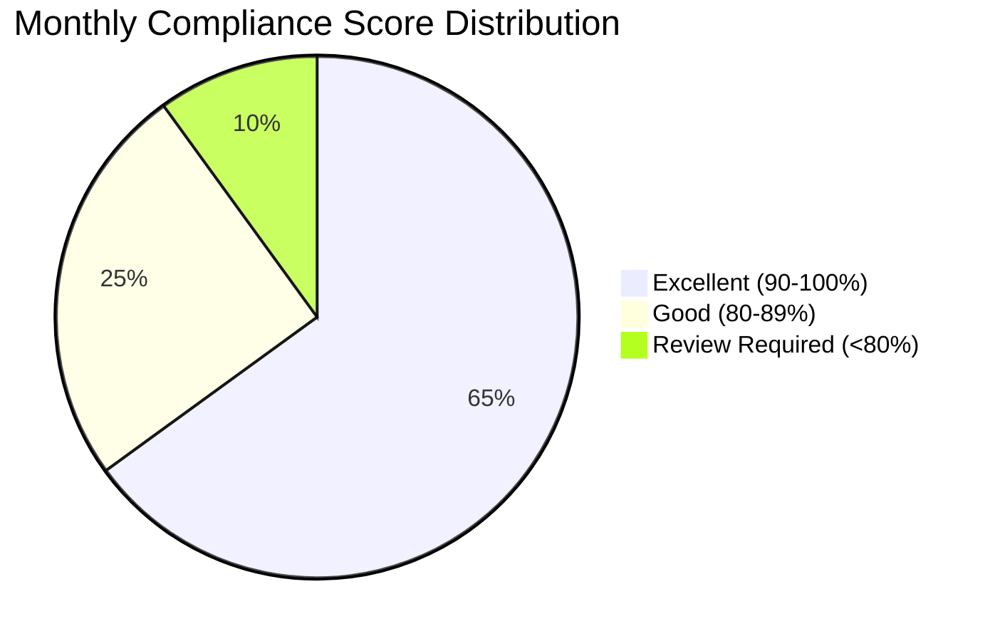

# Business Use Case and Objectives
## Agronomy Decision Support Assistant

---

## Executive Summary

The Agronomy Decision Support Assistant is an AI-powered platform designed to revolutionize agricultural operations through intelligent decision-making tools. This comprehensive solution addresses critical pain points in modern agriculture, including crop selection optimization, regulatory compliance, and customer relationship management.

**Target Market:** Agricultural service providers, agronomists, crop consultants, and farming operations
**Primary Value Proposition:** Data-driven insights that improve crop yields, reduce compliance risks, and enhance customer engagement

---

## Business Problem Statement

### Current Challenges in Agricultural Operations

#### 1. Crop Planning Complexity
- **Challenge:** Farmers face increasingly complex decisions about crop selection based on multiple variables (soil conditions, weather patterns, historical performance)
- **Impact:** Suboptimal crop choices leading to reduced yields and profitability
- **Cost:** Estimated 10-15% yield loss due to poor crop selection decisions

#### 2. Regulatory Compliance Burden
- **Challenge:** Agricultural product labels contain complex regulatory information (EPA registrations, PHI/REI intervals, application restrictions)
- **Impact:** Manual label interpretation is time-consuming and error-prone
- **Cost:** Compliance violations can result in fines ranging from $5,000 to $50,000+ per incident

#### 3. Customer Relationship Management
- **Challenge:** Agronomists manage multiple growers with diverse needs and field conditions
- **Impact:** Difficulty providing personalized, timely advice at scale
- **Cost:** Lost business opportunities and reduced customer satisfaction

#### 4. Data Fragmentation
- **Challenge:** Critical agricultural data exists in disparate systems (yield records, weather forecasts, soil tests)
- **Impact:** Inability to leverage integrated insights for better decisions
- **Cost:** Inefficient operations and missed optimization opportunities

---

## Solution Overview

### Core Capabilities

The Agronomy Decision Support Assistant delivers three integrated modules that address the key business challenges:

---

## Detailed Business Use Cases

### Use Case 1: Smart Crop Planning

**Persona:** Emily Rodriguez, Senior Agronomist at Midwest Agricultural Services

**Scenario:**
Emily manages 25 growers across three counties, each with multiple fields. Spring planning season requires her to recommend optimal crops for 150+ individual fields based on soil tests, weather forecasts, and historical yields.

**Traditional Process:**
- **Time:** 40+ hours of manual analysis per season
- **Tools:** Excel spreadsheets, printed soil reports, personal experience
- **Challenges:**
  - Cannot analyze all data points comprehensively
  - Recommendations based on limited subset of available information
  - Difficult to justify recommendations with data
  - No scenario comparison capability

**Solution Process:**
1. Upload three CSV files: historical yield data, weather forecasts, soil health reports
2. System automatically generates field-wise recommendations for all fields
3. Each recommendation includes:
   - Top 5 crop options ranked by suitability score (0-100)
   - Detailed reasoning based on soil pH, nutrients, weather conditions
   - Historical performance data for context
   - Risk factors and mitigation strategies

**Business Outcomes:**
- **Time Savings:** Reduces analysis time from 40 hours to 4 hours (90% reduction)
- **Quality:** Considers 15+ data points per field vs. 5-6 manual
- **Revenue Impact:** Enables serving 50% more clients with same staff
- **Yield Impact:** 5-8% average yield improvement through optimized crop selection

**ROI Example:**
- **Time Saved:** 36 hours × $75/hour = $2,700 per season
- **Additional Revenue:** 3 new clients × $5,000/client = $15,000 per season
- **Grower Benefit:** 1,000 acres × 10 bu/acre increase × $4.50/bu = $45,000 increased revenue

---

### Use Case 2: Smart Label Navigator with Compliance Automation

**Persona:** Marcus Chen, Compliance Manager at AgriTech Solutions

**Scenario:**
Marcus is responsible for ensuring that all product recommendations comply with federal and state regulations. His team evaluates 200+ product labels monthly for various applications across different crops and regions.

**Traditional Process:**
- **Time:** 15-20 minutes per label for manual review
- **Total Time:** 50+ hours per month
- **Error Rate:** 3-5% compliance issues identified in audits
- **Tools:** Physical labels, PDF documents, regulatory reference guides

**Solution Process:**
1. Upload product label image (photo or scan)
2. AI-powered GPT-4 Vision analyzes label and extracts:
   - Product name and manufacturer
   - Active ingredients with concentrations and CAS numbers
   - EPA registration number
   - Signal words (CAUTION, WARNING, DANGER)
   - Application rates and timing
   - PHI (Pre-Harvest Interval) and REI (Re-Entry Interval)
   - Target crops and restrictions
3. System performs automated compliance validation:
   - EPA registration verification
   - Signal word compliance
   - Application rate specifications
   - Safety interval completeness
   - Regional compliance assessment
4. Generates compliance score (0-100%) with detailed breakdown
5. Provides actionable recommendations and downloadable report

**Business Outcomes:**
- **Time Savings:** Reduces review time from 15 minutes to 2 minutes per label (87% reduction)
- **Quality:** Consistent compliance scoring vs. variable manual review
- **Risk Reduction:** Reduces compliance issues from 3-5% to <1%
- **Audit Readiness:** Automatic documentation and audit trail

**ROI Example:**
- **Time Saved:** 200 labels × 13 minutes × $60/hour = $2,600 per month
- **Risk Avoidance:** Prevention of 1 violation × $15,000 average fine = $15,000 per year
- **Efficiency:** Enables 3x more label reviews with same staff

**Compliance Dashboard Metrics:**

---

### Use Case 3: Customer Relations & Grower Dashboards

**Persona:** Sarah Thompson, Agricultural Account Manager

**Scenario:**
Sarah manages relationships with 40 grower operations, requiring regular communication about field conditions, alerts, and recommendations. She needs to provide timely, personalized service while managing a large portfolio.

**Traditional Process:**
- **Communication:** Generic email updates sent weekly
- **Monitoring:** Manual review of individual grower data
- **Response Time:** 24-48 hours for custom reports
- **Personalization:** Limited due to time constraints

**Solution Process:**
1. Access personalized grower dashboard for each customer
2. Real-time visibility into:
   - Total acres and active fields
   - Average yield and performance metrics
   - Risk scores and trending indicators
   - Recent alerts (weather, pest, disease, nutrients)
   - Field-by-field performance visualization
3. AI Communication Assistant generates:
   - Personalized weekly updates
   - Alert notifications with urgency levels
   - Custom recommendations based on field data
   - Performance reports
4. Risk Assessment tools provide:
   - Predictive risk scoring (weather, market, operational, financial)
   - Historical risk trends
   - Mitigation recommendations
5. Performance Analytics track:
   - Customer satisfaction scores
   - Service utilization rates
   - Response times
   - Engagement metrics

**Business Outcomes:**
- **Customer Satisfaction:** Increases from 4.2/5 to 4.8/5
- **Response Time:** Reduces from 24-48 hours to 2-4 hours
- **Communication Quality:** Personalized vs. generic updates
- **Portfolio Growth:** Enables managing 60% more growers with same resources

**ROI Example:**
- **Retention:** 5% improvement in retention × 40 clients × $5,000 = $10,000 per year
- **Upsell:** Improved service enables 20% upsell rate × 8 clients × $2,000 = $16,000 per year
- **Efficiency:** 10 hours saved per week × $65/hour × 52 weeks = $33,800 per year

---

## Business Objectives

### Primary Objectives

#### 1. Operational Efficiency
**Target:** Reduce time spent on routine agricultural analysis by 80%

**Metrics:**
- Crop planning time: 40 hours → 4 hours (90% reduction)
- Label compliance review: 15 minutes → 2 minutes per label (87% reduction)
- Customer report generation: 2 hours → 15 minutes (87.5% reduction)

#### 2. Decision Quality
**Target:** Improve crop yield outcomes by 5-10% through data-driven recommendations

**Metrics:**
- Number of data points analyzed per decision: 5 → 15+ (3x increase)
- Recommendation accuracy: Track actual vs. predicted yields
- Compliance error rate: 3-5% → <1% (80% reduction)

#### 3. Revenue Growth
**Target:** Enable 50% increase in client portfolio without proportional staff increase

**Metrics:**
- Clients per agronomist: 25 → 37-40 (48-60% increase)
- Service delivery cost per client: Reduced by 40%
- Upsell rate: Increase from 10% to 20%

#### 4. Risk Mitigation
**Target:** Reduce compliance-related incidents by 90%

**Metrics:**
- Compliance violations: 3-5 per year → <1 per year
- Audit findings: Track reduction in audit issues
- Financial risk exposure: Reduce potential fines by $50,000+ per year

### Secondary Objectives

#### 5. Customer Satisfaction
**Target:** Increase customer satisfaction scores from 4.2/5 to 4.8/5

**Metrics:**
- Net Promoter Score (NPS)
- Customer retention rate
- Service utilization rates
- Response time to customer inquiries

#### 6. Competitive Differentiation
**Target:** Establish technology leadership in agricultural advisory services

**Metrics:**
- Win rate for new business proposals
- Market share in target segments
- Brand recognition for innovation

---

## Target User Personas

### Persona 1: The Senior Agronomist
**Name:** Dr. Emily Rodriguez
**Role:** Senior Crop Consultant
**Company:** Midwest Agricultural Services

**Profile:**
- Age: 38
- Education: PhD in Agronomy
- Experience: 15 years in agricultural consulting
- Territory: 25 growers across 3 counties
- Tech Proficiency: Moderate to high

**Goals:**
- Provide best-in-class recommendations to growers
- Maximize yield outcomes for clients
- Expand client base without compromising service quality
- Stay current with latest agricultural research and practices

**Pain Points:**
- Too much data, not enough time to analyze comprehensively
- Difficulty justifying recommendations with data
- Cannot serve more clients without sacrificing quality
- Manual processes limit ability to consider all relevant factors

**How Solution Helps:**
- Rapid analysis of multi-source data
- Data-backed recommendations with clear reasoning
- Ability to serve more clients with same quality
- Comprehensive factor consideration in every recommendation

---

### Persona 2: The Compliance Manager
**Name:** Marcus Chen
**Role:** Regulatory Compliance Manager
**Company:** AgriTech Solutions

**Profile:**
- Age: 42
- Education: BS in Agricultural Sciences, MBA
- Experience: 12 years in agricultural compliance
- Scope: 200+ product evaluations per month
- Tech Proficiency: High

**Goals:**
- Ensure 100% regulatory compliance
- Minimize compliance risk and violations
- Streamline compliance review processes
- Maintain comprehensive audit trails

**Pain Points:**
- Manual label review is time-consuming and error-prone
- Inconsistent interpretation across team members
- Difficulty maintaining current with changing regulations
- Audit preparation requires extensive documentation

**How Solution Helps:**
- Automated label analysis with AI-powered OCR
- Consistent compliance scoring across all reviews
- Comprehensive entity extraction and validation
- Automatic documentation and audit trail generation

---

### Persona 3: The Account Manager
**Name:** Sarah Thompson
**Role:** Agricultural Account Manager
**Company:** Prairie Crop Services

**Profile:**
- Age: 34
- Education: BS in Agricultural Business
- Experience: 8 years in agricultural sales and service
- Portfolio: 40 grower relationships
- Tech Proficiency: Moderate

**Goals:**
- Build strong, lasting customer relationships
- Provide personalized, timely service to all clients
- Identify upsell and cross-sell opportunities
- Maintain high customer satisfaction and retention

**Pain Points:**
- Cannot personalize communications at scale
- Reactive rather than proactive customer service
- Limited visibility into customer operations
- Difficulty tracking customer satisfaction and engagement

**How Solution Helps:**
- Personalized grower dashboards with real-time insights
- AI-powered communication assistant for personalized messages
- Proactive alerts and risk assessment
- Performance analytics and engagement tracking

---

## Business Process Transformation

### Before Implementation

**Characteristics:**
- Manual data consolidation from multiple sources
- Limited analysis due to time constraints
- Generic recommendations lacking comprehensive analysis
- Inconsistent documentation
- Reactive customer service

### After Implementation

**Characteristics:**
- Automated data integration from CSV uploads
- Comprehensive AI-powered analysis of all factors
- Personalized, data-backed recommendations at scale
- Automatic documentation and audit trails
- Proactive customer service with alerts and monitoring

---

## Success Metrics & KPIs

### Operational Metrics

| Metric | Baseline | Target | Measurement Frequency |
|--------|----------|--------|----------------------|
| Crop Planning Time (per season) | 40 hours | 4 hours | Quarterly |
| Label Review Time (per label) | 15 minutes | 2 minutes | Monthly |
| Customer Report Generation | 2 hours | 15 minutes | Monthly |
| Data Analysis Completeness | 5 factors | 15+ factors | Per analysis |

### Quality Metrics

| Metric | Baseline | Target | Measurement Frequency |
|--------|----------|--------|----------------------|
| Yield Improvement | 0% | 5-10% | Annually |
| Compliance Error Rate | 3-5% | <1% | Quarterly |
| Recommendation Accuracy | Track from baseline | +20% | Annually |
| Customer Satisfaction | 4.2/5 | 4.8/5 | Quarterly |

### Financial Metrics

| Metric | Baseline | Target | Measurement Frequency |
|--------|----------|--------|----------------------|
| Clients per Agronomist | 25 | 37-40 | Quarterly |
| Service Delivery Cost | $200/client | $120/client | Quarterly |
| Revenue per Agronomist | $125,000 | $187,500 | Annually |
| Compliance Risk Exposure | $50,000+ | <$5,000 | Annually |

### Customer Success Metrics

| Metric | Baseline | Target | Measurement Frequency |
|--------|----------|--------|----------------------|
| Customer Retention Rate | 85% | 95% | Annually |
| Net Promoter Score (NPS) | 35 | 60 | Quarterly |
| Service Utilization Rate | 65% | 87% | Monthly |
| Response Time | 24-48 hours | 2-4 hours | Weekly |

---

## Competitive Advantage

### Key Differentiators

#### 1. Integrated Platform Approach
**Advantage:** Single platform addressing multiple pain points vs. point solutions
- Crop planning, compliance, and customer relations in one system
- Shared data model eliminates duplicate entry
- Holistic view of operations

#### 2. AI-Powered Intelligence
**Advantage:** Advanced AI capabilities including GPT-4 Vision for label analysis
- Automated entity extraction from images
- Comprehensive multi-factor analysis
- Predictive risk assessment
- Natural language communication generation

#### 3. Field-Level Granularity
**Advantage:** Individual field recommendations vs. farm-level generalizations
- Recognizes variability across fields
- Optimizes every acre
- Detailed tracking and performance measurement

#### 4. Compliance Automation
**Advantage:** Automated regulatory compliance vs. manual review
- Consistent, accurate compliance scoring
- Automatic audit trail
- Reduced risk exposure

#### 5. Scalable Service Delivery
**Advantage:** Technology enables serving more clients without proportional cost increase
- 50-60% increase in client capacity per agronomist
- Maintained or improved service quality
- Improved profitability

---

## Market Opportunity

### Target Market Segments

#### Primary Segment: Agricultural Service Providers
- **Market Size:** 15,000+ agricultural consulting firms in North America
- **Average Clients per Consultant:** 20-30 growers
- **Service Revenue:** $3,000-$8,000 per grower per year
- **Pain Point:** Scalability limitations with current manual processes

#### Secondary Segment: Large Farming Operations
- **Market Size:** 25,000+ farms with 1,000+ acres
- **Internal Agronomy Teams:** 1-5 agronomists per operation
- **Pain Point:** Data fragmentation and analysis complexity

#### Tertiary Segment: Agricultural Input Retailers
- **Market Size:** 8,000+ retail locations with agronomy services
- **Agronomist Ratio:** 1 agronomist per 3-5 retail locations
- **Pain Point:** Consistency and quality of recommendations across locations

### Total Addressable Market (TAM)

**Primary Market Calculation:**
- 15,000 consulting firms × 2 agronomists average = 30,000 agronomists
- 30,000 agronomists × $5,000 annual subscription = **$150M annual market**

**Growth Drivers:**
- Increasing farm sizes requiring professional management
- Growing regulatory complexity
- Labor shortage in agricultural sector
- Demand for data-driven decision making
- Climate variability increasing decision complexity

---

## Implementation Roadmap

### Phase 1: Pilot Program (Months 1-3)
**Objective:** Validate solution with 3-5 early adopter customers

**Activities:**
- Select pilot customers across different use cases
- Deploy prototype with full feature set
- Conduct weekly feedback sessions
- Track baseline and improved metrics
- Refine features based on user feedback

**Success Criteria:**
- 80%+ time savings on target workflows
- 90%+ user satisfaction with core features
- Documented ROI for each pilot customer

### Phase 2: Limited Release (Months 4-6)
**Objective:** Expand to 15-20 customers with refined solution

**Activities:**
- Implement enhancements from pilot feedback
- Develop customer onboarding program
- Create training materials and documentation
- Establish customer support processes
- Begin collecting success stories and case studies

**Success Criteria:**
- 95%+ customer retention from pilot program
- <2 week average time to value for new customers
- 3+ documented case studies with measurable ROI

### Phase 3: General Availability (Months 7-12)
**Objective:** Scale to 100+ customers with full commercial offering

**Activities:**
- Launch marketing and sales programs
- Implement scalable onboarding automation
- Establish customer success team
- Build partner ecosystem
- Continuous feature enhancement

**Success Criteria:**
- 50+ new customer acquisitions
- 90%+ customer retention rate
- $500K+ annual recurring revenue
- <5% churn rate

---

## Risk Assessment & Mitigation

### Business Risks

| Risk | Probability | Impact | Mitigation Strategy |
|------|------------|---------|---------------------|
| User adoption resistance | Medium | High | Comprehensive training, clear ROI demonstration, pilot success stories |
| Data quality issues | Medium | Medium | Data validation tools, clear data requirements, template provision |
| Competitive response | Medium | Medium | Continuous innovation, customer lock-in through integrations |
| Regulatory changes | Low | High | Flexible compliance engine, regular regulatory updates |
| Market timing | Low | Medium | Pilot validation, phased rollout approach |

### Technical Risks

| Risk | Probability | Impact | Mitigation Strategy |
|------|------------|---------|---------------------|
| AI model accuracy | Low | High | Human-in-the-loop validation, confidence scoring, continuous model improvement |
| API dependencies (OpenAI) | Medium | Medium | Fallback mechanisms, multiple provider support, caching strategies |
| Scalability issues | Low | Medium | Cloud-native architecture, performance testing, incremental scaling |
| Data security concerns | Low | High | Industry-standard encryption, compliance certifications, security audits |

---

## Conclusion

The Agronomy Decision Support Assistant addresses critical business needs in agricultural operations through an integrated, AI-powered platform. With clear ROI demonstrated across operational efficiency, decision quality, and revenue growth, the solution provides compelling value to agricultural service providers and farming operations.

**Key Business Benefits:**
- **80-90% time savings** on routine agricultural analysis tasks
- **5-10% yield improvement** through optimized crop selection
- **50-60% increase** in client capacity per agronomist
- **90% reduction** in compliance-related risks
- **40% reduction** in service delivery costs

The phased implementation approach minimizes risk while allowing for continuous refinement based on customer feedback. With a clear target market, strong competitive advantages, and demonstrated business value, the Agronomy Decision Support Assistant is positioned to transform agricultural decision-making and service delivery.
