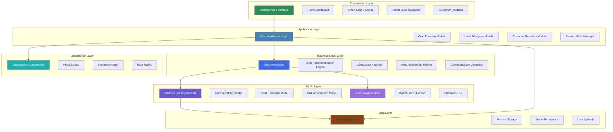
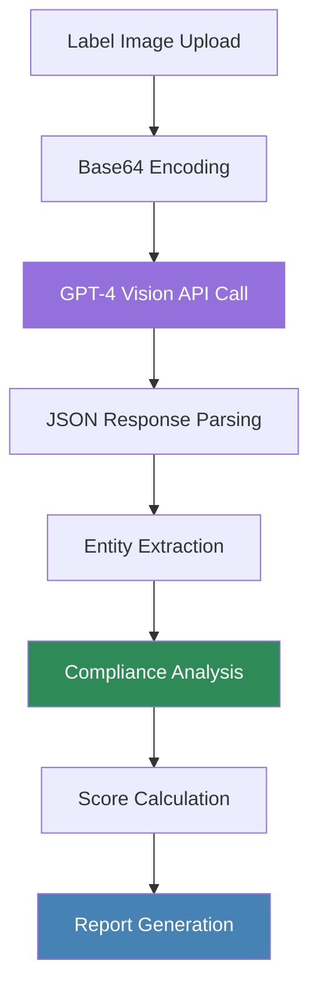
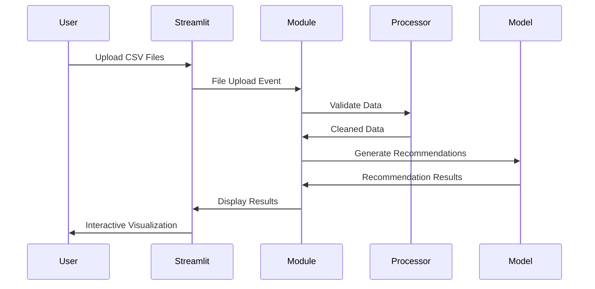
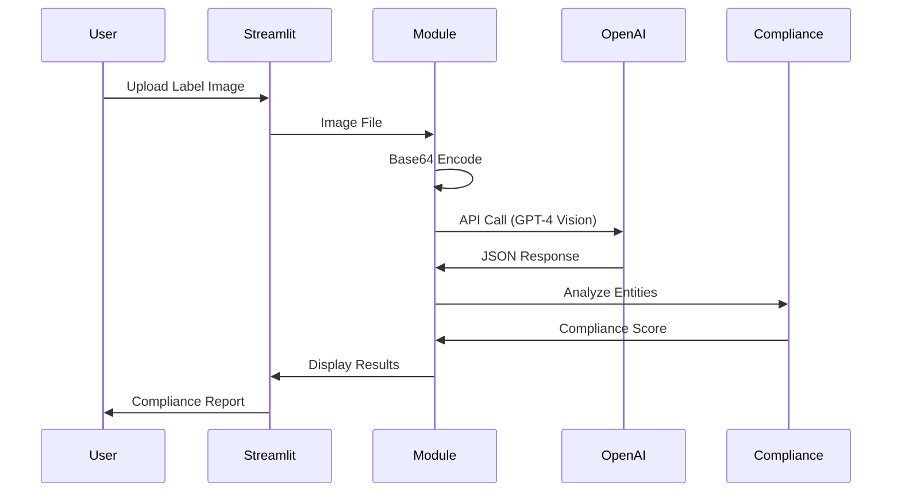
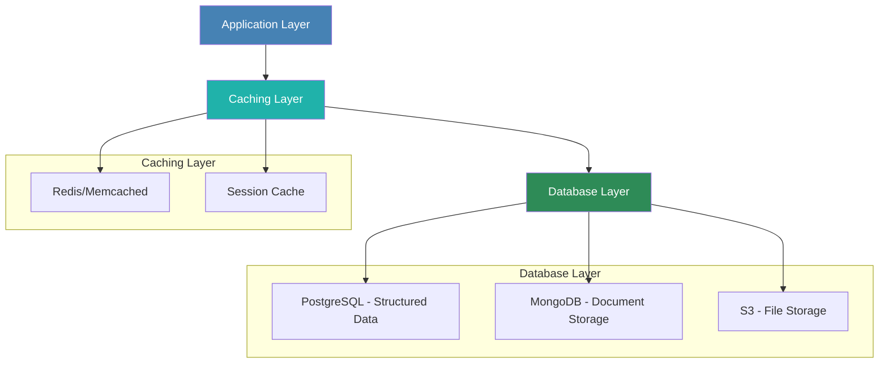
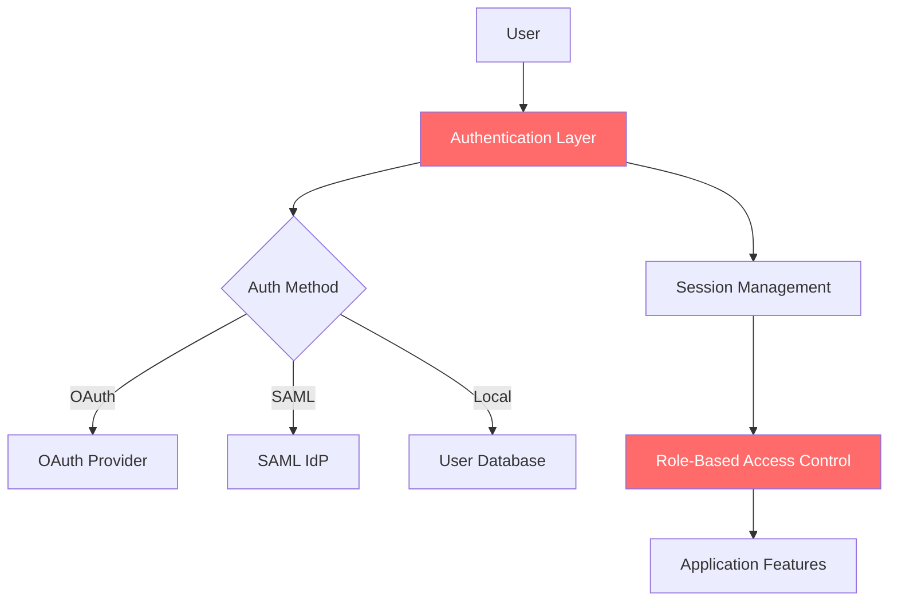
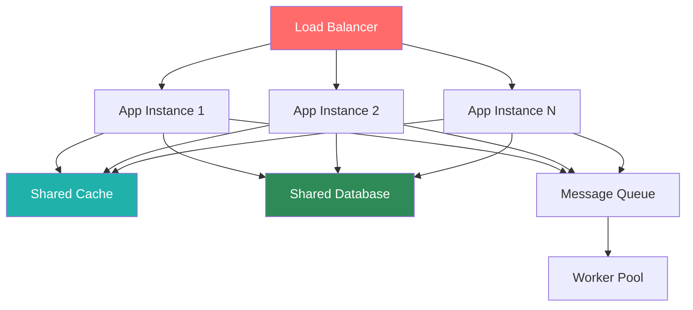
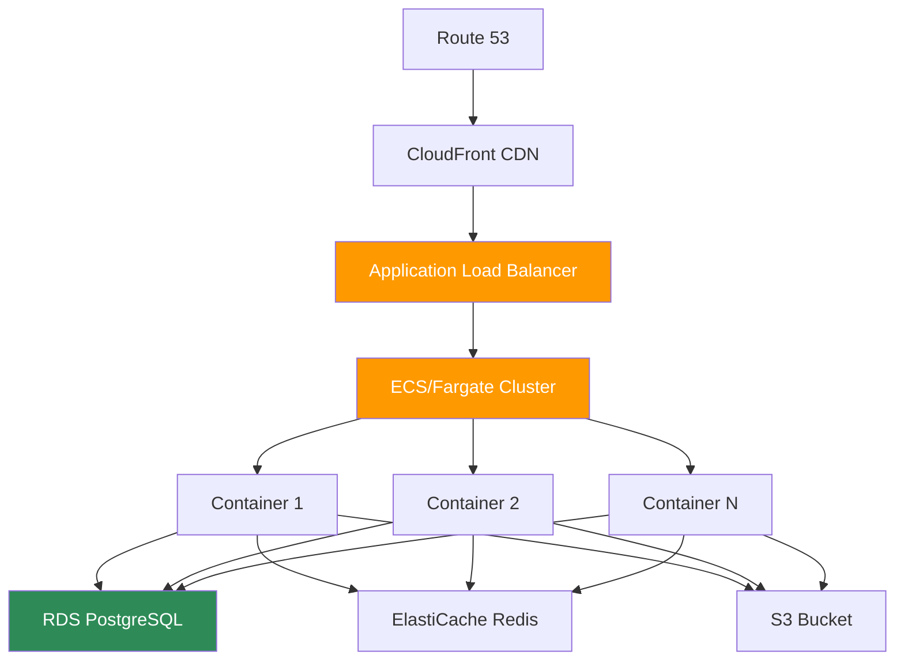

# Technical Architecture
## Agronomy Decision Support Assistant

---

## System Overview

The Agronomy Decision Support Assistant is built on a modern, modular architecture leveraging Python-based web technologies, machine learning frameworks, and cloud-ready AI services. The system is designed for scalability, maintainability, and extensibility.

### Architecture Principles

1. **Modular Design:** Clear separation of concerns with independent, reusable modules
2. **Cloud-Native:** Stateless application design suitable for cloud deployment
3. **API-First:** Integration-ready with external services and data sources
4. **Data-Driven:** Machine learning models at the core of decision-making
5. **Responsive:** Real-time analysis and interactive visualizations

---

## High-Level Architecture



---

## Technology Stack

### Core Framework

#### Streamlit (v1.46.1+)
**Purpose:** Web application framework and UI layer

**Key Features:**
- Rapid development with Python-native UI components
- Automatic reactive updates based on user interactions
- Built-in session state management
- Native support for data visualizations
- Easy deployment to cloud platforms

**Usage in System:**
- Primary web interface framework
- Page navigation and routing
- Form handling and user inputs
- Component rendering and layout management

```python
# Example: Streamlit Configuration
st.set_page_config(
    page_title="Agronomy Decision Support Assistant",
    page_icon="🌾",
    layout="wide",
    initial_sidebar_state="expanded"
)
```

### Data Processing Stack

#### Pandas (v2.3.1+)
**Purpose:** Data manipulation and analysis

**Key Features:**
- DataFrame operations for structured data
- CSV file reading and processing
- Data aggregation and transformation
- Time series analysis

**Usage in System:**
- Processing uploaded CSV files (yield, weather, soil data)
- Field-level data aggregation
- Historical performance analysis
- Data cleaning and validation

#### NumPy (v2.3.1+)
**Purpose:** Numerical computing and array operations

**Key Features:**
- High-performance array operations
- Mathematical functions
- Random number generation
- Statistical computations

**Usage in System:**
- Feature engineering for ML models
- Numerical calculations in crop models
- Statistical analysis
- Synthetic data generation

### Machine Learning Stack

#### Scikit-learn (v1.7.0+)
**Purpose:** Machine learning algorithms and utilities

**Key Components:**
- **RandomForestRegressor:** Crop recommendation and risk assessment
- **GradientBoostingRegressor:** Yield prediction
- **StandardScaler:** Feature normalization
- **LabelEncoder:** Categorical variable encoding

**Model Architecture:**
```python
class CropRecommendationModel:
    def __init__(self):
        self.model = RandomForestRegressor(n_estimators=100, random_state=42)
        self.scaler = StandardScaler()
        self.label_encoder = LabelEncoder()
        self.feature_columns = [
            'field_size', 'ph_level', 'organic_matter',
            'growing_season_length', 'previous_yield',
            'soil_type_encoded', 'region_encoded'
        ]
```

**Training Process:**
1. Generate or load training data
2. Feature engineering and encoding
3. Train-test split (80/20)
4. Feature scaling
5. Model training with cross-validation
6. Performance evaluation

#### Joblib (v1.5.1+)
**Purpose:** Model persistence and serialization

**Usage:**
- Saving trained ML models to disk
- Loading pre-trained models for inference
- Efficient serialization of large numpy arrays

### AI Services Integration

#### OpenAI GPT-4 Vision (v1.93.2+)
**Purpose:** Advanced image analysis and entity extraction from product labels

**Key Features:**
- Visual content understanding
- Optical character recognition (OCR)
- Structured data extraction from images
- Multi-modal reasoning (text + image)

**API Configuration:**
```python
from openai import OpenAI

client = OpenAI(api_key=os.environ.get("OPENAI_API_KEY"))

response = client.chat.completions.create(
    model="gpt-4o",  # GPT-4 with vision
    messages=[{
        "role": "user",
        "content": [
            {"type": "text", "text": "Extract product information..."},
            {"type": "image_url", "image_url": {"url": f"data:image/jpeg;base64,{base64_image}"}}
        ]
    }],
    max_tokens=1000,
    response_format={"type": "json_object"}
)
```

**Extracted Entities:**
- Product name and manufacturer
- Active ingredients with concentrations
- EPA registration numbers
- Signal words (CAUTION, WARNING, DANGER)
- Application rates and timing
- PHI/REI safety intervals
- Target crops and restrictions

### Visualization Stack

#### Plotly (v6.2.0+)
**Purpose:** Interactive data visualizations

**Key Components:**
- **plotly.express:** Quick statistical charts
- **plotly.graph_objects:** Custom interactive visualizations
- **Scatter plots:** Field performance analysis
- **Bar charts:** Compliance scoring, risk factors
- **Line charts:** Trend analysis, historical data

**Example Visualizations:**
```python
# Field Performance Scatter Plot
fig = px.scatter(
    fields_data,
    x='Acres',
    y='Projected_Yield',
    color='Health_Score',
    size='Acres',
    hover_data=['Field', 'Crop'],
    title="Field Performance Overview"
)
st.plotly_chart(fig, use_container_width=True)
```

#### Folium (v0.20.0+) with Streamlit-Folium (v0.25.0+)
**Purpose:** Geospatial mapping and field visualization

**Capabilities:**
- Interactive maps with field boundaries
- Marker-based field identification
- Heatmaps for spatial analysis
- Custom map layers

### Image Processing Stack

#### Pillow (PIL) (v11.3.0+)
**Purpose:** Image loading and preprocessing

**Usage:**
- Opening uploaded image files
- Image format conversion
- Display in Streamlit interface
- Preprocessing for AI analysis

#### OpenCV (v4.11.0.86+)
**Purpose:** Advanced computer vision operations

**Usage:**
- Image enhancement and preprocessing
- Quality assessment of uploaded images
- Future: Automated field image analysis

---

## System Components

### 1. Application Entry Point

**File:** `/app.py`

**Responsibilities:**
- Streamlit page configuration
- Navigation menu management
- Session state initialization
- Module routing
- Custom CSS styling

**Key Functions:**
```python
def main():
    # Sidebar navigation with session state
    # Page routing logic
    # Module initialization

def show_home_page():
    # Feature overview
    # Quick statistics
    # Navigation buttons
    # System information
```

### 2. Smart Crop Planning Module

**File:** `/modules/crop_planning_new.py`

**Responsibilities:**
- CSV file upload handling (yield, weather, soil data)
- Data validation and preprocessing
- Field-wise crop recommendations
- Suitability scoring algorithms
- Historical performance integration

**Data Flow:**


**Core Algorithm:**
```python
def calculate_crop_suitability(ph, organic_carbon, nitrogen,
                              phosphorus, potassium, weather_data):
    """
    Multi-factor suitability scoring:
    - pH suitability (30% weight)
    - Nutrient availability (40% weight)
    - Weather suitability (30% weight)
    - Organic matter bonus (up to 10 points)

    Returns: Suitability score (0-100)
    """
```

**Input Data Schemas:**

**Yield Data CSV:**
```
Year, Region, Field, Crop, Yield (t/ha)
2023, Prairie, Field 1, Corn, 185.5
2023, Prairie, Field 2, Soybeans, 65.2
```

**Weather Data CSV:**
```
Field, Date, Temperature (°C), Precipitation (mm), Humidity (%)
Field 1, 2024-05-01, 18.5, 12.3, 65
Field 1, 2024-05-02, 20.1, 0, 58
```

**Soil Data CSV:**
```
Region, Field, Soil pH, Soil Organic Carbon (%), Available N (kg/ha), Available P (kg/ha), Available K (kg/ha)
Prairie, Field 1, 6.5, 3.2, 120, 45, 180
```

### 3. Smart Label Navigator Module

**File:** `/modules/label_navigator.py`

**Responsibilities:**
- Image upload and display
- GPT-4 Vision integration
- Entity extraction from labels
- Compliance validation
- Report generation

**Processing Pipeline:**


**Compliance Scoring Algorithm:**
```python
def analyze_compliance(entities, region_context):
    """
    Multi-factor compliance scoring:
    - EPA registration validation (100 or 0)
    - Signal word compliance (100 or 60)
    - Application rate specification (95 or 70)
    - PHI/REI completeness (95, 80, or 60)
    - Product type classification (90)
    - Regional compliance (85 or 95)

    Returns: Overall score (0-100), detailed breakdown, recommendations
    """
```

**Extracted Data Structure:**
```json
{
  "product_name": "RoundUp PowerMax 3",
  "manufacturer": "Bayer CropScience",
  "active_ingredients": [
    {
      "name": "Glyphosate",
      "concentration": "48.7%",
      "cas_number": "1071-83-6"
    }
  ],
  "epa_registration": "EPA Reg. No. 524-549",
  "signal_word": "CAUTION",
  "application_rate": "1.5-2.25 L/ha",
  "target_crops": ["Corn", "Soybeans", "Wheat"],
  "phi_days": "Not applicable (pre-harvest)",
  "rei_hours": "4 hours",
  "restrictions": [
    "Do not apply within 30m of water bodies",
    "Maximum 2 applications per season"
  ],
  "product_type": "herbicide"
}
```

### 4. Customer Relations Module

**File:** `/modules/customer_relations.py`

**Responsibilities:**
- Grower dashboard generation
- Performance analytics
- Risk assessment
- Communication assistant
- Historical tracking

**Components:**

**Grower Dashboard:**
- Key metrics (acres, fields, yield, risk)
- Real-time alerts (weather, pest, disease, nutrients)
- Field performance visualization
- Historical trends

**Communication Assistant:**
- Message template generation
- Personalization based on grower data
- Urgency level management
- Multi-format support (email, SMS, report)

**Risk Assessment:**
- Weather risk calculation
- Market risk evaluation
- Operational risk assessment
- Financial risk analysis
- Trend visualization

**Performance Analytics:**
- Customer satisfaction tracking
- Service utilization metrics
- Response time monitoring
- Engagement analysis

### 5. Machine Learning Models

**Directory:** `/models/`

#### Crop Model (`crop_model.py`)
**Purpose:** Comprehensive crop modeling system

**Capabilities:**
- Yield prediction based on environmental factors
- Growth stage simulation
- Crop suitability assessment
- Management practice optimization

**Crop Database:**
```python
crop_database = {
    'Corn': {
        'scientific_name': 'Zea mays',
        'growth_characteristics': {
            'base_temperature': 10,
            'optimal_temperature': 25,
            'maturity_gdd': 2700,
            'growth_stages': ['Emergence', 'V6', 'VT', 'R1', 'R3', 'R6']
        },
        'yield_potential': {...},
        'nutrient_requirements': {...},
        'water_requirements': {...},
        'pest_susceptibility': {...},
        'disease_susceptibility': {...}
    },
    # Similar structures for Soybeans, Wheat, Canola
}
```

**Growth Models:**
- Temperature response model
- Water stress model
- Nutrient response model
- Phenology model

#### ML Models Utility (`/utils/ml_models.py`)

**CropRecommendationModel:**
- RandomForest-based recommendation engine
- Feature: field_size, ph_level, organic_matter, growing_season_length, etc.
- Output: Suitability score, expected yield, profit potential, risk level

**YieldPredictionModel:**
- GradientBoosting-based yield predictor
- Features: field_size, historical_yield, fertilizer_applied, GDD, precipitation, etc.
- Output: Predicted yield, confidence intervals, feature importance

**RiskAssessmentModel:**
- Multi-factor risk evaluation
- Risk categories: Weather, pest/disease, market, operational
- Output: Overall risk score, risk level, mitigation recommendations

### 6. Data Processors

**File:** `/utils/data_processor.py`

**Responsibilities:**
- Data cleaning and validation
- Feature engineering
- Data transformation
- Statistical analysis
- Missing data handling

### 7. Visualization Utilities

**File:** `/utils/visualization.py`

**Responsibilities:**
- Chart configuration templates
- Color scheme management
- Interactive component creation
- Map generation utilities

---

## Data Architecture

### Session State Management

Streamlit's session state is used for maintaining application state across user interactions:

```python
# Navigation state
st.session_state.page_selection = "🏠 Home"

# Uploaded data storage
st.session_state.yield_data = yield_dataframe
st.session_state.weather_data = weather_dataframe
st.session_state.soil_data = soil_dataframe

# Analysis results
st.session_state.compliance_analysis = compliance_data
st.session_state.compliance_analysis_history = [...]

# User preferences
st.session_state.selected_region = "Prairie"
st.session_state.selected_customer = "John Smith Farms"
```

### Data Flow Patterns

#### Pattern 1: CSV Upload and Analysis


#### Pattern 2: Image Analysis


### Data Storage Strategy

**Current Implementation (Prototype):**
- In-memory session storage
- No persistent database
- File-based model storage (joblib)

**Production Considerations:**


**Recommended Production Architecture:**
- **PostgreSQL:** User data, customer profiles, historical records
- **MongoDB:** Unstructured analysis results, compliance reports
- **S3/Cloud Storage:** Uploaded files, generated reports, model artifacts
- **Redis:** Session caching, real-time data

---

## API Integration Architecture

### External API Dependencies

#### 1. OpenAI API
**Endpoint:** `https://api.openai.com/v1/chat/completions`

**Authentication:**
```python
from openai import OpenAI
client = OpenAI(api_key=os.environ.get("OPENAI_API_KEY"))
```

**Rate Limiting:**
- Tier-based limits (vary by subscription)
- Implement retry logic with exponential backoff
- Consider request queuing for high volume

**Error Handling:**
```python
try:
    response = client.chat.completions.create(...)
except Exception as e:
    st.error(f"Error analyzing image: {str(e)}")
    st.info("Falling back to demo mode...")
    # Fallback to synthetic data
```

**Cost Optimization:**
- Cache common results
- Batch processing when possible
- Use appropriate token limits (max_tokens parameter)
- Monitor usage with API analytics

#### 2. Weather API (Future Integration)
**Purpose:** Real-time weather data and forecasts

**Recommended Providers:**
- OpenWeatherMap API
- Weather Underground API
- NOAA National Weather Service API

**Integration Points:**
- Real-time forecast updates
- Historical weather data
- Growing degree day calculations
- Alert notifications

#### 3. Market Data API (Future Integration)
**Purpose:** Commodity prices and market trends

**Recommended Providers:**
- USDA Agricultural Marketing Service
- CME Group Market Data
- Agricultural commodity exchanges

---

## Security Architecture

### Authentication & Authorization

**Current State (Prototype):**
- No authentication implemented
- Open access to all features

**Production Requirements:**


**Recommended Implementation:**
- OAuth 2.0 integration (Google, Microsoft)
- Role-based access control (RBAC)
- Session timeout management
- Audit logging

### Data Security

**In-Transit Security:**
- HTTPS/TLS encryption for all communications
- Secure API key storage
- Environment variable configuration

**At-Rest Security:**
- Encrypted database storage
- Secure file storage with access controls
- Key management service (KMS) integration

**API Key Management:**
```python
# Current implementation
import os
from dotenv import load_dotenv

load_dotenv()
api_key = os.environ.get("OPENAI_API_KEY")
```

**Production Best Practices:**
- Use secrets management service (AWS Secrets Manager, Azure Key Vault)
- Rotate API keys regularly
- Implement key usage monitoring
- Separate keys per environment (dev, staging, prod)

### Privacy & Compliance

**Data Handling:**
- Customer data privacy policies
- Data retention policies
- GDPR compliance (if applicable)
- Right to deletion implementation

**Audit Trail:**
- Log all user actions
- Track data access and modifications
- Compliance report generation
- Retention of audit logs

---

## Scalability & Performance

### Performance Optimization Strategies

#### 1. Caching
```python
@st.cache_data
def load_crop_database():
    """Cache crop database to avoid repeated loading"""
    return initialize_crop_database()

@st.cache_resource
def load_ml_model():
    """Cache ML model instance"""
    model = CropRecommendationModel()
    model.train_model()
    return model
```

#### 2. Lazy Loading
- Load modules only when needed
- Initialize ML models on first use
- Defer heavy computations until required

#### 3. Asynchronous Processing
**Future Enhancement:**
- Background job processing for long-running analyses
- Task queue (Celery, RQ) for batch operations
- WebSocket updates for real-time notifications

### Scalability Architecture



**Horizontal Scaling:**
- Stateless application design
- Shared session storage (Redis)
- Load balancer distribution
- Auto-scaling based on demand

**Vertical Scaling:**
- Optimize query performance
- Increase instance resources
- GPU acceleration for ML models (future)

---

## Deployment Architecture

### Development Environment

**Platform:** Replit
**Configuration:** `.replit` file
```toml
[run]
command = "streamlit run app.py --server.port 5000"

[env]
PYTHONPATH = "/home/runner/workspace"
```

**Package Management:** `pyproject.toml` with uv.lock
```toml
[project]
name = "agronomy-decision-support"
version = "0.1.0"
requires-python = ">=3.11"
dependencies = [
    "streamlit>=1.46.1",
    "pandas>=2.3.1",
    "scikit-learn>=1.7.0",
    "openai>=1.93.2",
    "plotly>=6.2.0",
    # ... additional dependencies
]
```

### Production Deployment Options

#### Option 1: Streamlit Cloud
**Pros:**
- Native Streamlit hosting
- Easy deployment from GitHub
- Automatic scaling
- Free tier available

**Deployment:**
```bash
# Push to GitHub
git push origin main

# Deploy via Streamlit Cloud dashboard
# Configure secrets in dashboard
```

#### Option 2: Docker Container
**Dockerfile:**
```dockerfile
FROM python:3.11-slim

WORKDIR /app

COPY pyproject.toml ./
RUN pip install --no-cache-dir -e .

COPY . .

EXPOSE 8501

CMD ["streamlit", "run", "app.py", "--server.port=8501", "--server.address=0.0.0.0"]
```

**Docker Compose:**
```yaml
version: '3.8'

services:
  app:
    build: .
    ports:
      - "8501:8501"
    environment:
      - OPENAI_API_KEY=${OPENAI_API_KEY}
    volumes:
      - ./data:/app/data
    restart: unless-stopped
```

#### Option 3: Cloud Platform (AWS/Azure/GCP)

**AWS Architecture:**


**Azure Architecture:**
- App Service for web hosting
- Azure Database for PostgreSQL
- Azure Cache for Redis
- Azure Blob Storage
- Application Insights for monitoring

**GCP Architecture:**
- Cloud Run for containerized app
- Cloud SQL for PostgreSQL
- Memorystore for Redis
- Cloud Storage for files
- Cloud Monitoring

---

## Monitoring & Observability

### Application Monitoring

**Metrics to Track:**
- Request latency and response times
- Error rates and types
- User session duration
- Feature usage statistics
- API call success/failure rates
- ML model inference time

**Recommended Tools:**
- Application Performance Monitoring (APM): New Relic, Datadog
- Log Aggregation: ELK Stack, Splunk
- Real-time Monitoring: Prometheus + Grafana

### Health Checks

```python
def health_check():
    """Application health check endpoint"""
    checks = {
        "status": "healthy",
        "timestamp": datetime.now().isoformat(),
        "components": {
            "streamlit": "ok",
            "openai_api": check_openai_api(),
            "ml_models": check_ml_models(),
            "session_state": "ok"
        }
    }
    return checks
```

### Logging Strategy

```python
import logging

logging.basicConfig(
    level=logging.INFO,
    format='%(asctime)s - %(name)s - %(levelname)s - %(message)s',
    handlers=[
        logging.FileHandler('app.log'),
        logging.StreamHandler()
    ]
)

logger = logging.getLogger(__name__)

# Usage
logger.info("User uploaded yield data")
logger.warning("API rate limit approaching")
logger.error("Model prediction failed", exc_info=True)
```

---

## Testing Strategy

### Unit Testing

```python
import pytest
from utils.ml_models import CropRecommendationModel

def test_crop_recommendation_model():
    model = CropRecommendationModel()
    recommendations = model.get_crop_recommendations(
        field_size=500,
        soil_type='Loam',
        ph_level=6.5,
        organic_matter=3.5,
        region='Prairie',
        growing_season_length=140,
        previous_yield=150
    )

    assert len(recommendations) > 0
    assert all(0 <= rec['suitability'] <= 100 for rec in recommendations)
    assert recommendations[0]['suitability'] >= recommendations[-1]['suitability']
```

### Integration Testing

```python
def test_label_analysis_integration():
    """Test label analysis with mocked OpenAI API"""
    with mock.patch('openai.OpenAI') as mock_openai:
        mock_openai.return_value.chat.completions.create.return_value = mock_response

        result = analyze_uploaded_label(
            uploaded_file=mock_image_file,
            analysis_depth="Standard Analysis",
            focus_areas=["Active Ingredients", "EPA Registration"],
            region_context="Canada"
        )

        assert result['product_name'] is not None
        assert result['epa_registration'] is not None
```

### Performance Testing

```python
def test_crop_recommendation_performance():
    """Ensure recommendations are generated within acceptable time"""
    import time

    model = CropRecommendationModel()

    start_time = time.time()
    recommendations = model.get_crop_recommendations(...)
    end_time = time.time()

    assert (end_time - start_time) < 1.0  # Must complete in <1 second
```

---

## Disaster Recovery & Business Continuity

### Backup Strategy

**Data Backup:**
- Daily automated backups of database
- Retention period: 30 days
- Point-in-time recovery capability
- Cross-region backup replication

**Model Backup:**
- Version control for model artifacts
- S3/cloud storage for trained models
- Model registry for versioning

### Failover Procedures

**API Failover:**
```python
def call_ai_api_with_fallback(request):
    """Try primary API, fall back to alternative or cache"""
    try:
        return primary_api.call(request)
    except PrimaryAPIException:
        logger.warning("Primary API failed, trying fallback")
        try:
            return fallback_api.call(request)
        except FallbackAPIException:
            logger.error("All APIs failed, using cached response")
            return get_cached_response(request)
```

**Service Redundancy:**
- Multi-region deployment
- Active-passive or active-active configuration
- Automatic health checks and failover

---

## Future Technical Enhancements

### Short-Term (3-6 months)
1. **Database Integration:** PostgreSQL for persistent data storage
2. **Authentication:** OAuth 2.0 user authentication
3. **API Rate Limiting:** Intelligent request throttling
4. **Advanced Caching:** Redis for session and result caching
5. **Batch Processing:** Background job queue for large datasets

### Medium-Term (6-12 months)
1. **Real-time Weather Integration:** Live weather data feeds
2. **Mobile Responsive Design:** Optimized mobile interface
3. **Offline Capability:** Progressive Web App (PWA) features
4. **Advanced Analytics:** Predictive modeling and forecasting
5. **Multi-tenancy:** Support for multiple organizations

### Long-Term (12+ months)
1. **Satellite Imagery Integration:** Field monitoring via satellite data
2. **IoT Sensor Integration:** Real-time soil and weather sensors
3. **Drone Image Analysis:** Automated field scouting
4. **Blockchain Integration:** Supply chain traceability
5. **Edge Computing:** On-farm processing capabilities

---

## Conclusion

The Agronomy Decision Support Assistant is built on a modern, scalable technical architecture that balances rapid development with production readiness. The modular design allows for easy enhancement and integration of new features, while the cloud-native approach ensures scalability to meet growing demand.

**Key Technical Strengths:**
- **Modular Architecture:** Clean separation of concerns
- **AI-Powered:** Advanced ML models and GPT-4 Vision integration
- **Scalable Design:** Ready for horizontal and vertical scaling
- **Cloud-Ready:** Deployable to major cloud platforms
- **Extensible:** Easy integration of new data sources and features

The architecture provides a solid foundation for current prototype capabilities while supporting future enhancements and production deployment.
