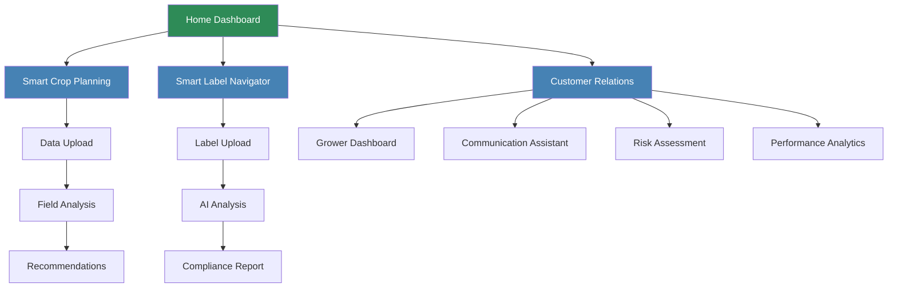
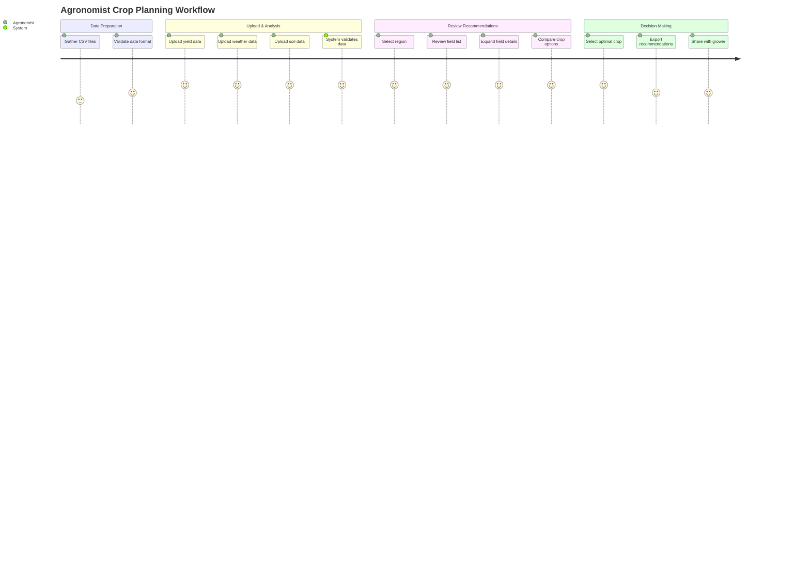
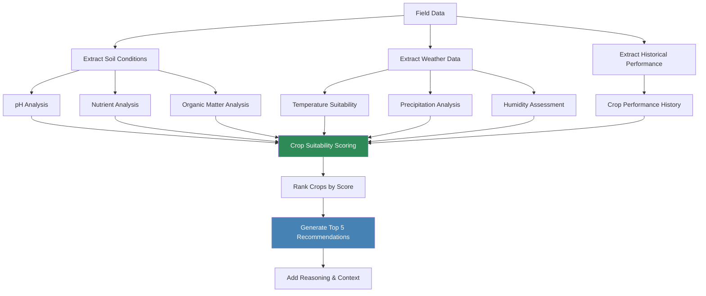
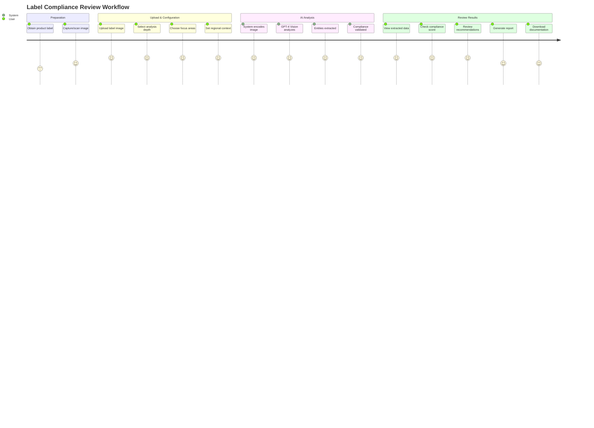
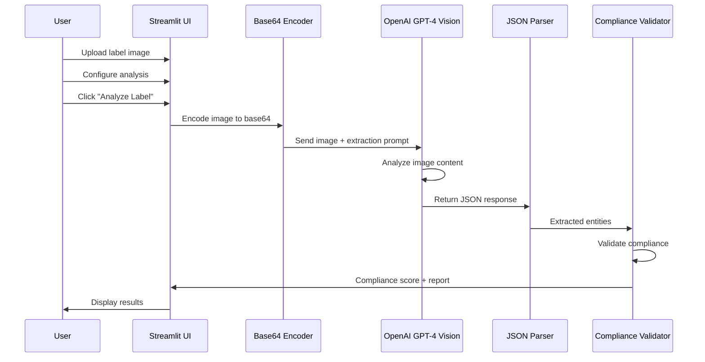
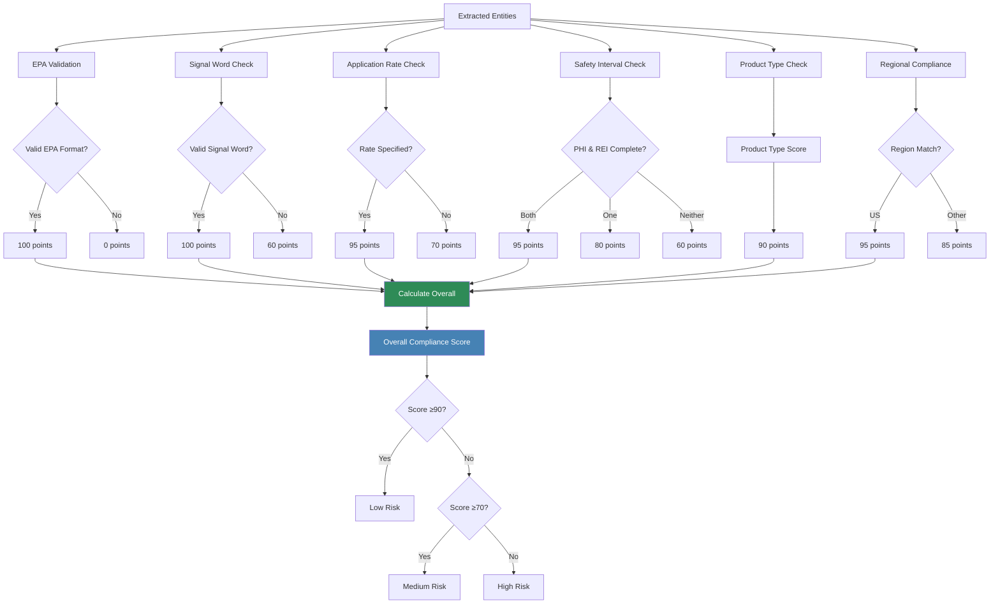
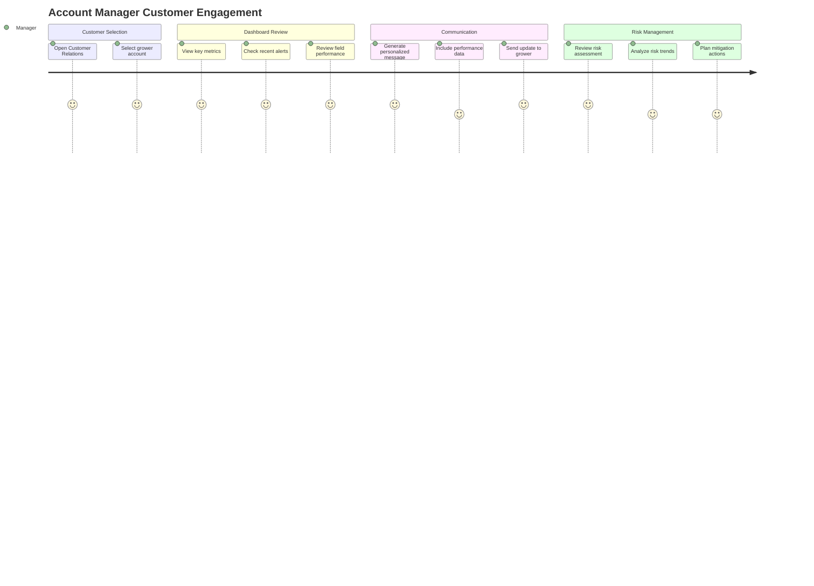
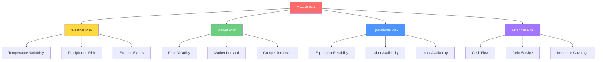
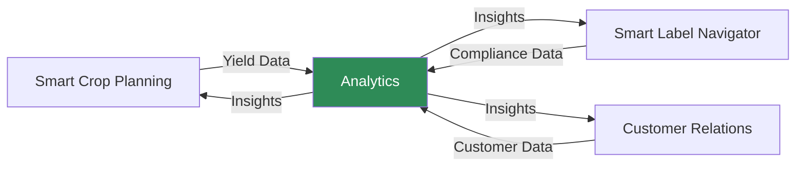

# Functional Architecture
## Agronomy Decision Support Assistant

---

## Overview

This document provides a comprehensive functional architecture overview of the Agronomy Decision Support Assistant, detailing user workflows, feature capabilities, business rules, and decision logic embedded in the system.

---

## System Navigation Flow



---

## Module 1: Smart Crop Planning

### Functional Overview

The Smart Crop Planning module enables agronomists to generate data-driven, field-specific crop recommendations by analyzing historical yield data, weather forecasts, and soil health information.

### User Journey



### Feature Breakdown

#### 1. Data Upload Interface

**Purpose:** Accept and validate three critical data sources

**Input Requirements:**

**Historical Yield Data:**
```
Required Columns:
- Year (YYYY format)
- Region (text)
- Field (text identifier)
- Crop (crop name)
- Yield (t/ha) (numeric)

Example:
Year,Region,Field,Crop,Yield (t/ha)
2023,Prairie,Field 1,Corn,185.5
2023,Prairie,Field 2,Soybeans,65.2
2022,Prairie,Field 1,Wheat,72.3
```

**Weather Forecast Data:**
```
Required Columns:
- Field (text identifier matching yield data)
- Date (YYYY-MM-DD format)
- Temperature (°C) (numeric)
- Precipitation (mm) (numeric)
- Humidity (%) (numeric, 0-100)

Example:
Field,Date,Temperature (°C),Precipitation (mm),Humidity (%)
Field 1,2024-05-01,18.5,12.3,65
Field 1,2024-05-02,20.1,0.0,58
```

**Soil Health Data:**
```
Required Columns:
- Region (text matching yield data)
- Field (text identifier matching yield data)
- Soil pH (numeric, typically 4.0-9.0)
- Soil Organic Carbon (%) (numeric)
- Available N (kg/ha) (numeric)
- Available P (kg/ha) (numeric)
- Available K (kg/ha) (numeric)

Example:
Region,Field,Soil pH,Soil Organic Carbon (%),Available N (kg/ha),Available P (kg/ha),Available K (kg/ha)
Prairie,Field 1,6.5,3.2,120,45,180
Prairie,Field 2,6.8,2.9,95,38,165
```

**Validation Rules:**
- File format: CSV only
- File size: Maximum 200MB
- Data types: Numeric fields must parse as numbers
- Field matching: Field identifiers must match across all three files
- Date format: ISO 8601 (YYYY-MM-DD)

**User Feedback:**
- Success: Green checkmark with "✅ [Data type] data uploaded"
- Failure: Red X with "❌ [Data type] upload failed"
- Partial upload: Info message guiding user to upload remaining files

#### 2. Region Selection & Filtering

**Purpose:** Allow agronomists to focus on specific geographic areas

**Functionality:**
- Extract unique regions from soil data
- Dropdown selection with "All" option
- Dynamic field count display
- Automatic recommendation filtering

**UI Component:**
```python
selected_region = st.selectbox(
    "Select Region",
    regions,  # ['Prairie', 'Eastern', 'Western', etc.]
    key="region_selector_new"
)
```

**Display:**
```
Recommendations for 12 fields in Prairie
```

#### 3. Field-Wise Recommendation Generation

**Purpose:** Provide tailored crop recommendations for each individual field

**Recommendation Algorithm:**



**Suitability Scoring Formula:**

```
Total Score (0-110) =
    pH Suitability (0-30 points, 30% weight) +
    Nutrient Availability (0-40 points, 40% weight) +
    Weather Suitability (0-30 points, 30% weight) +
    Organic Matter Bonus (0-10 points, bonus)

Where:

pH Suitability:
- Within optimal range: 30 points ("Optimal pH")
- Within ±0.5 of range: 21 points ("Good pH")
- Outside range: 9 points ("pH needs adjustment")

Nutrient Availability (N, P, K):
- N score = min(100, (available_N / required_N) × 100)
- P score = min(100, (available_P / required_P) × 100)
- K score = min(100, (available_K / required_K) × 100)
- Average score × 0.4 = nutrient points
- "Good nutrition" (≥80%), "Moderate nutrition" (≥60%), "Needs fertilizer" (<60%)

Weather Suitability:
- Temperature within optimal range: 30 points ("Good climate")
- Temperature within ±5°C of range: 21 points ("Fair climate")
- Temperature outside range: 12 points ("Climate challenge")

Organic Matter Bonus:
- >2.0%: +10 points ("High organic matter")
- 1.0-2.0%: +5 points
- <1.0%: 0 points
```

**Crop Requirements Database:**

| Crop | pH Range | N Need (kg/ha) | P Need (kg/ha) | K Need (kg/ha) | Temp Range (°C) |
|------|----------|----------------|----------------|----------------|-----------------|
| Wheat | 6.0-7.5 | 100 | 30 | 40 | 15-25 |
| Corn | 6.0-7.0 | 150 | 40 | 50 | 20-30 |
| Soybeans | 6.0-7.0 | 50 | 25 | 60 | 18-28 |
| Canola | 6.0-7.5 | 120 | 35 | 45 | 15-25 |
| Barley | 6.5-7.5 | 80 | 25 | 35 | 10-20 |

#### 4. Recommendation Display

**Field-Level Expandable View:**

Each field is displayed in an expandable section:

```
🌱 Field: Field 1 [Expandable]

[Left Column - Conditions]
Soil Conditions:
• pH: 6.5
• Organic Carbon: 3.2%
• Available N: 120 kg/ha
• Available P: 45 kg/ha
• Available K: 180 kg/ha

Weather Conditions:
• Avg Temperature: 22.5°C
• Total Precipitation: 450mm
• Avg Humidity: 62%

[Right Column - Recommendations]
Recommended Crops:
1. 🟢 Corn - 92/100
   Good nutrition, Optimal pH, Good climate, High organic matter

2. 🟢 Soybeans - 88/100
   Good nutrition, Optimal pH, Good climate, High organic matter

3. 🟢 Canola - 85/100
   Good nutrition, Optimal pH, Good climate, High organic matter

4. 🟡 Wheat - 78/100
   Moderate nutrition, Good pH, Good climate

5. 🟡 Barley - 72/100
   Moderate nutrition, Good pH, Fair climate

Historical Performance:
• Corn: 185.5 t/ha avg
• Soybeans: 65.2 t/ha avg
• Wheat: 72.3 t/ha avg
```

**Color-Coded Scoring:**
- 🟢 Green (80-100): Highly suitable
- 🟡 Yellow (60-79): Moderately suitable
- 🔴 Red (0-59): Less suitable

### Business Rules

1. **Minimum Data Requirement:** All three CSV files must be uploaded before generating recommendations
2. **Field Matching:** Field identifiers must exist in all three datasets
3. **Recommendation Count:** Display top 5 crops per field, sorted by suitability score
4. **Score Normalization:** All scores capped at 100 (excluding organic matter bonus which can push to 110)
5. **Historical Data Priority:** If available, display historical performance for context
6. **Region Filtering:** Filter fields by selected region before processing

### Edge Cases & Error Handling

| Scenario | System Behavior |
|----------|-----------------|
| Missing field in weather data | Use default weather values, note in recommendation |
| Missing historical data | Skip historical performance section |
| Invalid pH value | Flag field, provide warning, use neutral score |
| Negative nutrient values | Treat as zero, recommend fertilizer application |
| Temperature outside all ranges | Flag as high risk, show all crops with low scores |
| Duplicate field entries | Use most recent entry, warn user |

---

## Module 2: Smart Label Navigator

### Functional Overview

The Smart Label Navigator uses AI-powered vision analysis to extract critical information from agricultural product labels and perform automated compliance validation.

### User Journey



### Feature Breakdown

#### 1. Label Upload & Configuration

**Supported File Types:**
- JPG/JPEG
- PNG
- PDF (image-based)

**File Size Limit:** Default Streamlit limit (200MB)

**Configuration Options:**

**Analysis Depth:**
- Quick Scan: Basic information extraction
- Standard Analysis: Comprehensive extraction (default)
- Deep Analysis: Maximum detail and validation

**Focus Areas (Multi-select):**
- Active Ingredients
- Application Rates
- Crop Restrictions
- PHI/REI (Pre-Harvest Interval / Re-Entry Interval)
- EPA Registration
- Signal Words

**Regional Context:**
- Canada
- United States
- International

**Processing Options:**
- Enable OCR Text Extraction (default: checked)
- Enable Entity Extraction (default: checked)
- Validate Regulatory Compliance (default: checked)

#### 2. AI-Powered Label Analysis

**Process Flow:**



**GPT-4 Vision Prompt Structure:**

```
Analyze this agricultural product label image and extract the following information in JSON format:

{
  "product_name": "exact product name",
  "manufacturer": "company name",
  "active_ingredients": [
    {
      "name": "ingredient name",
      "concentration": "percentage",
      "cas_number": "CAS number if visible"
    }
  ],
  "epa_registration": "EPA registration number (format: EPA Reg. No. XXXXX-XX)",
  "signal_word": "CAUTION, WARNING, or DANGER",
  "application_rate": "application rate specification",
  "target_crops": ["list of approved crops"],
  "phi_days": "pre-harvest interval in days",
  "rei_hours": "restricted entry interval in hours",
  "restrictions": ["list of key restrictions"],
  "product_type": "herbicide, insecticide, fungicide, or other"
}

Focus on: [Selected focus areas]
Regional context: [Selected region]

Please provide accurate information only from what is visible in the image.
If information is not clearly visible, use "Not visible" as the value.
```

**API Configuration:**
- Model: `gpt-4o` (GPT-4 with vision capabilities)
- Max Tokens: 1000
- Response Format: JSON object
- Temperature: 0 (deterministic output)

#### 3. Entity Extraction Results

**Extracted Entities:**

```
Product Information:
• Name: [Product name]
• EPA Registration: [EPA Reg. No. XXXXX-XX]
• Signal Word: [CAUTION/WARNING/DANGER]
• Manufacturer: [Company name]

Active Ingredients:
• [Ingredient 1]: [Concentration]% (CAS: [Number])
• [Ingredient 2]: [Concentration]% (CAS: [Number])
...

Application Details:
• Rate: [Application rate specification]
• PHI: [X days / Not applicable]
• REI: [X hours]

Target Crops:
• [Crop 1]
• [Crop 2]
...

Key Restrictions:
• [Restriction 1]
• [Restriction 2]
...
```

#### 4. Compliance Validation Engine

**Validation Process:**



**Scoring Algorithm:**

```
Overall Compliance Score = Average of:
1. EPA Registration Score (0 or 100)
2. Signal Word Score (60 or 100)
3. Application Rate Score (70 or 95)
4. Safety Interval Score (60, 80, or 95)
5. Product Type Score (90)
6. Regional Compliance Score (85 or 95)

Risk Level:
- Overall Score ≥90: Low Risk
- Overall Score 70-89: Medium Risk
- Overall Score <70: High Risk
```

**Compliance Breakdown Display:**

```
Overall Compliance: 92.5% ✅ Compliant
EPA Status: Valid EPA Registration
Risk Level: Low

Compliance Breakdown:
🟢 EPA Registration: Valid (100%)
🟢 Signal Word Compliance: Compliant (100%)
🟢 Application Rate Specification: Specified (95%)
🟢 Safety Intervals: Complete (95%)
🟢 Product Type Classification: Identified (90%)
🟢 Regional Compliance: Compliant for Canada (85%)
```

#### 5. Actionable Recommendations

**Product Type-Specific Recommendations:**

**Herbicides:**
- Check for crop rotation restrictions
- Observe buffer zones from water bodies
- Apply only during low wind conditions
- Monitor soil moisture for activation

**Insecticides:**
- Avoid application during bee activity periods
- Monitor temperature for optimal efficacy
- Use integrated pest management principles
- Check for resistance management requirements

**Fungicides:**
- Apply preventively before disease onset
- Rotate mode of action to prevent resistance
- Monitor weather conditions for disease pressure
- Ensure proper coverage for effectiveness

**Universal Recommendations:**
- Maintain application records for regulatory compliance
- Ensure applicator certification is current
- Check equipment calibration before application
- Review personal protective equipment (PPE) requirements

#### 6. Compliance Report Generation

**Report Components:**

```
PRODUCT COMPLIANCE ANALYSIS REPORT

Generated: [YYYY-MM-DD HH:MM:SS]
Product: [Product Name]
EPA Registration: [EPA Reg. No.]
Region: [Selected Region]

COMPLIANCE SUMMARY
Overall Score: [XX.X]%
Risk Level: [Low/Medium/High]

DETAILED COMPLIANCE RESULTS
• EPA Registration: [Status] ([Score]%)
• Signal Word Compliance: [Status] ([Score]%)
• Application Rate Specification: [Status] ([Score]%)
• Safety Intervals: [Status] ([Score]%)
• Product Type Classification: [Status] ([Score]%)
• Regional Compliance: [Status] ([Score]%)

KEY PRODUCT INFORMATION
• Signal Word: [CAUTION/WARNING/DANGER]
• Application Rate: [Rate specification]
• PHI (Pre-Harvest Interval): [X days]
• REI (Re-Entry Interval): [X hours]

RECOMMENDATIONS
• [Recommendation 1]
• [Recommendation 2]
...

ACTION ITEMS
1. [Action item 1]
2. [Action item 2]
...

AUDIT TRAIL
• Analysis performed: [ISO timestamp]
• Analysis method: AI-powered vision analysis with GPT-4
• Compliance framework: EPA regulations for [Region]
```

**Download Format:** Plain text (.txt)
**Filename Convention:** `compliance_report_[ProductName]_[YYYYMMDD].txt`

### Business Rules

1. **Image Quality:** System provides best results with clear, well-lit images
2. **OCR Accuracy:** GPT-4 Vision provides high accuracy but human verification recommended for critical decisions
3. **Compliance Framework:** Based on EPA regulations and regional adaptations
4. **Fallback Mode:** If API fails, system uses demo data to demonstrate functionality
5. **Audit Trail:** All analyses stored in session history for review
6. **Report Retention:** Reports available for download during session

### Fallback Mechanism

**When API Unavailable:**

```python
try:
    # Call OpenAI API
    response = client.chat.completions.create(...)
except Exception as e:
    st.error(f"Error analyzing image: {str(e)}")
    st.info("Falling back to demo mode...")

    # Use predefined product scenarios
    # Select based on filename heuristics
    entities = select_demo_product(filename)
```

**Demo Products:**
- RoundUp PowerMax 3 (Herbicide)
- Liberty 150 SN (Herbicide)
- Additional products as needed

---

## Module 3: Customer Relations

### Functional Overview

The Customer Relations module provides personalized grower dashboards, communication tools, risk assessment, and performance analytics to enhance customer engagement and service delivery.

### User Journey



### Feature Breakdown

#### 1. Grower Dashboard

**Purpose:** Comprehensive view of individual grower operations

**Key Metrics Display:**

```
[Metric Card 1]        [Metric Card 2]        [Metric Card 3]        [Metric Card 4]
Total Acres            Active Fields          Avg Yield              Risk Score
2,450                  12                     185 bu/ac              Low
+150 ↑                 +2 ↑                   +8% ↑                  ↓
```

**Alert System:**

Alert types with priority levels:

| Alert Type | Priority | Icon | Example |
|------------|----------|------|---------|
| Weather Alert | High | 🔴 | Heavy rain expected in 48 hours |
| Pest Alert | Medium | 🟡 | Aphid pressure increasing in Field 7 |
| Disease Alert | High | 🔴 | Fungal infection detected in Field 2 |
| Growth Stage | Low | 🟢 | Corn reaching R1 stage in Field 3 |
| Nutrient Alert | Medium | 🟡 | Low nitrogen levels in Field 5 |
| Irrigation Alert | High | 🔴 | Water levels low in northern fields |
| Equipment Alert | Medium | 🟡 | Combine harvester maintenance due |
| Market Alert | Low | 🟢 | Corn prices trending upward |

**Field Performance Visualization:**

Interactive scatter plot with:
- X-axis: Field Size (Acres)
- Y-axis: Projected Yield
- Color: Health Score (gradient)
- Size: Field Size (proportional)
- Hover: Field name, crop type, detailed metrics

#### 2. Customer Data Profiles

**Profile Structure:**

```python
customer_profile = {
    'total_acres': "2,450",
    'acres_change': "+150",
    'active_fields': "12",
    'fields_change': "+2",
    'avg_yield': "185 bu/ac",
    'yield_change': "+8%",
    'risk_score': "Low",
    'risk_change': "↓",
    'alerts': [
        {
            "type": "Weather Alert",
            "message": "Heavy rain expected in 48 hours",
            "priority": "High"
        },
        # ... additional alerts
    ],
    'fields_data': DataFrame with columns:
        - Field: Field identifier
        - Crop: Crop being grown
        - Acres: Field size
        - Projected_Yield: Expected yield
        - Health_Score: Overall health (0-100)
}
```

**Pre-configured Customer Profiles:**
1. John Smith Farms: 2,450 acres, 12 fields, Low risk
2. Prairie Gold Agriculture: 3,850 acres, 18 fields, Medium risk
3. Harvest Valley Co.: 1,680 acres, 8 fields, High risk

#### 3. Communication Assistant

**Purpose:** Generate personalized communications at scale

**Message Configuration:**

```
Recipient: [Select grower]
Message Type: [Weekly Update | Alert Notification | Recommendation | Report Summary]
Urgency: [Low | Medium | High | Critical]

Content:
[Key Points text area]

Options:
☑ Include Performance Data
☑ Include Recommendations
```

**Message Templates:**

**Weekly Update Template:**
```
Subject: Weekly Farm Update - [Date]

Dear [Recipient],

I hope this message finds you well. Here's your weekly update on farm operations:

Current Status:
- All fields are progressing well with favorable growing conditions
- Recent rainfall has been beneficial for crop development
- No significant pest or disease pressure detected

[Custom key points]

Performance Data: (if enabled)
- Average field health score: 87%
- Projected yield increase: 5% above average
- Water usage efficiency: 15% improvement

Recommendations: (if enabled)
- Continue current irrigation schedule
- Monitor for pest activity in Field 7
- Consider side-dress nitrogen application in 10 days

Please don't hesitate to reach out if you have any questions.

Best regards,
Agronomy Support Team
```

**Alert Notification Template:**
```
Subject: [Urgency] Priority Alert - Immediate Attention Required

Dear [Recipient],

This is an automated alert regarding your farming operations:

Alert Details:
[Custom message]

Recommended Actions:
- Inspect affected areas immediately
- Contact field team for assessment
- Review current management practices

Time is critical for addressing this issue. Please take action as soon as possible.

Contact us immediately if you need assistance: 1-800-AGRONOMY

Agronomy Support Team
```

**Communication History:**

Recent messages displayed with:
- Date
- Type
- Recipient
- Status (Sent | Read | Pending)

#### 4. Risk Assessment Tool

**Risk Categories:**



**Risk Calculation:**

```
Overall Risk = (Weather Risk + Market Risk + Operational Risk + Financial Risk) / 4

Risk Level Classification:
- Overall Risk < 25: Low
- Overall Risk 25-50: Medium
- Overall Risk > 50: High
```

**Risk Slider Interface:**

```
Weather Risk:     [========>           ] 25
Market Risk:      [==========>         ] 30
Operational Risk: [=====>              ] 15
Financial Risk:   [=======>            ] 20
```

**Risk Visualization:**

Bar chart showing risk factor breakdown with color-coded intensity (green to red gradient)

**Mitigation Recommendations:**

| Risk Factor | Threshold | Recommendation |
|-------------|-----------|----------------|
| Weather > 50 | High | Consider crop insurance for weather protection |
| Weather > 50 | High | Implement water management strategies |
| Market > 50 | High | Explore forward contracting opportunities |
| Operational > 50 | High | Review and update equipment maintenance schedule |
| Financial > 50 | High | Consult with financial advisor on cash flow management |
| All < 50 | Normal | Current risk levels are manageable |

#### 5. Performance Analytics

**Customer Satisfaction Metrics:**

```
[Metric 1]                [Metric 2]                [Metric 3]
Customer Satisfaction     Service Utilization       Response Time
4.8/5                     87%                       2.1 hrs
+0.2 ↑                    +12% ↑                    -0.5 ↓
```

**Performance Trends:**

Time series visualization showing:
- Customer satisfaction score (1-5 scale)
- Service utilization rate (percentage)
- Response time (hours)

**Engagement Analysis:**

Progress bars for:
- Digital Platform Usage: 78%
- Advisory Service Adoption: 65%
- Technology Integration: 82%
- Communication Response Rate: 91%

**Trend Analysis:**

Line chart tracking monthly progression:
- Satisfaction scores
- Utilization rates
- Response times

### Business Rules

1. **Customer Data Isolation:** Each customer profile contains independent data
2. **Alert Priority:** High-priority alerts displayed first
3. **Message Personalization:** Templates use customer-specific data
4. **Risk Calculation:** Equal weighting of four risk categories
5. **Performance Tracking:** Monthly data aggregation
6. **Historical Retention:** 12 months of trend data

### Data Refresh Frequency

| Data Type | Refresh Rate |
|-----------|--------------|
| Dashboard Metrics | On page load |
| Alerts | On page load |
| Risk Scores | Manual calculation |
| Performance Analytics | Monthly aggregation |
| Field Performance | Daily update (production) |

---

## Cross-Module Integration

### Shared Session State

```python
# Navigation state
st.session_state.page_selection

# Uploaded data (accessible across modules)
st.session_state.yield_data
st.session_state.weather_data
st.session_state.soil_data

# Analysis results
st.session_state.compliance_analysis
st.session_state.compliance_analysis_history

# User preferences
st.session_state.selected_region
st.session_state.selected_customer
```

### Data Flow Between Modules



---

## Decision Logic & Algorithms

### Crop Suitability Algorithm

**Pseudo-code:**

```
FUNCTION calculate_crop_suitability(crop, soil, weather):
    score = 70  // Base suitability
    reasons = []

    // pH Suitability (30% weight)
    ph_score = evaluate_ph(soil.ph, crop.ph_range)
    score += ph_score * 0.3
    reasons.append(ph_reason)

    // Nutrient Availability (40% weight)
    n_score = min(100, (soil.nitrogen / crop.n_need) * 100)
    p_score = min(100, (soil.phosphorus / crop.p_need) * 100)
    k_score = min(100, (soil.potassium / crop.k_need) * 100)
    nutrient_score = (n_score + p_score + k_score) / 3
    score += nutrient_score * 0.4
    reasons.append(nutrient_reason)

    // Weather Suitability (30% weight)
    temp_score = evaluate_temperature(weather.avg_temp, crop.temp_range)
    score += temp_score * 0.3
    reasons.append(weather_reason)

    // Organic Matter Bonus
    IF soil.organic_carbon > 2.0:
        score += 10
        reasons.append("High organic matter")

    RETURN (crop_name, min(100, score), join(reasons))
```

### Compliance Scoring Algorithm

**Pseudo-code:**

```
FUNCTION analyze_compliance(entities, region):
    scores = []

    // EPA Registration (binary)
    IF "EPA Reg" IN entities.epa_registration AND has_digits(entities.epa_registration):
        epa_score = 100
    ELSE:
        epa_score = 0
    scores.append(epa_score)

    // Signal Word
    IF entities.signal_word IN ["CAUTION", "WARNING", "DANGER"]:
        signal_score = 100
    ELSE:
        signal_score = 60
    scores.append(signal_score)

    // Application Rate
    IF entities.application_rate != "Not specified":
        rate_score = 95
    ELSE:
        rate_score = 70
    scores.append(rate_score)

    // Safety Intervals
    IF entities.phi != "Not specified" AND entities.rei != "Not specified":
        safety_score = 95
    ELSE IF entities.phi != "Not specified" OR entities.rei != "Not specified":
        safety_score = 80
    ELSE:
        safety_score = 60
    scores.append(safety_score)

    // Product Type
    product_score = 90
    scores.append(product_score)

    // Regional Compliance
    IF region == "United States":
        regional_score = 95
    ELSE:
        regional_score = 85
    scores.append(regional_score)

    overall_score = average(scores)

    // Risk Level
    IF overall_score >= 90:
        risk_level = "Low"
    ELSE IF overall_score >= 70:
        risk_level = "Medium"
    ELSE:
        risk_level = "High"

    RETURN {
        overall_score,
        risk_level,
        detailed_scores,
        recommendations,
        action_items
    }
```

### Risk Assessment Algorithm

**Pseudo-code:**

```
FUNCTION assess_risk(weather_risk, market_risk, operational_risk, financial_risk):
    overall_risk = (weather_risk + market_risk + operational_risk + financial_risk) / 4

    // Determine risk level
    IF overall_risk < 25:
        risk_level = "Low"
        color = "green"
    ELSE IF overall_risk < 50:
        risk_level = "Medium"
        color = "orange"
    ELSE:
        risk_level = "High"
        color = "red"

    // Generate recommendations
    recommendations = []
    IF weather_risk > 50:
        recommendations.append("Consider crop insurance")
        recommendations.append("Implement water management")
    IF market_risk > 50:
        recommendations.append("Diversify crop portfolio")
        recommendations.append("Consider forward contracting")
    IF operational_risk > 50:
        recommendations.append("Improve equipment maintenance")
        recommendations.append("Develop backup plans")
    IF financial_risk > 50:
        recommendations.append("Consult financial advisor")

    RETURN {
        overall_risk,
        risk_level,
        color,
        recommendations
    }
```

---

## Conclusion

The Agronomy Decision Support Assistant delivers three tightly integrated modules that work together to provide comprehensive agricultural decision support. Each module follows clear functional workflows, implements robust business rules, and leverages advanced algorithms to deliver actionable insights to users.

**Key Functional Strengths:**
- **Data-Driven Decisions:** Multi-factor analysis across all modules
- **AI-Powered Automation:** GPT-4 Vision for label analysis
- **Personalized Insights:** Field-level and customer-level granularity
- **Risk Management:** Proactive identification and mitigation
- **User-Centric Design:** Intuitive workflows and clear visualizations

The functional architecture ensures that agronomists, compliance managers, and account managers can efficiently perform their roles with enhanced capabilities and improved outcomes.
