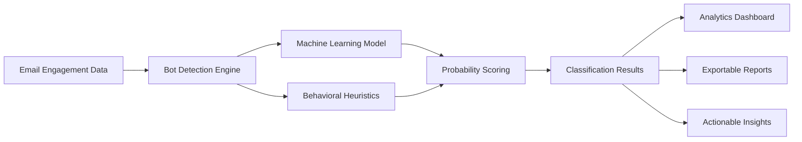
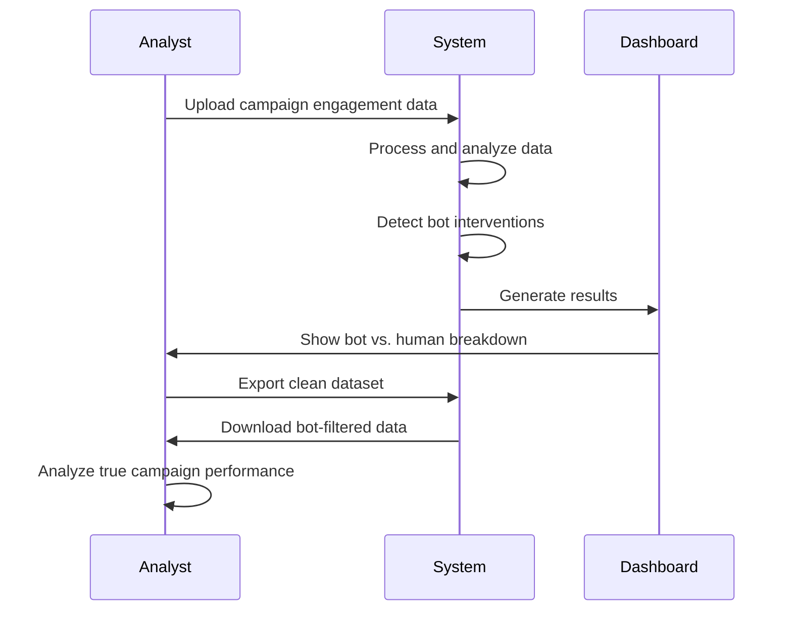

# Bot Intervention Predictor - Business Use Case and Objectives

## Executive Summary

The Bot Intervention Predictor is an AI-powered analytics tool designed to identify and analyze automated bot interventions in email engagement data. This solution addresses the critical business challenge of distinguishing between genuine human engagement and automated bot interactions in email marketing campaigns, helping organizations maintain data integrity and optimize their email marketing strategies.

## Business Problem Statement

### Challenge
Email marketing teams face significant challenges with inflated engagement metrics due to:
- **Security bots** that automatically open emails and click links to scan for threats
- **Email preview services** that trigger opens without user interaction
- **Automated crawlers** that systematically interact with email content
- **Corporate security tools** that pre-fetch links for malware detection

These automated interactions create:
1. **Misleading engagement metrics** - Inflated open and click rates that don't reflect actual user interest
2. **Wasted marketing resources** - Campaigns optimized based on inaccurate data
3. **Poor decision-making** - Strategic decisions based on contaminated analytics
4. **Compliance risks** - Inaccurate reporting to stakeholders and regulatory bodies
5. **Budget inefficiencies** - Investment in strategies that appear successful but aren't reaching real users

### Impact on Business

#### Quantitative Impact
- **Metric Inflation**: Bot activity can artificially inflate open rates by 15-40%
- **False Positives**: Up to 30% of "engaged" users may be bot-driven interactions
- **ROI Miscalculation**: Campaign ROI calculations off by 20-50% due to bot contamination
- **Budget Waste**: Organizations spending thousands of dollars optimizing for bot behavior

#### Qualitative Impact
- Loss of confidence in email marketing data
- Inability to accurately segment and target audiences
- Reduced effectiveness of A/B testing and optimization efforts
- Compromised customer journey analytics

## Solution Overview

### What is Bot Intervention Predictor?

The Bot Intervention Predictor is a machine learning-based web application that analyzes email engagement data to:
1. **Identify bot interventions** with high accuracy using behavioral pattern analysis
2. **Provide probability scores** for each engagement indicating likelihood of bot activity
3. **Generate explanations** for why specific interactions are flagged as bot-driven
4. **Visualize patterns** through interactive analytics dashboards
5. **Enable data cleansing** by exporting cleaned datasets excluding bot activity

### Core Capabilities

## Business Objectives

### Primary Objectives

#### 1. Data Quality Improvement
**Goal**: Achieve 95%+ accuracy in identifying bot interventions vs. human engagement

**Metrics**:
- Bot detection accuracy rate
- False positive rate < 5%
- False negative rate < 10%
- Data cleansing efficiency

#### 2. Marketing ROI Optimization
**Goal**: Enable accurate ROI calculation by removing bot-contaminated data

**Metrics**:
- Improved accuracy of campaign performance metrics
- More effective budget allocation decisions
- Better identification of high-performing campaigns
- Reduced waste on bot-inflated segments

#### 3. Strategic Decision Support
**Goal**: Provide clean, reliable data for strategic marketing decisions

**Metrics**:
- Increased confidence in engagement analytics
- More accurate customer segmentation
- Better A/B test conclusions
- Improved attribution modeling

### Secondary Objectives

#### 4. Operational Efficiency
**Goal**: Automate bot detection process to save analyst time

**Metrics**:
- Time saved on manual bot analysis
- Reduction in data quality investigation time
- Faster reporting cycles
- Automated data cleansing workflows

#### 5. Compliance and Transparency
**Goal**: Ensure accurate reporting and compliance with data quality standards

**Metrics**:
- Audit trail for bot detection decisions
- Transparent reasoning for classifications
- Regulatory compliance in reporting
- Stakeholder confidence in data quality

## Target Users and Use Cases

### Primary Users

#### 1. Email Marketing Analysts
**Needs**:
- Clean engagement data for campaign analysis
- Accurate performance metrics
- Bot pattern identification

**Use Cases**:
- Upload campaign data and identify bot-driven opens/clicks
- Generate clean datasets for reporting
- Analyze bot contamination patterns across campaigns

#### 2. Marketing Operations Managers
**Needs**:
- Data quality assurance
- Process automation
- Team productivity enhancement

**Use Cases**:
- Establish data quality standards
- Automate bot detection in data pipelines
- Monitor data integrity across campaigns

#### 3. Data Scientists and Analytics Teams
**Needs**:
- Feature engineering insights
- Model transparency
- Integration capabilities

**Use Cases**:
- Understand bot detection features and logic
- Extract bot probability scores for custom models
- Integrate bot detection into broader analytics workflows

#### 4. Marketing Leadership
**Needs**:
- Accurate KPI reporting
- Strategic insights
- ROI justification

**Use Cases**:
- Review clean vs. contaminated engagement metrics
- Make strategic decisions based on reliable data
- Present accurate performance to stakeholders

## Key Business Use Cases

### Use Case 1: Campaign Performance Analysis

**Business Value**:
- Accurate understanding of campaign effectiveness
- Reliable comparison between campaigns
- Better optimization decisions

### Use Case 2: Audience Segmentation Refinement

**Scenario**: Marketing team wants to identify truly engaged users for retargeting

**Process**:
1. Upload engagement data from multiple campaigns
2. Identify bot-contaminated interactions
3. Filter out bot-driven engagement
4. Create segments based on genuine human engagement
5. Target high-value users with precision campaigns

**Business Value**:
- Higher conversion rates on retargeting
- Reduced ad spend waste
- Better customer experience through relevant targeting

### Use Case 3: A/B Testing Validation

**Scenario**: Validate A/B test results by removing bot contamination

**Process**:
1. Upload A/B test engagement data
2. Identify bot activity in both variants
3. Compare bot contamination levels
4. Recalculate performance with clean data
5. Make optimization decisions based on real user behavior

**Business Value**:
- Accurate test conclusions
- Reliable optimization strategies
- Prevented false positive optimizations

### Use Case 4: Email Deliverability Analysis

**Scenario**: Understand which domains/IP types have higher bot activity

**Process**:
1. Analyze engagement patterns by domain and IP type
2. Identify domains with excessive bot activity
3. Correlate with deliverability challenges
4. Adjust sending strategies accordingly

**Business Value**:
- Improved sender reputation
- Better inbox placement
- Optimized deliverability strategies

## Expected Business Outcomes

### Short-term Outcomes (0-3 months)

1. **Immediate Data Quality Improvement**
   - Clean historical campaign data
   - Identify current bot contamination levels
   - Establish baseline metrics for genuine engagement

2. **Enhanced Reporting Accuracy**
   - More reliable KPI dashboards
   - Accurate campaign performance comparisons
   - Trustworthy metrics for stakeholder reporting

3. **Quick Wins in Campaign Optimization**
   - Identify truly high-performing campaigns
   - Stop investment in bot-inflated segments
   - Redirect budget to genuine engagement opportunities

### Medium-term Outcomes (3-6 months)

1. **Improved Marketing ROI**
   - 15-25% improvement in campaign targeting effectiveness
   - 10-20% reduction in wasted marketing spend
   - Better customer acquisition costs through accurate attribution

2. **Process Automation**
   - Automated bot detection in data pipelines
   - Reduced manual data quality checks
   - Faster reporting and analysis cycles

3. **Strategic Insights**
   - Understanding of bot patterns by industry/segment
   - Identification of high-risk domains and IP types
   - Development of prevention strategies

### Long-term Outcomes (6-12 months)

1. **Organizational Data Culture**
   - Increased confidence in marketing analytics
   - Data-driven decision making culture
   - Cross-functional trust in marketing metrics

2. **Competitive Advantage**
   - Superior targeting capabilities
   - Better customer understanding
   - More efficient marketing operations

3. **Scalable Data Quality Framework**
   - Integrated bot detection across all email channels
   - Proactive bot pattern monitoring
   - Continuous improvement of detection algorithms

## Success Metrics and KPIs

### Technical Performance KPIs

| Metric | Target | Measurement Method |
|--------|--------|-------------------|
| Bot Detection Accuracy | >95% | Manual validation against known bot/human samples |
| False Positive Rate | <5% | Review of flagged "bot" records |
| False Negative Rate | <10% | Review of "human" classifications |
| Processing Speed | <30s per 10k records | System performance monitoring |
| System Uptime | >99% | Availability monitoring |

### Business Impact KPIs

| Metric | Target | Measurement Method |
|--------|--------|-------------------|
| Data Quality Score | >90% | Percentage of clean records in datasets |
| Time Savings | 10+ hours/week | Analyst time tracking |
| Campaign ROI Accuracy | ±5% margin | Comparison of calculated vs. actual ROI |
| User Adoption Rate | >80% of marketing team | System usage analytics |
| Stakeholder Satisfaction | >8/10 rating | Quarterly surveys |

### Process Improvement KPIs

| Metric | Target | Measurement Method |
|--------|--------|-------------------|
| Report Generation Time | 50% reduction | Time tracking |
| Data Quality Issues | 70% reduction | Issue tracking system |
| Manual Bot Review Time | 80% reduction | Process analytics |
| Decision Confidence Score | >8/10 | User surveys |

## ROI Analysis

### Investment Components

1. **Initial Setup**: Development and deployment (~40 hours)
2. **Training and Onboarding**: User training and documentation (~16 hours)
3. **Operational Costs**: Cloud hosting, maintenance (~$50/month)
4. **Ongoing Optimization**: Model tuning and updates (~4 hours/month)

### Return Components

1. **Time Savings**
   - Manual bot analysis: 10 hours/week × $75/hour = $750/week
   - Annual savings: ~$39,000

2. **Improved Marketing Effectiveness**
   - Reduced wasted spend: 15% × $500k annual budget = $75,000
   - Better targeting ROI: 10% improvement × $500k = $50,000

3. **Better Decision Making**
   - Prevented bad optimization decisions: ~$25,000/year
   - Improved campaign performance: ~$30,000/year

**Total Annual ROI**: $219,000 in savings/value vs. ~$5,000 in costs = **4,380% ROI**

## Risk Mitigation

### Technical Risks

| Risk | Impact | Probability | Mitigation |
|------|--------|-------------|------------|
| Model accuracy degradation | High | Medium | Regular retraining, performance monitoring |
| False positives | Medium | Low | Conservative threshold (0.7), manual review option |
| Data format changes | Low | Medium | Robust validation, flexible preprocessing |
| System downtime | Medium | Low | Cloud hosting, redundancy, monitoring |

### Business Risks

| Risk | Impact | Probability | Mitigation |
|------|--------|-------------|------------|
| User adoption resistance | High | Medium | Training, clear value demonstration, ease of use |
| Integration challenges | Medium | Low | Standard CSV format, export capabilities |
| Stakeholder skepticism | Medium | Medium | Transparent reasoning, validation data, pilot programs |
| Data privacy concerns | High | Low | Local processing, no data retention, clear documentation |

## Competitive Advantages

### Differentiators

1. **Explainable AI**: Unlike black-box solutions, provides clear reasoning for each classification
2. **No External Dependencies**: Self-contained solution with no third-party data requirements
3. **Customizable Thresholds**: Adjustable sensitivity based on business needs
4. **Interactive Analytics**: Real-time visualization and exploration capabilities
5. **Easy Integration**: Simple CSV-based workflow fits existing processes

### Market Position

The Bot Intervention Predictor fills a gap in the email marketing analytics market:
- **Email Service Providers (ESPs)**: Limited bot detection capabilities
- **Analytics Platforms**: Generic anomaly detection, not email-specific
- **Security Vendors**: Focus on threat detection, not marketing data quality
- **Our Solution**: Purpose-built for email marketing bot detection with business user focus

## Conclusion

The Bot Intervention Predictor addresses a critical business need for accurate email engagement analytics. By providing automated, explainable bot detection, the solution enables marketing teams to make better decisions, optimize budgets effectively, and demonstrate true marketing impact. With minimal investment and substantial returns, this tool represents a high-value addition to any data-driven marketing organization's toolkit.

### Next Steps for Stakeholders

1. **Marketing Leadership**: Review pilot results and approve organization-wide deployment
2. **Analytics Teams**: Integrate bot detection into standard reporting workflows
3. **Operations**: Establish data quality monitoring and continuous improvement processes
4. **IT/Data Teams**: Plan integration with existing data platforms and pipelines

The combination of immediate operational benefits, strategic decision support, and long-term data quality improvement makes the Bot Intervention Predictor a compelling investment for modern marketing organizations.
