# Bot Intervention Predictor - Technical Architecture

## Architecture Overview

The Bot Intervention Predictor is built as a modern, modular web application using Python and Streamlit. The architecture follows a three-tier design pattern with clear separation of concerns between presentation, business logic, and data processing layers.

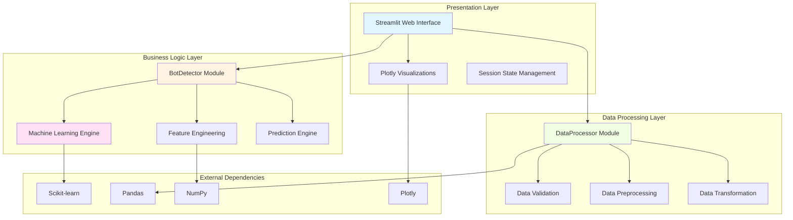

## System Architecture

### High-Level Component Architecture

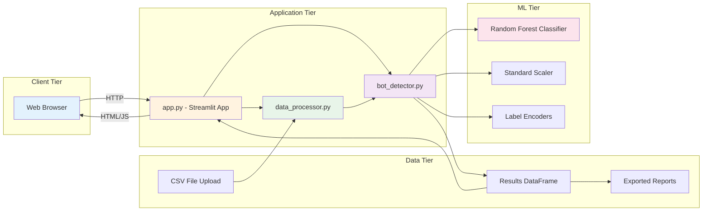

## Component Specifications

### 1. Application Layer (app.py)

#### Purpose
Main application orchestrator that handles user interactions, workflow management, and visualization.

#### Key Responsibilities
- User interface rendering
- File upload handling
- Session state management
- Tab navigation and organization
- Results visualization
- Data export functionality

#### Technical Details

**Technology Stack**:
- **Framework**: Streamlit 1.45.1
- **Visualization**: Plotly 6.1.2
- **Data Handling**: Pandas 2.3.0

**Architecture Pattern**:
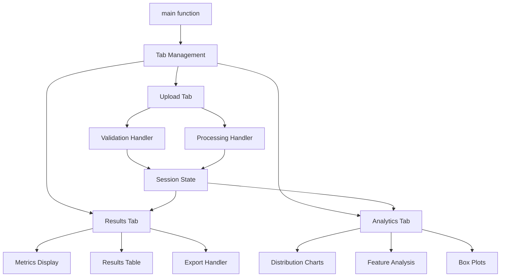

**Key Functions**:

1. **main()**
   - Entry point for application
   - Initializes components
   - Manages tab structure
   ```python
   def main():
       st.title("Bot Intervention Predictor")
       data_processor = DataProcessor()
       bot_detector = BotDetector()
       # Tab management...
   ```

2. **handle_file_upload()**
   - Manages CSV file upload
   - Triggers validation
   - Initiates processing pipeline
   - Updates session state

3. **display_results()**
   - Renders prediction results
   - Shows summary metrics
   - Displays detailed results table
   - Provides download functionality

4. **display_analytics()**
   - Creates interactive visualizations
   - Generates distribution charts
   - Enables feature analysis
   - Produces comparative box plots

**Session State Management**:
```python
if "processed_data" not in st.session_state:
    st.session_state.processed_data = None
if "results_df" not in st.session_state:
    st.session_state.results_df = None
```

### 2. Bot Detection Module (bot_detector.py)

#### Purpose
Core machine learning module for bot detection, feature engineering, and prediction.

#### Architecture

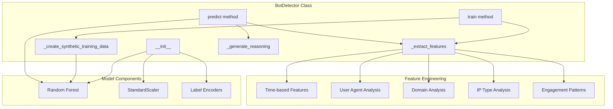

#### Feature Engineering Pipeline

**Input Features** (from CSV):
1. `recipient_domain` - Email domain
2. `time_to_open_sec` - Time to open email
3. `num_opens` - Number of opens
4. `user_agent` - Browser/client identifier
5. `ip_type` - IP address type
6. `time_to_click_sec` - Time to click
7. `click_sequence_entropy` - Click pattern entropy
8. `fast_opener_flag` - Fast opening behavior
9. `multiple_opens_30s` - Multiple opens in 30s

**Engineered Features**:

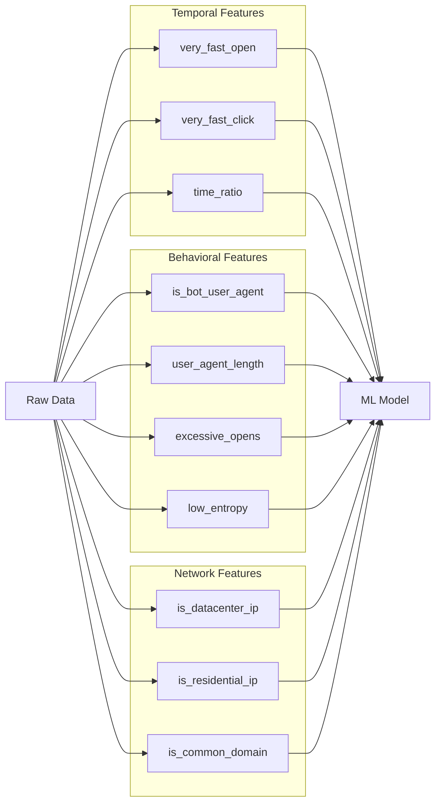

**Feature Definitions**:

| Feature | Type | Calculation | Bot Indicator |
|---------|------|-------------|---------------|
| very_fast_open | Binary | time_to_open_sec < 5 | Yes - Automated behavior |
| very_fast_click | Binary | time_to_click_sec < 2 | Yes - Automated clicking |
| time_ratio | Continuous | time_to_click / (time_to_open + 1) | Varies - Pattern analysis |
| is_bot_user_agent | Binary | Regex pattern matching | Yes - Bot signatures |
| user_agent_length | Integer | Length of UA string | Yes if 0 or very short |
| is_common_domain | Binary | Domain in known list | No - Human indicator |
| is_datacenter_ip | Binary | ip_type == 'datacenter' | Yes - Non-human origin |
| is_residential_ip | Binary | ip_type == 'residential' | No - Human indicator |
| excessive_opens | Binary | num_opens > 10 | Yes - Unusual behavior |
| low_entropy | Binary | click_sequence_entropy < 0.5 | Yes - Predictable pattern |

#### Bot Detection Algorithm

**Scoring Logic**:
```python
# Critical bot indicators (high weight 0.4-0.5)
bot_score += (time_to_open_sec < 1.0) * 0.4
bot_score += (time_to_click_sec < 1.0) * 0.4
bot_score += is_bot_user_agent * 0.5
bot_score += (is_datacenter_ip & time_to_open_sec < 5.0) * 0.4

# Moderate bot indicators (weight 0.25-0.3)
bot_score += (multiple_opens_30s > 2) * 0.3
bot_score += (high_entropy & very_fast_click) * 0.3
bot_score += (fast_opener & time_to_click < 3.0) * 0.25

# Pattern analysis (weight 0.35)
bot_score += (time_to_open < 2.0 & time_to_click < 2.0) * 0.35

# False positive reduction (negative weights)
bot_score -= (is_common_domain & time_to_open > 10.0) * 0.2
bot_score -= (is_residential_ip & time_to_open > 5.0) * 0.15
```

**Classification Threshold**:
- **Threshold**: 0.7 (high confidence)
- **Rationale**: Minimize false positives to ensure data integrity
- **Trade-off**: May miss some bots but prevents flagging genuine humans

#### Machine Learning Model

**Model Type**: Random Forest Classifier

**Configuration**:
```python
RandomForestClassifier(
    n_estimators=200,        # 200 decision trees
    max_depth=8,             # Limit depth to prevent overfitting
    min_samples_split=5,     # Minimum samples to split node
    min_samples_leaf=2,      # Minimum samples in leaf
    random_state=42,         # Reproducibility
    class_weight={0: 1, 1: 3} # 3x weight for bot class
)
```

**Why Random Forest?**:
1. **Handles mixed data types** - Numeric and categorical features
2. **Robust to outliers** - Ensemble approach reduces noise impact
3. **Feature importance** - Provides interpretability
4. **No feature scaling required** - Works with different scales
5. **Handles imbalanced data** - With class weights

**Training Process**:

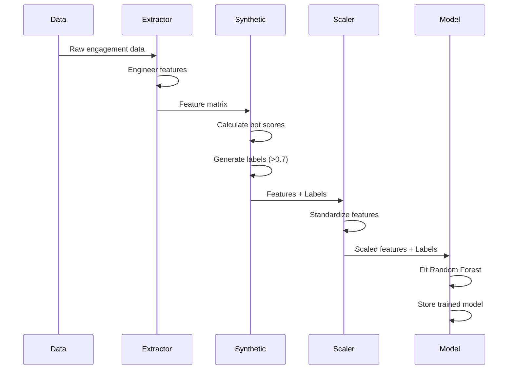

#### Prediction Pipeline

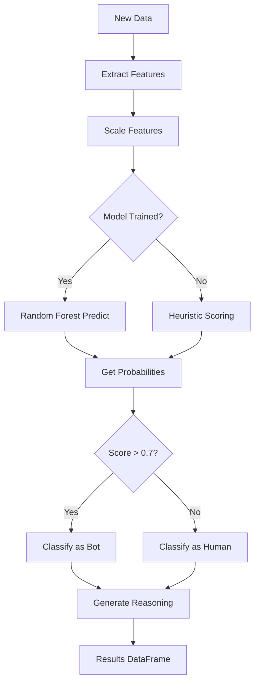

### 3. Data Processing Module (data_processor.py)

#### Purpose
Handles all data validation, cleaning, and preprocessing operations.

#### Architecture

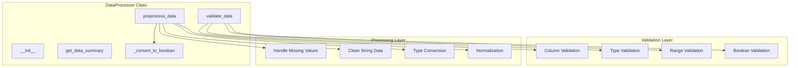

#### Data Validation Rules

**Required Columns**:
```python
required_columns = [
    'recipient_domain',
    'time_to_open_sec',
    'num_opens',
    'user_agent',
    'ip_type',
    'time_to_click_sec',
    'click_sequence_entropy',
    'fast_opener_flag',
    'multiple_opens_30s'
]
```

**Validation Rules**:

| Column | Type | Constraints | Error Handling |
|--------|------|-------------|----------------|
| recipient_domain | String | Non-empty | Allow unknown |
| time_to_open_sec | Numeric | >= 0 | Reject negative |
| num_opens | Integer | >= 0 | Reject negative |
| user_agent | String | Any | Allow empty |
| ip_type | String | corp/mobile/datacenter/residential | Normalize to lowercase |
| time_to_click_sec | Numeric | >= 0 | Reject negative |
| click_sequence_entropy | Float | 0.0 - 1.0 | Reject out of range |
| fast_opener_flag | Boolean | TRUE/FALSE, 0/1 | Convert to binary |
| multiple_opens_30s | Integer | >= 0 | Convert to numeric |

#### Data Preprocessing Pipeline

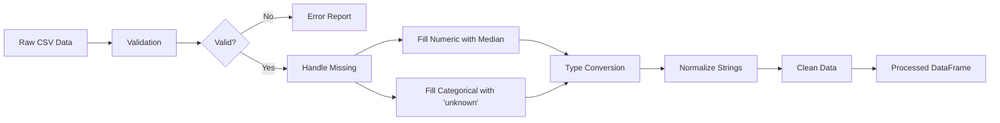

**Missing Value Strategy**:

```python
# Numeric columns: Fill with median
numeric_columns = ['time_to_open_sec', 'num_opens',
                   'time_to_click_sec', 'click_sequence_entropy']
for col in numeric_columns:
    df[col] = df[col].fillna(df[col].median())

# Categorical columns: Fill with 'unknown'
categorical_columns = ['recipient_domain', 'user_agent', 'ip_type']
for col in categorical_columns:
    df[col] = df[col].fillna('unknown')
```

**Boolean Conversion Logic**:
```python
def _convert_to_boolean(value):
    # Handle various boolean representations
    # TRUE, true, 1, Yes, Y -> 1
    # FALSE, false, 0, No, N -> 0
    # NaN, empty -> 0
```

## Data Flow Architecture

### End-to-End Data Flow

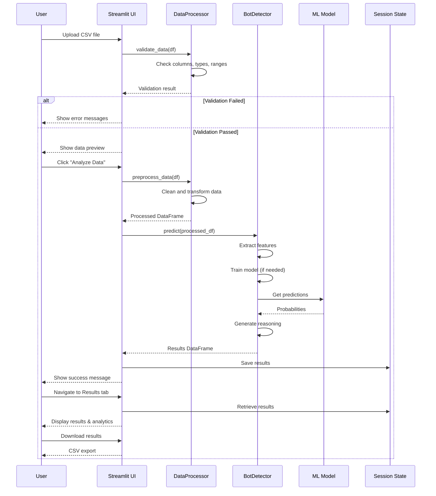

### Processing Pipeline Details

**Stage 1: Upload and Validation**
```
CSV File → File Upload → Pandas Read → Schema Validation → Data Type Check → Range Validation
```

**Stage 2: Preprocessing**
```
Valid Data → Missing Value Handling → Type Conversion → String Normalization → Boolean Conversion → Clean DataFrame
```

**Stage 3: Feature Engineering**
```
Clean Data → Temporal Features → Behavioral Features → Network Features → Feature Matrix
```

**Stage 4: Prediction**
```
Feature Matrix → Scaling → Model Prediction → Probability Scores → Classification → Reasoning Generation
```

**Stage 5: Results and Visualization**
```
Predictions → Results DataFrame → Metrics Calculation → Visualization → Export
```

## Technology Stack

### Core Dependencies

```mermaid
graph TB
    APP[Application]

    APP --> ST[Streamlit 1.45.1]
    APP --> PD[Pandas 2.3.0]
    APP --> NP[NumPy 2.2.6]
    APP --> SK[Scikit-learn 1.6.1]
    APP --> PL[Plotly 6.1.2]
    APP --> JL[Joblib 1.5.1]

    ST --> |Web Framework| UI[User Interface]
    PD --> |Data Manipulation| DATA[Data Processing]
    NP --> |Numerical Computing| MATH[Mathematical Operations]
    SK --> |Machine Learning| ML[ML Models]
    PL --> |Visualization| VIZ[Charts & Graphs]
    JL --> |Serialization| PERSIST[Model Persistence]

    style ST fill:#ff4b4b
    style PD fill:#150458
    style SK fill:#f89939
    style PL fill:#3f4f75
```

### Dependency Details

| Package | Version | Purpose | Key Features Used |
|---------|---------|---------|-------------------|
| Streamlit | 1.45.1 | Web application framework | file_uploader, tabs, metrics, dataframe, plotly_chart |
| Pandas | 2.3.0 | Data manipulation | DataFrame, read_csv, to_csv, data validation |
| NumPy | 2.2.6 | Numerical computing | Array operations, mathematical functions |
| Scikit-learn | 1.6.1 | Machine learning | RandomForestClassifier, StandardScaler, LabelEncoder |
| Plotly | 6.1.2 | Interactive visualization | Bar charts, histograms, box plots |
| Joblib | 1.5.1 | Model serialization | (Available for future model persistence) |

### System Requirements

**Runtime Environment**:
- Python >= 3.11
- Operating System: Linux/Unix (developed on WSL2)
- Memory: Minimum 2GB RAM (recommended 4GB+)
- Storage: ~500MB for dependencies

**Browser Compatibility**:
- Chrome 90+
- Firefox 88+
- Safari 14+
- Edge 90+

## Scalability Considerations

### Current Limitations

| Component | Current Limit | Bottleneck | Mitigation |
|-----------|---------------|------------|------------|
| File Size | ~10MB CSV | Memory | Streaming processing |
| Record Count | ~100,000 rows | Processing time | Batch processing |
| Concurrent Users | 5-10 | Single instance | Load balancing |
| Model Complexity | 200 trees | Training time | Caching, pre-training |

### Scalability Strategies

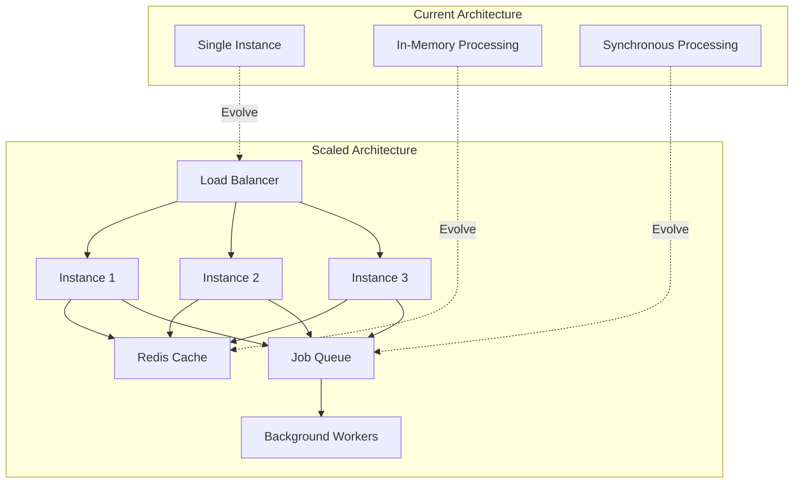

**Horizontal Scaling**:
1. Deploy multiple Streamlit instances behind load balancer
2. Shared cache layer (Redis) for model and results
3. Separate processing workers for heavy computations

**Vertical Scaling**:
1. Increase memory for larger datasets
2. Add GPU support for model training
3. Optimize pandas operations with Dask or Modin

**Data Scaling**:
1. Implement chunked file processing
2. Add database backend for results storage
3. Stream processing for real-time analysis

## Security Architecture

### Data Security

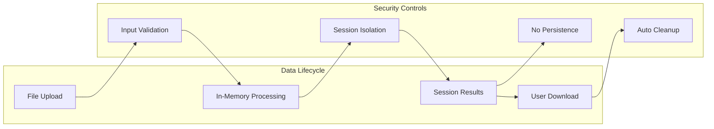

**Security Features**:

1. **No Data Persistence**
   - Files stored only in session memory
   - No database or file system storage
   - Automatic cleanup on session end

2. **Input Validation**
   - CSV format verification
   - Data type checking
   - Range validation
   - Injection prevention

3. **Session Isolation**
   - Each user has isolated session state
   - No cross-user data access
   - Session-specific processing

4. **Local Processing**
   - No external API calls
   - No data transmission to third parties
   - Self-contained analysis

### Deployment Security

**Configuration** (.streamlit/config.toml):
```toml
[server]
headless = true           # No browser auto-open
address = "0.0.0.0"       # Listen on all interfaces
port = 8517               # Custom port

[theme]
primaryColor = "#FF2B2B"
backgroundColor = "#FFFFFF"
secondaryBackgroundColor = "#F0F2F6"
textColor = "#262730"
```

**Best Practices**:
1. Deploy behind reverse proxy (nginx/Apache)
2. Enable HTTPS with SSL/TLS certificates
3. Implement authentication layer if needed
4. Use environment variables for sensitive config
5. Regular dependency security updates

## Performance Optimization

### Current Optimizations

1. **Feature Engineering Caching**
   ```python
   # Features computed once per dataset
   features_df = self._extract_features(df)
   ```

2. **Vectorized Operations**
   ```python
   # Using NumPy/Pandas vectorization instead of loops
   bot_score += (features_df['time_to_open_sec'] < 1.0) * 0.4
   ```

3. **Lazy Loading**
   ```python
   # Model trained only when needed
   if not self.is_trained or self.model is None:
       self.train(df)
   ```

4. **Session State Caching**
   ```python
   # Results stored in session to avoid recomputation
   st.session_state.results_df = predictions
   ```

### Performance Metrics

| Operation | Current Performance | Target | Optimization |
|-----------|---------------------|--------|--------------|
| File Upload | < 1s (10MB) | < 2s (50MB) | Streaming |
| Validation | < 0.5s (10k rows) | < 1s (100k rows) | Parallel |
| Feature Engineering | < 2s (10k rows) | < 5s (100k rows) | Caching |
| Model Training | < 5s (10k rows) | < 10s (100k rows) | Pre-training |
| Prediction | < 3s (10k rows) | < 5s (100k rows) | Batch processing |
| Visualization | < 1s | < 2s | Sampling |

## Error Handling and Logging

### Error Handling Strategy

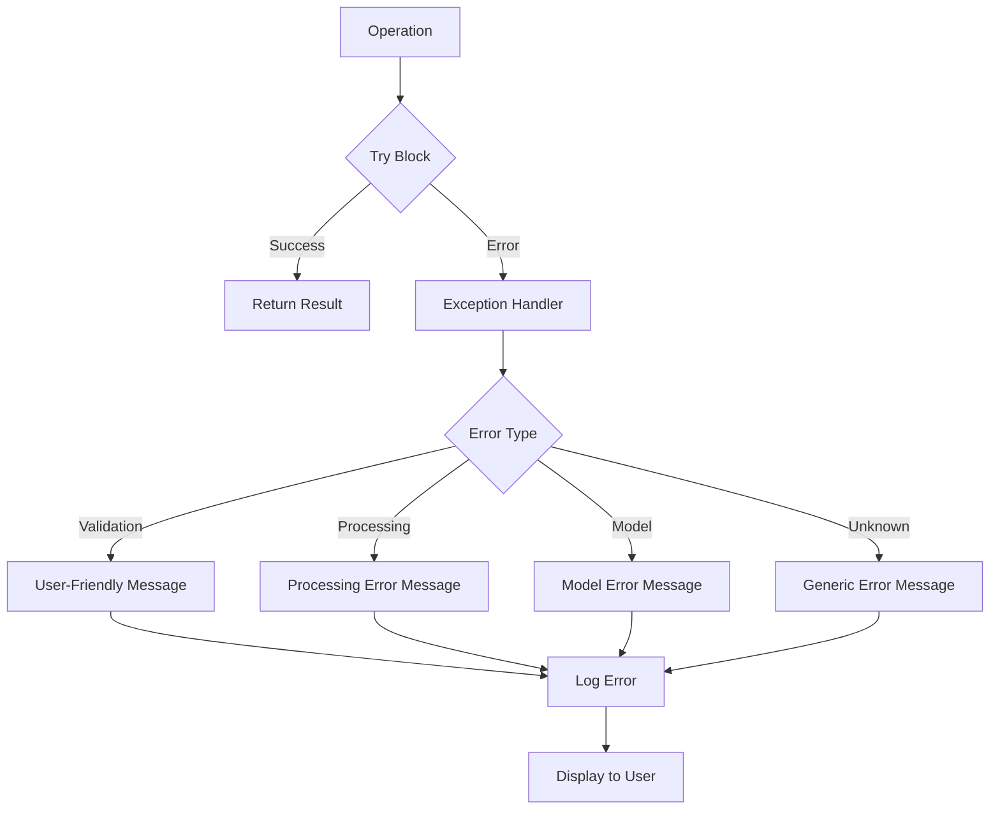

**Error Categories**:

1. **Validation Errors**
   ```python
   if validation_result["is_valid"]:
       # Process
   else:
       for error in validation_result["errors"]:
           st.error(f"• {error}")
   ```

2. **Processing Errors**
   ```python
   try:
       df = pd.read_csv(uploaded_file)
   except Exception as e:
       st.error(f"Error processing file: {str(e)}")
   ```

3. **Model Errors**
   ```python
   try:
       proba_results = self.model.predict_proba(X_scaled)
   except Exception:
       # Fallback to heuristic scoring
       _, _, bot_probabilities = self._create_synthetic_training_data(df)
   ```

## Testing Strategy

### Test Coverage Areas

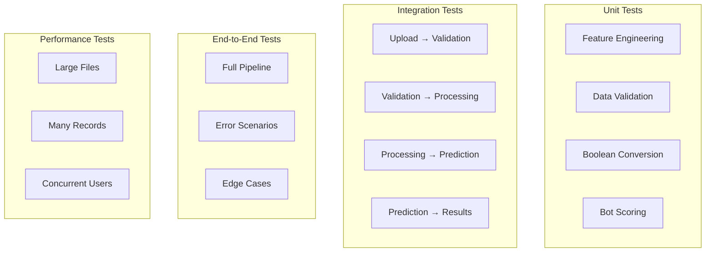

**Recommended Test Cases**:

1. **Data Validation Tests**
   - Missing columns
   - Invalid data types
   - Out-of-range values
   - Empty files
   - Malformed CSV

2. **Feature Engineering Tests**
   - Correct feature calculation
   - Missing value handling
   - Edge cases (zero values, very large values)

3. **Model Tests**
   - Prediction accuracy on known samples
   - Threshold behavior
   - Reasoning generation
   - Fallback mechanisms

4. **UI Tests**
   - File upload flow
   - Tab navigation
   - Results display
   - Export functionality

## Deployment Architecture

### Deployment Options

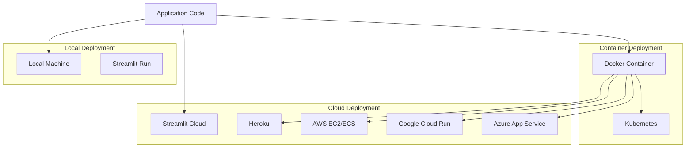

### Docker Deployment

**Dockerfile Example**:
```dockerfile
FROM python:3.11-slim

WORKDIR /app

COPY pyproject.toml uv.lock ./
RUN pip install uv && uv pip install --system -r pyproject.toml

COPY . .

EXPOSE 8517

CMD ["streamlit", "run", "app.py"]
```

**Docker Compose**:
```yaml
version: '3.8'
services:
  bot-detector:
    build: .
    ports:
      - "8517:8517"
    volumes:
      - ./data:/app/data
    environment:
      - STREAMLIT_SERVER_HEADLESS=true
```

## Future Architecture Enhancements

### Planned Improvements

1. **API Layer**
   ```mermaid
   graph LR
       UI[Streamlit UI] --> API[REST API]
       EXT[External Systems] --> API
       API --> CORE[Core Logic]
       CORE --> DB[(Database)]
   ```

2. **Real-time Processing**
   - WebSocket support for live updates
   - Stream processing integration
   - Event-driven architecture

3. **Model Management**
   - MLflow integration
   - Model versioning
   - A/B testing framework
   - Continuous training pipeline

4. **Enhanced Analytics**
   - Time-series analysis
   - Anomaly detection
   - Predictive insights
   - Custom reporting

## Conclusion

The Bot Intervention Predictor architecture is designed for simplicity, maintainability, and extensibility. The modular design allows for easy enhancement and scaling while maintaining clean separation of concerns. The current implementation prioritizes ease of use and deployment while providing a solid foundation for future enhancements.

### Key Architectural Strengths

1. **Modular Design** - Clear separation between UI, business logic, and data processing
2. **Scalability** - Architecture supports both vertical and horizontal scaling
3. **Security** - No data persistence and session isolation ensure data privacy
4. **Maintainability** - Well-organized code with clear responsibilities
5. **Extensibility** - Easy to add new features, models, or data sources

### Next Steps

1. Implement comprehensive test suite
2. Add API layer for programmatic access
3. Enhance model with continuous learning
4. Add database backend for result storage
5. Implement user authentication and multi-tenancy
