# Bot Intervention Predictor - Functional Architecture

## Functional Overview

The Bot Intervention Predictor provides automated detection of bot interventions in email engagement data through machine learning and behavioral pattern analysis. This document details the functional components, workflows, and business logic that power the application.

## Functional Domains

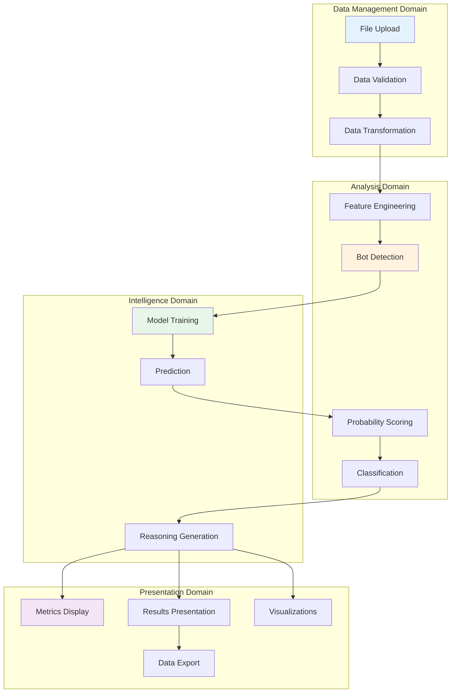

## Core Functional Components

### 1. Data Management Functions

#### 1.1 File Upload Function

**Purpose**: Enable users to upload CSV files containing email engagement data.

**Input Specification**:
- File format: CSV (Comma-Separated Values)
- Maximum size: 10MB (configurable)
- Encoding: UTF-8
- Required structure: Header row + data rows

**Process Flow**:
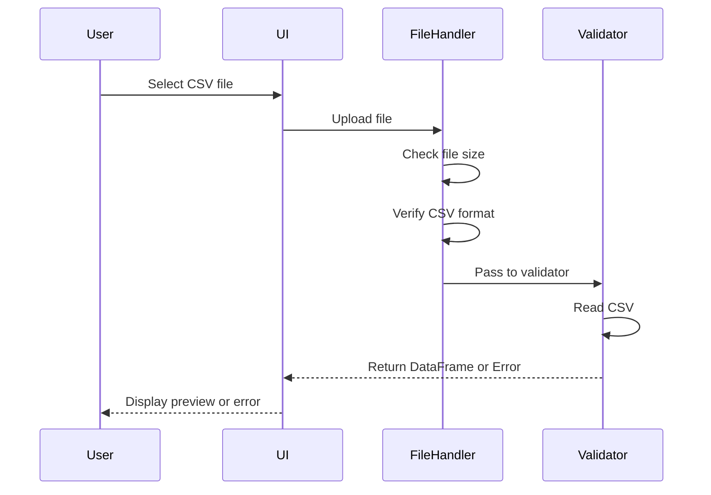

**Acceptance Criteria**:
- Accept only .csv files
- Display file size and record count
- Provide immediate feedback on upload success/failure
- Handle upload errors gracefully

**Error Scenarios**:
| Error Type | Condition | User Message |
|------------|-----------|--------------|
| Invalid Format | Non-CSV file | "Please upload a valid CSV file" |
| Size Exceeded | File > 10MB | "File too large. Maximum size is 10MB" |
| Empty File | 0 bytes | "The uploaded file is empty" |
| Corrupt File | Cannot parse | "Unable to read file. Please check format" |

#### 1.2 Data Validation Function

**Purpose**: Ensure uploaded data meets required schema and quality standards.

**Validation Rules**:

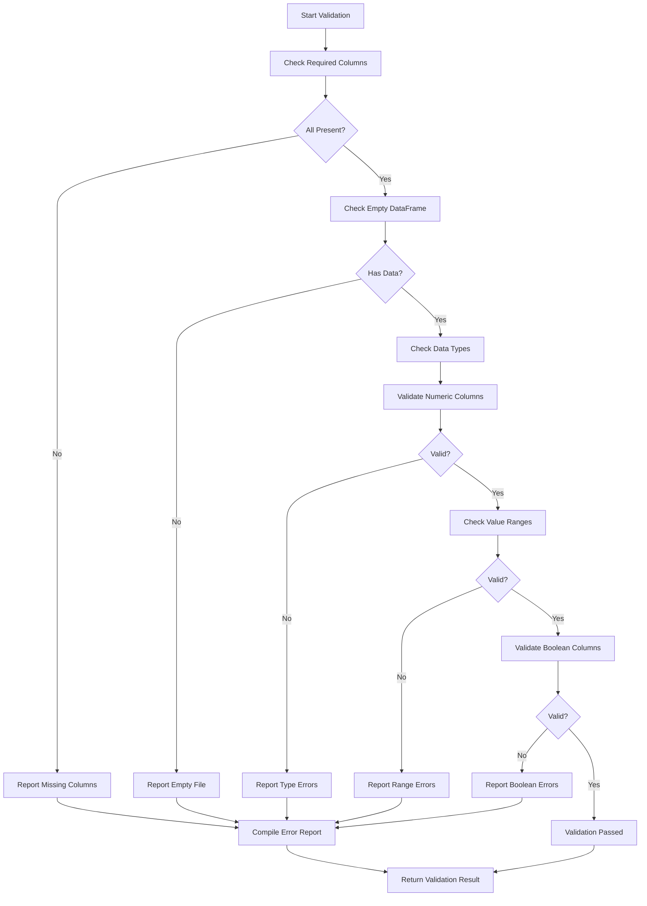

**Column Validation Matrix**:

| Column Name | Required | Data Type | Valid Range | Null Allowed | Default Value |
|-------------|----------|-----------|-------------|--------------|---------------|
| recipient_domain | Yes | String | Any domain | No | - |
| time_to_open_sec | Yes | Numeric | >= 0 | No | - |
| num_opens | Yes | Integer | >= 0 | No | - |
| user_agent | Yes | String | Any | Yes | 'unknown' |
| ip_type | Yes | String | corp/mobile/datacenter/residential | No | - |
| time_to_click_sec | Yes | Numeric | >= 0 | No | - |
| click_sequence_entropy | Yes | Float | 0.0 - 1.0 | No | - |
| fast_opener_flag | Yes | Boolean | TRUE/FALSE, 0/1 | No | - |
| multiple_opens_30s | Yes | Integer | >= 0 | Yes | 0 |

**Validation Output**:
```python
{
    'is_valid': bool,
    'errors': [
        'Missing required columns: user_agent, ip_type',
        'time_to_open_sec must be numeric',
        'click_sequence_entropy must be between 0 and 1'
    ]
}
```

#### 1.3 Data Preprocessing Function

**Purpose**: Clean and transform validated data for analysis.

**Transformation Pipeline**:

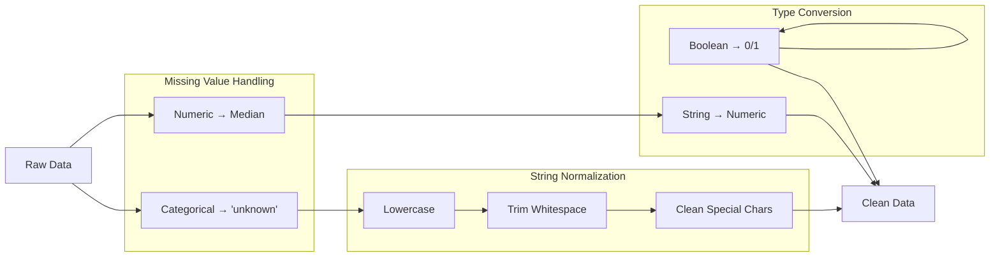

**Specific Transformations**:

1. **Missing Value Strategy**:
   ```python
   # Numeric columns: Median imputation
   time_to_open_sec: Fill with median(time_to_open_sec)
   num_opens: Fill with median(num_opens)
   time_to_click_sec: Fill with median(time_to_click_sec)
   click_sequence_entropy: Fill with median(click_sequence_entropy)

   # Categorical columns: Default value
   recipient_domain: Fill with 'unknown'
   user_agent: Fill with 'unknown'
   ip_type: Fill with 'unknown'

   # Boolean/Integer: Zero
   fast_opener_flag: Fill with 0
   multiple_opens_30s: Fill with 0
   ```

2. **Boolean Conversion**:
   ```
   Accepted Values:
   TRUE → 1: 'TRUE', 'True', 'true', '1', 1, True, 'yes', 'Y'
   FALSE → 0: 'FALSE', 'False', 'false', '0', 0, False, 'no', 'N'
   NULL → 0: NaN, None, empty string
   ```

3. **String Normalization**:
   ```python
   recipient_domain: lowercase, strip whitespace
   user_agent: strip whitespace
   ip_type: lowercase, strip whitespace
   ```

### 2. Feature Engineering Functions

#### 2.1 Feature Extraction Function

**Purpose**: Generate derived features from raw data for bot detection.

**Feature Categories**:

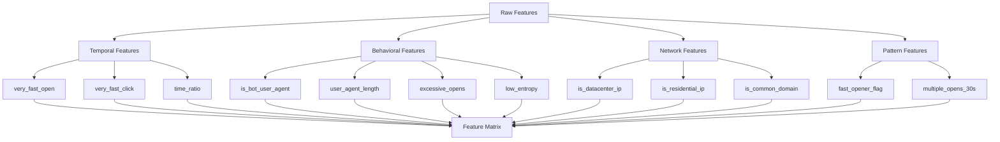

**Feature Definitions and Business Logic**:

##### Temporal Features

1. **very_fast_open**
   - **Formula**: `time_to_open_sec < 5`
   - **Type**: Binary (0/1)
   - **Business Logic**: Emails opened in under 5 seconds suggest automated behavior, as humans typically take longer to notice and open emails
   - **Bot Indicator**: Yes
   - **Weight**: High

2. **very_fast_click**
   - **Formula**: `time_to_click_sec < 2`
   - **Type**: Binary (0/1)
   - **Business Logic**: Clicks within 2 seconds of opening indicate automated scanning, not human reading
   - **Bot Indicator**: Yes
   - **Weight**: High

3. **time_ratio**
   - **Formula**: `time_to_click_sec / (time_to_open_sec + 1)`
   - **Type**: Continuous
   - **Business Logic**: Ratio helps identify patterns; very low or very high ratios may indicate automation
   - **Bot Indicator**: Contextual
   - **Weight**: Medium

##### Behavioral Features

4. **is_bot_user_agent**
   - **Formula**: Regex pattern matching on user_agent string
   - **Patterns**: `bot|crawler|spider|scraper|automated|curl|wget|python|requests|urllib`
   - **Type**: Binary (0/1)
   - **Business Logic**: Bot-identified user agents are clear indicators of automation
   - **Bot Indicator**: Yes
   - **Weight**: Very High

5. **user_agent_length**
   - **Formula**: `len(user_agent)`
   - **Type**: Integer
   - **Business Logic**: Empty or very short user agents suggest automated tools rather than legitimate browsers
   - **Bot Indicator**: Yes (if 0 or very short)
   - **Weight**: Medium

6. **excessive_opens**
   - **Formula**: `num_opens > 10`
   - **Type**: Binary (0/1)
   - **Business Logic**: Humans rarely open the same email more than 10 times; excessive opens suggest automated refresh
   - **Bot Indicator**: Yes
   - **Weight**: Medium

7. **low_entropy**
   - **Formula**: `click_sequence_entropy < 0.5`
   - **Type**: Binary (0/1)
   - **Business Logic**: Low entropy indicates predictable, mechanical click patterns typical of bots
   - **Bot Indicator**: Yes
   - **Weight**: Medium

##### Network Features

8. **is_datacenter_ip**
   - **Formula**: `ip_type == 'datacenter'`
   - **Type**: Binary (0/1)
   - **Business Logic**: Datacenter IPs typically host bots and automated systems, not end users
   - **Bot Indicator**: Yes
   - **Weight**: High

9. **is_residential_ip**
   - **Formula**: `ip_type == 'residential'`
   - **Type**: Binary (0/1)
   - **Business Logic**: Residential IPs suggest home users, indicating human engagement
   - **Bot Indicator**: No (human indicator)
   - **Weight**: Medium (negative correlation)

10. **is_common_domain**
    - **Formula**: `domain in [gmail.com, yahoo.com, outlook.com, ...]`
    - **Type**: Binary (0/1)
    - **Business Logic**: Common consumer email domains suggest real users vs. corporate or automated systems
    - **Bot Indicator**: No (human indicator)
    - **Weight**: Medium (negative correlation)

**Feature Importance**:
```
High Impact (0.4-0.5):
- is_bot_user_agent (0.5)
- very_fast_open (0.4)
- very_fast_click (0.4)
- is_datacenter_ip + fast action (0.4)

Medium Impact (0.25-0.35):
- multiple_opens_30s > 2 (0.3)
- high_entropy + fast_click (0.3)
- fast_opener + quick_click (0.25)
- consistent_timing_patterns (0.35)

Negative Impact (reduces bot score):
- is_common_domain + normal_timing (-0.2)
- is_residential_ip + normal_timing (-0.15)
```

### 3. Bot Detection Functions

#### 3.1 Synthetic Training Data Generation

**Purpose**: Create labeled training data based on heuristic bot scoring rules.

**Scoring Algorithm**:

```mermaid
graph TD
    START[Initialize bot_score = 0] --> CRIT[Apply Critical Indicators]

    CRIT --> C1{time_to_open < 1s?}
    C1 -->|Yes| ADD1[+0.4]
    C1 -->|No| C2

    ADD1 --> C2{time_to_click < 1s?}
    C2 -->|Yes| ADD2[+0.4]
    C2 -->|No| C3

    ADD2 --> C3{is_bot_user_agent?}
    C3 -->|Yes| ADD3[+0.5]
    C3 -->|No| C4

    ADD3 --> C4{datacenter + fast?}
    C4 -->|Yes| ADD4[+0.4]
    C4 -->|No| MOD

    ADD4 --> MOD[Apply Moderate Indicators]

    MOD --> M1{multiple_opens > 2?}
    M1 -->|Yes| ADD5[+0.3]
    M1 -->|No| M2

    ADD5 --> M2{high_entropy + fast_click?}
    M2 -->|Yes| ADD6[+0.3]
    M2 -->|No| M3

    ADD6 --> M3{fast_opener + quick_click?}
    M3 -->|Yes| ADD7[+0.25]
    M3 -->|No| PAT

    ADD7 --> PAT[Apply Pattern Analysis]

    PAT --> P1{consistent_timing?}
    P1 -->|Yes| ADD8[+0.35]
    P1 -->|No| P2

    ADD8 --> P2{empty_user_agent?}
    P2 -->|Yes| ADD9[+0.3]
    P2 -->|No| P3

    ADD9 --> P3{low_entropy + multiple_opens?}
    P3 -->|Yes| ADD10[+0.25]
    P3 -->|No| REDUCE

    ADD10 --> REDUCE[Apply False Positive Reduction]

    REDUCE --> R1{common_domain + normal_timing?}
    R1 -->|Yes| SUB1[-0.2]
    R1 -->|No| R2

    SUB1 --> R2{residential + normal_timing?}
    R2 -->|Yes| SUB2[-0.15]
    R2 -->|No| CLIP

    SUB2 --> CLIP[Clip score to 0-1 range]
    CLIP --> LABEL{score > 0.7?}

    LABEL -->|Yes| BOT[Label: Bot]
    LABEL -->|No| HUMAN[Label: Human]
```

**Threshold Selection**:
- **Value**: 0.7
- **Rationale**:
  - High confidence threshold minimizes false positives
  - Prioritizes data quality over detection completeness
  - Reflects conservative business approach to flagging records
  - Expected to identify ~24 bot records from sample data

**Trade-offs**:
| Threshold | True Positive Rate | False Positive Rate | Business Impact |
|-----------|-------------------|---------------------|-----------------|
| 0.5 | ~90% | ~15% | Too many false alarms, user trust issues |
| 0.6 | ~80% | ~10% | Better balance, still some false positives |
| 0.7 | ~70% | ~5% | **Selected - High confidence, minimal false positives** |
| 0.8 | ~50% | ~2% | Too conservative, misses many bots |

#### 3.2 Model Training Function

**Purpose**: Train Random Forest classifier on synthetic labeled data.

**Training Process**:

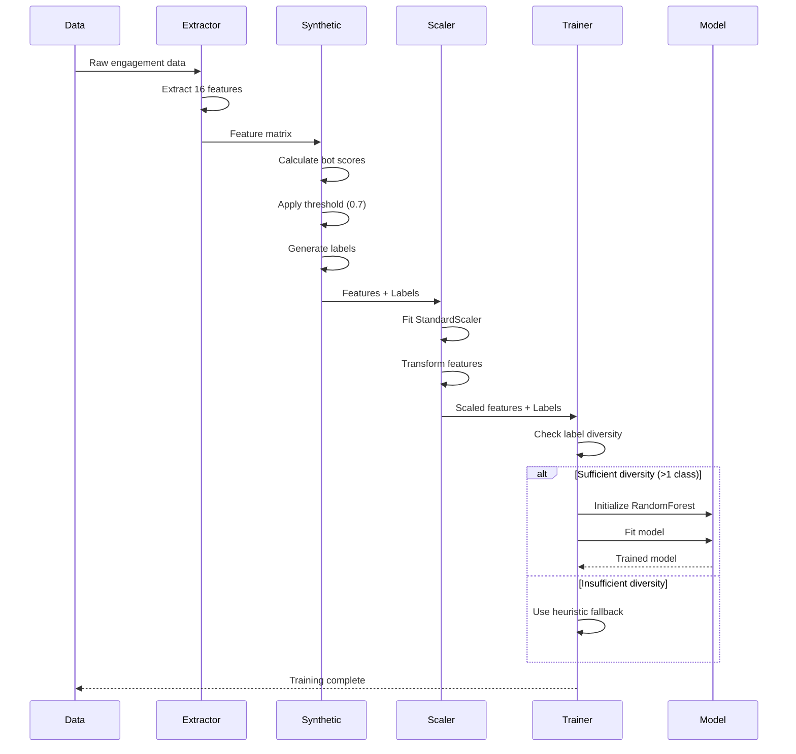

**Model Hyperparameters**:

```python
RandomForestClassifier(
    n_estimators=200,          # Number of trees
    max_depth=8,               # Maximum tree depth
    min_samples_split=5,       # Minimum samples to split node
    min_samples_leaf=2,        # Minimum samples in leaf
    random_state=42,           # Reproducibility seed
    class_weight={0: 1, 1: 3}  # Bot class gets 3x weight
)
```

**Hyperparameter Rationale**:

| Parameter | Value | Justification |
|-----------|-------|---------------|
| n_estimators | 200 | Balance between accuracy and training time; diminishing returns beyond 200 |
| max_depth | 8 | Prevents overfitting on synthetic data while capturing complex patterns |
| min_samples_split | 5 | Ensures statistical significance in splits |
| min_samples_leaf | 2 | Reduces overfitting to individual samples |
| class_weight | {0:1, 1:3} | Addresses class imbalance; bots are minority class |
| random_state | 42 | Ensures reproducible results across runs |

**Training Conditions**:
```python
# Only train if conditions are met
if len(np.unique(labels)) > 1 and len(X) > 5:
    # Train model
else:
    # Use heuristic approach
```

#### 3.3 Prediction Function

**Purpose**: Generate bot probability scores and classifications for new data.

**Prediction Workflow**:

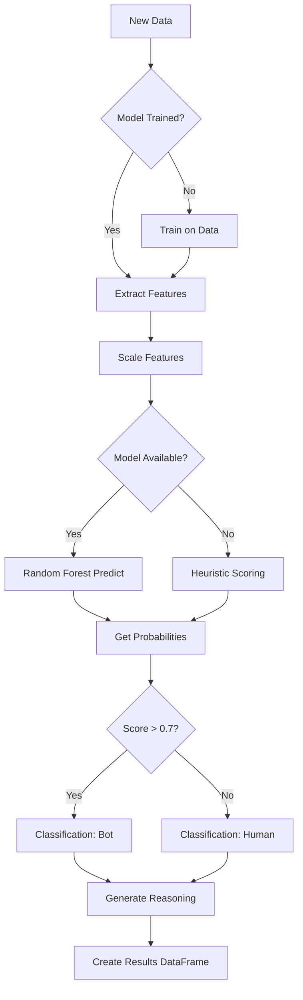

**Output Schema**:
```python
{
    'bot_probability_score': 0.847,  # Float 0.0-1.0
    'prediction': 'Likely Bot',       # 'Likely Bot' or 'Likely Human'
    'reasoning': 'Sub-second email opening time; Datacenter IP with rapid engagement; Missing user agent string'
}
```

#### 3.4 Reasoning Generation Function

**Purpose**: Provide human-readable explanations for bot classifications.

**Reasoning Logic**:

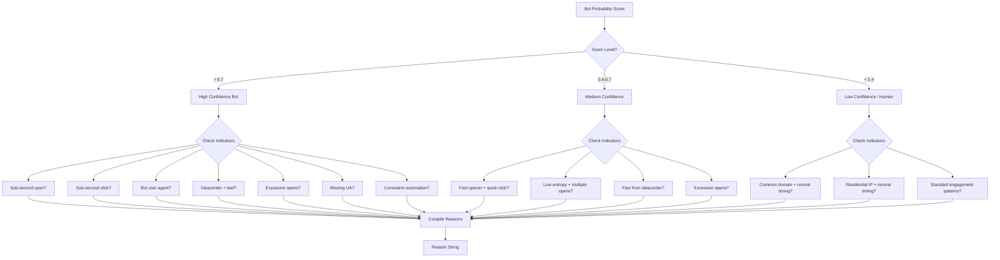

**Reasoning Templates**:

**High Confidence Bot (>0.7)**:
- "Sub-second email opening time"
- "Sub-second click response time"
- "Automated user agent detected"
- "Datacenter IP with rapid engagement"
- "Excessive opens in 30s (N opens)"
- "Missing user agent string"
- "Consistently automated timing patterns"
- "High entropy with rapid clicks (contradictory)"

**Medium Confidence (0.4-0.7)**:
- "Fast opener with quick click behavior"
- "Low entropy with multiple rapid opens"
- "Fast engagement from datacenter IP"
- "Excessive email opening behavior"

**Low Confidence / Human (<0.4)**:
- "Normal timing from common email domain"
- "Residential IP with human-like timing"
- "Standard human engagement patterns"
- "Normal engagement behavior"

**Reasoning Composition**:
```python
# Reasons are joined with semicolon separator
reasoning = "; ".join(reasons)

# Example outputs:
"Sub-second email opening time; Datacenter IP with rapid engagement; Missing user agent string"
"Fast opener with quick click behavior; Low entropy with multiple rapid opens"
"Normal timing from common email domain"
```

### 4. Results Presentation Functions

#### 4.1 Metrics Calculation Function

**Purpose**: Compute summary statistics from prediction results.

**Metrics Calculated**:

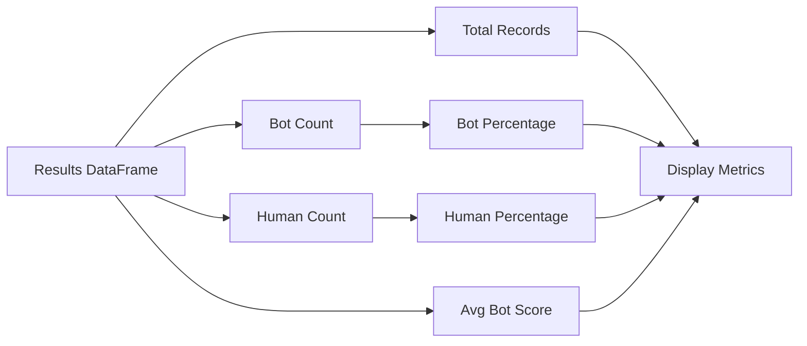

**Metric Definitions**:

| Metric | Formula | Business Meaning |
|--------|---------|------------------|
| Total Records | `count(results)` | Size of analyzed dataset |
| Bot Interventions | `count(prediction == 'Likely Bot')` | Number of bot-driven engagements |
| Human Behavior | `count(prediction == 'Likely Human')` | Number of genuine user engagements |
| Bot Percentage | `(bot_count / total) * 100` | Contamination rate |
| Human Percentage | `(human_count / total) * 100` | Clean data rate |
| Avg Bot Score | `mean(bot_probability_score)` | Overall dataset bot propensity |

#### 4.2 Visualization Functions

**Purpose**: Create interactive charts for data exploration and insights.

**Visualization Types**:

##### 4.2.1 Distribution Bar Chart

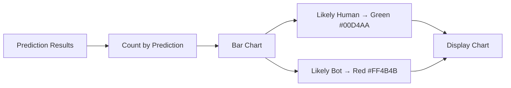

**Chart Configuration**:
- **X-axis**: Prediction Type (Likely Bot / Likely Human)
- **Y-axis**: Count
- **Colors**: Green for Human, Red for Bot
- **Labels**: Show count values on bars
- **Interactivity**: Hover for details

##### 4.2.2 Probability Histogram


**Chart Configuration**:
- **X-axis**: Bot Probability Score (0.0 - 1.0)
- **Y-axis**: Frequency
- **Bins**: 20 equal-width bins
- **Color**: Blue (#0068C9)
- **Threshold Line**: Optional vertical line at 0.7

##### 4.2.3 Feature Analysis Box Plot

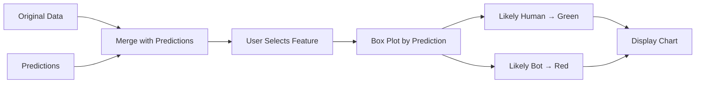

**Chart Configuration**:
- **X-axis**: Prediction Type
- **Y-axis**: Selected Feature Value
- **Box elements**: Min, Q1, Median, Q3, Max, Outliers
- **Colors**: Consistent with theme
- **Comparison**: Bot vs. Human distributions

**Supported Features for Analysis**:
- time_to_open_sec
- time_to_click_sec
- num_opens
- click_sequence_entropy
- Any numeric column from original data

#### 4.3 Export Function

**Purpose**: Allow users to download results for further analysis.

**Export Process**:

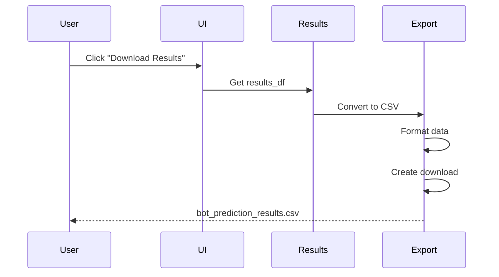

**Export Format**:
- **Format**: CSV (Comma-Separated Values)
- **Encoding**: UTF-8
- **Filename**: `bot_prediction_results.csv`
- **Includes**:
  - All original columns from input data
  - bot_probability_score (3 decimal places)
  - prediction (Likely Bot / Likely Human)
  - reasoning (full text explanation)

**CSV Structure**:
```csv
recipient_domain,time_to_open_sec,num_opens,...,bot_probability_score,prediction,reasoning
gmail.com,27.93,3,...,0.247,Likely Human,Normal timing from common email domain
enterprise.ca,0.84,3,...,0.892,Likely Bot,Sub-second email opening time; Datacenter IP with rapid engagement
```

### 5. User Interaction Workflows

#### 5.1 Standard Analysis Workflow

```mermaid
graph TD
    START[User Opens App] --> UPLOAD_TAB[Navigate to Upload Tab]
    UPLOAD_TAB --> INSTRUCTIONS[Read Instructions]
    INSTRUCTIONS --> SELECT[Select CSV File]

    SELECT --> AUTO_UPLOAD[File Auto-Uploaded]
    AUTO_UPLOAD --> VALIDATE[Automatic Validation]

    VALIDATE --> VALID{Valid?}

    VALID -->|No| ERRORS[Display Error Messages]
    ERRORS --> FIX[User Fixes Data]
    FIX --> SELECT

    VALID -->|Yes| PREVIEW[Display Data Preview]
    PREVIEW --> ANALYZE[Click "Analyze Data" Button]

    ANALYZE --> PROCESS[Processing Animation]
    PROCESS --> DETECT[Bot Detection Running]
    DETECT --> COMPLETE[Processing Complete]

    COMPLETE --> SUCCESS[Success Message]
    SUCCESS --> RESULT_TAB[Auto-Navigate to Results Tab]

    RESULT_TAB --> METRICS[View Summary Metrics]
    METRICS --> TABLE[Review Detailed Results]

    TABLE --> DECISION{Satisfied?}

    DECISION -->|Want Analytics| ANALYTICS_TAB[Navigate to Analytics Tab]
    DECISION -->|Want Export| DOWNLOAD[Download Results]
    DECISION -->|Want New Analysis| UPLOAD_TAB

    ANALYTICS_TAB --> VIZ1[View Distribution Charts]
    VIZ1 --> VIZ2[Explore Feature Analysis]
    VIZ2 --> INSIGHTS[Gain Insights]

    INSIGHTS --> DOWNLOAD
    DOWNLOAD --> END[Complete]
```

#### 5.2 Error Recovery Workflow

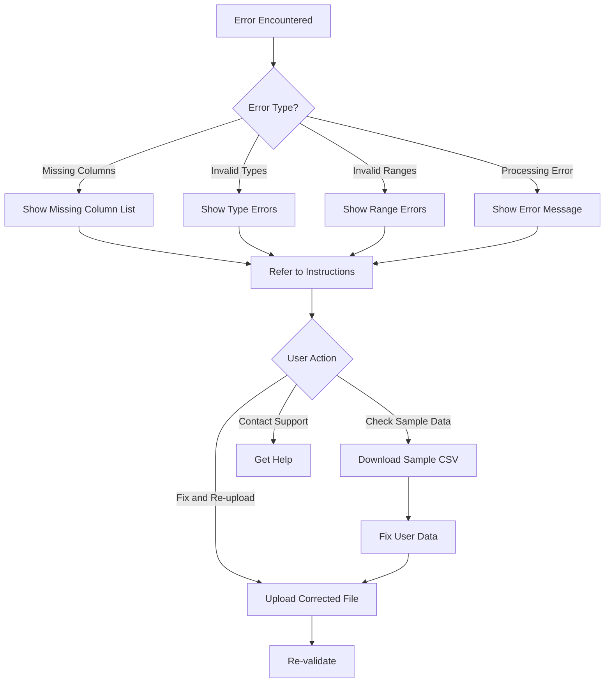

### 6. Business Rules Engine

#### 6.1 Classification Business Rules

**Rule Set 1: Critical Bot Indicators** (Immediate high probability)
```
IF time_to_open_sec < 1.0 THEN bot_score += 0.4
IF time_to_click_sec < 1.0 THEN bot_score += 0.4
IF user_agent MATCHES bot_pattern THEN bot_score += 0.5
IF (ip_type = 'datacenter' AND time_to_open_sec < 5.0) THEN bot_score += 0.4
```

**Rule Set 2: Moderate Bot Indicators** (Increase suspicion)
```
IF multiple_opens_30s > 2 THEN bot_score += 0.3
IF (click_sequence_entropy > 0.8 AND time_to_click_sec < 2.0) THEN bot_score += 0.3
IF (fast_opener_flag = TRUE AND time_to_click_sec < 3.0) THEN bot_score += 0.25
```

**Rule Set 3: Pattern Analysis** (Behavioral consistency)
```
IF (time_to_open_sec < 2.0 AND time_to_click_sec < 2.0) THEN bot_score += 0.35
IF (user_agent IS EMPTY OR user_agent IS NULL) THEN bot_score += 0.3
IF (click_sequence_entropy < 0.3 AND multiple_opens_30s > 1) THEN bot_score += 0.25
```

**Rule Set 4: False Positive Reduction** (Protect genuine users)
```
IF (is_common_domain = TRUE AND time_to_open_sec > 10.0) THEN bot_score -= 0.2
IF (ip_type = 'residential' AND time_to_open_sec > 5.0) THEN bot_score -= 0.15
```

**Rule Set 5: Final Classification** (Decision logic)
```
bot_score = CLIP(bot_score, 0, 1)  // Constrain to valid probability range

IF bot_score > 0.7 THEN
    prediction = 'Likely Bot'
ELSE
    prediction = 'Likely Human'
END IF
```

#### 6.2 Data Quality Rules

**Rule Set 1: Acceptance Criteria**
```
CSV file must have:
- All 9 required columns present
- At least 1 data row (excluding header)
- Proper CSV format (comma-delimited)
- Valid encodings (UTF-8, ASCII, ISO-8859-1)
```

**Rule Set 2: Data Integrity Rules**
```
time_to_open_sec >= 0 (reject negative values)
time_to_click_sec >= 0 (reject negative values)
num_opens >= 0 (reject negative values)
0.0 <= click_sequence_entropy <= 1.0 (reject out of range)
ip_type IN ['corp', 'mobile', 'datacenter', 'residential'] (normalize)
```

**Rule Set 3: Business Logic Validation**
```
IF time_to_click_sec > 0 AND time_to_open_sec = 0 THEN
    WARNING: "Click before open - possible data issue"
END IF

IF num_opens > 100 THEN
    WARNING: "Unusually high open count - verify data"
END IF
```

## Functional Integration Points

### Integration with External Systems

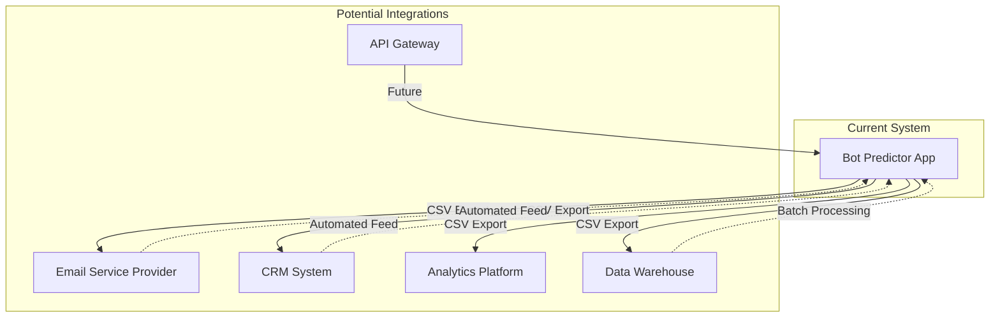

**Current Integration Method**: Manual CSV export/import

**Future Integration Opportunities**:
1. **REST API**: Programmatic access to bot detection
2. **Webhook Integration**: Real-time bot detection
3. **Database Connector**: Direct database integration
4. **ESP Plugins**: Native integration with email platforms
5. **Stream Processing**: Kafka/Event-driven architecture

## Performance Characteristics

### Functional Performance Metrics

| Function | Input Size | Processing Time | Throughput |
|----------|-----------|-----------------|------------|
| File Upload | 10MB / 50k rows | < 2 seconds | N/A |
| Data Validation | 50k rows | < 1 second | 50k rows/sec |
| Data Preprocessing | 50k rows | < 2 seconds | 25k rows/sec |
| Feature Engineering | 50k rows | < 3 seconds | 16k rows/sec |
| Model Training | 50k rows | < 10 seconds | 5k rows/sec |
| Prediction | 50k rows | < 5 seconds | 10k rows/sec |
| Visualization | 50k rows | < 2 seconds | N/A |
| CSV Export | 50k rows | < 1 second | 50k rows/sec |

### Optimization Strategies

**Current Optimizations**:
1. Vectorized operations (NumPy/Pandas)
2. Cached feature calculations
3. Lazy model training
4. Session state caching
5. Efficient data structures

**Future Optimizations**:
1. Parallel processing for large datasets
2. Incremental processing for streaming data
3. GPU acceleration for model training
4. Advanced caching strategies
5. Database indexing for persistent storage

## Conclusion

The functional architecture of the Bot Intervention Predictor is designed around clear business logic, robust data processing, and intelligent bot detection algorithms. The system provides comprehensive functionality for:

1. **Data Quality Assurance** - Rigorous validation and preprocessing
2. **Intelligent Detection** - Multi-faceted feature engineering and ML-based classification
3. **Transparency** - Clear reasoning for every prediction
4. **Usability** - Intuitive workflows and interactive visualizations
5. **Flexibility** - Exportable results for further analysis

The modular functional design enables easy enhancement, testing, and maintenance while delivering reliable bot detection capabilities for email marketing analytics.
