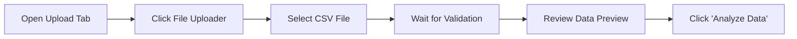
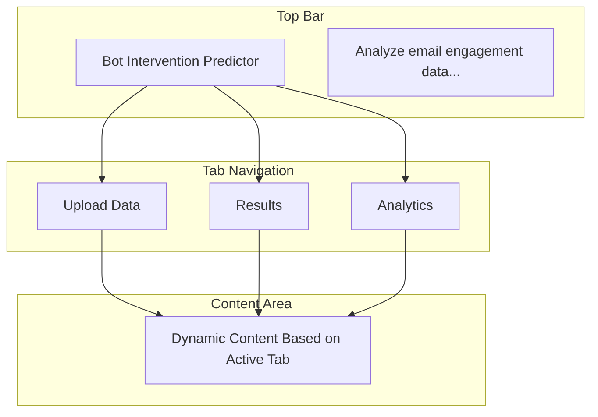
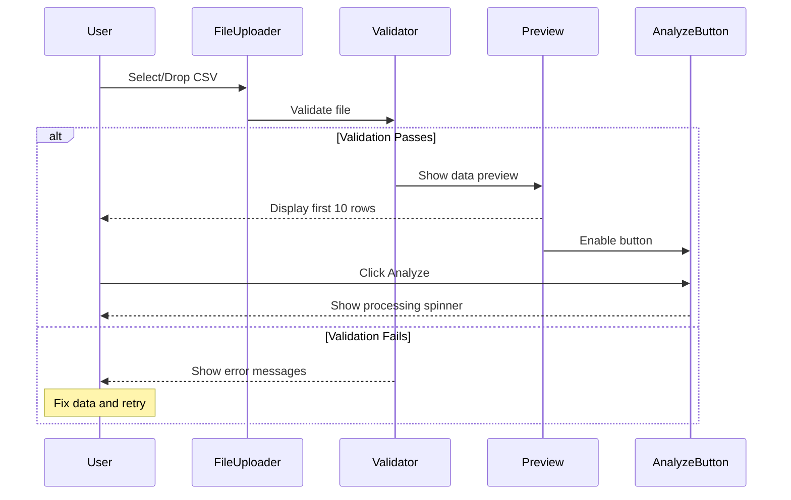

# Bot Intervention Predictor - User Guide

## Table of Contents

1. [Introduction](#introduction)
2. [Getting Started](#getting-started)
3. [System Requirements](#system-requirements)
4. [Installation Guide](#installation-guide)
5. [Quick Start Tutorial](#quick-start-tutorial)
6. [Detailed User Interface Guide](#detailed-user-interface-guide)
7. [Data Preparation Guidelines](#data-preparation-guidelines)
8. [Understanding Results](#understanding-results)
9. [Advanced Features](#advanced-features)
10. [Troubleshooting](#troubleshooting)
11. [Best Practices](#best-practices)
12. [FAQ](#faq)

## Introduction

### What is the Bot Intervention Predictor?

The Bot Intervention Predictor is an AI-powered tool that helps email marketers identify automated bot interventions in their email engagement data. By analyzing patterns in opens, clicks, and other engagement metrics, the tool distinguishes between genuine human interactions and automated bot activity.

### Who Should Use This Tool?

- **Email Marketing Analysts** - Clean engagement data for accurate reporting
- **Marketing Operations Teams** - Ensure data quality in marketing automation
- **Data Analysts** - Improve accuracy of customer analytics
- **Marketing Managers** - Make better decisions with clean data

### What Problems Does It Solve?

- **Inflated Metrics**: Identifies bot-driven opens and clicks that inflate engagement rates
- **Poor Segmentation**: Helps create segments based on genuine user behavior
- **Wasted Budget**: Prevents optimization based on bot-contaminated data
- **Inaccurate Reporting**: Provides clean data for stakeholder reporting

## Getting Started

### Accessing the Application

**Local Installation**:
```bash
# Navigate to the application directory
cd /path/to/bot_detect_analyzer

# Run the application
streamlit run app.py
```

The application will open in your default web browser at `http://localhost:8517`

**Web-Based Access**:
If deployed to a server, navigate to the provided URL in your web browser.

### First-Time Setup

1. **Open the application** in your web browser
2. **Familiarize yourself** with the three main tabs:
   - Upload Data
   - Results
   - Analytics
3. **Download the sample data** to understand the required format
4. **Read the instructions** in the Upload Data tab

### Sample Data

A sample CSV file is included: `sample_data.csv`

This file demonstrates the correct format and includes examples of both bot and human engagement patterns.

## System Requirements

### Browser Requirements

**Recommended Browsers**:
- Google Chrome 90 or newer
- Mozilla Firefox 88 or newer
- Microsoft Edge 90 or newer
- Safari 14 or newer

**Browser Settings**:
- JavaScript must be enabled
- Cookies must be enabled (for session state)
- Minimum screen resolution: 1280x720

### File Requirements

**CSV Files**:
- Maximum file size: 10MB
- Maximum rows: ~100,000 (recommended)
- Encoding: UTF-8 (preferred), ASCII, or ISO-8859-1
- Format: Standard CSV with comma delimiters

**System Performance**:
- Recommended RAM: 4GB or more
- Stable internet connection (for web-based deployments)

## Installation Guide

### Option 1: Local Installation (Recommended for Development)

#### Prerequisites

- Python 3.11 or higher
- pip (Python package installer)
- uv (optional, for faster installation)

#### Step-by-Step Installation

1. **Clone or download the application**:
   ```bash
   # Navigate to your desired directory
   cd /path/to/projects

   # If using git
   git clone <repository-url>
   cd bot_detect_analyzer
   ```

2. **Install dependencies**:

   **Option A: Using uv (faster)**:
   ```bash
   # Install uv if not already installed
   pip install uv

   # Install dependencies
   uv pip install -r pyproject.toml
   ```

   **Option B: Using pip**:
   ```bash
   pip install streamlit pandas numpy scikit-learn plotly joblib
   ```

3. **Verify installation**:
   ```bash
   # Check Streamlit installation
   streamlit --version

   # Should output: Streamlit, version 1.45.1 (or newer)
   ```

4. **Run the application**:
   ```bash
   streamlit run app.py
   ```

5. **Access the application**:
   - Open your browser to `http://localhost:8517`
   - The application should load automatically

### Option 2: Docker Installation (Recommended for Production)

#### Prerequisites

- Docker installed and running
- Docker Compose (optional)

#### Step-by-Step Installation

1. **Create a Dockerfile** (if not present):
   ```dockerfile
   FROM python:3.11-slim

   WORKDIR /app

   # Copy dependencies
   COPY pyproject.toml uv.lock* ./

   # Install dependencies
   RUN pip install uv && \
       uv pip install --system streamlit pandas numpy scikit-learn plotly joblib

   # Copy application files
   COPY . .

   # Expose port
   EXPOSE 8517

   # Run application
   CMD ["streamlit", "run", "app.py", "--server.address=0.0.0.0"]
   ```

2. **Build the Docker image**:
   ```bash
   docker build -t bot-detector .
   ```

3. **Run the container**:
   ```bash
   docker run -p 8517:8517 bot-detector
   ```

4. **Access the application**:
   - Open your browser to `http://localhost:8517`

### Option 3: Cloud Deployment

#### Streamlit Cloud (Easiest)

1. Push your code to GitHub
2. Go to [share.streamlit.io](https://share.streamlit.io)
3. Connect your GitHub repository
4. Deploy with one click

#### Other Cloud Platforms

- **Heroku**: Use the provided Dockerfile
- **AWS EC2**: Follow Docker installation steps
- **Google Cloud Run**: Deploy as a container
- **Azure App Service**: Deploy as a web app

## Quick Start Tutorial

### Tutorial: Analyzing Your First Dataset

Follow this 5-minute tutorial to analyze bot interventions in email engagement data.

#### Step 1: Prepare Your Data (2 minutes)

1. **Gather your email engagement data** with these columns:
   - recipient_domain
   - time_to_open_sec
   - num_opens
   - user_agent
   - ip_type
   - time_to_click_sec
   - click_sequence_entropy
   - fast_opener_flag
   - multiple_opens_30s

2. **Format as CSV** with headers in the first row

3. **Example format**:
   ```csv
   recipient_domain,time_to_open_sec,num_opens,user_agent,ip_type,time_to_click_sec,click_sequence_entropy,fast_opener_flag,multiple_opens_30s
   gmail.com,27.93,3,Mozilla/5.0 (Macintosh),mobile,97.29,0.23,FALSE,0
   enterprise.ca,0.84,3,headlesschrome/120.0,datacenter,0.57,0.9,TRUE,6
   ```

#### Step 2: Upload Your Data (1 minute)



1. **Navigate** to the "Upload Data" tab
2. **Click** the file uploader area
3. **Select** your CSV file
4. **Wait** for validation (should be instant)
5. **Review** the data preview showing first 10 rows
6. **Click** "Analyze Data" button

#### Step 3: View Results (1 minute)

The application automatically navigates to the Results tab.

**What you'll see**:
- **Summary metrics** at the top:
  - Total Records
  - Bot Interventions (count and percentage)
  - Human Behavior (count and percentage)
  - Average Bot Score

- **Detailed results table** with:
  - All original columns
  - bot_probability_score (0-1 scale)
  - prediction (Likely Bot / Likely Human)
  - reasoning (explanation)

#### Step 4: Explore Analytics (1 minute)

1. **Navigate** to the "Analytics" tab
2. **View** the distribution charts:
   - Bot vs. Human bar chart
   - Probability score histogram
3. **Select a feature** from the dropdown (e.g., time_to_open_sec)
4. **Analyze** the box plot comparing bots vs. humans

#### Step 5: Export Results (30 seconds)

1. **Return** to the "Results" tab
2. **Click** "Download Results CSV"
3. **Save** the file to your computer
4. **Open** in Excel or your preferred tool

**Congratulations!** You've completed your first bot detection analysis.

## Detailed User Interface Guide

### Application Layout



### Tab 1: Upload Data

#### Interface Elements

```
┌─────────────────────────────────────────────────┐
│ 📁 Upload Data Tab                              │
├─────────────────────────────────────────────────┤
│                                                 │
│ Upload Email Engagement Data                    │
│                                                 │
│ ┌─ 📋 Required CSV Columns ─────────────────┐  │
│ │ [Expandable Section - Click to view]      │  │
│ │ • recipient_domain                        │  │
│ │ • time_to_open_sec                        │  │
│ │ • [more columns...]                       │  │
│ └──────────────────────────────────────────┘  │
│                                                 │
│ ┌─ Choose a CSV file ───────────────────────┐  │
│ │  Drag and drop file here                  │  │
│ │  or browse                                │  │
│ │  Limit 10MB per file • CSV                │  │
│ └──────────────────────────────────────────┘  │
│                                                 │
│ [File uploaded successfully! Found N records]   │
│                                                 │
│ Data Preview                                    │
│ [Table showing first 10 rows]                   │
│                                                 │
│ ┌──────────────────────────────────────────┐  │
│ │      🚀 Analyze Data                      │  │
│ └──────────────────────────────────────────┘  │
│                                                 │
└─────────────────────────────────────────────────┘
```

#### Component Details

**1. Instructions Expander**
- **Location**: Top of upload tab
- **Default state**: Expanded on first visit
- **Purpose**: Shows required column specifications
- **Action**: Click header to expand/collapse

**2. File Uploader**
- **Location**: Below instructions
- **Accepts**: .csv files only
- **Methods**:
  - Drag and drop
  - Click to browse
- **Feedback**: Shows filename and size when selected

**3. Data Preview Table**
- **Location**: Below file uploader (after successful upload)
- **Shows**: First 10 rows of data
- **Features**:
  - Scrollable horizontally for many columns
  - Sortable by clicking column headers
  - Searchable (type in header row)

**4. Analyze Data Button**
- **Location**: Below data preview
- **State**: Enabled only after successful upload
- **Appearance**: Primary blue button, full width
- **Action**: Triggers analysis pipeline

#### Upload Workflow



### Tab 2: Results

#### Interface Elements

```
┌─────────────────────────────────────────────────┐
│ 📊 Results Tab                                  │
├─────────────────────────────────────────────────┤
│                                                 │
│ Prediction Results                              │
│                                                 │
│ ┌─────┐  ┌─────┐  ┌─────┐  ┌─────┐           │
│ │Total│  │ Bot │  │Human│  │ Avg │           │
│ │ 100 │  │ 24  │  │ 76  │  │0.45 │           │
│ │     │  │ 24% │  │ 76% │  │Score│           │
│ └─────┘  └─────┘  └─────┘  └─────┘           │
│                                                 │
│ ℹ Classification uses 0.7 threshold...          │
│                                                 │
│ Detailed Results                                │
│ ┌──────────────────────────────────────────┐  │
│ │ [Scrollable table with all results]      │  │
│ │ recipient_domain | time_to_open | ...    │  │
│ │ bot_probability_score | prediction |     │  │
│ │ reasoning                                │  │
│ └──────────────────────────────────────────┘  │
│                                                 │
│ ┌──────────────────────────────────────────┐  │
│ │      📥 Download Results CSV              │  │
│ └──────────────────────────────────────────┘  │
│                                                 │
└─────────────────────────────────────────────────┘
```

#### Component Details

**1. Summary Metrics** (4 metric cards)

| Metric | Description | Visual Indicator |
|--------|-------------|------------------|
| Total Records | Count of analyzed records | Number only |
| Bot Interventions | Count and percentage of bots | Delta shows percentage |
| Human Behavior | Count and percentage of humans | Delta shows percentage |
| Avg Bot Score | Mean probability score | 3 decimal places |

**2. Information Banner**
- **Content**: Explains classification threshold (0.7)
- **Purpose**: Set user expectations
- **Color**: Light blue info box

**3. Results Table**
- **Columns**: All original + 3 new columns
- **Special formatting**:
  - `bot_probability_score`: Progress bar (0-1)
  - `prediction`: Text with color coding
  - `reasoning`: Full-width text cell
- **Features**:
  - Column sorting
  - Column filtering
  - Full-text search
  - Horizontal scrolling for many columns

**4. Download Button**
- **Location**: Below results table
- **Format**: CSV file download
- **Filename**: `bot_prediction_results.csv`
- **Content**: Complete results with all columns

### Tab 3: Analytics

#### Interface Elements

```
┌─────────────────────────────────────────────────┐
│ 📈 Analytics Tab                                │
├─────────────────────────────────────────────────┤
│                                                 │
│ Analytics Dashboard                             │
│                                                 │
│ ┌──────────────┐  ┌──────────────┐            │
│ │              │  │              │            │
│ │ Bot vs Human │  │ Probability  │            │
│ │ Distribution │  │ Distribution │            │
│ │  [Bar Chart] │  │ [Histogram]  │            │
│ │              │  │              │            │
│ └──────────────┘  └──────────────┘            │
│                                                 │
│ Feature Analysis                                │
│ Select feature to analyze: [Dropdown ▼]         │
│                                                 │
│ ┌─────────────────────────────────────────┐   │
│ │                                         │   │
│ │   [Feature Name] by Prediction Type     │   │
│ │        [Box Plot Chart]                 │   │
│ │                                         │   │
│ └─────────────────────────────────────────┘   │
│                                                 │
└─────────────────────────────────────────────────┘
```

#### Visualization Details

**1. Bot vs. Human Distribution (Bar Chart)**

- **Purpose**: Shows count breakdown of predictions
- **X-axis**: Prediction type (Likely Bot, Likely Human)
- **Y-axis**: Count
- **Colors**:
  - Green (#00D4AA) for Likely Human
  - Red (#FF4B4B) for Likely Bot
- **Labels**: Count values displayed on bars
- **Interactions**: Hover to see exact values

**2. Bot Probability Distribution (Histogram)**

- **Purpose**: Shows distribution of probability scores
- **X-axis**: Bot Probability Score (0.0 to 1.0)
- **Y-axis**: Frequency
- **Bins**: 20 equal-width bins
- **Color**: Blue (#0068C9)
- **Interactions**:
  - Hover to see bin range and count
  - Zoom and pan enabled

**3. Feature Analysis (Box Plot)**

- **Purpose**: Compare feature values between bot and human groups
- **X-axis**: Prediction type
- **Y-axis**: Selected feature value
- **Elements**: Min, Q1, Median, Q3, Max, Outliers
- **Colors**: Match bar chart (green/red)
- **Interactions**:
  - Hover to see statistics
  - Select feature from dropdown

**Available Features**:
- time_to_open_sec
- time_to_click_sec
- num_opens
- click_sequence_entropy
- All numeric columns from input

## Data Preparation Guidelines

### Required Data Format

#### CSV Structure

**Header Row** (Required):
```csv
recipient_domain,time_to_open_sec,num_opens,user_agent,ip_type,time_to_click_sec,click_sequence_entropy,fast_opener_flag,multiple_opens_30s
```

**Data Rows**:
```csv
gmail.com,27.93,3,Mozilla/5.0 (Macintosh),mobile,97.29,0.23,FALSE,0
personalmail.com,98.73,3,Mozilla/5.0 (iPhone),corp,25.13,0.4,FALSE,1
enterprise.ca,0.84,3,headlesschrome/120.0,datacenter,0.57,0.9,TRUE,6
```

### Column Specifications

#### 1. recipient_domain
- **Type**: String
- **Description**: Email domain of the recipient
- **Examples**: `gmail.com`, `yahoo.com`, `corporate-email.com`
- **Null Allowed**: No
- **Notes**: Can be any valid email domain

#### 2. time_to_open_sec
- **Type**: Numeric (decimal)
- **Description**: Time in seconds from email send to first open
- **Range**: >= 0
- **Examples**: `27.93`, `0.84`, `145.67`
- **Null Allowed**: No
- **Notes**: Sub-second values (< 1.0) are strong bot indicators

#### 3. num_opens
- **Type**: Integer
- **Description**: Total number of times the email was opened
- **Range**: >= 0
- **Examples**: `1`, `3`, `12`
- **Null Allowed**: No
- **Notes**: Values > 10 are suspicious

#### 4. user_agent
- **Type**: String
- **Description**: Browser/client user agent string
- **Examples**:
  - `Mozilla/5.0 (Windows NT 10.0; Win64; x64)`
  - `headlesschrome/120.0`
  - (can be empty)
- **Null Allowed**: Yes
- **Notes**: Empty or bot-like strings increase bot probability

#### 5. ip_type
- **Type**: String (categorical)
- **Description**: Type of IP address used
- **Valid Values**:
  - `corp` - Corporate network
  - `mobile` - Mobile network
  - `datacenter` - Datacenter/cloud
  - `residential` - Home/residential
- **Null Allowed**: No
- **Notes**: Case insensitive, will be normalized

#### 6. time_to_click_sec
- **Type**: Numeric (decimal)
- **Description**: Time in seconds from open to first click
- **Range**: >= 0
- **Examples**: `97.29`, `0.57`, `234.12`
- **Null Allowed**: No (use 0 if no clicks)
- **Notes**: Very fast clicks (< 2s) suggest automation

#### 7. click_sequence_entropy
- **Type**: Float
- **Description**: Entropy measure of click pattern (0 = predictable, 1 = random)
- **Range**: 0.0 to 1.0
- **Examples**: `0.23`, `0.65`, `0.9`
- **Null Allowed**: No
- **Notes**: Low entropy (< 0.5) suggests bot behavior

#### 8. fast_opener_flag
- **Type**: Boolean
- **Description**: Flag indicating rapid email opening
- **Valid Values**:
  - `TRUE`, `True`, `true`, `1`, `YES`, `Yes`
  - `FALSE`, `False`, `false`, `0`, `NO`, `No`
- **Null Allowed**: No
- **Notes**: Will be converted to 0/1 internally

#### 9. multiple_opens_30s
- **Type**: Integer
- **Description**: Number of opens within 30-second window
- **Range**: >= 0
- **Examples**: `0`, `1`, `6`
- **Null Allowed**: Yes (defaults to 0)
- **Notes**: Values > 2 are suspicious

### Data Preparation Checklist

Before uploading your CSV file, verify:

- [ ] File is saved as .csv format (not .xlsx or .txt)
- [ ] File has header row with exact column names (case-sensitive)
- [ ] All 9 required columns are present
- [ ] No extra commas in data values (use quotes if needed)
- [ ] Numeric fields contain only numbers (no text)
- [ ] Boolean fields use valid values (TRUE/FALSE or 0/1)
- [ ] ip_type values are one of: corp, mobile, datacenter, residential
- [ ] No negative values in numeric fields
- [ ] click_sequence_entropy values are between 0 and 1
- [ ] File size is under 10MB
- [ ] Encoding is UTF-8 (or ASCII/ISO-8859-1)

### Common Data Issues and Solutions

#### Issue 1: Missing Columns

**Error**: "Missing required columns: user_agent, ip_type"

**Solution**:
1. Add the missing columns to your CSV
2. Ensure column names match exactly (case-sensitive)
3. Check for typos in column names

#### Issue 2: Invalid Data Types

**Error**: "time_to_open_sec must be numeric"

**Solution**:
1. Remove any text from numeric columns
2. Use decimal point (.) not comma (,) for decimals
3. Ensure no currency symbols or units

#### Issue 3: Out of Range Values

**Error**: "click_sequence_entropy must be between 0 and 1"

**Solution**:
1. Verify entropy calculation
2. Normalize values to 0-1 range
3. Check for typos (e.g., 10 instead of 0.10)

#### Issue 4: Invalid Boolean Values

**Error**: "fast_opener_flag must contain boolean values"

**Solution**:
1. Use TRUE/FALSE or 1/0
2. Remove any other values (Yes/No, T/F, etc.) or convert them
3. Ensure consistent capitalization

### Data Cleaning Tips

**Before Upload**:
1. **Remove duplicate rows**: Filter out identical records
2. **Handle missing values**:
   - For numeric: Use median or mean
   - For categorical: Use 'unknown' or most common value
3. **Validate ranges**: Check for impossible values (e.g., negative times)
4. **Standardize formats**: Ensure consistent date, time, boolean formats
5. **Test with sample**: Upload small sample (10-100 rows) first

**Excel to CSV Conversion**:
1. Open Excel file
2. File → Save As
3. Choose "CSV UTF-8 (Comma delimited) (.csv)"
4. Click Save
5. Verify in text editor before uploading

## Understanding Results

### Interpreting Bot Probability Scores

**Score Ranges and Meanings**:

| Score Range | Interpretation | Recommendation |
|-------------|----------------|----------------|
| 0.9 - 1.0 | Very high confidence bot | Definitely exclude from analytics |
| 0.7 - 0.9 | High confidence bot | Classified as "Likely Bot" |
| 0.5 - 0.7 | Medium confidence | Classified as "Likely Human" but review reasoning |
| 0.3 - 0.5 | Low bot probability | Likely genuine engagement |
| 0.0 - 0.3 | Very low bot probability | Almost certainly human |

**Classification Threshold**: 0.7
- Scores **above 0.7** → Classified as "Likely Bot"
- Scores **below 0.7** → Classified as "Likely Human"

### Reading Reasoning Statements

The reasoning field explains why a record was classified as bot or human.

**Example Bot Reasoning**:
```
"Sub-second email opening time; Datacenter IP with rapid engagement; Missing user agent string"
```

**What this means**:
- Email was opened in under 1 second (highly suspicious)
- Came from a datacenter IP address (not a personal device)
- No user agent provided (suggests automation)

**Example Human Reasoning**:
```
"Normal timing from common email domain"
```

**What this means**:
- Email was opened at normal human speed
- Domain is a common consumer email provider (gmail, yahoo, etc.)
- Behavior consistent with real user

### Common Bot Patterns

**Pattern 1: Security Scanner**
- **Characteristics**: Very fast open and click (< 1 second each)
- **Reasoning**: "Sub-second email opening time; Sub-second click response time"
- **Cause**: Corporate security tools scanning for threats
- **Action**: Exclude from engagement metrics

**Pattern 2: Email Preview Service**
- **Characteristics**: Fast open, datacenter IP, bot user agent
- **Reasoning**: "Automated user agent detected; Datacenter IP with rapid engagement"
- **Cause**: Email client pre-fetching or preview generation
- **Action**: Exclude from open rate calculations

**Pattern 3: Automated Monitoring**
- **Characteristics**: Multiple rapid opens, low entropy, missing user agent
- **Reasoning**: "Excessive opens in 30s (6); Missing user agent string; Low entropy with multiple rapid opens"
- **Cause**: Monitoring systems checking email delivery
- **Action**: Exclude from all engagement metrics

**Pattern 4: Link Crawler**
- **Characteristics**: Very fast click, high entropy with rapid action
- **Reasoning**: "High entropy with rapid clicks (contradictory); Sub-second click response time"
- **Cause**: Automated link checking or crawling
- **Action**: Exclude from click-through rate

### Using Results for Decision Making

#### Scenario 1: Campaign Performance Analysis

**Goal**: Determine true campaign performance

**Steps**:
1. Upload campaign engagement data
2. Review bot contamination rate (Bot Interventions %)
3. Filter results to include only "Likely Human" records
4. Recalculate metrics:
   - Open rate = (Human opens / Total sent)
   - Click rate = (Human clicks / Total sent)
   - CTR = (Human clicks / Human opens)

**Example**:
- Total records: 1,000
- Bot interventions: 240 (24%)
- True human engagement: 760 (76%)
- Adjusted open rate: 76% (instead of inflated 100%)

#### Scenario 2: Audience Segmentation

**Goal**: Create "highly engaged" segment for retargeting

**Steps**:
1. Upload engagement data from multiple campaigns
2. Filter to "Likely Human" only
3. Sort by engagement metrics (opens, clicks)
4. Export filtered list
5. Upload to email platform for targeted campaign

**Benefit**: Better conversion rates by targeting real users

#### Scenario 3: A/B Test Validation

**Goal**: Verify A/B test results aren't skewed by bots

**Steps**:
1. Upload data for both test variants
2. Check bot contamination rate in each variant
3. If similar (within 5%), results are reliable
4. If different, recalculate performance excluding bots
5. Make optimization decision based on clean data

**Example**:
- Variant A: 30% bot rate, 20% human open rate
- Variant B: 10% bot rate, 25% human open rate
- Conclusion: Variant B performs better with real users

## Advanced Features

### Batch Processing

**Process multiple files efficiently**:

1. **Prepare files**: Name consistently (e.g., campaign1.csv, campaign2.csv)
2. **Process one at a time**: Upload, analyze, download results
3. **Combine results**: Merge CSV files using Excel or script
4. **Aggregate analysis**: Analyze patterns across campaigns

**Tip**: Use a spreadsheet to track processing:
```
| Filename | Records | Bots | % Bot | Status |
|----------|---------|------|-------|--------|
| Jan.csv  | 1,000   | 240  | 24%   | Done   |
| Feb.csv  | 1,200   | 180  | 15%   | Done   |
```

### Threshold Adjustment (Advanced Users)

While the default threshold is 0.7, you can effectively adjust sensitivity:

**More Conservative (Fewer False Positives)**:
- Filter exported results to only include scores > 0.8
- Use for high-stakes decisions
- Example: Permanently blocking domains

**More Aggressive (Higher Recall)**:
- Include scores > 0.5 in your bot count
- Use for data exploration
- Example: Identifying potential bot patterns

### Integration with External Tools

#### Excel Integration

1. **Download results CSV**
2. **Open in Excel**
3. **Use as external data source** for pivot tables
4. **Create dashboards** combining multiple campaigns

**Useful Excel formulas**:
```excel
=COUNTIF(prediction, "Likely Bot")  // Count bots
=AVERAGEIF(prediction, "Likely Human", time_to_open_sec)  // Avg human open time
```

#### Power BI / Tableau Integration

1. **Import CSV** as data source
2. **Create calculated fields** for metrics
3. **Build visualizations**:
   - Bot rate trends over time
   - Bot patterns by domain
   - Engagement quality scores

#### CRM Integration

1. **Export results with email addresses** (add to original data)
2. **Match on email** or recipient ID
3. **Create segments**:
   - Genuine engagers (human)
   - Bot-contaminated records (exclude)
4. **Sync segments** to CRM

### Custom Reporting

**Create a summary report template**:

```markdown
# Bot Detection Report - [Campaign Name]

## Summary
- Total Records: [number]
- Bot Interventions: [number] ([%])
- Human Engagement: [number] ([%])

## Key Findings
- [Finding 1]
- [Finding 2]
- [Finding 3]

## Recommendations
- [Action 1]
- [Action 2]

## Next Steps
- [Step 1]
- [Step 2]
```

## Troubleshooting

### Common Issues and Solutions

#### Issue: File Upload Fails

**Symptoms**: Error message when uploading file

**Possible Causes**:
1. File is not CSV format
2. File is too large (> 10MB)
3. File is corrupted
4. Browser issue

**Solutions**:
1. Verify file extension is .csv
2. Check file size, split if necessary
3. Re-export from source system
4. Try different browser or clear cache

#### Issue: Validation Errors

**Symptoms**: Red error messages after upload

**Solution Steps**:
1. **Read error messages carefully** - They specify what's wrong
2. **Open CSV in text editor** - Check format
3. **Fix identified issues**:
   - Add missing columns
   - Correct data types
   - Fix value ranges
4. **Re-upload corrected file**

#### Issue: Processing Takes Too Long

**Symptoms**: Spinner runs for > 1 minute

**Possible Causes**:
1. Very large file
2. Server resource limitations
3. Network issues

**Solutions**:
1. **Check file size**: Recommend < 50,000 rows
2. **Split large files**: Process in batches
3. **Refresh page** and try again
4. **Contact administrator** if persistent

#### Issue: Results Look Incorrect

**Symptoms**: Bot rate seems too high or low

**Possible Causes**:
1. Data quality issues in input
2. Misunderstanding of fields
3. Edge cases in data

**Solutions**:
1. **Review sample records** manually
2. **Check data definitions** - Ensure fields match expected format
3. **Examine reasoning** - Understand why records were classified
4. **Verify timestamps** - Ensure they're in seconds, not milliseconds
5. **Check entropy calculation** - Should be 0-1 range

#### Issue: Cannot Download Results

**Symptoms**: Download button doesn't work

**Solutions**:
1. **Check browser settings** - Allow downloads
2. **Disable popup blocker** for the site
3. **Try right-click → Save As** on download button
4. **Use different browser**

#### Issue: Charts Not Displaying

**Symptoms**: Blank areas where charts should be

**Solutions**:
1. **Check browser compatibility** - Use Chrome, Firefox, or Edge
2. **Enable JavaScript** in browser settings
3. **Clear browser cache**
4. **Disable ad blockers** for the site
5. **Refresh the page**

### Getting Help

**Self-Service Resources**:
1. **Review this User Guide** - Most questions are answered here
2. **Check sample data** - See examples of correct format
3. **Read error messages** - They provide specific guidance

**Contact Support**:
If issues persist, gather this information:
- Error message (exact text or screenshot)
- File characteristics (size, row count)
- Steps to reproduce the issue
- Browser and version
- Operating system

## Best Practices

### Data Quality Best Practices

1. **Start with Clean Data**
   - Remove duplicates before upload
   - Validate data types and ranges
   - Handle missing values appropriately

2. **Use Consistent Time Units**
   - All times should be in seconds
   - Verify timezone consistency
   - Check for timestamp vs. duration confusion

3. **Document Data Sources**
   - Keep track of where data came from
   - Note any transformations applied
   - Maintain data lineage

4. **Validate Results**
   - Manually review sample of bot classifications
   - Compare with known bot patterns
   - Check edge cases

### Analysis Best Practices

1. **Understand Your Baseline**
   - Establish typical bot rate for your industry
   - Monitor trends over time
   - Compare across campaigns

2. **Segment Your Analysis**
   - Analyze by email domain
   - Compare by IP type
   - Look at temporal patterns

3. **Don't Over-Optimize**
   - Accept that some uncertainty remains
   - Use conservative thresholds for important decisions
   - Manual review for borderline cases

4. **Regular Monitoring**
   - Run analysis on each campaign
   - Watch for changes in bot patterns
   - Update strategies as needed

### Workflow Best Practices

1. **Create Standard Process**
   ```
   1. Export data from ESP
   2. Upload to Bot Detector
   3. Review results
   4. Export clean data
   5. Import to analytics platform
   6. Generate reports
   ```

2. **Maintain Audit Trail**
   - Save all uploaded files
   - Keep all downloaded results
   - Document decisions made

3. **Schedule Regular Analysis**
   - Weekly for active campaigns
   - Monthly for overall trends
   - Quarterly for strategy review

4. **Share Insights**
   - Report to stakeholders
   - Educate team on findings
   - Update targeting strategies

### Security Best Practices

1. **Data Privacy**
   - Remove personally identifiable information (PII) before upload
   - Don't include email addresses unless necessary
   - Be aware of data retention policies

2. **Access Control**
   - Limit access to authorized users only
   - Use secure connections (HTTPS)
   - Log out when finished

3. **Data Handling**
   - Don't share results publicly
   - Store downloaded files securely
   - Delete sensitive data when no longer needed

## FAQ

### General Questions

**Q: What is a bot intervention?**
A: A bot intervention is when an automated system (not a human) interacts with your email, such as opening it or clicking links. Common examples include security scanners, email preview services, and monitoring tools.

**Q: Why do bots interact with emails?**
A: Bots interact for various reasons:
- Security scanning for malware/phishing
- Email preview generation
- Link validation
- Automated monitoring
- Spam filtering

**Q: Will this tool identify all bots?**
A: The tool achieves high accuracy (>95%) but cannot guarantee 100% bot detection. It uses conservative thresholds to minimize false positives, which may result in some bots being classified as human.

### Data Questions

**Q: What if I don't have all required columns?**
A: All 9 columns are required. If you don't have them, you'll need to:
- Source the data from your email platform
- Calculate derived metrics (like entropy)
- Use default values if necessary (consult support)

**Q: Can I add extra columns to my CSV?**
A: Yes! Extra columns will be preserved and included in the exported results. The tool only requires the 9 specified columns.

**Q: What if my time values are in milliseconds?**
A: Convert to seconds by dividing by 1000. The tool expects times in seconds.

**Q: How do I calculate click_sequence_entropy?**
A: Entropy measures unpredictability of click patterns. If not available from your ESP:
- Use 0.5 as a neutral value
- Calculate based on click timing variance
- Consult data science team for proper calculation

### Results Questions

**Q: Why is my bot rate so high/low?**
A: Bot rates vary by industry and email type:
- B2B emails: 15-30% typical
- B2C emails: 10-25% typical
- Transactional emails: 5-15% typical
- Verify your data is correct if rate seems unusual

**Q: Should I delete bot records?**
A: Don't delete records. Instead:
- Filter them out for analysis
- Keep them for audit purposes
- Mark them with a flag
- Use for bot pattern analysis

**Q: Can I trust a 0.71 bot score vs 0.69?**
A: Scores near the threshold (0.7) have more uncertainty. For borderline cases:
- Review the reasoning carefully
- Consider the business context
- Use manual review for high-stakes decisions

**Q: What does "contradictory behavior" mean?**
A: This refers to impossible or unlikely combinations, such as:
- High randomness (entropy) with instant responses
- Multiple opens before any clicks
- Very fast actions with low-power user agents

### Technical Questions

**Q: Where is my data stored?**
A: Data is stored only in your browser session (memory). When you close the browser or refresh the page, data is erased. Nothing is saved to disk or sent to external servers.

**Q: Can I use this offline?**
A: If installed locally, yes. The application doesn't require internet connectivity once dependencies are installed.

**Q: How is the bot probability calculated?**
A: The system uses a combination of:
- Machine learning (Random Forest classifier)
- Behavioral heuristics (pattern rules)
- Weighted scoring of 16+ features
- See Technical Architecture document for details

**Q: Can I retrain the model on my data?**
A: The model automatically trains on your uploaded data. There's no manual retraining needed. Each analysis uses a model tuned to your data patterns.

### Workflow Questions

**Q: How often should I run this analysis?**
A: Recommended frequency:
- After each major campaign
- Weekly for ongoing programs
- Monthly for trend analysis
- When bot patterns seem to change

**Q: Can I automate this process?**
A: Currently, the tool requires manual upload. For automation:
- Contact about API access (future feature)
- Use batch processing workflow
- Consider integration options

**Q: How do I compare multiple campaigns?**
A: Process each campaign separately, then:
- Combine exported results in Excel
- Create pivot tables for comparison
- Track metrics in a dashboard
- Look for trends over time

**Q: Should I share results with my ESP?**
A: Yes, sharing insights can help:
- ESP improve their bot filtering
- Your deliverability
- Industry understanding of bot patterns
- Just remove sensitive business data first

### Next Steps

**Q: What should I do after analyzing my data?**
A: Recommended actions:
1. **Immediate**: Use clean data for current reporting
2. **Short-term**: Update segments and targeting
3. **Medium-term**: Revise KPIs and benchmarks
4. **Long-term**: Implement ongoing bot monitoring

**Q: How can I improve bot detection accuracy?**
A: Enhancement strategies:
- Provide higher quality input data
- Include more behavioral signals
- Manual review and feedback
- Regular analysis to identify new patterns

**Q: Can this tool help with spam detection?**
A: This tool focuses on bot detection, not spam detection. However, bot patterns can correlate with spam, so insights may be useful.

**Q: What's next for this tool?**
A: Planned enhancements include:
- API access for automation
- Real-time detection
- Custom threshold adjustment
- Enhanced visualizations
- More sophisticated ML models

---

## Quick Reference Card

### File Upload Checklist
- [ ] CSV format with 9 required columns
- [ ] All values within valid ranges
- [ ] No missing required values
- [ ] File size < 10MB
- [ ] UTF-8 encoding

### Results Interpretation
- **> 0.7**: Likely Bot
- **0.5-0.7**: Medium confidence
- **< 0.5**: Likely Human

### Key Metrics
- **Bot Rate**: Target < 25% for most campaigns
- **Avg Score**: Lower is better (less bot activity)
- **Review**: All scores > 0.9 (very high confidence)

### Quick Actions
1. Upload → 2. Validate → 3. Analyze → 4. Review → 5. Export

### Support Resources
- User Guide: This document
- Sample Data: sample_data.csv
- Technical Docs: Technical Architecture guide

---

**Document Version**: 1.0
**Last Updated**: December 2024
**Feedback**: Please report issues or suggestions to improve this guide
