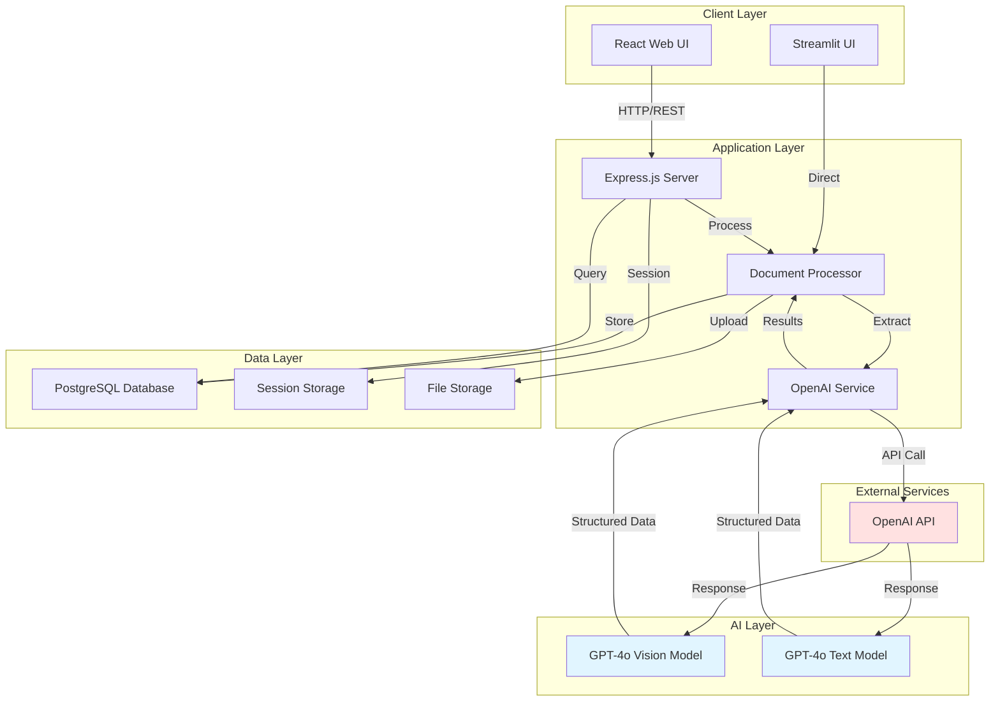
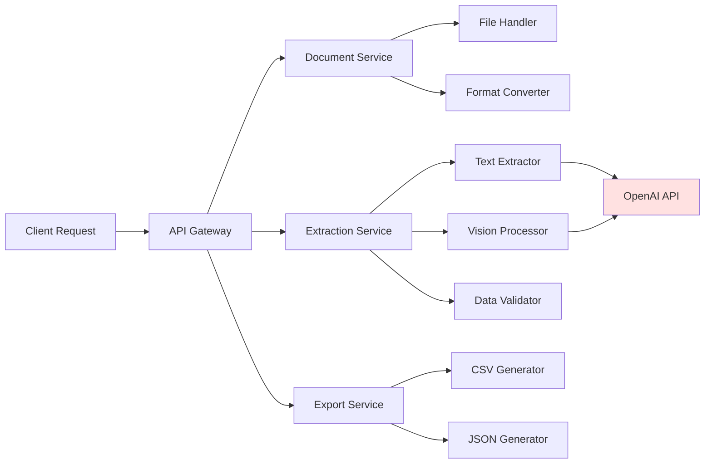
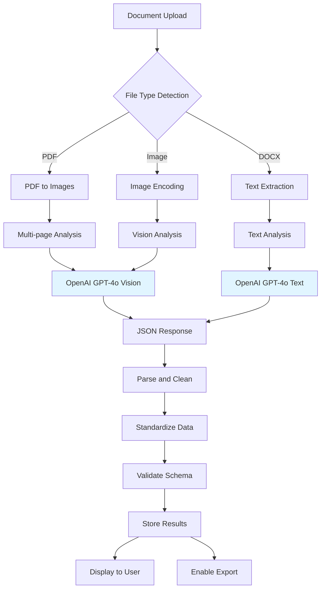
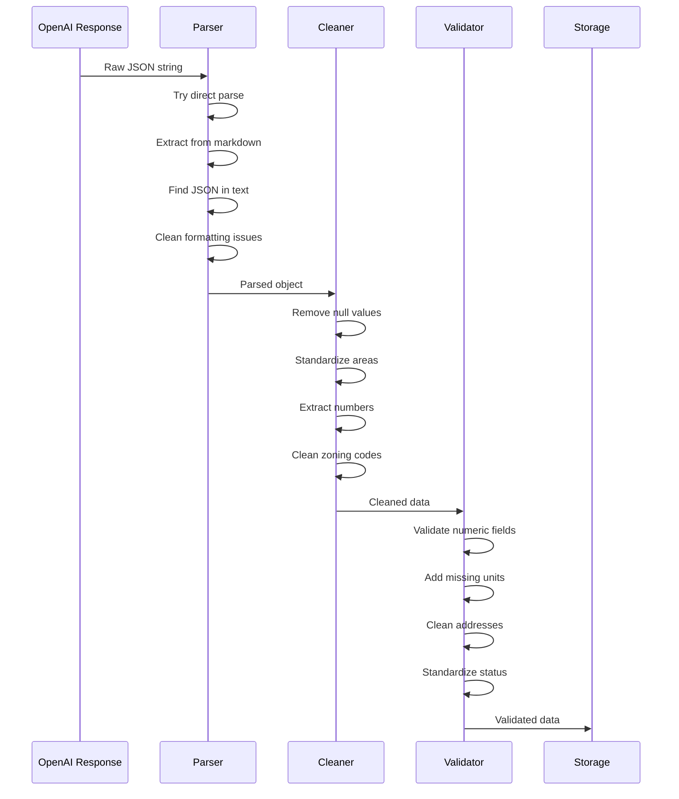
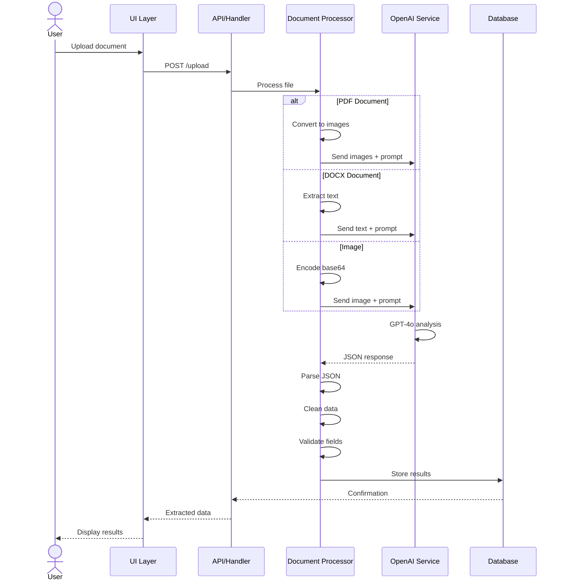
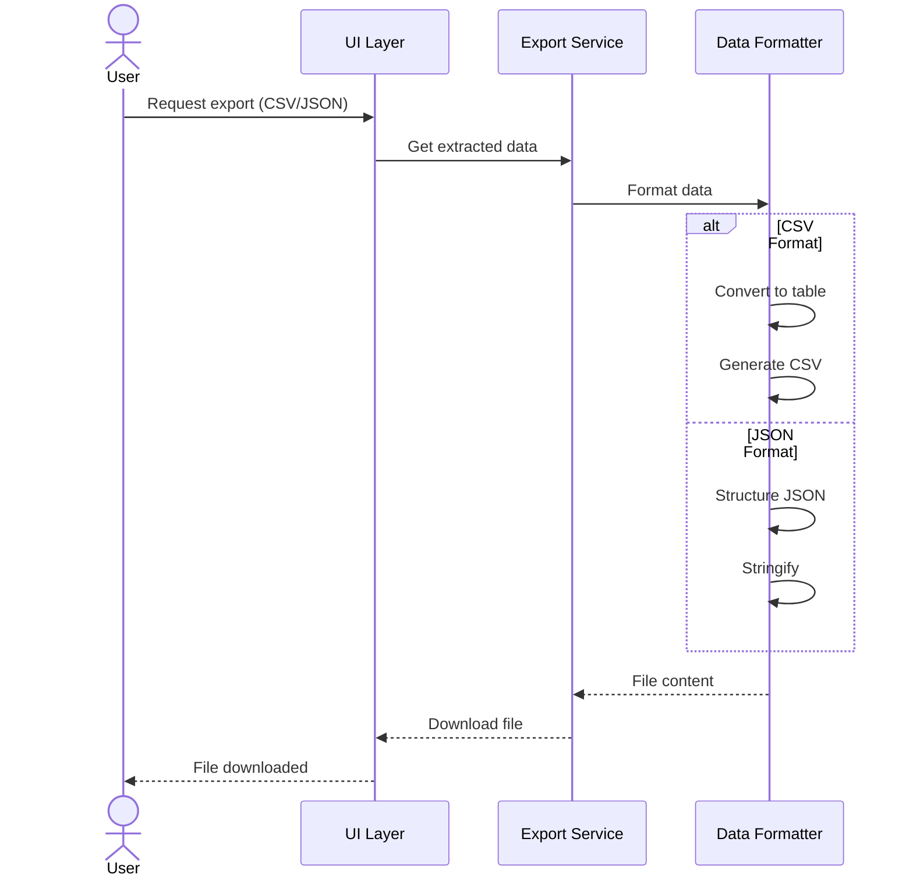
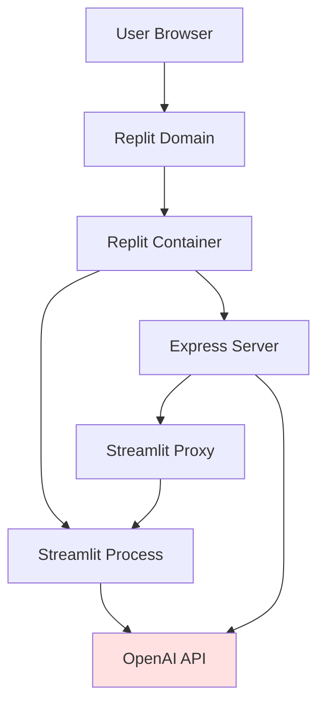
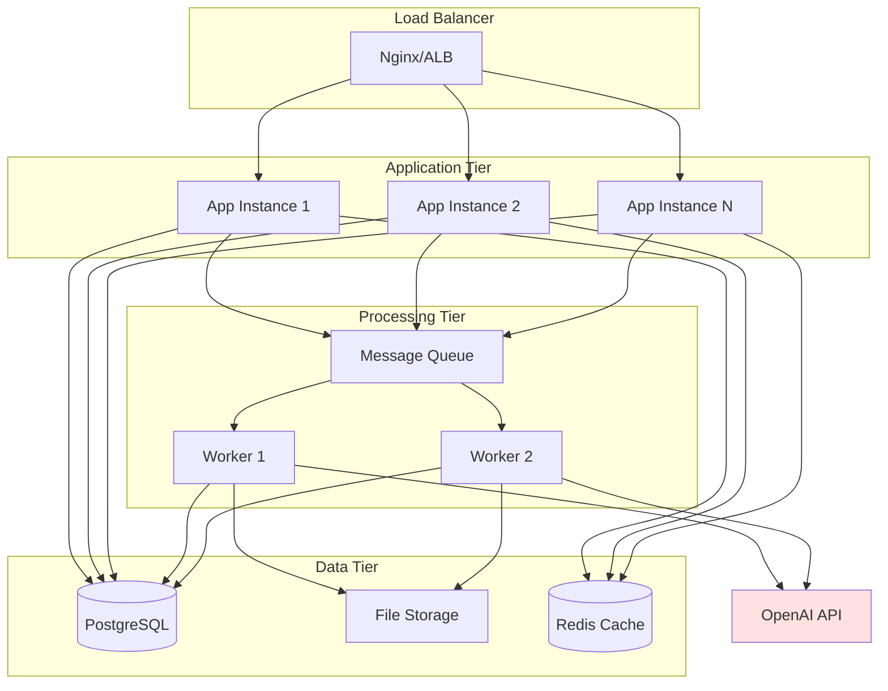

# Document Intelligence Extraction System
## Technical Architecture

### Overview

The Document Intelligence Extraction System is a hybrid application architecture featuring both a modern React-based web interface and a Streamlit-based rapid prototyping interface. The system leverages OpenAI's GPT-4o vision model to extract structured data from various document formats including PDFs, Word documents, and images.

### System Architecture Diagram



### Technology Stack

#### Frontend Technologies

**React Web Application**
- **React 18.3.1**: Modern UI library with hooks and concurrent features
- **TypeScript 5.6.3**: Type-safe development
- **Wouter 3.3.5**: Lightweight routing (< 2KB)
- **TanStack Query 5.60.5**: Server state management and caching
- **Radix UI**: Accessible component primitives
- **Tailwind CSS 3.4.17**: Utility-first CSS framework
- **shadcn/ui**: Pre-built accessible components
- **Vite 5.4.19**: Fast build tool and dev server

**Streamlit Application**
- **Streamlit 1.47.0**: Rapid prototyping framework
- **Pandas 2.3.1**: Data manipulation and export
- **Pillow 11.3.0**: Image processing

#### Backend Technologies

**Server Infrastructure**
- **Node.js**: JavaScript runtime
- **Express.js 4.21.2**: Web application framework
- **TypeScript**: Type-safe backend development
- **tsx 4.19.1**: TypeScript execution

**Document Processing**
- **PyMuPDF (fitz) 1.26.3**: PDF text extraction and image conversion
- **python-docx 1.2.0**: Word document processing
- **Pillow**: Image manipulation and conversion
- **python-multipart 0.0.20**: File upload handling

**AI/ML Integration**
- **OpenAI SDK 5.10.2** (Node.js): API client for GPT-4o
- **OpenAI SDK 1.97.1** (Python): Python API client
- **GPT-4o Model**: Vision and text understanding

#### Data Layer

**Database**
- **PostgreSQL**: Relational database via Neon serverless
- **Drizzle ORM 0.39.1**: Type-safe SQL toolkit
- **Drizzle Kit 0.30.4**: Schema migration and management

**State Management**
- **Express Session 1.18.1**: Server-side session management
- **MemoryStore 1.6.7**: Session storage for development
- **Streamlit Session State**: In-memory state for Streamlit app

#### Development Tools

**Build and Bundling**
- **Vite**: Frontend bundling and HMR
- **esbuild 0.25.0**: Backend bundling
- **PostCSS 8.4.47**: CSS processing
- **Tailwind CSS Vite Plugin**: Integrated styling

**Code Quality**
- **TypeScript Compiler**: Type checking
- **Zod 3.24.2**: Runtime type validation
- **Zod Validation Error**: Enhanced error messages

### Architecture Patterns

#### 1. Dual Interface Pattern

The system implements two parallel interfaces serving different purposes:

**Streamlit Interface (Current Primary)**
```
streamlit_app.py (main application)
    ├── Document Upload Component
    ├── OpenAI Client Initialization
    ├── Document Processing Pipeline
    ├── Data Display and Editing
    └── Export Functionality
```

**React Interface (Future Primary)**
```
client/
    ├── src/
    │   ├── App.tsx (routing)
    │   ├── pages/home.tsx (main interface)
    │   ├── components/
    │   │   ├── document-upload.tsx
    │   │   ├── extracted-data-display.tsx
    │   │   └── processing-indicator.tsx
    │   └── hooks/
server/
    ├── index.ts (Express server)
    ├── routes.ts (API endpoints)
    ├── services/
    │   ├── documentProcessor.ts
    │   └── openai.ts
    └── storage.ts
```

#### 2. Service-Oriented Architecture



#### 3. Data Pipeline Architecture



### Core Components

#### 1. Document Processing Engine

**Location**: `streamlit_app.py`, `server/services/documentProcessor.ts`

**Responsibilities**:
- File upload handling and validation
- Format-specific content extraction
- Document preprocessing and optimization
- Error handling and retry logic

**Key Functions**:

```python
# Streamlit Implementation
def extract_text_from_pdf(pdf_file) -> str
def convert_pdf_to_images(pdf_file) -> List[str]
def extract_text_from_docx(docx_file) -> str
def image_to_base64(image_file) -> str
def process_document(uploaded_file, client) -> Dict[str, Any]
```

**Features**:
- **Smart Page Selection**: For large PDFs (>10 pages), selects most relevant pages based on keywords
- **High-Resolution Rendering**: 4x zoom for architectural drawings to preserve details
- **Multi-format Support**: PDF, DOCX, PNG, JPEG
- **Error Recovery**: Graceful fallback from vision to text extraction

#### 2. AI Extraction Service

**Location**: `streamlit_app.py`, `server/services/openai.ts`

**Responsibilities**:
- OpenAI API integration
- Prompt engineering for structured extraction
- Multi-page document analysis
- Response parsing and validation

**Extraction Schema**:

```typescript
{
  projectMetadata: {
    projectName: string | null
    address: string | null
    projectStatus: string | null
    storeys: string | null
    gfa: string | null
    siteArea: string | null
    zoningApplicationType: string | null
    heritageDesignation: string | null
    architectName: string | null
    developer: string | null
    planningConsultant: string | null
  }
  buildingInformation: {
    residentialUnits: string | null
    unitTypes: string[] | null
    commercialUses: string[] | null
    amenities: string[] | null
    parkingLevels: string | null
    parkingSpaces: string | null
    publicRealmFeatures: string | null
  }
  extractionStats: {
    totalFields: number
    extractedFields: number
    processingTime: number
  }
}
```

**Vision Model Configuration**:
- **Model**: gpt-4o (released May 13, 2024)
- **Response Format**: JSON object
- **Max Tokens**: 4000 (multi-page), 3000 (single page/text)
- **Temperature**: Default (deterministic extraction)

#### 3. Data Processing Pipeline

**Location**: `streamlit_app.py` (functions: parse_and_clean_json_response, clean_and_standardize_data, validate_and_enhance_extracted_data)

**Responsibilities**:
- JSON parsing with multiple fallback strategies
- Data cleaning and standardization
- Field-specific validation and formatting
- Quality assurance

**Processing Stages**:



**Standardization Features**:
- Area values normalized to "sq.m" or "sq.ft"
- Numeric fields cleaned to pure numbers
- Zoning codes capitalized and formatted
- Status values mapped to standard categories
- Address formatting cleaned

#### 4. User Interface Components

**Streamlit Interface Components**:

```python
# Main UI Structure
main():
    - Header and title
    - Sidebar (document status, about)
    - Upload section with file uploader
    - Processing status indicators
    - Data display table
    - Export functionality (implicit in Streamlit)
```

**React Interface Components** (Planned):

```typescript
// Component Hierarchy
<App>
  <Home>
    <DocumentUpload />          // Drag-drop interface
    <ProcessingIndicator />     // Progress tracking
    <ExtractedDataDisplay />    // Results table
    <ExportControls />          // CSV/JSON export
  </Home>
</App>
```

#### 5. Storage and Persistence

**Streamlit Session State**:
```python
st.session_state.documents = []      # Document metadata
st.session_state.extracted_data = {} # Extracted field data
```

**PostgreSQL Schema** (React version):
```sql
CREATE TABLE documents (
  id VARCHAR PRIMARY KEY DEFAULT gen_random_uuid(),
  filename TEXT NOT NULL,
  file_type TEXT NOT NULL,
  file_size INTEGER NOT NULL,
  uploaded_at TIMESTAMP DEFAULT CURRENT_TIMESTAMP,
  status TEXT NOT NULL DEFAULT 'pending',
  extracted_data JSON,
  processing_error TEXT
);
```

### API Design

#### REST Endpoints (React Version)

```
POST /api/documents/upload
  - Upload document file
  - Request: multipart/form-data
  - Response: { documentId, status }

GET /api/documents/:id
  - Retrieve document and extracted data
  - Response: { document, extractedData }

GET /api/documents
  - List all documents
  - Response: [{ id, filename, status, uploadedAt }]

POST /api/documents/:id/process
  - Trigger processing for uploaded document
  - Response: { status, extractedData }

GET /api/documents/:id/export?format=csv|json
  - Export extracted data
  - Response: File download
```

### Data Flow

#### Document Processing Flow



#### Export Flow



### Security Architecture

#### Authentication & Authorization

**Current State** (Prototype):
- No authentication required
- Single-user session state
- Environment variable for OpenAI API key

**Recommended Production**:
- User authentication (JWT or session-based)
- Role-based access control (RBAC)
- API key rotation and secure storage
- Document access permissions

#### Data Security

**In Transit**:
- HTTPS/TLS encryption
- Secure WebSocket connections (if real-time features added)

**At Rest**:
- Encrypted database storage
- Secure file storage with access controls
- API key storage in environment variables or secrets management

**API Security**:
- OpenAI API key secured in environment
- Rate limiting on endpoints
- Input validation and sanitization
- File upload size limits (200MB)

#### Privacy Considerations

**Data Handling**:
- Documents processed in memory when possible
- Temporary file cleanup after processing
- No data sent to third parties except OpenAI
- User control over data deletion

**Compliance**:
- GDPR considerations for EU deployment
- Data retention policies
- Audit logging for sensitive operations

### Performance Optimization

#### Processing Optimization

**PDF Processing**:
- Smart page selection (limit to 5 most relevant pages)
- High-resolution rendering for drawings (4x zoom)
- Parallel page processing capability
- Image compression for API transmission

**API Optimization**:
- Caching of OpenAI API client
- Request batching for multiple documents
- Retry logic with exponential backoff
- Token limit optimization (max 4000 tokens)

**Frontend Optimization**:
- React Query for request caching
- Lazy loading of UI components
- Optimistic UI updates
- Streaming responses for large documents

#### Scalability Considerations

**Horizontal Scaling**:
- Stateless API design for load balancing
- Database connection pooling
- Distributed file storage (S3, etc.)
- Queue-based processing for async operations

**Vertical Scaling**:
- Memory optimization for large PDFs
- Efficient image encoding
- Streaming file uploads
- Database query optimization

### Deployment Architecture

#### Current Deployment (Replit)



**Configuration**:
- Single container deployment
- Streamlit runs on port 5000
- Express server proxies to Streamlit
- Environment variables for configuration

#### Recommended Production Deployment



### Error Handling

#### Error Categories and Handling

**File Processing Errors**:
- Invalid file format → User-friendly error message
- File too large → Size limit warning
- Corrupted file → Fallback processing attempt

**AI Processing Errors**:
- API rate limit → Retry with backoff
- Token limit exceeded → Document chunking
- Invalid response → Multiple parsing strategies
- Network error → Retry mechanism

**Data Validation Errors**:
- Schema mismatch → Log and use defaults
- Missing required fields → Null values
- Invalid data types → Type coercion or rejection

**System Errors**:
- Database connection → Circuit breaker pattern
- Service unavailable → Graceful degradation
- Memory errors → Resource cleanup

### Monitoring and Logging

#### Metrics to Track

**Performance Metrics**:
- Document processing time
- API response time
- Success/failure rates
- Token usage per document

**Business Metrics**:
- Documents processed per day
- Field extraction success rate
- User engagement metrics
- Export frequency

**System Metrics**:
- Server response times
- Database query performance
- Memory usage
- Error rates

#### Logging Strategy

**Application Logs**:
- Request/response logging
- Processing pipeline stages
- Error stack traces
- User actions

**Audit Logs**:
- Document uploads
- Data exports
- Configuration changes
- Authentication events

### Technology Decisions and Rationale

#### Why Streamlit?

**Advantages**:
- Rapid prototyping and iteration
- Built-in UI components
- Simple state management
- Python ecosystem integration
- Perfect for ML/AI applications

**Limitations**:
- Limited customization
- Single-user focus
- Performance constraints at scale
- Less suitable for production web apps

#### Why React + Express?

**Advantages**:
- Production-grade scalability
- Full UI/UX customization
- Strong ecosystem and tooling
- Better performance for complex apps
- Easier API integration

**Future Path**:
- Migrate from Streamlit to React for production
- Maintain Streamlit for rapid feature testing
- Use React for customer-facing deployment

#### Why GPT-4o?

**Advantages**:
- Vision + text understanding
- High accuracy on complex layouts
- JSON mode for structured output
- Handles architectural diagrams well
- Latest model with best capabilities

**Considerations**:
- Cost per document (~$0.01-0.10)
- API dependency and availability
- Rate limits (tier-dependent)

### Development Workflow

#### Local Development

```bash
# Streamlit development
python -m venv venv
source venv/bin/activate
pip install -r requirements.txt
streamlit run streamlit_app.py

# React + Express development
npm install
npm run dev  # Concurrent frontend + backend
```

#### Build Process

```bash
# Frontend build
npm run build  # Vite builds client/

# Backend build
npm run build  # esbuild bundles server/

# Production start
npm start
```

### Future Technical Enhancements

1. **Async Processing**: Message queue for long-running documents
2. **Batch Processing**: Handle multiple documents simultaneously
3. **Real-time Updates**: WebSocket for processing progress
4. **Advanced Caching**: Redis for API response caching
5. **Document Comparison**: Side-by-side analysis of multiple projects
6. **OCR Enhancement**: Fallback OCR for low-quality scans
7. **Multi-model Strategy**: Combine multiple AI models for better accuracy
8. **GraphQL API**: More flexible data querying
9. **Microservices**: Separate extraction service
10. **Containerization**: Docker for consistent deployment

### Conclusion

The Document Intelligence Extraction System employs a pragmatic dual-architecture approach, using Streamlit for rapid prototyping and validation while building toward a production React-based system. The architecture is designed for extensibility, maintainability, and scalability, with clear separation of concerns and well-defined interfaces between components.

The use of modern technologies (React, TypeScript, Vite) combined with proven frameworks (Express, Drizzle ORM) and state-of-the-art AI (GPT-4o) positions the system for both current prototype needs and future production deployment.
