# Document Intelligence Extraction System
## Functional Architecture

### Overview

This document describes the functional architecture of the Document Intelligence Extraction System, detailing the business logic, workflows, data processing rules, and functional components that enable automated extraction of structured data from planning documents and architectural diagrams.

### Functional Component Model

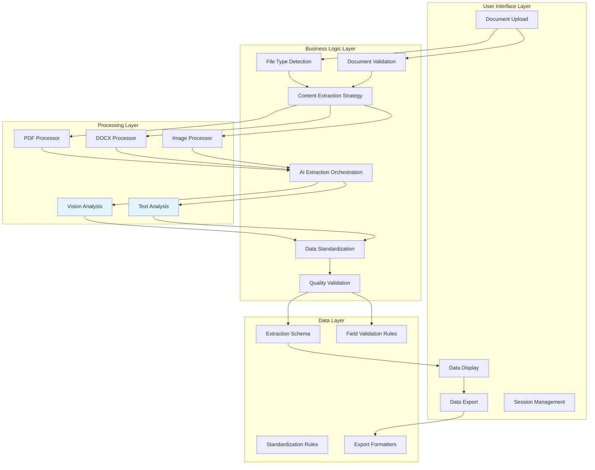

### Core Functional Capabilities

#### 1. Document Intake and Validation

**Purpose**: Accept user document uploads and validate file suitability for processing.

**Functional Requirements**:
- Accept multiple file formats (PDF, DOCX, PNG, JPEG, JPG)
- Validate file size (maximum 200MB)
- Detect file type via MIME type detection
- Check for duplicate uploads
- Provide immediate feedback on validation failures

**Business Rules**:

| Rule ID | Rule Description | Action |
|---------|-----------------|--------|
| VAL-001 | File size exceeds 200MB | Reject upload, display error message |
| VAL-002 | Unsupported file format | Reject upload, show supported formats |
| VAL-003 | Duplicate filename detected | Show info, skip processing |
| VAL-004 | Corrupted or unreadable file | Attempt fallback processing, log error |
| VAL-005 | Multiple files uploaded | Process sequentially, show progress |

**Functional Flow**:

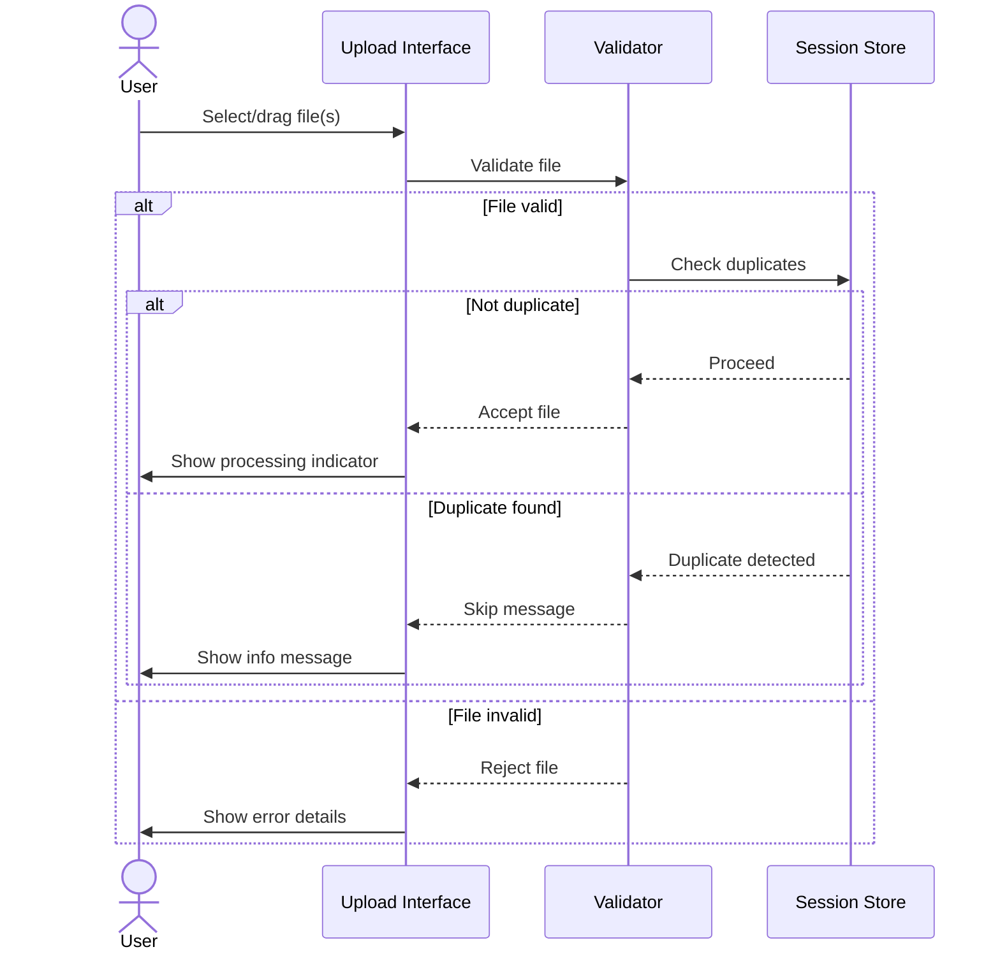

#### 2. Content Extraction Strategy Selection

**Purpose**: Determine the optimal extraction strategy based on document type and characteristics.

**Strategy Decision Matrix**:

| Document Type | Primary Strategy | Fallback Strategy | Rationale |
|--------------|-----------------|-------------------|-----------|
| PDF (< 10 pages) | Vision (all pages) | Text extraction | Preserves visual layout, tables, diagrams |
| PDF (> 10 pages) | Vision (smart selection) | Text extraction | Balances detail with API costs |
| PDF (text-heavy) | Text extraction | Vision | Efficient for text-based documents |
| DOCX | Text extraction | N/A | Direct text access available |
| PNG/JPEG | Vision analysis | N/A | Image-only, requires vision |
| Architectural Drawing | Vision (high-res) | N/A | Detail preservation critical |

**Smart Page Selection Algorithm** (PDF > 10 pages):

```python
def select_pages_for_processing(pdf_document):
    """
    Intelligently select most relevant pages from large documents
    """
    total_pages = len(pdf_document)
    selected_pages = []

    # Always include first 3 pages (likely summary/cover)
    selected_pages.extend(range(min(3, total_pages)))

    # Search for keyword-rich pages
    keywords = ['schedule', 'summary', 'data', 'statistics',
                'zoning', 'area', 'units']

    for page_num in range(total_pages):
        if len(selected_pages) >= 5:  # Maximum 5 pages
            break

        if page_num not in selected_pages:
            page_text = get_page_text(page_num).lower()
            if any(keyword in page_text for keyword in keywords):
                selected_pages.append(page_num)

    return sorted(selected_pages)
```

**Business Logic**:
- Prioritize visual analysis for complex layouts
- Use text extraction for efficiency when suitable
- Limit page processing to control costs
- Focus on information-dense pages

#### 3. Document Processing Pipeline

**Purpose**: Execute format-specific extraction and prepare content for AI analysis.

**PDF Processing Functional Flow**:

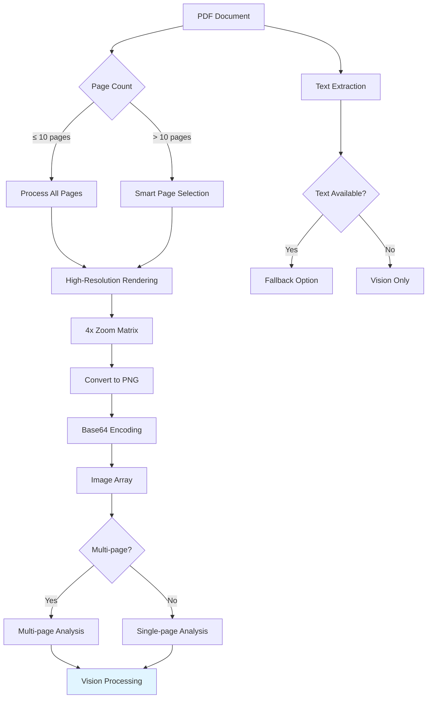

**DOCX Processing Functional Flow**:

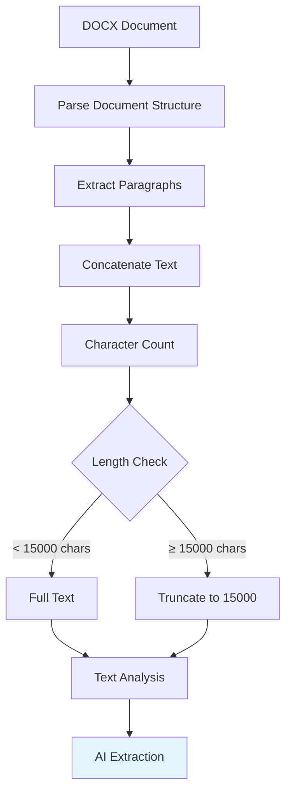

**Image Processing Functional Flow**:

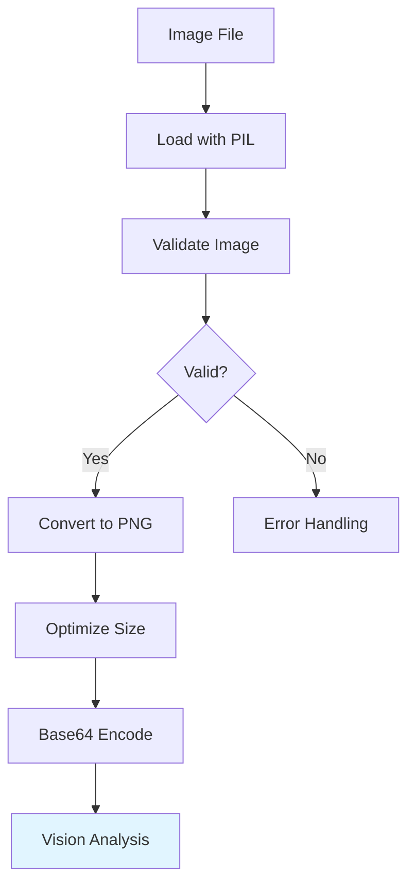

#### 4. AI Extraction Orchestration

**Purpose**: Coordinate AI-powered data extraction with appropriate prompting and response handling.

**Extraction Prompt Engineering**:

The system uses a comprehensive prompt that instructs the AI model to:

1. **Scan Document Comprehensively**
   - Title blocks and headers
   - Plan views, elevations, sections
   - Data tables and schedules
   - Text annotations and callouts
   - Legend boxes and notes
   - Numerical data with units

2. **Target Specific Data Fields**
   - Project metadata (11 fields)
   - Building information (7 fields)

3. **Apply Extraction Rules**
   - Only extract explicitly visible/mentioned data
   - Use null for missing values
   - Preserve units and formatting
   - Return valid JSON structure

**Field Extraction Mapping**:

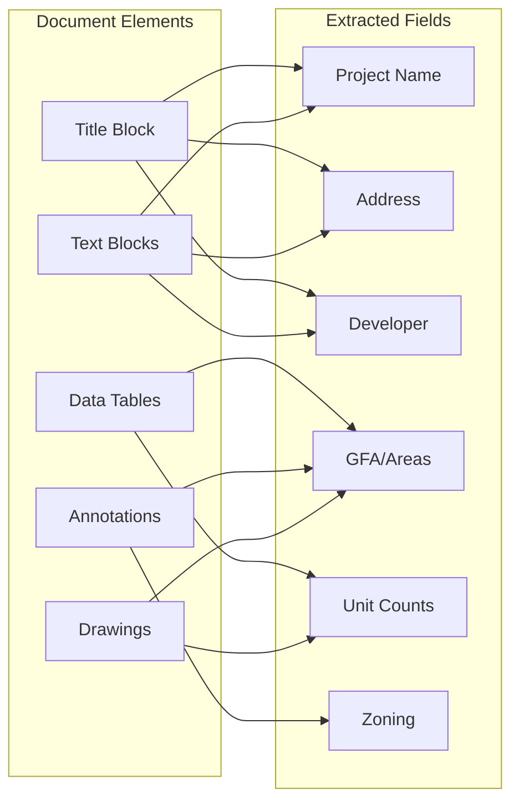

**AI Model Configuration**:

| Parameter | Value | Justification |
|-----------|-------|---------------|
| Model | gpt-4o | Latest vision + text capability |
| Response Format | JSON object | Structured, parseable output |
| Max Tokens | 3000-4000 | Sufficient for detailed extraction |
| Temperature | Default (~0.7) | Balance accuracy and flexibility |
| Top-P | Default | Standard sampling |

#### 5. Response Processing and Validation

**Purpose**: Parse AI responses, clean data, and validate against schema.

**Multi-Stage Processing**:

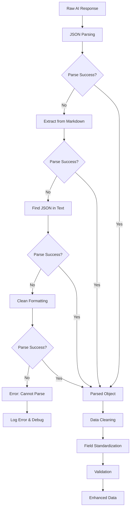

**Data Cleaning Rules**:

| Field Type | Cleaning Rules | Example |
|------------|---------------|---------|
| Area (GFA, Site Area) | Extract numbers, standardize units to "sq.m" or "sq.ft" | "15,000 square meters" → "15000 sq.m" |
| Numeric (Units, Storeys) | Extract primary number, remove text | "285 residential units" → "285" |
| Zoning | Capitalize codes, standardize format | "cr-t5.0" → "CR-T5.0" |
| Status | Map to standard categories | "under review" → "Under Review" |
| Address | Clean whitespace, standardize spacing | "123  Main St" → "123 Main St" |
| Null Values | Convert variants to null | "n/a", "not available", "" → null |

**Validation Rules**:

```typescript
// Numeric Field Validation
function validateNumericField(value: any, fieldName: string): string | null {
  if (!value) return null;

  const numbers = extractNumbers(value);
  if (numbers.length === 0) return null;

  return numbers[0]; // Return first/primary number
}

// Area Field Validation
function validateAreaField(value: any, fieldName: string): string | null {
  if (!value) return null;

  const hasUnits = /sq\.?m|sq\.?ft|m²|ft²/i.test(value);

  if (!hasUnits) {
    return `${value} sq.m`; // Default to sq.m
  }

  return standardizeAreaFormat(value);
}

// Status Field Validation
function validateStatus(value: any): string | null {
  if (!value) return null;

  const statusMap = {
    'review': 'Under Review',
    'approved': 'Approved',
    'proposed': 'Application Submitted',
    'application': 'Application Submitted',
    'construction': 'Under Construction',
    'building': 'Under Construction'
  };

  const lowerValue = value.toLowerCase();

  for (const [key, standardStatus] of Object.entries(statusMap)) {
    if (lowerValue.includes(key)) {
      return standardStatus;
    }
  }

  return value; // Return original if no mapping found
}
```

#### 6. Data Presentation and Interaction

**Purpose**: Display extracted data in user-friendly format and enable editing/validation.

**Display Data Model**:

```typescript
interface DisplayRow {
  field: string;        // Human-readable field name
  value: string;        // Extracted value
  sourceDocument: string; // Source filename
  confidence?: number;   // Optional confidence score
  editable: boolean;     // Whether user can edit
}
```

**Field Display Mapping**:

```typescript
const fieldMapping = {
  'project_name': 'Project Name',
  'address': 'Address',
  'status': 'Project Status',
  'storeys': 'Storeys',
  'gfa': 'GFA',
  'site_area': 'Site Area',
  'zoning': 'Zoning',
  'heritage_designation': 'Heritage Designation',
  'architect': 'Architect',
  'developer': 'Developer',
  'planning_consultant': 'Planning Consultant',
  'residential_units': 'Residential Units',
  'unit_types': 'Unit Types',
  'commercial_uses': 'Commercial Uses',
  'amenities': 'Amenities',
  'parking_levels': 'Parking Levels',
  'public_realm_features': 'Public Realm Features'
};
```

**Display Order**:

Fields are presented in a logical order that mirrors typical document reading flow:

1. **Project Identity**: Name, Address
2. **Project Status**: Status, Developer, Consultants
3. **Physical Characteristics**: Storeys, GFA, Site Area, Zoning
4. **Building Composition**: Units, Unit Types, Commercial Uses
5. **Amenities and Features**: Amenities, Parking, Public Realm

**Filtering Logic**:

```python
def should_display_field(field_value):
    """
    Determine if a field should be displayed to user
    """
    if field_value is None:
        return False

    if isinstance(field_value, str):
        if field_value.lower() in ['null', 'none', '', '0', 'n/a']:
            return False

    if isinstance(field_value, list):
        if len(field_value) == 0:
            return False

    return True
```

#### 7. Data Export

**Purpose**: Enable users to export extracted data in standard formats for downstream use.

**Export Formats**:

**CSV Export**:
```
Field,Value,Source Document
Project Name,Riverside Towers,planning_doc.pdf
Address,123 Main St,planning_doc.pdf
Storeys,25,planning_doc.pdf
GFA,15000 sq.m,planning_doc.pdf
...
```

**JSON Export**:
```json
{
  "documents": [
    {
      "id": 1,
      "name": "planning_doc.pdf",
      "processed_at": "2025-12-20T10:30:00Z",
      "extracted_data": {
        "project_name": "Riverside Towers",
        "address": "123 Main St",
        "storeys": "25",
        "gfa": "15000 sq.m",
        ...
      }
    }
  ]
}
```

**Export Functional Flow**:

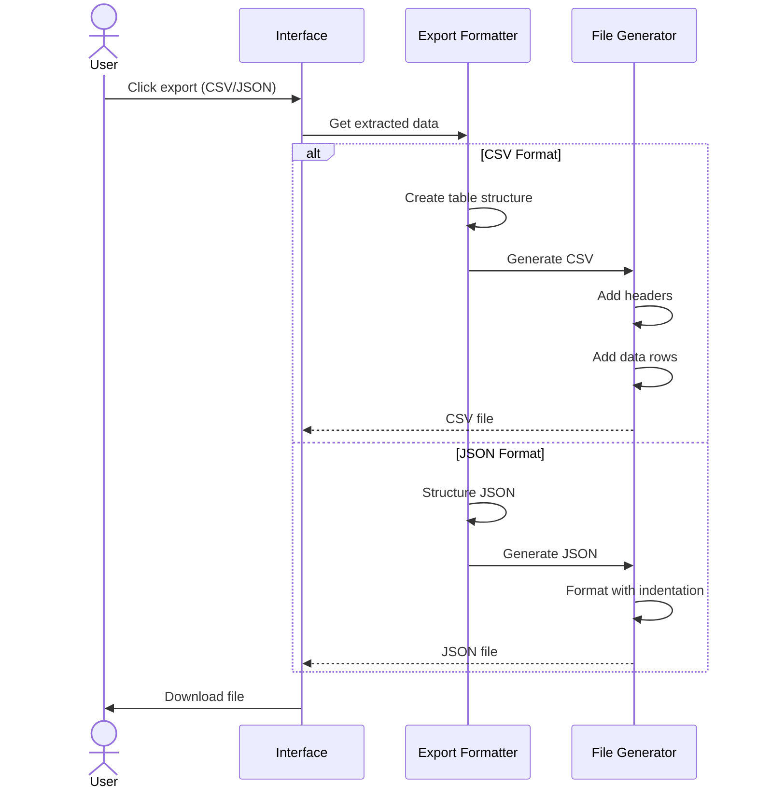

### Functional Workflows

#### Workflow 1: Single Document Processing

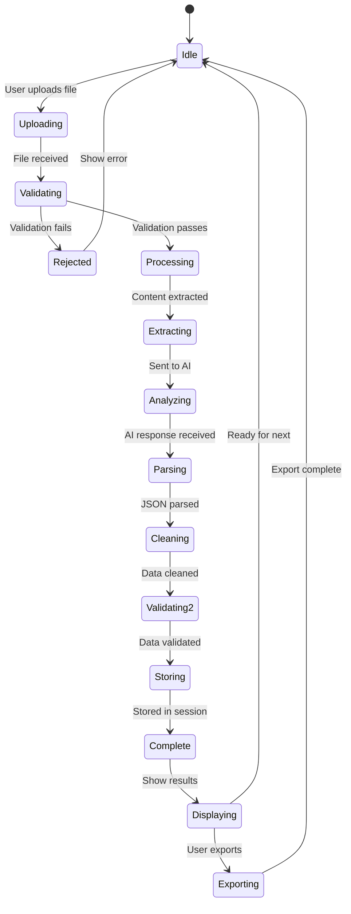

#### Workflow 2: Multi-Document Batch Processing

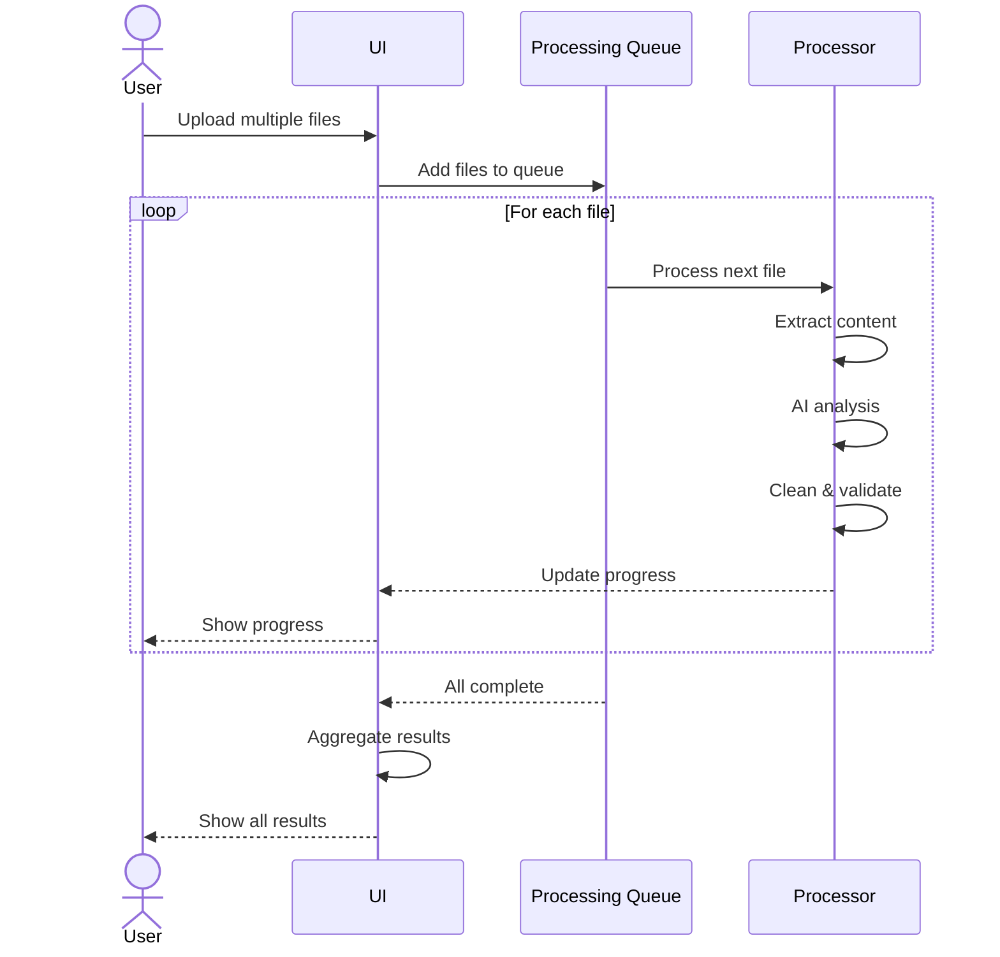

#### Workflow 3: Error Recovery and Fallback

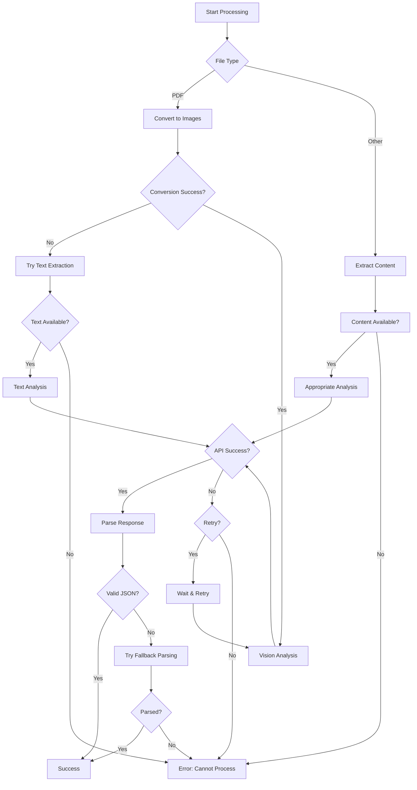

### Business Rules Engine

#### Field Extraction Rules

**Rule: GFA Extraction**
```
WHEN field = "gfa"
AND value contains number
THEN
  - Extract numeric value
  - Identify unit (sq.m, sq.ft, m², ft²)
  - Standardize to "sq.m" or "sq.ft"
  - Preserve original number precision
```

**Rule: Residential Units Extraction**
```
WHEN field = "residential_units"
AND value contains multiple numbers
THEN
  - Extract all numbers
  - Select largest number (likely total)
  - Remove text descriptions
  - Return clean number
```

**Rule: Unit Types Parsing**
```
WHEN field = "unit_types"
AND value contains list
THEN
  - Split into array
  - Standardize formats (1BR, 2BR, etc.)
  - Remove duplicates
  - Order by bedroom count
```

**Rule: Heritage Designation**
```
WHEN field = "heritage_designation"
AND value is empty/null/n/a
THEN
  - Set to null
ELSE
  - Preserve exact designation text
  - Flag for special review
```

#### Data Quality Rules

**Completeness Check**:
```python
def check_data_completeness(extracted_data):
    """
    Assess completeness of extraction
    """
    total_fields = 18
    non_null_fields = count_non_null_fields(extracted_data)

    completeness_ratio = non_null_fields / total_fields

    quality_level = {
        >= 0.9: 'Excellent',
        >= 0.7: 'Good',
        >= 0.5: 'Moderate',
        < 0.5: 'Poor'
    }

    return {
        'extracted_fields': non_null_fields,
        'total_fields': total_fields,
        'completeness_ratio': completeness_ratio,
        'quality_level': get_quality_level(completeness_ratio)
    }
```

**Consistency Check**:
```python
def check_data_consistency(extracted_data):
    """
    Validate logical consistency
    """
    issues = []

    # Check: GFA should be greater than typical unit size × unit count
    if extracted_data.gfa and extracted_data.residential_units:
        gfa_num = extract_number(extracted_data.gfa)
        units_num = extract_number(extracted_data.residential_units)

        avg_unit_size = gfa_num / units_num

        if avg_unit_size < 30:  # sq.m - unrealistically small
            issues.append('GFA may be inconsistent with unit count')

    # Check: Parking levels should be numeric
    if extracted_data.parking_levels:
        if not is_numeric(extracted_data.parking_levels):
            issues.append('Parking levels should be numeric')

    return issues
```

### Integration Points

#### External System Integration

**Future Integration Capabilities**:

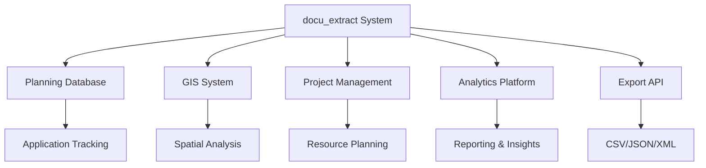

**API Export Specification**:

```typescript
interface ExportAPI {
  // Get extracted data for specific document
  GET /api/export/document/:id?format=json|csv|xml

  // Get aggregated data for multiple documents
  GET /api/export/batch?ids=1,2,3&format=json|csv

  // Get formatted report
  GET /api/export/report/:id?template=standard|detailed

  // Webhook for completed processing
  POST /api/webhooks/processing-complete
}
```

### Performance Characteristics

#### Processing Times (Typical)

| Document Type | Page Count | Processing Time | AI Tokens Used |
|--------------|-----------|----------------|----------------|
| Simple PDF | 1-3 pages | 30-60 seconds | 1,500-3,000 |
| Complex PDF | 4-10 pages | 60-120 seconds | 3,000-6,000 |
| Large PDF (smart) | 10+ pages | 90-150 seconds | 4,000-8,000 |
| DOCX | Any | 20-45 seconds | 1,000-2,500 |
| Image/Drawing | 1 image | 25-40 seconds | 1,500-2,500 |

#### Throughput Capacity

**Single Instance**:
- ~30-60 documents per hour
- ~500-1,000 documents per day (16 hour operation)

**Scaled Deployment**:
- ~100-200 documents per hour per instance
- Linear scaling with additional workers

### Error Scenarios and Handling

#### Common Error Scenarios

| Scenario | Detection | User Impact | System Response |
|----------|-----------|-------------|----------------|
| Poor quality scan | Low extraction rate | Incomplete data | Suggest re-upload with better quality |
| Unsupported language | No valid extraction | No data extracted | Display warning, suggest translation |
| API rate limit | 429 error from OpenAI | Processing delay | Automatic retry with backoff |
| Corrupted PDF | Extraction failure | Error message | Try text extraction fallback |
| Network timeout | No API response | Processing failure | Retry up to 3 times, then error |
| Invalid JSON response | Parse error | Processing failure | Multiple parse strategies, then error |

### Functional Constraints

#### System Limitations

1. **File Size**: Maximum 200MB per file
2. **Page Limit**: Processes max 5 pages for documents > 10 pages
3. **Concurrent Processing**: Sequential processing in Streamlit version
4. **Language Support**: Optimized for English-language documents
5. **Image Resolution**: 4x zoom may impact processing time for very large pages

#### Data Quality Dependencies

**Extraction Accuracy depends on**:
- Document image quality (DPI, clarity)
- Text readability and font size
- Layout complexity and organization
- Completeness of source document
- Consistency of document format

### Future Functional Enhancements

1. **Confidence Scoring**: Per-field confidence ratings
2. **Human-in-the-Loop**: Flag low-confidence fields for review
3. **Learned Patterns**: Improve extraction from similar document types
4. **Template Recognition**: Auto-detect and optimize for known formats
5. **Incremental Learning**: User corrections improve future extractions
6. **Multi-document Synthesis**: Combine information from related documents
7. **Change Detection**: Track changes across document versions
8. **Automated Validation**: Cross-reference with public data sources
9. **Smart Defaults**: Suggest likely values based on context
10. **Batch Comparison**: Side-by-side analysis of multiple projects

### Conclusion

The functional architecture of the Document Intelligence Extraction System is designed around a robust, multi-stage processing pipeline that intelligently handles diverse document types and formats. Through smart content extraction strategies, comprehensive AI prompting, rigorous data cleaning and validation, and user-friendly presentation, the system delivers reliable structured data extraction from complex construction and planning documents.

The modular design of functional components allows for continuous improvement and extension, while built-in error handling and fallback mechanisms ensure resilient operation across varying document qualities and formats.
