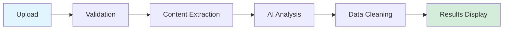

# Document Intelligence Extraction System
## User Guide

### Table of Contents

1. [Introduction](#introduction)
2. [Getting Started](#getting-started)
3. [System Requirements](#system-requirements)
4. [Installation and Setup](#installation-and-setup)
5. [User Interface Overview](#user-interface-overview)
6. [Using the System](#using-the-system)
7. [Understanding Results](#understanding-results)
8. [Exporting Data](#exporting-data)
9. [Best Practices](#best-practices)
10. [Troubleshooting](#troubleshooting)
11. [Frequently Asked Questions](#frequently-asked-questions)

---

## Introduction

### What is the Document Intelligence Extraction System?

The Document Intelligence Extraction System (also known as "Construction Intelligence" or "docu_extract") is an AI-powered tool that automatically extracts structured information from planning documents, architectural diagrams, and construction-related files.

Instead of manually reading through documents and typing information into spreadsheets or databases, you simply upload your documents and the system automatically identifies and extracts key information such as:

- Project details (name, address, status)
- Building specifications (storeys, floor area, site area)
- Professional contacts (architect, developer, planning consultant)
- Building composition (residential units, commercial spaces, amenities)
- And much more...

### Who Should Use This System?

This system is designed for:

- **Urban Planners**: Processing development applications and planning submissions
- **Real Estate Analysts**: Gathering competitive intelligence and market data
- **Architects**: Managing project documentation and specifications
- **Developers**: Tracking project portfolios and competitive projects
- **Municipal Staff**: Reviewing and cataloging planning applications
- **Consultants**: Analyzing multiple projects for reports and studies

### Key Benefits

- **Save Time**: Reduce data entry from hours to minutes
- **Improve Accuracy**: Minimize human transcription errors
- **Standardize Data**: Consistent field extraction across all documents
- **Easy Export**: Download results as CSV or JSON for further analysis
- **Handle Complexity**: Process both text documents and architectural drawings

---

## Getting Started

### Quick Start Guide

1. **Access the Application**
   - Open your web browser
   - Navigate to the application URL (provided by your administrator)
   - You should see the "Construction Intelligence" interface

2. **Set Up Your API Key** (if required)
   - In the sidebar, look for the API key configuration section
   - Enter your OpenAI API key (obtain from https://platform.openai.com/api-keys)
   - The key is stored in your browser session only

3. **Upload Your First Document**
   - Click on the upload area or drag and drop a document
   - Supported formats: PDF, DOCX, PNG, JPEG, JPG
   - Wait for processing to complete (typically 30-120 seconds)

4. **Review Results**
   - View extracted data in the results table
   - Check accuracy and completeness
   - Edit any fields if needed (in applicable versions)

5. **Export Your Data**
   - Use the export function to download as CSV or JSON
   - Import into your database, spreadsheet, or analysis tools

---

## System Requirements

### Browser Requirements

**Recommended Browsers**:
- Google Chrome (version 90+)
- Mozilla Firefox (version 88+)
- Microsoft Edge (version 90+)
- Safari (version 14+)

**Browser Requirements**:
- JavaScript enabled
- Cookies enabled (for session management)
- Minimum screen resolution: 1280x720

### Network Requirements

- **Internet Connection**: Required for AI processing
- **Bandwidth**: Minimum 1 Mbps upload speed
- **Latency**: Best performance with < 200ms latency to cloud services

### Document Requirements

**Supported File Formats**:
- PDF (.pdf)
- Microsoft Word (.docx)
- PNG images (.png)
- JPEG images (.jpg, .jpeg)

**File Size Limits**:
- Maximum file size: 200 MB
- Recommended: Under 50 MB for optimal performance

**Document Quality**:
- Minimum resolution: 150 DPI for images
- Recommended: 300+ DPI for architectural drawings
- Text should be clear and readable
- Avoid heavily redacted or watermarked documents

---

## Installation and Setup

### For End Users (Cloud Deployment)

No installation required. Simply:

1. Receive the application URL from your administrator
2. Create an account or log in (if authentication is enabled)
3. Configure your OpenAI API key (if required)
4. Start uploading documents

### For Developers/Self-Hosting

#### Python/Streamlit Version

**Prerequisites**:
- Python 3.8 or higher
- pip package manager
- OpenAI API key

**Installation Steps**:

```bash
# 1. Clone or download the repository
cd docu_extract/

# 2. Create virtual environment (recommended)
python -m venv venv

# On Windows:
venv\Scripts\activate

# On Mac/Linux:
source venv/bin/activate

# 3. Install dependencies
pip install streamlit openai pandas pillow pymupdf python-docx python-dotenv

# 4. Set up environment variables
# Create a .env file in the project root
echo "OPENAI_API_KEY=your_api_key_here" > .env

# 5. Run the application
streamlit run streamlit_app.py

# 6. Access the application
# Open browser to http://localhost:8501
```

#### Node.js/React Version (Advanced)

**Prerequisites**:
- Node.js 18+ and npm
- PostgreSQL database (for production)
- OpenAI API key

**Installation Steps**:

```bash
# 1. Navigate to project directory
cd docu_extract/

# 2. Install dependencies
npm install

# 3. Set up environment variables
# Create .env file
cat > .env << EOF
OPENAI_API_KEY=your_api_key_here
DATABASE_URL=your_postgresql_connection_string
PORT=5000
NODE_ENV=development
EOF

# 4. Run database migrations (if applicable)
npm run db:push

# 5. Start development server
npm run dev

# 6. Access the application
# Open browser to http://localhost:5000
```

---

## User Interface Overview

### Main Interface Layout

```
┌─────────────────────────────────────────────────────────────┐
│  🏗️ Construction Intelligence                               │
│  Extract structured data from planning documents            │
├───────────────┬─────────────────────────────────────────────┤
│               │                                             │
│  SIDEBAR      │  MAIN CONTENT AREA                         │
│               │                                             │
│  📋 Document  │  ┌─────────────────────────────┐           │
│     Status    │  │  Upload Documents           │           │
│               │  │  [Drag & Drop Area]         │           │
│  ✅ doc1.pdf  │  │  or click to browse         │           │
│  ✅ doc2.docx │  └─────────────────────────────┘           │
│               │                                             │
│  ℹ️ About     │  📊 Extracted Data                         │
│               │  ┌─────────────────────────────┐           │
│               │  │ Field         | Value       │           │
│               │  ├───────────────┼─────────────┤           │
│               │  │ Project Name  | Tower X     │           │
│               │  │ Address       | 123 Main St │           │
│               │  │ ...           | ...         │           │
│               │  └─────────────────────────────┘           │
│               │                                             │
└───────────────┴─────────────────────────────────────────────┘
```

### Interface Components

#### 1. Header Bar
- **Application Title**: "Construction Intelligence"
- **Subtitle**: Brief description of functionality
- **Clear All Button**: Removes all processed documents (top-right)

#### 2. Sidebar

**Document Status Section**:
- Lists all uploaded documents
- Status indicators:
  - ⏳ = Processing
  - ✅ = Completed
  - ❌ = Failed

**About Section**:
- Brief application description
- Supported file formats
- Version information

**API Configuration** (if applicable):
- OpenAI API key input field
- Connection status indicator

#### 3. Main Content Area

**Upload Section**:
- Large upload area for drag-and-drop
- File browser button
- Progress indicators during upload
- File size and format information

**Data Display Section**:
- Table view of extracted data
- Organized by document
- Field names and values
- Source document attribution

**Export Section** (varies by implementation):
- Export format selection (CSV/JSON)
- Download button
- Preview option

---

## Using the System

### Uploading Documents

#### Method 1: Drag and Drop

1. Locate your document file in your file explorer
2. Click and drag the file over the upload area
3. Drop the file when the upload area is highlighted
4. Processing will begin automatically

#### Method 2: File Browser

1. Click on the upload area or "Browse files" button
2. Navigate to your document in the file browser dialog
3. Select the file and click "Open"
4. Processing will begin automatically

#### Multiple File Upload

You can upload multiple files at once:

1. Select multiple files in the file browser (Ctrl+Click or Cmd+Click)
2. Or drag multiple files to the upload area
3. Files will be processed sequentially
4. Progress shown for each file

### Document Processing

Once uploaded, your document goes through several stages:



**Processing Stages**:

1. **Upload** (< 1 second)
   - File received by server
   - Initial validation

2. **Validation** (< 1 second)
   - File type check
   - Size verification
   - Duplicate detection

3. **Content Extraction** (5-30 seconds)
   - PDF → Images or text
   - DOCX → Text
   - Images → Base64 encoding

4. **AI Analysis** (20-90 seconds)
   - Sent to OpenAI GPT-4o
   - Vision or text analysis
   - Structured data extraction

5. **Data Cleaning** (< 5 seconds)
   - JSON parsing
   - Field standardization
   - Validation

6. **Results Display** (< 1 second)
   - Data formatted for display
   - Added to results table

**What You'll See During Processing**:

- "📄 Converting PDF pages to images for vision analysis..." (for PDFs)
- "📄 Processing pages: [1, 2, 3] out of 45 total pages" (for large PDFs)
- "🔍 Analyzing 3 pages with vision model..."
- "🔍 AI response: 2847 characters"
- "📊 Successfully extracted 12 fields with data"
- "✅ Successfully processed [filename]"

### Understanding Processing Messages

| Message | Meaning | Action |
|---------|---------|--------|
| "Converting PDF to images" | System is rendering PDF pages | Wait, this is normal |
| "Processing pages X out of Y" | For large docs, only key pages analyzed | None needed |
| "Analyzing with vision model" | AI is reading your document | Wait for completion |
| "Successfully extracted N fields" | Data extraction complete | Review results |
| "Very little text extracted" | Document may be image-based | Vision analysis will be used |
| "File already processed" | Duplicate upload detected | Results already available |

---

## Understanding Results

### Results Table Structure

The extracted data is displayed in a table with three columns:

| Column | Description | Example |
|--------|-------------|---------|
| **Field** | Name of the data field | "Project Name" |
| **Value** | Extracted information | "Riverside Towers" |
| **Source Document** | Filename where data was found | "planning_app.pdf" |

### Data Fields Explained

#### Project Metadata Fields

**Project Name**
- Full name of the development or building
- Example: "Riverside Mixed-Use Development"
- Source: Title blocks, cover pages, headers

**Address**
- Complete civic address
- Example: "1234 River Street, Toronto, ON"
- Source: Title blocks, application forms

**Project Status**
- Current stage of the project
- Standardized values: "Proposed", "Application Submitted", "Under Review", "Approved", "Under Construction"
- Source: Application forms, drawing status

**Storeys**
- Number of floors in the building
- Numeric value only
- Example: "25" (not "25 storeys")
- Source: Building statistics, elevations, sections

**GFA (Gross Floor Area)**
- Total floor area of the building
- Includes units (sq.m or sq.ft)
- Example: "28,450 sq.m"
- Source: Data tables, statistics, zoning analysis

**Site Area**
- Total area of the property
- Includes units (sq.m or sq.ft)
- Example: "3,890 sq.m"
- Source: Site plans, zoning analysis

**Zoning**
- Zoning designation or bylaw reference
- Example: "CR-T5.0-C3.0-R4.5"
- Source: Zoning analysis, application forms

**Heritage Designation**
- Heritage protection status
- Example: "Part IV Heritage Designation" or null
- Source: Heritage assessment, application forms

**Architect**
- Name of the architectural firm
- Example: "XYZ Architecture Inc."
- Source: Title blocks, professional team lists

**Developer**
- Name of the development company or applicant
- Example: "River Development Corp."
- Source: Application forms, title blocks

**Planning Consultant**
- Name of the planning firm or project manager
- Example: "Urban Planning Associates"
- Source: Application forms, professional team lists

#### Building Information Fields

**Residential Units**
- Total number of dwelling units
- Numeric value only
- Example: "285"
- Source: Unit schedules, statistics tables

**Unit Types**
- Breakdown of unit configurations
- Example: "Studio, 1BR, 2BR, 3BR"
- Source: Unit schedules, statistics

**Commercial Uses**
- Types of commercial spaces
- Example: "Ground floor retail, cafe"
- Source: Use schedules, floor plans

**Amenities**
- Building amenities and facilities
- Example: "Fitness centre, rooftop terrace, party room"
- Source: Amenity schedules, floor plans

**Parking Levels**
- Number of parking floors
- Numeric value
- Example: "4"
- Source: Parking schedules, sections

**Public Realm Features**
- Public space improvements
- Example: "Public plaza, street trees, bike parking"
- Source: Site plans, landscape plans

### Data Quality Indicators

**Field Completeness**:
- The system extracts 18 different fields
- Typical extraction: 8-14 fields (44-78%)
- Excellent extraction: 15+ fields (83%+)

**What to Check**:
1. **Required Fields**: At minimum, expect Project Name and Address
2. **Numeric Values**: Should be clean numbers without extra text
3. **Units**: Area fields should include "sq.m" or "sq.ft"
4. **Null vs. Zero**: Null means "not found", don't confuse with zero/none

### Sample Expected Results

**Good Extraction Example**:
```
Field                    | Value                              | Source
------------------------|------------------------------------|-----------------
Project Name            | Riverside Towers                   | planning_app.pdf
Address                 | 1234 River Street, Toronto, ON     | planning_app.pdf
Project Status          | Under Review                       | planning_app.pdf
Storeys                 | 32                                 | planning_app.pdf
GFA                     | 28450 sq.m                         | planning_app.pdf
Site Area               | 3890 sq.m                          | planning_app.pdf
Zoning                  | CR-T5.0-C3.0-R4.5                 | planning_app.pdf
Architect               | XYZ Architecture Inc.              | planning_app.pdf
Developer               | River Development Corp.            | planning_app.pdf
Residential Units       | 285                                | planning_app.pdf
Unit Types              | Studio, 1BR, 2BR, 3BR             | planning_app.pdf
Commercial Uses         | Ground floor retail                | planning_app.pdf
Amenities               | Fitness, rooftop terrace           | planning_app.pdf
Parking Levels          | 4                                  | planning_app.pdf
```

**Note**: Not all fields will be present in every document. Missing fields are normal and expected.

---

## Exporting Data

### Export Options

The system provides two export formats:

#### CSV (Comma-Separated Values)

**Best for**:
- Excel or Google Sheets
- Database imports
- Simple tabular analysis

**Format**:
```csv
Field,Value,Source Document
Project Name,Riverside Towers,planning_app.pdf
Address,1234 River St,planning_app.pdf
...
```

**How to Export as CSV**:
1. Scroll to the data display section
2. Look for the export or download option
3. Select "CSV" format
4. Click "Download"
5. Save the file to your preferred location

#### JSON (JavaScript Object Notation)

**Best for**:
- API integration
- Software development
- Complex data structures
- Programmatic access

**Format**:
```json
{
  "documents": [
    {
      "id": 1,
      "name": "planning_app.pdf",
      "processed_at": "2025-12-20T10:30:00Z",
      "extracted_data": {
        "project_name": "Riverside Towers",
        "address": "1234 River St",
        ...
      }
    }
  ]
}
```

**How to Export as JSON**:
1. Scroll to the data display section
2. Look for the export or download option
3. Select "JSON" format
4. Click "Download"
5. Save the file to your preferred location

### Using Exported Data

#### In Microsoft Excel

1. Open Excel
2. Go to Data → Get Data → From File → From Text/CSV
3. Select your downloaded CSV file
4. Click "Import"
5. Review the preview and click "Load"

#### In Google Sheets

1. Open Google Sheets
2. File → Import
3. Upload → Select your CSV file
4. Choose "Replace spreadsheet" or "Insert new sheet"
5. Click "Import data"

#### In Database Applications

**For SQL Databases**:
```sql
-- Example PostgreSQL import
COPY project_data(field, value, source_document)
FROM '/path/to/exported_data.csv'
DELIMITER ','
CSV HEADER;
```

**For Python/Pandas**:
```python
import pandas as pd

# Load CSV
df = pd.read_csv('exported_data.csv')

# Load JSON
df = pd.read_json('exported_data.json')
```

---

## Best Practices

### Preparing Documents for Upload

#### Document Quality

**For Best Results**:

1. **Use High-Resolution Documents**
   - Minimum 150 DPI, recommend 300 DPI
   - Clear, readable text
   - Well-contrasted images

2. **Avoid Problem Documents**
   - Heavily watermarked pages
   - Redacted or blacked-out text
   - Scanned documents with poor quality
   - Handwritten notes (typed is better)

3. **Document Orientation**
   - Ensure pages are right-side up
   - Rotate pages before uploading if needed
   - Landscape vs. portrait doesn't matter

#### Document Types

**Ideal Documents**:
- Planning applications
- Site plan approval documents
- Architectural drawing sets (with data tables)
- Building statistics sheets
- Zoning analysis reports

**Less Ideal Documents**:
- Pure CAD drawings without annotations
- Documents in languages other than English
- Highly technical engineering specifications
- Legal documents without project details

### Optimizing Processing

#### For Faster Processing

1. **Use Smaller Documents**
   - Extract only relevant pages before upload
   - Don't upload entire 200-page document sets
   - Focus on summary pages and data sheets

2. **Choose the Right Format**
   - DOCX is fastest (text-only)
   - Images are fast (single page)
   - PDFs take longer (conversion required)

3. **Process in Batches**
   - Upload related documents together
   - Process during off-peak hours for faster AI response

#### For Better Accuracy

1. **Upload Key Pages**
   - Cover page (project name, address)
   - Statistics or data summary page
   - Site plan (for site area, zoning)
   - Building sections (for storey count)
   - Professional team page (architect, developer)

2. **Supplement with Context**
   - If one document lacks information, upload supplementary docs
   - Site plans + application forms work well together

3. **Verify Critical Fields**
   - Always double-check addresses
   - Verify numeric values (GFA, units)
   - Confirm professional names

### Data Management

#### Organizing Extracted Data

1. **Name Files Descriptively**
   - Use project names or addresses in filenames
   - Include date if tracking versions
   - Example: "123_Main_St_Planning_App_2025.pdf"

2. **Track Processing**
   - Keep a log of which documents you've processed
   - Note any that failed or had poor extraction
   - Record any manual corrections needed

3. **Export Regularly**
   - Don't rely on session state
   - Export after each batch
   - Maintain backups of extracted data

#### Quality Assurance

**Post-Processing Checks**:

1. **Completeness Check**
   - Did you get the critical fields? (Name, Address, GFA, Units)
   - Are there any unexpected null values?
   - Is the extraction rate reasonable (50%+ fields)?

2. **Accuracy Check**
   - Do the numbers make sense? (GFA reasonable for unit count?)
   - Is the address formatted correctly?
   - Are professional names spelled properly?

3. **Consistency Check**
   - If processing multiple docs for same project, do they align?
   - Are units consistent (all sq.m or all sq.ft)?
   - Does status match your understanding?

---

## Troubleshooting

### Common Issues and Solutions

#### Issue: "File too large" Error

**Problem**: File exceeds 200MB limit

**Solutions**:
- Split PDF into smaller sections
- Reduce image quality/resolution (if already very high)
- Extract only essential pages
- Convert to DOCX if it's a text-heavy PDF

#### Issue: "Unsupported file type" Error

**Problem**: File format not recognized

**Solutions**:
- Verify file extension (.pdf, .docx, .png, .jpg, .jpeg)
- Convert file to supported format
  - DOC → DOCX (using Microsoft Word)
  - TIFF → PNG or JPEG (using image editor)
  - Other formats → PDF (using print-to-PDF)

#### Issue: Very Few Fields Extracted

**Problem**: Only 2-3 fields extracted from document

**Possible Causes**:
1. Document doesn't contain the information
2. Poor document quality (low resolution, blurry)
3. Information in non-standard format
4. Wrong document type (not a planning document)

**Solutions**:
- Verify document actually contains the expected information
- Try a higher-resolution version
- Upload additional pages with data tables
- Upload a different document type (e.g., add application form to drawings)

#### Issue: Incorrect Data Extracted

**Problem**: System extracted wrong information

**Possible Causes**:
1. AI misinterpreted complex layout
2. Multiple similar values present (chose wrong one)
3. Units or numbers misread

**Solutions**:
- Review the source document to confirm the error
- Try re-uploading with different pages selected
- Note the error and manually correct in your database
- Report persistent issues for system improvement

#### Issue: Processing Takes Too Long

**Problem**: Document stuck in processing for > 5 minutes

**Possible Causes**:
1. OpenAI API rate limit or outage
2. Very large/complex document
3. Network connectivity issue
4. System error

**Solutions**:
- Wait a bit longer (up to 10 minutes for complex docs)
- Check your internet connection
- Try refreshing the page and re-uploading
- Clear browser cache and try again
- Check OpenAI API status (status.openai.com)

#### Issue: "Cannot Parse JSON" Error

**Problem**: System can't understand AI response

**Possible Causes**:
1. AI response in unexpected format
2. Corrupted transmission
3. Temporary API issue

**Solutions**:
- This is usually transient - try re-uploading
- If persistent, the document may be unsuitable
- Check if document is in English
- Try a different document from same project

#### Issue: Session Lost / Data Disappeared

**Problem**: Refreshed page and all data is gone

**Cause**: Streamlit uses session state, which resets on page refresh

**Solution**:
- **Prevention**: Export data immediately after processing
- Always download CSV/JSON before closing browser
- For production use, request persistent storage version

### Getting Help

#### Self-Service Resources

1. **Check This Guide**: Re-read relevant sections above
2. **Review Example Documents**: Look at sample successful extractions
3. **Consult FAQs**: See below for common questions

#### Support Contacts

**For Technical Issues**:
- Contact your system administrator
- Report bugs with:
  - Document type and size
  - Error message screenshot
  - Steps to reproduce

**For Feature Requests**:
- Document your use case
- Explain what data you need extracted
- Provide example documents (if possible)

---

## Frequently Asked Questions

### General Questions

**Q: Is my document data secure?**

A: Documents are processed through OpenAI's API. In the current prototype, data is stored only in session state and cleared when you close the browser. For production use, consult your administrator about data retention policies.

**Q: Can I process documents in languages other than English?**

A: The system is optimized for English-language documents. Other languages may work but with reduced accuracy.

**Q: How much does it cost to process a document?**

A: Costs depend on OpenAI API pricing (approximately $0.01-$0.10 per document depending on complexity). Check with your administrator about whether you need to provide your own API key.

**Q: Can I edit the extracted data?**

A: The Streamlit version displays data in a read-only table. You can edit after export in Excel/Sheets. Some versions may offer in-app editing.

**Q: Will this work offline?**

A: No, an internet connection is required to communicate with the OpenAI API for AI processing.

### Technical Questions

**Q: Why does the system only process 5 pages of my 50-page PDF?**

A: For large documents, the system intelligently selects the most information-rich pages to balance accuracy, processing time, and API costs. Cover pages and pages with keywords like "schedule", "summary", and "statistics" are prioritized.

**Q: What's the difference between vision analysis and text extraction?**

A: Text extraction reads the underlying text in a document (fast, efficient). Vision analysis looks at the document as an image, understanding tables, diagrams, and layout (slower, more comprehensive). The system automatically chooses the best method.

**Q: Can I process multiple projects at once?**

A: Yes, you can upload multiple documents. They're processed sequentially. Each document's results are labeled with its filename.

**Q: Why are some fields always null?**

A: Some fields like "Heritage Designation" are only applicable to certain projects. Null means "not found in document" not "error".

**Q: How accurate is the extraction?**

A: Accuracy varies by document quality and complexity. Typical accuracy is 85-95% for well-formatted documents. Always verify critical fields.

### Document-Specific Questions

**Q: My architectural drawing has no extracted data. Why?**

A: Pure CAD drawings without title blocks or data tables may not contain extractable text. Ensure your drawing includes:
- Title block with project info
- Statistics or area schedule tables
- Text annotations and labels

**Q: The system extracted the wrong address. What happened?**

A: Complex documents may have multiple addresses (project site, architect office, etc.). The AI aims for the project address but may occasionally pick the wrong one. Verify and correct as needed.

**Q: Why is GFA showing in sq.ft when I expected sq.m?**

A: The system preserves the units from the source document. You can convert units in your export:
- 1 sq.m = 10.764 sq.ft
- 1 sq.ft = 0.0929 sq.m

**Q: Can I extract custom fields not in the standard list?**

A: The current version extracts a fixed set of 18 fields. For custom extraction needs, contact your administrator about customization options.

### Workflow Questions

**Q: Can I integrate this with my project management software?**

A: The React/API version supports integration via REST APIs. Export formats (CSV/JSON) can also be imported into most systems.

**Q: How do I handle updates to the same project?**

A: Upload the new version with a different filename (e.g., add date). The system will process it as a separate document. Compare results in your export.

**Q: Can I batch process 100 documents at once?**

A: While technically possible, processing is sequential. For large batches, consider:
- Processing in smaller groups (10-20 at a time)
- Running overnight or during off-hours
- Requesting a production deployment with parallel processing

**Q: What if I need to go back and check the original document?**

A: The system displays the source document filename with each extracted field. Keep your original files organized with clear naming for easy reference.

---

## Appendix: Keyboard Shortcuts and Tips

### Browser Tips

- **Ctrl/Cmd + Click** on upload: Select multiple files
- **Ctrl/Cmd + F**: Search within results table
- **Ctrl/Cmd + S**: Some browsers allow saving page state (varies)

### Efficiency Tips

1. **Pre-organize Documents**: Name files clearly before upload
2. **Extract Key Pages**: Don't upload 100-page documents, extract relevant pages first
3. **Export Often**: Don't rely on session state, export after each batch
4. **Use Templates**: If processing many similar documents, create a checklist of expected fields
5. **Verify Critical Data**: Always double-check addresses, GFA, and unit counts

### Quality Tips

1. **Check Coverage**: Aim for 50%+ field extraction rate
2. **Verify Units**: Ensure consistency (all sq.m or all sq.ft)
3. **Cross-Reference**: Compare with original document for critical fields
4. **Document Issues**: Keep notes on problematic documents for pattern recognition
5. **Improve Inputs**: Better source documents = better extraction

---

## Conclusion

The Document Intelligence Extraction System is a powerful tool for automating the tedious work of extracting structured data from planning documents and architectural diagrams. By following the best practices in this guide, you can maximize the accuracy and efficiency of your document processing workflow.

Remember:
- **Upload quality documents** for best results
- **Export your data regularly** to avoid loss
- **Verify critical fields** before relying on them
- **Report issues** to help improve the system

For additional support or questions not covered in this guide, contact your system administrator or support team.

Happy extracting!
