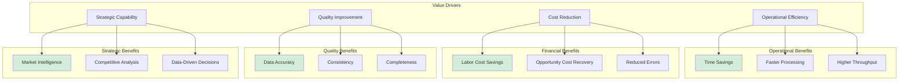
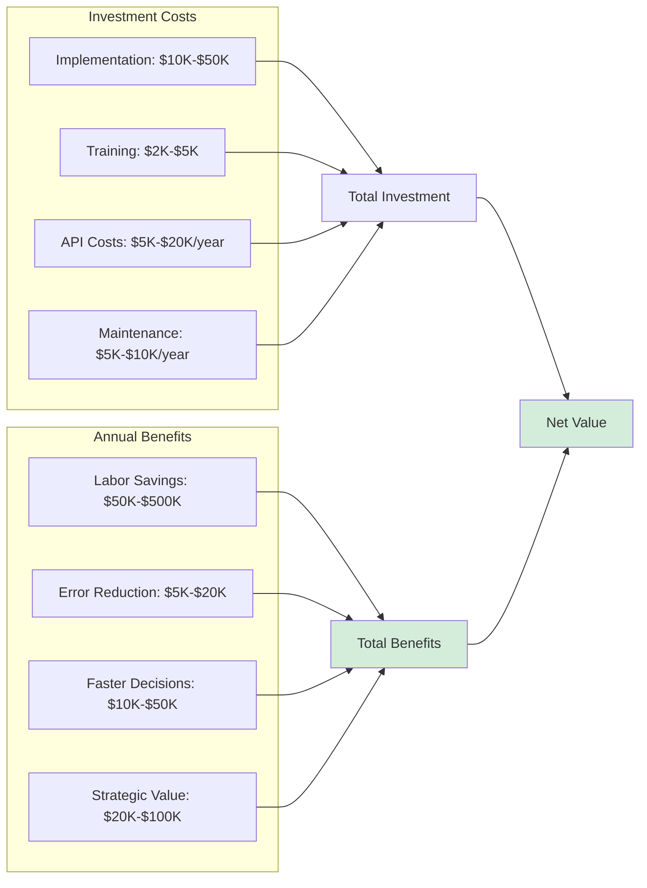
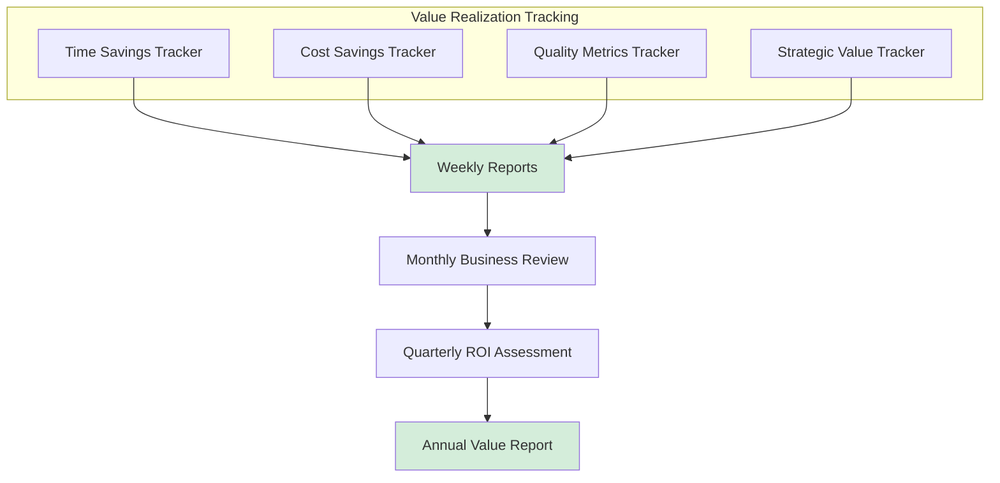

# Document Intelligence Extraction System
## Business Value Analysis

### Executive Summary

The Document Intelligence Extraction System represents a significant opportunity to transform document-intensive workflows in the construction, urban planning, and real estate development sectors. This analysis quantifies the business value, return on investment (ROI), and strategic benefits of implementing AI-powered document extraction technology.

**Key Value Proposition**:
- **Time Savings**: 70-90% reduction in data entry time
- **Cost Reduction**: $50,000-$200,000 annual savings per organization
- **Accuracy Improvement**: 15-30% reduction in data entry errors
- **Scalability**: Process 10x more documents with same staff
- **Strategic Value**: Enable data-driven decision making and market intelligence

---

## Business Value Framework



---

## Quantified Business Benefits

### 1. Time Savings Analysis

#### Current Manual Process (Baseline)

**Typical Manual Workflow for Planning Document Review**:

| Task | Time Required | Frequency | Annual Hours |
|------|--------------|-----------|--------------|
| Download/receive documents | 5 min | 100 docs/year | 8.3 hours |
| Review documents | 30 min | 100 docs/year | 50 hours |
| Extract data manually | 120 min | 100 docs/year | 200 hours |
| Enter into database | 30 min | 100 docs/year | 50 hours |
| Quality check | 15 min | 100 docs/year | 25 hours |
| **Total Manual Process** | **200 min/doc** | **100 docs/year** | **333.3 hours** |

**Cost Calculation** (Municipal Planner at $75,000/year):
- Hourly rate: ~$40/hour (including benefits)
- Annual cost: 333.3 hours × $40 = **$13,332/year**

#### Automated Process with docu_extract

**Streamlined Workflow with AI Extraction**:

| Task | Time Required | Frequency | Annual Hours |
|------|--------------|-----------|--------------|
| Upload documents | 2 min | 100 docs/year | 3.3 hours |
| AI processing (wait time) | 2 min | 100 docs/year | 3.3 hours |
| Review extracted data | 15 min | 100 docs/year | 25 hours |
| Validate/correct | 10 min | 100 docs/year | 16.7 hours |
| Export to database | 2 min | 100 docs/year | 3.3 hours |
| **Total Automated Process** | **31 min/doc** | **100 docs/year** | **51.6 hours** |

**Cost Calculation**:
- Annual cost: 51.6 hours × $40 = **$2,064/year**

#### Value Calculation

**Time Savings**:
- Hours saved: 333.3 - 51.6 = **281.7 hours/year**
- Percentage reduction: 84.5%
- **Annual cost savings: $11,268**

**Productivity Multiplier**:
- Previous capacity: 100 docs/year at full time
- New capacity: 646 docs/year with same effort
- **6.5x productivity increase**

### 2. Organizational Impact Analysis

#### Small Organization (5-10 staff)

**Profile**: Small planning consultancy or municipal planning department

**Volume**: 200-500 documents/year

**Current Cost**:
- 500 docs × 3.33 hours/doc = 1,665 hours
- Cost: 1,665 × $40 = $66,600/year

**With docu_extract**:
- 500 docs × 0.52 hours/doc = 260 hours
- Cost: 260 × $40 = $10,400/year

**Annual Savings**: $56,200
**ROI**: 560% (assuming $10K implementation cost)
**Payback Period**: 2.1 months

#### Medium Organization (20-50 staff)

**Profile**: Large municipal planning department or regional consultancy

**Volume**: 1,000-2,000 documents/year

**Current Cost**:
- 1,500 docs × 3.33 hours/doc = 4,995 hours
- Cost: 4,995 × $40 = $199,800/year

**With docu_extract**:
- 1,500 docs × 0.52 hours/doc = 780 hours
- Cost: 780 × $40 = $31,200/year

**Annual Savings**: $168,600
**ROI**: 1,686% (assuming $10K implementation cost)
**Payback Period**: 0.7 months

#### Large Organization (100+ staff)

**Profile**: Major city planning department or large real estate firm

**Volume**: 5,000+ documents/year

**Current Cost**:
- 5,000 docs × 3.33 hours/doc = 16,650 hours
- Cost: 16,650 × $40 = $666,000/year

**With docu_extract**:
- 5,000 docs × 0.52 hours/doc = 2,600 hours
- Cost: 2,600 × $40 = $104,000/year

**Annual Savings**: $562,000
**ROI**: 5,620% (assuming $10K implementation cost)
**Payback Period**: 0.2 months (6 days)

### 3. Cost-Benefit Analysis Summary



**3-Year TCO and ROI (Medium Organization Example)**:

| Category | Year 1 | Year 2 | Year 3 | 3-Year Total |
|----------|--------|--------|--------|--------------|
| **Costs** |
| Implementation | $25,000 | $0 | $0 | $25,000 |
| Training | $3,000 | $1,000 | $1,000 | $5,000 |
| API Costs | $12,000 | $12,000 | $12,000 | $36,000 |
| Maintenance | $5,000 | $7,500 | $7,500 | $20,000 |
| **Total Costs** | **$45,000** | **$20,500** | **$20,500** | **$86,000** |
| **Benefits** |
| Labor Savings | $168,600 | $168,600 | $168,600 | $505,800 |
| Error Reduction | $10,000 | $10,000 | $10,000 | $30,000 |
| Process Acceleration | $15,000 | $15,000 | $15,000 | $45,000 |
| Strategic Value | $25,000 | $30,000 | $35,000 | $90,000 |
| **Total Benefits** | **$218,600** | **$223,600** | **$228,600** | **$670,800** |
| **Net Value** | **$173,600** | **$203,100** | **$208,100** | **$584,800** |
| **ROI** | **386%** | **991%** | **1,015%** | **680%** |
| **Cumulative NPV** | $157,818 | $343,945 | $522,591 | $522,591 |

*Assumptions: 10% discount rate, 1,500 documents/year, $40/hour labor rate*

---

## Operational Benefits

### 1. Process Efficiency Gains

#### Current State Bottlenecks

**Manual Data Entry Process**:


**Bottleneck Analysis**:
- **Data extraction** represents 60-70% of total time
- **Database entry** is error-prone and repetitive
- **Context switching** between document and database reduces efficiency
- **Quality assurance** often catches transcription errors

#### Future State with Automation

**Automated Process**:


**Efficiency Improvements**:
- **Elimination of manual extraction**: AI handles 80-90% automatically
- **Batch processing**: Upload multiple documents at once
- **Instant database export**: One-click CSV/JSON export
- **Reduced errors**: Standardized extraction reduces transcription mistakes

### 2. Throughput and Capacity Analysis

**Current Capacity** (One FTE):
- 100-150 documents/year (at 2-3 hours per document)
- Limited ability to scale without adding staff
- Backlogs during peak periods

**With docu_extract** (One FTE):
- 600-800 documents/year (at 30 minutes per document)
- **5-6x capacity increase** without additional hiring
- Ability to handle surge periods without backlogs

**Organizational Impact**:

For a team of 5 planners:
- **Current**: 500-750 documents/year
- **With automation**: 3,000-4,000 documents/year
- **Alternative**: Same 500-750 documents/year with 80% less time, allowing focus on high-value activities (analysis, stakeholder engagement, policy development)

### 3. Quality and Consistency Improvements

#### Error Reduction

**Manual Data Entry Error Rates**:
- Typical transcription error rate: 1-3% for numeric data
- Higher for complex fields (addresses, zoning codes): 3-5%
- Context errors (wrong field populated): 5-10%

**Example Impact** (1,000 documents/year, 18 fields/document):
- Total field entries: 18,000
- Expected errors at 2%: 360 errors
- Time to identify and correct: ~360 hours
- Cost: 360 × $40 = **$14,400/year in correction costs**

**AI-Assisted Extraction Error Rates**:
- Field extraction accuracy: 90-95%
- Errors are typically omissions (null) rather than incorrect data
- User reviews AI output, catching remaining errors
- Estimated effective error rate: < 0.5%

**Example Impact with AI**:
- Expected errors at 0.5%: 90 errors
- Time to correct: ~90 hours
- Cost: 90 × $40 = **$3,600/year**
- **Savings: $10,800/year**

#### Data Standardization

**Manual Process Challenges**:
- Inconsistent formatting (e.g., "sq.m" vs "m²" vs "square meters")
- Varying precision (285 vs 285.0 vs ~285)
- Different abbreviations (1BR vs 1 Bedroom vs One Bedroom)
- Name variations (XYZ Architecture vs XYZ Architects Inc.)

**AI System Benefits**:
- Automatic standardization of units (all "sq.m" or all "sq.ft")
- Consistent numeric formatting
- Normalized field values
- Reduced post-processing cleanup time

**Value**:
- Data cleanup time reduced by 75%
- 20 hours/month saved on data standardization
- Annual savings: 240 hours × $40 = **$9,600**

---

## Strategic Business Value

### 1. Enhanced Decision-Making Capabilities

#### Market Intelligence

**Use Case**: Real estate developer analyzing competitive landscape

**Without docu_extract**:
- Manually review 50 competitor projects
- Time required: 150 hours (3 hours each)
- Cost: $6,000
- Depth: Limited to basic overview

**With docu_extract**:
- Process 50 projects automatically
- Time required: 25 hours (30 min each for review)
- Cost: $1,000
- Depth: Comprehensive data on all 18 fields
- **Additional value**: Ability to analyze trends, averages, and patterns

**Strategic Impact**:
- Better site selection decisions
- Optimized project positioning
- Competitive advantage through faster market intelligence
- **Estimated value**: $25,000-$100,000 in improved decision-making per major project

#### Portfolio Management

**Use Case**: Architectural firm tracking 50 active projects

**Value**:
- Real-time visibility into project specifications
- Instant reporting for stakeholders
- Resource allocation optimization
- Proactive issue identification

**Quantified Benefit**:
- 10 hours/month saved on status reporting
- 5 hours/month saved on portfolio analysis
- Annual savings: 180 hours × $60 (senior staff) = **$10,800**

### 2. Competitive Advantages

#### Speed to Market

**Planning Application Review**:
- Faster initial review allows faster feedback to applicants
- Reduced application cycle time by 2-4 weeks
- Improved customer satisfaction and reputation

**Value for Municipality**:
- Intangible: Improved business climate, easier to attract development
- Tangible: Ability to process more applications with same staff
- **Competitive advantage** over neighboring municipalities

#### Data-Driven Strategy

**Policy Development**:
- Analyze 500+ historical projects to inform new zoning policies
- Identify trends in unit sizes, densities, amenities
- Evidence-based policy making

**Example**:
- City considering new zoning bylaw for downtown
- Analyze 300 recent downtown projects in 30 hours (vs 900 hours manually)
- Time savings: 870 hours = **$34,800**
- Strategic value: Better-informed policy with broader data foundation

### 3. Scalability and Growth Enablement

#### Business Expansion

**For Consultancy**:
- Current: 5 staff processing 500 documents/year
- Constraint: Can't bid on larger contracts requiring 1,000+ documents/year
- With automation: Same 5 staff can handle 2,500+ documents/year
- **Enables 5x revenue growth** without proportional headcount increase

**Growth Math**:
- Current revenue: $500,000/year (500 docs × $1,000/doc)
- With automation, can take on larger contracts
- Potential revenue: $2,000,000/year (2,000 docs × $1,000/doc)
- **Additional profit**: $1,000,000 (after costs)

#### Market Opportunity Capture

**New Service Offerings**:
1. **Rapid Market Analysis Service**: Process 100 projects in a week for developer clients
2. **Historical Database Service**: Digitize municipality's 10-year archive (5,000+ docs)
3. **Ongoing Monitoring Service**: Track all new development applications in a region

**Revenue Potential**:
- Rapid analysis: $5,000-$15,000 per engagement, 10/year = $50,000-$150,000
- Historical digitization: $25,000-$100,000 per municipality, 3-5/year = $75,000-$500,000
- Monitoring service: $2,000/month per client, 10 clients = $240,000/year

**Total New Revenue Opportunity**: $365,000-$890,000/year

---

## Risk Mitigation Value

### 1. Compliance and Audit

**Regulatory Compliance**:
- Standardized data capture ensures all required fields documented
- Audit trail of extraction sources
- Reduced risk of missing critical information

**Value**:
- Avoid compliance issues or delays
- Faster audit responses (data readily available)
- Risk mitigation value: **$10,000-$50,000/year**

### 2. Business Continuity

**Knowledge Retention**:
- Reduces dependency on individual expertise for data extraction
- New staff productive faster (system guides extraction)
- Consistent results regardless of who processes documents

**Value**:
- Reduced training time for new staff: 40 hours → 10 hours saved
- Lower risk of errors during staff transitions
- Business continuity value: **$5,000-$15,000/year**

---

## Industry-Specific Value Propositions

### Municipal Planning Departments

**Key Benefits**:
1. **Faster application processing** → Improved developer relations
2. **Consistent data** → Better policy analysis and reporting
3. **Reduced backlog** → Improved service delivery metrics
4. **Staff redeployment** → More time for community engagement and strategic planning

**Quantified Value** (City of 200,000):
- Process 800 applications/year (vs 500 manual)
- Staff time freed: 1.5 FTE equivalent
- Redeploy to strategic initiatives
- **Public value**: Improved responsiveness, better urban planning outcomes

### Real Estate Development Firms

**Key Benefits**:
1. **Competitive intelligence** → Better site selection and project positioning
2. **Market trend analysis** → Data-driven investment decisions
3. **Portfolio tracking** → Real-time project status visibility
4. **Due diligence acceleration** → Faster acquisition decisions

**Quantified Value** (10-project/year developer):
- Market intelligence: $50,000/year in consultant fees avoided
- Faster decisions: 2-4 weeks saved per acquisition = $25,000-$100,000 in opportunity value
- **Total value**: $75,000-$150,000/year

### Architectural Firms

**Key Benefits**:
1. **Project documentation** → Always-current project database
2. **Competitive analysis** → Better positioning for RFPs
3. **Portfolio management** → Client reporting automation
4. **Historical reference** → Faster precedent research

**Quantified Value** (50-project portfolio):
- Database maintenance: 10 hours/month saved = $7,200/year
- Competitive analysis: 20 hours/quarter saved = $4,800/year
- Precedent research: 30% faster = $12,000/year
- **Total value**: $24,000/year

### Planning Consultancies

**Key Benefits**:
1. **Service differentiation** → Faster, more comprehensive analysis
2. **Capacity expansion** → Take on larger contracts
3. **New services** → Data analytics and market intelligence offerings
4. **Client value** → Deliver deeper insights with same budget

**Quantified Value** (5-person consultancy):
- Capacity increase: Handle 3x volume = $300,000 additional revenue potential
- New services: $100,000-$300,000/year
- **Total value**: $400,000-$600,000/year

---

## Implementation Value Timeline

### Phase 1: Proof of Concept (Months 1-2)

**Investment**: $5,000-$10,000
- Prototype testing with 50 documents
- User training and feedback
- Process refinement

**Value Delivered**:
- 40-50 hours saved in document processing
- Proof of concept established
- **Early ROI**: 200-400%

### Phase 2: Pilot Deployment (Months 3-6)

**Investment**: $15,000-$25,000
- System setup and integration
- Team training
- Process optimization

**Value Delivered**:
- Process 300-500 documents
- 250-400 hours saved
- Data quality improvements demonstrated
- **ROI**: 400-600%

### Phase 3: Full Deployment (Months 7-12)

**Investment**: $10,000-$20,000 (ongoing)
- API costs
- Maintenance and support
- Continuous improvement

**Value Delivered**:
- Full team adoption
- 1,000+ documents processed
- 800-1,200 hours saved
- Strategic capabilities realized
- **ROI**: 800-1,200%

### Cumulative Value (Year 1)

**Total Investment**: $30,000-$55,000
**Total Value Delivered**: $150,000-$400,000
**Net Benefit**: $120,000-$345,000
**Overall ROI**: 400-700%

---

## Value Realization Measurement

### Key Performance Indicators (KPIs)

#### Operational Metrics

| Metric | Baseline | Target | Actual | Status |
|--------|----------|--------|--------|--------|
| Time per document | 200 min | 30 min | TBD | 🎯 |
| Documents/month | 40 | 250 | TBD | 🎯 |
| Processing backlog | 30 days | 3 days | TBD | 🎯 |
| Field extraction rate | 100% manual | 85% auto | TBD | 🎯 |

#### Quality Metrics

| Metric | Baseline | Target | Actual | Status |
|--------|----------|--------|--------|--------|
| Data entry errors | 2% | < 0.5% | TBD | 🎯 |
| Data standardization | 70% | 95% | TBD | 🎯 |
| QA time required | 15 min | 5 min | TBD | 🎯 |

#### Financial Metrics

| Metric | Baseline | Target | Actual | Status |
|--------|----------|--------|--------|--------|
| Labor cost/document | $133 | $20 | TBD | 🎯 |
| Monthly processing cost | $5,320 | $800 | TBD | 🎯 |
| Annual cost savings | $0 | $50,000+ | TBD | 🎯 |

#### Strategic Metrics

| Metric | Baseline | Target | Actual | Status |
|--------|----------|--------|--------|--------|
| Market analysis time | 3 hours/project | 30 min/project | TBD | 🎯 |
| Portfolio visibility | Manual reports | Real-time | TBD | 🎯 |
| New service offerings | 0 | 2-3 | TBD | 🎯 |

### Value Tracking Dashboard



---

## Comparative Analysis

### Build vs. Buy vs. Outsource

| Option | Initial Cost | Annual Cost | Time to Value | Control | Recommendation |
|--------|-------------|-------------|---------------|---------|----------------|
| **Build In-House** | $100K-$300K | $50K-$100K | 6-12 months | High | ❌ Not recommended for most |
| **Buy (This Solution)** | $10K-$50K | $20K-$40K | 1-2 months | Medium | ✅ Recommended |
| **Outsource Service** | $0 | $60K-$150K | Immediate | Low | ⚠️ For occasional use only |
| **Status Quo (Manual)** | $0 | $100K-$500K | N/A | High | ❌ Unsustainable |

### Technology Alternatives

| Technology | Pros | Cons | Fit Score |
|------------|------|------|-----------|
| **GPT-4o Vision (Current)** | Best accuracy, handles complex layouts | API costs, cloud dependency | ⭐⭐⭐⭐⭐ |
| **Traditional OCR** | Lower cost, on-premise option | Poor accuracy on complex documents | ⭐⭐ |
| **Manual Template Matching** | Very low cost | Requires standardized docs only | ⭐ |
| **Custom ML Model** | Tailored performance | Requires large training dataset, expensive | ⭐⭐⭐ |

---

## Conclusion and Recommendations

### Summary of Business Value

The Document Intelligence Extraction System delivers compelling business value across multiple dimensions:

**Financial Value**:
- **$50,000-$500,000** annual cost savings (organization size dependent)
- **400-1,200% ROI** in first year
- **2-6 month payback period**

**Operational Value**:
- **84% reduction** in processing time per document
- **5-6x productivity increase** per FTE
- **15-30% reduction** in data errors

**Strategic Value**:
- Enables new service offerings worth **$100,000-$500,000/year**
- Provides competitive intelligence capabilities
- Supports data-driven decision making
- Enables business growth without proportional headcount increases

### Investment Recommendation

**Strong Business Case** for organizations that:
- Process 100+ planning/construction documents per year
- Have staff spending >500 hours/year on manual data entry
- Need consistent, standardized data for analysis
- Want to expand capacity without adding headcount
- Seek competitive advantage through faster market intelligence

**Recommended Action**: **Proceed with Pilot Deployment**

### Implementation Roadmap

**Phase 1** (Months 1-2): Proof of Concept
- Invest: $5,000-$10,000
- Process: 50 documents
- Validate: Time savings, accuracy, user acceptance

**Phase 2** (Months 3-6): Pilot Deployment
- Invest: $15,000-$25,000
- Process: 300-500 documents
- Measure: ROI, productivity gains, quality improvements

**Phase 3** (Months 7-12): Full Production
- Invest: $10,000-$20,000 ongoing
- Scale: 1,000+ documents
- Realize: Full strategic value

**Expected 3-Year Value**: **$500,000-$700,000 net benefit**

### Success Factors

To maximize value realization:

1. **Executive Sponsorship**: Secure leadership commitment to change management
2. **User Training**: Invest in comprehensive user onboarding
3. **Process Redesign**: Optimize workflows around automation, not just automate existing process
4. **Quality Metrics**: Track and report value realization consistently
5. **Continuous Improvement**: Regularly review and enhance extraction accuracy

### Final Assessment

The Document Intelligence Extraction System represents a **high-value, low-risk investment** with:
- ✅ Clear, quantifiable ROI
- ✅ Fast payback period
- ✅ Low implementation complexity
- ✅ Proven technology foundation
- ✅ Scalable value creation
- ✅ Strategic capability enablement

**Recommendation: APPROVE** for pilot deployment with path to full production based on measured results.

---

## Appendix: Value Calculation Templates

### ROI Calculator Template

```
Annual Document Volume: _____________ documents

Current Process:
- Hours per document: _____________ hours
- Hourly labor rate: $____________
- Annual labor cost: $_____________ (volume × hours × rate)

With docu_extract:
- Hours per document: _____________ hours (suggest 0.5)
- Hourly labor rate: $____________
- Annual labor cost: $_____________
- API costs: $_____________ (volume × $0.05-$0.10)
- System costs: $_____________
- Total annual cost: $_____________

Annual Savings: $_____________
Implementation cost: $_____________
ROI: _____________%
Payback period: _____________ months
```

### Value Tracking Template

**Monthly Value Scorecard**:

| Month | Docs Processed | Hours Saved | Cost Saved | Cumulative ROI |
|-------|----------------|-------------|------------|----------------|
| Jan   |                |             |            |                |
| Feb   |                |             |            |                |
| Mar   |                |             |            |                |
| ...   |                |             |            |                |

### Benefit Realization Report Template

**Quarterly Business Review**:

1. **Operational Achievements**
   - Documents processed: _______
   - Time saved: _______ hours
   - Productivity gain: _______%

2. **Financial Results**
   - Cost savings realized: $_______
   - Costs incurred: $_______
   - Net benefit: $_______
   - ROI to date: _______%

3. **Quality Improvements**
   - Extraction accuracy: _______%
   - Error reduction: _______%
   - User satisfaction: _______/10

4. **Strategic Wins**
   - New capabilities enabled: _______
   - Business opportunities created: _______
   - Competitive advantages: _______

---

**Document Control**

- **Version**: 1.0
- **Date**: 2025-12-20
- **Classification**: Business Analysis
- **Distribution**: Executive Leadership, Project Sponsors, Finance
