# Technical Architecture - Email Bounce Intelligence

## System Overview

The Email Bounce Intelligence system is designed as a modular, scalable solution for analyzing email bounce notifications. It employs a multi-stage processing pipeline that transforms raw email content into actionable intelligence.

## Architecture Diagram

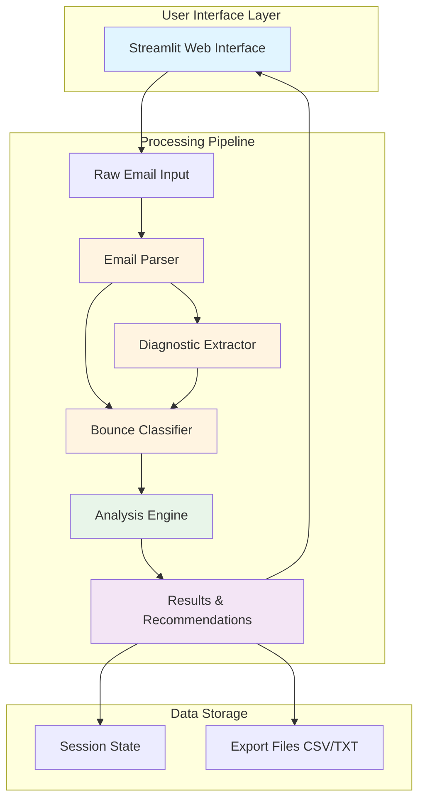

## Component Architecture

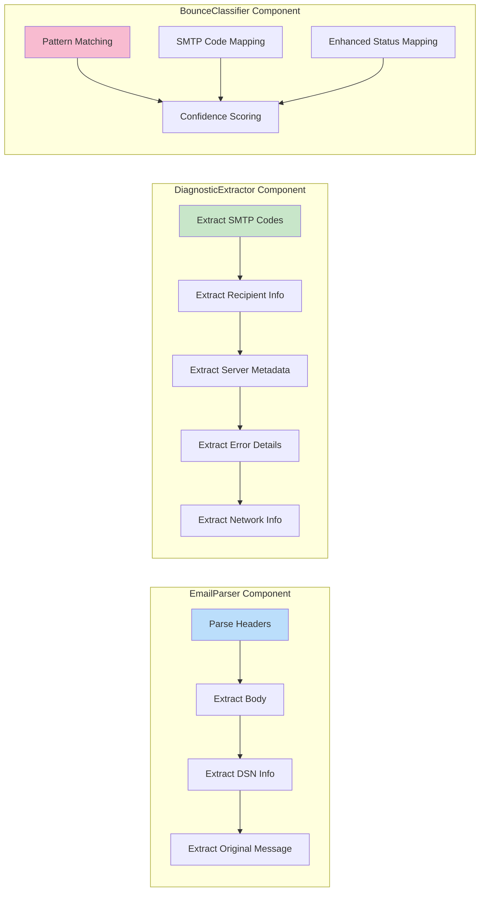

## Data Flow Diagram

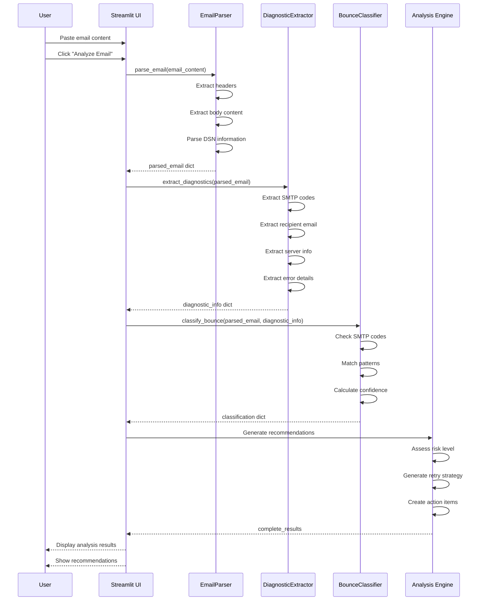

## Processing Flow

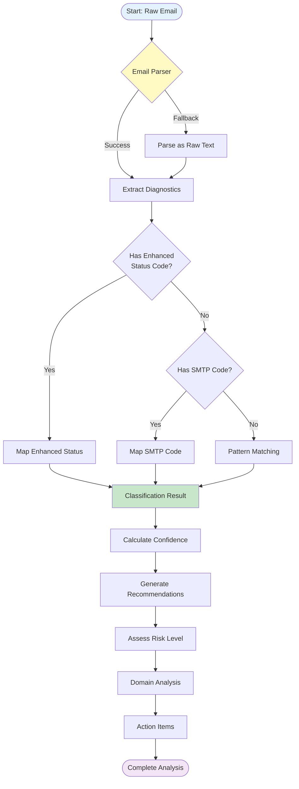

## Class Architecture

### EmailParser Class

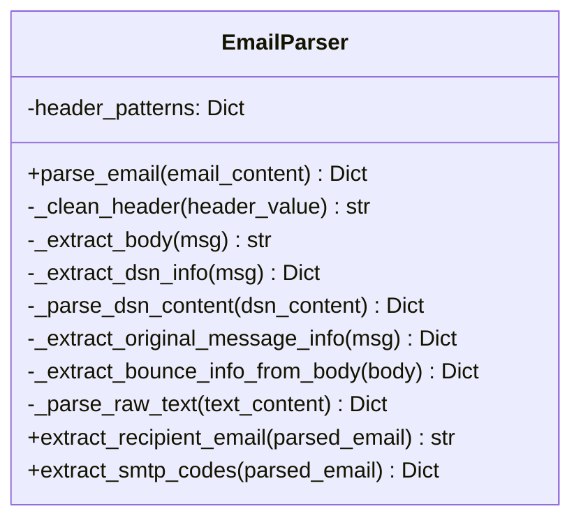

**Responsibilities:**
- Parse MIME-formatted email messages
- Extract headers, body, and attachments
- Parse DSN (Delivery Status Notification) sections
- Extract original message information
- Fallback to raw text parsing when needed

**Key Methods:**
- `parse_email()`: Main entry point for email parsing
- `_extract_dsn_info()`: Extracts structured delivery status data
- `_extract_bounce_info_from_body()`: Regex-based information extraction

### DiagnosticExtractor Class

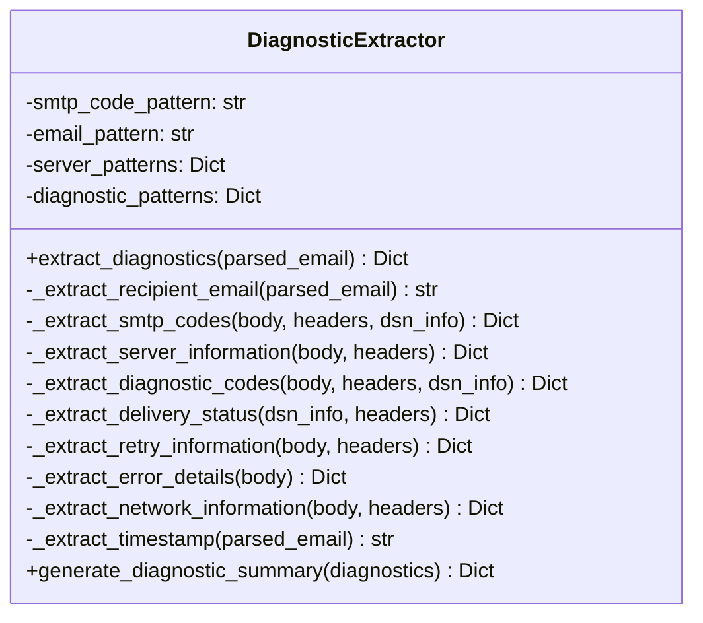

**Responsibilities:**
- Extract SMTP and enhanced status codes
- Identify recipient email addresses
- Extract server metadata and responses
- Parse error messages and details
- Extract network routing information
- Compile retry and timing data

**Key Methods:**
- `extract_diagnostics()`: Comprehensive diagnostic extraction
- `_extract_smtp_codes()`: Parses SMTP error codes
- `_extract_server_information()`: Identifies mail server details

### BounceClassifier Class

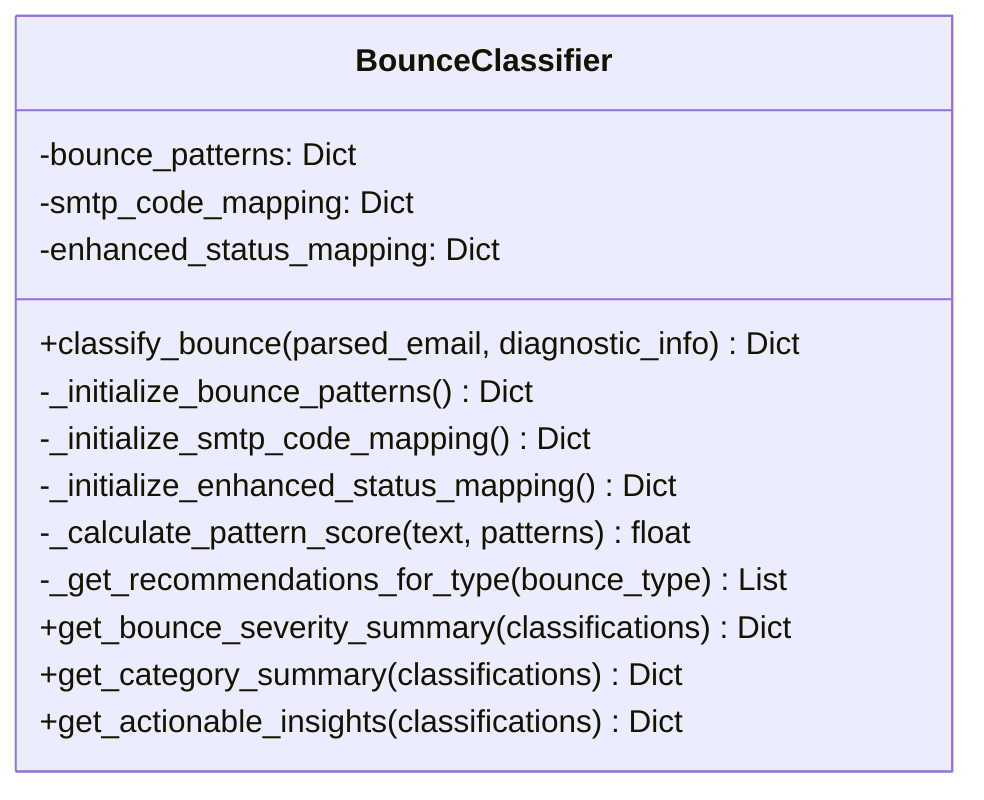

**Responsibilities:**
- Classify bounces into categories (Hard, Soft, Other, Auto-Reply)
- Map SMTP codes to bounce types
- Pattern matching for error messages
- Generate confidence scores
- Provide actionable recommendations

**Key Methods:**
- `classify_bounce()`: Main classification logic
- `_calculate_pattern_score()`: Pattern matching algorithm
- `get_actionable_insights()`: Generate analytics from classifications

## Data Models

### Parsed Email Structure

```python
{
    "subject": str,              # Email subject line
    "from": str,                 # Sender address
    "to": str,                   # Recipient address
    "date": str,                 # Send date/time
    "message_id": str,           # Unique message identifier
    "return_path": str,          # Return path address
    "auto_submitted": str,       # Auto-submission header
    "x_failed_recipients": str,  # Failed recipient header
    "content_type": str,         # MIME content type
    "body": str,                 # Email body text
    "headers": dict,             # All headers as key-value pairs
    "dsn_info": {                # Delivery Status Notification data
        "action": str,
        "status": str,
        "final_recipient": str,
        "diagnostic_code": str,
        ...
    },
    "original_message_info": {   # Original message metadata
        "original_subject": str,
        "original_from": str,
        "original_to": str,
        ...
    }
}
```

### Diagnostic Information Structure

```python
{
    "recipient_email": str,           # Bounced recipient address
    "smtp_code": str,                 # SMTP error code (e.g., "550")
    "enhanced_status_code": str,      # Enhanced code (e.g., "5.1.1")
    "server_response": str,           # Server error message
    "diagnostic_code": str,           # Full diagnostic code
    "remote_mta": str,                # Remote MTA hostname
    "reporting_mta": str,             # Reporting MTA hostname
    "action": str,                    # DSN action (failed, delayed, etc.)
    "timestamp": str,                 # Event timestamp
    "retry_info": {                   # Retry timing information
        "will_retry_until": str,
        "next_retry": str,
        ...
    },
    "server_metadata": {              # Server details
        "remote_mta": str,
        "reporting_mta": str,
        ...
    },
    "delivery_status": {              # Delivery status details
        "dsn_action": str,
        "dsn_status": str,
        ...
    },
    "error_details": {                # Specific error flags
        "connection_error": bool,
        "dns_error": bool,
        "authentication_error": bool,
        ...
    },
    "network_info": {                 # Network/routing data
        "ip_addresses": list,
        "hostnames": list,
        ...
    }
}
```

### Classification Result Structure

```python
{
    "category": str,          # Hard Bounce, Soft Bounce, Other, Auto Reply
    "type": str,              # Specific bounce type
    "severity": str,          # High, Medium, Low, Unknown
    "reason": str,            # Human-readable reason
    "recommendations": list,  # List of recommendation strings
    "confidence": float       # 0.0 to 1.0 confidence score
}
```

## Pattern Matching Algorithm

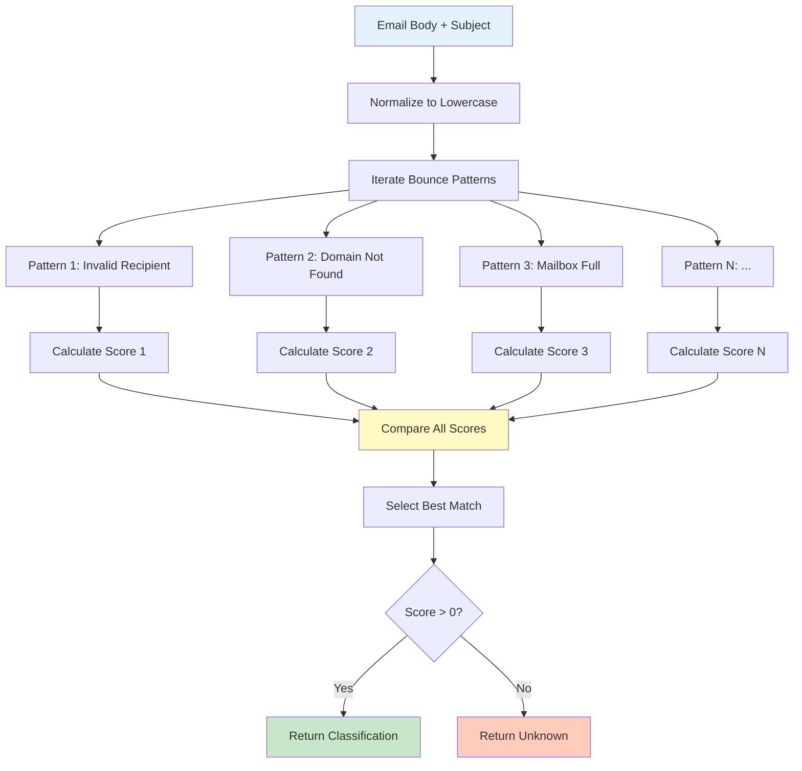

**Algorithm Details:**

1. **Pattern Scoring**: For each bounce pattern:
   - Count matches against regex patterns
   - Calculate score = matches / total_patterns
   - Score ranges from 0.0 (no match) to 1.0 (all patterns match)

2. **Priority Hierarchy**:
   - Priority 1: Enhanced Status Code (confidence: 0.9)
   - Priority 2: SMTP Code (confidence: 0.8)
   - Priority 3: Pattern Matching (confidence: calculated score)

3. **Confidence Scoring**:
   - Enhanced Status Code match: 90% confidence
   - SMTP Code match: 80% confidence
   - Pattern match: Variable (based on pattern count)

## Classification Categories

### Hard Bounce Patterns (6 Types)

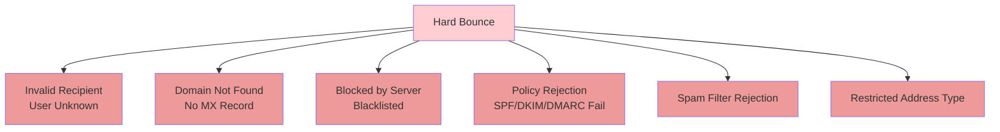

### Soft Bounce Patterns (5 Types)

```mermaid
graph TD
    SOFT[Soft Bounce] --> FULL[Mailbox Full<br/>Quota Exceeded]
    SOFT --> GREY[Greylisting/Throttling<br/>Rate Limit]
    SOFT --> TEMP[Temporary Server Failure<br/>Timeout]
    SOFT --> SIZE[Message Too Large]
    SOFT --> ATTACH[Attachment/MIME Rejected]

    style SOFT fill:#fff9c4
    style FULL fill:#fff59d
    style GREY fill:#fff59d
    style TEMP fill:#fff59d
    style SIZE fill=#fff59d
    style ATTACH fill:#fff59d
```

## Retry Strategy Logic

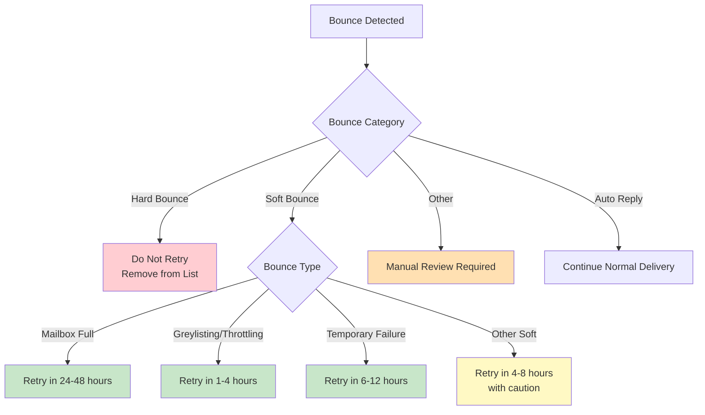

## System Integration Points

```mermaid
graph TB
    subgraph "External Systems"
        ESP[Email Service Provider]
        DB[Database System]
        API[REST API]
        MONITOR[Monitoring System]
    end

    subgraph "Email Bounce Intelligence"
        CORE[Core Analysis Engine]
    end

    subgraph "Data Outputs"
        CSV[CSV Export]
        REPORT[Summary Reports]
        ALERTS[Alert System]
        DASHBOARD[Analytics Dashboard]
    end

    ESP -->|Bounce Emails| CORE
    DB -->|Historical Data| CORE
    API -->|Email Content| CORE

    CORE -->|Analysis Results| CSV
    CORE -->|Metrics| REPORT
    CORE -->|Critical Issues| ALERTS
    CORE -->|Statistics| DASHBOARD
    CORE -->|Trends| MONITOR

    style CORE fill:#4caf50
    style ESP fill:#2196f3
    style ALERTS fill=#ff9800
```

## Performance Characteristics

### Time Complexity

| Operation | Complexity | Notes |
|-----------|-----------|-------|
| Email Parsing | O(n) | n = email size in characters |
| Pattern Matching | O(p * m) | p = patterns, m = text length |
| SMTP Code Lookup | O(1) | Hash table lookup |
| Classification | O(p) | p = number of patterns |
| Full Analysis | O(n + p*m) | Combined parsing and classification |

### Space Complexity

| Component | Memory Usage | Notes |
|-----------|-------------|-------|
| Pattern Storage | ~50 KB | Static pattern definitions |
| Parsed Email | Variable | Proportional to email size |
| Session State | ~100 KB per email | Streamlit session storage |
| Export Data | Cumulative | Grows with analyzed emails |

## Error Handling Strategy

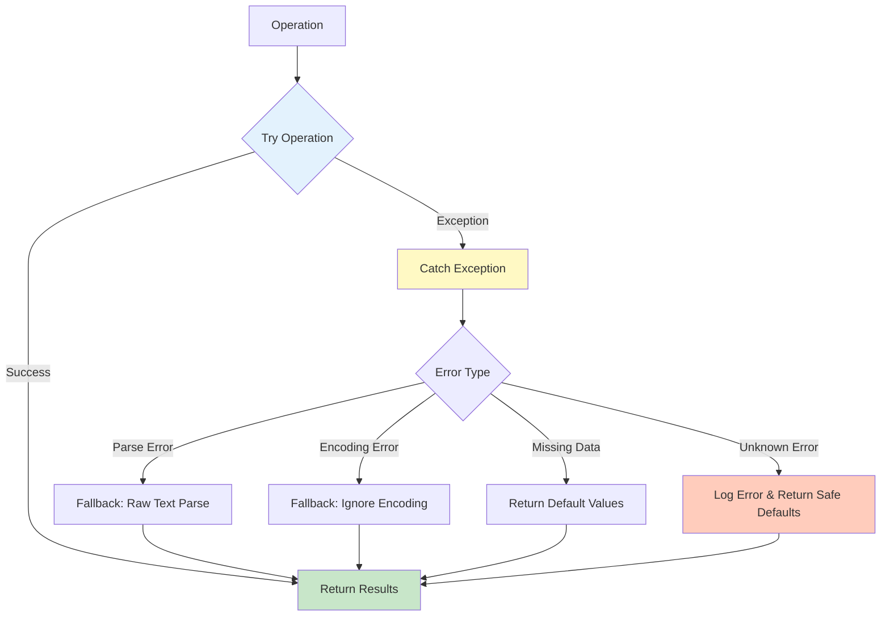

## Security Considerations

### Input Validation
- Email content sanitization
- Regex pattern limits to prevent ReDoS attacks
- File upload size restrictions
- Content type validation

### Data Privacy
- No persistent storage of email content
- Session-based data storage only
- No external API calls with sensitive data
- Local processing only

### Output Sanitization
- HTML escaping in UI display
- Safe file download mechanisms
- CSV injection prevention

## Scalability Considerations

### Current Limitations (Prototype)
- Single-threaded processing
- In-memory session storage
- No persistent database
- Manual batch processing

### Production Scaling Recommendations

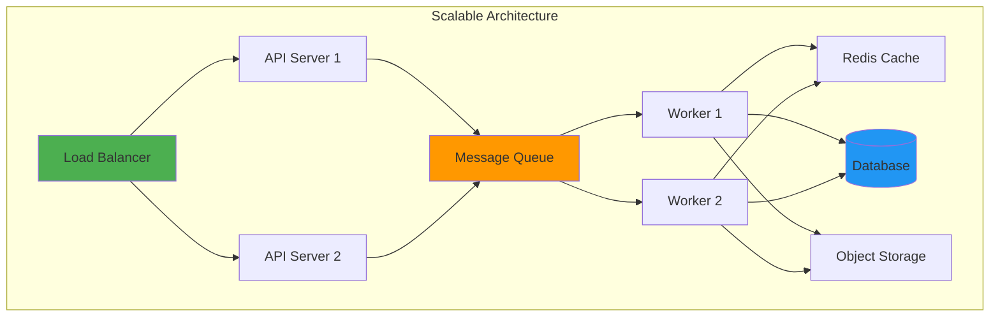

**Recommendations:**
1. Implement asynchronous processing with message queues
2. Add database for persistent storage and analytics
3. Use caching for pattern lookups and classifications
4. Implement horizontal scaling for worker processes
5. Add API layer for integration flexibility

## Technology Stack

### Core Technologies
- **Python 3.11+**: Main programming language
- **Streamlit 1.45+**: Web UI framework
- **Pandas 2.3+**: Data manipulation and export

### Standard Libraries
- **email**: Email parsing
- **re**: Regular expression matching
- **typing**: Type hints
- **datetime**: Timestamp handling
- **io**: File I/O operations

### Development Tools
- **uv**: Modern Python package manager
- **pyproject.toml**: Dependency management

## Configuration Management

### Pattern Configuration
Bounce patterns are defined in `BounceClassifier._initialize_bounce_patterns()`:
- Modular pattern definitions
- Easy to add new patterns
- Configurable confidence thresholds

### SMTP Code Mapping
Centralized mapping in `BounceClassifier._initialize_smtp_code_mapping()`:
- Standard SMTP codes (4xx, 5xx)
- Enhanced status codes (X.Y.Z format)
- Category and severity mapping

## Testing Strategy

### Recommended Test Coverage

1. **Unit Tests**
   - EmailParser: Header parsing, body extraction, DSN parsing
   - DiagnosticExtractor: SMTP code extraction, pattern matching
   - BounceClassifier: Classification accuracy, confidence scoring

2. **Integration Tests**
   - Full pipeline processing
   - Multiple bounce types
   - Edge cases and malformed emails

3. **Performance Tests**
   - Large email processing
   - Bulk analysis performance
   - Memory usage profiling

4. **UI Tests**
   - Streamlit component rendering
   - Export functionality
   - Session state management

## Deployment Architecture

### Development Environment
```
Local Machine → Streamlit Dev Server → Browser
```

### Production Environment (Recommended)
```
User → Load Balancer → Streamlit Apps (N instances) → Redis Cache → PostgreSQL
```

### Cloud Deployment Options
1. **AWS**: ECS + RDS + ElastiCache
2. **Azure**: App Service + Azure DB + Redis Cache
3. **GCP**: Cloud Run + Cloud SQL + Memorystore

## Monitoring and Observability

### Key Metrics to Track
- Classification accuracy rate
- Processing time per email
- Pattern match distribution
- Error rate by type
- User interaction patterns

### Logging Strategy
- Info: Successful classifications
- Warning: Fallback parsing, low confidence
- Error: Processing failures, exceptions
- Debug: Detailed pattern matching results

## API Extension Design

### Proposed REST API Endpoints

```
POST /api/v1/analyze
  - Analyze single email
  - Input: email content
  - Output: classification + diagnostics

POST /api/v1/batch-analyze
  - Analyze multiple emails
  - Input: array of emails
  - Output: array of results

GET /api/v1/patterns
  - Retrieve pattern definitions

PUT /api/v1/patterns/{pattern_id}
  - Update pattern definition

GET /api/v1/statistics
  - Get system statistics
```

## Version History

### v0.1.0 (Current)
- Initial prototype implementation
- Core classification engine
- Streamlit UI
- Basic export functionality

### Future Versions (Planned)
- v0.2.0: API endpoints
- v0.3.0: Database integration
- v0.4.0: Machine learning classification
- v1.0.0: Production-ready release

---

**Document Version**: 1.0
**Last Updated**: December 2025
**Maintained By**: Development Team
