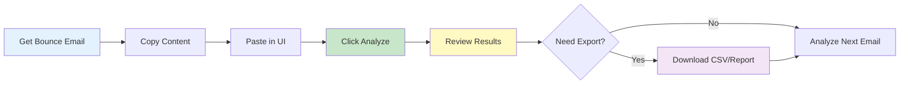
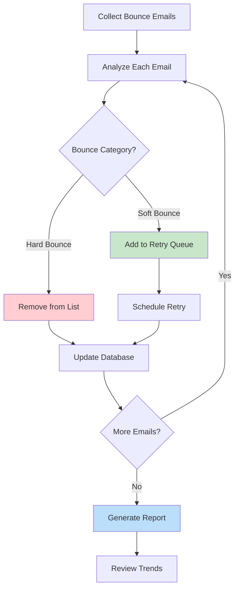
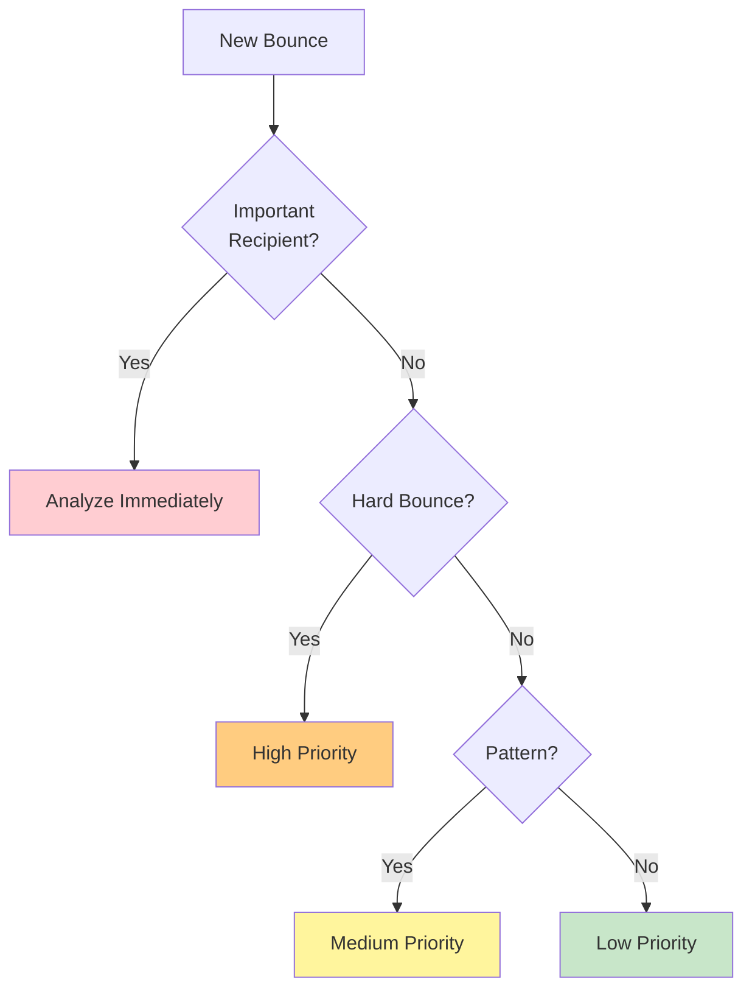

# User Guide - Email Bounce Intelligence

## Table of Contents

1. [Getting Started](#getting-started)
2. [Basic Usage](#basic-usage)
3. [Understanding Results](#understanding-results)
4. [Advanced Features](#advanced-features)
5. [Use Case Scenarios](#use-case-scenarios)
6. [Best Practices](#best-practices)
7. [Troubleshooting](#troubleshooting)
8. [Tips and Tricks](#tips-and-tricks)

## Getting Started

### System Requirements

- **Operating System**: Windows, macOS, or Linux
- **Python**: Version 3.11 or higher
- **Browser**: Modern web browser (Chrome, Firefox, Safari, Edge)
- **Memory**: Minimum 4GB RAM
- **Disk Space**: 100MB for application and dependencies

### Installation

#### Quick Start (Recommended)

```bash
# 1. Navigate to the project directory
cd email_bounce_intelligence

# 2. Install dependencies using uv (recommended)
uv sync

# 3. Launch the application
uv run streamlit run app.py
```

#### Alternative Installation Methods

**Using pip:**
```bash
pip install pandas>=2.3.0 streamlit>=1.45.1 python-dotenv
streamlit run app.py
```

**Using virtual environment:**
```bash
# Create virtual environment
python -m venv venv

# Activate virtual environment
# Windows:
venv\Scripts\activate
# Mac/Linux:
source venv/bin/activate

# Install dependencies
pip install -r requirements.txt

# Run application
streamlit run app.py
```

### First Launch

1. Open your terminal/command prompt
2. Navigate to the project directory
3. Run `streamlit run app.py`
4. Your default browser will automatically open to `http://localhost:8501`
5. You should see the "Bounce-Back Email Analyzer" interface

## Basic Usage

### Analyzing Your First Bounce Email

#### Step 1: Obtain Bounce Email Content

You need the raw content of a bounce email. This typically includes:
- Email headers (From, To, Subject, Date, etc.)
- Email body with error messages
- Delivery Status Notification (DSN) information

**Example ways to get bounce email content:**

1. **From Email Client (Gmail, Outlook, etc.):**
   - Open the bounce email
   - Select "Show Original" or "View Source"
   - Copy all content

2. **From Email Server:**
   - Access your mail server logs
   - Copy the complete email message

3. **From Email Service Provider:**
   - Download bounce notification
   - Copy complete message content

#### Step 2: Paste Email Content

1. Locate the text area labeled "Paste the raw bounce email content here:"
2. Click inside the text area
3. Paste your copied email content (Ctrl+V / Cmd+V)
4. Verify the content includes headers and body

#### Step 3: Analyze

1. Click the blue "Analyze Email" button
2. Wait for processing (typically < 1 second)
3. View results displayed below

#### Step 4: Review Results

The analysis displays comprehensive information:
- **Recipient Email**: Who the email failed to reach
- **Bounce Category**: Hard Bounce, Soft Bounce, or Other
- **Bounce Type**: Specific reason for failure
- **SMTP Code**: Error code from mail server
- **Retry Recommendation**: Whether to retry delivery
- **Action Items**: Specific steps to resolve the issue

### Sample Workflow



## Understanding Results

### Enhanced Analysis Results Table

The results table contains the following fields:

#### 1. Recipient Email
- The email address that bounced
- Extracted from various email fields
- Validated format

**Example:**
```
user@nonexistentdomain.com
```

#### 2. Domain Analysis
- Categorization of the email domain
- Types: Consumer, Business, Educational, Government

**Examples:**
- "Consumer email (gmail.com)"
- "Business email (company.com)"
- "Educational institution (university.edu)"
- "Government domain (agency.gov)"

#### 3. Bounce Category
Primary classification of the bounce:

| Category | Description | Action Required |
|----------|-------------|-----------------|
| **Hard Bounce** | Permanent delivery failure | Remove from list immediately |
| **Soft Bounce** | Temporary delivery issue | Retry with appropriate timing |
| **Auto Reply** | Automatic out-of-office response | Continue normal delivery |
| **Other** | Requires manual review | Investigate specific case |

#### 4. Bounce Sub Category
Specific type within the category:

**Hard Bounce Types:**
- Invalid Recipient Address
- Domain Not Found
- Blocked by Server
- Policy Rejection (SPF/DKIM/DMARC Fail)
- Spam Filter Rejection
- Restricted Address Type

**Soft Bounce Types:**
- Mailbox Full
- Greylisting or Throttling
- Temporary Server Failure
- Message Too Large
- Attachment or MIME Type Rejected

#### 5. SMTP Code
Standard SMTP error code from the receiving server:

| Code | Meaning |
|------|---------|
| 550 | Permanent failure - mailbox unavailable |
| 554 | Transaction failed - permanent error |
| 552 | Storage allocation exceeded |
| 551 | User not local |
| 553 | Mailbox name invalid |
| 450 | Temporary failure |
| 451 | Processing error |
| 452 | Insufficient storage (temporary) |
| 421 | Service unavailable |

#### 6. Enhanced Status Code
Detailed diagnostic code in X.Y.Z format:

| Code | Description |
|------|-------------|
| 5.1.1 | Bad destination mailbox address |
| 5.1.2 | Bad destination system address |
| 5.2.1 | Mailbox disabled |
| 5.2.2 | Mailbox full |
| 4.2.2 | Mailbox full (temporary) |
| 5.7.1 | Delivery not authorized |
| 4.4.1 | Connection timeout |

#### 7. Severity Level
Impact assessment:

- **High**: Critical issue requiring immediate action
- **Medium**: Important issue requiring attention
- **Low**: Minor issue or informational
- **Unknown**: Unable to determine severity

#### 8. Classification Confidence
How confident the system is in its classification:

- **90-100%**: Enhanced status code match (very high confidence)
- **80-89%**: SMTP code match (high confidence)
- **50-79%**: Strong pattern match (good confidence)
- **< 50%**: Weak pattern match (review recommended)

#### 9. Retry Recommendation

Clear guidance on retry strategy:

| Recommendation | Meaning | Timing |
|----------------|---------|--------|
| ❌ Do not retry - Remove from list | Hard bounce - permanent failure | Never retry |
| 🔄 Retry in 24-48 hours | Mailbox full | 1-2 days |
| 🔄 Retry in 1-4 hours | Greylisting/throttling | 1-4 hours |
| 🔄 Retry in 6-12 hours | Temporary failure | 6-12 hours |
| 🔄 Retry with caution in 4-8 hours | Other soft bounce | 4-8 hours |
| ⚠️ Manual review required | Complex case | Review needed |

#### 10. Action Items
Immediate steps to take based on the bounce type.

#### 11. Technical Notes
Additional technical recommendations.

#### 12. Server Response
The actual error message from the receiving mail server.

### Intelligent Recommendations Section

This section provides two columns of guidance:

#### Immediate Actions
Step-by-step actions to take right away:

1. First priority action
2. Second priority action
3. Third priority action

**Example for Invalid Recipient:**
1. Verify email address spelling
2. Check if recipient changed email
3. Remove from active campaigns

#### Technical Recommendations
Server-side or infrastructure improvements:

**Example for SPF Failure:**
1. Verify SPF record configuration
2. Check DKIM signature setup
3. Review DMARC policy

### Risk Assessment

Color-coded risk indicator:

- 🚨 **High Risk** (Red): Remove from campaigns to protect sender reputation
- ⚠️ **Medium Risk** (Yellow): Monitor and implement retry strategy carefully
- ℹ️ **Low Risk** (Blue): Standard bounce handling procedures apply

## Advanced Features

### Export Functionality

#### CSV Export

**Purpose**: Export analysis results for use in spreadsheets or databases

**Steps:**
1. Complete email analysis
2. Scroll to "Export Results" section
3. Click "Download CSV"
4. Click "Download CSV File" button
5. Save file to desired location

**CSV Contents:**
- All analyzed emails in the session
- Columns: filename, recipient_email, smtp_code, bounce_type, bounce_category, etc.
- Compatible with Excel, Google Sheets, or data analysis tools

**Use Cases:**
- Bulk analysis reporting
- Database imports
- Trend analysis
- Campaign audits

#### Summary Report Export

**Purpose**: Generate human-readable summary of analysis

**Steps:**
1. Complete email analysis
2. Click "Download Summary Report"
3. Click "Download Summary" button
4. Save TXT file

**Report Contents:**
- Total emails analyzed
- Bounce type distribution
- Bounce category distribution
- Severity distribution
- Top SMTP error codes
- Recommendations summary

**Example Report:**
```
Bounce-Back Email Analysis Summary Report
===========================================

Total Emails Analyzed: 15
Analysis Date: 2025-12-20 10:30:45

BOUNCE TYPE DISTRIBUTION:
Invalid Recipient Address    5
Mailbox Full                 4
Domain Not Found             3
Temporary Server Failure     2
Spam Filter Rejection        1

BOUNCE CATEGORY DISTRIBUTION:
Hard Bounce    9
Soft Bounce    6

SEVERITY DISTRIBUTION:
High      9
Medium    4
Low       2
```

### Clearing Results

**Purpose**: Reset the session and start fresh

**Steps:**
1. Click "Clear Results" button
2. Confirm action
3. Page reloads with empty state

**When to use:**
- Starting a new analysis session
- Clearing old results
- Resetting before bulk processing

### Session State

The application maintains session state:
- All analyzed emails persist during the session
- Results accumulate for batch reporting
- Session clears when:
  - Browser tab is closed
  - "Clear Results" is clicked
  - Page is refreshed manually

## Use Case Scenarios

### Scenario 1: Email Marketing Campaign Cleanup

**Situation**: You've run an email campaign and received 50 bounce notifications.

**Workflow:**



**Steps:**
1. For each bounce email:
   - Paste content into analyzer
   - Click "Analyze Email"
   - Note the bounce category
2. If Hard Bounce:
   - Record email address
   - Remove from mailing list immediately
   - Update contact database
3. If Soft Bounce:
   - Check retry recommendation
   - Schedule retry at recommended time
   - Add to monitoring list
4. After all emails:
   - Click "Download CSV"
   - Import into email platform
   - Generate cleanup report

**Expected Outcome:**
- Clean mailing list
- Improved deliverability
- Better sender reputation
- Documented bounce reasons

### Scenario 2: Investigating Deliverability Issues

**Situation**: Your transactional emails are suddenly bouncing at high rates.

**Workflow:**

1. **Collect Sample Bounces**: Gather 10-20 recent bounce emails
2. **Analyze Patterns**:
   - Analyze each email
   - Look for common bounce types
   - Check if specific domains are affected
3. **Identify Root Cause**:
   - SPF/DKIM failures → Authentication issue
   - Multiple "Blocked by Server" → IP reputation problem
   - "Policy Rejection" → Configuration issue
4. **Take Action**:
   - Follow technical recommendations
   - Fix infrastructure issues
   - Re-test delivery
5. **Document Results**:
   - Download summary report
   - Track improvements
   - Create incident report

### Scenario 3: Customer Database Hygiene

**Situation**: Quarterly database cleanup to maintain data quality.

**Process:**

1. **Export Bounce History**: Get all bounces from last quarter
2. **Batch Analysis**:
   - Analyze each bounce
   - Categorize by bounce type
   - Identify patterns
3. **Database Actions**:
   - Hard Bounces: Mark as invalid
   - Soft Bounces: Flag for re-verification
   - Domain issues: Update domain records
4. **Quality Metrics**:
   - Calculate bounce rate
   - Identify problematic domains
   - Generate quality report

### Scenario 4: Troubleshooting Single Email Failure

**Situation**: An important email to a client failed to deliver.

**Quick Analysis:**

1. Get bounce notification from mail server
2. Paste into analyzer
3. Review bounce type immediately
4. Check retry recommendation
5. Take appropriate action:
   - Invalid address: Contact client via phone
   - Mailbox full: Try again tomorrow
   - Blocked: Check sender reputation

### Scenario 5: Vendor Email System Audit

**Situation**: Auditing third-party email service provider performance.

**Audit Process:**

1. Collect bounce samples across different bounce types
2. Analyze delivery failure patterns
3. Compare vendor's bounce categorization vs. tool's analysis
4. Identify discrepancies
5. Generate audit report with recommendations
6. Share findings with vendor

## Best Practices

### Email Collection

✅ **Do:**
- Collect complete email headers and body
- Include DSN (Delivery Status Notification) sections
- Keep original formatting
- Save raw email source

❌ **Don't:**
- Copy only the error message
- Remove headers
- Modify email content
- Use forwarded emails (if possible)

### Analysis Workflow

✅ **Do:**
- Analyze systematically (oldest to newest)
- Take action immediately on hard bounces
- Document patterns you observe
- Export results regularly
- Review confidence scores

❌ **Don't:**
- Rush through analysis
- Ignore low-confidence results
- Skip reviewing recommendations
- Forget to export before clearing

### List Management

✅ **Do:**
- Remove hard bounces immediately
- Implement retry logic for soft bounces
- Track bounce rates over time
- Monitor domain-specific issues
- Keep audit trail

❌ **Don't:**
- Keep hard bounces in active lists
- Retry hard bounces
- Ignore soft bounce patterns
- Send to unverified addresses

### Data Quality

✅ **Do:**
- Validate email addresses before sending
- Use double opt-in for new subscribers
- Regularly clean email lists
- Monitor bounce trends
- Document bounce reasons

❌ **Don't:**
- Purchase email lists
- Ignore bounce notifications
- Send to role-based addresses excessively
- Skip email verification

### Authentication

✅ **Do:**
- Implement SPF records
- Configure DKIM signing
- Set up DMARC policy
- Monitor authentication failures
- Keep DNS records updated

❌ **Don't:**
- Ignore authentication errors
- Skip SPF/DKIM setup
- Use generic sending domains
- Neglect sender reputation

## Troubleshooting

### Common Issues and Solutions

#### Issue 1: "Email not parsing correctly"

**Symptoms:**
- Missing information in results
- Incorrect bounce classification
- No SMTP codes detected

**Solutions:**
1. **Ensure Complete Email**:
   - Include all headers
   - Include full body
   - Include DSN section if present

2. **Check Email Format**:
   - Use raw email source
   - Don't use forwarded emails
   - Preserve original formatting

3. **Verify Content**:
   - Check for complete MIME structure
   - Ensure bounce notification, not regular email

**Example of Good Input:**
```
Return-Path: <>
From: MAILER-DAEMON@example.com
To: sender@mycompany.com
Subject: Undelivered Mail Returned to Sender
[Complete headers]
[Full body with error details]
[DSN section]
```

#### Issue 2: "Low confidence classification"

**Symptoms:**
- Confidence score below 50%
- Generic bounce type assigned
- Unclear recommendations

**Solutions:**
1. **Review Email Content**:
   - Check if error message is non-standard
   - Look for custom server responses
   - Verify bounce is not a false positive

2. **Manual Review**:
   - Read server response carefully
   - Identify key error indicators
   - Cross-reference with SMTP codes

3. **Check for Edge Cases**:
   - Non-English error messages
   - Custom mail server responses
   - Unusual bounce scenarios

#### Issue 3: "Missing recipient email"

**Symptoms:**
- "Recipient Email: Unknown"
- Cannot identify bounced address

**Solutions:**
1. **Check Email Headers**:
   - Look for X-Failed-Recipients
   - Check Final-Recipient in DSN
   - Review original To: header

2. **Search Body**:
   - Look for email addresses in error message
   - Check for "user@domain.com" patterns

3. **Use Original Message**:
   - Include original message section if available
   - Check Original-Recipient field

#### Issue 4: "No SMTP code detected"

**Symptoms:**
- "SMTP Code: Unknown"
- "Enhanced Status Code: Unknown"

**Solutions:**
1. **Search for Codes**:
   - Look for 3-digit codes (550, 554, etc.)
   - Look for X.Y.Z format codes (5.1.1, etc.)

2. **Check DSN Section**:
   - Status: field contains enhanced code
   - Diagnostic-Code: contains SMTP details

3. **Review Server Response**:
   - Error messages often include codes
   - Look in quoted server responses

#### Issue 5: "Results not displaying"

**Symptoms:**
- Analysis completes but no results shown
- Blank results section

**Solutions:**
1. **Refresh Page**: Browser issue
2. **Check Session State**: Clear and retry
3. **Verify Analysis**: Click "Analyze Email" again
4. **Check Browser Console**: Look for JavaScript errors

### Error Messages

| Error | Cause | Solution |
|-------|-------|----------|
| "Please paste email content before analyzing" | Empty input | Paste email content first |
| "Error analyzing email: [details]" | Processing error | Check email format, try again |
| "Error processing file" | File read error | Ensure valid text file |

## Tips and Tricks

### Efficiency Tips

#### 1. Keyboard Shortcuts
- **Ctrl/Cmd + V**: Paste email content quickly
- **Ctrl/Cmd + A**: Select all content in text area
- **Ctrl/Cmd + S**: Save exported file (in download dialog)

#### 2. Browser Tips
- **Bookmark the local URL**: `http://localhost:8501`
- **Keep tab open**: Maintains session state
- **Use split screen**: Email client on one side, analyzer on other

#### 3. Batch Processing
```
For multiple emails:
1. Open analyzer
2. Keep email client open in another window
3. Copy → Paste → Analyze → Note results
4. Repeat for all emails
5. Export CSV at the end
```

### Analysis Tips

#### 1. Quick Category Identification

Look for these keywords:
- **Hard Bounce**: "user unknown", "no such user", "invalid"
- **Soft Bounce**: "mailbox full", "quota", "try again"
- **Auth Issues**: "SPF", "DKIM", "DMARC", "authentication"
- **Spam**: "spam", "blocked", "blacklist"

#### 2. Priority Assessment



#### 3. Domain Pattern Recognition

If you see multiple bounces from same domain:
1. Analyze first bounce
2. Check bounce type
3. If domain-wide issue (DNS, blocking):
   - All emails to that domain will fail
   - Take domain-level action
   - No need to analyze each individual bounce

### Documentation Tips

#### 1. Keep Analysis Log

Create a simple log:
```
Date: 2025-12-20
Campaign: Newsletter #45
Total Sent: 10,000
Bounces Analyzed: 45

Hard Bounces: 30
- Invalid Recipient: 25
- Domain Not Found: 5

Soft Bounces: 15
- Mailbox Full: 12
- Temporary Failure: 3

Actions Taken:
- Removed 30 invalid addresses
- Scheduled 12 retries for tomorrow
- Investigating 3 server issues
```

#### 2. Create Bounce Categories Spreadsheet

| Date | Email | Category | Type | Action Taken | Notes |
|------|-------|----------|------|--------------|-------|
| 2025-12-20 | user1@example.com | Hard | Invalid | Removed | Typo in address |
| 2025-12-20 | user2@example.com | Soft | Mailbox Full | Retry 12/21 | |

#### 3. Trend Tracking

Monitor these metrics over time:
- Total bounce rate (bounces / sent)
- Hard bounce rate
- Soft bounce rate
- Bounce rate by domain
- Bounce rate by campaign

### Integration Tips

#### 1. Email Platform Integration

After analysis, use results to:
- **Mailchimp**: Update subscriber status
- **SendGrid**: Add to suppression list
- **AWS SES**: Update bounce handling
- **Custom System**: Import CSV results

#### 2. CRM Integration

Update customer records:
- Invalid emails: Mark as "Email Invalid"
- Soft bounces: Add note: "Mailbox full on [date]"
- Hard bounces: Flag for verification

#### 3. Reporting Integration

Include in reports:
- Weekly bounce summary
- Monthly list health report
- Quarterly audit report
- Campaign performance report

### Advanced Usage Patterns

#### Pattern 1: Automated Workflow

```bash
# Example workflow script (pseudo-code)
1. Export bounces from email platform
2. For each bounce file:
   - Paste into analyzer
   - Capture results
   - Update database
3. Generate summary report
4. Send to team
```

#### Pattern 2: A/B Testing Deliverability

Test two approaches:
- Method A: Standard sending
- Method B: Enhanced authentication
- Compare bounce rates and types
- Use analyzer to categorize each bounce
- Determine better method

#### Pattern 3: Proactive Monitoring

Set up regular checks:
- Daily: Check critical bounces
- Weekly: Analyze all bounces
- Monthly: Generate trends report
- Quarterly: List hygiene audit

## Appendix

### Sample Bounce Email

See `sample_bounce_email.txt` in project directory for a complete example of a properly formatted bounce email.

### Glossary

- **Bounce**: Email returned by receiving mail server
- **DSN**: Delivery Status Notification
- **SMTP**: Simple Mail Transfer Protocol
- **MTA**: Mail Transfer Agent
- **SPF**: Sender Policy Framework
- **DKIM**: DomainKeys Identified Mail
- **DMARC**: Domain-based Message Authentication, Reporting, and Conformance
- **Hard Bounce**: Permanent delivery failure
- **Soft Bounce**: Temporary delivery failure
- **Greylisting**: Temporary rejection technique
- **Enhanced Status Code**: X.Y.Z format diagnostic code

### Additional Resources

- [RFC 5321](https://tools.ietf.org/html/rfc5321) - SMTP Protocol
- [RFC 3463](https://tools.ietf.org/html/rfc3463) - Enhanced Status Codes
- [RFC 3464](https://tools.ietf.org/html/rfc3464) - Delivery Status Notifications

---

**Document Version**: 1.0
**Last Updated**: December 2025
**For Support**: Contact development team
