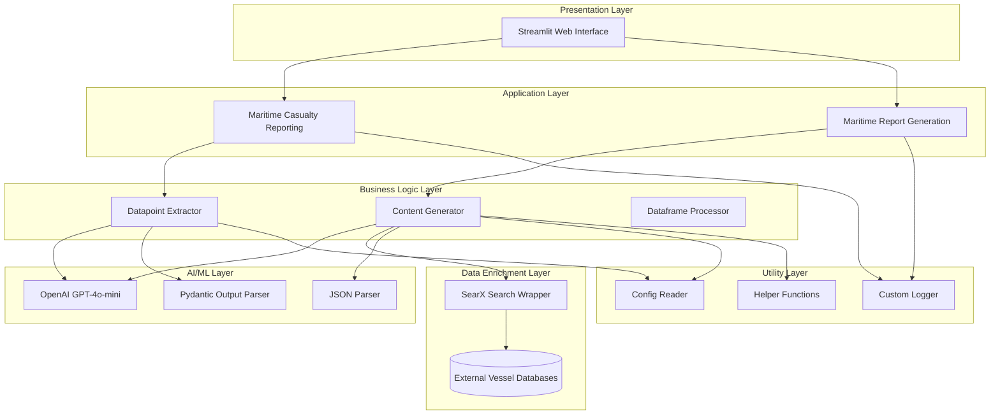
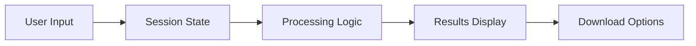
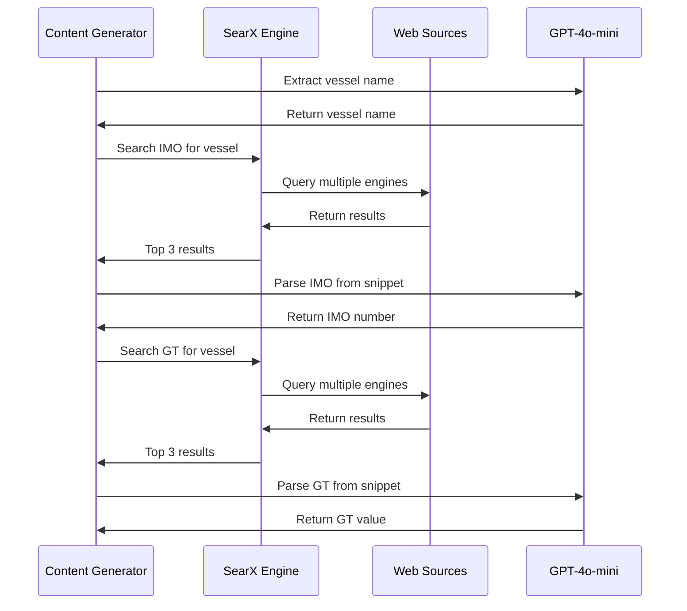
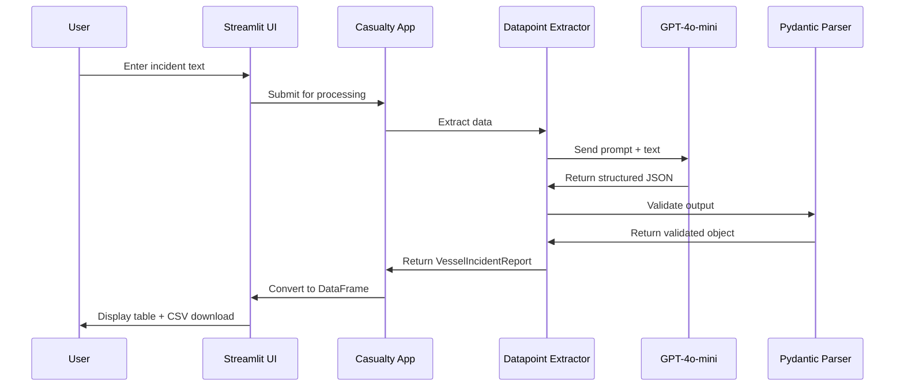
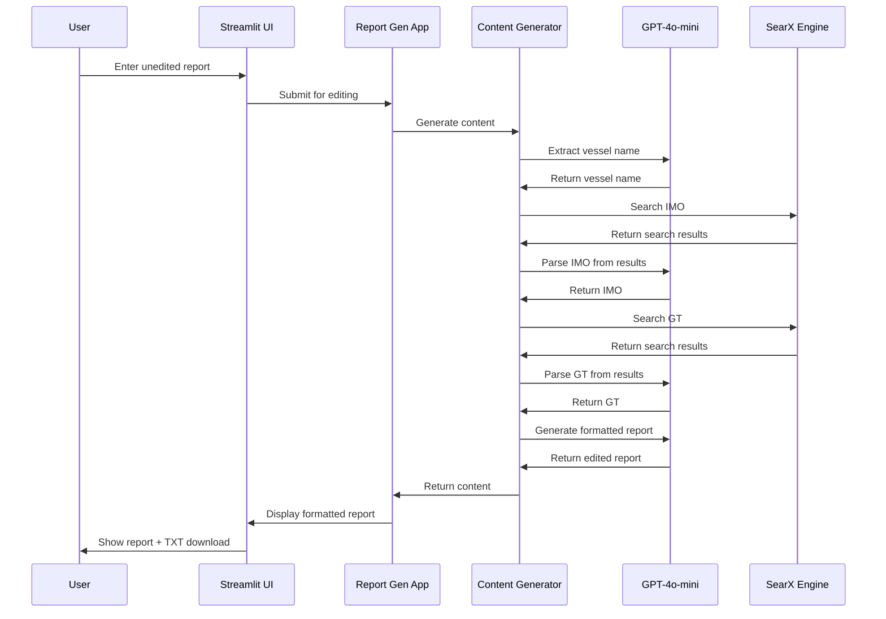
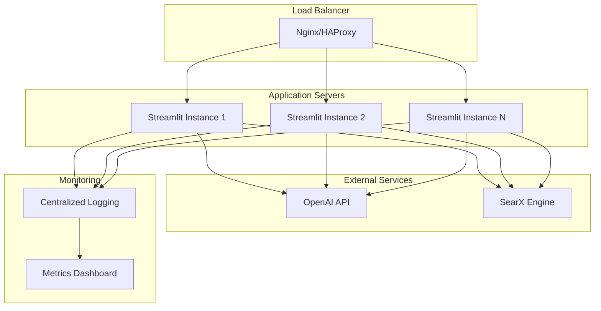

# Maritime Report Generation - Technical Architecture

## Table of Contents

1. [System Overview](#system-overview)
2. [Architecture Diagram](#architecture-diagram)
3. [Technology Stack](#technology-stack)
4. [Component Architecture](#component-architecture)
5. [Data Flow](#data-flow)
6. [Integration Points](#integration-points)
7. [Security Architecture](#security-architecture)
8. [Scalability and Performance](#scalability-and-performance)
9. [Deployment Architecture](#deployment-architecture)

## System Overview

The Maritime Report Generation system is built on a modular, AI-powered architecture that leverages Large Language Models (LLMs) for natural language processing and information extraction. The system consists of two primary applications:

1. **Maritime Casualty Reporting**: Extracts structured data from unstructured incident reports
2. **Maritime Report Generation**: Transforms raw reports into standardized, professional formats with automatic vessel information enrichment

### High-Level Architecture



## Technology Stack

### Core Technologies

| Component | Technology | Version | Purpose |
|-----------|-----------|---------|---------|
| **Programming Language** | Python | 3.8+ | Primary development language |
| **Web Framework** | Streamlit | Latest | Interactive web interface |
| **AI/ML Framework** | LangChain | Latest | LLM orchestration and chaining |
| **LLM Provider** | OpenAI | GPT-4o-mini-2024-07-18 | Natural language processing |
| **Data Processing** | Pandas | Latest | Structured data manipulation |
| **Data Validation** | Pydantic | Latest | Schema validation and parsing |
| **Configuration** | ConfigParser | Built-in | Configuration management |
| **Environment Management** | python-dotenv | Latest | Environment variable handling |
| **Search Integration** | langchain_community | Latest | External search capabilities |

### Dependencies

```
langchain              # LLM orchestration framework
pydantic              # Data validation and parsing
requests              # HTTP client library
configparser          # Configuration file parsing
python-dotenv         # Environment variable management
pandas                # Data manipulation and analysis
streamlit             # Web application framework
langchain_community   # Community integrations for LangChain
langchain_openai      # OpenAI integration for LangChain
```

## Component Architecture

### 1. Presentation Layer

#### Streamlit Web Interface

**Files**:
- `/maritime_casualty_reporting.py`
- `/maritime_report_generation.py`

**Responsibilities**:
- User input collection
- Session state management
- Results display
- File download functionality

**Key Features**:
- Text area input for incident reports
- Real-time processing feedback
- DataFrame visualization
- CSV and TXT file export



### 2. Business Logic Layer

#### Datapoint Extractor

**File**: `/pipeline/datapoint_extractor.py`

**Class**: `DatapointExtraction`

**Responsibilities**:
- Extract structured data from unstructured text
- Parse incident information using LLM
- Validate extracted data against schema

**Key Methods**:
```python
get_table(text: str) -> VesselIncidentReport
```

**Data Schema**: 25+ fields including:
- Vessel Information (name, IMO, crew count, operator)
- Incident Details (date, time, nature, cause, severity)
- Location Data (coordinates, reference point, port)
- Casualties (total, nationalities)
- Environmental Impact (pollution, spills)
- Reporting Information (source, timestamp, publisher)

#### Content Generator

**File**: `/pipeline/content_generator.py`

**Class**: `ContentGenerator`

**Responsibilities**:
- Transform raw reports to standardized format
- Enrich vessel information via web search
- Apply house style guidelines
- Generate professional narrative

**Key Methods**:
```python
get_content_1(text: str, df: pd.DataFrame) -> str
get_content_2(text: str) -> str
```

**Processing Pipeline**:
1. Extract vessel name from text
2. Search for IMO number using SearX
3. Search for gross tonnage using SearX
4. Generate standardized report with enriched data

### 3. AI/ML Layer

#### LLM Configuration

**Model**: GPT-4o-mini-2024-07-18

**Parameters**:
```python
{
    "model": "gpt-4o-mini-2024-07-18",
    "model_provider": "openai",
    "temperature": 0,
    "max_tokens": 3000
}
```

**Rationale**:
- **Temperature 0**: Ensures deterministic, consistent outputs
- **Max Tokens 3000**: Sufficient for comprehensive reports
- **GPT-4o-mini**: Balance between performance and cost

#### Output Parsers

**Pydantic Parser**:
- Structured data extraction with type validation
- Schema enforcement for all 25 data fields
- Automatic error handling for malformed outputs

**JSON Parser**:
- Flexible parsing for web search results
- Extraction of specific fields (vessel name, IMO, GT)
- Fallback handling for missing data

### 4. Data Enrichment Layer

#### SearX Search Integration

**File**: `/pipeline/content_generator.py`

**Configuration**:
```python
{
    "searx_host": "http://172.27.141.49:8081",
    "engines": ["bing", "duckduckgo"],
    "k": 5,
    "num_results": 3
}
```

**Search Queries**:
1. **IMO Lookup**: "Get me the IMO number for the vessel [vessel_name]"
2. **GT Lookup**: "Get me the gross tonnage for the vessel [vessel_name]"

**Integration Flow**:


### 5. Data Models

#### VesselIncidentReport Schema

**File**: `/pipeline/datapoints.py`

```python
class VesselIncidentReport(BaseModel):
    # Vessel Information
    vessel_name: str
    imo_number: str
    number_of_crew: str
    owner_operator: str
    contact_information: str

    # Incident Details
    date_of_incident: str
    reported_time_utc: str
    nature_of_incident: str
    potential_cause: str

    # Location
    latitude_longitude: str
    reference_point: str
    distance_from_shore: str
    port_of_call: str
    severity_of_incident: str

    # Casualties
    total_casualties: str
    crew_nationalities: str

    # Environmental Impact
    pollution_reported: str
    oil_spill: str
    hazardous_cargo_spill: str
    estimated_financial_loss: str

    # Reporting
    reported_by: str
    source_of_report: str
    report_timestamp_utc: str
    published_by: str
    published_on: str
```

#### Supporting Models

```python
class VesselGetter(BaseModel):
    vessel_name: str

class IMOGetter(BaseModel):
    IMO: str

class GTGetter(BaseModel):
    gt: str
```

### 6. Prompt Engineering

#### Prompt Templates

**File**: `/pipeline/prompts.py` and `/pipeline/generator_prompt.py`

**Key Prompts**:

1. **Data Extraction Prompt**: Structured extraction with JSON output
2. **Content Generation Prompt**: House style adherence with 64 specific guidelines
3. **Web Search Prompt**: Concise information retrieval
4. **Vessel Information Prompts**: Targeted IMO and GT extraction

**Prompt Structure**:
```
## Task
[Clear objective definition]

## Output Format
[JSON schema or structure]

## Instructions
[Specific guidelines and rules]

## Input Text
[User-provided content]
```

### 7. Utility Layer

#### Custom Logger

**File**: `/utils/log_writer.py`

**Features**:
- Timed log rotation (daily)
- Separate console and file handlers
- Detailed error logging with file/line information
- 7-day log retention

**Log Format**:
```
%(asctime)s - %(levelname)s - %(name)s - %(filename)s:%(lineno)d - %(message)s
```

#### Configuration Reader

**File**: `/utils/config_reader.py`

**Configuration File**: `config.ini`

**Sections**:
```ini
[Dataframe]
columns = ["Datapoint", "Value"]

[llm]
model = "gpt-4o-mini-2024-07-18"

[searchengine]
url = "http://172.27.141.49:8081"
```

#### Helper Functions

**File**: `/utils/helper.py`

**Functions**:
- `find_json_patterns()`: Extract JSON from LLM responses using regex

## Data Flow

### Maritime Casualty Reporting Flow



### Maritime Report Generation Flow



## Integration Points

### External Service Integrations

1. **OpenAI API**
   - Authentication: API key via environment variable
   - Endpoint: OpenAI GPT-4o-mini
   - Rate Limiting: Handled by LangChain
   - Error Handling: Exception catching with logging

2. **SearX Meta-Search Engine**
   - Host: Configurable via config.ini
   - Engines: Bing, DuckDuckGo
   - Results: Top 3 per query
   - Timeout: Default HTTP timeout

### File System Integration

- **Configuration Files**: `config.ini`, `.env`
- **Log Files**: `./logs/[YYYY-MM-DD].log`
- **Download Files**: In-memory CSV and TXT generation

## Security Architecture

### Authentication and Authorization

- **API Key Management**: Environment variables via `.env` file
- **Access Control**: No built-in authentication (designed for internal use)
- **Configuration Security**: Sensitive data in environment variables

### Data Security

- **In-Transit**: HTTPS for OpenAI API calls
- **At-Rest**: No persistent data storage
- **Session Management**: Streamlit session state (server-side)
- **Logging**: No sensitive data in logs

### Input Validation

- **Pydantic Schemas**: Automatic validation of LLM outputs
- **Type Checking**: Strong typing throughout codebase
- **Error Handling**: Comprehensive exception handling

## Scalability and Performance

### Performance Characteristics

- **Processing Time**: 15-30 seconds per report (including web searches)
- **Concurrent Users**: Limited by Streamlit single-threaded architecture
- **LLM Calls**: 4-6 per report generation workflow
- **Memory Usage**: Minimal (no large data structures)

### Scalability Considerations

**Current Limitations**:
- Single-threaded Streamlit application
- Sequential processing only
- No caching of vessel information
- Direct LLM API calls (no batch processing)

**Scaling Strategies**:
1. **Horizontal Scaling**: Deploy multiple Streamlit instances behind load balancer
2. **Caching Layer**: Redis for vessel information (IMO, GT lookups)
3. **Async Processing**: Queue-based architecture for batch processing
4. **API Gateway**: Rate limiting and request optimization
5. **Database Integration**: Persistent storage for historical lookups

### Optimization Opportunities

1. **LLM Call Reduction**: Cache vessel information after first lookup
2. **Batch Processing**: Process multiple reports in parallel
3. **Prompt Optimization**: Reduce token usage while maintaining quality
4. **Search Optimization**: Cache search results for common vessel names
5. **Model Selection**: Use different models based on task complexity

## Deployment Architecture

### Local Deployment

**Requirements**:
- Python 3.8+
- OpenAI API key
- SearX instance (optional for enrichment)

**Setup Steps**:
```bash
# Install dependencies
pip install -r requirements.txt

# Configure environment
cp .env.example .env
# Edit .env with OPENAI_API_KEY

# Configure settings
# Edit config.ini with model and search engine settings

# Run Maritime Casualty Reporting
streamlit run maritime_casualty_reporting.py

# Run Maritime Report Generation
streamlit run maritime_report_generation.py
```

### Production Deployment



### Container Deployment (Docker)

**Proposed Dockerfile**:
```dockerfile
FROM python:3.9-slim

WORKDIR /app

COPY requirements.txt .
RUN pip install --no-cache-dir -r requirements.txt

COPY . .

EXPOSE 8501

CMD ["streamlit", "run", "maritime_casualty_reporting.py"]
```

### Cloud Deployment Options

1. **AWS**:
   - EC2 for application servers
   - ECS/EKS for containerized deployment
   - ElastiCache for caching layer
   - CloudWatch for monitoring

2. **Azure**:
   - App Service for web hosting
   - Container Instances for containerized apps
   - Redis Cache for vessel information
   - Application Insights for monitoring

3. **GCP**:
   - Compute Engine for VMs
   - Cloud Run for serverless containers
   - Memorystore for caching
   - Cloud Logging for logs

## Error Handling and Resilience

### Error Handling Strategy

```python
try:
    # LLM processing
    response = llm.invoke([HumanMessage(content=prompt)])
except Exception as e:
    log.write_error_log(sys.exc_info())
    st.error("Please try again.")
```

### Resilience Patterns

1. **Graceful Degradation**: Return partial results if enrichment fails
2. **Retry Logic**: Can be added for transient API failures
3. **Fallback Values**: Use "-" for missing data points
4. **User Feedback**: Clear error messages in UI

## Monitoring and Observability

### Logging

- **Error Logs**: Detailed exception tracking with file/line information
- **Rotation**: Daily log files with 7-day retention
- **Levels**: ERROR level for file, INFO for console

### Metrics to Monitor

1. **Application Metrics**:
   - Request processing time
   - Success/failure rates
   - User session counts

2. **LLM Metrics**:
   - API call latency
   - Token usage
   - Error rates
   - Cost per request

3. **Search Metrics**:
   - Search query success rate
   - Result quality (IMO/GT found)
   - Search latency

4. **System Metrics**:
   - CPU utilization
   - Memory usage
   - Network I/O

## Future Technical Enhancements

1. **Caching Layer**: Redis for vessel information and search results
2. **API Development**: RESTful API for programmatic access
3. **Database Integration**: PostgreSQL for historical data and analytics
4. **Message Queue**: RabbitMQ/Kafka for async processing
5. **Model Flexibility**: Support multiple LLM providers (Azure OpenAI, Anthropic)
6. **Advanced Parsing**: Computer vision for PDF/image processing
7. **Webhooks**: Event-driven notifications for completed reports
8. **GraphQL API**: Flexible data querying interface
9. **Multi-tenancy**: Support for multiple organizations with data isolation
10. **Real-time Collaboration**: WebSocket support for multi-user editing

## Conclusion

The Maritime Report Generation system is built on a modern, AI-powered architecture that leverages industry-standard technologies and best practices. The modular design enables easy maintenance, testing, and future enhancements while delivering robust performance for maritime incident reporting and documentation automation.
