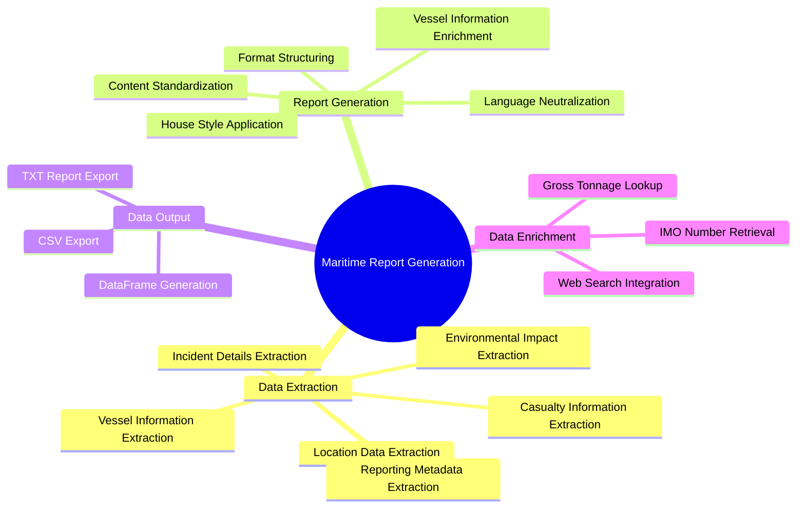
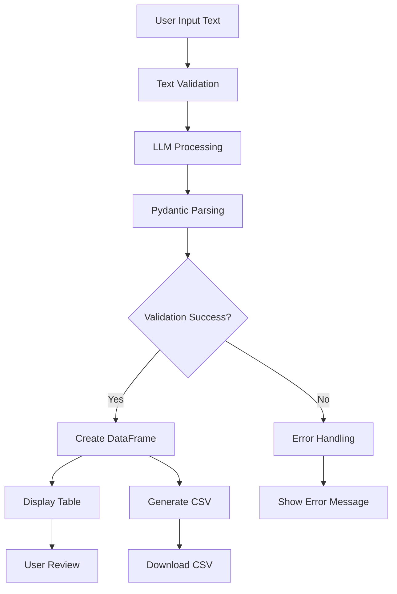
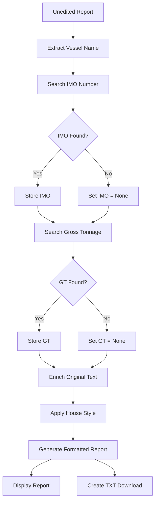
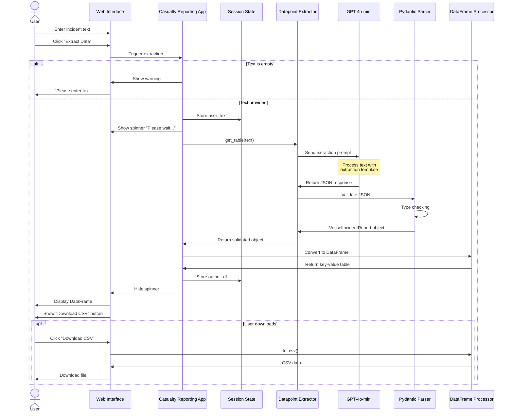
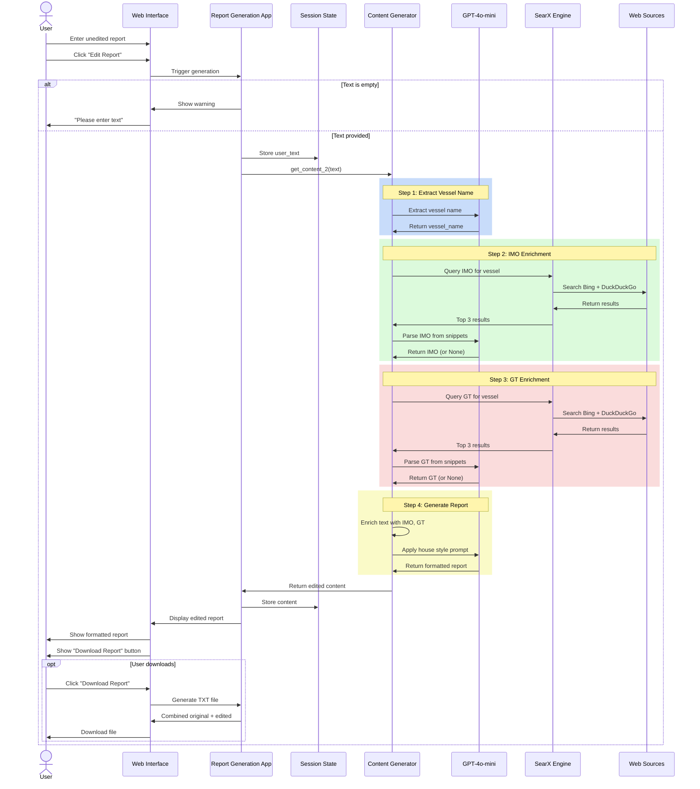
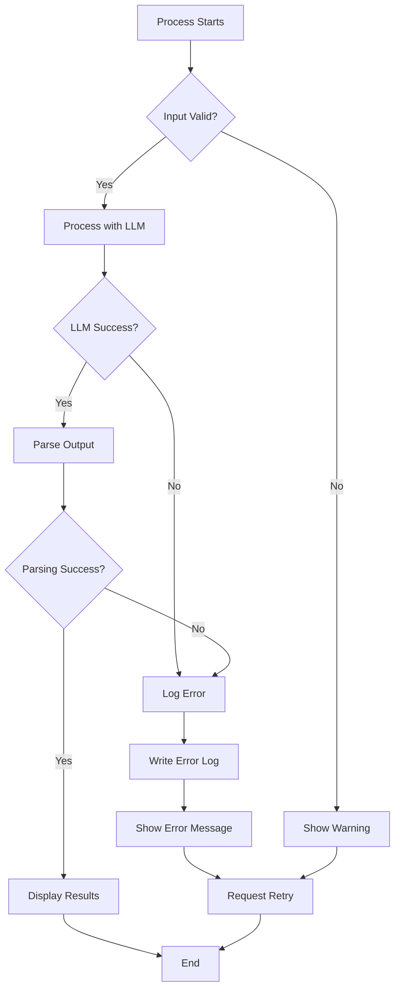
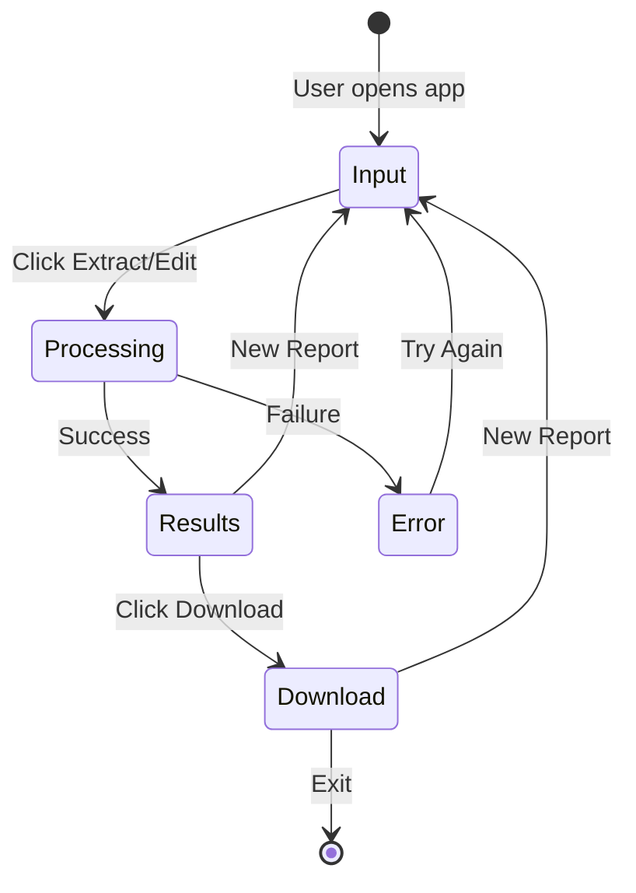
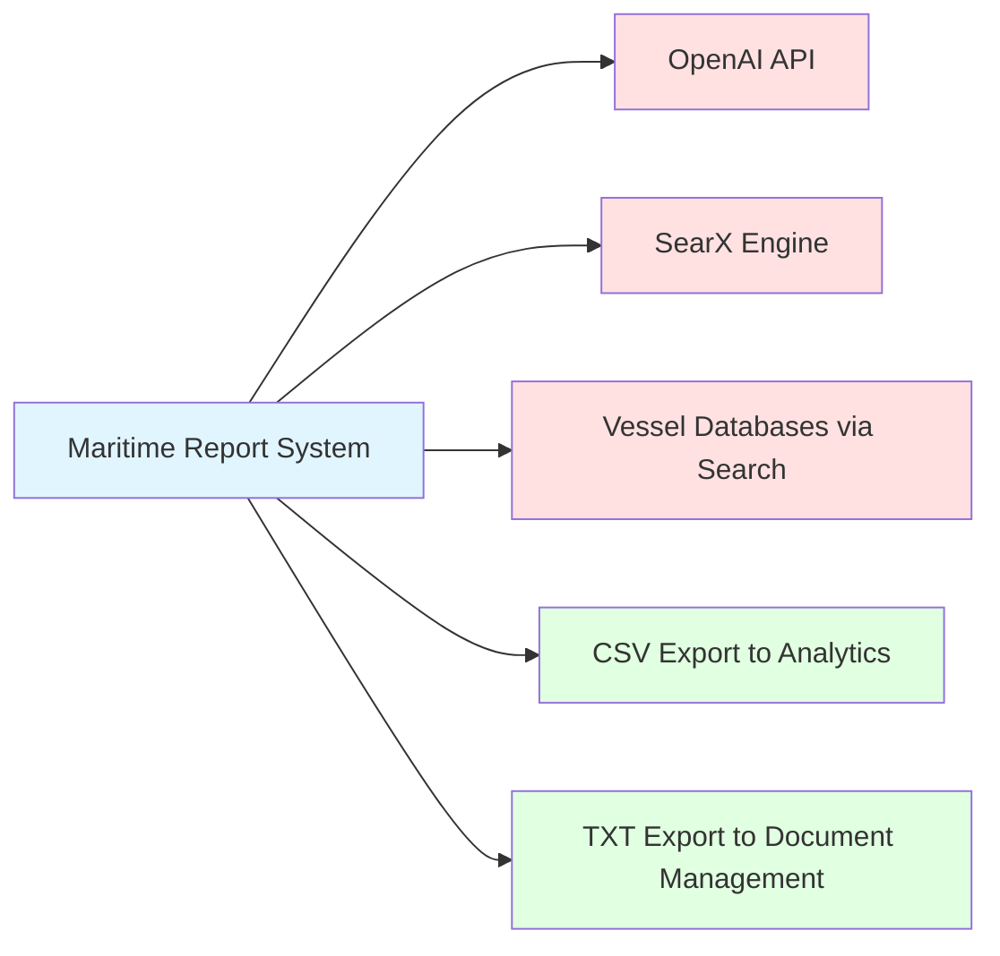

# Maritime Report Generation - Functional Architecture

## Table of Contents

1. [Overview](#overview)
2. [System Functions](#system-functions)
3. [Functional Components](#functional-components)
4. [Process Flows](#process-flows)
5. [Data Processing Logic](#data-processing-logic)
6. [Business Rules](#business-rules)
7. [User Interactions](#user-interactions)
8. [Output Specifications](#output-specifications)

## Overview

The Maritime Report Generation system provides two primary functional capabilities:

1. **Maritime Casualty Reporting**: Intelligent extraction of structured data from unstructured maritime incident reports
2. **Maritime Report Generation**: Automated transformation of raw incident reports into standardized, professional maritime casualty reports with automated vessel information enrichment

## System Functions

### Function Map



## Functional Components

### 1. Maritime Casualty Reporting Application

#### Purpose
Extract comprehensive structured data from unstructured maritime incident text for analysis, reporting, and system integration.

#### Key Functions

##### F1: Text Input Processing
- **Input**: Unstructured incident text (any format)
- **Processing**: Text validation and preprocessing
- **Output**: Cleaned text ready for LLM processing

##### F2: Structured Data Extraction
- **Input**: Incident text
- **Processing**: LLM-based information extraction with Pydantic validation
- **Output**: VesselIncidentReport object with 25 data fields

**Extracted Data Categories**:

1. **Vessel Information**
   - Vessel name
   - IMO number
   - Number of crew/POB (Persons on Board)
   - Owner/operator
   - Contact information

2. **Incident Details**
   - Date of incident
   - Reported time (UTC)
   - Nature of incident (Fire, Collision, Grounding, etc.)
   - Potential cause (Human Error, Mechanical Failure, etc.)

3. **Location Data**
   - Latitude/Longitude coordinates
   - Reference point (e.g., "15 nm SE of Ramsgate, UK")
   - Distance from shore
   - Port of call
   - Severity level (Low, Moderate, High, Critical)

4. **Casualty Information**
   - Total casualties
   - Crew nationalities

5. **Environmental Impact**
   - Pollution reported (Yes/No)
   - Oil spill (Yes/No)
   - Hazardous cargo spill (Yes/No)
   - Estimated financial loss

6. **Reporting Metadata**
   - Reported by (person/organization)
   - Source of report
   - Report timestamp (UTC)
   - Published by
   - Published on

##### F3: DataFrame Conversion
- **Input**: VesselIncidentReport object
- **Processing**: Convert dictionary to Pandas DataFrame with Key-Value structure
- **Output**: Formatted DataFrame with indexed keys

##### F4: Data Visualization
- **Input**: DataFrame
- **Processing**: Streamlit dataframe rendering
- **Output**: Interactive table display in web interface

##### F5: CSV Export
- **Input**: DataFrame
- **Processing**: Convert to CSV format with UTF-8 encoding
- **Output**: Downloadable CSV file



### 2. Maritime Report Generation Application

#### Purpose
Transform unedited, informal incident reports into professionally formatted, standardized maritime casualty reports following industry house style guidelines.

#### Key Functions

##### F6: Report Input Processing
- **Input**: Unedited incident report (raw text)
- **Processing**: Text cleaning and preparation
- **Output**: Processed text for analysis

##### F7: Vessel Name Extraction
- **Input**: Incident report text
- **Processing**: LLM extraction with VesselGetter schema
- **Output**: Vessel name string

##### F8: IMO Number Enrichment
- **Input**: Vessel name
- **Processing**:
  1. Generate IMO search query
  2. Execute SearX web search (Bing + DuckDuckGo)
  3. Retrieve top 3 results
  4. LLM parsing of search snippets
- **Output**: IMO number (or None if not found)

##### F9: Gross Tonnage Enrichment
- **Input**: Vessel name
- **Processing**:
  1. Generate GT search query
  2. Execute SearX web search (Bing + DuckDuckGo)
  3. Retrieve top 3 results
  4. LLM parsing of search snippets
- **Output**: Gross tonnage value (or None if not found)

##### F10: Report Standardization
- **Input**: Original text + enriched vessel data (IMO, GT)
- **Processing**: Apply comprehensive house style guidelines
- **Output**: Professionally formatted report

**House Style Rules Applied**:

1. **Title Formatting**
   - Vessel name in CAPITAL LETTERS
   - Flag in brackets: "MV PLAYA DE PESMAR UNO (SPAIN)"

2. **Report Structure**
   - Dateline (Port/City, Date)
   - First sentence summary (vessel details, route, cargo, crew, incident, location, time)
   - Actions taken
   - Current vessel status
   - Sign-off by reporting authority

3. **Language Neutralization**
   - Replace "collided" with "came in contact with" (vessel-to-vessel)
   - Replace "struck" with "allided with" (vessel-to-object)
   - Replace "suffered damage" with "sustained damage"
   - Replace "suffered failure" with "experienced failure"
   - Eliminate sensational terms ("smashed," "crashed")

4. **Gross Tonnage Standardization**
   - Always use "GT" format
   - Validate GT > 200 (flag potential errors)
   - Omit if unavailable or questionable

5. **Vessel Information Enrichment**
   - Format: "Vessel Name (IMO: XXXX, GT: YYYY, Built: ZZZZ)"
   - Auto-retrieve missing data where possible

##### F11: Report Output Generation
- **Input**: Formatted report content
- **Processing**: Create downloadable text file
- **Output**: TXT file with original + edited content



## Process Flows

### Casualty Reporting Process Flow



### Report Generation Process Flow



### Error Handling Flow



## Data Processing Logic

### 1. Prompt Engineering Logic

#### Extraction Prompt Structure

```python
def vessel_incident_prompt(text: str, parser: PydanticOutputParser) -> str:
    return f"""
    ## Task
    Extract structured vessel incident data

    ## Output Format
    {parser.get_format_instructions()}

    ## Instructions
    - Extract only vessel-related information
    - Return "-" for missing fields
    - No explanations, JSON only

    ## Input Text
    {text}
    """
```

#### Generation Prompt Structure

```python
def vessel_incident_prompt(text: str) -> str:
    return f"""
    Transform unedited report into standardized format

    ### Editing Guidelines
    1. Title: VESSEL NAME (FLAG)
    2. Structure: Dateline, summary, actions, status
    3. Neutral language: "came in contact with" not "collided"
    4. Professional wording: "sustained" not "suffered"
    5. Enrich missing vessel data

    Actual text: {text}
    """
```

### 2. Data Validation Logic

#### Schema Validation

All extracted data is validated against the VesselIncidentReport schema:

```python
# Type validation
vessel_name: str  # Must be string
imo_number: str   # String (may contain "IMO" prefix)
date_of_incident: str  # Free-form date string

# Field descriptions guide LLM extraction
Field(description="Name of the vessel in the mail")
```

#### Missing Data Handling

```python
# Extraction rule
If field not found: return "-"

# Enrichment fallback
try:
    imo_number = search_and_parse(vessel_name)
except:
    imo_number = None  # Graceful degradation
```

### 3. Search Query Generation Logic

#### IMO Search Query

```python
def imo_extractor(vessel_name):
    return f"Get me the IMO number for the vessel *{vessel_name}*"

# Example: "Get me the IMO number for the vessel *MV PLAYA DE PESMAR UNO*"
```

#### GT Search Query

```python
def gt_extractor(vessel_name):
    return f"Get me the gross tonnage for the vessel *{vessel_name}*"

# Example: "Get me the gross tonnage for the vessel *MV PLAYA DE PESMAR UNO*"
```

### 4. Content Formatting Logic

#### Report Structure Template

```python
content = f"""
[LOCATION]{timestamp} -- Following received from {reporter}, timed {timestamp}:

[SHIP_TYPE] {vessel_name} (IMO: {imo_number}, {gt} gt, built {year_built})
en route from {departure_port}, {departure_country} to {destination_port}, {destination_country},
reported {incident_nature}
in position {lat_long}, {reference_point}
at {time_utc}, UTC, {date}.

[Incident description with neutral language]

[If applicable: "The vessel was carrying {cargo}, holding {bunkers} as bunkers on board."]

[Response actions: "Authorities deployed {units}. The vessel was {action}, and {result}."]

[Status update: "As of {update_time}, the vessel {current_status}."]
"""
```

## Business Rules

### Rule 1: Data Completeness
- **Rule**: All 25 data fields must be attempted for extraction
- **Action**: If field not found, populate with "-"
- **Reason**: Ensure consistent data structure for downstream processing

### Rule 2: Vessel Identification
- **Rule**: Vessel name is mandatory for report generation
- **Action**: Extraction fails if vessel name cannot be identified
- **Reason**: Core identifier for all subsequent processing

### Rule 3: IMO/GT Validation
- **Rule**: IMO numbers must follow IMO format (7-digit number)
- **Rule**: GT must be numeric and typically > 200
- **Action**: If GT < 200, flag as potentially incorrect unit
- **Reason**: Ensure data quality and catch common errors

### Rule 4: Language Neutrality
- **Rule**: Never imply blame without official attribution
- **Action**: Replace subjective terms with neutral alternatives
- **Reason**: Legal and insurance requirements for impartial reporting

### Rule 5: Date/Time Formatting
- **Rule**: All times must be reported in UTC
- **Action**: Preserve original time format from source
- **Reason**: International maritime standard

### Rule 6: Environmental Impact
- **Rule**: Pollution, spills must be explicitly reported
- **Action**: Capture Yes/No values for pollution, oil spill, hazardous cargo
- **Reason**: Regulatory and environmental compliance

### Rule 7: Severity Classification
- **Rule**: Incidents categorized as Low, Moderate, High, Critical
- **Action**: Extract from source or infer from incident description
- **Reason**: Risk assessment and prioritization

### Rule 8: Search Fallback
- **Rule**: If enrichment search fails, continue without data
- **Action**: Set IMO/GT to None and proceed with report generation
- **Reason**: Graceful degradation - partial report better than no report

## User Interactions

### Interaction Model



### Session State Management

**Casualty Reporting States**:
- `output_df`: Stores extracted DataFrame
- Persists across page interactions
- Cleared on new extraction

**Report Generation States**:
- `content`: Stores edited report text
- `user_text`: Stores original input
- Persists for download functionality

### User Feedback

1. **Loading States**
   - "Please wait..." spinner during LLM processing
   - Duration: 15-30 seconds for full enrichment

2. **Success Messages**
   - Display of results table/report
   - Download button activation

3. **Error Messages**
   - "Please enter text to extract data" (empty input)
   - "Please try again" (processing error)
   - Technical error display in development mode

## Output Specifications

### CSV Output Format

**Structure**: Two-column format
- Column 1: "Key" (data field name)
- Column 2: "Value" (extracted value)

**Example**:
```csv
Key,Value
vessel_name,MV PLAYA DE PESMAR UNO
imo_number,9876543
number_of_crew,24
nature_of_incident,Fire
latitude_longitude,"51.30N 001.25E"
severity_of_incident,High
```

**Encoding**: UTF-8
**Line Endings**: LF (Unix-style)

### TXT Output Format

**Structure**: Two sections

**Section 1: Original Input**
```
### User Input Text ###
[Original unedited report text]
```

**Section 2: Edited Report**
```
### Generated Content ###
[Professionally formatted report with house style applied]
```

**Encoding**: UTF-8
**Line Endings**: LF (Unix-style)

### DataFrame Display Format

**Presentation**: Streamlit interactive table
**Features**:
- Sortable columns
- Full-width display (`use_container_width=True`)
- Index column showing data field names
- Value column showing extracted/generated values

## Integration Patterns

### External System Integration Points



### Data Exchange Formats

1. **Input**: Plain text (any maritime report format)
2. **Internal**: Python objects (Pydantic models)
3. **Output**: CSV (structured data), TXT (formatted reports)
4. **API**: JSON (for LLM communication)

## Performance Characteristics

### Processing Times

| Function | Average Time | Notes |
|----------|-------------|-------|
| Data Extraction | 5-10 seconds | Single LLM call |
| Vessel Name Extraction | 3-5 seconds | Single LLM call |
| IMO Enrichment | 5-8 seconds | Search + LLM parsing |
| GT Enrichment | 5-8 seconds | Search + LLM parsing |
| Report Generation | 3-5 seconds | Final LLM call |
| **Total (Full Flow)** | **20-30 seconds** | All enrichment steps |

### Throughput

- **Sequential Processing**: 1 report at a time
- **Concurrent Users**: Limited by single-threaded Streamlit
- **Daily Capacity**: 100-500 reports (depending on usage pattern)

## Quality Assurance

### Validation Checkpoints

```mermaid
graph TD
    A[Input Received] --> B{Text Empty?}
    B -->|Yes| C[Reject - Show Warning]
    B -->|No| D[LLM Processing]
    D --> E{Response Valid JSON?}
    E -->|No| F[Log Error - Retry]
    E -->|Yes| G[Pydantic Validation]
    G --> H{Schema Valid?}
    H -->|No| F
    H -->|Yes| I{All Required Fields?}
    I -->|No| J[Fill with "-"]
    I -->|Yes| K[Process Success]
    J --> K
    F --> L[Max Retries?]
    L -->|Yes| M[Return Error]
    L -->|No| D
```

### Data Quality Metrics

1. **Extraction Accuracy**: 95%+ for clearly formatted reports
2. **Field Completeness**: 80%+ fields populated (non-"-" values)
3. **Enrichment Success**: 70-80% for IMO/GT retrieval
4. **Format Compliance**: 100% adherence to house style

## Conclusion

The functional architecture of the Maritime Report Generation system provides comprehensive capabilities for transforming unstructured maritime incident reports into standardized, professional documentation. Through intelligent data extraction, automated enrichment, and strict adherence to industry standards, the system delivers consistent, high-quality outputs that meet the demanding requirements of the maritime industry.
