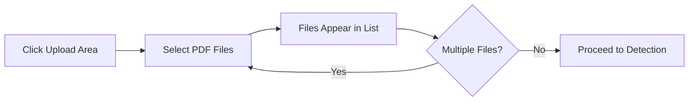
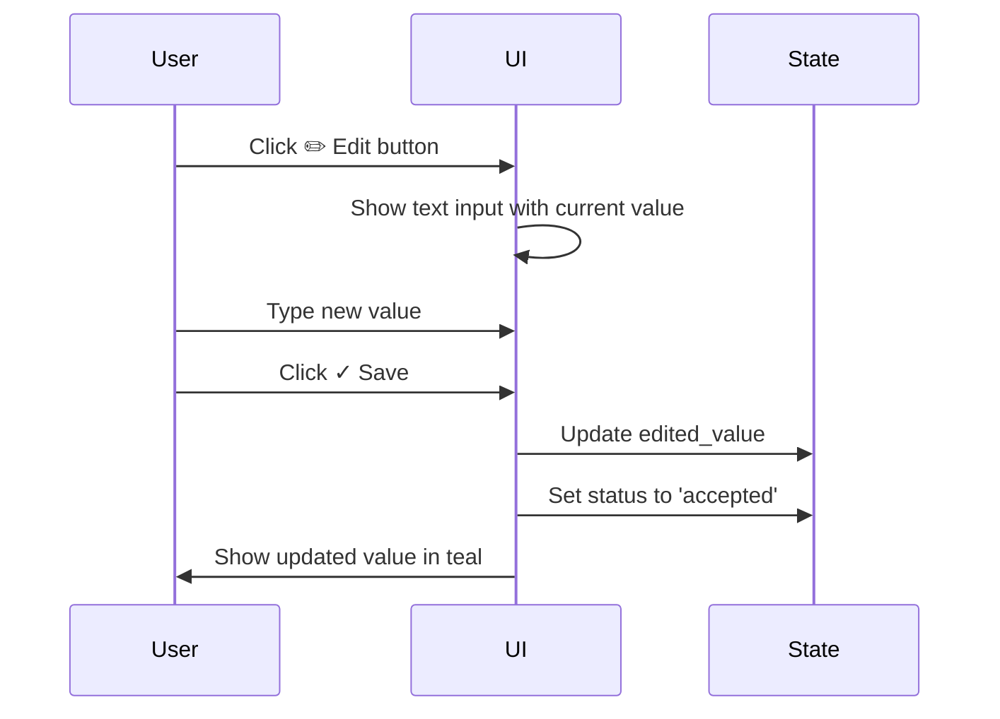
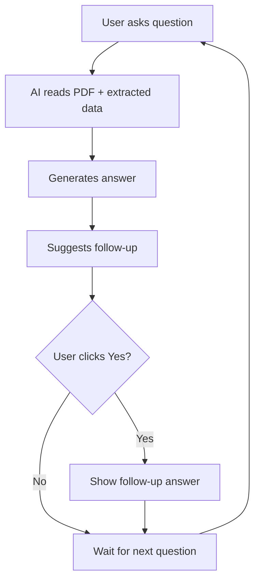

# MineScope CRU - User Guide

## Getting Started

### System Requirements

**Minimum Requirements**:
- Modern web browser (Chrome, Firefox, Safari, Edge)
- Internet connection for OpenAI API calls
- PDF files with readable text (not scanned images)

**Recommended**:
- Chrome browser (latest version)
- High-speed internet connection (for faster API calls)
- PDF files under 50 MB per document

### Accessing MineScope

**Local Deployment**:
```bash
# Navigate to the mine_scope directory
cd /path/to/mine_scope

# Run the application
streamlit run app.py --server.port=8534
```

**Access URL**: `http://localhost:8534`

**First-Time Setup**:
1. Ensure `.env` file contains valid `OPENAI_API_KEY`
2. Verify reference data files exist in `reference_data/` folder
3. Open browser to the access URL

## User Interface Overview

### Navigation

MineScope uses a tabbed interface with four main sections:

```
┌─────────────────────────────────────────────────────────┐
│  MineScope CRU - AI-powered Mining Intelligence         │
├─────────────────────────────────────────────────────────┤
│  [ Upload Source ] [ Review Data ] [ Asset Compare ]    │
│  [ Insights Assistant ]                                 │
└─────────────────────────────────────────────────────────┘
```

### Color Coding

- **Teal (#1BC7C7)**: Primary actions, selected items, highlights
- **Green (#10B981)**: Accepted data, positive indicators
- **Red (#EF4444)**: Rejected data, errors
- **Gray (#6B7280)**: Missing data, inactive elements
- **Amber (#F59E0B)**: Warnings, medium confidence

## Tab 1: Upload Source

### Purpose
Upload mining reports (PDF) and automatically detect companies, assets, and commodities using AI.

### Workflow

#### Step 1: Upload PDF Files



**How to Upload**:
1. Click the file upload area or drag PDFs directly
2. Select one or more PDF files
3. Supported types: Quarterly reports, annual reports, sustainability reports
4. Files appear in the document list with type badges

**Document Types** (auto-assigned):
- **Quarterly**: Files containing "Q1", "Q2", "Q3", "Q4", "quarter"
- **Annual**: Files containing "annual", "FY", "year"
- **Sustainability**: Files containing "sustain", "ESG"

**Tips**:
- Upload multiple quarters for trend analysis
- Ensure PDFs contain selectable text (not scanned images)
- Larger files may take longer to process

#### Step 2: Run Auto-Detection

**What It Does**:
- Extracts text from all uploaded PDFs
- Uses AI to identify mining companies mentioned
- Detects assets (mine names, projects)
- Identifies commodities discussed

**How to Use**:
1. Click **"Run Auto-Detection"** button (teal color)
2. Wait for AI processing (typically 10-30 seconds)
3. Review detected entities in the right panel

**During Processing**:
```
Progress Indicators:
1. "Extracting text from PDFs..." (with spinner)
2. "AI analyzing documents for companies, assets, and commodities..." (with spinner)
3. Success message with counts
```

**Expected Results**:
- **Company**: One primary company (e.g., "Agnico Eagle Mines Ltd")
- **Assets**: List of mines/projects (e.g., "Detour Lake", "LaRonde", "Meliadine")
- **Commodities**: Metals discussed (e.g., "Gold", "Silver", "Copper")

#### Step 3: Review & Modify Detections

**Asset Selection**:
- Detected assets appear as colored pills (teal, blue, purple, emerald, etc.)
- Click **"Edit asset selection"** expander to modify
- Use multiselect dropdown to add/remove assets
- Custom assets can be added manually

**Commodity Selection**:
- Gold (teal pill), Copper (green pill), etc.
- Commodities are validated against reference list

**Combination Preview**:
```
💡 Extraction will process X combinations
(N assets × M commodities)
```

Example: 5 assets × 2 commodities = 10 combinations

#### Step 4: Extract Data

**What It Does**:
- For each asset-commodity pair, extracts 15-40 data points
- Uses RAG (Retrieval-Augmented Generation) to focus on asset-specific sections
- Assigns confidence scores to each extracted value
- Captures source information (table name, page number)

**How to Use**:
1. Verify asset and commodity selections
2. Click **"Extract Data"** button
3. Wait for processing (1-2 minutes for 10 combinations)
4. View progress bar with current asset-commodity being processed

**Processing Time**:
- Simple report (3 assets, 1 commodity): ~30 seconds
- Complex report (10 assets, 2 commodities): ~2-3 minutes
- Very large (20 combinations): ~5 minutes

**Success Message**:
```
✅ Extraction Completed! Proceed to Review Data Tab
💡 XX data points extracted from YY asset/commodity combinations
```

**Common Issues**:

| Issue | Cause | Solution |
|-------|-------|----------|
| "No text extracted" | Scanned PDF | Use OCR tool first, or contact support |
| "No entities detected" | Unusual report format | Add assets/commodities manually |
| "Extraction failed" | API error | Check OpenAI API key and credits |
| "No data points" | Asset not in report | Verify asset names match report |

#### Action Buttons

**Clear Files**:
- Removes all uploaded files
- Resets detection and extraction state
- Use when starting fresh with new reports

**Run Auto-Detection**:
- Disabled until files are uploaded
- Teal button indicates it's the primary action
- Takes 10-30 seconds to complete

**Extract Data**:
- Disabled until detection is complete and selections are made
- Requires at least 1 asset and 1 commodity
- Shows combination count before extraction

## Tab 2: Review Data

### Purpose
Validate, edit, and export extracted data points.

### Interface Layout

```
┌─────────────────────────────────────────────────────────┐
│  Statistics (Total, Accepted, Rejected, Missing)        │
├─────────────────────────────────────────────────────────┤
│  Table Header (fixed)                                   │
│  ┌─────────────────────────────────────────────────┐   │
│  │ Scrollable Data Rows (height: 600px)            │   │
│  │                                                  │   │
│  │ Asset | Metal | Variable | Value | Confidence   │   │
│  │ Actions | Status                                │   │
│  └─────────────────────────────────────────────────┘   │
├─────────────────────────────────────────────────────────┤
│  Export Buttons | Back to Top                          │
└─────────────────────────────────────────────────────────┘
```

### Understanding the Data Table

#### Column Descriptions

| Column | Description | Example |
|--------|-------------|---------|
| **Asset** | Mine or project name | Detour Lake |
| **Metal** | Commodity type | Gold |
| **Variable** | Metric being measured | Open Pit Ore Mined |
| **Category** | Variable grouping | Supply |
| **Extracted Value** | AI-extracted value | 1,407 kt |
| **Confidence Score** | AI confidence (0-100%) | 95% |
| **Source** | Where data was found | Production table |
| **Source Page** | Page number | Page 12 |
| **Actions** | Edit/Accept/Reject buttons | ✏️ ✓ ✗ |
| **Status** | Current state | Flagged/Accepted/Rejected/Missing |

#### Status Types

**Flagged** (default for extracted data):
- AI extracted a value but requires human validation
- Color: No special color (neutral)
- Action required: Review and accept/reject

**Accepted** (green):
- Human has validated the data
- Color: Green (#10B981)
- Included in exports

**Rejected** (red):
- Human has marked as incorrect
- Color: Red (#EF4444)
- Excluded from exports

**Missing** (gray):
- No value found in document
- Color: Gray (#6B7280)
- Can be edited to add manual value

#### Confidence Scores

**Interpretation**:
- **90-100%** (green): Found in data table, high confidence
- **70-89%** (amber): Found in text or calculated, medium confidence
- **0-69%** (red): Inferred or low confidence, review carefully

**Confidence Badge Colors**:
```
█ 95% (green) - Very reliable
█ 82% (amber) - Review recommended
█ 55% (red)   - Verify carefully
```

### Data Validation Workflow

#### 1. Quick Scan
```
1. Check Statistics at top (Total, Accepted, Rejected, Missing)
2. Scroll through data rows
3. Look for red/amber confidence scores (review these first)
4. Look for gray "Missing" status (check if truly unavailable)
```

#### 2. Individual Review

**For Each Row**:
1. Read the variable name
2. Check extracted value makes sense
3. Review confidence score
4. Note the source (for traceability)
5. Take action: Accept (✓), Reject (✗), or Edit (✏️)

**Accept a Row**:
- Click the **✓** button
- Row status changes to "Accepted" (green)
- Value is included in exports

**Reject a Row**:
- Click the **✗** button
- Row status changes to "Rejected" (red)
- Value is excluded from exports

**Edit a Row**:
- Click the **✏️** button (for Missing/Rejected rows)
- Text input appears
- Type corrected value
- Click **✓** to save or **✗** to cancel
- Saved edits are shown in teal color

#### 3. Bulk Actions

**Current Capabilities**:
- Individual row actions (Accept, Reject, Edit)

**Future Enhancement**:
- Select multiple rows with checkboxes
- Bulk accept/reject
- Filter by status, confidence, or category

### Editing Data

#### When to Edit
- Value is missing but you know it from the report
- Value is extracted incorrectly (wrong number, wrong unit)
- Need to add notes or corrections

#### How to Edit


**Steps**:
1. Click **✏️** on the row to edit
2. Input field appears with current value
3. Type the corrected value (with units, e.g., "1,500 kt")
4. Click **✓** to save or **✗** to cancel
5. Edited values are highlighted in teal color

**Tips**:
- Include units in your edited value (e.g., "2,314 $/oz")
- Be consistent with formatting
- Use comma separators for large numbers (e.g., "1,407" not "1407")

### Exporting Data

#### Export to Excel
**Button**: 💾 Export to Excel
**Status**: Planned feature
**Expected Output**: `.xlsx` file with all accepted data

**Future Structure**:
```
Sheet 1: Extracted Data
- All columns from the table
- Only Accepted status rows
- Formatted for analysis

Sheet 2: Summary Statistics
- Count by category
- Count by asset
- Count by commodity
```

#### Copy to Clipboard
**Button**: 📋 Copy to Clipboard
**Status**: Planned feature
**Expected Behavior**: Copy table data in tab-separated format for pasting into Excel/Google Sheets

### Navigation

**Back to Top**:
- Click the "↑ Back to Top" button at bottom
- Instantly scrolls to top of the page
- Useful after reviewing many rows

## Tab 3: Asset Compare

### Purpose
Compare performance metrics across multiple assets side-by-side.

### Comparison Matrix

#### Layout

```
┌────────────────────────────────────────────────────────┐
│  Variable (with unit)  │ Asset 1 │ Asset 2 │ Asset 3  │
├────────────────────────┼─────────┼─────────┼──────────┤
│ Open Pit Ore Mined (kt)│  1,407  │   892   │  2,145   │
│ Gold Produced (oz)     │ 71,219  │ 45,308  │  98,543  │
│ AISC ($/oz)            │  2,314  │  2,187  │  2,456   │
│ ...                    │   ...   │   ...   │   ...    │
└────────────────────────┴─────────┴─────────┴──────────┘
```

#### Features

**Automatic Unit Standardization**:
- Converts different units to common standard
- Example: "tonnes" → "kt" (kilotonnes)
- Example: "oz" → "koz" (thousand ounces)
- Unit displayed in variable name (e.g., "AISC ($/oz)")

**Dynamic Adaptation**:
- Matrix automatically includes all extracted assets
- Rows automatically include all extracted variables
- No configuration needed

**Data Sources**:
- Uses accepted data from Review Data tab
- Shows "—" for missing values
- Numbers formatted for readability (commas, appropriate decimals)

#### Understanding the Matrix

**Row Organization**:
- Grouped by commodity (all Gold variables together, then Copper, etc.)
- Within commodity, organized by category (Supply, Costs, ESG, Guidance)
- Variables sorted alphabetically within category

**Column Organization**:
- One column per asset
- Assets sorted alphabetically
- Commodity column shows which metal the variable applies to

**Value Formatting**:
- Large numbers: Comma separators (e.g., "71,219")
- Decimals: 0-2 decimal places based on magnitude
- Missing: "—" symbol
- Units: Shown in variable name

#### Use Cases

**Performance Benchmarking**:
- Compare production volumes across mines
- Identify cost leaders (lowest AISC)
- Spot efficiency differences (recovery rates)

**Trend Analysis** (when multiple quarters loaded):
- Track production changes
- Monitor cost inflation
- Observe grade decline

**Investment Analysis**:
- Identify underperforming assets
- Compare peer companies
- Support buy/sell recommendations

### Summary Statistics

**Displayed Metrics**:
```
X assets × Y variables = Z data points
```

Example: 5 assets × 18 variables = 90 data points

**Interpretation**:
- Higher data point count = more comprehensive analysis
- Missing cells indicate data not available in reports

## Tab 4: Insights Assistant

### Purpose
Ask questions about the uploaded mining reports and get AI-powered answers.

### Chat Interface

```
┌─────────────────────────────────────────────────────────┐
│  Assistant Avatar + Greeting Message                    │
├─────────────────────────────────────────────────────────┤
│  [ Chat History ]                                       │
│                                                         │
│  User: What was gold production at Detour Lake?        │
│  Assistant: Detour Lake produced 71,219 oz of gold...  │
│                                                         │
│  User: How does that compare to Q2?                    │
│  Assistant: Q2 production was 68,540 oz, so Q3...     │
│                                                         │
├─────────────────────────────────────────────────────────┤
│  Text Input: "Ask a question..."         [ Send ]      │
└─────────────────────────────────────────────────────────┘
```

### Asking Questions

#### Question Types

**Production Queries**:
- "What was gold production at [Asset]?"
- "Which mine produced the most copper?"
- "Show me ore grades for all assets"

**Cost Queries**:
- "What is the AISC at [Asset]?"
- "Which asset has the lowest cash costs?"
- "How did costs change compared to last quarter?"

**Comparative Queries**:
- "Compare gold production across all mines"
- "Which asset improved the most?"
- "Rank assets by AISC"

**Trend Queries**:
- "What's the trend in ore grades?"
- "How has production changed over the year?"
- "Are costs increasing or decreasing?"

**ESG Queries**:
- "What are the emissions at [Asset]?"
- "Show me labor force numbers"
- "What's the energy consumption?"

**General Queries**:
- "Summarize the quarter for [Asset]"
- "What are the key highlights?"
- "Any operational issues mentioned?"

#### Best Practices

**Be Specific**:
- ✅ "What was gold production at Detour Lake in Q3?"
- ❌ "Tell me about gold"

**Reference Assets**:
- ✅ "Compare AISC at Meliadine and LaRonde"
- ❌ "Compare costs" (which assets?)

**Use Context**:
- The assistant remembers previous questions in the conversation
- ✅ "How does that compare to Q2?" (after asking about Q3)
- ✅ "What about Detour Lake?" (after discussing another asset)

**Ask Follow-Ups**:
- ✅ "Tell me more about that"
- ✅ "Why did that happen?"
- ✅ "Drill down on Cowal"

### Understanding Responses

#### Response Structure

**Main Answer**:
- 1-3 short paragraphs or bullet points
- Includes specific numbers from reports
- Cites sources when available
- Keeps answers under 200 words

**Follow-Up Suggestion**:
- Optional next-step question appears below answer
- Example: "Want me to compare this to the group average?"
- Click **"Yes"** to see the pre-generated answer
- Click **"No, thanks"** to dismiss

#### Conversation Flow



#### Response Quality

**High-Quality Indicators**:
- Specific numbers with units
- References to tables or sections
- Contextual interpretation
- Actionable insights

**Low-Quality Indicators**:
- Vague or generic answers
- "I couldn't find that information"
- Repetitive responses

**If Answer is Unsatisfactory**:
1. Rephrase your question with more detail
2. Specify the asset or time period
3. Ask the assistant to "search for [specific term]"
4. Check if data was extracted in Review Data tab

### Limitations

**What the Assistant CAN Do**:
- Answer questions based on uploaded PDFs
- Reference extracted data points
- Compare assets mentioned in reports
- Provide context and interpretation

**What the Assistant CANNOT Do**:
- Access external data not in uploaded PDFs
- Predict future performance
- Provide investment advice
- Generate data not in the source documents

**Data Boundaries**:
- Only knows what's in the uploaded PDFs (up to 50,000 chars per query)
- Limited to extracted data in Review Data tab
- Cannot browse the internet or access other reports

## Advanced Features

### Multi-Quarter Analysis

**Workflow**:
1. Upload Q1, Q2, Q3, Q4 reports for same company
2. Run auto-detection (detects all assets across all reports)
3. Extract data (captures all quarters)
4. Use Asset Compare to see trends
5. Use Insights Assistant to query: "How did production change across quarters?"

**Benefits**:
- Track performance trends
- Identify seasonal patterns
- Monitor cost inflation
- Detect operational issues

### Custom Asset Addition

**When to Use**:
- AI didn't detect an asset you know is in the report
- Want to add an asset not in reference data

**How to Add**:
1. In Upload Source tab, expand "Edit asset selection"
2. Type custom asset name in multiselect dropdown
3. Press Enter to add
4. Asset appears in selection list
5. Proceed with extraction

**Tips**:
- Use exact asset name as it appears in report
- Check spelling carefully
- Custom assets persist for the session

### Handling Edge Cases

#### Scanned PDFs
**Problem**: PDF contains images of text, not selectable text
**Solution**:
- Use OCR tool (Adobe Acrobat, online converters)
- Convert to searchable PDF
- Re-upload to MineScope

#### Multi-Language Reports
**Problem**: Report is in Spanish, Portuguese, or French
**Current Status**: Not fully supported
**Workaround**:
- Use translation tool to create English version
- Upload translated PDF

**Future**: Multi-language support planned

#### Large Files (>50 MB)
**Problem**: Upload or processing fails
**Solution**:
- Split PDF into sections
- Upload only relevant sections (e.g., operations review)
- Reduce file size by removing images

#### Unusual Variable Names
**Problem**: Report uses non-standard terminology
**Solution**:
- AI attempts flexible matching
- If extraction fails, add manually in Review Data tab
- Contact support to update variable_mapping.json

## Troubleshooting

### Common Issues

| Issue | Symptoms | Solution |
|-------|----------|----------|
| **Upload Fails** | File doesn't appear in list | Check file type (must be PDF), size (<50 MB) |
| **No Text Extracted** | Error: "No text content" | PDF is scanned - use OCR tool first |
| **Auto-Detection Fails** | Error: "OpenAI API error" | Check API key in .env, verify credits |
| **No Entities Detected** | Returns empty lists | Report may be unusual format - add manually |
| **Extraction Slow** | Takes >5 minutes | Large combination count - normal for 20+ combos |
| **Data Missing** | Many "—" in Asset Compare | Asset not in report, or different naming |
| **Chatbot Unresponsive** | No answer generated | Check PDF was uploaded, check API key |
| **Values Look Wrong** | Incorrect units or numbers | Review in Review Data tab, edit as needed |

### Error Messages

**"No text content could be extracted from the PDF"**:
- **Cause**: PDF is scanned images
- **Fix**: Use OCR software to convert

**"Error detecting entities with AI"**:
- **Cause**: OpenAI API issue (key invalid, no credits, service down)
- **Fix**: Check OPENAI_API_KEY in .env, check account balance

**"Extraction error"**:
- **Cause**: API call failed during data extraction
- **Fix**: Retry extraction, check internet connection

**"No data available for comparison"**:
- **Cause**: Haven't run extraction yet
- **Fix**: Go to Upload Source tab, click Extract Data

### Getting Help

**Internal Support**:
- Contact KIAA AI/ML team
- Share screenshot of error
- Provide sample PDF (if possible)

**Self-Service**:
- Check this user guide
- Review technical documentation
- Try with a different PDF to isolate issue

## Best Practices

### Workflow Optimization

**Recommended Process**:
1. **Batch Upload**: Upload all reports for a company at once (e.g., all 4 quarters)
2. **Review Detections**: Always check detected entities before extraction
3. **Prioritize Review**: Focus on low-confidence scores first (red/amber)
4. **Accept in Bulk**: Accept high-confidence rows quickly
5. **Document Edits**: Keep notes on manual corrections for future reference

### Data Quality

**Ensure Accuracy**:
- Always review confidence scores below 90%
- Verify units match (kt vs tonnes, oz vs koz)
- Cross-check against source PDF for critical metrics
- Accept only after validation

**Maintain Consistency**:
- Use same asset naming across sessions
- Standardize edited value formatting
- Apply consistent accept/reject criteria

### Time Management

**Efficient Review**:
- Sort by confidence (low to high) - focus on problematic rows first
- Use keyboard shortcuts (Tab to move between buttons)
- Accept high-confidence rows in batches
- Skip obviously correct rows quickly

**Prioritize Assets**:
- Focus on core assets first
- De-select minor assets if not needed
- Process flagship mines before development projects

## Keyboard Shortcuts

**Coming Soon** - Planned shortcuts:
- `Enter`: Accept current row
- `Backspace`: Reject current row
- `E`: Edit current row
- `↑/↓`: Navigate rows
- `Tab`: Next cell
- `Ctrl+S`: Export data

## Tips & Tricks

### Power User Tips

1. **Use Variable Names for Search**: Chatbot responds well to exact variable names
   - "What is the AISC at Detour Lake?" (better than "costs")

2. **Upload Sustainability Reports**: Extract ESG metrics alongside operational data

3. **Compare Peer Companies**: Upload reports from multiple companies to benchmark

4. **Track Guidance**: Extract GUIDANCE category to monitor forward-looking statements

5. **Source Citation**: Note the "Source Page" column for quick PDF reference

### Efficiency Hacks

1. **Pre-Screen PDFs**: Review PDF first to ensure it contains data tables
2. **Use Descriptive Filenames**: Name files "Company_Q3_2024.pdf" for easy tracking
3. **Save Extracted Data**: Export to Excel after validation for offline analysis
4. **Reuse Sessions**: Keep browser tab open to maintain session state
5. **Ask Broad Questions First**: "Summarize the quarter" before drilling into specifics

---

**Document Version**: 1.0
**Last Updated**: December 2025
**Author**: KIAA AI/ML Team
**Status**: Production Ready

**Need Help?** Contact the KIAA AI/ML team or refer to [Technical Architecture](./02_TECHNICAL_ARCHITECTURE.md) for deeper system insights.
