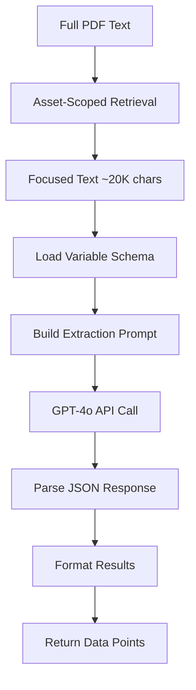

# MineScope CRU - API Reference & Developer Guide

## Overview

This document provides detailed API reference for all modules, functions, and data structures in the MineScope CRU system. It is intended for developers who need to understand, maintain, or extend the codebase.

## Module Architecture

```
mine_scope/
├── app.py                      # Main Streamlit application
├── main.py                     # Entry point (minimal)
├── utils/                      # Utility modules
│   ├── __init__.py
│   ├── pdf_extractor.py       # PDF text extraction
│   ├── ai_detector.py         # Entity detection (company/asset/commodity)
│   ├── rag_extractor.py       # Data extraction with RAG
│   ├── insights_chatbot.py    # Conversational Q&A
│   ├── kpi_calculator.py      # KPI calculations (future)
│   └── semantic_classifier.py # Variable classification (future)
└── reference_data/             # Static reference data
    ├── companies.json
    ├── assets.json
    ├── commodities.json
    └── variable_mapping.json
```

## Core Modules

### 1. pdf_extractor.py

#### Purpose
Extract readable text from PDF files using PyPDF2.

#### Dependencies
```python
import PyPDF2
from io import BytesIO
```

#### Functions

##### extract_text_from_pdf()

```python
def extract_text_from_pdf(pdf_file) -> str:
    """
    Extract text content from a PDF file.

    Args:
        pdf_file: Uploaded PDF file object from Streamlit (UploadedFile)

    Returns:
        str: Extracted text from all pages, joined with double newlines

    Raises:
        Exception: If PDF cannot be read or contains no extractable text

    Example:
        >>> from streamlit.runtime.uploaded_file_manager import UploadedFile
        >>> text = extract_text_from_pdf(uploaded_file)
        >>> print(len(text))
        45239
    """
```

**Implementation Details**:
- Resets file pointer to beginning (critical for Streamlit reuse)
- Reads PDF using `BytesIO` wrapper
- Iterates through all pages with `pdf_reader.pages`
- Handles `None` returns from `extract_text()`
- Validates content is not empty
- Joins pages with `"\n\n"` separator

**Error Handling**:
```python
try:
    # PDF processing
except Exception as e:
    raise Exception(f"Error extracting text from PDF: {str(e)}")
```

**Performance**:
- 10-page PDF: ~1 second
- 50-page PDF: ~3-5 seconds
- 100-page PDF: ~8-10 seconds

**Limitations**:
- Cannot extract text from scanned PDFs (images)
- May struggle with complex layouts or tables
- Unicode characters may be garbled

---

### 2. ai_detector.py

#### Purpose
Use OpenAI GPT-4o to detect companies, assets, and commodities from mining report text.

#### Dependencies
```python
import os
import json
from openai import OpenAI
from dotenv import load_dotenv
```

#### Configuration
```python
load_dotenv(dotenv_path="/home/merit/Madhan/Demo_App/.env")
OPENAI_API_KEY = os.environ.get("OPENAI_API_KEY")
client = OpenAI(api_key=OPENAI_API_KEY)
```

#### Reference Data
```python
# Loaded at module import
REFERENCE_COMPANIES = json.load('reference_data/companies.json')    # List of 50+ companies
REFERENCE_ASSETS = json.load('reference_data/assets.json')          # Dict: company -> [assets]
REFERENCE_COMMODITIES = json.load('reference_data/commodities.json') # List of 9 commodities
```

#### Functions

##### detect_entities_from_text()

```python
def detect_entities_from_text(pdf_text: str) -> dict:
    """
    Use OpenAI to detect companies, assets, and commodities from PDF text.

    Args:
        pdf_text (str): Full text extracted from PDF document

    Returns:
        dict: {
            'companies': List[str],      # Detected company names
            'assets': List[str],         # Detected asset/mine names
            'commodities': List[str]     # Detected commodity types
        }

    Raises:
        Exception: If OpenAI API call fails or returns invalid JSON

    Example:
        >>> text = "Agnico Eagle Mines reports Q3 results for Detour Lake (gold)..."
        >>> result = detect_entities_from_text(text)
        >>> print(result)
        {
            'companies': ['Agnico Eagle Mines Ltd'],
            'assets': ['Detour Lake', 'LaRonde', 'Meliadine', ...],
            'commodities': ['Gold']
        }
    """
```

**Prompt Engineering**:
```python
prompt = f"""You are an expert mining industry analyst. Analyze the following mining report/document and extract:

1. **Company Names**: Identify any mining companies mentioned in the document. Match them against this reference list of known companies:
{', '.join(REFERENCE_COMPANIES[:50])}... (and {len(REFERENCE_COMPANIES)-50} more)

2. **Mining Assets**: Identify any mine names, project names, or mining operations mentioned. Match them against known assets from this reference:
Sample assets: Capricorn Copper, Golden Grove, Hidd, Capri, Detour Lake, LaRonde, Meliadine, etc.

3. **Commodities**: Identify which commodities/minerals are discussed. Match against: {', '.join(REFERENCE_COMMODITIES)}

**Instructions:**
- Only return entities that are explicitly mentioned or clearly implied in the document
- For companies: prioritize exact or close matches from the reference list
- For assets: match against known asset names when possible
- For commodities: use the exact commodity names from the reference list
- Be conservative - only include entities you're confident about

**Document Text:**
{pdf_text[:40000]}

**Respond ONLY with valid JSON in this exact format:**
{{
  "companies": ["Company Name 1", "Company Name 2"],
  "assets": ["Asset Name 1", "Asset Name 2"],
  "commodities": ["Commodity 1", "Commodity 2"]
}}
"""
```

**API Call**:
```python
response = client.chat.completions.create(
    model="gpt-4o",
    messages=[
        {
            "role": "system",
            "content": "You are a mining industry expert specializing in extracting structured data from mining reports. Always respond with valid JSON only."
        },
        {
            "role": "user",
            "content": prompt
        }
    ],
    response_format={"type": "json_object"},
    max_completion_tokens=2048
)
```

**Validation Logic**:
```python
# Parse JSON response
result = json.loads(response.choices[0].message.content)

# Validate companies against reference data
validated_companies = [
    c for c in detected_companies
    if any(ref.lower() in c.lower() or c.lower() in ref.lower()
           for ref in REFERENCE_COMPANIES)
]

# Validate commodities (exact match)
validated_commodities = []
for commodity in detected_commodities:
    for ref_commodity in REFERENCE_COMMODITIES:
        if commodity.lower() == ref_commodity.lower():
            validated_commodities.append(ref_commodity)
            break

# Use reference assets for detected companies (more reliable than AI detection)
final_assets = []
for company in validated_companies:
    for ref_company in REFERENCE_ASSETS.keys():
        if company.lower() in ref_company.lower():
            final_assets.extend(REFERENCE_ASSETS[ref_company])
            break
```

**Return Structure**:
```python
{
    "companies": ["Agnico Eagle Mines Ltd"],          # Top 10 companies
    "assets": ["Kittila", "La India", "Meliadine"],   # All assets from reference
    "commodities": ["Gold", "Silver"]                 # Deduplicated list
}
```

##### get_company_assets()

```python
def get_company_assets(company_name: str) -> list:
    """
    Get known assets for a specific company from reference data.

    Args:
        company_name (str): Name of the company

    Returns:
        List[str]: List of asset names for that company

    Example:
        >>> assets = get_company_assets("Agnico Eagle Mines Ltd")
        >>> print(assets)
        ['Kittila', 'La India', 'Meliadine', 'Pinos Altos (Mexico)', ...]
    """
    return REFERENCE_ASSETS.get(company_name, [])
```

---

### 3. rag_extractor.py

#### Purpose
Extract structured mining data using Retrieval-Augmented Generation (RAG) approach with asset-scoped text retrieval.

#### Dependencies
```python
import json
import os
import re
from openai import OpenAI
from dotenv import load_dotenv
```

#### Configuration
```python
load_dotenv(dotenv_path="/home/merit/Madhan/Demo_App/.env")
client = OpenAI(api_key=os.environ.get("OPENAI_API_KEY"))
```

#### Functions

##### load_variable_mapping()

```python
def load_variable_mapping() -> dict:
    """
    Load the variable mapping from JSON file.

    Returns:
        dict: {
            "Gold": {
                "Supply": ["Open Pit Ore Mined", ...],
                "Costs": ["COSTS - Total Cash Cost", ...],
                "ESG": ["LABOUR (manpower)", ...],
                "GUIDANCE": ["GUIDANCE - Gold Produced", ...]
            },
            "Copper": { ... },
            ...
        }
    """
    with open('reference_data/variable_mapping.json', 'r') as f:
        return json.load(f)
```

##### get_extractable_variables()

```python
def get_extractable_variables(commodity: str) -> dict:
    """
    Get all extractable variables for a given commodity.

    Args:
        commodity (str): Name of the commodity (e.g., 'Gold', 'Copper')

    Returns:
        dict: Variables organized by category
        {
            "Supply": ["Open Pit Ore Mined", "Gold Produced", ...],
            "Costs": ["AISC", "Total Cash Cost", ...],
            ...
        }

    Example:
        >>> vars = get_extractable_variables("Gold")
        >>> print(vars.keys())
        dict_keys(['Supply', 'Costs', 'ESG', 'GUIDANCE'])
    """
```

##### list_all_variables_for_commodity()

```python
def list_all_variables_for_commodity(commodity: str) -> List[Tuple[str, str]]:
    """
    List all extractable data points for a commodity across all categories.

    Args:
        commodity (str): Commodity name

    Returns:
        List[Tuple[str, str]]: List of (category, variable_name) tuples

    Example:
        >>> vars = list_all_variables_for_commodity("Gold")
        >>> print(vars[:3])
        [
            ('Supply', 'Open Pit Ore Mined'),
            ('Supply', 'Underground Ore Mined'),
            ('Supply', 'Milled Grade Gold')
        ]
    """
```

##### extract_asset_specific_text()

```python
def extract_asset_specific_text(
    pdf_text: str,
    asset_name: str,
    window_chars: int = 5000
) -> str:
    """
    Extract asset-specific sections from PDF text using keyword retrieval.

    This is the core RAG retrieval step - it finds and extracts only the sections
    of the PDF that are relevant to the specified asset.

    Args:
        pdf_text (str): Full PDF text
        asset_name (str): Name of the asset to find (e.g., "Detour Lake")
        window_chars (int): Characters to include around each mention (default: 5000)

    Returns:
        str: Focused text containing asset-relevant sections (max 20,000 chars)

    Algorithm:
        1. Find all occurrences of asset_name in pdf_text (case-insensitive)
        2. Extract window_chars/2 before and after each occurrence
        3. Merge overlapping windows
        4. Concatenate with "[...]" separators
        5. Truncate to max_focused_chars (20,000)

    Example:
        >>> full_text = load_pdf_text("quarterly_report.pdf")  # 150,000 chars
        >>> focused = extract_asset_specific_text(full_text, "Cowal", 5000)
        >>> print(len(focused))
        18743  # Much smaller, only Cowal-related sections
    """
```

**Implementation**:
```python
# Find all mentions of asset
pattern = re.compile(re.escape(asset_name), re.IGNORECASE)
matches = list(pattern.finditer(pdf_text))

# Extract windows around each mention
windows = []
for match in matches:
    start = max(0, match.start() - window_chars // 2)
    end = min(len(pdf_text), match.end() + window_chars // 2)
    windows.append((start, end))

# Merge overlapping windows
merged_windows = []
windows.sort()
for start, end in windows:
    if merged_windows and start <= merged_windows[-1][1]:
        merged_windows[-1] = (merged_windows[-1][0], max(end, merged_windows[-1][1]))
    else:
        merged_windows.append((start, end))

# Extract and concatenate
extracted_text = []
for start, end in merged_windows:
    extracted_text.append(pdf_text[start:end])

focused_text = "\n\n[...]\n\n".join(extracted_text)

# Limit size
if len(focused_text) > 20000:
    focused_text = focused_text[:20000]

return focused_text
```

##### extract_single_commodity_data()

```python
def extract_single_commodity_data(
    pdf_text: str,
    asset_name: str,
    commodity: str,
    max_pages: Optional[int] = None
) -> List[dict]:
    """
    Extract all data points for a single commodity from PDF text using RAG.

    This is the main extraction function that combines asset-scoped retrieval
    with GPT-4o to extract structured data.

    Args:
        pdf_text (str): Full text extracted from PDF
        asset_name (str): Name of the mining asset
        commodity (str): Commodity to extract data for (e.g., 'Gold')
        max_pages (Optional[int]): Maximum number of pages to process (for testing)

    Returns:
        List[dict]: List of extracted data points:
        [
            {
                'asset': str,              # "Detour Lake"
                'metal': str,              # "Gold"
                'variable': str,           # "Open Pit Ore Mined"
                'category': str,           # "Supply"
                'extracted_value': str,    # "1,407 kt"
                'confidence_score': float, # 0.95
                'source': str,             # "Production table"
                'source_page': int         # 12
            },
            ...
        ]

    Raises:
        Exception: If API call fails or JSON parsing fails

    Example:
        >>> data = extract_single_commodity_data(pdf_text, "Detour Lake", "Gold")
        >>> print(f"Extracted {len(data)} data points")
        Extracted 23 data points
    """
```

**Extraction Pipeline**:



**Prompt Engineering**:
```python
prompt = f"""Extract mining data from this focused document section for asset "{asset_name}" and commodity "{commodity}".

DOCUMENT TEXT (Asset-Specific Section):
{pdf_text}

VARIABLES TO EXTRACT:
{variable_list_text}

FLEXIBLE MATCHING - Variable names may appear with variations in the document:
- "Open Pit Ore Mined" → may appear as "Open Pit Ore Mined (kt)", "OP Ore Mined", "Open pit ore", etc.
- "AISC" → may be "All-In Sustaining Costs", "AISC ($/oz)", "All in sustaining cost"
- "Gold Produced" → may be "PROD - GOLD", "Gold Production", "Gold (oz)", "Produced Gold"

EXTRACTION INSTRUCTIONS:
1. Scan ALL tables, headers, and data rows in this text
2. Match variables FLEXIBLY - look for semantic equivalents, not exact text matches
3. Extract numerical values with units (e.g., "1,407 kt", "71,219 oz", "$2,314/oz")
4. For each match, use the EXACT variable name from the list above (not the document's variation)
5. Mining quarterly reports typically contain 15-30 data points per asset/commodity - extract ALL you find
6. Confidence scoring: 1.0 = in data table, 0.95 = in summary statement, 0.9 = calculated/inferred
7. Include "source" (brief description) and "source_page" (page number where found)

Return JSON object with "extractions" array. Extract ALL available data - mining reports are data-rich!
"""
```

**API Configuration**:
```python
response = client.chat.completions.create(
    model="gpt-4o",
    messages=[
        {
            "role": "system",
            "content": "You are a mining data extraction specialist. Extract data accurately and conservatively. Always respond with valid JSON."
        },
        {
            "role": "user",
            "content": prompt
        }
    ],
    temperature=0.1,  # Low temperature for consistency
    response_format={"type": "json_object"}
)
```

**Response Parsing**:
```python
# Handle various response formats
result_json = json.loads(response.choices[0].message.content)

if isinstance(result_json, list):
    extractions = result_json
elif 'extractions' in result_json:
    extractions = result_json['extractions']
elif 'data' in result_json:
    extractions = result_json['data']
else:
    # Find any array in response
    for value in result_json.values():
        if isinstance(value, list):
            extractions = value
            break
    else:
        extractions = []

# Format results
formatted_results = []
for item in extractions:
    formatted_results.append({
        'asset': asset_name,
        'metal': commodity,
        'variable': item.get('variable', ''),
        'category': item.get('category', ''),
        'extracted_value': item.get('extracted_value'),
        'confidence_score': float(item.get('confidence_score', 0.5)),
        'source': item.get('source', 'Document'),
        'source_page': item.get('source_page', None)
    })
```

##### extract_multiple_commodities_data()

```python
def extract_multiple_commodities_data(
    pdf_text: str,
    detected_entities: List[dict]
) -> List[dict]:
    """
    Extract data for multiple commodity/asset combinations.

    Args:
        pdf_text (str): Full PDF text
        detected_entities (List[dict]): List of detected entities
            [{'asset': 'COWAL', 'metal': 'Gold'}, ...]

    Returns:
        List[dict]: All extracted data points across all commodities

    Example:
        >>> entities = [
        ...     {'asset': 'Detour Lake', 'metal': 'Gold'},
        ...     {'asset': 'Detour Lake', 'metal': 'Silver'},
        ...     {'asset': 'LaRonde', 'metal': 'Gold'}
        ... ]
        >>> data = extract_multiple_commodities_data(pdf_text, entities)
        >>> print(len(data))
        67  # Sum of all extractions
    """
```

---

### 4. insights_chatbot.py

#### Purpose
Provide conversational Q&A about mining reports using chat history and context.

#### Dependencies
```python
import os
from openai import OpenAI
from dotenv import load_dotenv
```

#### Functions

##### get_chat_response()

```python
def get_chat_response(
    user_question: str,
    pdf_text: str,
    chat_history: List[dict],
    extracted_data: Optional[List[dict]] = None
) -> dict:
    """
    Generate a conversational response to user questions about mining reports.

    Args:
        user_question (str): The user's current question
        pdf_text (str): Full text extracted from uploaded PDFs
        chat_history (List[dict]): List of previous messages
            [
                {'role': 'user', 'content': 'What was gold production?'},
                {'role': 'assistant', 'content': 'Gold production was...'},
                ...
            ]
        extracted_data (Optional[List[dict]]): List of extracted data points
            for additional context

    Returns:
        dict: {
            'answer': str,              # Main conversational response
            'follow_up_prompt': str,    # Suggested next question
            'follow_up_answer': str     # Pre-generated answer for follow-up
        }

    Example:
        >>> response = get_chat_response(
        ...     user_question="What was gold production at Detour Lake?",
        ...     pdf_text=full_text,
        ...     chat_history=[],
        ...     extracted_data=data_points
        ... )
        >>> print(response['answer'])
        "Detour Lake produced 71,219 oz of gold in Q3 2024, up 4% from Q2..."
        >>> print(response['follow_up_prompt'])
        "Would you like me to compare this to other gold assets?"
    """
```

**Context Preparation**:
```python
# Truncate PDF text
context_text = pdf_text[:50000] if len(pdf_text) > 50000 else pdf_text

# Add extracted data context
extracted_context = "\n\nEXTRACTED DATA POINTS:\n"
for item in extracted_data[:50]:
    value = item.get('value') or item.get('extracted_value') or '—'
    extracted_context += f"- {item.get('asset')}: {item.get('variable')} = {value}\n"

# Build conversation context
conversation_context = ""
if chat_history:
    recent_history = chat_history[-10:]  # Last 10 messages
    for msg in recent_history:
        role = "User" if msg['role'] == 'user' else "Assistant"
        conversation_context += f"{role}: {msg['content']}\n\n"
```

**System Prompt**:
```python
system_prompt = """You are an expert mining industry analyst called "Insights Assistant".
You help users understand their mining reports through natural, conversational dialogue.

CONVERSATIONAL BEHAVIOR:
- Treat each message as part of one continuous chat
- Remember what the user has asked earlier in this session
- Refer back to past answers naturally (e.g. "As we saw earlier for Cowal...")
- Keep your tone informal, friendly, and analyst-like—not robotic

RESPONSE FORMAT:
- Keep answers short and structured by default: 1-3 short paragraphs or a few bullet points
- Only expand if the user asks for more detail
- Include specific numbers, percentages, or quotes from the reports
- If information isn't in the document, say so briefly

HANDLING VAGUE QUESTIONS:
- If a question is vague or could mean multiple things:
  - Briefly answer what is most likely meant
  - Then ask ONE short follow-up to clarify (not a long list)

FOLLOW-UP HANDLING:
- When user says "continue", "go on", "drill down on [asset]", treat it as a follow-up
- Avoid repeating content you've already covered

ENDING RESPONSES:
- Where useful, end with one optional next-step suggestion, e.g.:
  - "If you'd like, I can also compare this asset to the group average."
  - "Want a quick summary of cash flow drivers by asset?"

Keep responses under 200 words unless more detail is specifically requested."""
```

**Response Structure**:
```python
{
    "answer": "Your conversational response here (1-3 paragraphs or bullets, under 200 words)",
    "follow_up_prompt": "One natural next-step suggestion",
    "follow_up_answer": "The answer you'd give if they say yes (keep it concise)"
}
```

**API Call**:
```python
response = client.chat.completions.create(
    model="gpt-4o",
    messages=[
        {"role": "system", "content": system_prompt},
        {"role": "user", "content": user_prompt}
    ],
    temperature=0.7,  # Higher for creative responses
    response_format={"type": "json_object"}
)
```

---

## Data Structures

### Session State Schema

```python
st.session_state = {
    # File management
    'uploaded_files': List[UploadedFile],           # Streamlit uploaded file objects

    # Detection state
    'detection_run': bool,                          # Auto-detection completed
    'detected_company': Optional[str],              # "Agnico Eagle Mines Ltd"
    'detected_assets': List[str],                   # ["Detour Lake", "LaRonde"]
    'detected_commodities': List[str],              # ["Gold", "Silver"]
    'ai_processing': bool,                          # AI call in progress

    # User selections
    'selected_assets': List[str],                   # User-selected assets
    'selected_commodities': List[str],              # User-selected commodities
    'custom_assets': List[str],                     # User-added custom assets
    'show_add_asset': bool,                         # Show asset input
    'show_add_commodity': bool,                     # Show commodity input

    # Extraction state
    'extraction_run': bool,                         # Data extraction completed
    'extracted_data': List[dict],                   # Extracted data points
    'pdf_text_content': str,                        # Combined PDF text
    'show_extraction_success': bool,                # Show success message
    'extraction_success_message': str,              # Success message text

    # Review state
    'editing_row': Optional[int],                   # ID of row being edited

    # Chat state
    'chat_history': List[dict],                     # Conversation messages
    'chat_input_key': int,                          # Input widget key counter
    'pending_followup': Optional[dict],             # Pending follow-up question

    # Semantic classification (future)
    'semantic_classification_cache': dict           # Cached classifications
}
```

### Extracted Data Point Schema

```python
{
    'id': int,                                      # Unique row ID
    'asset': str,                                   # "Detour Lake"
    'metal': str,                                   # "Gold"
    'variable': str,                                # "Open Pit Ore Mined"
    'category': str,                                # "Supply"
    'value': Optional[str],                         # "1,407 kt" or None
    'confidence': float,                            # 0.0 to 1.0
    'source': str,                                  # "Production table"
    'source_page': Optional[int],                   # 12 or None
    'status': str,                                  # "flagged"|"accepted"|"rejected"|"missing"
    'edited_value': Optional[str]                   # User-edited value
}
```

### Chat Message Schema

```python
{
    'role': str,                                    # "user" or "assistant"
    'content': str                                  # Message text
}
```

### Pending Follow-Up Schema

```python
{
    'prompt': str,                                  # "Would you like to see..."
    'answer': str                                   # Pre-generated answer
}
```

---

## Reference Data Formats

### companies.json

```json
[
    "29Metals Ltd",
    "Agnico Eagle Mines Ltd",
    "Anglo American PLC",
    "AngloGold Ashanti Ltd",
    ...
]
```
- **Type**: Array of strings
- **Count**: 50+ companies
- **Purpose**: Validate detected companies

### assets.json

```json
{
    "Agnico Eagle Mines Ltd": [
        "Kittila",
        "La India",
        "Meliadine",
        "Pinos Altos (Mexico)",
        ...
    ],
    "29Metals Ltd": [
        "Capricorn Copper",
        "Golden Grove",
        "Hidd",
        "Capri"
    ],
    ...
}
```
- **Type**: Object mapping company names to asset arrays
- **Purpose**: Provide complete asset lists for detected companies

### commodities.json

```json
[
    "Gold",
    "Copper",
    "Nickel",
    "Lead-Zinc",
    "Silver",
    "Cobalt",
    "Platinum",
    "Palladium",
    "Molybdenum"
]
```
- **Type**: Array of strings
- **Count**: 9 commodities
- **Purpose**: Validate detected commodities

### variable_mapping.json

```json
{
    "Gold": {
        "Supply": [
            "Open Pit Ore Mined",
            "Underground Ore Mined",
            "Milled Grade Gold",
            "RECOVERY - GOLD",
            "PROD - GOLD",
            ...
        ],
        "Costs": [
            "COSTS - Total Cash Cost",
            "COSTS - AISC",
            ...
        ],
        "ESG": [
            "LABOUR (manpower)",
            "EMISSIONS - SCOPE 1",
            ...
        ],
        "GUIDANCE": [
            "GUIDANCE - Gold Produced",
            ...
        ]
    },
    "Copper": { ... },
    ...
}
```
- **Type**: Nested object
- **Structure**: `commodity -> category -> [variables]`
- **Purpose**: Define extractable variables for each commodity

---

## Environment Configuration

### Required Environment Variables

```bash
# .env file
OPENAI_API_KEY=sk-proj-...
```

### Streamlit Configuration

```toml
# .streamlit/config.toml
[server]
headless = true
address = "0.0.0.0"
port = 8534
```

---

## Testing

### Unit Test Examples

```python
# test_pdf_extractor.py
import pytest
from utils.pdf_extractor import extract_text_from_pdf

def test_extract_valid_pdf():
    with open('tests/fixtures/sample_report.pdf', 'rb') as f:
        text = extract_text_from_pdf(f)
    assert len(text) > 0
    assert "Agnico Eagle" in text

def test_extract_empty_pdf():
    with pytest.raises(Exception, match="No text content"):
        extract_text_from_pdf('tests/fixtures/empty.pdf')
```

```python
# test_ai_detector.py
from utils.ai_detector import detect_entities_from_text

def test_detect_entities():
    sample_text = """
    Agnico Eagle Mines Ltd reports Q3 2024 results.
    Detour Lake produced 71,219 oz of gold.
    """
    result = detect_entities_from_text(sample_text)

    assert 'companies' in result
    assert 'assets' in result
    assert 'commodities' in result
    assert 'Gold' in result['commodities']
```

### Integration Test Example

```python
# test_full_pipeline.py
def test_end_to_end_extraction():
    # Load test PDF
    pdf_text = extract_text_from_pdf('tests/fixtures/test_report.pdf')

    # Detect entities
    entities = detect_entities_from_text(pdf_text)
    assert len(entities['companies']) > 0

    # Extract data for first asset-commodity pair
    asset = entities['assets'][0]
    commodity = entities['commodities'][0]
    data = extract_single_commodity_data(pdf_text, asset, commodity)

    # Verify structure
    assert len(data) > 0
    assert 'variable' in data[0]
    assert 'extracted_value' in data[0]
    assert 'confidence_score' in data[0]
```

---

## Error Handling Patterns

### Standard Error Pattern

```python
try:
    # Operation
    result = risky_operation()
except SpecificException as e:
    logger.error(f"Operation failed: {e}")
    st.error(f"User-friendly error message")
    st.info("💡 Helpful tip for user")
    # Handle gracefully (return default, retry, etc.)
except Exception as e:
    logger.exception("Unexpected error")
    st.error("Something went wrong. Please try again.")
    # Fail safe
```

### API Error Handling

```python
try:
    response = client.chat.completions.create(...)
except openai.APIError as e:
    st.error(f"OpenAI API error: {e}")
    st.info("Check your API key and account status")
except openai.RateLimitError as e:
    st.error("Rate limit exceeded")
    st.info("Please wait a moment and try again")
except Exception as e:
    st.error(f"Unexpected error: {e}")
```

---

## Performance Optimization Guidelines

### 1. Minimize API Calls
```python
# Bad: Multiple calls for same data
for asset in assets:
    for commodity in commodities:
        response = call_api(asset, commodity)  # N×M calls

# Good: Batch processing where possible
batch_request = prepare_batch(assets, commodities)
response = call_api_batch(batch_request)  # 1 call
```

### 2. Cache Expensive Operations
```python
# Cache semantic classifications
if 'semantic_classification_cache' not in st.session_state:
    st.session_state.semantic_classification_cache = {}

cache_key = f"{variable}_{category}"
if cache_key in st.session_state.semantic_classification_cache:
    return st.session_state.semantic_classification_cache[cache_key]
else:
    result = expensive_classification(variable, category)
    st.session_state.semantic_classification_cache[cache_key] = result
    return result
```

### 3. Asset-Scoped Retrieval
```python
# Reduces context size by 70-80%
focused_text = extract_asset_specific_text(full_text, asset, window_chars=5000)
# Now use focused_text instead of full_text for extraction
```

### 4. Optimize PDF Parsing
```python
# Reset file pointer for reuse
pdf_file.seek(0)

# Process pages lazily if needed
for page_num, page in enumerate(pdf_reader.pages):
    if max_pages and page_num >= max_pages:
        break
    text = page.extract_text()
```

---

## Security Best Practices

### 1. API Key Protection
```python
# Never commit .env files
# Use environment variables
load_dotenv(dotenv_path="/path/to/.env")
api_key = os.environ.get("OPENAI_API_KEY")

# Validate key exists
if not api_key:
    raise ValueError("OPENAI_API_KEY not found in environment")
```

### 2. Input Validation
```python
# Validate file types
if uploaded_file.type != "application/pdf":
    st.error("Only PDF files are supported")
    return

# Validate file size
if uploaded_file.size > 50_000_000:  # 50 MB
    st.error("File too large. Maximum size: 50 MB")
    return
```

### 3. Output Sanitization
```python
# Escape user input in markdown
import html
safe_text = html.escape(user_input)
st.markdown(safe_text)
```

---

## Extension Points

### Adding a New Commodity

1. **Update `reference_data/commodities.json`**:
```json
[
    "Gold",
    "Copper",
    ...,
    "Lithium"  // Add new commodity
]
```

2. **Update `reference_data/variable_mapping.json`**:
```json
{
    ...,
    "Lithium": {
        "Supply": [
            "Lithium Carbonate Produced",
            "Spodumene Ore Mined",
            ...
        ],
        "Costs": [
            "COSTS - Cash Costs",
            ...
        ]
    }
}
```

3. **No code changes needed** - system dynamically loads reference data

### Adding a New Variable

1. **Update `reference_data/variable_mapping.json`**:
```json
{
    "Gold": {
        "Supply": [
            "Open Pit Ore Mined",
            ...,
            "Heap Leach Ore Stacked"  // Add new variable
        ]
    }
}
```

2. **No code changes needed** - variables are loaded dynamically

### Adding a New Utility Module

1. **Create module**:
```python
# utils/new_feature.py
def new_function():
    """New functionality"""
    pass
```

2. **Import in app.py**:
```python
from utils.new_feature import new_function
```

3. **Use in workflow**:
```python
if st.button("New Feature"):
    result = new_function()
    st.write(result)
```

---

## Deployment

### Local Development

```bash
# Install dependencies
pip install -r requirements.txt

# Set environment variables
export OPENAI_API_KEY="sk-proj-..."

# Run application
streamlit run app.py --server.port=8534
```

### Production Deployment (Streamlit Cloud)

1. **Push to GitHub**
2. **Connect Streamlit Cloud**
3. **Add secrets**:
   - Go to App Settings → Secrets
   - Add: `OPENAI_API_KEY = "sk-proj-..."`
4. **Deploy**

### Docker Deployment

```dockerfile
# Dockerfile
FROM python:3.11-slim

WORKDIR /app

COPY requirements.txt .
RUN pip install -r requirements.txt

COPY . .

EXPOSE 8534

CMD ["streamlit", "run", "app.py", "--server.port=8534", "--server.address=0.0.0.0"]
```

```bash
# Build and run
docker build -t minescope-cru .
docker run -p 8534:8534 -e OPENAI_API_KEY="sk-proj-..." minescope-cru
```

---

## Troubleshooting

### Common Development Issues

| Issue | Cause | Solution |
|-------|-------|----------|
| Import errors | Missing dependencies | `pip install -r requirements.txt` |
| OpenAI errors | Invalid API key | Check `.env` file |
| Port in use | Another app on 8534 | Change port or kill process |
| Session state errors | Streamlit caching | Clear cache: `Ctrl+Shift+R` |
| JSON parse errors | Invalid AI response | Add error handling, retry logic |

---

**Document Version**: 1.0
**Last Updated**: December 2025
**Author**: KIAA AI/ML Team
**Status**: Production Ready
