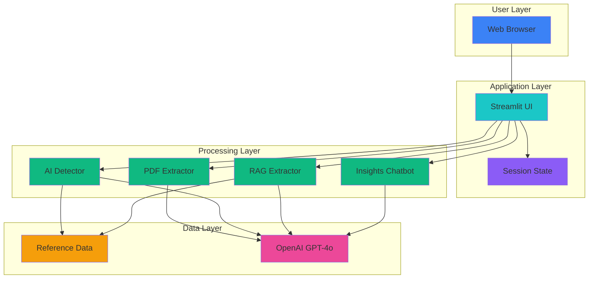
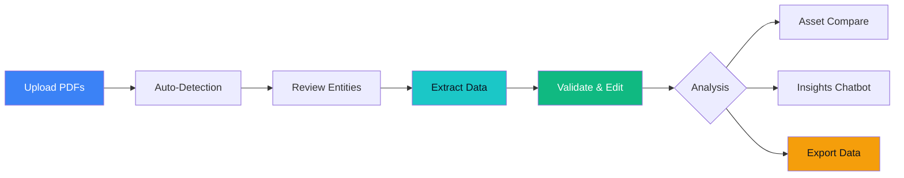

# MineScope CRU - Documentation Index

## Welcome

This documentation provides comprehensive coverage of the **MineScope CRU** AI-powered mining intelligence platform. Whether you're a user, developer, business analyst, or stakeholder, you'll find detailed information to understand, use, and extend this system.

## Documentation Structure

```mermaid
graph TB
    A[Documentation Suite] --> B[Project Overview]
    A --> C[Technical Architecture]
    A --> D[Business Value Analysis]
    A --> E[User Guide]
    A --> F[API Reference]

    B --> B1[Executive Summary]
    B --> B2[Problem Statement]
    B --> B3[Solution Overview]

    C --> C1[System Architecture]
    C --> C2[Component Details]
    C --> C3[Data Flow]

    D --> D1[ROI Analysis]
    D --> D2[Use Cases]
    D --> D3[Success Metrics]

    E --> E1[Getting Started]
    E --> E2[Tab-by-Tab Guide]
    E --> E3[Troubleshooting]

    F --> F1[Module Reference]
    F --> F2[Data Structures]
    F --> F3[Extension Points]

    style A fill:#1BC7C7,stroke:#14B8B8,color:#0B1220
    style B fill:#3B82F6,color:#fff
    style C fill:#10B981,color:#fff
    style D fill:#F59E0B,color:#0B1220
    style E fill:#8B5CF6,color:#fff
    style F fill:#EC4899,color:#fff
```

## Quick Navigation

### For Business Stakeholders
Start here to understand value proposition and ROI:
1. [Project Overview - Executive Summary](./01_PROJECT_OVERVIEW.md#executive-summary)
2. [Business Value Analysis - Key Metrics](./03_BUSINESS_VALUE_ANALYSIS.md#executive-summary)
3. [Business Value Analysis - ROI Analysis](./03_BUSINESS_VALUE_ANALYSIS.md#roi-analysis)

**Key Takeaways**:
- 95% time reduction (5.5 hours → 15 minutes per report)
- $155 cost savings per report
- 2,813% ROI in first year
- 2-week payback period

### For End Users (Analysts)
Learn how to use the platform effectively:
1. [User Guide - Getting Started](./04_USER_GUIDE.md#getting-started)
2. [User Guide - Tab 1: Upload Source](./04_USER_GUIDE.md#tab-1-upload-source)
3. [User Guide - Tab 2: Review Data](./04_USER_GUIDE.md#tab-2-review-data)
4. [User Guide - Troubleshooting](./04_USER_GUIDE.md#troubleshooting)

**Quick Start**:
1. Upload quarterly/annual PDFs
2. Click "Run Auto-Detection"
3. Click "Extract Data"
4. Review and validate in Review Data tab

### For Developers
Understand the technical implementation:
1. [Technical Architecture - System Architecture](./02_TECHNICAL_ARCHITECTURE.md#system-architecture-overview)
2. [Technical Architecture - Data Flow](./02_TECHNICAL_ARCHITECTURE.md#data-flow-architecture)
3. [API Reference - Core Modules](./05_API_REFERENCE.md#core-modules)
4. [API Reference - Extension Points](./05_API_REFERENCE.md#extension-points)

**Tech Stack**:
- Python 3.11+
- Streamlit (web UI)
- OpenAI GPT-4o (AI engine)
- PyPDF2 (PDF parsing)

### For Product Managers
Explore features and use cases:
1. [Project Overview - Solution Overview](./01_PROJECT_OVERVIEW.md#solution-overview)
2. [Business Value Analysis - Use Case Scenarios](./03_BUSINESS_VALUE_ANALYSIS.md#use-case-scenarios)
3. [Project Overview - Future Enhancements](./01_PROJECT_OVERVIEW.md#future-enhancements)

**Core Features**:
- Auto-detection of companies, assets, commodities
- 200+ variable extraction across 9 commodity types
- Interactive review & validation
- Asset comparison matrix
- Conversational insights chatbot

## Document Summaries

### 1. Project Overview
**File**: [01_PROJECT_OVERVIEW.md](./01_PROJECT_OVERVIEW.md)

**Purpose**: High-level introduction to MineScope CRU

**Contents**:
- Executive summary with key value proposition
- Problem statement and business impact
- Solution capabilities and features
- Supported commodities and variables
- User workflow overview
- Success metrics and future roadmap

**Audience**: All stakeholders

**Length**: ~15 pages

**Key Sections**:
- [Executive Summary](./01_PROJECT_OVERVIEW.md#executive-summary)
- [Core Capabilities](./01_PROJECT_OVERVIEW.md#core-capabilities)
- [Supported Commodities & Variables](./01_PROJECT_OVERVIEW.md#supported-commodities--variables)

---

### 2. Technical Architecture
**File**: [02_TECHNICAL_ARCHITECTURE.md](./02_TECHNICAL_ARCHITECTURE.md)

**Purpose**: Detailed technical design and implementation

**Contents**:
- System architecture diagrams (Mermaid)
- Component breakdown (frontend, application, utility, data layers)
- Sequence diagrams for key workflows
- Technology stack details
- Performance optimization strategies
- Security considerations
- Scalability analysis

**Audience**: Developers, technical architects, DevOps

**Length**: ~25 pages

**Key Sections**:
- [System Architecture Overview](./02_TECHNICAL_ARCHITECTURE.md#system-architecture-overview)
- [PDF Processing Pipeline](./02_TECHNICAL_ARCHITECTURE.md#pdf-processing-pipeline)
- [Data Flow Architecture](./02_TECHNICAL_ARCHITECTURE.md#data-flow-architecture)

**Diagrams**:
- Architecture overview
- Component relationships
- Sequence diagrams (auto-detection, extraction)
- Data flow pipeline

---

### 3. Business Value Analysis
**File**: [03_BUSINESS_VALUE_ANALYSIS.md](./03_BUSINESS_VALUE_ANALYSIS.md)

**Purpose**: Quantify business impact and ROI

**Contents**:
- Quantitative benefits (time, cost, accuracy)
- Qualitative benefits (speed, coverage, quality)
- Detailed use case scenarios
- ROI calculation and NPV analysis
- Risk mitigation strategies
- Success metrics and KPIs
- Scaling scenarios
- Strategic recommendations

**Audience**: Business stakeholders, executives, finance

**Length**: ~20 pages

**Key Sections**:
- [Key Business Metrics](./03_BUSINESS_VALUE_ANALYSIS.md#key-business-metrics)
- [ROI Analysis](./03_BUSINESS_VALUE_ANALYSIS.md#roi-analysis)
- [Use Case Scenarios](./03_BUSINESS_VALUE_ANALYSIS.md#use-case-scenarios)

**Key Metrics**:
- 95% time reduction
- $155 cost savings per report
- 2,813% ROI
- 2-week payback period

---

### 4. User Guide
**File**: [04_USER_GUIDE.md](./04_USER_GUIDE.md)

**Purpose**: Complete user manual for end users

**Contents**:
- Getting started and system requirements
- Step-by-step workflows for all 4 tabs
- Detailed UI explanations
- Data validation and editing procedures
- Chatbot usage best practices
- Advanced features
- Troubleshooting guide
- Tips & tricks

**Audience**: Analysts, end users, trainers

**Length**: ~35 pages

**Key Sections**:
- [Getting Started](./04_USER_GUIDE.md#getting-started)
- [Tab 1: Upload Source](./04_USER_GUIDE.md#tab-1-upload-source)
- [Tab 2: Review Data](./04_USER_GUIDE.md#tab-2-review-data)
- [Tab 4: Insights Assistant](./04_USER_GUIDE.md#tab-4-insights-assistant)
- [Troubleshooting](./04_USER_GUIDE.md#troubleshooting)

**Includes**:
- Screenshots and UI layouts (ASCII diagrams)
- Mermaid workflow diagrams
- Tables for quick reference
- Examples and best practices

---

### 5. API Reference & Developer Guide
**File**: [05_API_REFERENCE.md](./05_API_REFERENCE.md)

**Purpose**: Complete developer reference

**Contents**:
- Module architecture
- Function signatures with docstrings
- Data structure schemas
- Reference data formats
- Testing examples
- Error handling patterns
- Performance optimization guidelines
- Security best practices
- Extension points
- Deployment instructions

**Audience**: Developers, maintainers, contributors

**Length**: ~30 pages

**Key Sections**:
- [Core Modules](./05_API_REFERENCE.md#core-modules)
- [Data Structures](./05_API_REFERENCE.md#data-structures)
- [Reference Data Formats](./05_API_REFERENCE.md#reference-data-formats)
- [Extension Points](./05_API_REFERENCE.md#extension-points)

**Includes**:
- Python code examples
- Type annotations
- Test cases
- Configuration examples

---

## Visual Diagrams

### System Architecture

### User Workflow

## Getting Help

### Support Channels

**For Users**:
- Internal KIAA AI/ML team
- User Guide: [Troubleshooting Section](./04_USER_GUIDE.md#troubleshooting)
- Training sessions (contact team)

**For Developers**:
- API Reference: [Core Modules](./05_API_REFERENCE.md#core-modules)
- Technical Architecture: [Component Details](./02_TECHNICAL_ARCHITECTURE.md#component-architecture)
- Code comments in source files

**For Business Stakeholders**:
- Business Value Analysis: [Executive Summary](./03_BUSINESS_VALUE_ANALYSIS.md#executive-summary)
- Project Overview: [Solution Overview](./01_PROJECT_OVERVIEW.md#solution-overview)

### FAQ

**Q: How accurate is the AI extraction?**
A: AI achieves 90%+ accuracy, which improves to 99%+ after human review. See [Business Value - Accuracy Improvement](./03_BUSINESS_VALUE_ANALYSIS.md#2-accuracy-improvement).

**Q: How long does processing take?**
A: 15 minutes on average for a typical report. See [User Guide - Processing Time](./04_USER_GUIDE.md#processing-time).

**Q: Can I add custom variables?**
A: Yes, by updating `variable_mapping.json`. See [API Reference - Adding a New Variable](./05_API_REFERENCE.md#adding-a-new-variable).

**Q: What if my PDF is scanned?**
A: Use OCR software to convert it first. See [User Guide - Scanned PDFs](./04_USER_GUIDE.md#scanned-pdfs).

**Q: How much does it cost per report?**
A: ~$1.08 in OpenAI API costs + ~$7.50 in analyst time = $9.58 total. See [Business Value - Cost Reduction](./03_BUSINESS_VALUE_ANALYSIS.md#4-cost-reduction).

## Quick Reference Tables

### Supported Commodities
| Commodity | Supply Variables | Cost Variables | ESG Variables | Guidance Variables |
|-----------|------------------|----------------|---------------|--------------------|
| Gold | 13 | 4 | 6 | 3 |
| Copper | 17 | 7 | 7 | 2 |
| Nickel | 14 | 7 | 7 | 2 |
| Lead-Zinc | 11 | 7 | 7 | 2 |
| Silver | 2 | - | - | - |
| Cobalt | 2 | - | - | - |
| Platinum | 2 | - | - | - |
| Palladium | 2 | - | - | - |
| Molybdenum | 2 | - | - | - |

### Processing Times
| Operation | Duration | Notes |
|-----------|----------|-------|
| PDF Upload | <5 sec | Depends on file size |
| Auto-Detection | 10-30 sec | 1 API call |
| Data Extraction (10 combos) | 2-3 min | 1 API call per combo |
| Review & Validation | 5-10 min | Human time |
| **Total** | **~15 min** | Average per report |

### Cost Breakdown
| Component | Cost per Report | Annual (200 reports) |
|-----------|----------------|----------------------|
| OpenAI API | $1.08 | $216 |
| Analyst time (0.25h) | $7.50 | $1,500 |
| Infrastructure | $0.50 | $100 |
| **Total** | **$9.08** | **$1,816** |
| **Savings vs Manual** | **$155.92** | **$31,184** |

## Version History

| Version | Date | Author | Changes |
|---------|------|--------|---------|
| 1.0 | Dec 2025 | KIAA AI/ML Team | Initial comprehensive documentation |

## License & Attribution

**Project**: MineScope CRU
**Owner**: KIAA (Knight Institute for Advanced Analytics)
**Technology**: Powered by OpenAI GPT-4o
**Status**: Production Ready Prototype

## Next Steps

### For New Users
1. Read [Getting Started](./04_USER_GUIDE.md#getting-started)
2. Watch training video (if available)
3. Try with a sample report
4. Contact team with questions

### For Developers
1. Review [Technical Architecture](./02_TECHNICAL_ARCHITECTURE.md)
2. Set up local environment (see [API Reference - Deployment](./05_API_REFERENCE.md#deployment))
3. Read [Extension Points](./05_API_REFERENCE.md#extension-points)
4. Contribute improvements

### For Stakeholders
1. Review [Business Value Analysis](./03_BUSINESS_VALUE_ANALYSIS.md)
2. Discuss deployment timeline
3. Plan training sessions
4. Monitor success metrics

---

**Last Updated**: December 2025
**Maintained By**: KIAA AI/ML Team
**Contact**: [Your contact information]

**Thank you for using MineScope CRU!**
