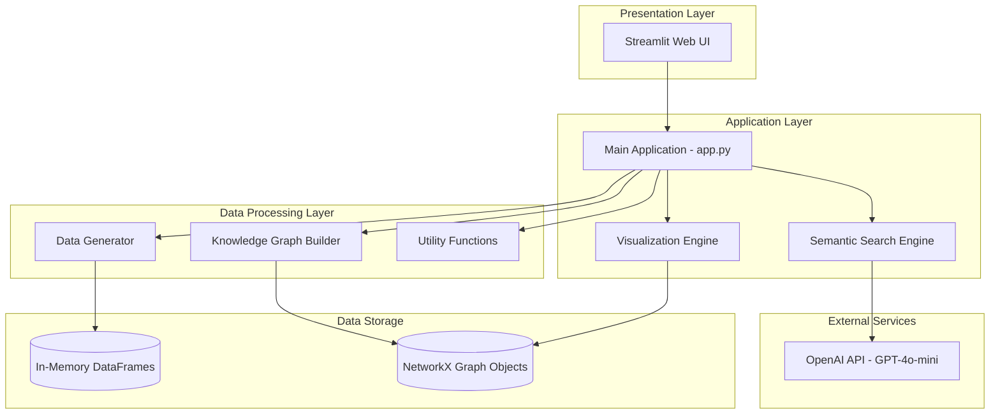
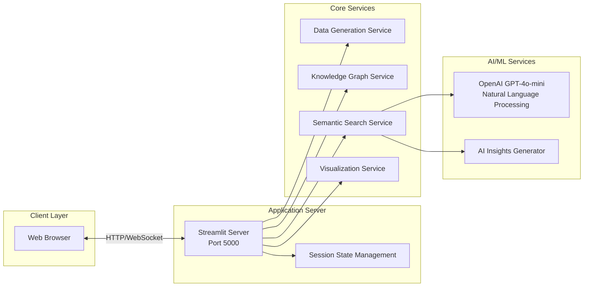
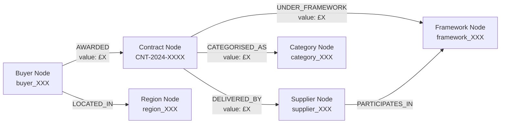
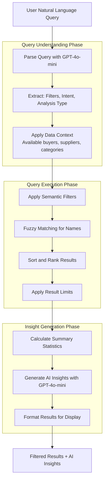
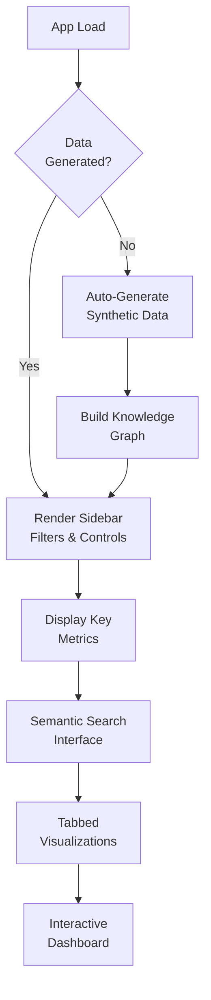
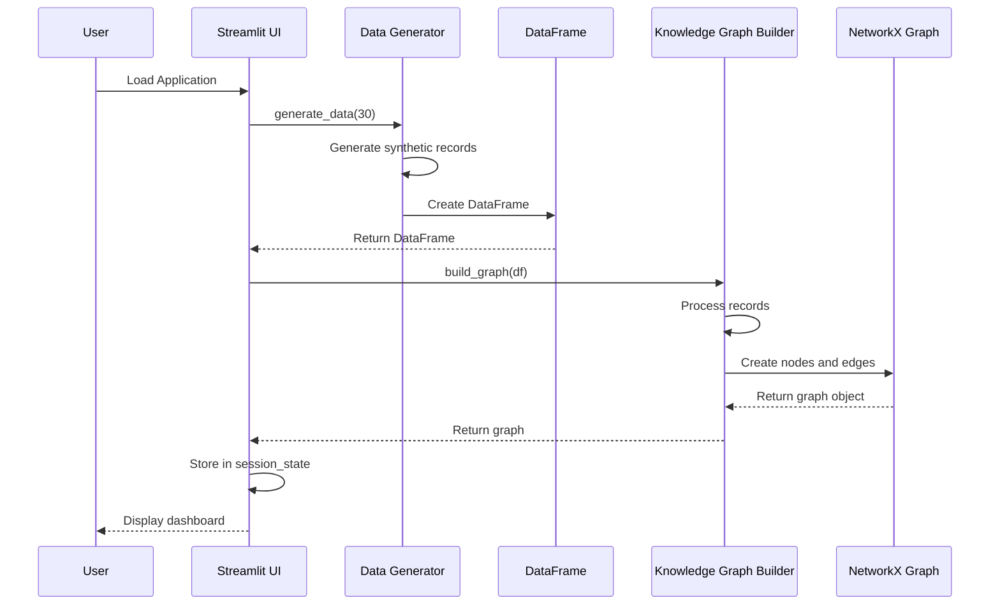
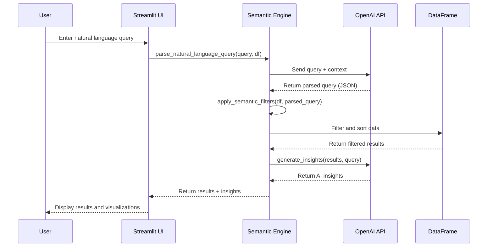
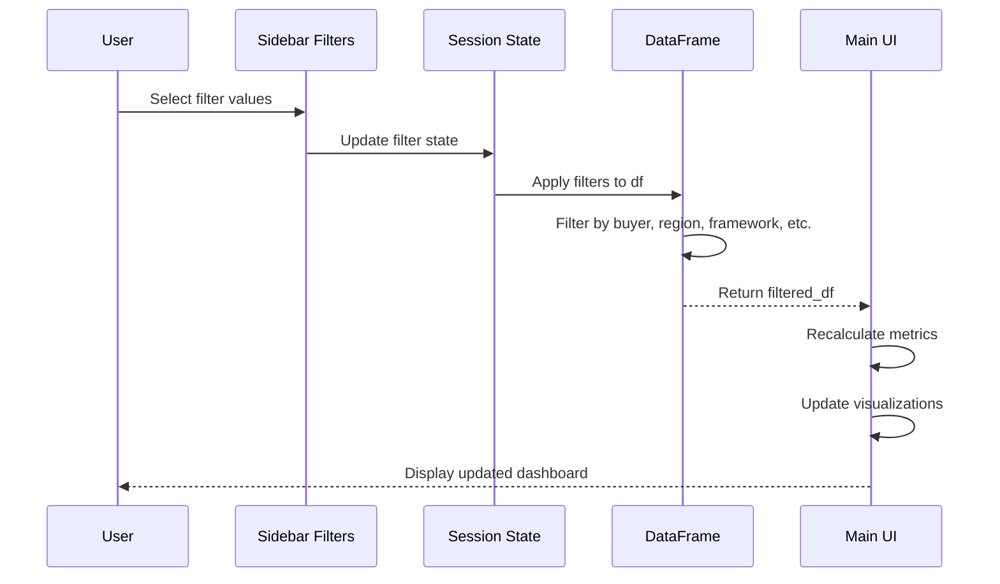

# SpendSmart: Technical Architecture

## Architecture Overview

SpendSmart is built as a modern, cloud-native web application using Python-based technologies. The architecture follows a modular design pattern with clear separation of concerns across data generation, graph processing, semantic search, visualization, and presentation layers.



## System Architecture

### High-Level Components



## Technology Stack

### Frontend Technologies

| Technology | Version | Purpose |
|------------|---------|---------|
| Streamlit | 1.45.1+ | Web application framework and UI |
| Plotly | 6.1.2+ | Interactive data visualization |
| HTML/CSS | - | Custom styling via Streamlit |

### Backend Technologies

| Technology | Version | Purpose |
|------------|---------|---------|
| Python | 3.11+ | Core programming language |
| Pandas | 2.2.3+ | Data manipulation and analysis |
| NetworkX | 3.4.2+ | Graph data structure and algorithms |
| NumPy | 2.2.6+ | Numerical computations |

### AI/ML Technologies

| Technology | Version | Purpose |
|------------|---------|---------|
| OpenAI API | 1.82.0+ | Natural language processing and insights generation |
| GPT-4o-mini | Latest | LLM for semantic search and analysis |

### Development & Deployment

| Technology | Purpose |
|------------|---------|
| UV | Package management and dependency resolution |
| python-dotenv | Environment variable management |
| Replit | Development and hosting platform |
| Git | Version control (optional) |

## Component Architecture

### 1. Data Generator Module (`data_generator.py`)

**Purpose**: Generate realistic synthetic procurement data for demonstration and testing.

**Key Classes**:

```python
class ProcurementDataGenerator:
    """
    Generates synthetic procurement data with realistic relationships.
    """

    Attributes:
        - buyers: List of government buyers (NHS, MoD, Councils, etc.)
        - suppliers: List of realistic suppliers
        - categories: Procurement categories (IT, Cybersecurity, etc.)
        - frameworks: Government frameworks (G-Cloud 13, DOS6, etc.)
        - regions: UK regions
        - cpv_codes: CPV codes mapped to categories

    Key Methods:
        - generate_data(num_records) -> DataFrame
        - generate_contract_title(category, supplier) -> str
        - generate_realistic_value(category, framework) -> float
        - generate_dates() -> Dict[str, datetime]
        - assign_buyer_region(buyer) -> str
```

**Data Model**:

```
Procurement Record Schema:
├── Contract_ID: str (Format: CNT-2024-XXXX)
├── Buyer_Name: str
├── Supplier_Name: str
├── Contract_Title: str
├── Category: str (20 categories)
├── CPV_Code: str (Common Procurement Vocabulary)
├── Framework: str | None (11 frameworks + None)
├── Region: str (12 UK regions)
├── Contract_Value: float (£)
├── Award_Date: datetime
├── Start_Date: datetime
└── End_Date: datetime
```

**Data Generation Algorithm**:

1. Initialize reference data (buyers, suppliers, categories, frameworks)
2. For each record:
   - Randomly select buyer, supplier, category, and framework
   - Generate dependent fields (region from buyer, CPV from category)
   - Calculate realistic contract value based on category and framework
   - Generate chronologically consistent dates (award → start → end)
   - Create contextual contract title
3. Compile into pandas DataFrame with proper data types
4. Validate data integrity

### 2. Knowledge Graph Builder Module (`graph_builder.py`)

**Purpose**: Construct and manage an in-memory knowledge graph representing procurement relationships.

**Key Classes**:

```python
class KnowledgeGraphBuilder:
    """
    Builds knowledge graphs from procurement data using NetworkX.
    """

    Attributes:
        - graph: nx.Graph (NetworkX graph object)

    Key Methods:
        - build_graph(df: DataFrame) -> nx.Graph
        - get_node_attributes(node_type: str) -> Dict
        - get_edge_attributes(relationship: str) -> List[Dict]
        - get_neighbors(node: str, relationship: str) -> List[str]
        - get_path_between_nodes(source, target) -> List[str]
        - get_graph_statistics() -> Dict
        - find_central_nodes(centrality_type: str) -> Dict
        - get_supplier_buyer_relationships() -> List[Dict]
```

**Graph Schema**:



**Node Types and Attributes**:

| Node Type | Prefix | Attributes |
|-----------|--------|------------|
| Buyer | `buyer_` | name, region |
| Supplier | `supplier_` | name |
| Contract | (Contract_ID) | title, value, award_date, start_date, end_date, cpv_code |
| Category | `category_` | name |
| Framework | `framework_` | name |
| Region | `region_` | name |

**Edge Types and Attributes**:

| Relationship | Source | Target | Attributes |
|--------------|--------|--------|------------|
| AWARDED | Buyer | Contract | value |
| DELIVERED_BY | Contract | Supplier | value |
| CATEGORISED_AS | Contract | Category | value |
| UNDER_FRAMEWORK | Contract | Framework | value |
| LOCATED_IN | Buyer | Region | - |
| PARTICIPATES_IN | Supplier | Framework | - |

**Graph Algorithms**:

- **Degree Centrality**: Identify most connected nodes
- **Betweenness Centrality**: Find critical connectors
- **Closeness Centrality**: Measure node proximity
- **Shortest Path**: Find relationships between entities
- **Network Density**: Measure graph connectivity
- **Component Analysis**: Identify isolated subgraphs

### 3. Semantic Search Engine Module (`semantic_search.py`)

**Purpose**: Enable natural language queries using OpenAI's GPT-4o-mini for intelligent search and insights.

**Key Classes**:

```python
class SemanticSearchEngine:
    """
    Semantic search engine for procurement data using OpenAI.
    """

    Attributes:
        - client: OpenAI client
        - model: str ("gpt-4o-mini")

    Key Methods:
        - parse_natural_language_query(query: str, df: DataFrame) -> Dict
        - apply_semantic_filters(df: DataFrame, parsed_query: Dict) -> DataFrame
        - generate_insights(df: DataFrame, query: str, parsed_query: Dict) -> str
        - get_suggested_queries() -> List[str]
```

**Semantic Search Pipeline**:



**Query Parsing Schema**:

```json
{
  "filters": {
    "Buyer_Name": "NHS England",
    "Category": "Cybersecurity",
    "Framework": "G-Cloud 13",
    "Region": "London"
  },
  "analysis_type": "supplier_analysis",
  "sort_by": "Contract_Value",
  "limit": 10,
  "intent": "NHS cybersecurity spending analysis"
}
```

**Analysis Types**:

- `overview`: General analysis and summary
- `supplier_analysis`: Focus on supplier metrics and rankings
- `trend_analysis`: Time-series and temporal patterns
- `comparison`: Comparative analysis across dimensions
- `insights`: Deep-dive insights and recommendations

**AI Insight Generation**:

Uses GPT-4o-mini with structured prompts to generate:
- Spending pattern analysis
- Supplier concentration insights
- Notable findings and anomalies
- Actionable recommendations

**Prompt Engineering**:

```python
System Prompt Structure:
1. Context Setting: "You are a procurement data analyst..."
2. Data Context: Available entities (buyers, suppliers, categories, etc.)
3. Task Definition: Convert query to structured JSON
4. Schema Definition: Expected output format
5. Examples: Few-shot learning examples

Insight Generation Prompt:
1. Original query and intent
2. Summary statistics (contracts, values, top entities)
3. Focus areas (patterns, concentration, findings, recommendations)
4. Output format: 3-4 bullet points, business-focused
```

### 4. Visualization Engine Module (`visualizations.py`)

**Purpose**: Create interactive and informative visualizations using Plotly.

**Key Classes**:

```python
class ProcurementVisualizer:
    """
    Creates interactive visualizations for procurement data analysis.
    """

    Attributes:
        - color_scheme: Dict (node type colors)

    Key Methods:
        - create_network_graph(graph: nx.Graph, df: DataFrame) -> go.Figure
        - create_spend_treemap(df: DataFrame, hierarchy: List[str]) -> go.Figure
        - create_time_series_analysis(df: DataFrame, time_column: str, group_by: str) -> go.Figure
        - create_correlation_heatmap(df: DataFrame) -> go.Figure
        - create_supplier_analysis_dashboard(df: DataFrame) -> go.Figure
```

**Visualization Types**:

1. **Network Graph** (Plotly Scatter + Graph Theory)
   - Spring layout algorithm for node positioning
   - Node sizing based on contract value or degree centrality
   - Color coding by node type
   - Interactive hover information
   - Relationship edge rendering

2. **Bar Charts** (Plotly Bar)
   - Category spend distribution
   - Regional spend analysis
   - Top suppliers ranking
   - Framework utilization

3. **Line Charts** (Plotly Line)
   - Monthly spending trends
   - Category trend analysis
   - Time-series comparisons

4. **Scatter Plots** (Plotly Scatter)
   - Supplier diversity vs. total spend
   - Contract count vs. average value
   - Multi-dimensional analysis

5. **Pie Charts** (Plotly Pie)
   - Category proportions
   - Regional distribution
   - Framework allocation

6. **Dashboard Layouts** (Plotly Subplots)
   - Multi-chart comprehensive views
   - Coordinated visualizations

**Color Scheme**:

```python
color_scheme = {
    'Buyer': '#1f77b4',      # Blue
    'Supplier': '#ff7f0e',   # Orange
    'Contract': '#2ca02c',   # Green
    'Category': '#d62728',   # Red
    'Framework': '#9467bd',  # Purple
    'Region': '#8c564b'      # Brown
}
```

### 5. Utility Module (`utils.py`)

**Purpose**: Provide common utility functions for data formatting, analysis, and validation.

**Key Functions**:

| Function | Purpose | Return Type |
|----------|---------|-------------|
| `format_currency(amount)` | Format currency in K/M notation | str |
| `get_date_range_filter(df, date_column)` | Extract date range from data | Tuple[datetime, datetime] |
| `calculate_contract_duration(start, end)` | Calculate contract duration | int (days) |
| `get_top_entities(df, group_column, value_column, top_n)` | Get top N entities by value | DataFrame |
| `calculate_growth_rate(df, date_column, value_column, period)` | Calculate growth rates | DataFrame |
| `get_framework_efficiency(df)` | Calculate framework metrics | DataFrame |
| `detect_spending_anomalies(df, value_column, threshold)` | Detect statistical anomalies | DataFrame |
| `generate_summary_statistics(df)` | Generate comprehensive stats | Dict |
| `export_graph_data(graph, format_type)` | Export graph to CSV/JSON | str |
| `validate_data_quality(df)` | Validate data quality | Dict |

### 6. Main Application Module (`app.py`)

**Purpose**: Orchestrate all components and provide the Streamlit-based user interface.

**Application Architecture**:

```python
Application Structure:
├── Page Configuration (set_page_config)
├── Session State Initialization
│   ├── data_generated: bool
│   ├── df: DataFrame
│   ├── graph: nx.Graph
│   └── search_query: str
├── Auto Data Generation (on first load)
├── Sidebar Components
│   ├── Data Management
│   ├── Filters (Buyer, Region, Framework, Category, Year)
│   └── Export Controls
└── Main Content Area
    ├── Key Metrics Dashboard
    ├── Semantic Search Interface
    ├── Tab-Based Visualizations
    │   ├── Overview Dashboard
    │   ├── Supplier Analysis
    │   ├── Trend Analysis
    │   ├── Network Graph
    │   └── Data Table
    └── Feature Overview (when no data)
```

**Session State Management**:

Streamlit session state is used for:
- Persistent data storage across interactions
- Filter state preservation
- Search query history
- Graph object caching

**UI Flow**:



## Data Flow Architecture

### Data Generation Flow



### Semantic Search Flow



### Filtering Flow



## API Integration

### OpenAI API Integration

**Configuration**:

```python
client = OpenAI(api_key=os.environ.get("OPENAI_API_KEY"))
model = "gpt-4o-mini"
```

**API Calls**:

1. **Query Parsing**:
```python
response = client.chat.completions.create(
    model="gpt-4o-mini",
    messages=[
        {"role": "system", "content": system_prompt},
        {"role": "user", "content": query}
    ],
    response_format={"type": "json_object"},
    temperature=0.1
)
```

2. **Insight Generation**:
```python
response = client.chat.completions.create(
    model="gpt-4o-mini",
    messages=[
        {"role": "system", "content": system_prompt},
        {"role": "user", "content": "Generate insights..."}
    ],
    temperature=0.3,
    max_tokens=500
)
```

**Error Handling**:
- API failures gracefully degrade to default behavior
- Timeout handling with appropriate user feedback
- Rate limiting considerations

## Performance Optimization

### Caching Strategies

1. **Streamlit Caching**:
```python
@st.cache_data
def load_sample_queries() -> List[Dict[str, str]]:
    # Cached query loading
    pass
```

2. **Session State**:
- DataFrame cached in session state
- Graph object cached to avoid rebuilding
- Filter state preserved across interactions

### Memory Management

- In-memory data storage (no database required)
- Efficient pandas operations
- NetworkX graph optimization for small-medium datasets (< 1000 nodes)

### Rendering Optimization

- Lazy loading of visualizations in tabs
- Progressive rendering of large datasets
- Pagination for data tables
- Plotly figure optimization

## Security Considerations

### API Key Management

```python
# Environment variable approach
load_dotenv()
api_key = os.environ.get("OPENAI_API_KEY")
```

### Data Security

- No persistent data storage (all in-memory)
- Synthetic data only (no real sensitive information)
- Session isolation via Streamlit

### Input Validation

- DataFrame schema validation
- Query input sanitization
- Filter value validation

## Deployment Architecture

### Replit Deployment

```yaml
# .replit configuration
modules: ["python-3.11"]
channel: "stable-24_05"

deployment:
  target: autoscale
  run: ["streamlit", "run", "app.py", "--server.port", "5000"]

ports:
  - localPort: 5000
    externalPort: 80
```

### Streamlit Configuration

```toml
# .streamlit/config.toml
[server]
headless = true
address = "0.0.0.0"
port = 8516

[theme]
base = "light"
```

### Environment Variables

Required:
- `OPENAI_API_KEY`: OpenAI API key for semantic search

Optional:
- Custom configuration overrides

## Scalability Considerations

### Current Limitations

- In-memory storage (limited to available RAM)
- Single-server deployment
- Synchronous processing
- No persistent storage

### Scalability Paths

1. **Data Layer**:
   - Integrate with PostgreSQL or cloud database
   - Implement data partitioning
   - Add caching layer (Redis)

2. **Processing Layer**:
   - Asynchronous query processing
   - Background job queue
   - Distributed graph processing

3. **Deployment**:
   - Container-based deployment (Docker)
   - Kubernetes orchestration
   - Load balancing for multiple instances

## Monitoring and Observability

### Application Metrics

- User session count
- Query response times
- API call volume and latency
- Error rates and types
- Data refresh frequency

### Performance Metrics

- Dashboard load times
- Visualization rendering times
- Search query execution times
- Graph build times

### Logging

```python
# Structured logging approach
import logging

logging.basicConfig(level=logging.INFO)
logger = logging.getLogger(__name__)

logger.info(f"Generated {len(df)} procurement records")
logger.error(f"Search error: {str(e)}")
```

## Technical Debt and Future Enhancements

### Known Limitations

1. No real-time data integration
2. Limited to synthetic data
3. No user authentication/authorization
4. No audit trail or history
5. Limited to English language queries

### Planned Enhancements

1. **Data Integration**:
   - Contracts Finder API integration
   - Real procurement data import
   - Multi-source data federation

2. **Advanced Analytics**:
   - Predictive analytics
   - Anomaly detection algorithms
   - Recommendation engine

3. **Collaboration Features**:
   - Saved queries and dashboards
   - Report sharing
   - Commenting and annotations

4. **Enterprise Features**:
   - Role-based access control
   - Multi-tenancy
   - Audit logging
   - Data governance

## Dependencies and Version Management

### Core Dependencies

```toml
[project]
name = "spendsmart"
version = "0.1.0"
requires-python = ">=3.11"

dependencies = [
    "networkx>=3.4.2",
    "numpy>=2.2.6",
    "openai>=1.82.0",
    "pandas>=2.2.3",
    "plotly>=6.1.2",
    "streamlit>=1.45.1",
    "python-dotenv>=1.0.0"
]
```

### Dependency Graph

```
streamlit (UI Framework)
├── pandas (Data manipulation)
│   └── numpy (Numerical operations)
├── plotly (Visualization)
│   └── numpy
└── networkx (Graph operations)

openai (AI/ML)
└── httpx (HTTP client)

python-dotenv (Configuration)
```

## Conclusion

SpendSmart's technical architecture is designed for:
- **Modularity**: Clear separation of concerns across components
- **Extensibility**: Easy to add new features and integrations
- **Maintainability**: Well-documented, clean code structure
- **Performance**: Optimized for interactive user experience
- **Scalability**: Clear path to production-scale deployment

The architecture leverages modern Python libraries and cloud-native patterns to deliver a sophisticated procurement intelligence platform that can be deployed quickly and scaled as needed.
