# SpendSmart: Functional Architecture

## Functional Overview

SpendSmart provides a comprehensive suite of procurement intelligence capabilities organized into five major functional domains: Data Management, Knowledge Graph Analytics, Semantic Search & AI Insights, Interactive Visualizations, and Reporting & Export.

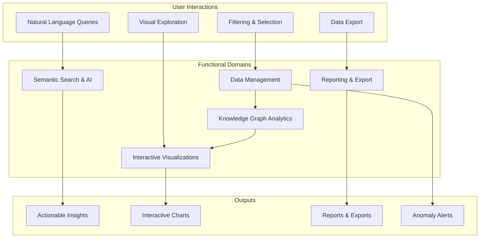

## Core Functional Capabilities

### 1. Data Management Functions

#### 1.1 Synthetic Data Generation

**Purpose**: Create realistic procurement data for demonstration, testing, and training.

**Functional Flow**:

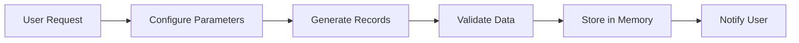

**Inputs**:
- Number of records (20-50, default: 30)
- Optional: Date range, specific buyers/suppliers

**Processing**:
1. Initialize reference data sets (buyers, suppliers, categories, frameworks, regions)
2. Generate random but realistic combinations
3. Calculate dependent fields:
   - Region from buyer location
   - CPV code from category
   - Contract value based on category and framework
   - Chronologically consistent dates
4. Create contextual contract titles
5. Validate data integrity and relationships

**Outputs**:
- Pandas DataFrame with complete procurement records
- Success/error notifications
- Data quality metrics

**Business Rules**:
- Contract values range from £10,000 to £50,000,000 based on category
- Framework contracts receive 15% discount on average
- Start dates are 1-8 weeks after award dates
- Contract durations are 6, 12, 18, 24, 36, or 48 months
- Buyers are assigned to realistic geographic regions
- CPV codes match contract categories

#### 1.2 Data Filtering

**Purpose**: Enable users to focus on specific subsets of procurement data.

**Available Filters**:

| Filter | Type | Options | Multi-Select |
|--------|------|---------|--------------|
| Buyer | Dropdown | All buyers + "All" | No |
| Region | Dropdown | 12 UK regions + "All" | No |
| Framework | Dropdown | 11 frameworks + "All" | No |
| Category | Dropdown | 20 categories + "All" | No |
| Award Year | Dropdown | Available years + "All" | No |

**Filter Behavior**:
- Filters are cumulative (AND logic)
- "All" option removes that filter
- Filters apply to all visualizations and metrics simultaneously
- Real-time updates as filters change

**Functional Flow**:

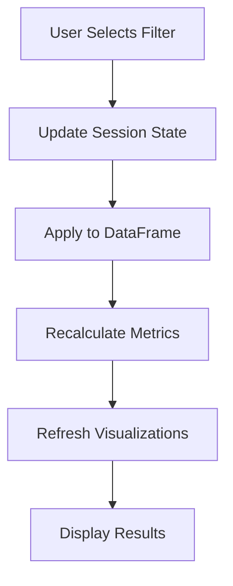

#### 1.3 Data Validation

**Purpose**: Ensure data quality and integrity.

**Validation Checks**:
- No missing required fields
- No duplicate Contract IDs
- No negative contract values
- Start dates after award dates
- End dates after start dates
- No future award dates
- Valid CPV codes for categories
- Consistent region assignments

**Validation Reporting**:
```python
{
    'total_records': 30,
    'missing_values': {'Framework': 3},  # Allowed
    'duplicate_contracts': 0,
    'invalid_dates': 0,
    'negative_values': 0,
    'future_dates': 0,
    'data_completeness': 0.97
}
```

#### 1.4 Data Export

**Purpose**: Enable users to extract data for external analysis.

**Export Formats**:
- CSV (default)
- JSON (for graph data)
- GEXF (for graph network data)

**Export Types**:
1. **Filtered Procurement Data**: Current view of filtered contracts
2. **Graph Edge List**: Network relationships as CSV
3. **Graph JSON**: Complete graph structure
4. **Summary Statistics**: Aggregated metrics

**Functional Flow**:
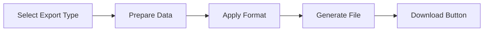

### 2. Knowledge Graph Analytics Functions

#### 2.1 Graph Construction

**Purpose**: Build an in-memory graph representation of procurement relationships.

**Graph Building Process**:

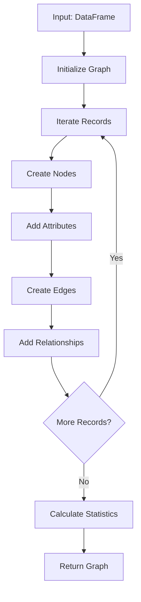

**Node Creation Logic**:

For each procurement record:

1. **Contract Node** (central entity):
   ```python
   {
       'node_id': 'CNT-2024-0001',
       'node_type': 'Contract',
       'title': 'Contract title',
       'value': 1000000.0,
       'award_date': datetime,
       'start_date': datetime,
       'end_date': datetime,
       'cpv_code': '72000000'
   }
   ```

2. **Buyer Node**:
   ```python
   {
       'node_id': 'buyer_NHS England',
       'node_type': 'Buyer',
       'name': 'NHS England',
       'region': 'London'
   }
   ```

3. **Supplier Node**:
   ```python
   {
       'node_id': 'supplier_Accenture UK Ltd',
       'node_type': 'Supplier',
       'name': 'Accenture UK Ltd'
   }
   ```

4. **Category, Framework, Region Nodes** (similar structure)

**Edge Creation Logic**:

Each relationship type with attributes:

```python
# Buyer → Contract
{
    'source': 'buyer_NHS England',
    'target': 'CNT-2024-0001',
    'relationship': 'AWARDED',
    'value': 1000000.0
}

# Contract → Supplier
{
    'source': 'CNT-2024-0001',
    'target': 'supplier_Accenture UK Ltd',
    'relationship': 'DELIVERED_BY',
    'value': 1000000.0
}

# And so on...
```

#### 2.2 Graph Query Functions

**Purpose**: Extract insights from the knowledge graph.

**Query Types**:

1. **Get Nodes by Type**:
   - Input: Node type (Buyer, Supplier, Contract, etc.)
   - Output: Dictionary of nodes with attributes

2. **Get Edges by Relationship**:
   - Input: Relationship type (AWARDED, DELIVERED_BY, etc.)
   - Output: List of edges with attributes

3. **Get Neighbors**:
   - Input: Node ID, optional relationship filter
   - Output: List of connected nodes

4. **Find Path**:
   - Input: Source node, target node
   - Output: Shortest path between nodes

5. **Get Supplier-Buyer Relationships**:
   - Input: None (operates on full graph)
   - Output: List of direct buyer-supplier relationships through contracts

**Example Query Flow**:

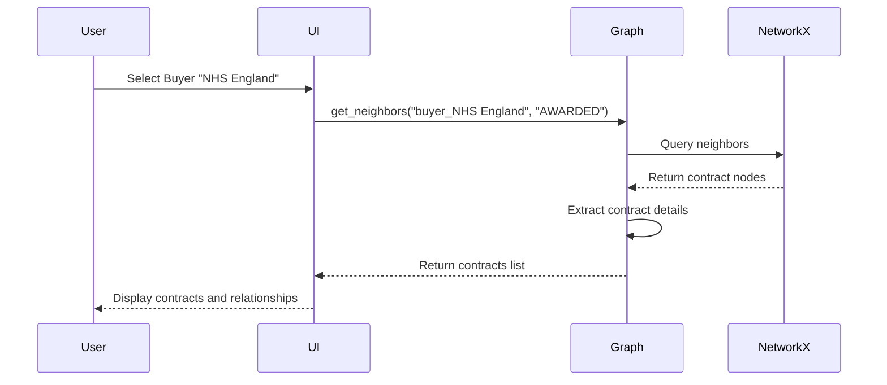

#### 2.3 Centrality Analysis

**Purpose**: Identify the most important entities in the procurement network.

**Centrality Measures**:

1. **Degree Centrality**:
   - Measures: Number of connections
   - Interpretation: Most connected buyers, suppliers, or categories
   - Use case: Identify key players in the network

2. **Betweenness Centrality**:
   - Measures: How often a node appears on shortest paths
   - Interpretation: Critical connectors or brokers
   - Use case: Identify suppliers that bridge multiple buyers

3. **Closeness Centrality**:
   - Measures: Average distance to all other nodes
   - Interpretation: How quickly an entity can reach others
   - Use case: Identify central suppliers or frameworks

4. **Eigenvector Centrality**:
   - Measures: Influence based on connected nodes' importance
   - Interpretation: Connected to other important nodes
   - Use case: Identify influential suppliers or buyers

**Centrality Results Format**:
```python
{
    'supplier_Accenture UK Ltd': 0.342,
    'supplier_Capgemini UK Ltd': 0.289,
    'buyer_NHS England': 0.256,
    ...
}
```

#### 2.4 Graph Statistics

**Purpose**: Provide quantitative measures of the procurement network.

**Calculated Statistics**:

| Statistic | Description | Interpretation |
|-----------|-------------|----------------|
| Num Nodes | Total nodes in graph | Network size |
| Num Edges | Total edges (relationships) | Network connectivity |
| Density | Ratio of actual to possible edges | How interconnected the network is |
| Is Connected | Single component or multiple | Network fragmentation |
| Node Types | Count by type | Entity distribution |
| Relationships | Count by type | Relationship distribution |

**Example Output**:
```python
{
    'num_nodes': 156,
    'num_edges': 289,
    'density': 0.024,
    'is_connected': True,
    'node_types': {
        'Contract': 30,
        'Buyer': 18,
        'Supplier': 27,
        'Category': 20,
        'Framework': 11,
        'Region': 12
    },
    'relationships': {
        'AWARDED': 30,
        'DELIVERED_BY': 30,
        'CATEGORISED_AS': 30,
        'UNDER_FRAMEWORK': 25,
        'LOCATED_IN': 18,
        'PARTICIPATES_IN': 45
    }
}
```

### 3. Semantic Search & AI Insights Functions

#### 3.1 Natural Language Query Parsing

**Purpose**: Convert user queries in plain English into structured database filters.

**Parsing Pipeline**:

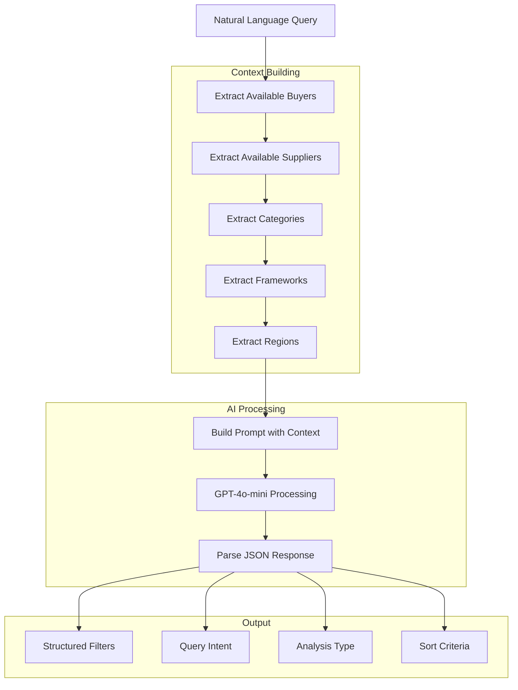

**Query Understanding Examples**:

| User Query | Extracted Filters | Analysis Type | Intent |
|------------|------------------|---------------|--------|
| "Show me NHS cybersecurity contracts" | Buyer: NHS England<br/>Category: Cybersecurity | overview | NHS cybersecurity spending analysis |
| "Top 5 IT suppliers for government" | Category: IT Services | supplier_analysis | Top IT suppliers analysis |
| "Ministry of Defence spending trends" | Buyer: Ministry of Defence | trend_analysis | MoD spending pattern analysis |
| "G-Cloud 13 framework usage" | Framework: G-Cloud 13 | overview | G-Cloud framework utilization |
| "Compare regional spending" | None (all regions) | comparison | Regional spend comparison |

**Supported Query Patterns**:

1. **Entity-based queries**:
   - "Show me [BUYER] contracts"
   - "Find [SUPPLIER] agreements"
   - "[CATEGORY] spending"

2. **Top-N queries**:
   - "Top 5 [ENTITY_TYPE] by [METRIC]"
   - "Highest value [CATEGORY] contracts"
   - "Largest [BUYER] suppliers"

3. **Trend queries**:
   - "[ENTITY] spending trends"
   - "[CATEGORY] over time"
   - "Monthly spend for [BUYER]"

4. **Comparison queries**:
   - "Compare [DIMENSION] spending"
   - "[ENTITY1] vs [ENTITY2]"
   - "Regional breakdown"

5. **Framework queries**:
   - "[FRAMEWORK] usage"
   - "Framework efficiency"
   - "Framework adoption by [BUYER]"

#### 3.2 Semantic Filtering

**Purpose**: Apply parsed query filters to the dataset with intelligent matching.

**Filtering Logic**:

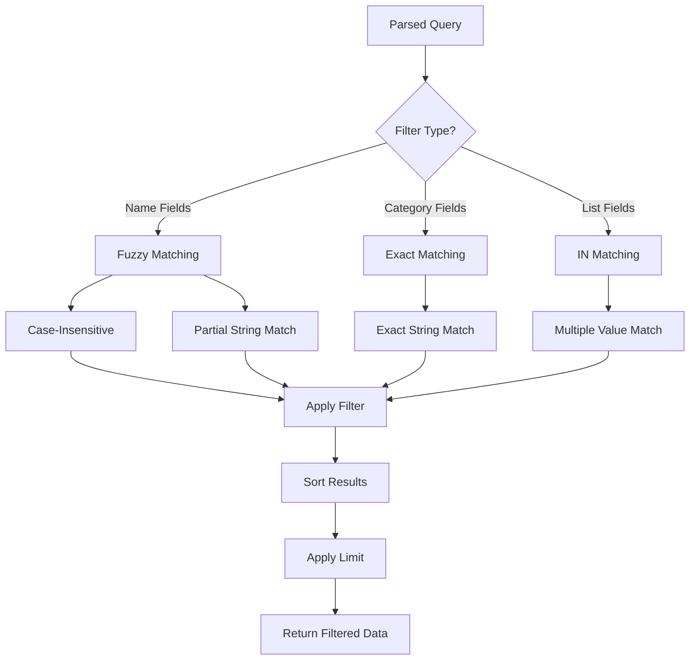

**Fuzzy Matching Example**:
- Query: "NHS contracts"
- Matches: "NHS England", "NHS Scotland", "NHS Wales"
- Uses: `str.contains()` with case-insensitive flag

**Exact Matching Example**:
- Query: Category = "IT Services"
- Matches: Only "IT Services" (not "IT", not "Professional Services")

#### 3.3 AI Insight Generation

**Purpose**: Automatically generate business insights from query results.

**Insight Generation Process**:

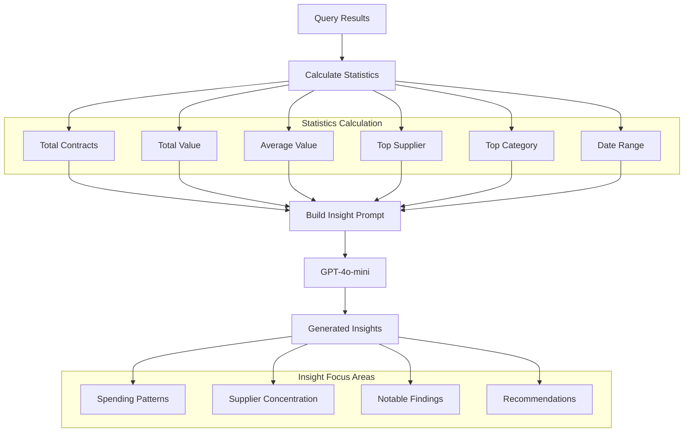

**Insight Template**:

The AI generates insights in this format:
- 3-4 bullet points
- Business-focused language
- Actionable recommendations
- Quantitative support

**Example Generated Insights**:

Query: "Show me NHS cybersecurity contracts"

Generated Insights:
```
• NHS England has invested £4.2M in cybersecurity across 8 contracts, with an
  average value of £525K per contract, indicating a strategic focus on security.

• Supplier concentration is moderate with the top supplier (Accenture UK Ltd)
  accounting for 35% of total cybersecurity spend, suggesting balanced risk
  distribution.

• Cybersecurity spending shows a 23% increase over the past 12 months, aligned
  with national digital security initiatives and increased threat landscape.

• Recommendation: Consider consolidating to 3-4 strategic cybersecurity partners
  to leverage volume discounts while maintaining supplier diversity for resilience.
```

#### 3.4 Suggested Queries

**Purpose**: Help users discover platform capabilities through example queries.

**Query Categories**:

1. **Entity-focused**:
   - "Show me NHS cybersecurity contracts"
   - "Ministry of Defence spending trends"

2. **Ranking**:
   - "Top 5 IT suppliers for government departments"
   - "Highest value contracts in 2024"

3. **Framework analysis**:
   - "G-Cloud 13 framework usage"
   - "Framework efficiency analysis"

4. **Comparative**:
   - "Compare regional spending"
   - "Small vs large contract values"

5. **Supplier analysis**:
   - "Professional services suppliers"
   - "London region procurement patterns"

### 4. Interactive Visualization Functions

#### 4.1 Overview Dashboard

**Purpose**: Provide comprehensive at-a-glance metrics and visualizations.

**Components**:

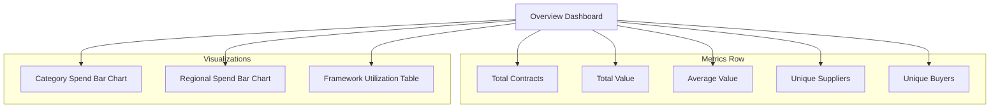

**Metrics Calculations**:

1. **Total Contracts**: `len(filtered_df)`
2. **Total Value**: `sum(Contract_Value)` formatted as £X.XM
3. **Average Value**: `mean(Contract_Value)` formatted as £XXK
4. **Unique Suppliers**: `nunique(Supplier_Name)`
5. **Unique Buyers**: `nunique(Buyer_Name)`

**Visualization Details**:

1. **Category Spend Distribution**:
   - Type: Horizontal bar chart
   - X-axis: Contract Value (£)
   - Y-axis: Category
   - Sorting: Ascending by value
   - Interactivity: Hover for exact values

2. **Regional Spend**:
   - Type: Horizontal bar chart
   - X-axis: Contract Value (£)
   - Y-axis: Region
   - Sorting: Ascending by value
   - Interactivity: Hover for details

3. **Framework Utilization**:
   - Type: Data table
   - Columns: Framework, Total Value, Contract Count, Unique Suppliers
   - Sorting: Descending by Total Value
   - Aggregation: Group by framework

#### 4.2 Supplier Analysis

**Purpose**: Deep-dive into supplier performance and relationships.

**Components**:

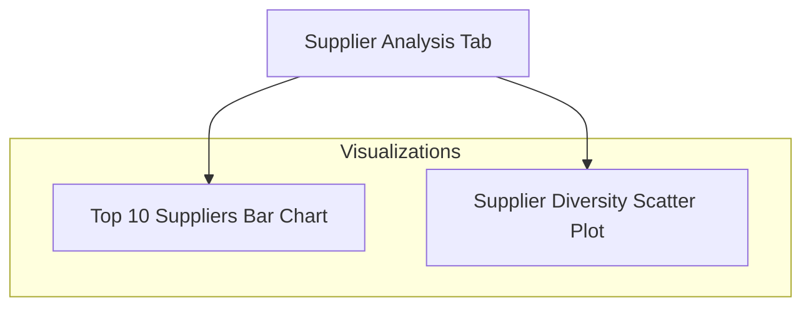

**Supplier Ranking**:
- Aggregation: Sum contract values by supplier
- Sorting: Descending by total value
- Limit: Top 10
- Display: Horizontal bar chart

**Supplier Diversity Analysis**:
- X-axis: Number of unique suppliers per buyer
- Y-axis: Total spend per buyer
- Points: Individual buyers
- Hover: Buyer name and metrics
- Insight: Correlation between supplier diversity and spending

**Key Metrics**:
- Total supplier spend
- Contract count per supplier
- Average contract size
- Buyer concentration per supplier

#### 4.3 Trend Analysis

**Purpose**: Visualize spending patterns over time.

**Time-Series Components**:

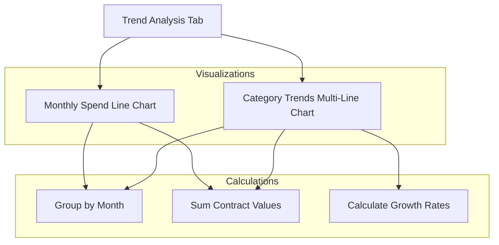

**Monthly Spend Trend**:
- Aggregation: Sum contracts by month-year period
- Visualization: Line chart
- X-axis: Month-Year
- Y-axis: Contract Value (£)
- Interactivity: Hover for exact monthly values

**Category Trends**:
- Aggregation: Sum by month and category
- Visualization: Multi-line chart (one line per category)
- Color coding: Different color per category
- Legend: Category names
- Interactivity: Click legend to show/hide categories

**Trend Calculations**:
```python
# Month-over-month growth
growth_rate = (current_month - previous_month) / previous_month * 100

# Moving average (optional)
rolling_avg = df.rolling(window=3).mean()
```

#### 4.4 Network Graph Visualization

**Purpose**: Visualize procurement relationships as an interactive network.

**Network Layout**:

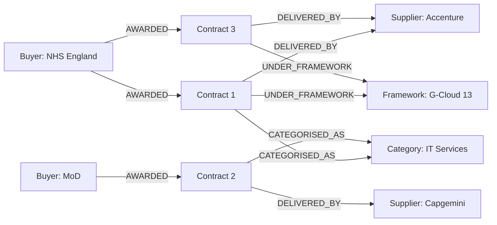

**Visualization Features**:

1. **Node Representation**:
   - Size: Based on contract value or degree centrality
   - Color: By node type (using color scheme)
   - Label: Entity name (truncated if long)
   - Position: Spring layout algorithm

2. **Edge Representation**:
   - Width: Proportional to contract value
   - Color: Light gray (#888)
   - Style: Solid lines

3. **Interactivity**:
   - Hover: Display node/edge details
   - Click legend: Show/hide node types
   - Zoom: Mouse wheel
   - Pan: Click and drag

4. **Layout Algorithm**:
   - Spring layout (force-directed)
   - K-parameter: 3 (spacing)
   - Iterations: 50

**Focused View**:
- When buyer selected: Show only that buyer's network
- Metrics: Contracts, spend, suppliers, categories
- Insights: Top suppliers and categories for selected buyer

#### 4.5 Data Table View

**Purpose**: Provide detailed, searchable, paginated data access.

**Table Features**:

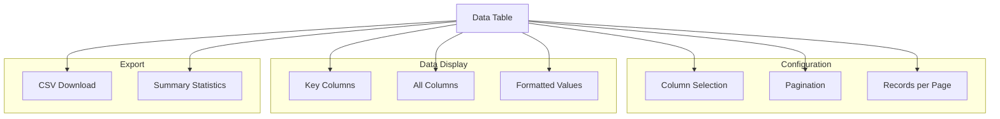

**Key Columns** (default view):
- Buyer_Name
- Supplier_Name
- Contract_Title
- Category
- Contract_Value (formatted)
- Framework
- Region
- Award_Date (formatted)

**All Columns** (when selected):
- All key columns plus:
- Contract_ID
- CPV_Code
- Start_Date
- End_Date

**Pagination**:
- Options: 10, 25, 50, 100 records per page
- Navigation: Page number input
- Display: "Page X of Y"

**Data Formatting**:
- Currency: £X.XM or £XXK format
- Dates: YYYY-MM-DD format
- Large numbers: Comma-separated

**Summary Statistics**:
- Numerical column statistics (mean, median, std, min, max)
- Displayed below table
- Updates based on filtered data

### 5. Reporting & Export Functions

#### 5.1 CSV Export

**Purpose**: Export filtered procurement data for external analysis.

**Export Process**:

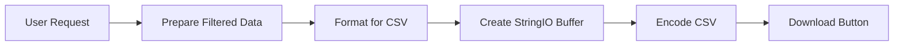

**Export Contents**:
- All rows from current filtered view
- All columns (not just displayed columns)
- Original data types (before formatting)
- Header row with column names

**Filename Format**:
```
procurement_data_YYYYMMDD_HHMMSS.csv
```

Example: `procurement_data_20241220_143052.csv`

#### 5.2 Graph Export

**Purpose**: Export knowledge graph structure for network analysis tools.

**Export Formats**:

1. **Edge List CSV**:
   ```csv
   source,target,relationship,value
   buyer_NHS England,CNT-2024-0001,AWARDED,1000000
   CNT-2024-0001,supplier_Accenture,DELIVERED_BY,1000000
   ```

2. **Node-Link JSON**:
   ```json
   {
     "nodes": [
       {"id": "buyer_NHS England", "type": "Buyer", "name": "NHS England"},
       {"id": "CNT-2024-0001", "type": "Contract", "value": 1000000}
     ],
     "links": [
       {"source": "buyer_NHS England", "target": "CNT-2024-0001", "relationship": "AWARDED"}
     ]
   }
   ```

3. **GEXF** (Graph Exchange XML Format):
   - Compatible with Gephi, Cytoscape
   - Includes all node and edge attributes
   - Preserves graph structure

#### 5.3 Insight Reports

**Purpose**: Generate formatted reports of AI insights and analysis.

**Report Structure**:
1. Executive Summary
2. Query Intent
3. Key Metrics
4. AI-Generated Insights
5. Top Results (5-10 records)
6. Visualizations (as images or interactive)

**Report Formats**:
- Markdown (current)
- PDF (future enhancement)
- PowerPoint (future enhancement)

### 6. Cross-Cutting Functions

#### 6.1 Session State Management

**Purpose**: Maintain application state across user interactions.

**Managed State Variables**:

```python
session_state = {
    'data_generated': bool,      # Data initialization status
    'df': DataFrame,              # Main procurement data
    'graph': nx.Graph,            # Knowledge graph object
    'search_query': str,          # Current search query
    'filters': Dict,              # Active filter values
    'selected_tab': str           # Current active tab
}
```

**State Lifecycle**:
1. Initialize on first page load
2. Persist across reruns (Streamlit feature)
3. Update on user interactions
4. Clear on explicit user request (optional)

#### 6.2 Real-Time Filtering

**Purpose**: Instantly update all visualizations when filters change.

**Update Cascade**:

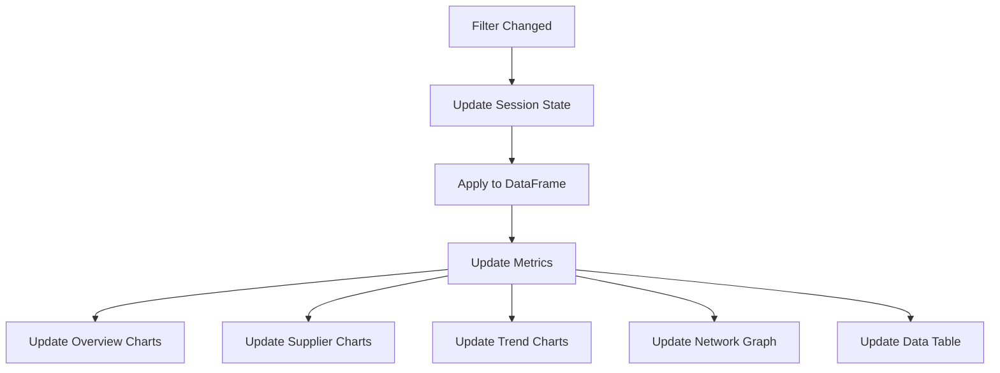

**Performance Optimization**:
- Lazy evaluation in tabs (only active tab renders)
- Caching of expensive calculations
- Incremental updates where possible

#### 6.3 Error Handling

**Purpose**: Gracefully handle errors and provide user feedback.

**Error Categories**:

1. **Data Errors**:
   - Empty filtered dataset: Warning message with suggestion
   - Invalid data format: Error message with recovery option

2. **API Errors**:
   - OpenAI timeout: Fallback to default behavior with notification
   - Rate limiting: Queue request with user notification
   - Authentication: Clear error message

3. **Visualization Errors**:
   - Empty graph: Placeholder message
   - Large dataset: Warning and pagination

**Error Handling Pattern**:
```python
try:
    # Operation
    result = risky_operation()
except SpecificError as e:
    st.error(f"User-friendly message: {str(e)}")
    st.info("Suggested action for recovery")
    # Fallback behavior
```

#### 6.4 Performance Monitoring

**Purpose**: Track and optimize application performance.

**Monitored Metrics**:
- Page load time
- Filter update latency
- Search query execution time
- Graph rendering time
- API call duration

**Optimization Strategies**:
- Caching with `@st.cache_data`
- Lazy loading of visualizations
- Pagination for large datasets
- Asynchronous API calls (future)

## Functional Integration Flows

### Complete User Journey: Semantic Search

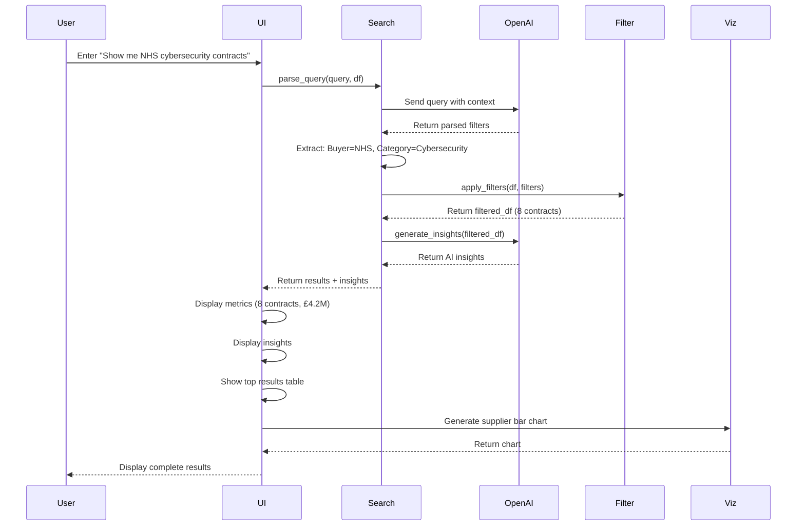

### Complete User Journey: Filter-Based Exploration

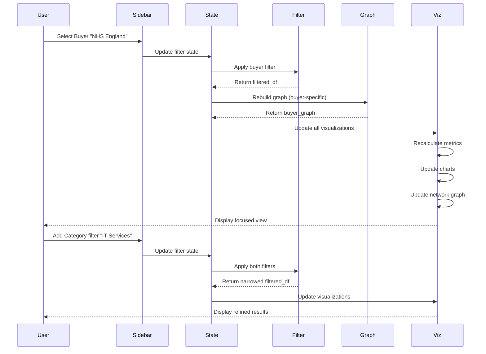

## Functional Requirements Summary

### Must-Have (MVP)

- [x] Synthetic data generation (20-50 records)
- [x] In-memory knowledge graph construction
- [x] Basic filtering (buyer, region, category, framework, year)
- [x] Key metrics dashboard
- [x] Semantic search with OpenAI
- [x] AI insight generation
- [x] Interactive network graph visualization
- [x] Category and regional spend charts
- [x] Supplier analysis
- [x] Trend analysis
- [x] Data table with pagination
- [x] CSV export
- [x] Session state management

### Should-Have (Enhancement)

- [ ] Real procurement data integration (Contracts Finder API)
- [ ] Advanced graph algorithms (community detection, path analysis)
- [ ] Custom date range filtering
- [ ] Anomaly detection with alerts
- [ ] Saved queries and dashboards
- [ ] Multi-format export (PDF, PowerPoint)
- [ ] Framework efficiency scoring
- [ ] Predictive analytics

### Could-Have (Future)

- [ ] User authentication and authorization
- [ ] Multi-user collaboration
- [ ] Real-time data updates
- [ ] Advanced NLP (multi-turn conversations)
- [ ] Recommendation engine
- [ ] Procurement risk scoring
- [ ] Supplier benchmarking
- [ ] Automated reporting

## Conclusion

SpendSmart's functional architecture provides a comprehensive, intuitive, and powerful set of capabilities for procurement intelligence. The modular design ensures that each functional domain operates independently while integrating seamlessly to deliver a cohesive user experience. The combination of knowledge graph analytics, AI-powered semantic search, and interactive visualizations creates a platform that democratizes procurement insights and enables data-driven decision-making across all user personas.
