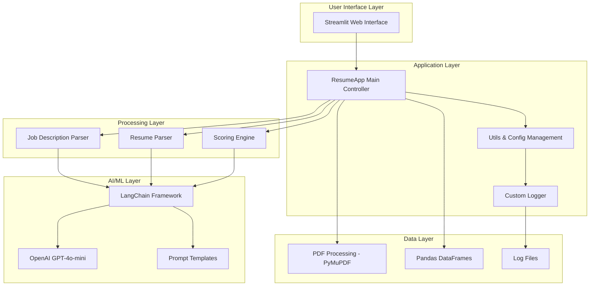
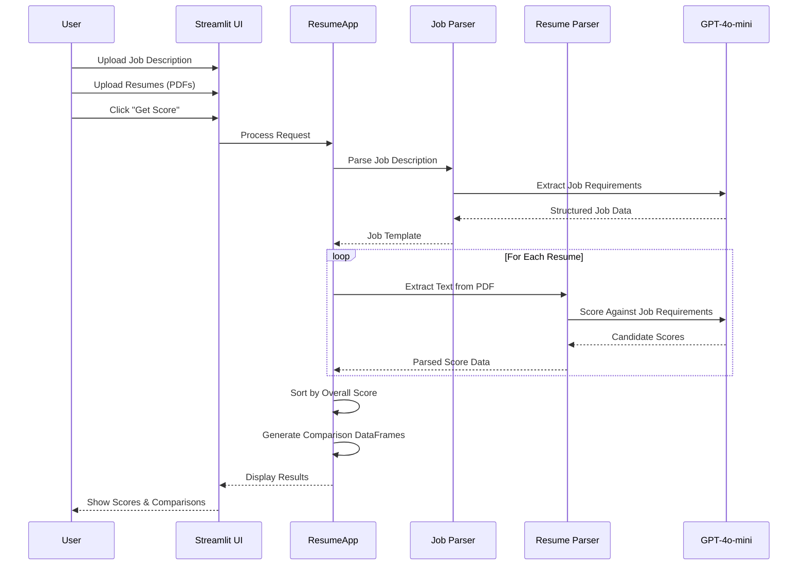

# TalentPulse - Overview & Introduction

## Executive Summary

TalentPulse is an AI-powered resume screening and candidate evaluation system that automates the recruitment process by intelligently matching candidate resumes against job descriptions. The system leverages advanced language models to extract key information from job postings, analyze candidate resumes, and provide comprehensive scoring and comparison metrics.

## Problem Statement

Traditional resume screening processes face several challenges:

- **Time-Consuming Manual Review**: HR teams spend countless hours manually reviewing resumes
- **Inconsistent Evaluation**: Different reviewers may evaluate candidates differently
- **Lack of Objectivity**: Human bias can influence hiring decisions
- **Difficulty in Comparison**: Comparing multiple candidates across various skills is challenging
- **Scalability Issues**: Processing large volumes of applications is resource-intensive

## Solution Overview

TalentPulse addresses these challenges by providing:

1. **Automated Resume Parsing**: Extracts candidate information from PDF resumes
2. **Intelligent Job Analysis**: Parses and categorizes job requirements into structured data
3. **AI-Powered Scoring**: Evaluates candidates against specific job criteria with detailed justifications
4. **Comparative Analytics**: Enables side-by-side comparison of multiple candidates
5. **Transparent Evaluation**: Provides detailed justifications for each score

## Key Features

### 1. Job Description Processing
- Automatically extracts job title, description, and requirements
- Categorizes skills into Programming, AI/ML, and Other Skills
- Identifies required education and experience levels

### 2. Resume Analysis
- Supports PDF format resume uploads
- Extracts candidate information including name, skills, and experience
- Processes multiple resumes simultaneously

### 3. Intelligent Scoring System
- **Experience Evaluation**: Compares candidate experience against requirements
- **Education Matching**: Assesses educational qualifications
- **Role Relevance**: Evaluates job role alignment
- **Skill Assessment**: Detailed scoring for:
  - Programming Skills
  - AI/ML Skills
  - Other Required Skills
- **Overall Score**: Weighted average score (0-1 scale)

### 4. Comprehensive Reporting
- **Candidate Scores Dashboard**: Overview of all candidates with overall scores
- **Candidate Comparison View**: Side-by-side skill comparison
- **Individual Score Cards**: Detailed breakdowns with justifications

### 5. User-Friendly Interface
- Built with Streamlit for intuitive web-based access
- Drag-and-drop file upload
- Interactive data visualizations
- Expandable sections for detailed views

## Technology Stack

### Core Technologies
- **Python 3.x**: Primary programming language
- **Streamlit**: Web application framework
- **LangChain**: LLM orchestration and chaining
- **OpenAI GPT-4o-mini**: Language model for analysis

### Key Libraries
- **PyMuPDF (fitz)**: PDF text extraction
- **Pandas**: Data manipulation and analysis
- **Pydantic**: Data validation and schema definition
- **python-dotenv**: Environment variable management

### Integration & Monitoring
- **LangSmith**: LLM tracing and monitoring
- **Custom Logging**: Error tracking and audit trails

## System Architecture Overview



## Target Users

1. **HR Professionals**: Streamline resume screening and candidate evaluation
2. **Recruitment Agencies**: Process high volumes of applications efficiently
3. **Hiring Managers**: Make data-driven hiring decisions
4. **Talent Acquisition Teams**: Maintain consistency in candidate evaluation

## Use Cases

### Primary Use Case: High-Volume Recruitment
When an organization receives hundreds of applications for a single position, TalentPulse can:
- Process all resumes in minutes
- Rank candidates objectively
- Identify top performers
- Provide detailed justifications for decisions

### Secondary Use Cases
1. **Internal Mobility**: Assess internal candidates for role changes
2. **Skill Gap Analysis**: Identify common skill gaps in applicant pool
3. **Recruitment Analytics**: Generate insights on candidate quality over time
4. **Bias Reduction**: Ensure consistent evaluation criteria across all candidates

## Project Structure

```
talend_pulse/
├── app.py                  # Main application entry point
├── prompts.py             # LLM prompt templates
├── templates.py           # Pydantic data models
├── utils.py               # Utility functions and logging
├── config.ini             # Configuration settings
├── requirements.txt       # Python dependencies
├── samples/               # Sample data for testing
│   ├── job_description/   # Sample job descriptions
│   └── resume/            # Sample resumes (PDFs)
└── documentation/         # Project documentation
    ├── 01_OVERVIEW.md
    ├── 02_TECHNICAL_ARCHITECTURE.md
    ├── 03_USER_GUIDE.md
    ├── 04_BUSINESS_VALUE.md
    └── 05_DEPLOYMENT_GUIDE.md
```

## Core Workflow



## Key Benefits

### Efficiency Gains
- **90% Time Reduction**: Automated screening vs. manual review
- **Instant Processing**: Multiple resumes processed simultaneously
- **Scalability**: Handle 100s of applications without additional resources

### Quality Improvements
- **Consistent Evaluation**: Same criteria applied to all candidates
- **Detailed Insights**: Justifications for every score
- **Objective Ranking**: Data-driven candidate prioritization

### Strategic Value
- **Better Hiring Decisions**: Comprehensive candidate insights
- **Reduced Bias**: Structured evaluation reduces subjective bias
- **Audit Trail**: Complete logging for compliance
- **Data-Driven Insights**: Analytics on recruitment patterns

## Success Metrics

The system can be evaluated based on:

1. **Processing Speed**: Time to evaluate N resumes
2. **Score Accuracy**: Correlation with eventual hire performance
3. **User Adoption**: HR team usage rates
4. **Time Savings**: Hours saved per hiring cycle
5. **Quality of Hire**: Performance of selected candidates

## Future Enhancement Opportunities

1. **Multi-Language Support**: Process resumes in various languages
2. **Video Interview Analysis**: Extend to video screening
3. **Integration with ATS**: Connect to existing recruitment systems
4. **Custom Scoring Models**: Industry-specific evaluation criteria
5. **Predictive Analytics**: Predict candidate success likelihood
6. **Batch Processing API**: REST API for enterprise integration

## Compliance & Privacy

- Resume data is processed in-memory
- No permanent storage of candidate information (unless configured)
- Configurable data retention policies
- GDPR-ready architecture (with proper implementation)
- Audit logging for compliance

## Getting Started

To begin using TalentPulse:

1. Review the [Technical Architecture](./02_TECHNICAL_ARCHITECTURE.md) document
2. Follow the [Deployment Guide](./05_DEPLOYMENT_GUIDE.md) for setup
3. Consult the [User Guide](./03_USER_GUIDE.md) for operation instructions
4. Understand the [Business Value](./04_BUSINESS_VALUE.md) for stakeholder communication

## Support & Maintenance

- Error logs stored in `./logs/` directory
- LangSmith integration for LLM monitoring
- Custom error handling with detailed traceability
- Configurable parameters via `config.ini`

## Conclusion

TalentPulse represents a modern approach to recruitment screening, leveraging AI to make the hiring process more efficient, objective, and scalable. By automating the initial screening phase, organizations can focus their human resources on high-value interactions with top candidates while ensuring consistent and fair evaluation across all applicants.
