# TalentPulse - Technical Architecture

## Table of Contents
1. [Architecture Overview](#architecture-overview)
2. [Component Architecture](#component-architecture)
3. [Data Flow Architecture](#data-flow-architecture)
4. [Class Diagrams](#class-diagrams)
5. [Technology Stack Details](#technology-stack-details)
6. [API & Integration Points](#api--integration-points)
7. [Security Architecture](#security-architecture)
8. [Performance & Scalability](#performance--scalability)

---

## Architecture Overview

TalentPulse follows a modular, layered architecture pattern that separates concerns across presentation, business logic, AI processing, and data layers.

### High-Level Architecture

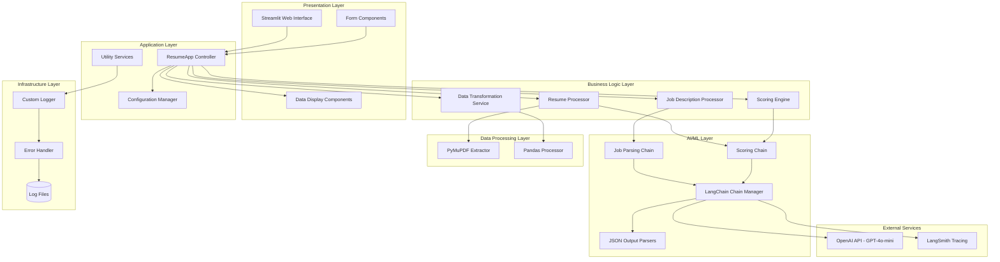

---

## Component Architecture

### 1. Application Components

#### ResumeApp (Main Controller)
**File**: `app.py`

**Responsibilities**:
- Application initialization and configuration
- LangChain setup and chain management
- Orchestration of job and resume processing
- UI rendering and user interaction handling

**Key Methods**:
```python
class ResumeApp(Utils, ScoreTemplate):
    def __init__(self)
    def create_chain(self, prompt)
    def get_parsed_output(self, res)
    def reduce_content(self, sort_data)
    def render_ui(self)
```

**Architecture Pattern**: Inherits from multiple base classes (Utils, ScoreTemplate) following the Mixin pattern.

#### Utils (Utility Service)
**File**: `utils.py`

**Responsibilities**:
- Configuration file reading and parsing
- Logging infrastructure setup
- Error handling and logging

**Key Methods**:
```python
class Utils(CustomLogger):
    def __init__(self)
    def read_config(self)
```

#### CustomLogger (Logging Service)
**File**: `utils.py`

**Responsibilities**:
- Centralized logging configuration
- Time-based log file organization
- Error traceback formatting

**Key Methods**:
```python
class CustomLogger:
    def __init__(self)
    def setup_logger(self)
    def write_error_log(self, exc_type, exc_tb, msg)
```

### 2. Data Model Components

#### Job Template
**File**: `templates.py`

**Structure**:
```python
class JobTemplate(BaseModel):
    Job_Title: str
    Job_description: str
    Educational_Qualification: str
    Experience: float
    Programming_Skills: List[str]
    AI_ML_Skills: List[str]
    Other_Skills: List[str]
```

**Purpose**: Defines structured schema for job description parsing.

#### Score Templates
**File**: `templates.py`

Dynamic template creation based on job requirements:

```python
class ScoreTemplate:
    def create_score_template(self, job_dict):
        # Creates dynamic Pydantic models:
        - ExperienceRequired
        - Role
        - EducationQualification
        - AIMLScore
        - ProgrammingScore
        - OtherSkillScore
        - CandidateScore (main model)
```

**Pattern**: Factory pattern for dynamic model generation.

### 3. Prompt Management

**File**: `prompts.py`

**Templates**:
1. **job_prompt**: Extracts and classifies job posting content
2. **score_prompt**: Evaluates resumes against job requirements

**Structure**:
```python
score_prompt = """
    You are an helpful assistant in evaluating and scoring...
    {format_instruction}
    Job Details: {content}
    CV: {cv}
"""
```

---

## Data Flow Architecture

### Complete Data Flow Diagram

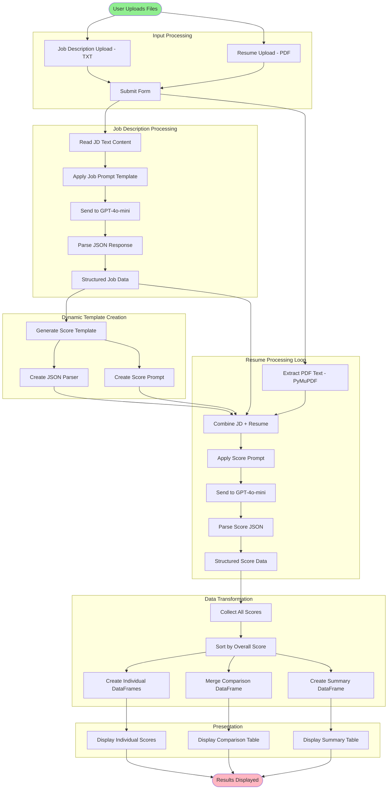

### Detailed Processing Steps

#### Step 1: Job Description Processing
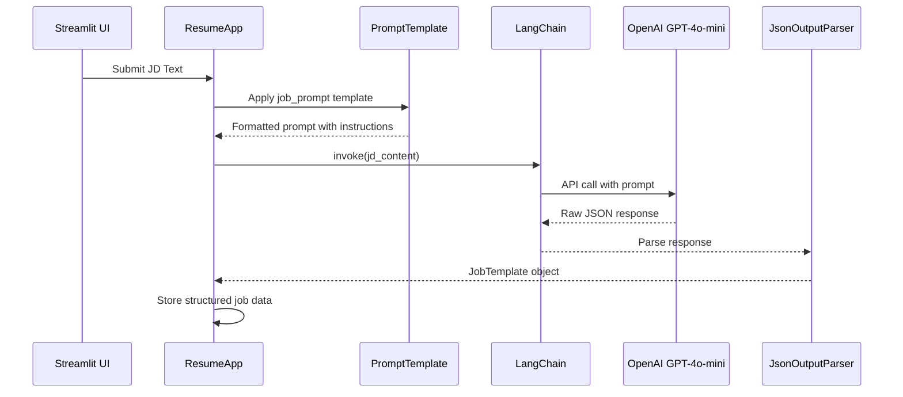

#### Step 2: Resume Processing
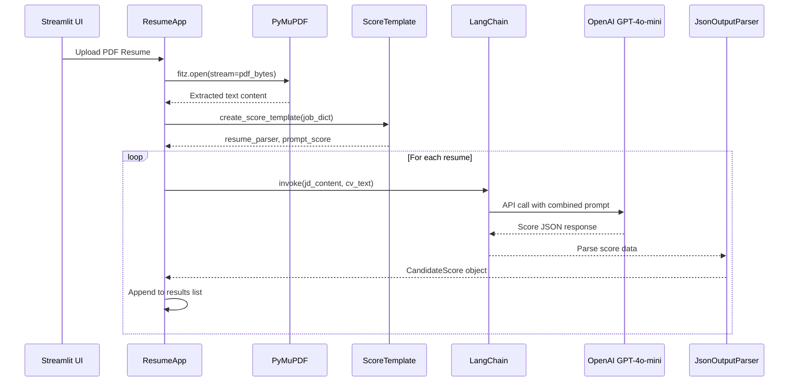

#### Step 3: Data Transformation
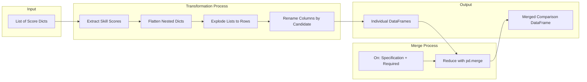

---

## Class Diagrams

### Core Class Structure

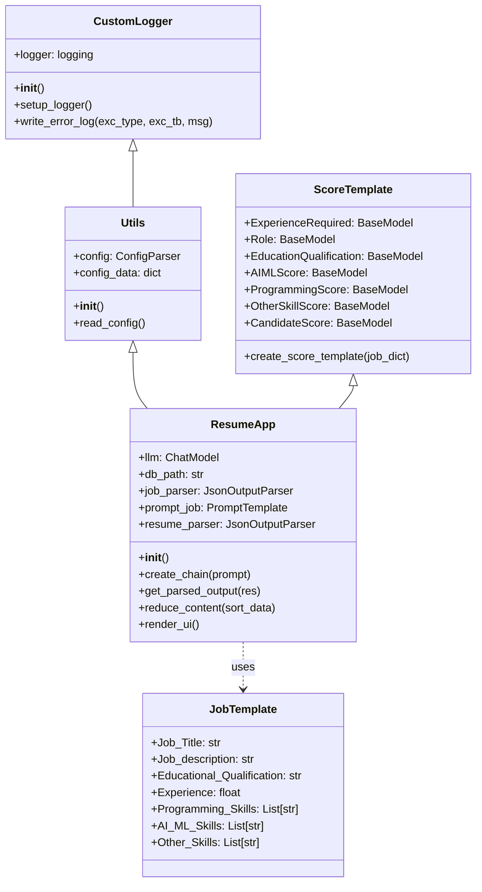

### Data Model Relationships

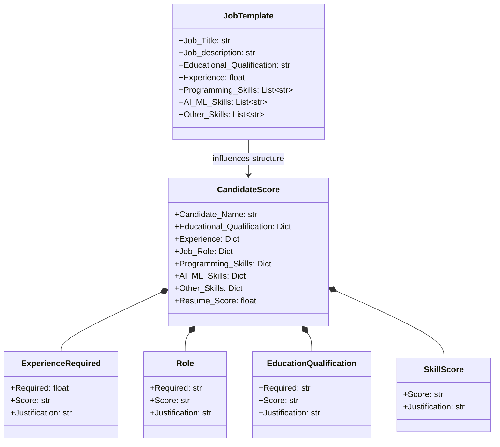

---

## Technology Stack Details

### Core Framework Stack

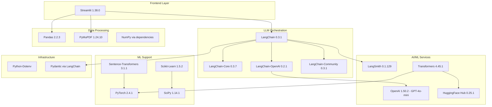

### Dependency Matrix

| Component | Purpose | Version | Critical Dependencies |
|-----------|---------|---------|----------------------|
| Streamlit | Web UI Framework | 1.38.0 | Tornado, Pandas |
| LangChain | LLM Orchestration | 0.3.1 | Pydantic, AsyncIO |
| OpenAI | LLM Provider | 1.50.2 | HTTPX, Tiktoken |
| PyMuPDF | PDF Processing | 1.24.10 | Native libs |
| Pandas | Data Manipulation | 2.2.3 | NumPy |
| PyTorch | ML Framework | 2.4.1 | CUDA (optional) |
| LangSmith | Monitoring | 0.1.129 | Requests |

---

## API & Integration Points

### External API Integrations

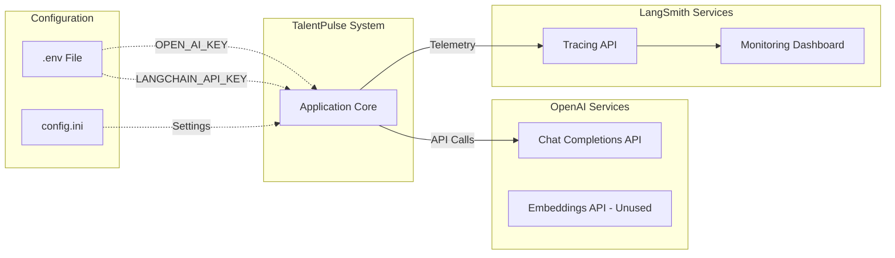

### API Call Flow

#### OpenAI Chat Completion
```python
# Model Configuration
model: gpt-4o-mini
temperature: 0
provider: openai

# Request Structure
{
    "model": "gpt-4o-mini",
    "messages": [
        {
            "role": "system",
            "content": "<prompt_template>"
        },
        {
            "role": "user",
            "content": "<job_description | resume>"
        }
    ],
    "temperature": 0
}

# Response Structure
{
    "id": "chatcmpl-xxx",
    "object": "chat.completion",
    "created": timestamp,
    "model": "gpt-4o-mini",
    "choices": [{
        "message": {
            "role": "assistant",
            "content": "```json\n{...}\n```"
        }
    }]
}
```

### Configuration Management

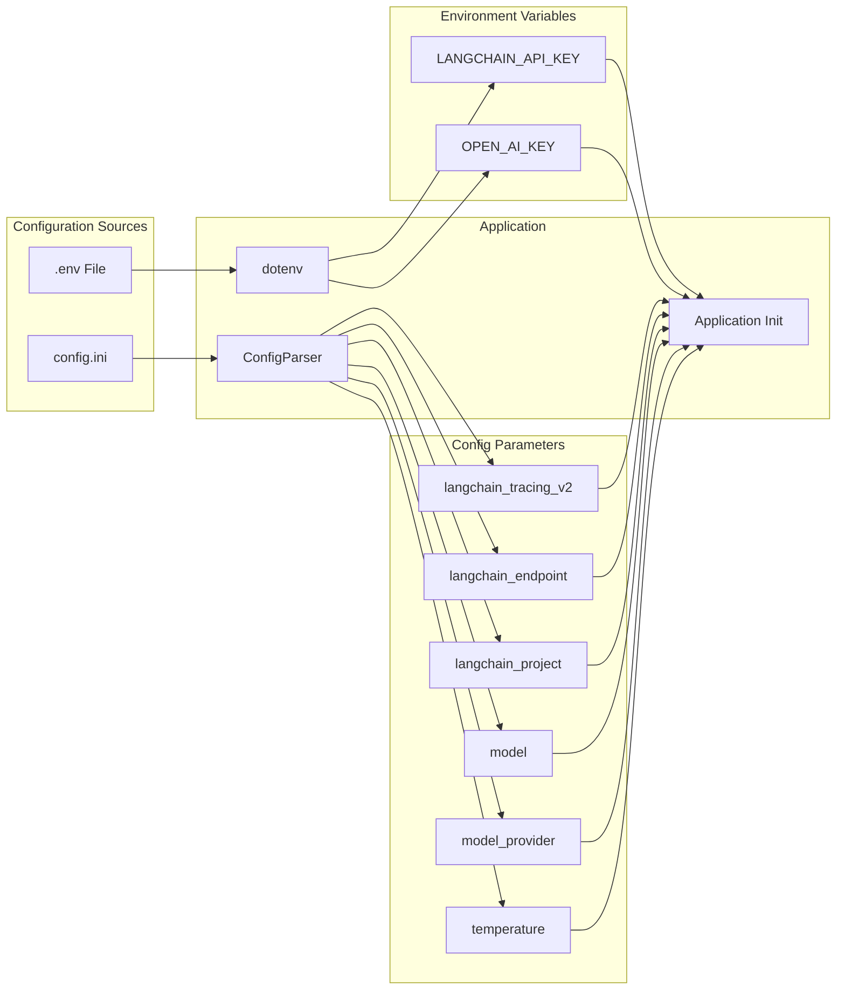

---

## Security Architecture

### Security Layers

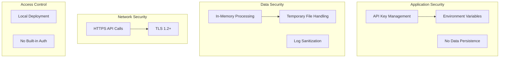

### Security Considerations

#### Current Implementation
- **API Keys**: Stored in `.env` file (not version controlled)
- **Data Handling**: Resumes processed in-memory only
- **Logging**: Error logs may contain stack traces (no PII)
- **Network**: HTTPS for all external API calls

#### Security Recommendations
1. **Authentication**: Implement user authentication for production
2. **Authorization**: Role-based access control
3. **Data Encryption**: Encrypt sensitive data at rest
4. **Audit Logging**: Enhanced logging for compliance
5. **Rate Limiting**: Prevent API abuse
6. **Input Validation**: Enhanced PDF validation
7. **CORS**: Configure for web deployments

---

## Performance & Scalability

### Performance Characteristics

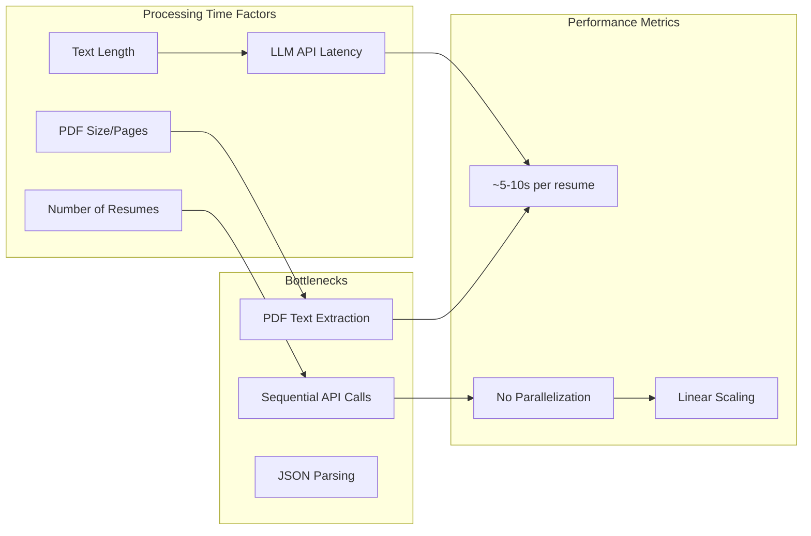

### Performance Profile

| Metric | Current State | Optimization Opportunity |
|--------|---------------|-------------------------|
| Resume Processing | Sequential | Parallel async processing |
| API Calls | Synchronous | Async/await implementation |
| PDF Parsing | Per-file | Batch processing |
| Memory Usage | Low (streaming) | Good as-is |
| CPU Usage | Low | Good as-is |
| Network I/O | High (API calls) | Caching, batching |

### Scalability Architecture

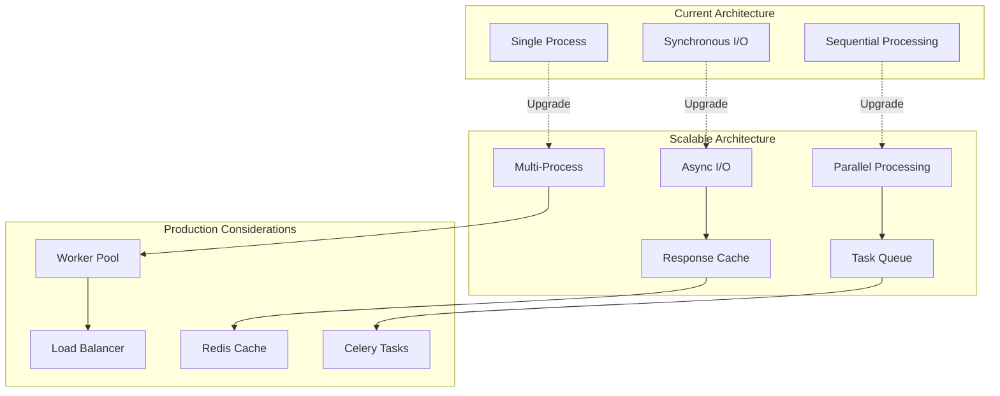

### Optimization Recommendations

#### Short-term (Prototype Level)
1. **Async Processing**: Convert to async/await for API calls
2. **Concurrent Resumes**: Process multiple resumes in parallel
3. **Response Caching**: Cache job description parsing results
4. **Batch API Calls**: If API supports batching

#### Long-term (Production)
1. **Microservices**: Separate PDF processing, LLM calls, scoring
2. **Message Queue**: RabbitMQ/Redis for job processing
3. **Database**: Store results for analytics
4. **CDN**: For static assets
5. **Horizontal Scaling**: Multiple application instances
6. **Auto-scaling**: Based on queue depth

### Resource Requirements

#### Development Environment
- **CPU**: 2+ cores
- **RAM**: 4GB minimum
- **Storage**: 1GB for dependencies
- **Network**: Stable internet for API calls

#### Production Environment (100 resumes/day)
- **CPU**: 4+ cores
- **RAM**: 8GB minimum
- **Storage**: 10GB (logs, cache)
- **Network**: 10Mbps+, low latency to OpenAI

---

## Error Handling Architecture

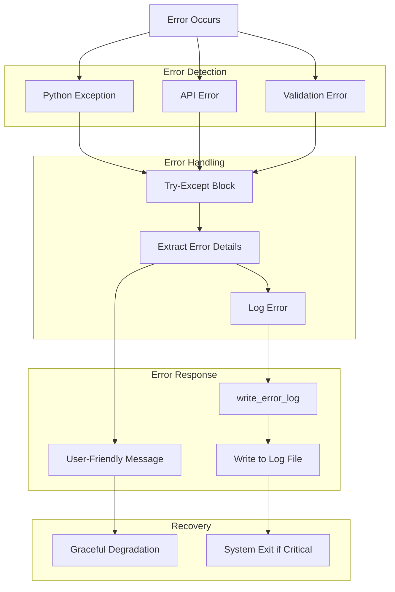

### Error Categories

1. **Configuration Errors**: Missing config.ini or .env
2. **API Errors**: OpenAI rate limits, network issues
3. **Parsing Errors**: Invalid JSON from LLM
4. **File Errors**: Corrupted PDFs, unsupported formats
5. **Data Errors**: Missing required fields

---

## Deployment Architecture

### Local Deployment

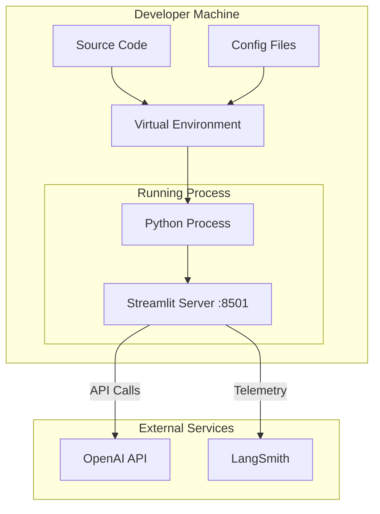

### Cloud Deployment Options

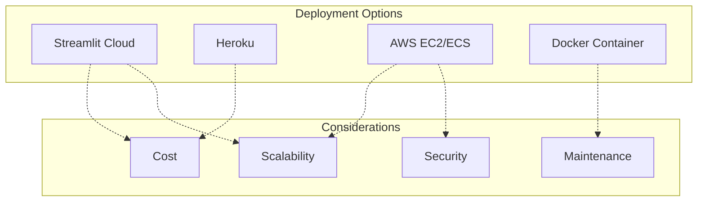

---

## Monitoring & Observability

### Monitoring Stack

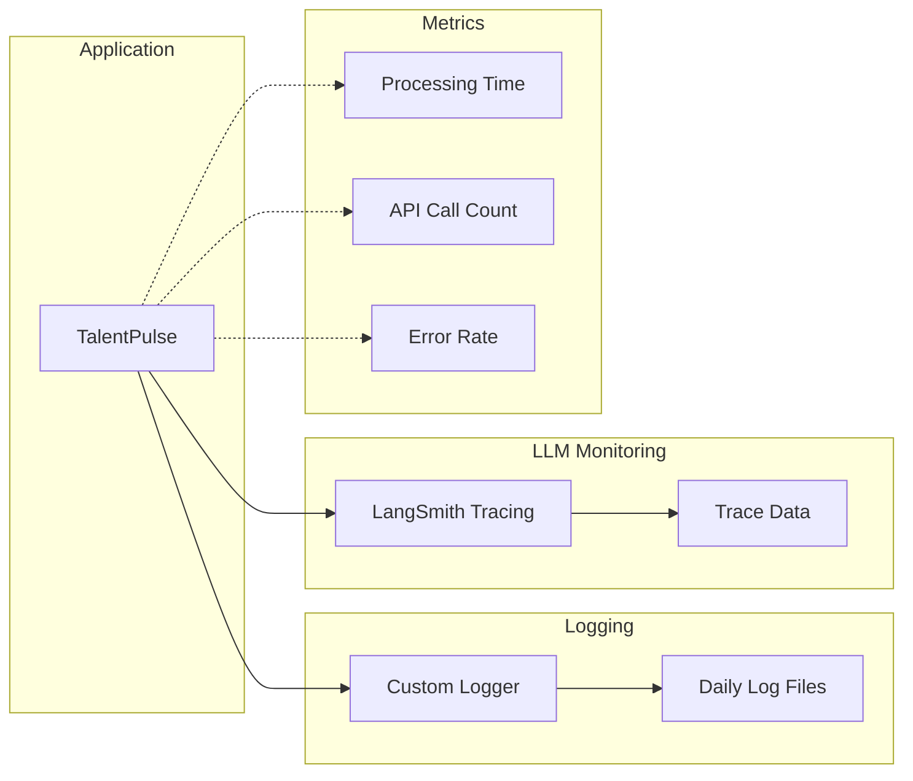

### Observable Metrics

1. **Performance Metrics**
   - Time per resume processed
   - Total processing time
   - PDF parsing time
   - API response time

2. **Quality Metrics**
   - JSON parsing success rate
   - Score distribution
   - LLM prompt token usage

3. **System Metrics**
   - Error frequency
   - Log file size
   - Memory usage

---

## Conclusion

TalentPulse's architecture is designed for:
- **Simplicity**: Easy to understand and maintain
- **Modularity**: Clear separation of concerns
- **Extensibility**: Easy to add features
- **Reliability**: Comprehensive error handling
- **Observability**: Detailed logging and tracing

The current architecture serves well as a prototype and can be evolved into a production-grade system with the recommended scalability and security enhancements.
