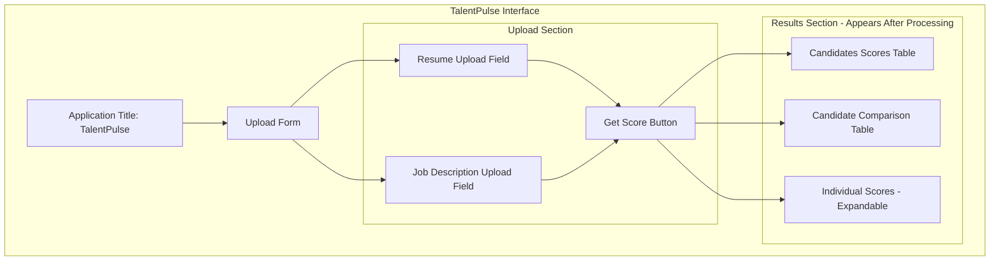
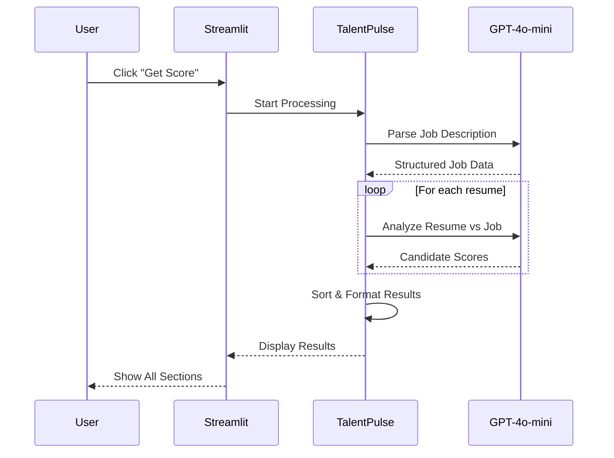
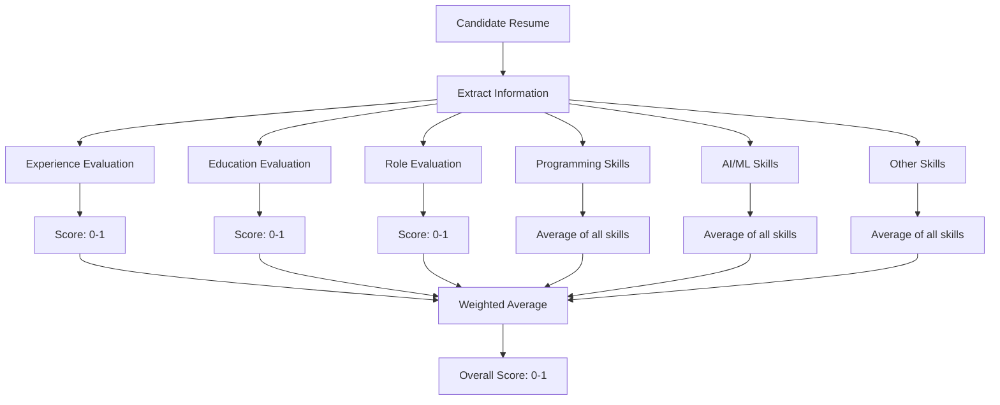

# TalentPulse - User Guide

## Table of Contents
1. [Getting Started](#getting-started)
2. [System Requirements](#system-requirements)
3. [Installation Instructions](#installation-instructions)
4. [Configuration Setup](#configuration-setup)
5. [Using TalentPulse](#using-talentpulse)
6. [Understanding Results](#understanding-results)
7. [Best Practices](#best-practices)
8. [Troubleshooting](#troubleshooting)
9. [FAQs](#faqs)

---

## Getting Started

### What You'll Need

Before using TalentPulse, ensure you have:

1. **Job Description**: A text file (.txt) containing the job posting
2. **Resumes**: One or more PDF files containing candidate resumes
3. **OpenAI API Key**: Access to OpenAI's GPT-4o-mini model
4. **LangSmith API Key** (Optional): For monitoring and debugging

### Quick Start Workflow


---

## System Requirements

### Hardware Requirements

**Minimum**:
- **Processor**: Dual-core CPU (2.0 GHz or higher)
- **RAM**: 4 GB
- **Storage**: 2 GB free space
- **Internet**: Stable broadband connection

**Recommended**:
- **Processor**: Quad-core CPU (2.5 GHz or higher)
- **RAM**: 8 GB or more
- **Storage**: 5 GB free space
- **Internet**: High-speed connection (10 Mbps+)

### Software Requirements

- **Operating System**:
  - Windows 10/11
  - macOS 10.14+
  - Linux (Ubuntu 18.04+, CentOS 7+)
- **Python**: Version 3.8 or higher
- **Web Browser**:
  - Chrome (recommended)
  - Firefox
  - Safari
  - Edge

### Network Requirements

- **Outbound HTTPS**: Access to:
  - `api.openai.com` (OpenAI API)
  - `api.smith.langchain.com` (LangSmith - optional)
- **Ports**: Default Streamlit port 8501

---

## Installation Instructions

### Step 1: Install Python

If Python is not already installed:

**Windows**:
```bash
# Download from python.org
# Or use winget:
winget install Python.Python.3.11
```

**macOS**:
```bash
# Using Homebrew
brew install python@3.11
```

**Linux**:
```bash
# Ubuntu/Debian
sudo apt update
sudo apt install python3.11 python3.11-venv python3-pip

# CentOS/RHEL
sudo yum install python311
```

Verify installation:
```bash
python --version
# Should show Python 3.8 or higher
```

### Step 2: Clone or Download the Project

```bash
# Navigate to project directory
cd /path/to/talend_pulse
```

### Step 3: Create Virtual Environment

**Windows**:
```bash
python -m venv venv
venv\Scripts\activate
```

**macOS/Linux**:
```bash
python3 -m venv venv
source venv/bin/activate
```

You should see `(venv)` in your terminal prompt.

### Step 4: Install Dependencies

```bash
pip install --upgrade pip
pip install -r requirements.txt
```

**Installation Progress**:
This will install the following main packages:
- Streamlit (Web UI)
- LangChain (LLM orchestration)
- OpenAI (API client)
- PyMuPDF (PDF processing)
- Pandas (Data manipulation)
- And other dependencies

**Expected Time**: 5-10 minutes depending on your internet connection.

### Step 5: Verify Installation

```bash
streamlit --version
# Should display Streamlit version

python -c "import langchain; import openai; import fitz; print('All imports successful')"
# Should print: All imports successful
```

---

## Configuration Setup

### Step 1: Create Environment File

Create a `.env` file in the project root directory:

**Windows (Command Prompt)**:
```cmd
type nul > .env
notepad .env
```

**macOS/Linux**:
```bash
touch .env
nano .env
```

### Step 2: Add API Keys

Add the following to your `.env` file:

```ini
# OpenAI API Key (Required)
OPEN_AI_KEY=sk-your-openai-api-key-here

# LangSmith API Key (Optional - for monitoring)
LANGCHAIN_API_KEY=ls-your-langsmith-api-key-here
```

**How to Get API Keys**:

1. **OpenAI API Key**:
   - Visit: https://platform.openai.com/api-keys
   - Sign in or create an account
   - Click "Create new secret key"
   - Copy the key and paste into `.env`

2. **LangSmith API Key** (Optional):
   - Visit: https://smith.langchain.com
   - Sign up for an account
   - Navigate to Settings > API Keys
   - Create and copy the key

### Step 3: Verify Configuration File

Check that `config.ini` exists and contains:

```ini
[default]
LANGCHAIN_TRACING_V2 = true
LANGCHAIN_ENDPOINT = https://api.smith.langchain.com
LANGCHAIN_PROJECT = CV
MODEL = gpt-4o-mini
MODEL_PROVIDER = openai
TEMPERATURE = 0
```

**Configuration Parameters Explained**:

| Parameter | Description | Default Value |
|-----------|-------------|---------------|
| LANGCHAIN_TRACING_V2 | Enable LangSmith tracing | true |
| LANGCHAIN_ENDPOINT | LangSmith API endpoint | https://api.smith.langchain.com |
| LANGCHAIN_PROJECT | Project name in LangSmith | CV |
| MODEL | OpenAI model to use | gpt-4o-mini |
| MODEL_PROVIDER | LLM provider | openai |
| TEMPERATURE | Model temperature (0=deterministic) | 0 |

**Optional Modifications**:

To use a different model:
```ini
# For more powerful analysis (higher cost)
MODEL = gpt-4o

# For faster processing (lower cost)
MODEL = gpt-3.5-turbo
```

To disable LangSmith tracing:
```ini
LANGCHAIN_TRACING_V2 = false
```

---

## Using TalentPulse

### Launching the Application

1. **Activate Virtual Environment**:
   ```bash
   # Windows
   venv\Scripts\activate

   # macOS/Linux
   source venv/bin/activate
   ```

2. **Start Streamlit**:
   ```bash
   streamlit run app.py
   ```

3. **Access the Application**:
   - Your browser should automatically open
   - If not, navigate to: `http://localhost:8501`

**Successful Launch Indicators**:
```
You can now view your Streamlit app in your browser.

Local URL: http://localhost:8501
Network URL: http://192.168.x.x:8501
```

### Application Interface Overview



### Step-by-Step Usage Guide

#### Step 1: Prepare Job Description

**Format**: Plain text file (.txt)

**Example Structure**:
```
Job Title: Senior Data Scientist

Description:
We are looking for an experienced Data Scientist...

Requirements:
- Master's degree in Computer Science or related field
- 5+ years of experience in data science
- Strong Python programming skills
- Experience with machine learning frameworks

Required Skills:
- Python, SQL, R
- TensorFlow, PyTorch
- Pandas, NumPy, Scikit-learn
- Data visualization tools

Preferred Skills:
- AWS/Azure cloud platforms
- Big data technologies (Spark, Hadoop)
```

**Tips for Best Results**:
- Be specific about required skills
- Clearly separate mandatory vs. preferred qualifications
- Include years of experience required
- Specify education requirements

#### Step 2: Prepare Resumes

**Format**: PDF files (.pdf)

**Best Practices**:
- Use standard resume formats
- Ensure text is selectable (not scanned images)
- One resume per file
- Clear section headers (Education, Experience, Skills)
- File names should be descriptive (e.g., `john_doe_resume.pdf`)

**What the System Extracts**:
- Candidate name
- Educational background
- Work experience (years)
- Skills mentioned
- Job titles/roles

#### Step 3: Upload Files

1. **Upload Resumes**:
   - Click "Browse files" under "Please upload the resume(s)"
   - Select multiple PDF files (Ctrl+Click or Cmd+Click)
   - Or drag-and-drop files into the upload area

2. **Upload Job Description**:
   - Click "Browse files" under "Please upload a job description"
   - Select your .txt file

**Visual Confirmation**:
- Uploaded files will appear with their names
- File size will be displayed
- You can remove files by clicking the X icon

#### Step 4: Submit for Processing

1. Click the **"Get Score"** button
2. Wait for processing to complete
   - You'll see a "Please wait" spinner
   - Processing time: ~5-10 seconds per resume

**Processing Steps (Behind the Scenes)**:


#### Step 5: Review Results

The application displays three sections of results:

---

## Understanding Results

### Section 1: Candidates Scores

**Purpose**: Quick overview of all candidates ranked by overall score

**Table Structure**:

| Column | Description | Example |
|--------|-------------|---------|
| candidate_name | Candidate's full name | John Doe |
| Overall_Score | Weighted average (0-1) | 0.85 |

**Sorting**:
- Candidates are automatically sorted by Overall_Score (highest first)

**Interpretation**:
- **0.9 - 1.0**: Excellent match, highly recommended
- **0.7 - 0.89**: Good match, strong candidate
- **0.5 - 0.69**: Moderate match, consider for interview
- **0.3 - 0.49**: Weak match, may lack key qualifications
- **0.0 - 0.29**: Poor match, likely missing critical requirements

**Example**:
```
candidate_name    Overall_Score
Alice Johnson     0.92
Bob Smith         0.87
Carol White       0.75
David Brown       0.62
```

### Section 2: Candidate Comparison

**Purpose**: Side-by-side comparison of candidates across all criteria

**Table Structure**:

| Specification | Required | Alice's Score | Bob's Score | Carol's Score |
|---------------|----------|---------------|-------------|---------------|
| Experience | 5.0 years | 0.9 | 0.8 | 0.6 |
| Python | Required | 0.95 | 0.85 | 0.7 |
| Machine Learning | Required | 0.9 | 0.9 | 0.65 |

**How to Use**:
1. **Identify Strengths**: See which candidates excel in specific areas
2. **Spot Weaknesses**: Find skill gaps across candidates
3. **Compare Similar Candidates**: Differentiate between close scores
4. **Make Trade-offs**: Choose between different skill combinations

**Example Analysis**:
```
Observation: Alice scores highest overall (0.92)
- Strong in Python (0.95) and ML (0.9)
- Exceeds experience requirements (0.9 for 5 years)

Bob is close second (0.87)
- Equal ML skills (0.9)
- Slightly lower Python (0.85)
- Meets experience requirements (0.8)

Decision: Interview both, prioritize Alice
```

### Section 3: Individual Scores (Expandable)

**Purpose**: Detailed breakdown with justifications for each candidate

**Structure**:
- Click on candidate name to expand
- Shows overall score at top
- Detailed table with justifications

**Columns**:
| Column | Description |
|--------|-------------|
| Specification | Category being evaluated |
| Required | What the job requires |
| Score | Candidate's score (0-1) |
| Justification | AI's reasoning for the score |

**Example**:
```
Specification: Programming_Skills
Required: Python
Score: 0.85
Justification: "Candidate has 4 years of Python experience with
               multiple projects listed. Strong proficiency in
               pandas, NumPy, and scikit-learn. However, no
               mention of advanced Python features like async/await."
```

**How Justifications Help**:
1. **Transparency**: Understand why a score was given
2. **Decision Support**: Additional context beyond numbers
3. **Interview Preparation**: Identify areas to probe in interviews
4. **Skill Validation**: Verify AI's assessment against resume

### Score Calculation Logic



**Scoring Criteria**:

1. **Experience** (Weight: High):
   - Compares years of experience
   - 1.0 = Exceeds requirements
   - 0.5 = Meets minimum
   - 0.0 = No relevant experience

2. **Education** (Weight: Medium):
   - Exact match = 1.0
   - Related field = 0.7-0.9
   - Unrelated but acceptable = 0.5
   - Missing = 0.0-0.3

3. **Role Relevance** (Weight: High):
   - Similar role = 0.9-1.0
   - Related role = 0.6-0.8
   - Different field = 0.3-0.5
   - Unrelated = 0.0-0.2

4. **Skills** (Weight: Very High):
   - Each skill scored individually
   - Expert level = 0.9-1.0
   - Proficient = 0.7-0.85
   - Basic = 0.4-0.65
   - Not mentioned = 0.0

---

## Best Practices

### For Job Descriptions

1. **Be Specific**:
   ```
   Good: "5+ years of Python experience with Django framework"
   Bad: "Programming experience required"
   ```

2. **Categorize Skills**:
   - Separate programming, AI/ML, and other skills
   - Distinguish required vs. preferred

3. **Quantify Requirements**:
   - Specify years of experience
   - Name specific tools/technologies
   - Define education level clearly

4. **Keep It Structured**:
   - Use clear section headers
   - List items separately
   - Avoid excessive jargon

### For Resume Uploads

1. **Quality Over Quantity**:
   - Pre-screen obviously unqualified resumes
   - Process 5-20 resumes per batch for best experience

2. **Consistent Formatting**:
   - Prefer similar resume formats
   - Avoid scanned images
   - Use standard PDF conversion

3. **File Management**:
   - Use descriptive file names
   - Keep files organized by job posting
   - Archive processed resumes

### For Evaluation

1. **Use Scores as Guidance, Not Gospel**:
   - AI provides data-driven insights
   - Human judgment is still essential
   - Consider factors beyond the resume

2. **Review Justifications**:
   - Don't just look at numbers
   - Read the reasoning
   - Verify against original resume

3. **Compare Thoughtfully**:
   - Look for patterns across candidates
   - Consider team fit, not just skills
   - Think about growth potential

4. **Document Decisions**:
   - Export results (screenshot or data export)
   - Keep notes on why candidates were selected/rejected
   - Build institutional knowledge

### For System Performance

1. **Batch Processing**:
   - Process similar roles together
   - Don't mix different job types
   - Re-use job description analysis when possible

2. **Monitor Costs**:
   - Each resume = ~2 API calls
   - Estimate: $0.01-0.05 per resume
   - Budget accordingly for high volumes

3. **Validate Results**:
   - Spot-check AI scores
   - Verify against your own assessment
   - Report patterns of incorrect scoring

---

## Troubleshooting

### Common Issues and Solutions

#### Issue 1: Application Won't Start

**Symptoms**:
```
ModuleNotFoundError: No module named 'streamlit'
```

**Solutions**:
1. Verify virtual environment is activated:
   ```bash
   # You should see (venv) in prompt
   # If not, activate:
   source venv/bin/activate  # macOS/Linux
   venv\Scripts\activate     # Windows
   ```

2. Reinstall dependencies:
   ```bash
   pip install -r requirements.txt
   ```

3. Check Python version:
   ```bash
   python --version
   # Should be 3.8+
   ```

---

#### Issue 2: API Key Errors

**Symptoms**:
```
openai.AuthenticationError: Invalid API key
```

**Solutions**:
1. Verify `.env` file exists and contains:
   ```
   OPEN_AI_KEY=sk-...
   ```

2. Check for extra spaces or quotes:
   ```
   # Correct:
   OPEN_AI_KEY=sk-abc123

   # Incorrect:
   OPEN_AI_KEY="sk-abc123"
   OPEN_AI_KEY= sk-abc123
   ```

3. Verify key is valid on OpenAI dashboard

4. Restart the application after fixing `.env`

---

#### Issue 3: PDF Processing Errors

**Symptoms**:
```
Error extracting text from PDF
```

**Solutions**:
1. **Check PDF Format**:
   - Ensure it's a real PDF, not a renamed file
   - Verify text is selectable (not scanned image)

2. **Convert Scanned PDFs**:
   - Use OCR software first
   - Adobe Acrobat: Export as Searchable PDF
   - Online tools: ILovePDF, PDFCandy

3. **Simplify PDF**:
   - Remove complex formatting
   - Save as simpler version
   - Convert: Word → PDF

---

#### Issue 4: "Server Busy" Message

**Symptoms**:
```
Server busy. Please try again
```

**Causes & Solutions**:

1. **OpenAI Rate Limits**:
   - Wait 1-2 minutes
   - Reduce batch size
   - Check OpenAI usage limits

2. **Network Issues**:
   - Verify internet connection
   - Check firewall settings
   - Try different network

3. **Invalid JSON Response**:
   - Check logs in `./logs/` directory
   - Look for parsing errors
   - May need to adjust prompts

---

#### Issue 5: Missing or Incorrect Scores

**Symptoms**:
- Some skills show 0 when they shouldn't
- Missing candidate information

**Solutions**:

1. **Improve Resume Format**:
   - Add clear section headers
   - List skills explicitly
   - Use standard terminology

2. **Enhance Job Description**:
   - Be more specific about requirements
   - Use industry-standard skill names
   - Provide context

3. **Check LangSmith Traces**:
   - Log into LangSmith dashboard
   - Review actual LLM responses
   - Identify prompt improvements

---

#### Issue 6: Slow Processing

**Symptoms**:
- Taking > 30 seconds per resume

**Solutions**:

1. **Check Network Speed**:
   ```bash
   # Test latency to OpenAI
   ping api.openai.com
   ```

2. **Reduce Resume Size**:
   - Compress PDFs
   - Remove unnecessary images
   - Limit to 2-3 pages

3. **Optimize Job Description**:
   - Keep it concise
   - Reduce to essential requirements

4. **Consider Model Switch**:
   ```ini
   # In config.ini, for faster processing:
   MODEL = gpt-3.5-turbo
   ```

---

### Error Log Analysis

**Location**: `./logs/DD-MM-YY/HH.log`

**Example Log Entry**:
```
2024-12-20 10:30:45 - ERROR - Invalid JSON response | JSONDecodeError | app.py | 98
```

**Reading Logs**:
- **Timestamp**: When error occurred
- **Level**: ERROR, INFO, WARNING
- **Message**: Error description
- **Exception Type**: Python exception class
- **File**: Source file
- **Line**: Line number

**Common Error Patterns**:

| Error Message | Meaning | Solution |
|---------------|---------|----------|
| JSONDecodeError | LLM returned invalid JSON | Check prompts, retry |
| AuthenticationError | Invalid API key | Verify .env file |
| FileNotFoundError | Missing file | Check file paths |
| KeyError | Missing expected data | Update templates |

---

## FAQs

### General Questions

**Q: How many resumes can I process at once?**

A: Technically unlimited, but practically:
- **Recommended**: 5-20 resumes per batch
- **Maximum tested**: 50 resumes
- **Performance**: Degrades with very large batches
- **Cost**: ~$0.01-0.05 per resume

---

**Q: What resume formats are supported?**

A: Currently only PDF files are supported.
- Must be text-based PDFs (not scanned images)
- Word documents must be converted to PDF first
- HTML/LinkedIn profiles not supported

---

**Q: Can I save the results?**

A: Currently, results are displayed on-screen only. To save:
- Take screenshots
- Copy tables to Excel
- Use browser's print-to-PDF
- Future enhancement: Export to CSV/Excel

---

**Q: Is my data stored anywhere?**

A: By default, no permanent storage:
- Resumes processed in-memory only
- Only error logs are saved locally
- LangSmith stores traces if enabled (configurable)
- OpenAI may log API calls per their policy

---

### Technical Questions

**Q: Can I use a different LLM provider?**

A: Yes, with code modifications:
```ini
# In config.ini:
MODEL_PROVIDER = anthropic  # or groq, huggingface
MODEL = claude-3-sonnet-20240229
```

Requires updating `.env` with appropriate API keys.

---

**Q: How accurate are the scores?**

A: Accuracy depends on:
- Quality of job description
- Clarity of resume formatting
- Specificity of requirements
- Model version used

Typical accuracy: 80-90% correlation with human evaluators for clear criteria.

---

**Q: Can I customize the scoring criteria?**

A: Yes, by modifying `templates.py`:
- Adjust score weights
- Add new evaluation categories
- Modify justification requirements

Requires Python knowledge.

---

**Q: What languages are supported?**

A: Currently optimized for English.
- Other languages may work but not tested
- GPT-4o-mini supports 50+ languages
- Results quality may vary

---

### Operational Questions

**Q: How much does it cost to run?**

A: Costs breakdown:
- **API Costs**: ~$0.01-0.05 per resume (GPT-4o-mini)
- **Infrastructure**: Free (running locally)
- **LangSmith**: Free tier available

Estimate: $1-5 per 100 resumes.

---

**Q: Can multiple users use it simultaneously?**

A: Current version is single-user:
- Running locally on one machine
- No authentication system
- No concurrent request handling

For multi-user: Deploy to cloud with proper setup.

---

**Q: How do I update to a newer version?**

A:
```bash
# Pull latest code
git pull origin main

# Update dependencies
pip install -r requirements.txt --upgrade

# Restart application
streamlit run app.py
```

---

**Q: Can I integrate this with our ATS?**

A: Not directly, but possible with development:
- Build REST API wrapper
- Export results to standard format
- Use webhook integrations

Contact developers for custom integration.

---

### Privacy & Security

**Q: Is this GDPR compliant?**

A: The tool can be GDPR compliant if:
- You have consent to process resumes
- Data is not stored permanently
- You comply with OpenAI's data usage policy
- Proper access controls are implemented

Consult legal counsel for your specific use case.

---

**Q: Who has access to the uploaded resumes?**

A: Access points:
- **Local Machine**: Anyone with access to the computer
- **OpenAI**: Processes content via API (see OpenAI policy)
- **LangSmith**: Stores traces if enabled
- **Logs**: Error logs may contain snippets

Recommendation: Use on secure workstation, disable unnecessary tracing.

---

**Q: Can candidates see their scores?**

A: No built-in candidate-facing interface.
- Results visible only to system operator
- Sharing scores is your policy decision
- Consider data protection regulations

---

## Additional Resources

### Getting Help

1. **Check Logs**: `./logs/` directory for error details
2. **LangSmith Dashboard**: Monitor LLM traces
3. **GitHub Issues**: Report bugs or request features
4. **Documentation**: Review technical architecture docs

### Useful Commands

```bash
# Check environment
python --version
pip list

# View logs
cat logs/$(date +%d-%m-%y)/*.log

# Clear logs
rm -rf logs/*

# Restart with fresh state
deactivate
source venv/bin/activate
streamlit run app.py
```

### Tips for Success

1. **Start Small**: Test with 2-3 resumes first
2. **Iterate**: Refine job descriptions based on results
3. **Validate**: Cross-check AI scores with manual review
4. **Document**: Keep notes on what works
5. **Optimize**: Adjust based on your specific needs

---

## Conclusion

TalentPulse streamlines resume screening by providing:
- Objective, consistent evaluations
- Detailed justifications
- Time savings of 90%+
- Data-driven hiring decisions

Remember: Use AI as a tool to augment human judgment, not replace it. The best hiring decisions combine data insights with human intuition and organizational knowledge.

For technical details, see the [Technical Architecture](./02_TECHNICAL_ARCHITECTURE.md) document.
For business value, see the [Business Value Analysis](./04_BUSINESS_VALUE.md) document.
