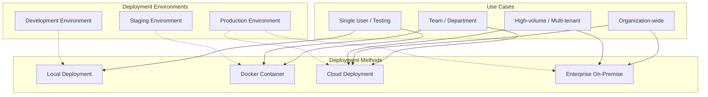
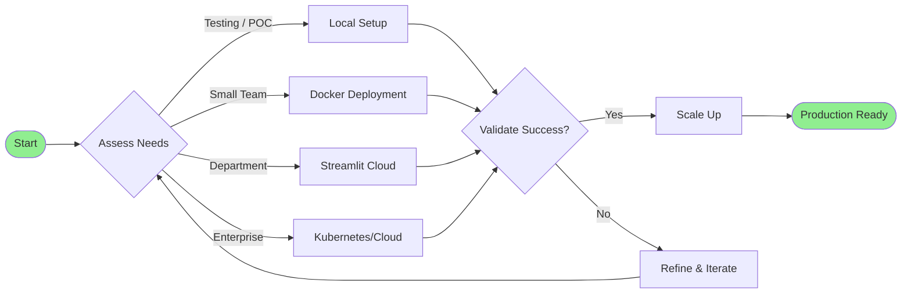
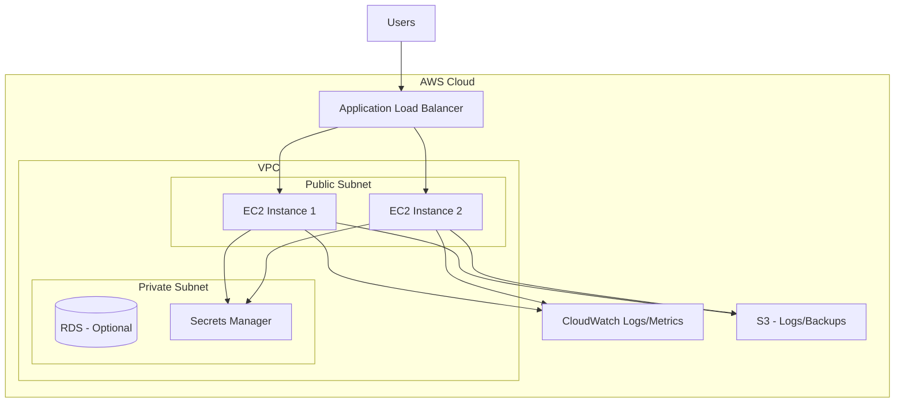
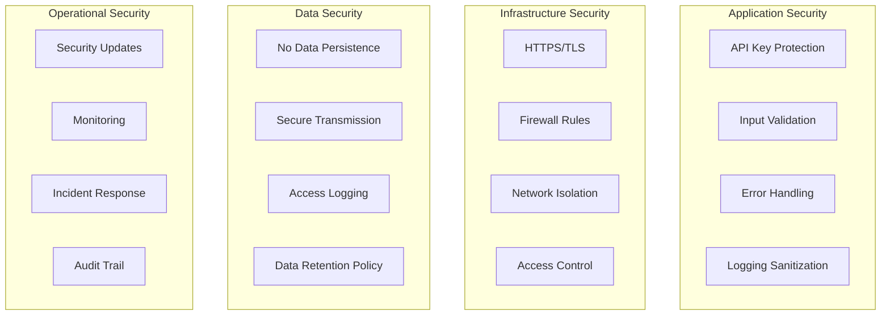
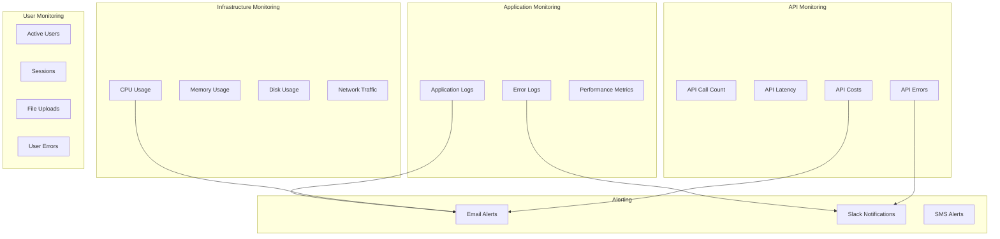
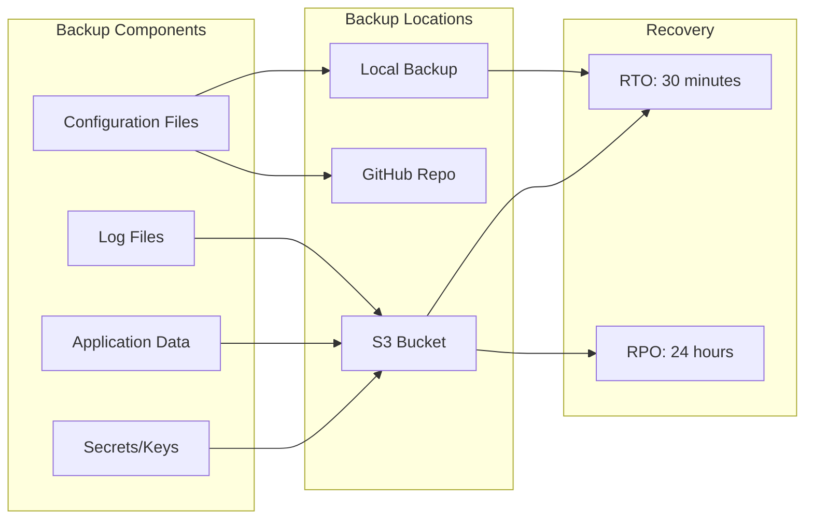

# TalentPulse - Deployment Guide

## Table of Contents
1. [Deployment Overview](#deployment-overview)
2. [Pre-Deployment Checklist](#pre-deployment-checklist)
3. [Local Development Setup](#local-development-setup)
4. [Production Deployment Options](#production-deployment-options)
5. [Docker Deployment](#docker-deployment)
6. [Cloud Deployment](#cloud-deployment)
7. [Configuration Management](#configuration-management)
8. [Security Hardening](#security-hardening)
9. [Monitoring & Maintenance](#monitoring--maintenance)
10. [Backup & Disaster Recovery](#backup--disaster-recovery)
11. [Troubleshooting Guide](#troubleshooting-guide)

---

## Deployment Overview

### Deployment Architecture Options



### Recommended Deployment Path



---

## Pre-Deployment Checklist

### Technical Requirements

- [ ] **Python 3.8+** installed and verified
- [ ] **Virtual environment** support (venv or conda)
- [ ] **Git** installed (for version control)
- [ ] **Network access** to:
  - [ ] api.openai.com
  - [ ] api.smith.langchain.com (optional)
  - [ ] pypi.org (for package installation)
- [ ] **Firewall rules** configured for required ports
- [ ] **SSL/TLS certificates** (for production HTTPS)

### Access & Credentials

- [ ] **OpenAI API key** obtained and tested
- [ ] **LangSmith API key** (optional but recommended)
- [ ] **Cloud provider account** (if deploying to cloud)
- [ ] **Domain name** registered (for production)
- [ ] **Email service** configured (for notifications)

### Resources

- [ ] **Server specifications** meet minimum requirements
- [ ] **Storage space** available (minimum 5GB)
- [ ] **Bandwidth** sufficient for API calls
- [ ] **Budget approval** for API costs
- [ ] **Team training** scheduled

### Documentation & Planning

- [ ] **Deployment plan** reviewed and approved
- [ ] **Rollback procedures** documented
- [ ] **Support processes** established
- [ ] **User documentation** prepared
- [ ] **Change management** communicated

---

## Local Development Setup

### Step-by-Step Installation

#### 1. Clone Repository

```bash
# Navigate to desired directory
cd /path/to/projects

# Clone or copy the project
git clone <repository-url> talend_pulse
# OR copy files manually

cd talend_pulse
```

#### 2. Create Virtual Environment

**Option A: venv (Recommended)**
```bash
# Create virtual environment
python -m venv venv

# Activate virtual environment
# On Linux/macOS:
source venv/bin/activate

# On Windows:
venv\Scripts\activate

# Verify activation (you should see (venv) in prompt)
which python  # Linux/macOS
where python  # Windows
```

**Option B: Conda**
```bash
# Create conda environment
conda create -n talentpulse python=3.11 -y

# Activate environment
conda activate talentpulse

# Verify
conda info --envs
```

#### 3. Install Dependencies

```bash
# Upgrade pip
pip install --upgrade pip

# Install requirements
pip install -r requirements.txt

# Verify installation
pip list | grep streamlit
pip list | grep langchain
pip list | grep openai
```

**Expected Output**:
```
streamlit                 1.38.0
langchain                 0.3.1
langchain-community       0.3.1
langchain-core            0.3.7
langchain-openai          0.2.1
openai                    1.50.2
...
```

#### 4. Configure Environment Variables

```bash
# Create .env file
touch .env

# Edit .env file
nano .env  # or use your preferred editor
```

**Add the following**:
```ini
# OpenAI Configuration
OPEN_AI_KEY=sk-your-actual-api-key-here

# LangSmith Configuration (Optional)
LANGCHAIN_API_KEY=ls-your-actual-api-key-here
```

**Security Note**: Ensure `.env` is in `.gitignore`

```bash
# Check .gitignore
cat .gitignore | grep .env

# If not present, add it
echo ".env" >> .gitignore
```

#### 5. Verify Configuration File

```bash
# Check config.ini exists
cat config.ini
```

**Expected Content**:
```ini
[default]
LANGCHAIN_TRACING_V2 = true
LANGCHAIN_ENDPOINT = https://api.smith.langchain.com
LANGCHAIN_PROJECT = CV
MODEL = gpt-4o-mini
MODEL_PROVIDER = openai
TEMPERATURE = 0
```

#### 6. Test Installation

```bash
# Test imports
python -c "
import streamlit as st
import langchain
import openai
import fitz
import pandas as pd
from dotenv import load_dotenv
print('✓ All imports successful')
"

# Test OpenAI connection
python -c "
from dotenv import load_dotenv
import os
from openai import OpenAI

load_dotenv()
client = OpenAI(api_key=os.getenv('OPEN_AI_KEY'))
response = client.chat.completions.create(
    model='gpt-4o-mini',
    messages=[{'role': 'user', 'content': 'Hello'}],
    max_tokens=5
)
print('✓ OpenAI connection successful')
"
```

#### 7. Launch Application

```bash
# Start Streamlit application
streamlit run app.py
```

**Expected Output**:
```
  You can now view your Streamlit app in your browser.

  Local URL: http://localhost:8501
  Network URL: http://192.168.1.100:8501
```

**Access the application**:
- Open browser to `http://localhost:8501`
- You should see "TalentPulse" title
- Upload form should be visible

#### 8. Test with Sample Data

```bash
# Test with provided samples
# 1. Upload samples/job_description/JD.txt
# 2. Upload samples/resume/cv1.pdf (or any sample resume)
# 3. Click "Get Score"
# 4. Verify results display correctly
```

---

## Production Deployment Options

### Comparison Matrix

| Deployment Type | Complexity | Cost | Scalability | Security | Best For |
|----------------|------------|------|-------------|----------|----------|
| Local | Low | Free | Low | Medium | Development, POC |
| Docker Local | Medium | Free | Medium | Medium | Small teams |
| Streamlit Cloud | Low | Low | Medium | High | Departments |
| AWS/Azure/GCP | High | Medium-High | High | High | Enterprise |
| On-Premise | Very High | High | High | Very High | Regulated industries |

---

## Docker Deployment

### Why Docker?

**Benefits**:
- Consistent environment across machines
- Easy deployment and scaling
- Isolated dependencies
- Version control for entire stack
- Simplified updates

### Step 1: Create Dockerfile

```bash
# Create Dockerfile
nano Dockerfile
```

**Dockerfile Content**:
```dockerfile
# Use official Python runtime as base image
FROM python:3.11-slim

# Set working directory
WORKDIR /app

# Install system dependencies
RUN apt-get update && apt-get install -y \
    build-essential \
    curl \
    software-properties-common \
    git \
    && rm -rf /var/lib/apt/lists/*

# Copy requirements first (for better caching)
COPY requirements.txt .

# Install Python dependencies
RUN pip install --no-cache-dir --upgrade pip && \
    pip install --no-cache-dir -r requirements.txt

# Copy application files
COPY . .

# Create logs directory
RUN mkdir -p logs

# Expose Streamlit port
EXPOSE 8501

# Health check
HEALTHCHECK CMD curl --fail http://localhost:8501/_stcore/health || exit 1

# Run application
ENTRYPOINT ["streamlit", "run", "app.py", "--server.port=8501", "--server.address=0.0.0.0"]
```

### Step 2: Create .dockerignore

```bash
# Create .dockerignore
nano .dockerignore
```

**Content**:
```
.env
venv/
__pycache__/
*.pyc
*.pyo
*.pyd
.Python
env/
pip-log.txt
pip-delete-this-directory.txt
.tox/
.coverage
.coverage.*
.cache
nosetests.xml
coverage.xml
*.log
.git
.gitignore
.DS_Store
logs/
*.pdf
samples/resume/*.pdf
```

### Step 3: Create docker-compose.yml

```bash
# Create docker-compose.yml
nano docker-compose.yml
```

**Content**:
```yaml
version: '3.8'

services:
  talentpulse:
    build:
      context: .
      dockerfile: Dockerfile
    container_name: talentpulse
    ports:
      - "8501:8501"
    environment:
      - OPEN_AI_KEY=${OPEN_AI_KEY}
      - LANGCHAIN_API_KEY=${LANGCHAIN_API_KEY}
    env_file:
      - .env
    volumes:
      # Mount logs directory to persist logs
      - ./logs:/app/logs
      # Optional: Mount samples for testing
      - ./samples:/app/samples
    restart: unless-stopped
    healthcheck:
      test: ["CMD", "curl", "-f", "http://localhost:8501/_stcore/health"]
      interval: 30s
      timeout: 10s
      retries: 3
      start_period: 40s
```

### Step 4: Build and Run

```bash
# Build Docker image
docker-compose build

# Start container
docker-compose up -d

# View logs
docker-compose logs -f

# Check status
docker-compose ps
```

**Expected Output**:
```
NAME           COMMAND                  SERVICE       STATUS       PORTS
talentpulse    "streamlit run app.p…"   talentpulse   Up 2 mins    0.0.0.0:8501->8501/tcp
```

**Access application**: `http://localhost:8501`

### Step 5: Management Commands

```bash
# Stop container
docker-compose down

# Restart container
docker-compose restart

# View logs
docker-compose logs -f talentpulse

# Execute commands in container
docker-compose exec talentpulse bash

# Update application
docker-compose down
docker-compose build
docker-compose up -d

# Remove everything (including volumes)
docker-compose down -v
```

### Docker Production Optimization

**Dockerfile.production**:
```dockerfile
FROM python:3.11-slim

WORKDIR /app

# Install production dependencies only
RUN apt-get update && apt-get install -y \
    curl \
    && rm -rf /var/lib/apt/lists/*

COPY requirements.txt .
RUN pip install --no-cache-dir -r requirements.txt

# Copy only necessary files
COPY app.py .
COPY prompts.py .
COPY templates.py .
COPY utils.py .
COPY config.ini .

# Non-root user for security
RUN useradd -m -u 1000 appuser && \
    chown -R appuser:appuser /app
USER appuser

RUN mkdir -p logs

EXPOSE 8501

HEALTHCHECK CMD curl --fail http://localhost:8501/_stcore/health || exit 1

CMD ["streamlit", "run", "app.py", \
     "--server.port=8501", \
     "--server.address=0.0.0.0", \
     "--server.headless=true", \
     "--server.enableCORS=false", \
     "--server.enableXsrfProtection=true"]
```

---

## Cloud Deployment

### Option 1: Streamlit Cloud (Easiest)

**Pros**: Managed, easy, free tier available
**Cons**: Limited control, Streamlit-specific

#### Deployment Steps:

1. **Prepare Repository**
```bash
# Ensure code is in Git repository
git init
git add .
git commit -m "Initial commit for TalentPulse"

# Push to GitHub (or GitLab, Bitbucket)
git remote add origin https://github.com/yourusername/talentpulse.git
git push -u origin main
```

2. **Create Streamlit Cloud Account**
- Visit: https://streamlit.io/cloud
- Sign in with GitHub
- Authorize Streamlit access

3. **Deploy Application**
- Click "New app"
- Select repository: `yourusername/talentpulse`
- Branch: `main`
- Main file: `app.py`
- Click "Deploy"

4. **Configure Secrets**
- In app settings, go to "Secrets"
- Add secrets in TOML format:

```toml
OPEN_AI_KEY = "sk-your-api-key-here"
LANGCHAIN_API_KEY = "ls-your-api-key-here"
```

5. **Access Application**
- URL: `https://yourusername-talentpulse-app-xxxxx.streamlit.app`
- Share with team

**Monitoring**:
- View logs in Streamlit Cloud dashboard
- Check usage metrics
- Configure custom domain (paid plans)

---

### Option 2: AWS Deployment

#### Architecture Overview



#### EC2 Deployment

**1. Launch EC2 Instance**
```bash
# Instance type: t3.medium (minimum)
# OS: Ubuntu 22.04 LTS
# Security Group: Allow 8501, 22, 443
# Storage: 20GB gp3
```

**2. SSH to Instance**
```bash
ssh -i your-key.pem ubuntu@ec2-xx-xx-xx-xx.compute.amazonaws.com
```

**3. Setup Environment**
```bash
# Update system
sudo apt update && sudo apt upgrade -y

# Install Python 3.11
sudo apt install -y python3.11 python3.11-venv python3-pip

# Install nginx (reverse proxy)
sudo apt install -y nginx

# Install certbot (SSL)
sudo apt install -y certbot python3-certbot-nginx

# Clone application
git clone https://github.com/yourusername/talentpulse.git
cd talentpulse

# Setup virtual environment
python3.11 -m venv venv
source venv/bin/activate

# Install dependencies
pip install -r requirements.txt
```

**4. Configure Environment Variables**
```bash
# Use AWS Secrets Manager
aws secretsmanager get-secret-value \
    --secret-id talentpulse/prod/api-keys \
    --query SecretString \
    --output text > .env
```

**5. Create Systemd Service**
```bash
sudo nano /etc/systemd/system/talentpulse.service
```

**Service File**:
```ini
[Unit]
Description=TalentPulse Streamlit Application
After=network.target

[Service]
Type=simple
User=ubuntu
WorkingDirectory=/home/ubuntu/talentpulse
Environment="PATH=/home/ubuntu/talentpulse/venv/bin"
ExecStart=/home/ubuntu/talentpulse/venv/bin/streamlit run app.py --server.port=8501 --server.address=0.0.0.0
Restart=always
RestartSec=10

[Install]
WantedBy=multi-user.target
```

**6. Configure Nginx**
```bash
sudo nano /etc/nginx/sites-available/talentpulse
```

**Nginx Config**:
```nginx
server {
    listen 80;
    server_name talentpulse.yourdomain.com;

    location / {
        proxy_pass http://localhost:8501;
        proxy_http_version 1.1;
        proxy_set_header Upgrade $http_upgrade;
        proxy_set_header Connection "upgrade";
        proxy_set_header Host $host;
        proxy_set_header X-Real-IP $remote_addr;
        proxy_set_header X-Forwarded-For $proxy_add_x_forwarded_for;
        proxy_set_header X-Forwarded-Proto $scheme;
    }
}
```

**7. Enable Services**
```bash
# Enable Nginx config
sudo ln -s /etc/nginx/sites-available/talentpulse /etc/nginx/sites-enabled/
sudo nginx -t
sudo systemctl reload nginx

# Enable TalentPulse service
sudo systemctl daemon-reload
sudo systemctl enable talentpulse
sudo systemctl start talentpulse

# Check status
sudo systemctl status talentpulse
```

**8. Setup SSL**
```bash
# Get SSL certificate
sudo certbot --nginx -d talentpulse.yourdomain.com

# Auto-renewal
sudo certbot renew --dry-run
```

**9. Configure CloudWatch**
```bash
# Install CloudWatch agent
wget https://s3.amazonaws.com/amazoncloudwatch-agent/ubuntu/amd64/latest/amazon-cloudwatch-agent.deb
sudo dpkg -i amazon-cloudwatch-agent.deb

# Configure logging
sudo nano /opt/aws/amazon-cloudwatch-agent/etc/config.json
```

**CloudWatch Config**:
```json
{
  "logs": {
    "logs_collected": {
      "files": {
        "collect_list": [
          {
            "file_path": "/home/ubuntu/talentpulse/logs/**/*.log",
            "log_group_name": "/talentpulse/application",
            "log_stream_name": "{instance_id}"
          }
        ]
      }
    }
  }
}
```

---

### Option 3: Azure Deployment

#### Using Azure App Service

**1. Install Azure CLI**
```bash
curl -sL https://aka.ms/InstallAzureCLIDeb | sudo bash
az login
```

**2. Create Resource Group**
```bash
az group create --name talentpulse-rg --location eastus
```

**3. Create App Service Plan**
```bash
az appservice plan create \
    --name talentpulse-plan \
    --resource-group talentpulse-rg \
    --sku B1 \
    --is-linux
```

**4. Create Web App**
```bash
az webapp create \
    --resource-group talentpulse-rg \
    --plan talentpulse-plan \
    --name talentpulse-app \
    --runtime "PYTHON:3.11" \
    --deployment-container-image-name talentpulse:latest
```

**5. Configure Environment Variables**
```bash
az webapp config appsettings set \
    --resource-group talentpulse-rg \
    --name talentpulse-app \
    --settings OPEN_AI_KEY="sk-xxx" LANGCHAIN_API_KEY="ls-xxx"
```

**6. Deploy Application**
```bash
# Deploy from local Git
az webapp deployment source config-local-git \
    --name talentpulse-app \
    --resource-group talentpulse-rg

# Get deployment URL
az webapp deployment list-publishing-credentials \
    --name talentpulse-app \
    --resource-group talentpulse-rg \
    --query scmUri \
    --output tsv

# Push code
git remote add azure <deployment-url>
git push azure main
```

---

## Configuration Management

### Environment-Specific Configurations

#### Development Configuration

**config.dev.ini**:
```ini
[default]
LANGCHAIN_TRACING_V2 = true
LANGCHAIN_ENDPOINT = https://api.smith.langchain.com
LANGCHAIN_PROJECT = CV-DEV
MODEL = gpt-4o-mini
MODEL_PROVIDER = openai
TEMPERATURE = 0
```

#### Production Configuration

**config.prod.ini**:
```ini
[default]
LANGCHAIN_TRACING_V2 = false
LANGCHAIN_ENDPOINT = https://api.smith.langchain.com
LANGCHAIN_PROJECT = CV-PROD
MODEL = gpt-4o-mini
MODEL_PROVIDER = openai
TEMPERATURE = 0
```

### Configuration Loading

**Modified utils.py**:
```python
import os

def read_config(self):
    self.config = ConfigParser()

    # Determine environment
    env = os.getenv('ENVIRONMENT', 'development')

    # Select config file
    if env == 'production':
        config_file = "config.prod.ini"
    elif env == 'staging':
        config_file = "config.staging.ini"
    else:
        config_file = "config.ini"

    if not os.path.exists(config_file):
        raise Exception(f"Config file {config_file} not found...")

    self.config.read(config_file)
    # ... rest of function
```

**Usage**:
```bash
# Development
export ENVIRONMENT=development
streamlit run app.py

# Production
export ENVIRONMENT=production
streamlit run app.py
```

---

## Security Hardening

### Security Checklist



### Implementation Details

#### 1. API Key Management

**Using Environment Variables** (Development):
```bash
# .env file (never commit)
OPEN_AI_KEY=sk-xxx
LANGCHAIN_API_KEY=ls-xxx
```

**Using Secrets Manager** (Production):

**AWS Secrets Manager**:
```bash
# Store secret
aws secretsmanager create-secret \
    --name talentpulse/prod/api-keys \
    --secret-string '{"OPEN_AI_KEY":"sk-xxx","LANGCHAIN_API_KEY":"ls-xxx"}'

# Retrieve in application
aws secretsmanager get-secret-value \
    --secret-id talentpulse/prod/api-keys
```

**Modified app.py**:
```python
import json
import boto3

def get_secrets():
    """Retrieve secrets from AWS Secrets Manager"""
    secret_name = "talentpulse/prod/api-keys"
    region_name = "us-east-1"

    session = boto3.session.Session()
    client = session.client(
        service_name='secretsmanager',
        region_name=region_name
    )

    response = client.get_secret_value(SecretId=secret_name)
    secrets = json.loads(response['SecretString'])

    os.environ['OPEN_AI_KEY'] = secrets['OPEN_AI_KEY']
    os.environ['LANGCHAIN_API_KEY'] = secrets['LANGCHAIN_API_KEY']

# Call before initializing app
if os.getenv('ENVIRONMENT') == 'production':
    get_secrets()
```

#### 2. Input Validation

**Add file validation**:
```python
def validate_pdf(file):
    """Validate uploaded PDF file"""
    # Check file size (max 10MB)
    if file.size > 10 * 1024 * 1024:
        raise ValueError("File too large. Maximum size is 10MB.")

    # Check file type
    if file.type != "application/pdf":
        raise ValueError("Invalid file type. Only PDF files are allowed.")

    # Try to open PDF
    try:
        doc = fitz.open(stream=file.read(), filetype="pdf")
        if len(doc) > 10:
            raise ValueError("Resume too long. Maximum 10 pages.")
        file.seek(0)  # Reset file pointer
        return True
    except Exception as e:
        raise ValueError(f"Invalid PDF file: {str(e)}")
```

#### 3. HTTPS Enforcement

**Nginx Configuration**:
```nginx
# Redirect HTTP to HTTPS
server {
    listen 80;
    server_name talentpulse.yourdomain.com;
    return 301 https://$server_name$request_uri;
}

# HTTPS configuration
server {
    listen 443 ssl http2;
    server_name talentpulse.yourdomain.com;

    ssl_certificate /etc/letsencrypt/live/talentpulse.yourdomain.com/fullchain.pem;
    ssl_certificate_key /etc/letsencrypt/live/talentpulse.yourdomain.com/privkey.pem;

    # Strong SSL settings
    ssl_protocols TLSv1.2 TLSv1.3;
    ssl_ciphers HIGH:!aNULL:!MD5;
    ssl_prefer_server_ciphers on;

    # Security headers
    add_header Strict-Transport-Security "max-age=31536000" always;
    add_header X-Frame-Options "SAMEORIGIN" always;
    add_header X-Content-Type-Options "nosniff" always;
    add_header X-XSS-Protection "1; mode=block" always;

    location / {
        proxy_pass http://localhost:8501;
        # ... rest of config
    }
}
```

#### 4. Rate Limiting

**Nginx Rate Limiting**:
```nginx
# Define rate limit zone
limit_req_zone $binary_remote_addr zone=talentpulse_limit:10m rate=10r/m;

server {
    # ... other config

    location / {
        # Apply rate limit
        limit_req zone=talentpulse_limit burst=5 nodelay;
        limit_req_status 429;

        proxy_pass http://localhost:8501;
    }
}
```

---

## Monitoring & Maintenance

### Monitoring Strategy



### Monitoring Tools

#### 1. Application Logs

**Enhanced Logging**:
```python
# utils.py - Enhanced logging
import logging
from logging.handlers import RotatingFileHandler
import structlog

class CustomLogger:
    def setup_logger(self):
        # Structured logging
        structlog.configure(
            processors=[
                structlog.processors.TimeStamper(fmt="iso"),
                structlog.processors.add_log_level,
                structlog.processors.JSONRenderer()
            ]
        )

        # File handler with rotation
        handler = RotatingFileHandler(
            f'logs/app.log',
            maxBytes=10*1024*1024,  # 10MB
            backupCount=5
        )

        logging.basicConfig(
            level=logging.INFO,
            format='%(asctime)s - %(name)s - %(levelname)s - %(message)s',
            handlers=[handler]
        )

        self.logger = structlog.get_logger()
```

#### 2. Performance Monitoring

**Add timing decorators**:
```python
import time
from functools import wraps

def measure_time(func):
    @wraps(func)
    def wrapper(*args, **kwargs):
        start = time.time()
        result = func(*args, **kwargs)
        duration = time.time() - start

        logger.info(
            f"{func.__name__} executed",
            duration=duration,
            function=func.__name__
        )
        return result
    return wrapper

# Usage
@measure_time
def get_parsed_output(self, res):
    # ... existing code
```

#### 3. Health Checks

**Add health check endpoint**:
```python
# health.py
import streamlit as st
from datetime import datetime

def health_check():
    """Simple health check endpoint"""
    return {
        "status": "healthy",
        "timestamp": datetime.utcnow().isoformat(),
        "service": "talentpulse",
        "version": "1.0.0"
    }
```

### Maintenance Tasks

#### Daily Tasks
```bash
#!/bin/bash
# daily_maintenance.sh

# Check disk space
df -h | grep -E 'Use%|/home'

# Check logs for errors
tail -n 100 logs/$(date +%d-%m-%y)/*.log | grep ERROR

# Check service status
systemctl status talentpulse
```

#### Weekly Tasks
```bash
#!/bin/bash
# weekly_maintenance.sh

# Update dependencies
source venv/bin/activate
pip list --outdated

# Clean old logs (keep 30 days)
find logs/ -name "*.log" -mtime +30 -delete

# Backup configuration
tar -czf backups/config_$(date +%Y%m%d).tar.gz config.ini .env
```

#### Monthly Tasks
```bash
#!/bin/bash
# monthly_maintenance.sh

# Security updates
sudo apt update && sudo apt upgrade -y

# SSL certificate renewal
sudo certbot renew

# Review API costs
# Manual: Check OpenAI usage dashboard

# Performance review
# Manual: Analyze CloudWatch metrics
```

---

## Backup & Disaster Recovery

### Backup Strategy



### Backup Scripts

**Automated Backup Script**:
```bash
#!/bin/bash
# backup.sh

BACKUP_DIR="/home/ubuntu/backups"
DATE=$(date +%Y%m%d_%H%M%S)
APP_DIR="/home/ubuntu/talentpulse"

# Create backup directory
mkdir -p $BACKUP_DIR

# Backup configuration
tar -czf $BACKUP_DIR/config_$DATE.tar.gz \
    $APP_DIR/config*.ini

# Backup logs (last 7 days)
tar -czf $BACKUP_DIR/logs_$DATE.tar.gz \
    $APP_DIR/logs/

# Upload to S3
aws s3 cp $BACKUP_DIR/config_$DATE.tar.gz \
    s3://talentpulse-backups/config/

aws s3 cp $BACKUP_DIR/logs_$DATE.tar.gz \
    s3://talentpulse-backups/logs/

# Clean local backups (keep 7 days)
find $BACKUP_DIR -name "*.tar.gz" -mtime +7 -delete

echo "Backup completed: $DATE"
```

**Automated Schedule (cron)**:
```bash
# Edit crontab
crontab -e

# Add daily backup at 2 AM
0 2 * * * /home/ubuntu/talentpulse/backup.sh >> /var/log/backup.log 2>&1
```

### Disaster Recovery Procedure

**Recovery Steps**:
```bash
#!/bin/bash
# disaster_recovery.sh

# 1. Provision new server
# (Manual step in cloud console)

# 2. Install dependencies
sudo apt update && sudo apt install -y python3.11 python3-pip git nginx

# 3. Clone application
git clone https://github.com/yourusername/talentpulse.git
cd talentpulse

# 4. Restore configuration from S3
aws s3 cp s3://talentpulse-backups/config/latest.tar.gz .
tar -xzf latest.tar.gz

# 5. Restore secrets
aws secretsmanager get-secret-value \
    --secret-id talentpulse/prod/api-keys \
    --query SecretString \
    --output text > .env

# 6. Setup virtual environment
python3.11 -m venv venv
source venv/bin/activate
pip install -r requirements.txt

# 7. Start services
sudo systemctl enable talentpulse
sudo systemctl start talentpulse
sudo systemctl reload nginx

# 8. Verify
curl http://localhost:8501/_stcore/health

echo "Recovery completed. Please verify application functionality."
```

---

## Troubleshooting Guide

### Common Issues

#### Issue 1: Port Already in Use

**Error**:
```
OSError: [Errno 98] Address already in use
```

**Solution**:
```bash
# Find process using port 8501
sudo lsof -i :8501

# Kill process
sudo kill -9 <PID>

# Or use different port
streamlit run app.py --server.port=8502
```

#### Issue 2: Permission Denied

**Error**:
```
PermissionError: [Errno 13] Permission denied: 'logs/...'
```

**Solution**:
```bash
# Fix permissions
sudo chown -R $USER:$USER logs/
chmod -R 755 logs/

# Or run as sudo (not recommended)
sudo streamlit run app.py
```

#### Issue 3: Module Not Found

**Error**:
```
ModuleNotFoundError: No module named 'streamlit'
```

**Solution**:
```bash
# Verify virtual environment is activated
which python  # Should show venv path

# If not, activate
source venv/bin/activate  # Linux/macOS
venv\Scripts\activate     # Windows

# Reinstall dependencies
pip install -r requirements.txt
```

#### Issue 4: Out of Memory

**Error**:
```
MemoryError: Unable to allocate array
```

**Solution**:
```bash
# Check memory usage
free -h

# Increase swap space
sudo fallocate -l 4G /swapfile
sudo chmod 600 /swapfile
sudo mkswap /swapfile
sudo swapon /swapfile

# Or upgrade instance size
# (Manual step in cloud console)
```

#### Issue 5: SSL Certificate Errors

**Error**:
```
SSL: CERTIFICATE_VERIFY_FAILED
```

**Solution**:
```bash
# Update certificates
sudo apt update
sudo apt install --reinstall ca-certificates

# Renew Let's Encrypt certificate
sudo certbot renew --force-renewal

# Check certificate expiry
sudo certbot certificates
```

### Debugging Tools

**Application Debugging**:
```bash
# Enable Streamlit debug mode
streamlit run app.py --logger.level=debug

# Check application logs
tail -f logs/$(date +%d-%m-%y)/*.log

# Interactive debugging
python -m pdb app.py
```

**Network Debugging**:
```bash
# Test OpenAI connectivity
curl -I https://api.openai.com

# Check DNS resolution
nslookup api.openai.com

# Trace route
traceroute api.openai.com

# Check firewall
sudo ufw status
```

---

## Conclusion

This deployment guide provides comprehensive instructions for deploying TalentPulse in various environments, from local development to enterprise production. Follow the appropriate section based on your needs:

- **Local Development**: Quick setup for testing and development
- **Docker**: Containerized deployment for consistency
- **Cloud**: Scalable production deployment
- **Security**: Hardening for production use
- **Monitoring**: Ensuring reliability and performance
- **Backup**: Disaster recovery preparedness

For additional support, refer to the other documentation files or contact the development team.

**Next Steps**:
1. Choose deployment method based on requirements
2. Follow step-by-step instructions
3. Implement security hardening
4. Set up monitoring and backups
5. Test thoroughly before go-live
6. Document any customizations

**Remember**: Start simple, validate, then scale. Don't over-engineer for current needs, but plan for future growth.
