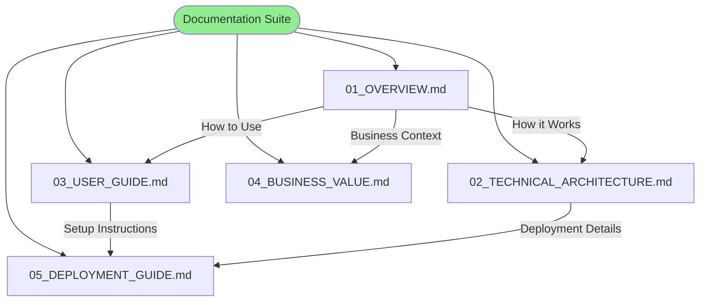

# TalentPulse Documentation

Welcome to the comprehensive documentation for **TalentPulse** - an AI-powered resume screening and candidate evaluation system.

## Documentation Overview

This documentation suite provides complete coverage of the TalentPulse system, from high-level business value to technical implementation details.

### Document Structure



---

## Quick Navigation

### For Business Stakeholders
**Start here**: [Business Value Analysis](./04_BUSINESS_VALUE.md)
- ROI calculations and financial impact
- Use case scenarios
- Competitive analysis
- Implementation roadmap

**Then read**: [Overview](./01_OVERVIEW.md)
- Executive summary
- Problem statement and solution
- Key features and benefits

---

### For End Users (HR/Recruiters)
**Start here**: [User Guide](./03_USER_GUIDE.md)
- Step-by-step usage instructions
- Understanding results
- Best practices
- FAQs and troubleshooting

**Then read**: [Overview](./01_OVERVIEW.md)
- System capabilities
- Workflow overview

---

### For Technical Teams
**Start here**: [Technical Architecture](./02_TECHNICAL_ARCHITECTURE.md)
- System architecture
- Component details
- Data flow diagrams
- Technology stack

**Then read**: [Deployment Guide](./05_DEPLOYMENT_GUIDE.md)
- Installation instructions
- Deployment options
- Configuration management
- Security and monitoring

---

### For Project Managers
**Start here**: [Overview](./01_OVERVIEW.md)
- Complete system overview
- Target users and use cases

**Then read**:
- [Business Value](./04_BUSINESS_VALUE.md) - ROI and implementation roadmap
- [User Guide](./03_USER_GUIDE.md) - User experience
- [Deployment Guide](./05_DEPLOYMENT_GUIDE.md) - Implementation requirements

---

## Document Summaries

### 01_OVERVIEW.md
**Purpose**: Comprehensive introduction to TalentPulse

**Contents**:
- Executive summary
- Problem statement and solution overview
- Key features and capabilities
- Technology stack overview
- System architecture diagrams
- Core workflow visualization
- Future enhancement opportunities

**Audience**: All stakeholders

**Read Time**: 15-20 minutes

**Key Takeaway**: Understanding what TalentPulse is, what problems it solves, and how it works at a high level.

---

### 02_TECHNICAL_ARCHITECTURE.md
**Purpose**: Deep dive into system architecture and technical design

**Contents**:
- Detailed architecture diagrams
- Component breakdown and relationships
- Data flow architecture
- Class diagrams and structure
- Technology stack analysis
- API integration points
- Security architecture
- Performance and scalability considerations

**Audience**: Developers, architects, technical leads

**Read Time**: 30-45 minutes

**Key Takeaway**: Complete technical understanding for development, maintenance, and enhancement.

---

### 03_USER_GUIDE.md
**Purpose**: Complete guide for end users

**Contents**:
- Getting started instructions
- System requirements
- Installation steps
- Configuration setup
- Detailed usage instructions
- Understanding and interpreting results
- Best practices
- Troubleshooting guide
- Comprehensive FAQs

**Audience**: HR professionals, recruiters, hiring managers

**Read Time**: 30-40 minutes (reference guide)

**Key Takeaway**: Everything needed to successfully use TalentPulse for resume screening.

---

### 04_BUSINESS_VALUE.md
**Purpose**: Business case and value analysis

**Contents**:
- Business problem analysis
- Value proposition
- Detailed ROI calculations
- Use case scenarios
- Competitive analysis
- Implementation roadmap
- Risk assessment
- Success metrics and KPIs
- Strategic recommendations

**Audience**: Executives, business stakeholders, decision-makers

**Read Time**: 25-35 minutes

**Key Takeaway**: Complete business justification for TalentPulse adoption.

---

### 05_DEPLOYMENT_GUIDE.md
**Purpose**: Technical deployment and operations guide

**Contents**:
- Pre-deployment checklist
- Local development setup
- Production deployment options
- Docker deployment
- Cloud deployment (AWS, Azure, Streamlit Cloud)
- Configuration management
- Security hardening
- Monitoring and maintenance
- Backup and disaster recovery
- Troubleshooting guide

**Audience**: DevOps, system administrators, IT operations

**Read Time**: 45-60 minutes (comprehensive reference)

**Key Takeaway**: Complete deployment knowledge from development to production.

---

## Reading Paths

### Path 1: Executive Decision-Maker (30 minutes)
1. **01_OVERVIEW.md** - Executive Summary section (5 min)
2. **04_BUSINESS_VALUE.md** - Executive Summary and ROI Analysis (15 min)
3. **04_BUSINESS_VALUE.md** - Implementation Roadmap (10 min)

**Outcome**: Understand value proposition, ROI, and implementation plan to make go/no-go decision.

---

### Path 2: End User (HR Professional) (40 minutes)
1. **01_OVERVIEW.md** - Solution Overview and Key Features (10 min)
2. **03_USER_GUIDE.md** - Getting Started and Usage Guide (20 min)
3. **03_USER_GUIDE.md** - Understanding Results and Best Practices (10 min)

**Outcome**: Ready to use TalentPulse effectively for resume screening.

---

### Path 3: Technical Implementer (90 minutes)
1. **01_OVERVIEW.md** - Complete overview (15 min)
2. **02_TECHNICAL_ARCHITECTURE.md** - Architecture and components (30 min)
3. **05_DEPLOYMENT_GUIDE.md** - Setup and deployment (30 min)
4. **05_DEPLOYMENT_GUIDE.md** - Security and monitoring (15 min)

**Outcome**: Ready to deploy and maintain TalentPulse in production.

---

### Path 4: Project Manager (60 minutes)
1. **01_OVERVIEW.md** - Complete overview (15 min)
2. **04_BUSINESS_VALUE.md** - Value proposition and use cases (20 min)
3. **04_BUSINESS_VALUE.md** - Implementation roadmap and risks (15 min)
4. **05_DEPLOYMENT_GUIDE.md** - Pre-deployment checklist (10 min)

**Outcome**: Ready to plan and manage TalentPulse implementation project.

---

## Key Concepts

### What is TalentPulse?
An AI-powered system that automates resume screening by:
- Parsing job descriptions into structured requirements
- Analyzing candidate resumes against those requirements
- Providing detailed scores with justifications
- Enabling objective comparison across candidates

### Core Technology
- **Frontend**: Streamlit (web interface)
- **AI/ML**: OpenAI GPT-4o-mini via LangChain
- **PDF Processing**: PyMuPDF
- **Data Processing**: Pandas
- **Monitoring**: LangSmith

### Key Benefits
- **90% time savings** in resume screening
- **Consistent evaluation** across all candidates
- **Objective, data-driven** decisions
- **Scalable** to any volume
- **Transparent** with detailed justifications

---

## Getting Help

### Documentation Questions
- Review the appropriate document from the list above
- Check the FAQ section in [User Guide](./03_USER_GUIDE.md)
- Refer to troubleshooting sections in relevant documents

### Technical Issues
1. Check [Troubleshooting Guide](./05_DEPLOYMENT_GUIDE.md#troubleshooting-guide)
2. Review application logs in `../logs/` directory
3. Check LangSmith dashboard for AI/ML issues
4. Contact technical support team

### Business Questions
- Review [Business Value Analysis](./04_BUSINESS_VALUE.md)
- Contact project sponsor or business owner
- Schedule demo or consultation

---

## Document Maintenance

### Version History
- **v1.0** (2024-12-20): Initial comprehensive documentation release
  - Complete system documentation
  - All five core documents
  - Mermaid diagrams throughout

### Update Schedule
- **Quarterly**: Review and update all documents
- **On Major Releases**: Update technical architecture and deployment guide
- **On Feature Changes**: Update user guide and overview
- **On Process Changes**: Update business value and implementation sections

### Contributing
To suggest improvements to documentation:
1. Create issue with suggested changes
2. Provide specific section and document
3. Explain rationale for change
4. Submit for review

---

## Quick Reference

### Common Tasks

| Task | Document | Section |
|------|----------|---------|
| Understand ROI | Business Value | ROI Analysis |
| Install locally | Deployment Guide | Local Development Setup |
| Upload resumes | User Guide | Using TalentPulse |
| Interpret scores | User Guide | Understanding Results |
| Deploy to cloud | Deployment Guide | Cloud Deployment |
| Configure security | Deployment Guide | Security Hardening |
| Troubleshoot errors | User Guide / Deployment Guide | Troubleshooting |
| View architecture | Technical Architecture | Architecture Overview |

### File Locations

```
talend_pulse/
├── app.py                          # Main application
├── prompts.py                      # LLM prompts
├── templates.py                    # Data models
├── utils.py                        # Utilities
├── config.ini                      # Configuration
├── requirements.txt                # Dependencies
├── .env                            # API keys (not in repo)
├── logs/                           # Application logs
├── samples/                        # Sample data
│   ├── job_description/
│   └── resume/
└── documentation/                  # This folder
    ├── README.md                   # This file
    ├── 01_OVERVIEW.md
    ├── 02_TECHNICAL_ARCHITECTURE.md
    ├── 03_USER_GUIDE.md
    ├── 04_BUSINESS_VALUE.md
    └── 05_DEPLOYMENT_GUIDE.md
```

---

## Diagrams Index

This documentation suite includes numerous Mermaid diagrams for visualization:

### Architecture Diagrams
- High-level system architecture
- Component architecture
- Data flow diagrams
- Class diagrams
- Deployment architectures

### Process Diagrams
- User workflow
- Processing sequences
- Data transformation flows
- Error handling flows

### Business Diagrams
- ROI models
- Risk matrices
- Implementation timelines
- Success metrics

All diagrams are rendered inline in the markdown documents and can be viewed directly in compatible markdown viewers (GitHub, VS Code with Mermaid extension, etc.).

---

## Best Practices for Using Documentation

### For First-Time Readers
1. Start with your role-specific reading path
2. Don't try to read everything at once
3. Use the documentation as a reference
4. Bookmark frequently accessed sections

### For Implementers
1. Read deployment guide thoroughly before starting
2. Keep checklist handy during implementation
3. Document any deviations or customizations
4. Update documentation with lessons learned

### For Maintainers
1. Review technical architecture periodically
2. Keep deployment guide updated with changes
3. Add new troubleshooting tips as discovered
4. Maintain version history

---

## Additional Resources

### External Links
- **Streamlit Documentation**: https://docs.streamlit.io
- **LangChain Documentation**: https://python.langchain.com
- **OpenAI API Reference**: https://platform.openai.com/docs
- **PyMuPDF Documentation**: https://pymupdf.readthedocs.io

### Related Tools
- **LangSmith**: https://smith.langchain.com (monitoring)
- **Streamlit Cloud**: https://streamlit.io/cloud (hosting)

### Community
- GitHub Issues: (repository issues page)
- Internal Slack: #talentpulse (if applicable)
- Email Support: (support email)

---

## Glossary

**AI/ML**: Artificial Intelligence / Machine Learning

**ATS**: Applicant Tracking System

**CV**: Curriculum Vitae (resume)

**GPT**: Generative Pre-trained Transformer (OpenAI's language model)

**JD**: Job Description

**LLM**: Large Language Model

**NPS**: Net Promoter Score

**PDF**: Portable Document Format

**ROI**: Return on Investment

**RPO**: Recovery Point Objective

**RTO**: Recovery Time Objective

**TLS/SSL**: Transport Layer Security / Secure Sockets Layer

---

## Contact Information

### Documentation Team
- **Author**: AIML Prototypes Team
- **Last Updated**: December 20, 2024
- **Version**: 1.0

### Support Channels
- **Technical Support**: (technical support contact)
- **Business Questions**: (business contact)
- **Emergency**: (emergency contact)

---

## License

(Add appropriate license information)

---

## Acknowledgments

This documentation was created to provide comprehensive guidance for all stakeholders involved in TalentPulse implementation and usage. Special thanks to all contributors and reviewers.

---

**Happy Reading!**

For questions or suggestions about this documentation, please contact the documentation team.
