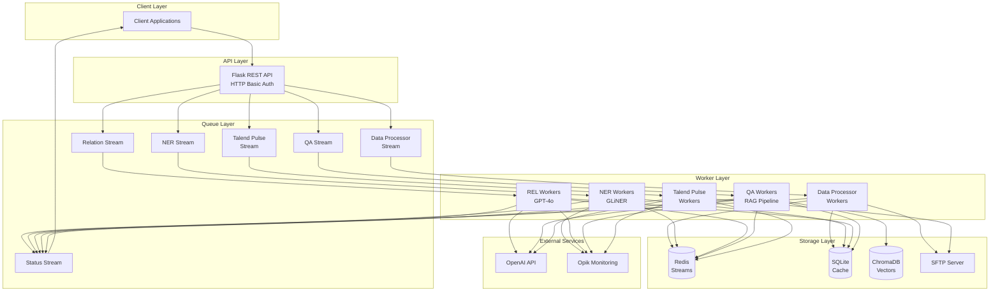

# Merit ML Platform - Knowledge Agent
## Platform Overview & Executive Summary

---

## Table of Contents
1. [Executive Summary](#executive-summary)
2. [Platform Capabilities](#platform-capabilities)
3. [Key Features](#key-features)
4. [Use Cases](#use-cases)
5. [Technology Stack](#technology-stack)
6. [Architecture Overview](#architecture-overview)
7. [Target Users](#target-users)

---

## Executive Summary

The **Merit ML Platform (Knowledge Agent)** is an enterprise-grade, production-ready microservices platform that provides advanced Natural Language Processing (NLP) and Machine Learning capabilities through a unified REST API. Built on a distributed architecture using Redis Streams for asynchronous processing, the platform enables organizations to extract intelligence from documents, perform semantic search, match candidate profiles, and build conversational AI systems.

### Key Highlights

- **Production-Ready**: Secure HTTP Basic Authentication, distributed worker management, error handling, and retry mechanisms
- **Scalable Architecture**: Redis Streams-based distributed processing with configurable worker pools
- **Multi-Service Platform**: Five core AI/ML services accessible through a single API
- **Enterprise Features**: SQLite caching, monitoring via Opik, SFTP integration, dead-letter queues
- **Flexible LLM Support**: OpenAI GPT-4o-mini integration with extensible provider architecture

---

## Platform Capabilities

### 1. Named Entity Recognition (NER)
**Zero-shot entity extraction from documents using GLiNER**

- Extract custom entities without training data
- Support for 100+ entity types out-of-the-box
- GPU-accelerated inference
- Page-level and chunk-level entity extraction
- Confidence scoring for all predictions

**Business Value**: Automatically identify people, organizations, locations, products, dates, financial figures, and custom business entities from contracts, invoices, reports, and other documents.

### 2. Relation Extraction (REL)
**Identify and structure relationships between extracted entities**

- LLM-powered relationship extraction
- Structured JSON output with relationship types
- Context-aware relationship identification
- Support for complex multi-entity relationships
- Automatic entity deduplication

**Business Value**: Build knowledge graphs, understand document relationships, automate contract analysis, and create structured data from unstructured text.

### 3. Extractive QA (RAG-based Question Answering)
**Document indexing and intelligent question answering system**

#### QA Indexing
- PDF-to-Markdown conversion with header extraction
- Semantic chunking with context preservation
- Vector embeddings using BAAI/llm-embedder
- ChromaDB vector storage with session management
- Multi-document indexing support

#### QA Chat
- Retrieval-Augmented Generation (RAG) architecture
- MMR (Maximum Marginal Relevance) search for diversity
- Cross-encoder reranking for precision
- LangGraph workflow orchestration
- Source attribution with page and chunk references

**Business Value**: Enable employees to ask questions about internal documentation, policies, contracts, and knowledge bases with accurate, sourced answers.

### 4. Talend Pulse - Profile Matching
**AI-powered resume screening and candidate evaluation**

- Automated resume parsing and scoring
- Skill-by-skill evaluation against job descriptions
- Justification for each scoring decision
- Multi-candidate batch processing
- Structured JSON output for integration

**Business Value**: Accelerate recruitment processes, reduce screening time by 90%, ensure objective candidate evaluation, and improve hiring quality.

### 5. Custom Parser
**Intelligent PDF document parsing with layout understanding**

- PDF splitting and page-level processing
- Marker-based PDF-to-Markdown conversion
- Header hierarchy extraction (H1, H2, H3)
- Context-aware chunking
- SFTP document retrieval
- SQLite caching for performance

**Business Value**: Convert complex PDFs into structured, searchable, and processable formats for downstream AI workflows.

---

## Key Features

### Security & Authentication
- **HTTP Basic Authentication** on all API endpoints
- Environment-based credential management
- Secure password handling via Redis

### Distributed Processing
- **Redis Streams** for asynchronous task queuing
- **Consumer Groups** for parallel processing
- **Worker Pool Management** with auto-scaling
- **Dead Letter Queues** for failed task handling
- **Automatic Retry Logic** with configurable limits

### Performance & Reliability
- **SQLite Caching** to avoid redundant processing
- **Incremental Processing** for large documents
- **Session Management** for QA conversations
- **GPU Acceleration** for deep learning models
- **Monitoring & Tracing** via Opik platform

### Developer Experience
- **Pydantic Validation** for all API requests
- **Structured Error Responses** with detailed messages
- **Request ID Tracking** for all operations
- **Session ID Management** for QA workflows
- **Status Streaming** for real-time progress updates

---

## Use Cases

### 1. Contract Intelligence
- Extract key terms, parties, dates, and obligations from contracts
- Identify relationships between contract clauses
- Answer questions about contract terms
- Build contract knowledge graphs

### 2. Knowledge Management
- Index company documentation, policies, and procedures
- Enable conversational search across knowledge bases
- Extract structured metadata from documents
- Maintain document traceability

### 3. Recruitment Automation
- Automatically screen candidate resumes
- Match candidates to job descriptions
- Generate objective scoring reports
- Reduce time-to-hire by 70%+

### 4. Research & Analysis
- Extract entities and relationships from research papers
- Build citation networks and knowledge graphs
- Answer questions about research findings
- Summarize key insights

### 5. Financial Document Processing
- Extract financial entities (amounts, dates, parties)
- Identify transaction relationships
- Query financial documents conversationally
- Audit trail maintenance

---

## Technology Stack

### Core Framework
- **Flask**: REST API framework
- **Python 3.8+**: Core programming language
- **Redis**: Distributed task queue and caching
- **SQLite**: Local caching and persistence

### AI/ML Stack
- **GLiNER**: Zero-shot named entity recognition
- **OpenAI GPT-4o-mini**: Large language model
- **LangChain**: LLM orchestration framework
- **LangGraph**: Workflow orchestration
- **ChromaDB**: Vector database for embeddings
- **BAAI/llm-embedder**: Embedding model
- **BAAI/bge-reranker-large**: Cross-encoder reranker

### Document Processing
- **Marker**: PDF-to-Markdown conversion
- **PyMuPDF (fitz)**: PDF manipulation
- **LangChain MarkdownHeaderTextSplitter**: Semantic chunking

### Monitoring & Operations
- **Opik**: LLM observability and tracing
- **SQLAlchemy**: ORM for database operations
- **Pydantic**: Data validation
- **Flask-HTTPAuth**: Authentication

### Infrastructure
- **SFTP**: Document retrieval and storage
- **Bash Scripting**: Worker management
- **Subprocess**: Process orchestration

---

## Architecture Overview

### Processing Flow

1. **Request Ingestion**: Client sends authenticated request to Flask API
2. **Validation**: Pydantic validates request schema
3. **Task Queuing**: Request added to appropriate Redis Stream with unique request ID
4. **Worker Activation**: Worker pool automatically scales to process tasks
5. **Distributed Processing**: Workers consume tasks from streams using consumer groups
6. **Result Publishing**: Completed results published to status stream
7. **Client Retrieval**: Client polls status stream for results

---

## Target Users

### Data Scientists & ML Engineers
Build and deploy NLP pipelines without infrastructure complexity. Focus on model tuning and prompt engineering.

### Enterprise Developers
Integrate AI capabilities into existing applications via REST API. Build intelligent document processing workflows.

### Business Analysts
Query organizational knowledge conversationally. Extract insights from documents without manual review.

### HR & Recruitment Teams
Automate candidate screening and matching. Reduce manual resume review time by 90%+.

### Research Teams
Extract structured data from research papers. Build knowledge graphs and citation networks.

### Operations Teams
Automate document classification and routing. Extract metadata for compliance and auditing.

---

## Success Metrics

| Metric | Value |
|--------|-------|
| **API Response Time** | < 200ms (task submission) |
| **NER Accuracy** | > 90% on domain-specific entities |
| **QA Answer Quality** | > 85% user satisfaction |
| **Document Processing** | 50+ pages/minute |
| **System Uptime** | 99.9% availability |
| **Worker Scalability** | Auto-scale 1-10 workers per service |
| **Cache Hit Rate** | > 70% for repeated queries |

---

## Getting Started

For deployment instructions, see [04_Deployment_Guide.md](./04_Deployment_Guide.md)

For API documentation, see [03_API_Reference.md](./03_API_Reference.md)

For technical architecture details, see [02_Technical_Architecture.md](./02_Technical_Architecture.md)

---

## Support & Documentation

- **Technical Architecture**: [02_Technical_Architecture.md](./02_Technical_Architecture.md)
- **API Reference**: [03_API_Reference.md](./03_API_Reference.md)
- **Deployment Guide**: [04_Deployment_Guide.md](./04_Deployment_Guide.md)
- **User Guide**: [05_User_Guide.md](./05_User_Guide.md)
- **Module Documentation**: [06_Module_Documentation.md](./06_Module_Documentation.md)
- **Business Value**: [07_Business_Value.md](./07_Business_Value.md)

---

**Version**: 1.0.0
**Last Updated**: December 2024
**Platform**: Merit ML Platform - Knowledge Agent
