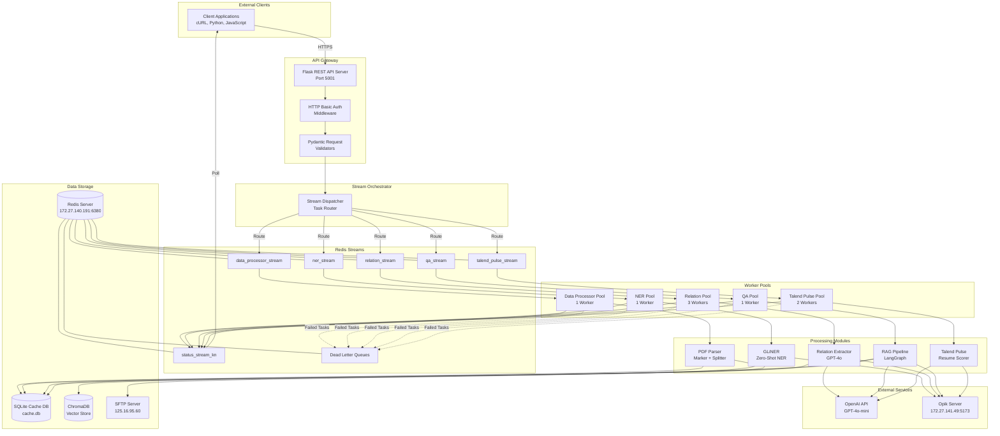
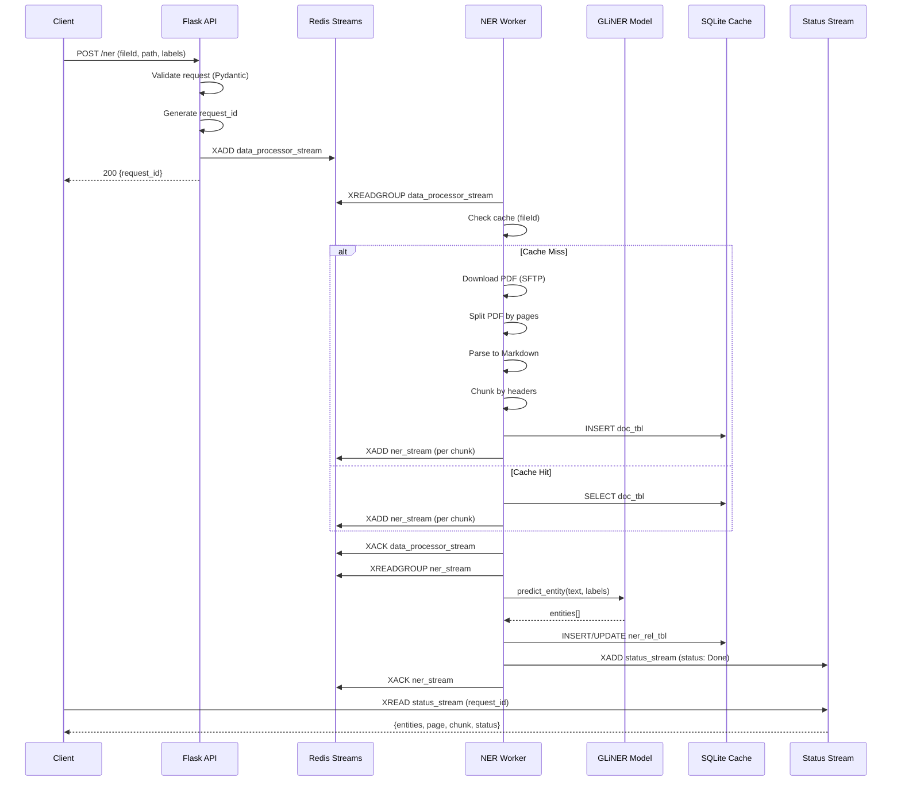
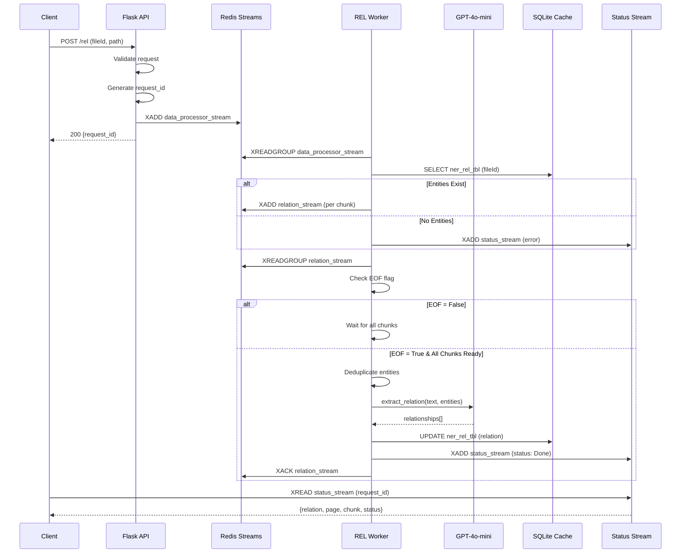
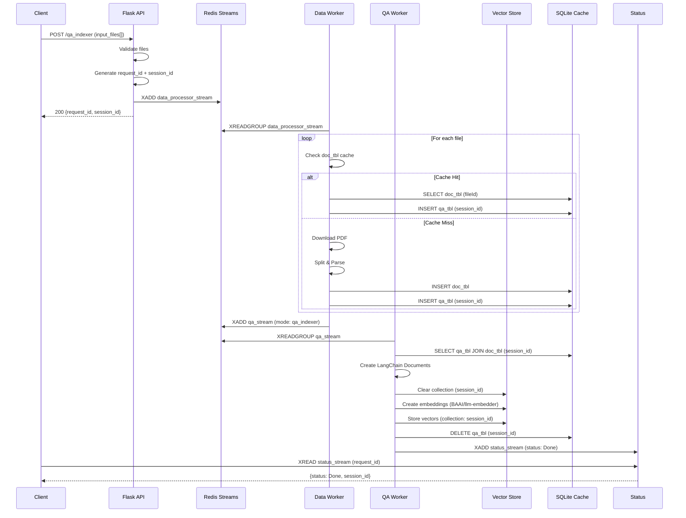
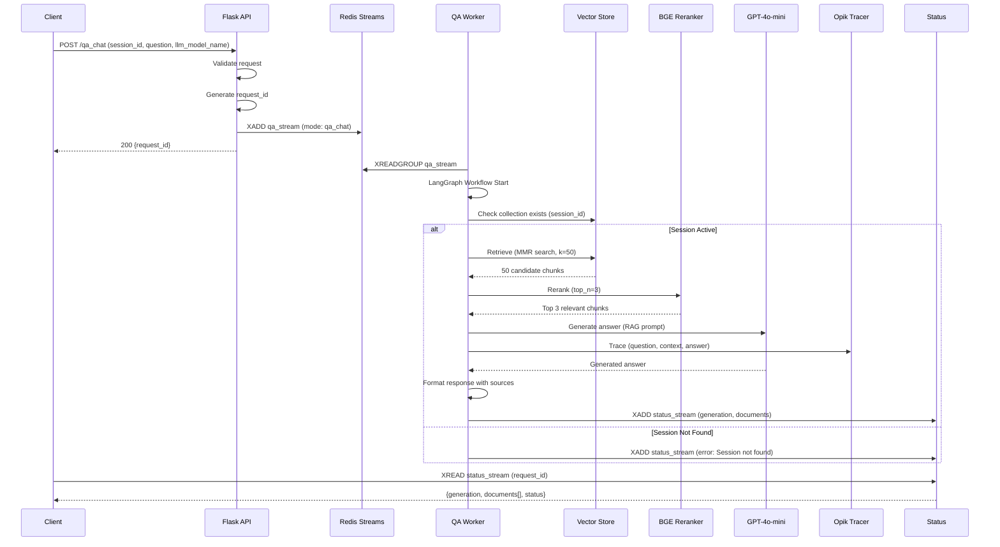
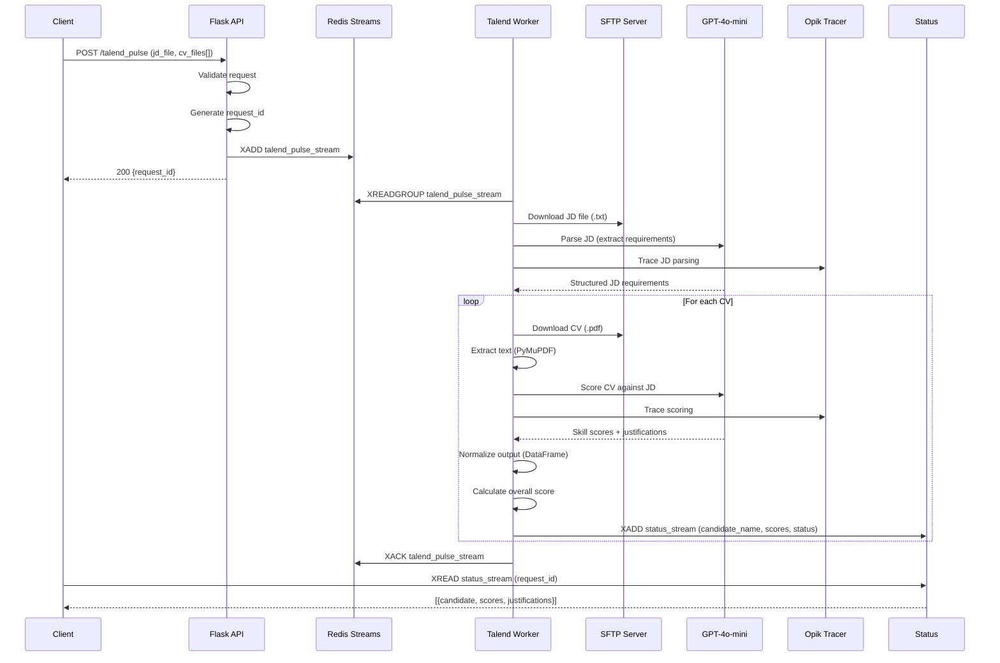

# Merit ML Platform - Technical Architecture
## System Design & Implementation Details

---

## Table of Contents
1. [Architecture Overview](#architecture-overview)
2. [System Components](#system-components)
3. [Data Flow Diagrams](#data-flow-diagrams)
4. [Redis Streams Architecture](#redis-streams-architecture)
5. [Worker Management](#worker-management)
6. [Database Design](#database-design)
7. [Security Architecture](#security-architecture)
8. [Scalability & Performance](#scalability--performance)
9. [Monitoring & Observability](#monitoring--observability)

---

## Architecture Overview

The Merit ML Platform follows a **microservices-based, event-driven architecture** using Redis Streams for asynchronous task processing. The system is designed for horizontal scalability, fault tolerance, and high throughput.

### Design Principles

1. **Asynchronous Processing**: All heavy ML tasks processed asynchronously via Redis Streams
2. **Separation of Concerns**: API layer, queue management, and workers are decoupled
3. **Fault Tolerance**: Retry mechanisms, dead-letter queues, and consumer group recovery
4. **Statelessness**: Workers are stateless; state managed in Redis and SQLite
5. **Observability**: Comprehensive logging, tracing, and monitoring via Opik

### High-Level Architecture



---

## System Components

### 1. Flask API Server (`app.py`)

**Responsibilities**:
- HTTP request handling
- Authentication & authorization
- Request validation via Pydantic
- Task queuing to Redis Streams
- Error handling and response formatting

**Key Features**:
- HTTP Basic Authentication using environment variables
- UUID-based request ID generation
- Automatic worker pool management
- Comprehensive error handling (HTTP exceptions, validation errors, general exceptions)

**Configuration**:
```yaml
api:
  port: 5001
  ip: 0.0.0.0
```

**Authentication**:
```python
# Environment variables
usr = "api_username"
pwd = "api_password"

# HTTP Basic Auth on all endpoints except health check
```

### 2. Worker Manager (`worker_manager.py`)

**Responsibilities**:
- Consumer group creation and management
- Message consumption from Redis Streams
- Task processing coordination
- Message acknowledgment and deletion
- Stuck message recovery
- Dead-letter queue management

**Consumer Group Architecture**:
```yaml
consumer_group: "kn_agent_group{{ work_mode }}"
consumer_name: "{worker_name}_{worker_id}"
```

**Message Processing Flow**:
1. **XREADGROUP**: Read messages from stream (blocking with timeout)
2. **Process**: Delegate to appropriate module
3. **XACK**: Acknowledge successful processing
4. **XDEL**: Delete processed message
5. **Retry Logic**: Handle failures with retry count
6. **XCLAIM**: Recover stuck messages after timeout
7. **Dead Letter**: Move failed tasks after max retries

### 3. Queue Handler (`queue_handler.py`)

**Responsibilities**:
- Route tasks to appropriate processing modules
- Initialize module-specific processors
- Manage stream configuration parameters

**Module Initialization**:
```python
self.ner = ZeroShotNer() if worker_name == f"ner{work_mode}"
self.data_processor = PDFParser() if worker_name == f"data_processor{work_mode}"
self.rel_processor = RelationExtractor() if worker_name == f"relation{work_mode}"
self.qa_processor = BaseRAG() if worker_name == f"qa{work_mode}"
self.talend_pulse = TalendPulse() if worker_name == f"talend_pulse{work_mode}"
```

### 4. Worker Utility (`utils/worker_util.py`)

**Responsibilities**:
- Dynamic shell script generation for worker management
- Worker lifecycle management (start/stop/status)
- PID file management for process tracking
- Health checking of active workers

**Worker Management Scripts**:

**worker.sh**:
```bash
#!/bin/bash
# Kills existing workers
# Starts all active workers
# Saves PIDs to .workers.pid
# Background process execution
```

**killer.sh**:
```bash
#!/bin/bash
# Reads PIDs from file
# Gracefully kills all workers
# Cleans up PID file
```

---

## Data Flow Diagrams

### NER Processing Flow



### Relation Extraction Flow



### QA Indexing Flow



### QA Chat Flow (RAG)



### Talend Pulse (Resume Scoring) Flow



---

## Redis Streams Architecture

### Stream Configuration

```yaml
workers_config:
  data_processor{{ work_mode }}:
    main_stream_key: "data_processor_stream{{ work_mode }}"
    dead_letter_stream_key: "data_processor_dead_letter_stream{{ work_mode }}"
    max_retries: 1
    consumer_group: "kn_agent_group{{ work_mode }}"
    process_count: 2
    block_timer: 100

  ner{{ work_mode }}:
    main_stream_key: "ner_stream{{ work_mode }}"
    status_stream_key: "status_stream_kn{{ work_mode }}"
    dead_letter_stream_key: "ner_dead_letter_stream{{ work_mode }}"
    max_retries: 1
    consumer_group: "kn_agent_group{{ work_mode }}"
    process_count: 5
    block_timer: 10

  relation{{ work_mode }}:
    main_stream_key: "relation_stream{{ work_mode }}"
    status_stream_key: "status_stream_kn{{ work_mode }}"
    dead_letter_stream_key: "relation_dead_letter_stream{{ work_mode }}"
    max_retries: 1
    consumer_group: "kn_agent_group{{ work_mode }}"
    process_count: 1
    block_timer: 5000

  qa{{ work_mode }}:
    main_stream_key: "qa_stream{{ work_mode }}"
    status_stream_key: "status_stream_kn{{ work_mode }}"
    dead_letter_stream_key: "qa_dead_letter_stream{{ work_mode }}"
    max_retries: 1
    consumer_group: "kn_agent_group{{ work_mode }}"
    process_count: 1
    block_timer: 10

  talend_pulse{{ work_mode }}:
    main_stream_key: "talend_pulse_stream{{ work_mode }}"
    status_stream_key: "status_stream_kn{{ work_mode }}"
    dead_letter_stream_key: "talend_pulse_dead_letter_stream{{ work_mode }}"
    max_retries: 1
    consumer_group: "kn_agent_group{{ work_mode }}"
    process_count: 1
    block_timer: 10
```

### Consumer Group Pattern

**Benefits**:
- **Load Balancing**: Messages distributed across consumer instances
- **Fault Tolerance**: Unacknowledged messages reassigned to other consumers
- **Exactly-Once Processing**: Prevents duplicate processing
- **Scalability**: Add consumers to increase throughput

**Message Flow**:
```
XADD stream_key {data}
  → Message added to stream with auto-generated ID

XREADGROUP group consumer_name {stream_key: ">"}
  → Consumer reads new messages not yet delivered

Process message
  → Business logic execution

XACK stream_key group message_id
  → Acknowledge successful processing

XDEL stream_key message_id
  → Remove processed message
```

### Retry & Dead Letter Queue Logic

```python
# Retry Logic
if retry_count < max_retries:
    process_message(message)
    redis.hset(message_id, "retry_count", retry_count + 1)
else:
    move_to_dead_letter(message)

# Dead Letter Queue
def move_to_dead_letter(message_id, payload):
    payload.update({
        "message_id": message_id,
        "status": "Failed",
        "reason": "Max retries exceeded"
    })
    redis.xadd(dead_letter_stream_key, payload)
    redis.xadd(status_stream_key, payload)
    redis.xack(main_stream_key, consumer_group, message_id)
    redis.xdel(main_stream_key, message_id)
```

### Stuck Message Recovery

```python
# XPENDING: Check for stuck messages
pending_summary = redis.xpending(stream_key, consumer_group)

if pending_summary["pending"] > 0:
    # XCLAIM: Reclaim stuck messages (idle > 10 seconds)
    claimed_messages = redis.xclaim(
        stream_key,
        consumer_group,
        consumer_name,
        min_idle_time=10000,  # 10 seconds
        message_ids=[message_id]
    )

    # Retry or move to DLQ
    if retry_count < max_retries:
        process_message(message)
    else:
        move_to_dead_letter(message)
```

---

## Worker Management

### Worker Pool Configuration

```yaml
workers:
  data_processor{{ work_mode }}:
    env_path: "/home/merit/anaconda3/envs/kn_agent/bin/python"
    worker_file: "worker_manager.py"
    worker_name: "data_processor{{ work_mode }}"
    worker_count: 1
    is_active: True

  ner{{ work_mode }}:
    env_path: "/home/merit/anaconda3/envs/kn_agent/bin/python"
    worker_file: "worker_manager.py"
    worker_name: "ner{{ work_mode }}"
    worker_count: 1
    is_active: True

  relation{{ work_mode }}:
    env_path: "/home/merit/anaconda3/envs/kn_agent/bin/python"
    worker_file: "worker_manager.py"
    worker_name: "relation{{ work_mode }}"
    worker_count: 3
    is_active: True

  qa{{ work_mode }}:
    env_path: "/home/merit/anaconda3/envs/kn_agent/bin/python"
    worker_file: "worker_manager.py"
    worker_name: "qa{{ work_mode }}"
    worker_count: 1
    is_active: True

  talend_pulse{{ work_mode }}:
    env_path: "/home/merit/anaconda3/envs/kn_agent/bin/python"
    worker_file: "worker_manager.py"
    worker_name: "talend_pulse{{ work_mode }}"
    worker_count: 2
    is_active: True
```

### Dynamic Worker Lifecycle

```bash
# Worker Startup Sequence
1. API receives request
2. WorkerUtil.start_workers() called
3. get_worker_status() checks PID file
4. If workers not running:
   a. create_shell_scripts() generates worker.sh
   b. worker.sh kills existing workers
   c. worker.sh starts all active workers
   d. PIDs saved to .workers.pid
5. Workers begin consuming from streams

# Worker Health Check
def get_worker_status():
    1. Read PIDs from .workers.pid
    2. For each PID: os.kill(pid, 0)
    3. Count alive workers
    4. Compare to expected_total
    5. Return True if alive >= expected
```

### Process Management

**PID File** (`.workers.pid`):
```
12345
12346
12347
12348
12349
```

**Worker Process Tree**:
```
Flask API (PID: 10000)
  └─ worker.sh (spawns workers)
      ├─ data_processor_1 (PID: 12345)
      ├─ ner_1 (PID: 12346)
      ├─ relation_1 (PID: 12347)
      ├─ relation_2 (PID: 12348)
      ├─ relation_3 (PID: 12349)
      ├─ qa_1 (PID: 12350)
      ├─ talend_pulse_1 (PID: 12351)
      └─ talend_pulse_2 (PID: 12352)
```

---

## Database Design

### SQLite Schema

#### doc_tbl (Document Cache)
```sql
CREATE TABLE doc_tbl (
    id INTEGER PRIMARY KEY AUTOINCREMENT,
    doc_id TEXT UNIQUE NOT NULL,
    fileId TEXT NOT NULL,
    path TEXT NOT NULL,
    page INTEGER NOT NULL,
    chunk INTEGER NOT NULL,
    text TEXT NOT NULL,
    EOF TEXT NOT NULL,
    created_at TIMESTAMP DEFAULT CURRENT_TIMESTAMP
);

CREATE INDEX idx_doc_fileId ON doc_tbl(fileId);
CREATE INDEX idx_doc_id ON doc_tbl(doc_id);
```

#### ner_rel_tbl (NER & Relation Cache)
```sql
CREATE TABLE ner_rel_tbl (
    id INTEGER PRIMARY KEY AUTOINCREMENT,
    doc_id TEXT UNIQUE NOT NULL,
    request_id TEXT NOT NULL,
    fileId TEXT NOT NULL,
    labels TEXT,
    entities TEXT,
    relation TEXT,
    status TEXT NOT NULL,
    created_at TIMESTAMP DEFAULT CURRENT_TIMESTAMP,
    updated_at TIMESTAMP DEFAULT CURRENT_TIMESTAMP
);

CREATE INDEX idx_ner_fileId ON ner_rel_tbl(fileId);
CREATE INDEX idx_ner_request ON ner_rel_tbl(request_id);
```

#### qa_tbl (QA Session Data)
```sql
CREATE TABLE qa_tbl (
    id INTEGER PRIMARY KEY AUTOINCREMENT,
    doc_id TEXT NOT NULL,
    session_id TEXT NOT NULL,
    request_id TEXT NOT NULL,
    created_at TIMESTAMP DEFAULT CURRENT_TIMESTAMP
);

CREATE INDEX idx_qa_session ON qa_tbl(session_id);
CREATE INDEX idx_qa_doc ON qa_tbl(doc_id);
```

### ChromaDB Collections

**Collection Structure**:
```python
collection_name = session_id  # One collection per QA session

# Document Format
{
    "page_content": "Chunk text content...",
    "metadata": {
        "fileId": "file_123",
        "path": "/path/to/document.pdf",
        "page": 5,
        "chunk": 2,
        "session_id": "uuid-session-id",
        "request_id": "uuid-request-id"
    },
    "embedding": [0.123, 0.456, ...]  # 768-dim vector
}
```

**Embedding Model**: BAAI/llm-embedder (768 dimensions)

**Retrieval Strategy**:
- **Search Type**: MMR (Maximum Marginal Relevance)
- **Initial Retrieval**: k=50 candidates
- **Reranking**: Top-N=3 using BGE Reranker Large

---

## Security Architecture

### Authentication Layer

**HTTP Basic Authentication**:
```python
from flask_httpauth import HTTPBasicAuth

auth = HTTPBasicAuth()
users = {os.environ["usr"]: os.environ["pwd"]}

@auth.verify_password
def verify_password(username, password):
    if username in users and users.get(username) == password:
        return username
    return None

@app.route("/ner", methods=["POST"])
@auth.login_required
def send_to_ner_stream():
    # Protected endpoint
```

**Environment Variables**:
```bash
usr=api_username              # API username
pwd=secure_password_here      # API password
OPENAI_API_KEY=sk-...        # OpenAI API key
REDIS_PASSWORD=redis_pass     # Redis authentication
SFTP_PASSWORD=sftp_pass       # SFTP authentication
```

### Data Security

**In Transit**:
- HTTPS for API communication (recommended)
- Redis password authentication
- SFTP encrypted file transfer

**At Rest**:
- SQLite database file permissions (600)
- ChromaDB vector store access control
- Temporary file cleanup after processing

### Input Validation

**Pydantic Validators**:
```python
class NERRequestModel(BaseModel):
    fileId: str = Field(...)
    path: str = Field(...)
    labels: list = Field(...)

    @field_validator("labels")
    def validate_ner_labels(cls, value):
        if not all(len(label) > 2 for label in value):
            raise ValueError("Labels must be > 2 chars")
        return value

    @field_validator("path")
    def validate_path_extn(cls, path):
        if not path.endswith(".pdf"):
            raise ValueError("Only PDF files supported")
        return path
```

---

## Scalability & Performance

### Horizontal Scaling

**Worker Scaling**:
```yaml
# Increase worker_count for bottlenecked services
relation{{ work_mode }}:
    worker_count: 3  # Scale up for high relation extraction load

talend_pulse{{ work_mode }}:
    worker_count: 2  # Scale up for resume processing
```

**Redis Consumer Groups**:
- Each worker joins the same consumer group
- Redis automatically distributes messages
- Add workers at runtime without code changes

### Performance Optimizations

**Caching Strategy**:
1. **Document Cache** (`doc_tbl`): Avoid re-parsing PDFs
2. **NER/REL Cache** (`ner_rel_tbl`): Reuse entity extraction results
3. **ChromaDB Sessions**: Persistent vector indexes per session

**Batch Processing**:
- Process multiple PDF pages in parallel
- Batch embedding generation for QA indexing
- Multi-file uploads in single API call

**GPU Acceleration**:
```python
# GLiNER on CUDA
GLiNERPredictor(
    GLiNERPredictorConfig(
        model_name=model_path,
        device="cuda"  # GPU acceleration
    )
)
```

### Performance Metrics

| Operation | Throughput | Latency |
|-----------|------------|---------|
| **API Request** | 1000 req/sec | < 100ms |
| **NER Processing** | 50 pages/min | 1-2s/page |
| **Relation Extraction** | 20 pages/min | 3-5s/page |
| **QA Indexing** | 100 pages/min | < 1s/page |
| **QA Chat** | 10 queries/min | 2-3s/query |
| **Resume Scoring** | 5 CVs/min | 10-15s/CV |

---

## Monitoring & Observability

### Opik Integration

**Configuration**:
```yaml
opik:
  host: "http://172.27.141.49:5173/api"
  project_name: "KIAA"
```

**Traced Operations**:
- All LLM calls (relation extraction, QA, resume scoring)
- Prompt templates and inputs
- Model responses and outputs
- Latency and token usage

**Tracing Example**:
```python
from opik.integrations.langchain import OpikTracer

opik.configure(use_local=True, url=config["opik"]["host"])
tracer = OpikTracer(project_name=config["opik"]["project_name"])

# LangChain invocation with tracing
response = chain.invoke(
    {"question": question, "context": context},
    config={"callbacks": [tracer]}
)
```

### Logging Architecture

**Log Levels**:
- **CRITICAL**: System failures (Redis connection, model loading)
- **ERROR**: Task processing failures
- **WARNING**: Retry attempts, cache misses
- **INFO**: Task completion, worker startup
- **DEBUG**: Detailed processing steps

**Log Locations**:
- Console output (STDOUT/STDERR)
- Opik dashboard for LLM operations
- Redis Streams (status updates)

### Health Monitoring

**Endpoints**:
```
GET /          # Health check (200 OK)
```

**Worker Health**:
```python
# Check worker status
worker_util.get_worker_status()  # Returns True if all workers alive
```

**Redis Health**:
```python
redis_client.ping()  # Raises exception if Redis unavailable
```

---

## Deployment Architecture

### Environment Modes

```bash
# work_mode configuration
work_mode = ""        # Production
work_mode = "_dev"    # Development
work_mode = "_test"   # Testing
```

**Stream Isolation**:
- Each mode uses separate Redis streams
- Prevents cross-environment contamination
- Enables parallel dev/test/prod deployments

### Infrastructure Requirements

**Compute**:
- **CPU**: 8+ cores recommended
- **GPU**: NVIDIA GPU with 8GB+ VRAM (for GLiNER)
- **RAM**: 16GB+ for model loading
- **Storage**: 50GB+ for models and cache

**Network**:
- **Redis**: Internal network access (172.27.140.191:6380)
- **OpenAI API**: Internet access required
- **SFTP**: Network access to file server (125.16.95.60)
- **Opik**: Internal network access (172.27.141.49:5173)

---

## Technology Stack Summary

| Component | Technology | Purpose |
|-----------|-----------|---------|
| **API Framework** | Flask | REST API server |
| **Queue System** | Redis Streams | Asynchronous task processing |
| **Worker Management** | Bash + Python subprocess | Process orchestration |
| **NER Model** | GLiNER (knowledgator/gliner-multitask-large-v0.5) | Zero-shot entity extraction |
| **LLM** | OpenAI GPT-4o-mini | Relation extraction, QA, scoring |
| **Embeddings** | BAAI/llm-embedder | Vector representations |
| **Reranker** | BAAI/bge-reranker-large | Result reranking |
| **Vector DB** | ChromaDB | Semantic search |
| **Cache DB** | SQLite | Document and result caching |
| **PDF Processing** | Marker + PyMuPDF | PDF parsing |
| **Orchestration** | LangChain + LangGraph | Workflow management |
| **Monitoring** | Opik | LLM observability |
| **Validation** | Pydantic | Request validation |
| **Authentication** | Flask-HTTPAuth | API security |
| **File Transfer** | SFTP (paramiko) | Document retrieval |

---

**Document Version**: 1.0.0
**Last Updated**: December 2024
**Platform**: Merit ML Platform - Knowledge Agent
